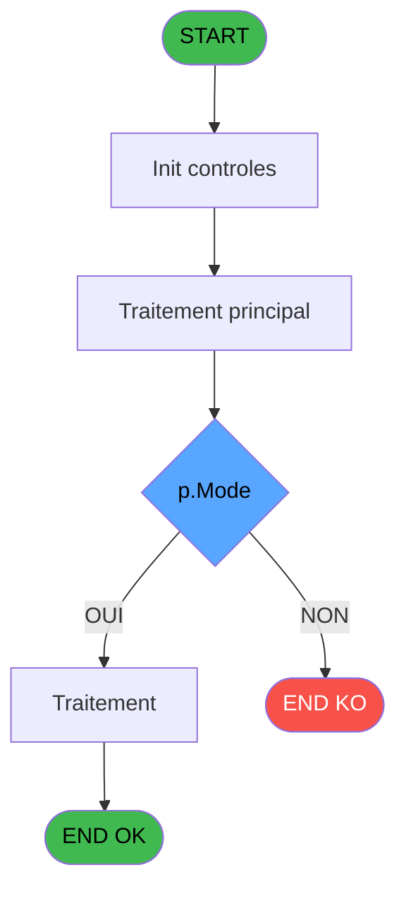

# PBG IDE 274 - Affichage Log Purge Unit

> **Analyse**: Phases 1-4 2026-02-03 10:45 -> 10:46 (21s) | Assemblage 10:46
> **Pipeline**: V7.2 Enrichi
> **Structure**: 4 onglets (Resume | Ecrans | Donnees | Connexions)

<!-- TAB:Resume -->

## 1. FICHE D'IDENTITE

| Attribut | Valeur |
|----------|--------|
| Projet | PBG |
| IDE Position | 274 |
| Nom Programme | Affichage Log Purge Unit |
| Fichier source | `Prg_274.xml` |
| Domaine metier | General |
| Taches | 2 (1 ecrans visibles) |
| Tables modifiees | 0 |
| Programmes appeles | 0 |

## 2. DESCRIPTION FONCTIONNELLE

**Affichage Log Purge Unit** assure la gestion complete de ce processus, accessible depuis [Compte Rendu Arrivants (IDE 248)](PBG-IDE-248.md), [Affichage Log Purge Unitaire (IDE 273)](PBG-IDE-273.md).

Le flux de traitement s'organise en **2 blocs fonctionnels** :

- **Impression** (1 tache) : generation de tickets et documents
- **Consultation** (1 tache) : ecrans de recherche, selection et consultation

**Logique metier** : 3 regles identifiees couvrant conditions metier, valeurs par defaut.

Detail : phases du traitement

#### Phase 1 : Consultation (1 tache)

- **274** - Affichage Log Purge Unit **[[ECRAN]](#ecran-t1)**

#### Phase 2 : Impression (1 tache)

- **274.1** - Edition Log PYR **[[ECRAN]](#ecran-t4)**

## 3. BLOCS FONCTIONNELS

### 3.1 Consultation (1 tache)

Ecrans de recherche et consultation.

---

#### 274 - Affichage Log Purge Unit [[ECRAN]](#ecran-t1)

**Role** : Reinitialisation : Affichage Log Purge Unit.
**Ecran** : 1719 x 250 DLU | [Voir mockup](#ecran-t1)

### 3.2 Impression (1 tache)

Generation des documents et tickets.

---

#### 274.1 - Edition Log PYR [[ECRAN]](#ecran-t4)

**Role** : Generation du document : Edition Log PYR.
**Ecran** : 365 x 66 DLU | [Voir mockup](#ecran-t4)

## 5. REGLES METIER

3 regles identifiees:

### Autres (3 regles)

#### [RM-001] Si p.Mode [A] vaut 'Y' alors 'Log des purges unitaires', sinon 'Log des erreurs de purge unitaire'

| Element | Detail |
|---------|--------|
| **Condition** | `p.Mode [A]='Y'` |
| **Si vrai** | 'Log des purges unitaires' |
| **Si faux** | 'Log des erreurs de purge unitaire') |
| **Variables** | A (p.Mode) |
| **Expression source** | Expression 7 : `IF(p.Mode [A]='Y','Log des purges unitaires','Log des erreur` |
| **Exemple** | Si p.Mode [A]='Y' → 'Log des purges unitaires'. Sinon → 'Log des erreurs de purge unitaire') |

#### [RM-002] Valeur par defaut si Trim(p.Mode [A]) est vide

| Element | Detail |
|---------|--------|
| **Condition** | `Trim(p.Mode [A])=''` |
| **Si vrai** | IF(InStr(Menu() |
| **Si faux** | 'Erreur')>0 OR InStr(Menu(),'Error')>0,'N','Y'),p.Mode [A]) |
| **Variables** | A (p.Mode) |
| **Expression source** | Expression 10 : `IF(Trim(p.Mode [A])='',IF(InStr(Menu(),'Erreur')>0 OR InStr(` |
| **Exemple** | Si Trim(p.Mode [A])='' → IF(InStr(Menu(). Sinon → 'Erreur')>0 OR InStr(Menu(),'Error')>0,'N','Y'),p.Mode [A]) |

#### [RM-003] Si p.Mode [A]<>'Y' alors 209 sinon 209-70.5)

| Element | Detail |
|---------|--------|
| **Condition** | `p.Mode [A]<>'Y'` |
| **Si vrai** | 209 |
| **Si faux** | 209-70.5) |
| **Variables** | A (p.Mode) |
| **Expression source** | Expression 12 : `IF(p.Mode [A]<>'Y',209,209-70.5)` |
| **Exemple** | Si p.Mode [A]<>'Y' → 209. Sinon → 209-70.5) |

## 6. CONTEXTE

- **Appele par**: [Compte Rendu Arrivants (IDE 248)](PBG-IDE-248.md), [Affichage Log Purge Unitaire (IDE 273)](PBG-IDE-273.md)
- **Appelle**: 0 programmes | **Tables**: 4 (W:0 R:1 L:3) | **Taches**: 2 | **Expressions**: 17

<!-- TAB:Ecrans -->

## 8. ECRANS

### 8.1 Forms visibles (1 / 2)

| # | Position | Tache | Nom | Type | Largeur | Hauteur | Bloc |
|---|----------|-------|-----|------|---------|---------|------|
| 1 | 274 | 274 | Affichage Log Purge Unit | Type0 | 1719 | 250 | Consultation |

### 8.2 Mockups Ecrans

---

#### 274 - Affichage Log Purge Unit
**Tache** : [274](#t1) | **Type** : Type0 | **Dimensions** : 1719 x 250 DLU
**Bloc** : Consultation | **Titre IDE** : Affichage Log Purge Unit

<!-- FORM-DATA:
{
    "width":  1719,
    "vFactor":  8,
    "type":  "Type0",
    "hFactor":  8,
    "controls":  [
                     {
                         "x":  5,
                         "type":  "label",
                         "var":  "",
                         "y":  224,
                         "w":  1704,
                         "fmt":  "",
                         "name":  "",
                         "h":  24,
                         "color":  "",
                         "text":  "",
                         "parent":  null
                     },
                     {
                         "x":  26,
                         "type":  "table",
                         "var":  "",
                         "name":  "",
                         "titleH":  13,
                         "color":  "110",
                         "w":  1672,
                         "y":  25,
                         "fmt":  "",
                         "parent":  null,
                         "text":  "",
                         "rowH":  20,
                         "h":  194,
                         "cols":  [
                                      {
                                          "title":  "Nom / Prénom",
                                          "layer":  1,
                                          "w":  329
                                      },
                                      {
                                          "title":  "Séjour Actuel",
                                          "layer":  2,
                                          "w":  224
                                      },
                                      {
                                          "title":  "Séjour Précédent",
                                          "layer":  3,
                                          "w":  224
                                      },
                                      {
                                          "title":  "Dossier Actuel",
                                          "layer":  4,
                                          "w":  136
                                      },
                                      {
                                          "title":  "Dossier Précédent",
                                          "layer":  5,
                                          "w":  158
                                      },
                                      {
                                          "title":  "Message",
                                          "layer":  6,
                                          "w":  564
                                      }
                                  ],
                         "rows":  6
                     },
                     {
                         "x":  5,
                         "type":  "label",
                         "var":  "",
                         "y":  0,
                         "w":  1709,
                         "fmt":  "",
                         "name":  "",
                         "h":  21,
                         "color":  "",
                         "text":  "",
                         "parent":  null
                     },
                     {
                         "x":  11,
                         "type":  "edit",
                         "var":  "",
                         "y":  7,
                         "w":  267,
                         "fmt":  "20",
                         "name":  "",
                         "h":  8,
                         "color":  "",
                         "text":  "",
                         "parent":  9
                     },
                     {
                         "x":  1402,
                         "type":  "edit",
                         "var":  "",
                         "y":  7,
                         "w":  296,
                         "fmt":  "WWW DD MMM YYYYT",
                         "name":  "",
                         "h":  8,
                         "color":  "",
                         "text":  "",
                         "parent":  9
                     },
                     {
                         "x":  32,
                         "type":  "edit",
                         "var":  "",
                         "y":  41,
                         "w":  320,
                         "fmt":  "40",
                         "name":  "",
                         "h":  10,
                         "color":  "110",
                         "text":  "",
                         "parent":  2
                     },
                     {
                         "x":  360,
                         "type":  "edit",
                         "var":  "",
                         "y":  41,
                         "w":  100,
                         "fmt":  "",
                         "name":  "gmr_debut_sejour",
                         "h":  10,
                         "color":  "110",
                         "text":  "",
                         "parent":  2
                     },
                     {
                         "x":  472,
                         "type":  "edit",
                         "var":  "",
                         "y":  41,
                         "w":  100,
                         "fmt":  "",
                         "name":  "gmr_fin_sejour",
                         "h":  10,
                         "color":  "110",
                         "text":  "",
                         "parent":  2
                     },
                     {
                         "x":  584,
                         "type":  "edit",
                         "var":  "",
                         "y":  41,
                         "w":  100,
                         "fmt":  "",
                         "name":  "trec_date_debut",
                         "h":  10,
                         "color":  "6",
                         "text":  "",
                         "parent":  2
                     },
                     {
                         "x":  701,
                         "type":  "edit",
                         "var":  "",
                         "y":  41,
                         "w":  100,
                         "fmt":  "",
                         "name":  "trec_date_fin",
                         "h":  10,
                         "color":  "6",
                         "text":  "",
                         "parent":  2
                     },
                     {
                         "x":  810,
                         "type":  "edit",
                         "var":  "",
                         "y":  41,
                         "w":  128,
                         "fmt":  "",
                         "name":  "gmc_numero_dossier",
                         "h":  10,
                         "color":  "6",
                         "text":  "",
                         "parent":  2
                     },
                     {
                         "x":  986,
                         "type":  "edit",
                         "var":  "",
                         "y":  41,
                         "w":  102,
                         "fmt":  "",
                         "name":  "trec_dossier",
                         "h":  10,
                         "color":  "6",
                         "text":  "",
                         "parent":  2
                     },
                     {
                         "x":  1102,
                         "type":  "edit",
                         "var":  "",
                         "y":  41,
                         "w":  554,
                         "fmt":  "",
                         "name":  "lpu_message",
                         "h":  18,
                         "color":  "6",
                         "text":  "",
                         "parent":  2
                     },
                     {
                         "x":  11,
                         "type":  "button",
                         "var":  "",
                         "y":  227,
                         "w":  154,
                         "fmt":  "\u0026Quitter",
                         "name":  "",
                         "h":  18,
                         "color":  "",
                         "text":  "",
                         "parent":  1
                     },
                     {
                         "x":  1545,
                         "type":  "button",
                         "var":  "",
                         "y":  227,
                         "w":  154,
                         "fmt":  "\u0026Impression",
                         "name":  "",
                         "h":  18,
                         "color":  "",
                         "text":  "",
                         "parent":  1
                     }
                 ],
    "taskId":  "274",
    "height":  250
}
-->

<strong>Champs : 10 champs</strong>

| Pos (x,y) | Nom | Variable | Type |
|-----------|-----|----------|------|
| 11,7 | 20 | - | edit |
| 1402,7 | WWW DD MMM YYYYT | - | edit |
| 32,41 | 40 | - | edit |
| 360,41 | gmr_debut_sejour | - | edit |
| 472,41 | gmr_fin_sejour | - | edit |
| 584,41 | trec_date_debut | - | edit |
| 701,41 | trec_date_fin | - | edit |
| 810,41 | gmc_numero_dossier | - | edit |
| 986,41 | trec_dossier | - | edit |
| 1102,41 | lpu_message | - | edit |

<strong>Boutons : 2 boutons</strong>

| Bouton | Pos (x,y) | Action |
|--------|-----------|--------|
| Quitter | 11,227 | Quitte le programme |
| Impression | 1545,227 | Bouton fonctionnel |

## 9. NAVIGATION

Ecran unique: **Affichage Log Purge Unit**

### 9.3 Structure hierarchique (2 taches)

| Position | Tache | Type | Dimensions | Bloc |
|----------|-------|------|------------|------|
| **274.1** | [**Affichage Log Purge Unit** (274)](#t1) [mockup](#ecran-t1) | - | 1719x250 | Consultation |
| **274.2** | [**Edition Log PYR** (274.1)](#t4) [mockup](#ecran-t4) | - | 365x66 | Impression |

### 9.4 Algorigramme

> **Legende**: Vert = START/END OK | Rouge = END KO | Bleu = Decisions
> *Algorigramme auto-genere. Utiliser `/algorigramme` pour une synthese metier detaillee.*

<!-- TAB:Donnees -->

## 10. TABLES

### Tables utilisees (4)

| ID | Nom | Description | Type | R | W | L | Usages |
|----|-----|-------------|------|---|---|---|--------|
| 30 | gm-recherche_____gmr | Index de recherche | DB | R |   |   | 2 |
| 31 | gm-complet_______gmc |  | DB |   |   | L | 2 |
| 569 | pointage_articles_caution | Articles et stock | TMP |   |   | L | 2 |
| 1094 | Table_1094 |  | MEM |   |   | L | 2 |

### Colonnes par table (0 / 1 tables avec colonnes identifiees)

Table 30 - gm-recherche_____gmr (R) - 2 usages

*Table utilisee uniquement en Link ou aucune colonne Real identifiee dans le DataView.*

## 11. VARIABLES

*(Programme sans variables locales mappees)*

## 12. EXPRESSIONS

**17 / 17 expressions decodees (100%)**

### 12.1 Repartition par type

| Type | Expressions | Regles |
|------|-------------|--------|
| CONDITION | 9 | 3 |
| CONSTANTE | 1 | 0 |
| DATE | 1 | 0 |
| OTHER | 2 | 0 |
| REFERENCE_VG | 2 | 0 |
| CONCATENATION | 1 | 0 |
| STRING | 1 | 0 |

### 12.2 Expressions cles par type

#### CONDITION (9 expressions)

| Type | IDE | Expression | Regle |
|------|-----|------------|-------|
| CONDITION | 12 | `IF(p.Mode [A]<>'Y',209,209-70.5)` | [RM-003](#rm-RM-003) |
| CONDITION | 10 | `IF(Trim(p.Mode [A])='',IF(InStr(Menu(),'Erreur')>0 OR InStr(Menu(),'Error')>0,'N','Y'),p.Mode [A])` | [RM-002](#rm-RM-002) |
| CONDITION | 7 | `IF(p.Mode [A]='Y','Log des purges unitaires','Log des erreurs de purge unitaire')` | [RM-001](#rm-RM-001) |
| CONDITION | 16 | `IF(p.Mode [A]<>'Y',213.625,213.625-70.5)` | - |
| CONDITION | 17 | `IF(p.Mode [A]<>'Y',214.875,214.875-70.5)` | - |
| ... | | *+4 autres* | |

#### CONSTANTE (1 expressions)

| Type | IDE | Expression | Regle |
|------|-----|------------|-------|
| CONSTANTE | 1 | `'C'` | - |

#### DATE (1 expressions)

| Type | IDE | Expression | Regle |
|------|-----|------------|-------|
| DATE | 6 | `Date()` | - |

#### OTHER (2 expressions)

| Type | IDE | Expression | Regle |
|------|-----|------------|-------|
| OTHER | 3 | `[I]` | - |
| OTHER | 2 | `[N]` | - |

#### REFERENCE_VG (2 expressions)

| Type | IDE | Expression | Regle |
|------|-----|------------|-------|
| REFERENCE_VG | 8 | `VG20` | - |
| REFERENCE_VG | 5 | `VG21` | - |

#### CONCATENATION (1 expressions)

| Type | IDE | Expression | Regle |
|------|-----|------------|-------|
| CONCATENATION | 4 | `Trim([D])&' '&Trim([E])` | - |

#### STRING (1 expressions)

| Type | IDE | Expression | Regle |
|------|-----|------------|-------|
| STRING | 9 | `Val([AI],'4')` | - |

<!-- TAB:Connexions -->

## 13. GRAPHE D'APPELS

### 13.1 Chaine depuis Main (Callers)

Main -> ... -> [Compte Rendu Arrivants (IDE 248)](PBG-IDE-248.md) -> **Affichage Log Purge Unit (IDE 274)**

Main -> ... -> [Affichage Log Purge Unitaire (IDE 273)](PBG-IDE-273.md) -> **Affichage Log Purge Unit (IDE 274)**

### 13.2 Callers

| IDE | Nom Programme | Nb Appels |
|-----|---------------|-----------|
| [248](PBG-IDE-248.md) | Compte Rendu Arrivants | 2 |
| [273](PBG-IDE-273.md) | Affichage Log Purge Unitaire | 1 |

### 13.3 Callees (programmes appeles)

### 13.4 Detail Callees avec contexte

| IDE | Nom Programme | Appels | Contexte |
|-----|---------------|--------|----------|
| - | (aucun) | - | - |

## 14. RECOMMANDATIONS MIGRATION

### 14.1 Profil du programme

| Metrique | Valeur | Impact migration |
|----------|--------|-----------------|
| Lignes de logique | 80 | Programme compact |
| Expressions | 17 | Peu de logique |
| Tables WRITE | 0 | Impact faible |
| Sous-programmes | 0 | Peu de dependances |
| Ecrans visibles | 1 | Ecran unique ou traitement batch |
| Code desactive | 0% (0 / 80) | Code sain |
| Regles metier | 3 | Quelques regles a preserver |

### 14.2 Plan de migration par bloc

#### Consultation (1 tache: 1 ecran, 0 traitement)

- **Strategie** : Composants de recherche/selection en modales.
- 1 ecran : Affichage Log Purge Unit

#### Impression (1 tache: 1 ecran, 0 traitement)

- **Strategie** : Templates HTML -> PDF via wkhtmltopdf ou Puppeteer.
- `PrintService` injectable avec choix imprimante

### 14.3 Dependances critiques

| Dependance | Type | Appels | Impact |
|------------|------|--------|--------|

---
*Spec DETAILED generee par Pipeline V7.2 - 2026-02-03 10:46*
