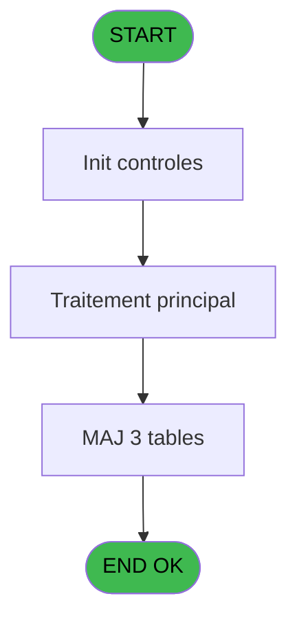
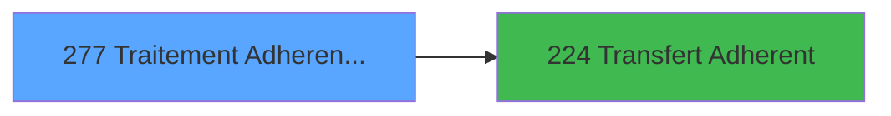

# PBG IDE 277 - Traitement Adherents new

> **Analyse**: Phases 1-4 2026-02-03 10:47 -> 10:47 (21s) | Assemblage 10:47
> **Pipeline**: V7.2 Enrichi
> **Structure**: 4 onglets (Resume | Ecrans | Donnees | Connexions)

<!-- TAB:Resume -->

## 1. FICHE D'IDENTITE

| Attribut | Valeur |
|----------|--------|
| Projet | PBG |
| IDE Position | 277 |
| Nom Programme | Traitement Adherents new |
| Fichier source | `Prg_277.xml` |
| Domaine metier | General |
| Taches | 6 (0 ecrans visibles) |
| Tables modifiees | 3 |
| Programmes appeles | 1 |

## 2. DESCRIPTION FONCTIONNELLE

**Traitement Adherents new** assure la gestion complete de ce processus, accessible depuis [Traitement des arrivants (IDE 206)](PBG-IDE-206.md).

Le flux de traitement s'organise en **4 blocs fonctionnels** :

- **Calcul** (2 taches) : calculs de montants, stocks ou compteurs
- **Traitement** (2 taches) : traitements metier divers
- **Consultation** (1 tache) : ecrans de recherche, selection et consultation
- **Validation** (1 tache) : controles et verifications de coherence

**Donnees modifiees** : 3 tables en ecriture (compte_gm________cgm, compteurs________cpt, pointage_articles_caution).

Detail : phases du traitement

#### Phase 1 : Traitement (2 taches)

- **277** - Veuillez patienter... **[[ECRAN]](#ecran-t1)**
- **277.2** - Determination Filiation

#### Phase 2 : Validation (1 tache)

- **277.1** - Verification Famille

#### Phase 3 : Calcul (2 taches)

- **277.3** - Selection Compteur
- **277.4** - Creation Compte

#### Phase 4 : Consultation (1 tache)

- **277.5** - Recherche Type sejour existant

#### Tables impactees

| Table | Operations | Role metier |
|-------|-----------|-------------|
| compte_gm________cgm | **W** (1 usages) | Comptes GM (generaux) |
| compteurs________cpt | **W** (1 usages) | Comptes GM (generaux) |
| pointage_articles_caution | **W** (1 usages) | Articles et stock |

## 3. BLOCS FONCTIONNELS

### 3.1 Traitement (2 taches)

Traitements internes.

---

#### 277 - Veuillez patienter... [[ECRAN]](#ecran-t1)

**Role** : Traitement : Veuillez patienter....
**Ecran** : 429 x 68 DLU (MDI) | [Voir mockup](#ecran-t1)

---

#### 277.2 - Determination Filiation

**Role** : Traitement : Determination Filiation.
**Variables liees** : O (W0-Filiation Compte), Q (W0-Filiation Adherent)

### 3.2 Validation (1 tache)

Controles de coherence : 1 tache verifie les donnees et conditions.

---

#### 277.1 - Verification Famille

**Role** : Verification : Verification Famille.
**Variables liees** : K (W0-Code Famille)

### 3.3 Calcul (2 taches)

Calculs metier : montants, stocks, compteurs.

---

#### 277.3 - Selection Compteur

**Role** : Calcul : Selection Compteur.
**Variables liees** : S (V.Compteur)

---

#### 277.4 - Creation Compte

**Role** : Creation d'enregistrement : Creation Compte.
**Variables liees** : S (V.Compteur), N (W0-Numero Compte), O (W0-Filiation Compte), R (W0-Prise en compte Heberg)

### 3.4 Consultation (1 tache)

Ecrans de recherche et consultation.

---

#### 277.5 - Recherche Type sejour existant

**Role** : Traitement : Recherche Type sejour existant.
**Variables liees** : B (P0-Lieu de Sejour)

## 5. REGLES METIER

*(Aucune regle metier identifiee)*

## 6. CONTEXTE

- **Appele par**: [Traitement des arrivants (IDE 206)](PBG-IDE-206.md)
- **Appelle**: 1 programmes | **Tables**: 6 (W:3 R:2 L:2) | **Taches**: 6 | **Expressions**: 26

<!-- TAB:Ecrans -->

## 8. ECRANS

*(Programme sans ecran visible)*

## 9. NAVIGATION

### 9.3 Structure hierarchique (6 taches)

| Position | Tache | Type | Dimensions | Bloc |
|----------|-------|------|------------|------|
| **277.1** | [**Veuillez patienter...** (277)](#t1) [mockup](#ecran-t1) | MDI | 429x68 | Traitement |
| 277.1.1 | [Determination Filiation (277.2)](#t3) | MDI | - | |
| **277.2** | [**Verification Famille** (277.1)](#t2) | MDI | - | Validation |
| **277.3** | [**Selection Compteur** (277.3)](#t4) | MDI | - | Calcul |
| 277.3.1 | [Creation Compte (277.4)](#t5) | MDI | - | |
| **277.4** | [**Recherche Type sejour existant** (277.5)](#t6) | MDI | - | Consultation |

### 9.4 Algorigramme

> **Legende**: Vert = START/END OK | Rouge = END KO | Bleu = Decisions
> *Algorigramme auto-genere. Utiliser `/algorigramme` pour une synthese metier detaillee.*

<!-- TAB:Donnees -->

## 10. TABLES

### Tables utilisees (6)

| ID | Nom | Description | Type | R | W | L | Usages |
|----|-----|-------------|------|---|---|---|--------|
| 31 | gm-complet_______gmc |  | DB | R |   | L | 3 |
| 34 | hebergement______heb | Hebergement (chambres) | DB | R |   |   | 1 |
| 47 | compte_gm________cgm | Comptes GM (generaux) | DB |   | **W** |   | 1 |
| 68 | compteurs________cpt | Comptes GM (generaux) | DB |   | **W** |   | 1 |
| 170 | annulation_______anu |  | DB |   |   | L | 1 |
| 569 | pointage_articles_caution | Articles et stock | TMP |   | **W** |   | 1 |

### Colonnes par table (2 / 5 tables avec colonnes identifiees)

Table 31 - gm-complet_______gmc (R/L) - 3 usages

*Table utilisee uniquement en Link ou aucune colonne Real identifiee dans le DataView.*

Table 34 - hebergement______heb (R) - 1 usages

*Table utilisee uniquement en Link ou aucune colonne Real identifiee dans le DataView.*

Table 47 - compte_gm________cgm (**W**) - 1 usages

| Lettre | Variable | Acces | Type |
|--------|----------|-------|------|
| N | W0-Numero Compte | W | Numeric |
| O | W0-Filiation Compte | W | Numeric |
| R | W0-Prise en compte Heberg | W | Logical |
| S | V.Compteur | W | Numeric |

Table 68 - compteurs________cpt (**W**) - 1 usages

*Table utilisee uniquement en Link ou aucune colonne Real identifiee dans le DataView.*

Table 569 - pointage_articles_caution (**W**) - 1 usages

| Lettre | Variable | Acces | Type |
|--------|----------|-------|------|
| A | P0-Code Societe | W | Alpha |
| B | P0-Lieu de Sejour | W | Alpha |
| C | P0-Nb Arrivants | W | Numeric |
| D | P0-Numero Import | W | Numeric |
| E | P0-Qualite Import | W | Alpha |
| F | P0-Num ressource | W | Numeric |
| G | W0-Operande | W | Numeric |
| H | W0-Operateur | W | Numeric |
| I | W0-Pourcentage | W | Numeric |
| J | W0-Calcul Pourcent | W | Numeric |
| K | W0-Code Famille | W | Alpha |
| L | W0-Ret Lien GMC | W | Numeric |
| M | W0-Ret Lien Annul | W | Numeric |
| N | W0-Numero Compte | W | Numeric |
| O | W0-Filiation Compte | W | Numeric |
| P | W0-Numero Adherent | W | Numeric |
| Q | W0-Filiation Adherent | W | Numeric |
| R | W0-Prise en compte Heberg | W | Logical |
| S | V.Compteur | W | Numeric |

## 11. VARIABLES

### 11.1 Variables de session (1)

Variables persistantes pendant toute la session.

| Lettre | Nom | Type | Usage dans |
|--------|-----|------|-----------|
| S | V.Compteur | Numeric | - |

### 11.2 Autres (18)

Variables diverses.

| Lettre | Nom | Type | Usage dans |
|--------|-----|------|-----------|
| A | P0-Code Societe | Alpha | 1x refs |
| B | P0-Lieu de Sejour | Alpha | - |
| C | P0-Nb Arrivants | Numeric | - |
| D | P0-Numero Import | Numeric | - |
| E | P0-Qualite Import | Alpha | - |
| F | P0-Num ressource | Numeric | - |
| G | W0-Operande | Numeric | - |
| H | W0-Operateur | Numeric | - |
| I | W0-Pourcentage | Numeric | - |
| J | W0-Calcul Pourcent | Numeric | 2x refs |
| K | W0-Code Famille | Alpha | [277.1](#t2) |
| L | W0-Ret Lien GMC | Numeric | - |
| M | W0-Ret Lien Annul | Numeric | - |
| N | W0-Numero Compte | Numeric | - |
| O | W0-Filiation Compte | Numeric | - |
| P | W0-Numero Adherent | Numeric | - |
| Q | W0-Filiation Adherent | Numeric | 2x refs |
| R | W0-Prise en compte Heberg | Logical | - |

Toutes les 19 variables (liste complete)

| Cat | Lettre | Nom Variable | Type |
|-----|--------|--------------|------|
| V. | **S** | V.Compteur | Numeric |
| Autre | **A** | P0-Code Societe | Alpha |
| Autre | **B** | P0-Lieu de Sejour | Alpha |
| Autre | **C** | P0-Nb Arrivants | Numeric |
| Autre | **D** | P0-Numero Import | Numeric |
| Autre | **E** | P0-Qualite Import | Alpha |
| Autre | **F** | P0-Num ressource | Numeric |
| Autre | **G** | W0-Operande | Numeric |
| Autre | **H** | W0-Operateur | Numeric |
| Autre | **I** | W0-Pourcentage | Numeric |
| Autre | **J** | W0-Calcul Pourcent | Numeric |
| Autre | **K** | W0-Code Famille | Alpha |
| Autre | **L** | W0-Ret Lien GMC | Numeric |
| Autre | **M** | W0-Ret Lien Annul | Numeric |
| Autre | **N** | W0-Numero Compte | Numeric |
| Autre | **O** | W0-Filiation Compte | Numeric |
| Autre | **P** | W0-Numero Adherent | Numeric |
| Autre | **Q** | W0-Filiation Adherent | Numeric |
| Autre | **R** | W0-Prise en compte Heberg | Logical |

## 12. EXPRESSIONS

**26 / 26 expressions decodees (100%)**

### 12.1 Repartition par type

| Type | Expressions | Regles |
|------|-------------|--------|
| CALCULATION | 3 | 0 |
| CONSTANTE | 3 | 0 |
| REFERENCE_VG | 1 | 0 |
| CONDITION | 4 | 0 |
| OTHER | 13 | 0 |
| NEGATION | 1 | 0 |
| CAST_LOGIQUE | 1 | 0 |

### 12.2 Expressions cles par type

#### CALCULATION (3 expressions)

| Type | IDE | Expression | Regle |
|------|-----|------------|-------|
| CALCULATION | 25 | `[CI]+1` | - |
| CALCULATION | 3 | `([CI]/VG1)*50` | - |
| CALCULATION | 2 | `([CI]/VG1)*100` | - |

#### CONSTANTE (3 expressions)

| Type | IDE | Expression | Regle |
|------|-----|------------|-------|
| CONSTANTE | 20 | `'H'` | - |
| CONSTANTE | 19 | `'E'` | - |
| CONSTANTE | 1 | `''` | - |

#### REFERENCE_VG (1 expressions)

| Type | IDE | Expression | Regle |
|------|-----|------------|-------|
| REFERENCE_VG | 4 | `VG20` | - |

#### CONDITION (4 expressions)

| Type | IDE | Expression | Regle |
|------|-----|------------|-------|
| CONDITION | 13 | `W0-Code Famille [K]=0` | - |
| CONDITION | 21 | `W0-Code Famille [K]<>0` | - |
| CONDITION | 5 | `W0-Calcul Pourcent [J]='O'` | - |
| CONDITION | 6 | `W0-Calcul Pourcent [J]='N'` | - |

#### OTHER (13 expressions)

| Type | IDE | Expression | Regle |
|------|-----|------------|-------|
| OTHER | 18 | `[AL]` | - |
| OTHER | 17 | `[AK]` | - |
| OTHER | 16 | `[AG]` | - |
| OTHER | 26 | `[CJ]` | - |
| OTHER | 23 | `[V]` | - |
| ... | | *+8 autres* | |

#### NEGATION (1 expressions)

| Type | IDE | Expression | Regle |
|------|-----|------------|-------|
| NEGATION | 14 | `NOT (W0-Filiation Adherent [Q])` | - |

#### CAST_LOGIQUE (1 expressions)

| Type | IDE | Expression | Regle |
|------|-----|------------|-------|
| CAST_LOGIQUE | 24 | `'FALSE'LOG` | - |

### 12.3 Toutes les expressions (26)

Voir les 26 expressions

#### CALCULATION (3)

| IDE | Expression Decodee |
|-----|-------------------|
| 2 | `([CI]/VG1)*100` |
| 3 | `([CI]/VG1)*50` |
| 25 | `[CI]+1` |

#### CONSTANTE (3)

| IDE | Expression Decodee |
|-----|-------------------|
| 1 | `''` |
| 19 | `'E'` |
| 20 | `'H'` |

#### REFERENCE_VG (1)

| IDE | Expression Decodee |
|-----|-------------------|
| 4 | `VG20` |

#### CONDITION (4)

| IDE | Expression Decodee |
|-----|-------------------|
| 5 | `W0-Calcul Pourcent [J]='O'` |
| 6 | `W0-Calcul Pourcent [J]='N'` |
| 13 | `W0-Code Famille [K]=0` |
| 21 | `W0-Code Famille [K]<>0` |

#### OTHER (13)

| IDE | Expression Decodee |
|-----|-------------------|
| 7 | `P0-Code Societe [A]` |
| 8 | `[T]` |
| 9 | `[U]` |
| 10 | `[V]` |
| 11 | `[Y]` |
| 12 | `[Z]` |
| 15 | `W0-Filiation Adherent [Q]` |
| 16 | `[AG]` |
| 17 | `[AK]` |
| 18 | `[AL]` |
| 22 | `[U]` |
| 23 | `[V]` |
| 26 | `[CJ]` |

#### NEGATION (1)

| IDE | Expression Decodee |
|-----|-------------------|
| 14 | `NOT (W0-Filiation Adherent [Q])` |

#### CAST_LOGIQUE (1)

| IDE | Expression Decodee |
|-----|-------------------|
| 24 | `'FALSE'LOG` |

<!-- TAB:Connexions -->

## 13. GRAPHE D'APPELS

### 13.1 Chaine depuis Main (Callers)

Main -> ... -> [Traitement des arrivants (IDE 206)](PBG-IDE-206.md) -> **Traitement Adherents new (IDE 277)**

### 13.2 Callers

| IDE | Nom Programme | Nb Appels |
|-----|---------------|-----------|
| [206](PBG-IDE-206.md) | Traitement des arrivants | 1 |

### 13.3 Callees (programmes appeles)

### 13.4 Detail Callees avec contexte

| IDE | Nom Programme | Appels | Contexte |
|-----|---------------|--------|----------|
| [224](PBG-IDE-224.md) | Transfert Adherent | 2 | Transfert donnees |

## 14. RECOMMANDATIONS MIGRATION

### 14.1 Profil du programme

| Metrique | Valeur | Impact migration |
|----------|--------|-----------------|
| Lignes de logique | 161 | Programme compact |
| Expressions | 26 | Peu de logique |
| Tables WRITE | 3 | Impact modere |
| Sous-programmes | 1 | Peu de dependances |
| Ecrans visibles | 0 | Ecran unique ou traitement batch |
| Code desactive | 0% (0 / 161) | Code sain |
| Regles metier | 0 | Pas de regle identifiee |

### 14.2 Plan de migration par bloc

#### Traitement (2 taches: 1 ecran, 1 traitement)

- **Strategie** : Orchestrateur avec 1 ecrans (Razor/React) et 1 traitements backend (services).
- Les ecrans deviennent des composants UI, les traitements invisibles deviennent des services injectables.
- 1 sous-programme(s) a migrer ou a reutiliser depuis les services existants.
- Decomposer les taches en services unitaires testables.

#### Validation (1 tache: 0 ecran, 1 traitement)

- **Strategie** : FluentValidation avec validators specifiques.
- Chaque tache de validation -> un validator injectable

#### Calcul (2 taches: 0 ecran, 2 traitements)

- **Strategie** : Services de calcul purs (Domain Services).
- Migrer la logique de calcul (stock, compteurs, montants)

#### Consultation (1 tache: 0 ecran, 1 traitement)

- **Strategie** : Composants de recherche/selection en modales.

### 14.3 Dependances critiques

| Dependance | Type | Appels | Impact |
|------------|------|--------|--------|
| compte_gm________cgm | Table WRITE (Database) | 1x | Schema + repository |
| compteurs________cpt | Table WRITE (Database) | 1x | Schema + repository |
| pointage_articles_caution | Table WRITE (Temp) | 1x | Schema + repository |
| [Transfert Adherent (IDE 224)](PBG-IDE-224.md) | Sous-programme | 2x | Haute - Transfert donnees |

---
*Spec DETAILED generee par Pipeline V7.2 - 2026-02-03 10:47*
