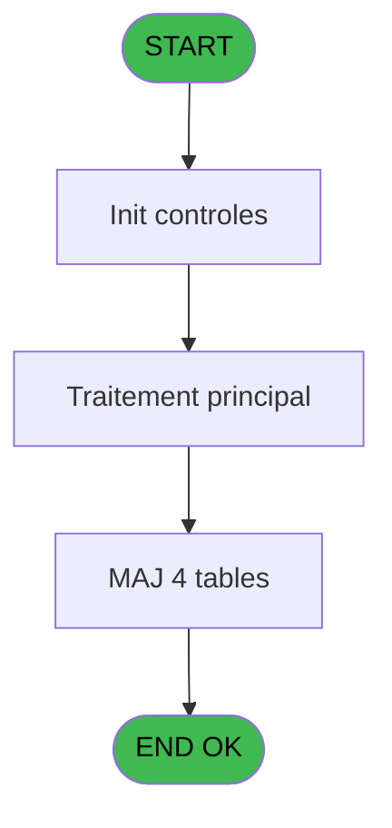
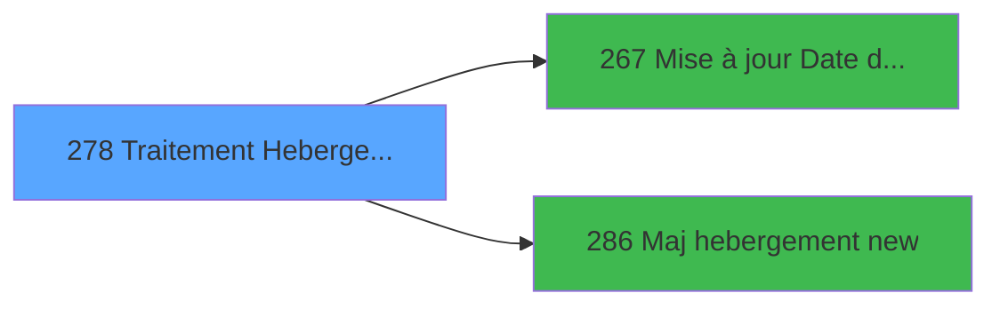

# PBG IDE 278 - Traitement Hebergements new

> **Analyse**: Phases 1-4 2026-02-03 10:47 -> 10:48 (19s) | Assemblage 10:48
> **Pipeline**: V7.2 Enrichi
> **Structure**: 4 onglets (Resume | Ecrans | Donnees | Connexions)

<!-- TAB:Resume -->

## 1. FICHE D'IDENTITE

| Attribut | Valeur |
|----------|--------|
| Projet | PBG |
| IDE Position | 278 |
| Nom Programme | Traitement Hebergements new |
| Fichier source | `Prg_278.xml` |
| Domaine metier | General |
| Taches | 6 (0 ecrans visibles) |
| Tables modifiees | 4 |
| Programmes appeles | 2 |

## 2. DESCRIPTION FONCTIONNELLE

**Traitement Hebergements new** assure la gestion complete de ce processus, accessible depuis [Traitement des arrivants (IDE 206)](PBG-IDE-206.md).

Le flux de traitement s'organise en **2 blocs fonctionnels** :

- **Creation** (3 taches) : insertion d'enregistrements en base (mouvements, prestations)
- **Traitement** (3 taches) : traitements metier divers

**Donnees modifiees** : 4 tables en ecriture (hebergement______heb, code_logement____clo, lit_matrimoniaux, pv_pms_prestations_tmp).

Detail : phases du traitement

#### Phase 1 : Traitement (3 taches)

- **278** - Veuillez patienter... **[[ECRAN]](#ecran-t1)**
- **278.1** - Nbre sejours
- **278.5** - Avertissement H

Delegue a : [Mise à jour Date de Séjour (IDE 267)](PBG-IDE-267.md), [Maj hebergement new (IDE 286)](PBG-IDE-286.md)

#### Phase 2 : Creation (3 taches)

- **278.2** - Creation Hebergement
- **278.3** - Creation Hebergement
- **278.4** - Creation Code Logement

#### Tables impactees

| Table | Operations | Role metier |
|-------|-----------|-------------|
| code_logement____clo | **W**/L (2 usages) |  |
| lit_matrimoniaux | **W** (1 usages) |  |
| pv_pms_prestations_tmp | **W** (1 usages) | Prestations/services vendus |
| hebergement______heb | **W** (1 usages) | Hebergement (chambres) |

## 3. BLOCS FONCTIONNELS

### 3.1 Traitement (3 taches)

Traitements internes.

---

#### 278 - Veuillez patienter... [[ECRAN]](#ecran-t1)

**Role** : Traitement : Veuillez patienter....
**Ecran** : 429 x 69 DLU (MDI) | [Voir mockup](#ecran-t1)
**Delegue a** : [Mise à jour Date de Séjour (IDE 267)](PBG-IDE-267.md), [Maj hebergement new (IDE 286)](PBG-IDE-286.md)

---

#### 278.1 - Nbre sejours

**Role** : Traitement : Nbre sejours.
**Variables liees** : K (W0-Nbre sejours)
**Delegue a** : [Mise à jour Date de Séjour (IDE 267)](PBG-IDE-267.md), [Maj hebergement new (IDE 286)](PBG-IDE-286.md)

---

#### 278.5 - Avertissement H

**Role** : Traitement : Avertissement H.
**Delegue a** : [Mise à jour Date de Séjour (IDE 267)](PBG-IDE-267.md), [Maj hebergement new (IDE 286)](PBG-IDE-286.md)

### 3.2 Creation (3 taches)

Insertion de nouveaux enregistrements en base.

---

#### 278.2 - Creation Hebergement

**Role** : Creation d'enregistrement : Creation Hebergement.
**Variables liees** : C (P0-Nb Hebergements)

---

#### 278.3 - Creation Hebergement

**Role** : Creation d'enregistrement : Creation Hebergement.
**Variables liees** : C (P0-Nb Hebergements)

---

#### 278.4 - Creation Code Logement

**Role** : Creation d'enregistrement : Creation Code Logement.
**Variables liees** : B (P0-Code Societe), L (W0-Existe logement)

## 5. REGLES METIER

*(Aucune regle metier identifiee)*

## 6. CONTEXTE

- **Appele par**: [Traitement des arrivants (IDE 206)](PBG-IDE-206.md)
- **Appelle**: 2 programmes | **Tables**: 9 (W:4 R:1 L:5) | **Taches**: 6 | **Expressions**: 24

<!-- TAB:Ecrans -->

## 8. ECRANS

*(Programme sans ecran visible)*

## 9. NAVIGATION

### 9.3 Structure hierarchique (6 taches)

| Position | Tache | Type | Dimensions | Bloc |
|----------|-------|------|------------|------|
| **278.1** | [**Veuillez patienter...** (278)](#t1) [mockup](#ecran-t1) | MDI | 429x69 | Traitement |
| 278.1.1 | [Nbre sejours (278.1)](#t2) | MDI | - | |
| 278.1.2 | [Avertissement H (278.5)](#t6) | MDI | - | |
| **278.2** | [**Creation Hebergement** (278.2)](#t3) | MDI | - | Creation |
| 278.2.1 | [Creation Hebergement (278.3)](#t4) | MDI | - | |
| 278.2.2 | [Creation Code Logement (278.4)](#t5) | MDI | - | |

### 9.4 Algorigramme

> **Legende**: Vert = START/END OK | Rouge = END KO | Bleu = Decisions
> *Algorigramme auto-genere. Utiliser `/algorigramme` pour une synthese metier detaillee.*

<!-- TAB:Donnees -->

## 10. TABLES

### Tables utilisees (9)

| ID | Nom | Description | Type | R | W | L | Usages |
|----|-----|-------------|------|---|---|---|--------|
| 31 | gm-complet_______gmc |  | DB |   |   | L | 1 |
| 34 | hebergement______heb | Hebergement (chambres) | DB |   | **W** |   | 1 |
| 108 | code_logement____clo |  | DB |   | **W** | L | 2 |
| 350 | lit_matrimoniaux |  | DB |   | **W** |   | 1 |
| 558 | import_troncon___imt |  | TMP |   |   | L | 1 |
| 564 | pms_check_out |  | TMP |   |   | L | 1 |
| 569 | pointage_articles_caution | Articles et stock | TMP |   |   | L | 1 |
| 571 | inter_prestation_inp | Prestations/services vendus | TMP | R |   |   | 1 |
| 574 | pv_pms_prestations_tmp | Prestations/services vendus | TMP |   | **W** |   | 1 |

### Colonnes par table (4 / 5 tables avec colonnes identifiees)

Table 34 - hebergement______heb (**W**) - 1 usages

| Lettre | Variable | Acces | Type |
|--------|----------|-------|------|
| C | P0-Nb Hebergements | W | Numeric |

Table 108 - code_logement____clo (**W**/L) - 2 usages

| Lettre | Variable | Acces | Type |
|--------|----------|-------|------|
| B | P0-Code Societe | W | Alpha |
| L | W0-Existe logement | W | Logical |

Table 350 - lit_matrimoniaux (**W**) - 1 usages

*Table utilisee uniquement en Link ou aucune colonne Real identifiee dans le DataView.*

Table 571 - inter_prestation_inp (R) - 1 usages

| Lettre | Variable | Acces | Type |
|--------|----------|-------|------|
| A | P0-Lieu de Sejour | R | Alpha |
| B | P0-Code Societe | R | Alpha |
| C | P0-Nb Hebergements | R | Numeric |
| D | P0-N° Import | R | Numeric |
| E | P0-Qualite Import | R | Alpha |
| F | P0-Num ressource | R | Numeric |
| G | W0-Operande | R | Numeric |
| H | W0-Operateur | R | Numeric |
| I | W0-Pourcentage | R | Numeric |
| J | W0-Calcul Pourcent | R | Numeric |
| K | W0-Nbre sejours | R | Numeric |
| L | W0-Existe logement | R | Logical |
| M | W0-Existe anc sejour date deb | R | Logical |
| N | V.Compteur | R | Numeric |

Table 574 - pv_pms_prestations_tmp (**W**) - 1 usages

*Table utilisee uniquement en Link ou aucune colonne Real identifiee dans le DataView.*

## 11. VARIABLES

### 11.1 Variables de session (1)

Variables persistantes pendant toute la session.

| Lettre | Nom | Type | Usage dans |
|--------|-----|------|-----------|
| N | V.Compteur | Numeric | - |

### 11.2 Autres (13)

Variables diverses.

| Lettre | Nom | Type | Usage dans |
|--------|-----|------|-----------|
| A | P0-Lieu de Sejour | Alpha | [278.1](#t2) |
| B | P0-Code Societe | Alpha | 1x refs |
| C | P0-Nb Hebergements | Numeric | - |
| D | P0-N° Import | Numeric | - |
| E | P0-Qualite Import | Alpha | - |
| F | P0-Num ressource | Numeric | - |
| G | W0-Operande | Numeric | - |
| H | W0-Operateur | Numeric | - |
| I | W0-Pourcentage | Numeric | - |
| J | W0-Calcul Pourcent | Numeric | - |
| K | W0-Nbre sejours | Numeric | [278.1](#t2) |
| L | W0-Existe logement | Logical | [278.4](#t5) |
| M | W0-Existe anc sejour date deb | Logical | - |

## 12. EXPRESSIONS

**24 / 24 expressions decodees (100%)**

### 12.1 Repartition par type

| Type | Expressions | Regles |
|------|-------------|--------|
| CALCULATION | 3 | 0 |
| CONSTANTE | 1 | 0 |
| REFERENCE_VG | 1 | 0 |
| OTHER | 15 | 0 |
| CONDITION | 2 | 0 |
| NEGATION | 1 | 0 |
| STRING | 1 | 0 |

### 12.2 Expressions cles par type

#### CALCULATION (3 expressions)

| Type | IDE | Expression | Regle |
|------|-----|------------|-------|
| CALCULATION | 20 | `[DQ]+1` | - |
| CALCULATION | 3 | `([DQ]/VG13)*50` | - |
| CALCULATION | 2 | `([DQ]/VG13)*100` | - |

#### CONSTANTE (1 expressions)

| Type | IDE | Expression | Regle |
|------|-----|------------|-------|
| CONSTANTE | 1 | `''` | - |

#### REFERENCE_VG (1 expressions)

| Type | IDE | Expression | Regle |
|------|-----|------------|-------|
| REFERENCE_VG | 4 | `VG20` | - |

#### OTHER (15 expressions)

| Type | IDE | Expression | Regle |
|------|-----|------------|-------|
| OTHER | 17 | `[AS]` | - |
| OTHER | 16 | `[AR]` | - |
| OTHER | 15 | `[AG]` | - |
| OTHER | 18 | `[AT]` | - |
| OTHER | 24 | `P0-Lieu de Sejour [A]` | - |
| ... | | *+10 autres* | |

#### CONDITION (2 expressions)

| Type | IDE | Expression | Regle |
|------|-----|------------|-------|
| CONDITION | 8 | `[AE]='H'` | - |
| CONDITION | 7 | `[AE]>'E'` | - |

#### NEGATION (1 expressions)

| Type | IDE | Expression | Regle |
|------|-----|------------|-------|
| NEGATION | 22 | `NOT [AU]` | - |

#### STRING (1 expressions)

| Type | IDE | Expression | Regle |
|------|-----|------------|-------|
| STRING | 23 | `Trim(VG20)` | - |

### 12.3 Toutes les expressions (24)

Voir les 24 expressions

#### CALCULATION (3)

| IDE | Expression Decodee |
|-----|-------------------|
| 2 | `([DQ]/VG13)*100` |
| 3 | `([DQ]/VG13)*50` |
| 20 | `[DQ]+1` |

#### CONSTANTE (1)

| IDE | Expression Decodee |
|-----|-------------------|
| 1 | `''` |

#### REFERENCE_VG (1)

| IDE | Expression Decodee |
|-----|-------------------|
| 4 | `VG20` |

#### OTHER (15)

| IDE | Expression Decodee |
|-----|-------------------|
| 5 | `W0-Nbre sejours [K]` |
| 6 | `W0-Existe logement [L]` |
| 9 | `P0-Code Societe [B]` |
| 10 | `[AC]` |
| 11 | `[AD]` |
| 12 | `P0-Lieu de Sejour [A]` |
| 13 | `[Q]` |
| 14 | `[AF]` |
| 15 | `[AG]` |
| 16 | `[AR]` |
| 17 | `[AS]` |
| 18 | `[AT]` |
| 19 | `W0-Existe anc sejour d... [M]` |
| 21 | `[DR]` |
| 24 | `P0-Lieu de Sejour [A]` |

#### CONDITION (2)

| IDE | Expression Decodee |
|-----|-------------------|
| 7 | `[AE]>'E'` |
| 8 | `[AE]='H'` |

#### NEGATION (1)

| IDE | Expression Decodee |
|-----|-------------------|
| 22 | `NOT [AU]` |

#### STRING (1)

| IDE | Expression Decodee |
|-----|-------------------|
| 23 | `Trim(VG20)` |

<!-- TAB:Connexions -->

## 13. GRAPHE D'APPELS

### 13.1 Chaine depuis Main (Callers)

Main -> ... -> [Traitement des arrivants (IDE 206)](PBG-IDE-206.md) -> **Traitement Hebergements new (IDE 278)**

### 13.2 Callers

| IDE | Nom Programme | Nb Appels |
|-----|---------------|-----------|
| [206](PBG-IDE-206.md) | Traitement des arrivants | 1 |

### 13.3 Callees (programmes appeles)

### 13.4 Detail Callees avec contexte

| IDE | Nom Programme | Appels | Contexte |
|-----|---------------|--------|----------|
| [267](PBG-IDE-267.md) | Mise à jour Date de Séjour | 1 | Mise a jour donnees |
| [286](PBG-IDE-286.md) | Maj hebergement new | 1 | Mise a jour donnees |

## 14. RECOMMANDATIONS MIGRATION

### 14.1 Profil du programme

| Metrique | Valeur | Impact migration |
|----------|--------|-----------------|
| Lignes de logique | 272 | Taille moyenne |
| Expressions | 24 | Peu de logique |
| Tables WRITE | 4 | Impact modere |
| Sous-programmes | 2 | Peu de dependances |
| Ecrans visibles | 0 | Ecran unique ou traitement batch |
| Code desactive | 0% (0 / 272) | Code sain |
| Regles metier | 0 | Pas de regle identifiee |

### 14.2 Plan de migration par bloc

#### Traitement (3 taches: 1 ecran, 2 traitements)

- **Strategie** : Orchestrateur avec 1 ecrans (Razor/React) et 2 traitements backend (services).
- Les ecrans deviennent des composants UI, les traitements invisibles deviennent des services injectables.
- 2 sous-programme(s) a migrer ou a reutiliser depuis les services existants.
- Decomposer les taches en services unitaires testables.

#### Creation (3 taches: 0 ecran, 3 traitements)

- **Strategie** : Repository pattern avec Entity Framework Core.
- Insertion via `IRepository<T>.CreateAsync()`

### 14.3 Dependances critiques

| Dependance | Type | Appels | Impact |
|------------|------|--------|--------|
| hebergement______heb | Table WRITE (Database) | 1x | Schema + repository |
| code_logement____clo | Table WRITE (Database) | 1x | Schema + repository |
| lit_matrimoniaux | Table WRITE (Database) | 1x | Schema + repository |
| pv_pms_prestations_tmp | Table WRITE (Temp) | 1x | Schema + repository |
| [Maj hebergement new (IDE 286)](PBG-IDE-286.md) | Sous-programme | 1x | Normale - Mise a jour donnees |
| [Mise à jour Date de Séjour (IDE 267)](PBG-IDE-267.md) | Sous-programme | 1x | Normale - Mise a jour donnees |

---
*Spec DETAILED generee par Pipeline V7.2 - 2026-02-03 10:48*
