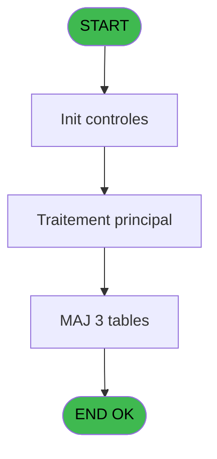

# PBG IDE 281 - Traitement Voyages new

> **Analyse**: Phases 1-4 2026-02-03 10:49 -> 10:49 (18s) | Assemblage 10:49
> **Pipeline**: V7.2 Enrichi
> **Structure**: 4 onglets (Resume | Ecrans | Donnees | Connexions)

<!-- TAB:Resume -->

## 1. FICHE D'IDENTITE

| Attribut | Valeur |
|----------|--------|
| Projet | PBG |
| IDE Position | 281 |
| Nom Programme | Traitement Voyages new |
| Fichier source | `Prg_281.xml` |
| Domaine metier | General |
| Taches | 27 (0 ecrans visibles) |
| Tables modifiees | 3 |
| Programmes appeles | 0 |

## 2. DESCRIPTION FONCTIONNELLE

**Traitement Voyages new** assure la gestion complete de ce processus, accessible depuis [Traitement des arrivants (IDE 206)](PBG-IDE-206.md).

Le flux de traitement s'organise en **3 blocs fonctionnels** :

- **Creation** (13 taches) : insertion d'enregistrements en base (mouvements, prestations)
- **Validation** (12 taches) : controles et verifications de coherence
- **Traitement** (2 taches) : traitements metier divers

**Donnees modifiees** : 3 tables en ecriture (hebergement______heb, groupe_arr_dep___vol, commentaire______com).

**Logique metier** : 2 regles identifiees couvrant conditions metier.

Detail : phases du traitement

#### Phase 1 : Traitement (2 taches)

- **281** - Veuillez patienter... **[[ECRAN]](#ecran-t1)**
- **281.10.3** - Veuillez patienter... **[[ECRAN]](#ecran-t33)**

#### Phase 2 : Validation (12 taches)

- **281.1** - Verification Code-Vol Aller
- **281.2** - Verification Voyage Aller
- **281.3** - Verification Code-Vol Aller
- **281.4** - Verification Voyage Aller
- **281.5** - Verification Code-Vol Retour
- **281.6** - Verification Voyage Retour
- **281.7** - Verification Code-Vol Retour
- **281.8** - Verification Voyage Retour
- **281.9** - Verification V/V Aller
- **281.10** - Verification V/V Aller
- **281.11** - Verification V/V Retour
- **281.12** - Verification V/V Retour

#### Phase 3 : Creation (13 taches)

- **281.2.1** - Creation Package Aller
- **281.2.2** - Creation Package Retour
- **281.4.1** - Creation Package Aller
- **281.4.2** - Creation Package Retour
- **281.6.1** - Creation Package Retour
- **281.6.2** - Creation Package Retour
- **281.8.1** - Creation Package Retour
- **281.8.2** - Creation Package Retour
- **281.10.1** - Creation Package Aller
- **281.10.2** - Creation Package Aller
- **281.10.3.1** - Creation Circuit
- **281.12.1** - Creation Package Retour
- **281.12.2** - Creation Package Retour

#### Tables impactees

| Table | Operations | Role metier |
|-------|-----------|-------------|
| hebergement______heb | **W** (18 usages) | Hebergement (chambres) |
| groupe_arr_dep___vol | **W**/L (11 usages) |  |
| commentaire______com | **W** (1 usages) |  |

## 3. BLOCS FONCTIONNELS

### 3.1 Traitement (2 taches)

Traitements internes.

---

#### 281 - Veuillez patienter... [[ECRAN]](#ecran-t1)

**Role** : Traitement : Veuillez patienter....
**Ecran** : 427 x 68 DLU (MDI) | [Voir mockup](#ecran-t1)

---

#### 281.10.3 - Veuillez patienter... [[ECRAN]](#ecran-t33)

**Role** : Traitement : Veuillez patienter....
**Ecran** : 424 x 66 DLU (MDI) | [Voir mockup](#ecran-t33)

### 3.2 Validation (12 taches)

Controles de coherence : 12 taches verifient les donnees et conditions.

---

#### 281.1 - Verification Code-Vol Aller

**Role** : Verification : Verification Code-Vol Aller.
**Variables liees** : P (W0 VV Aller ?), F (P0-Heure Diff Aller), L (W0-Code Aller), N (W0-Code Aller Diff)

---

#### 281.2 - Verification Voyage Aller

**Role** : Verification : Verification Voyage Aller.
**Variables liees** : P (W0 VV Aller ?), F (P0-Heure Diff Aller), L (W0-Code Aller), N (W0-Code Aller Diff)

---

#### 281.3 - Verification Code-Vol Aller

**Role** : Verification : Verification Code-Vol Aller.
**Variables liees** : P (W0 VV Aller ?), F (P0-Heure Diff Aller), L (W0-Code Aller), N (W0-Code Aller Diff)

---

#### 281.4 - Verification Voyage Aller

**Role** : Verification : Verification Voyage Aller.
**Variables liees** : P (W0 VV Aller ?), F (P0-Heure Diff Aller), L (W0-Code Aller), N (W0-Code Aller Diff)

---

#### 281.5 - Verification Code-Vol Retour

**Role** : Verification : Verification Code-Vol Retour.
**Variables liees** : Q (W0 VV Retour ?), G (P0-Heure Diff Retour), M (W0-Code Retour), O (W0-Code Retour Diff)

---

#### 281.6 - Verification Voyage Retour

**Role** : Verification : Verification Voyage Retour.
**Variables liees** : Q (W0 VV Retour ?), G (P0-Heure Diff Retour), M (W0-Code Retour), O (W0-Code Retour Diff)

---

#### 281.7 - Verification Code-Vol Retour

**Role** : Verification : Verification Code-Vol Retour.
**Variables liees** : Q (W0 VV Retour ?), G (P0-Heure Diff Retour), M (W0-Code Retour), O (W0-Code Retour Diff)

---

#### 281.8 - Verification Voyage Retour

**Role** : Verification : Verification Voyage Retour.
**Variables liees** : Q (W0 VV Retour ?), G (P0-Heure Diff Retour), M (W0-Code Retour), O (W0-Code Retour Diff)

---

#### 281.9 - Verification V/V Aller

**Role** : Verification : Verification V/V Aller.
**Variables liees** : P (W0 VV Aller ?), F (P0-Heure Diff Aller), L (W0-Code Aller), N (W0-Code Aller Diff)

---

#### 281.10 - Verification V/V Aller

**Role** : Verification : Verification V/V Aller.
**Variables liees** : P (W0 VV Aller ?), F (P0-Heure Diff Aller), L (W0-Code Aller), N (W0-Code Aller Diff)

---

#### 281.11 - Verification V/V Retour

**Role** : Verification : Verification V/V Retour.
**Variables liees** : Q (W0 VV Retour ?), G (P0-Heure Diff Retour), M (W0-Code Retour), O (W0-Code Retour Diff)

---

#### 281.12 - Verification V/V Retour

**Role** : Verification : Verification V/V Retour.
**Variables liees** : Q (W0 VV Retour ?), G (P0-Heure Diff Retour), M (W0-Code Retour), O (W0-Code Retour Diff)

### 3.3 Creation (13 taches)

Insertion de nouveaux enregistrements en base.

---

#### 281.2.1 - Creation Package Aller

**Role** : Creation d'enregistrement : Creation Package Aller.
**Variables liees** : P (W0 VV Aller ?), F (P0-Heure Diff Aller), L (W0-Code Aller), N (W0-Code Aller Diff)

---

#### 281.2.2 - Creation Package Retour

**Role** : Creation d'enregistrement : Creation Package Retour.
**Variables liees** : Q (W0 VV Retour ?), G (P0-Heure Diff Retour), M (W0-Code Retour), O (W0-Code Retour Diff)

---

#### 281.4.1 - Creation Package Aller

**Role** : Creation d'enregistrement : Creation Package Aller.
**Variables liees** : P (W0 VV Aller ?), F (P0-Heure Diff Aller), L (W0-Code Aller), N (W0-Code Aller Diff)

---

#### 281.4.2 - Creation Package Retour

**Role** : Creation d'enregistrement : Creation Package Retour.
**Variables liees** : Q (W0 VV Retour ?), G (P0-Heure Diff Retour), M (W0-Code Retour), O (W0-Code Retour Diff)

---

#### 281.6.1 - Creation Package Retour

**Role** : Creation d'enregistrement : Creation Package Retour.
**Variables liees** : Q (W0 VV Retour ?), G (P0-Heure Diff Retour), M (W0-Code Retour), O (W0-Code Retour Diff)

---

#### 281.6.2 - Creation Package Retour

**Role** : Creation d'enregistrement : Creation Package Retour.
**Variables liees** : Q (W0 VV Retour ?), G (P0-Heure Diff Retour), M (W0-Code Retour), O (W0-Code Retour Diff)

---

#### 281.8.1 - Creation Package Retour

**Role** : Creation d'enregistrement : Creation Package Retour.
**Variables liees** : Q (W0 VV Retour ?), G (P0-Heure Diff Retour), M (W0-Code Retour), O (W0-Code Retour Diff)

---

#### 281.8.2 - Creation Package Retour

**Role** : Creation d'enregistrement : Creation Package Retour.
**Variables liees** : Q (W0 VV Retour ?), G (P0-Heure Diff Retour), M (W0-Code Retour), O (W0-Code Retour Diff)

---

#### 281.10.1 - Creation Package Aller

**Role** : Creation d'enregistrement : Creation Package Aller.
**Variables liees** : P (W0 VV Aller ?), F (P0-Heure Diff Aller), L (W0-Code Aller), N (W0-Code Aller Diff)

---

#### 281.10.2 - Creation Package Aller

**Role** : Creation d'enregistrement : Creation Package Aller.
**Variables liees** : P (W0 VV Aller ?), F (P0-Heure Diff Aller), L (W0-Code Aller), N (W0-Code Aller Diff)

---

#### 281.10.3.1 - Creation Circuit

**Role** : Creation d'enregistrement : Creation Circuit.

---

#### 281.12.1 - Creation Package Retour

**Role** : Creation d'enregistrement : Creation Package Retour.
**Variables liees** : Q (W0 VV Retour ?), G (P0-Heure Diff Retour), M (W0-Code Retour), O (W0-Code Retour Diff)

---

#### 281.12.2 - Creation Package Retour

**Role** : Creation d'enregistrement : Creation Package Retour.
**Variables liees** : Q (W0 VV Retour ?), G (P0-Heure Diff Retour), M (W0-Code Retour), O (W0-Code Retour Diff)

## 5. REGLES METIER

2 regles identifiees:

### Autres (2 regles)

#### [RM-001] Si W0-Operateur [I]=0 OR W0-Operateur [I]<>0 AND W0-Calcul Pourcent [K]=0 AND [ES]<>0 AND Hour ([AR])>[ES] alors 'N' sinon 'O')

| Element | Detail |
|---------|--------|
| **Condition** | `W0-Operateur [I]=0 OR W0-Operateur [I]<>0 AND W0-Calcul Pourcent [K]=0 AND [ES]<>0 AND Hour ([AR])>[ES]` |
| **Si vrai** | 'N' |
| **Si faux** | 'O') |
| **Variables** | I (W0-Operateur), K (W0-Calcul Pourcent) |
| **Expression source** | Expression 21 : `IF (W0-Operateur [I]=0 OR W0-Operateur [I]<>0 AND W0-Calcul ` |
| **Exemple** | Si W0-Operateur [I]=0 OR W0-Operateur [I]<>0 AND W0-Calcul Pourcent [K]=0 AND [ES]<>0 AND Hour ([AR])>[ES] → 'N'. Sinon → 'O') |

#### [RM-002] Si W0-Pourcentage [J]=0 OR W0-Pourcentage [J]<>0 AND W0-Code Aller [L]=0 AND [ET]<>0 AND Hour ([BN])<[ET] alors 'N' sinon 'O')

| Element | Detail |
|---------|--------|
| **Condition** | `W0-Pourcentage [J]=0 OR W0-Pourcentage [J]<>0 AND W0-Code Aller [L]=0 AND [ET]<>0 AND Hour ([BN])<[ET]` |
| **Si vrai** | 'N' |
| **Si faux** | 'O') |
| **Variables** | J (W0-Pourcentage), L (W0-Code Aller) |
| **Expression source** | Expression 22 : `IF (W0-Pourcentage [J]=0 OR W0-Pourcentage [J]<>0 AND W0-Cod` |
| **Exemple** | Si W0-Pourcentage [J]=0 OR W0-Pourcentage [J]<>0 AND W0-Code Aller [L]=0 AND [ET]<>0 AND Hour ([BN])<[ET] → 'N'. Sinon → 'O') |

## 6. CONTEXTE

- **Appele par**: [Traitement des arrivants (IDE 206)](PBG-IDE-206.md)
- **Appelle**: 0 programmes | **Tables**: 6 (W:3 R:2 L:3) | **Taches**: 27 | **Expressions**: 37

<!-- TAB:Ecrans -->

## 8. ECRANS

*(Programme sans ecran visible)*

## 9. NAVIGATION

### 9.3 Structure hierarchique (27 taches)

| Position | Tache | Type | Dimensions | Bloc |
|----------|-------|------|------------|------|
| **281.1** | [**Veuillez patienter...** (281)](#t1) [mockup](#ecran-t1) | MDI | 427x68 | Traitement |
| 281.1.1 | [Veuillez patienter... (281.10.3)](#t33) [mockup](#ecran-t33) | MDI | 424x66 | |
| **281.2** | [**Verification Code-Vol Aller** (281.1)](#t3) | MDI | - | Validation |
| 281.2.1 | [Verification Voyage Aller (281.2)](#t4) | MDI | - | |
| 281.2.2 | [Verification Code-Vol Aller (281.3)](#t7) | MDI | - | |
| 281.2.3 | [Verification Voyage Aller (281.4)](#t8) | MDI | - | |
| 281.2.4 | [Verification Code-Vol Retour (281.5)](#t11) | MDI | - | |
| 281.2.5 | [Verification Voyage Retour (281.6)](#t12) | MDI | - | |
| 281.2.6 | [Verification Code-Vol Retour (281.7)](#t15) | MDI | - | |
| 281.2.7 | [Verification Voyage Retour (281.8)](#t16) | MDI | - | |
| 281.2.8 | [Verification V/V Aller (281.9)](#t29) | MDI | - | |
| 281.2.9 | [Verification V/V Aller (281.10)](#t30) | MDI | - | |
| 281.2.10 | [Verification V/V Retour (281.11)](#t35) | MDI | - | |
| 281.2.11 | [Verification V/V Retour (281.12)](#t36) | MDI | - | |
| **281.3** | [**Creation Package Aller** (281.2.1)](#t5) | MDI | - | Creation |
| 281.3.1 | [Creation Package Retour (281.2.2)](#t6) | MDI | - | |
| 281.3.2 | [Creation Package Aller (281.4.1)](#t9) | MDI | - | |
| 281.3.3 | [Creation Package Retour (281.4.2)](#t10) | MDI | - | |
| 281.3.4 | [Creation Package Retour (281.6.1)](#t13) | MDI | - | |
| 281.3.5 | [Creation Package Retour (281.6.2)](#t14) | MDI | - | |
| 281.3.6 | [Creation Package Retour (281.8.1)](#t17) | MDI | - | |
| 281.3.7 | [Creation Package Retour (281.8.2)](#t18) | MDI | - | |
| 281.3.8 | [Creation Package Aller (281.10.1)](#t31) | MDI | - | |
| 281.3.9 | [Creation Package Aller (281.10.2)](#t32) | MDI | - | |
| 281.3.10 | [Creation Circuit (281.10.3.1)](#t34) | MDI | - | |
| 281.3.11 | [Creation Package Retour (281.12.1)](#t37) | MDI | - | |
| 281.3.12 | [Creation Package Retour (281.12.2)](#t38) | MDI | - | |

### 9.4 Algorigramme

> **Legende**: Vert = START/END OK | Rouge = END KO | Bleu = Decisions
> *Algorigramme auto-genere. Utiliser `/algorigramme` pour une synthese metier detaillee.*

<!-- TAB:Donnees -->

## 10. TABLES

### Tables utilisees (6)

| ID | Nom | Description | Type | R | W | L | Usages |
|----|-----|-------------|------|---|---|---|--------|
| 34 | hebergement______heb | Hebergement (chambres) | DB |   | **W** |   | 18 |
| 112 | tables_paris |  | DB |   |   | L | 1 |
| 134 | groupe_arr_dep___vol |  | DB |   | **W** | L | 11 |
| 171 | commentaire______com |  | DB |   | **W** |   | 1 |
| 569 | pointage_articles_caution | Articles et stock | TMP | R |   |   | 1 |
| 576 | temp_recap_sessions | Sessions de caisse | TMP | R |   | L | 2 |

### Colonnes par table (2 / 5 tables avec colonnes identifiees)

Table 34 - hebergement______heb (**W**) - 18 usages

| Lettre | Variable | Acces | Type |
|--------|----------|-------|------|
| A | W1-Hebergement ? | W | Numeric |
| B | W1-Circuit avant ? | W | Numeric |

Table 134 - groupe_arr_dep___vol (**W**/L) - 11 usages

*Table utilisee uniquement en Link ou aucune colonne Real identifiee dans le DataView.*

Table 171 - commentaire______com (**W**) - 1 usages

*Table utilisee uniquement en Link ou aucune colonne Real identifiee dans le DataView.*

Table 569 - pointage_articles_caution (R) - 1 usages

| Lettre | Variable | Acces | Type |
|--------|----------|-------|------|
| A | P0-Code Societe | R | Alpha |
| B | P0-Code Langue | R | Alpha |
| C | P0-Lieu de Sejour | R | Alpha |
| D | P0-Nb Arrivants | R | Numeric |
| E | P0-Num ressource | R | Numeric |
| F | P0-Heure Diff Aller | R | Numeric |
| G | P0-Heure Diff Retour | R | Numeric |
| H | W0-Operande | R | Numeric |
| I | W0-Operateur | R | Numeric |
| J | W0-Pourcentage | R | Numeric |
| K | W0-Calcul Pourcent | R | Numeric |
| L | W0-Code Aller | R | Numeric |
| M | W0-Code Retour | R | Numeric |
| N | W0-Code Aller Diff | R | Numeric |
| O | W0-Code Retour Diff | R | Numeric |
| P | W0 VV Aller ? | R | Alpha |
| Q | W0 VV Retour ? | R | Alpha |
| R | V.Compteur | R | Numeric |

Table 576 - temp_recap_sessions (R/L) - 2 usages

*Table utilisee uniquement en Link ou aucune colonne Real identifiee dans le DataView.*

## 11. VARIABLES

### 11.1 Variables de session (1)

Variables persistantes pendant toute la session.

| Lettre | Nom | Type | Usage dans |
|--------|-----|------|-----------|
| R | V.Compteur | Numeric | - |

### 11.2 Variables de travail (2)

Variables internes au programme.

| Lettre | Nom | Type | Usage dans |
|--------|-----|------|-----------|
| P | W0 VV Aller ? | Alpha | [281.1](#t3), [281.2](#t4), [281.2.1](#t5) |
| Q | W0 VV Retour ? | Alpha | - |

### 11.3 Autres (15)

Variables diverses.

| Lettre | Nom | Type | Usage dans |
|--------|-----|------|-----------|
| A | P0-Code Societe | Alpha | - |
| B | P0-Code Langue | Alpha | 1x refs |
| C | P0-Lieu de Sejour | Alpha | - |
| D | P0-Nb Arrivants | Numeric | 2x refs |
| E | P0-Num ressource | Numeric | - |
| F | P0-Heure Diff Aller | Numeric | [281.1](#t3), [281.2](#t4), [281.2.1](#t5) |
| G | P0-Heure Diff Retour | Numeric | - |
| H | W0-Operande | Numeric | 1x refs |
| I | W0-Operateur | Numeric | 5x refs |
| J | W0-Pourcentage | Numeric | 5x refs |
| K | W0-Calcul Pourcent | Numeric | 3x refs |
| L | W0-Code Aller | Numeric | [281.1](#t3), [281.2](#t4), [281.2.1](#t5) |
| M | W0-Code Retour | Numeric | [281.2.2](#t6), [281.4.2](#t10), [281.5](#t11) |
| N | W0-Code Aller Diff | Numeric | - |
| O | W0-Code Retour Diff | Numeric | [281.2.2](#t6), [281.4.2](#t10), [281.5](#t11) |

Toutes les 18 variables (liste complete)

| Cat | Lettre | Nom Variable | Type |
|-----|--------|--------------|------|
| W0 | **P** | W0 VV Aller ? | Alpha |
| W0 | **Q** | W0 VV Retour ? | Alpha |
| V. | **R** | V.Compteur | Numeric |
| Autre | **A** | P0-Code Societe | Alpha |
| Autre | **B** | P0-Code Langue | Alpha |
| Autre | **C** | P0-Lieu de Sejour | Alpha |
| Autre | **D** | P0-Nb Arrivants | Numeric |
| Autre | **E** | P0-Num ressource | Numeric |
| Autre | **F** | P0-Heure Diff Aller | Numeric |
| Autre | **G** | P0-Heure Diff Retour | Numeric |
| Autre | **H** | W0-Operande | Numeric |
| Autre | **I** | W0-Operateur | Numeric |
| Autre | **J** | W0-Pourcentage | Numeric |
| Autre | **K** | W0-Calcul Pourcent | Numeric |
| Autre | **L** | W0-Code Aller | Numeric |
| Autre | **M** | W0-Code Retour | Numeric |
| Autre | **N** | W0-Code Aller Diff | Numeric |
| Autre | **O** | W0-Code Retour Diff | Numeric |

## 12. EXPRESSIONS

**37 / 37 expressions decodees (100%)**

### 12.1 Repartition par type

| Type | Expressions | Regles |
|------|-------------|--------|
| CALCULATION | 9 | 0 |
| CONDITION | 14 | 2 |
| CONSTANTE | 4 | 0 |
| OTHER | 9 | 0 |
| REFERENCE_VG | 1 | 0 |

### 12.2 Expressions cles par type

#### CALCULATION (9 expressions)

| Type | IDE | Expression | Regle |
|------|-----|------------|-------|
| CALCULATION | 20 | `[AA]+1` | - |
| CALCULATION | 18 | `[Z]-1` | - |
| CALCULATION | 36 | `[EQ]+1` | - |
| CALCULATION | 35 | `P0-Heure Diff Aller [F]+1` | - |
| CALCULATION | 15 | `P0-Heure Diff Aller [F]/W0-Operande [H]` | - |
| ... | | *+4 autres* | |

#### CONDITION (14 expressions)

| Type | IDE | Expression | Regle |
|------|-----|------------|-------|
| CONDITION | 22 | `IF (W0-Pourcentage [J]=0 OR W0-Pourcentage [J]<>0 AND W0-Code Aller [L]=0 AND [ET]<>0 AND Hour ([BN])<[ET],'N','O')` | [RM-002](#rm-RM-002) |
| CONDITION | 21 | `IF (W0-Operateur [I]=0 OR W0-Operateur [I]<>0 AND W0-Calcul Pourcent [K]=0 AND [ES]<>0 AND Hour ([AR])>[ES],'N','O')` | [RM-001](#rm-RM-001) |
| CONDITION | 31 | `W0-Code Retour Diff [O]='O' AND [Z]<>0` | - |
| CONDITION | 30 | `W0-Pourcentage [J]<>0 AND W0-Code Aller [L]=0 AND [ET]<>0 AND Hour ([BN])<[ET]` | - |
| CONDITION | 29 | `W0-Pourcentage [J]<>0 AND [Z]<>0 AND W0-Code Aller [L]=0 AND [ET]<>0 AND Hour ([BN])<[ET]` | - |
| ... | | *+9 autres* | |

#### CONSTANTE (4 expressions)

| Type | IDE | Expression | Regle |
|------|-----|------------|-------|
| CONSTANTE | 11 | `'F'` | - |
| CONSTANTE | 12 | `'I'` | - |
| CONSTANTE | 1 | `''` | - |
| CONSTANTE | 4 | `'TTRAN'` | - |

#### OTHER (9 expressions)

| Type | IDE | Expression | Regle |
|------|-----|------------|-------|
| OTHER | 17 | `[Z]` | - |
| OTHER | 16 | `[S]` | - |
| OTHER | 37 | `[ER]` | - |
| OTHER | 19 | `[AA]` | - |
| OTHER | 9 | `[BO]` | - |
| ... | | *+4 autres* | |

#### REFERENCE_VG (1 expressions)

| Type | IDE | Expression | Regle |
|------|-----|------------|-------|
| REFERENCE_VG | 10 | `VG20` | - |

### 12.3 Toutes les expressions (37)

Voir les 37 expressions

#### CALCULATION (9)

| IDE | Expression Decodee |
|-----|-------------------|
| 2 | `([EQ]/VG1)*100` |
| 3 | `([EQ]/VG1)*50` |
| 13 | `P0-Nb Arrivants [D]/29` |
| 14 | `P0-Nb Arrivants [D]/98` |
| 15 | `P0-Heure Diff Aller [F]/W0-Operande [H]` |
| 18 | `[Z]-1` |
| 20 | `[AA]+1` |
| 35 | `P0-Heure Diff Aller [F]+1` |
| 36 | `[EQ]+1` |

#### CONDITION (14)

| IDE | Expression Decodee |
|-----|-------------------|
| 21 | `IF (W0-Operateur [I]=0 OR W0-Operateur [I]<>0 AND W0-Calcul Pourcent [K]=0 AND [ES]<>0 AND Hour ([AR])>[ES],'N','O')` |
| 22 | `IF (W0-Pourcentage [J]=0 OR W0-Pourcentage [J]<>0 AND W0-Code Aller [L]=0 AND [ET]<>0 AND Hour ([BN])<[ET],'N','O')` |
| 23 | `W0-Operateur [I]=0 AND [Z]<>0` |
| 24 | `W0-Operateur [I]<>0 AND [Z]<>0 AND W0-Calcul Pourcent [K]=0 AND [ES]<>0 AND Hour ([AR])>[ES]` |
| 25 | `W0-Operateur [I]=0` |
| 26 | `W0-Operateur [I]<>0 AND W0-Calcul Pourcent [K]=0 AND [ES]<>0 AND Hour ([AR])>[ES]` |
| 27 | `W0-Pourcentage [J]=0 AND [Z]<>0` |
| 28 | `W0-Pourcentage [J]=0` |
| 29 | `W0-Pourcentage [J]<>0 AND [Z]<>0 AND W0-Code Aller [L]=0 AND [ET]<>0 AND Hour ([BN])<[ET]` |
| 30 | `W0-Pourcentage [J]<>0 AND W0-Code Aller [L]=0 AND [ET]<>0 AND Hour ([BN])<[ET]` |
| 31 | `W0-Code Retour Diff [O]='O' AND [Z]<>0` |
| 32 | `W0-Code Retour Diff [O]='O'` |
| 33 | `W0 VV Aller ? [P]='O' AND [Z]<>0` |
| 34 | `W0 VV Aller ? [P]='O'` |

#### CONSTANTE (4)

| IDE | Expression Decodee |
|-----|-------------------|
| 1 | `''` |
| 4 | `'TTRAN'` |
| 11 | `'F'` |
| 12 | `'I'` |

#### OTHER (9)

| IDE | Expression Decodee |
|-----|-------------------|
| 5 | `P0-Code Langue [B]` |
| 6 | `[AH]` |
| 7 | `[AS]` |
| 8 | `[BD]` |
| 9 | `[BO]` |
| 16 | `[S]` |
| 17 | `[Z]` |
| 19 | `[AA]` |
| 37 | `[ER]` |

#### REFERENCE_VG (1)

| IDE | Expression Decodee |
|-----|-------------------|
| 10 | `VG20` |

<!-- TAB:Connexions -->

## 13. GRAPHE D'APPELS

### 13.1 Chaine depuis Main (Callers)

Main -> ... -> [Traitement des arrivants (IDE 206)](PBG-IDE-206.md) -> **Traitement Voyages new (IDE 281)**

### 13.2 Callers

| IDE | Nom Programme | Nb Appels |
|-----|---------------|-----------|
| [206](PBG-IDE-206.md) | Traitement des arrivants | 1 |

### 13.3 Callees (programmes appeles)

### 13.4 Detail Callees avec contexte

| IDE | Nom Programme | Appels | Contexte |
|-----|---------------|--------|----------|
| - | (aucun) | - | - |

## 14. RECOMMANDATIONS MIGRATION

### 14.1 Profil du programme

| Metrique | Valeur | Impact migration |
|----------|--------|-----------------|
| Lignes de logique | 668 | Programme volumineux |
| Expressions | 37 | Peu de logique |
| Tables WRITE | 3 | Impact modere |
| Sous-programmes | 0 | Peu de dependances |
| Ecrans visibles | 0 | Ecran unique ou traitement batch |
| Code desactive | 0% (0 / 668) | Code sain |
| Regles metier | 2 | Quelques regles a preserver |

### 14.2 Plan de migration par bloc

#### Traitement (2 taches: 2 ecrans, 0 traitement)

- **Strategie** : 2 composant(s) UI (Razor/React) avec formulaires et validation.
- Decomposer les taches en services unitaires testables.

#### Validation (12 taches: 0 ecran, 12 traitements)

- **Strategie** : FluentValidation avec validators specifiques.
- Chaque tache de validation -> un validator injectable

#### Creation (13 taches: 0 ecran, 13 traitements)

- **Strategie** : Repository pattern avec Entity Framework Core.
- Insertion via `IRepository<T>.CreateAsync()`

### 14.3 Dependances critiques

| Dependance | Type | Appels | Impact |
|------------|------|--------|--------|
| hebergement______heb | Table WRITE (Database) | 18x | Schema + repository |
| groupe_arr_dep___vol | Table WRITE (Database) | 6x | Schema + repository |
| commentaire______com | Table WRITE (Database) | 1x | Schema + repository |

---
*Spec DETAILED generee par Pipeline V7.2 - 2026-02-03 10:49*
