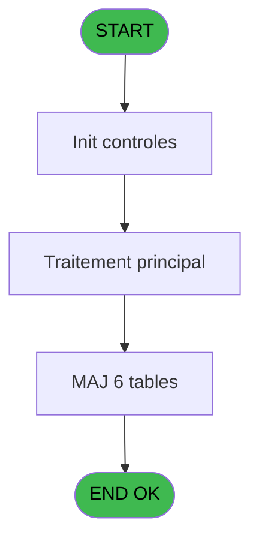

# PBG IDE 283 - Traitement Presta TAI new

> **Analyse**: Phases 1-4 2026-02-03 10:50 -> 10:50 (18s) | Assemblage 10:50
> **Pipeline**: V7.2 Enrichi
> **Structure**: 4 onglets (Resume | Ecrans | Donnees | Connexions)

<!-- TAB:Resume -->

## 1. FICHE D'IDENTITE

| Attribut | Valeur |
|----------|--------|
| Projet | PBG |
| IDE Position | 283 |
| Nom Programme | Traitement Presta TAI new |
| Fichier source | `Prg_283.xml` |
| Domaine metier | General |
| Taches | 7 (0 ecrans visibles) |
| Tables modifiees | 6 |
| Programmes appeles | 0 |

## 2. DESCRIPTION FONCTIONNELLE

**Traitement Presta TAI new** assure la gestion complete de ce processus, accessible depuis [Traitement des arrivants (IDE 206)](PBG-IDE-206.md).

Le flux de traitement s'organise en **2 blocs fonctionnels** :

- **Creation** (5 taches) : insertion d'enregistrements en base (mouvements, prestations)
- **Traitement** (2 taches) : traitements metier divers

**Donnees modifiees** : 6 tables en ecriture (gm-complet_______gmc, prestations______pre, libelle_prestation, heure_de_passage, comptage_caisse, tempo_date_heure).

Detail : phases du traitement

#### Phase 1 : Traitement (2 taches)

- **283** - Veuillez patienter... **[[ECRAN]](#ecran-t1)**
- **283.3.1** - Nouvelle

#### Phase 2 : Creation (5 taches)

- **283.1** - Creation Honey Moon
- **283.2** - Creation Circuit
- **283.3** - Creation Table Prestation
- **283.4** - Creation TAIGM
- **283.5** - Creation Circuit

#### Tables impactees

| Table | Operations | Role metier |
|-------|-----------|-------------|
| libelle_prestation | **W** (1 usages) | Prestations/services vendus |
| heure_de_passage | **W** (1 usages) |  |
| prestations______pre | **W** (1 usages) | Prestations/services vendus |
| gm-complet_______gmc | **W** (1 usages) |  |
| tempo_date_heure | **W** (1 usages) | Table temporaire ecran |
| comptage_caisse | **W** (1 usages) | Sessions de caisse |

## 3. BLOCS FONCTIONNELS

### 3.1 Traitement (2 taches)

Traitements internes.

---

#### 283 - Veuillez patienter... [[ECRAN]](#ecran-t1)

**Role** : Traitement : Veuillez patienter....
**Ecran** : 426 x 67 DLU (MDI) | [Voir mockup](#ecran-t1)

---

#### 283.3.1 - Nouvelle

**Role** : Creation d'enregistrement : Nouvelle.

### 3.2 Creation (5 taches)

Insertion de nouveaux enregistrements en base.

---

#### 283.1 - Creation Honey Moon

**Role** : Creation d'enregistrement : Creation Honey Moon.
**Variables liees** : F (P0-Honey Moon 1), G (P0-Honey Moon 2), H (P0-Honey Moon 3), I (P0-Honey Moon 4)

---

#### 283.2 - Creation Circuit

**Role** : Creation d'enregistrement : Creation Circuit.
**Variables liees** : N (W0-Ret Lien Circuit)

---

#### 283.3 - Creation Table Prestation

**Role** : Creation d'enregistrement : Creation Table Prestation.
**Variables liees** : C (P0-Nb Prestations), D (P0-New Prestation)

---

#### 283.4 - Creation TAIGM

**Role** : Creation d'enregistrement : Creation TAIGM.

---

#### 283.5 - Creation Circuit

**Role** : Creation d'enregistrement : Creation Circuit.
**Variables liees** : N (W0-Ret Lien Circuit)

## 5. REGLES METIER

*(Aucune regle metier identifiee)*

## 6. CONTEXTE

- **Appele par**: [Traitement des arrivants (IDE 206)](PBG-IDE-206.md)
- **Appelle**: 0 programmes | **Tables**: 9 (W:6 R:1 L:2) | **Taches**: 7 | **Expressions**: 14

<!-- TAB:Ecrans -->

## 8. ECRANS

*(Programme sans ecran visible)*

## 9. NAVIGATION

### 9.3 Structure hierarchique (7 taches)

| Position | Tache | Type | Dimensions | Bloc |
|----------|-------|------|------------|------|
| **283.1** | [**Veuillez patienter...** (283)](#t1) [mockup](#ecran-t1) | MDI | 426x67 | Traitement |
| 283.1.1 | [Nouvelle (283.3.1)](#t6) | MDI | - | |
| **283.2** | [**Creation Honey Moon** (283.1)](#t3) | MDI | - | Creation |
| 283.2.1 | [Creation Circuit (283.2)](#t4) | MDI | - | |
| 283.2.2 | [Creation Table Prestation (283.3)](#t5) | MDI | - | |
| 283.2.3 | [Creation TAIGM (283.4)](#t7) | MDI | - | |
| 283.2.4 | [Creation Circuit (283.5)](#t9) | MDI | - | |

### 9.4 Algorigramme

> **Legende**: Vert = START/END OK | Rouge = END KO | Bleu = Decisions
> *Algorigramme auto-genere. Utiliser `/algorigramme` pour une synthese metier detaillee.*

<!-- TAB:Donnees -->

## 10. TABLES

### Tables utilisees (9)

| ID | Nom | Description | Type | R | W | L | Usages |
|----|-----|-------------|------|---|---|---|--------|
| 31 | gm-complet_______gmc |  | DB |   | **W** |   | 1 |
| 33 | prestations______pre | Prestations/services vendus | DB |   | **W** |   | 1 |
| 135 | libelle_prestation | Prestations/services vendus | DB |   | **W** |   | 1 |
| 462 | type_change___________bi |  | DB |   |   | L | 1 |
| 463 | heure_de_passage |  | DB |   | **W** |   | 1 |
| 473 | comptage_caisse | Sessions de caisse | TMP |   | **W** |   | 1 |
| 569 | pointage_articles_caution | Articles et stock | TMP | R |   |   | 1 |
| 573 | tempo_ecran_mecano | Table temporaire ecran | TMP |   |   | L | 1 |
| 590 | tempo_date_heure | Table temporaire ecran | TMP |   | **W** |   | 1 |

### Colonnes par table (3 / 7 tables avec colonnes identifiees)

Table 31 - gm-complet_______gmc (**W**) - 1 usages

*Table utilisee uniquement en Link ou aucune colonne Real identifiee dans le DataView.*

Table 33 - prestations______pre (**W**) - 1 usages

| Lettre | Variable | Acces | Type |
|--------|----------|-------|------|
| C | P0-Nb Prestations | W | Numeric |

Table 135 - libelle_prestation (**W**) - 1 usages

| Lettre | Variable | Acces | Type |
|--------|----------|-------|------|
| A | V Existe prestation | W | Logical |
| C | P0-Nb Prestations | W | Numeric |
| D | P0-New Prestation | W | Logical |

Table 463 - heure_de_passage (**W**) - 1 usages

*Table utilisee uniquement en Link ou aucune colonne Real identifiee dans le DataView.*

Table 473 - comptage_caisse (**W**) - 1 usages

*Table utilisee uniquement en Link ou aucune colonne Real identifiee dans le DataView.*

Table 569 - pointage_articles_caution (R) - 1 usages

| Lettre | Variable | Acces | Type |
|--------|----------|-------|------|
| A | P0-Code Societe | R | Alpha |
| B | P0-Lieu de Sejour | R | Alpha |
| C | P0-Nb Prestations | R | Numeric |
| D | P0-New Prestation | R | Logical |
| E | P0-Num ressource | R | Numeric |
| F | P0-Honey Moon 1 | R | Alpha |
| G | P0-Honey Moon 2 | R | Alpha |
| H | P0-Honey Moon 3 | R | Alpha |
| I | P0-Honey Moon 4 | R | Alpha |
| J | W0-Operande | R | Numeric |
| K | W0-Operateur | R | Numeric |
| L | W0-Pourcentage | R | Numeric |
| M | W0-Calcul Pourcent | R | Numeric |
| N | W0-Ret Lien Circuit | R | Numeric |
| O | Existe TAIFORFAIT | R | Logical |
| P | V.Compteur | R | Numeric |

Table 590 - tempo_date_heure (**W**) - 1 usages

*Table utilisee uniquement en Link ou aucune colonne Real identifiee dans le DataView.*

## 11. VARIABLES

### 11.1 Variables de session (1)

Variables persistantes pendant toute la session.

| Lettre | Nom | Type | Usage dans |
|--------|-----|------|-----------|
| P | V.Compteur | Numeric | 1x session |

### 11.2 Autres (15)

Variables diverses.

| Lettre | Nom | Type | Usage dans |
|--------|-----|------|-----------|
| A | P0-Code Societe | Alpha | - |
| B | P0-Lieu de Sejour | Alpha | - |
| C | P0-Nb Prestations | Numeric | - |
| D | P0-New Prestation | Logical | - |
| E | P0-Num ressource | Numeric | - |
| F | P0-Honey Moon 1 | Alpha | - |
| G | P0-Honey Moon 2 | Alpha | - |
| H | P0-Honey Moon 3 | Alpha | - |
| I | P0-Honey Moon 4 | Alpha | - |
| J | W0-Operande | Numeric | - |
| K | W0-Operateur | Numeric | - |
| L | W0-Pourcentage | Numeric | - |
| M | W0-Calcul Pourcent | Numeric | - |
| N | W0-Ret Lien Circuit | Numeric | - |
| O | Existe TAIFORFAIT | Logical | - |

Toutes les 16 variables (liste complete)

| Cat | Lettre | Nom Variable | Type |
|-----|--------|--------------|------|
| V. | **P** | V.Compteur | Numeric |
| Autre | **A** | P0-Code Societe | Alpha |
| Autre | **B** | P0-Lieu de Sejour | Alpha |
| Autre | **C** | P0-Nb Prestations | Numeric |
| Autre | **D** | P0-New Prestation | Logical |
| Autre | **E** | P0-Num ressource | Numeric |
| Autre | **F** | P0-Honey Moon 1 | Alpha |
| Autre | **G** | P0-Honey Moon 2 | Alpha |
| Autre | **H** | P0-Honey Moon 3 | Alpha |
| Autre | **I** | P0-Honey Moon 4 | Alpha |
| Autre | **J** | W0-Operande | Numeric |
| Autre | **K** | W0-Operateur | Numeric |
| Autre | **L** | W0-Pourcentage | Numeric |
| Autre | **M** | W0-Calcul Pourcent | Numeric |
| Autre | **N** | W0-Ret Lien Circuit | Numeric |
| Autre | **O** | Existe TAIFORFAIT | Logical |

## 12. EXPRESSIONS

**14 / 14 expressions decodees (100%)**

### 12.1 Repartition par type

| Type | Expressions | Regles |
|------|-------------|--------|
| CALCULATION | 3 | 0 |
| CONSTANTE | 1 | 0 |
| CAST_LOGIQUE | 1 | 0 |
| REFERENCE_VG | 1 | 0 |
| OTHER | 4 | 0 |
| CONDITION | 4 | 0 |

### 12.2 Expressions cles par type

#### CALCULATION (3 expressions)

| Type | IDE | Expression | Regle |
|------|-----|------------|-------|
| CALCULATION | 13 | `[BY]+1` | - |
| CALCULATION | 4 | `([BY]/VG15)*50` | - |
| CALCULATION | 3 | `([BY]/VG15)*100` | - |

#### CONSTANTE (1 expressions)

| Type | IDE | Expression | Regle |
|------|-----|------------|-------|
| CONSTANTE | 2 | `''` | - |

#### CAST_LOGIQUE (1 expressions)

| Type | IDE | Expression | Regle |
|------|-----|------------|-------|
| CAST_LOGIQUE | 1 | `'FALSE'LOG` | - |

#### REFERENCE_VG (1 expressions)

| Type | IDE | Expression | Regle |
|------|-----|------------|-------|
| REFERENCE_VG | 5 | `VG20` | - |

#### OTHER (4 expressions)

| Type | IDE | Expression | Regle |
|------|-----|------------|-------|
| OTHER | 11 | `[AJ]` | - |
| OTHER | 14 | `[BZ]` | - |
| OTHER | 6 | `V.Compteur [P]` | - |
| OTHER | 10 | `[S]` | - |

#### CONDITION (4 expressions)

| Type | IDE | Expression | Regle |
|------|-----|------------|-------|
| CONDITION | 9 | `[AI]>'E'` | - |
| CONDITION | 12 | `Trim ([T])<>''` | - |
| CONDITION | 7 | `[S]=[CB] OR [S]=[CC] OR [S]=[CD] OR [S]=[CE]` | - |
| CONDITION | 8 | `[S]<>[CB] AND [S]<>[CC] AND [S]<>[CD] AND [S]<>[CE]` | - |

<!-- TAB:Connexions -->

## 13. GRAPHE D'APPELS

### 13.1 Chaine depuis Main (Callers)

Main -> ... -> [Traitement des arrivants (IDE 206)](PBG-IDE-206.md) -> **Traitement Presta TAI new (IDE 283)**

### 13.2 Callers

| IDE | Nom Programme | Nb Appels |
|-----|---------------|-----------|
| [206](PBG-IDE-206.md) | Traitement des arrivants | 1 |

### 13.3 Callees (programmes appeles)

### 13.4 Detail Callees avec contexte

| IDE | Nom Programme | Appels | Contexte |
|-----|---------------|--------|----------|
| - | (aucun) | - | - |

## 14. RECOMMANDATIONS MIGRATION

### 14.1 Profil du programme

| Metrique | Valeur | Impact migration |
|----------|--------|-----------------|
| Lignes de logique | 166 | Programme compact |
| Expressions | 14 | Peu de logique |
| Tables WRITE | 6 | Fort impact donnees |
| Sous-programmes | 0 | Peu de dependances |
| Ecrans visibles | 0 | Ecran unique ou traitement batch |
| Code desactive | 0% (0 / 166) | Code sain |
| Regles metier | 0 | Pas de regle identifiee |

### 14.2 Plan de migration par bloc

#### Traitement (2 taches: 1 ecran, 1 traitement)

- **Strategie** : Orchestrateur avec 1 ecrans (Razor/React) et 1 traitements backend (services).
- Les ecrans deviennent des composants UI, les traitements invisibles deviennent des services injectables.
- Decomposer les taches en services unitaires testables.

#### Creation (5 taches: 0 ecran, 5 traitements)

- **Strategie** : Repository pattern avec Entity Framework Core.
- Insertion via `IRepository<T>.CreateAsync()`

### 14.3 Dependances critiques

| Dependance | Type | Appels | Impact |
|------------|------|--------|--------|
| gm-complet_______gmc | Table WRITE (Database) | 1x | Schema + repository |
| prestations______pre | Table WRITE (Database) | 1x | Schema + repository |
| libelle_prestation | Table WRITE (Database) | 1x | Schema + repository |
| heure_de_passage | Table WRITE (Database) | 1x | Schema + repository |
| comptage_caisse | Table WRITE (Temp) | 1x | Schema + repository |
| tempo_date_heure | Table WRITE (Temp) | 1x | Schema + repository |

---
*Spec DETAILED generee par Pipeline V7.2 - 2026-02-03 10:50*
