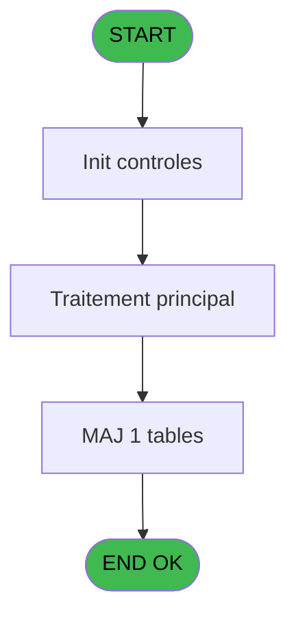
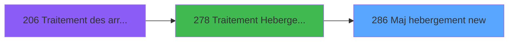

# PBG IDE 286 - Maj hebergement new

> **Analyse**: Phases 1-4 2026-02-03 10:51 -> 10:51 (18s) | Assemblage 10:51
> **Pipeline**: V7.2 Enrichi
> **Structure**: 4 onglets (Resume | Ecrans | Donnees | Connexions)

<!-- TAB:Resume -->

## 1. FICHE D'IDENTITE

| Attribut | Valeur |
|----------|--------|
| Projet | PBG |
| IDE Position | 286 |
| Nom Programme | Maj hebergement new |
| Fichier source | `Prg_286.xml` |
| Dossier IDE | General |
| Taches | 4 (0 ecrans visibles) |
| Tables modifiees | 1 |
| Programmes appeles | 0 |

## 2. DESCRIPTION FONCTIONNELLE

**Maj hebergement new** assure la gestion complete de ce processus, accessible depuis [Traitement Hebergements new (IDE 278)](PBG-IDE-278.md).

Le flux de traitement s'organise en **2 blocs fonctionnels** :

- **Traitement** (3 taches) : traitements metier divers
- **Validation** (1 tache) : controles et verifications de coherence

**Donnees modifiees** : 1 tables en ecriture (pointage_articles_caution).

Detail : phases du traitement

#### Phase 1 : Traitement (3 taches)

- **286.1** - Maj date hebergement
- **286.1.1** - hebergement
- **286** - (sans nom)

#### Phase 2 : Validation (1 tache)

- **286.2** - verif data a 0

#### Tables impactees

| Table | Operations | Role metier |
|-------|-----------|-------------|
| pointage_articles_caution | R/**W** (2 usages) | Articles et stock |

## 3. BLOCS FONCTIONNELS

### 3.1 Traitement (3 taches)

Traitements internes.

---

#### 286.1 - Maj date hebergement

**Role** : Traitement : Maj date hebergement.
**Variables liees** : B (V.not existe date a 0 ?)

---

#### 286.1.1 - hebergement

**Role** : Traitement : hebergement.

---

#### 286 - (sans nom)

**Role** : Traitement interne.

### 3.2 Validation (1 tache)

Controles de coherence : 1 tache verifie les donnees et conditions.

---

#### 286.2 - verif data a 0

**Role** : Verification : verif data a 0.

## 5. REGLES METIER

*(Aucune regle metier identifiee)*

## 6. CONTEXTE

- **Appele par**: [Traitement Hebergements new (IDE 278)](PBG-IDE-278.md)
- **Appelle**: 0 programmes | **Tables**: 2 (W:1 R:2 L:0) | **Taches**: 4 | **Expressions**: 2

<!-- TAB:Ecrans -->

## 8. ECRANS

*(Programme sans ecran visible)*

## 9. NAVIGATION

### 9.3 Structure hierarchique (4 taches)

| Position | Tache | Type | Dimensions | Bloc |
|----------|-------|------|------------|------|
| **286.1** | [**Maj date hebergement** (286.1)](#t2) | - | - | Traitement |
| 286.1.1 | [hebergement (286.1.1)](#t14) | - | - | |
| 286.1.2 | [(sans nom) (286)](#t16) | - | - | |
| **286.2** | [**verif data a 0** (286.2)](#t18) | - | - | Validation |

### 9.4 Algorigramme

> **Legende**: Vert = START/END OK | Rouge = END KO | Bleu = Decisions
> *Algorigramme auto-genere. Utiliser `/algorigramme` pour une synthese metier detaillee.*

<!-- TAB:Donnees -->

## 10. TABLES

### Tables utilisees (2)

| ID | Nom | Description | Type | R | W | L | Usages |
|----|-----|-------------|------|---|---|---|--------|
| 34 | hebergement______heb | Hebergement (chambres) | DB | R |   |   | 1 |
| 569 | pointage_articles_caution | Articles et stock | TMP | R | **W** |   | 2 |

### Colonnes par table (0 / 2 tables avec colonnes identifiees)

Table 34 - hebergement______heb (R) - 1 usages

*Table utilisee uniquement en Link ou aucune colonne Real identifiee dans le DataView.*

Table 569 - pointage_articles_caution (R/**W**) - 2 usages

*Table utilisee uniquement en Link ou aucune colonne Real identifiee dans le DataView.*

## 11. VARIABLES

### 11.1 Variables de session (1)

Variables persistantes pendant toute la session.

| Lettre | Nom | Type | Usage dans |
|--------|-----|------|-----------|
| B | V.not existe date a 0 ? | Logical | - |

### 11.2 Autres (1)

Variables diverses.

| Lettre | Nom | Type | Usage dans |
|--------|-----|------|-----------|
| A | Time debut | Time | 1x refs |

## 12. EXPRESSIONS

**2 / 2 expressions decodees (100%)**

### 12.1 Repartition par type

| Type | Expressions | Regles |
|------|-------------|--------|
| OTHER | 1 | 0 |
| REFERENCE_VG | 1 | 0 |

### 12.2 Expressions cles par type

#### OTHER (1 expressions)

| Type | IDE | Expression | Regle |
|------|-----|------------|-------|
| OTHER | 1 | `Time debut [A]` | - |

#### REFERENCE_VG (1 expressions)

| Type | IDE | Expression | Regle |
|------|-----|------------|-------|
| REFERENCE_VG | 2 | `VG20` | - |

<!-- TAB:Connexions -->

## 13. GRAPHE D'APPELS

### 13.1 Chaine depuis Main (Callers)

Main -> ... -> [Traitement Hebergements new (IDE 278)](PBG-IDE-278.md) -> **Maj hebergement new (IDE 286)**

### 13.2 Callers

| IDE | Nom Programme | Nb Appels |
|-----|---------------|-----------|
| [278](PBG-IDE-278.md) | Traitement Hebergements new | 1 |

### 13.3 Callees (programmes appeles)

### 13.4 Detail Callees avec contexte

| IDE | Nom Programme | Appels | Contexte |
|-----|---------------|--------|----------|
| - | (aucun) | - | - |

## 14. RECOMMANDATIONS MIGRATION

### 14.1 Profil du programme

| Metrique | Valeur | Impact migration |
|----------|--------|-----------------|
| Lignes de logique | 30 | Programme compact |
| Expressions | 2 | Peu de logique |
| Tables WRITE | 1 | Impact faible |
| Sous-programmes | 0 | Peu de dependances |
| Ecrans visibles | 0 | Ecran unique ou traitement batch |
| Code desactive | 0% (0 / 30) | Code sain |
| Regles metier | 0 | Pas de regle identifiee |

### 14.2 Plan de migration par bloc

#### Traitement (3 taches: 0 ecran, 3 traitements)

- **Strategie** : 3 service(s) backend injectable(s) (Domain Services).
- Decomposer les taches en services unitaires testables.

#### Validation (1 tache: 0 ecran, 1 traitement)

- **Strategie** : FluentValidation avec validators specifiques.
- Chaque tache de validation -> un validator injectable

### 14.3 Dependances critiques

| Dependance | Type | Appels | Impact |
|------------|------|--------|--------|
| pointage_articles_caution | Table WRITE (Temp) | 1x | Schema + repository |

---
*Spec DETAILED generee par Pipeline V7.2 - 2026-02-03 10:51*
