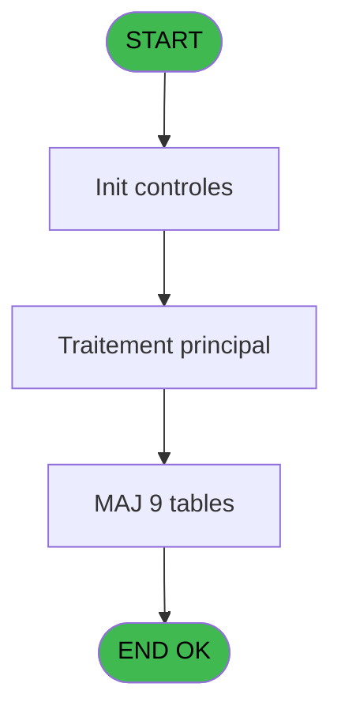
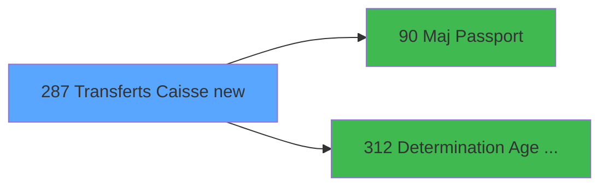

# PBG IDE 287 - Transferts Caisse new

> **Analyse**: Phases 1-4 2026-02-03 10:52 -> 10:52 (17s) | Assemblage 10:52
> **Pipeline**: V7.2 Enrichi
> **Structure**: 4 onglets (Resume | Ecrans | Donnees | Connexions)

<!-- TAB:Resume -->

## 1. FICHE D'IDENTITE

| Attribut | Valeur |
|----------|--------|
| Projet | PBG |
| IDE Position | 287 |
| Nom Programme | Transferts Caisse new |
| Fichier source | `Prg_287.xml` |
| Dossier IDE | Caisse |
| Taches | 9 (0 ecrans visibles) |
| Tables modifiees | 9 |
| Programmes appeles | 2 |

## 2. DESCRIPTION FONCTIONNELLE

**Transferts Caisse new** assure la gestion complete de ce processus, accessible depuis [Traitement des arrivants (IDE 206)](PBG-IDE-206.md).

Le flux de traitement s'organise en **3 blocs fonctionnels** :

- **Consultation** (4 taches) : ecrans de recherche, selection et consultation
- **Traitement** (3 taches) : traitements metier divers
- **Creation** (2 taches) : insertion d'enregistrements en base (mouvements, prestations)

**Donnees modifiees** : 9 tables en ecriture (gm-recherche_____gmr, hebergement______heb, personnel_go______go, client_gm, fichier_validation, heb_circuit______hci, email, fid_cumul, pointage_articles_caution).

**Logique metier** : 1 regles identifiees couvrant conditions metier.

Detail : phases du traitement

#### Phase 1 : Traitement (3 taches)

- **287** - Veuillez patienter... **[[ECRAN]](#ecran-t1)**
- **287.4** - Heb Age
- **287.5** - Heb Age

Delegue a : [  Maj Passport (IDE 90)](PBG-IDE-90.md), [Determination Age Debut Sejour (IDE 312)](PBG-IDE-312.md)

#### Phase 2 : Consultation (4 taches)

- **287.1** - Creation Recherche
- **287.2** - Creation Recherche
- **287.3** - Creation Recherche
- **287.8** - Creation Recherche

#### Phase 3 : Creation (2 taches)

- **287.6** - Creation email
- **287.7** - Creation Cumul Fid

#### Tables impactees

| Table | Operations | Role metier |
|-------|-----------|-------------|
| heb_circuit______hci | **W** (1 usages) | Hebergement (chambres) |
| hebergement______heb | **W** (1 usages) | Hebergement (chambres) |
| fichier_validation | **W** (1 usages) |  |
| gm-recherche_____gmr | **W** (1 usages) | Index de recherche |
| client_gm | **W** (1 usages) |  |
| email | **W** (1 usages) |  |
| pointage_articles_caution | **W** (1 usages) | Articles et stock |
| personnel_go______go | **W** (1 usages) |  |
| fid_cumul | **W** (1 usages) |  |

## 3. BLOCS FONCTIONNELS

### 3.1 Traitement (3 taches)

Traitements internes.

---

#### 287 - Veuillez patienter... [[ECRAN]](#ecran-t1)

**Role** : Traitement : Veuillez patienter....
**Ecran** : 427 x 68 DLU (MDI) | [Voir mockup](#ecran-t1)
**Delegue a** : [  Maj Passport (IDE 90)](PBG-IDE-90.md), [Determination Age Debut Sejour (IDE 312)](PBG-IDE-312.md)

---

#### 287.4 - Heb Age

**Role** : Traitement : Heb Age.
**Delegue a** : [  Maj Passport (IDE 90)](PBG-IDE-90.md), [Determination Age Debut Sejour (IDE 312)](PBG-IDE-312.md)

---

#### 287.5 - Heb Age

**Role** : Traitement : Heb Age.
**Delegue a** : [  Maj Passport (IDE 90)](PBG-IDE-90.md), [Determination Age Debut Sejour (IDE 312)](PBG-IDE-312.md)

### 3.2 Consultation (4 taches)

Ecrans de recherche et consultation.

---

#### 287.1 - Creation Recherche

**Role** : Creation d'enregistrement : Creation Recherche.

---

#### 287.2 - Creation Recherche

**Role** : Creation d'enregistrement : Creation Recherche.

---

#### 287.3 - Creation Recherche

**Role** : Creation d'enregistrement : Creation Recherche.

---

#### 287.8 - Creation Recherche

**Role** : Creation d'enregistrement : Creation Recherche.

### 3.3 Creation (2 taches)

Insertion de nouveaux enregistrements en base.

---

#### 287.6 - Creation email

**Role** : Creation d'enregistrement : Creation email.

---

#### 287.7 - Creation Cumul Fid

**Role** : Creation d'enregistrement : Creation Cumul Fid.

## 5. REGLES METIER

1 regles identifiees:

### Autres (1 regles)

#### [RM-001] Si [O]>0 AND [AV]<=W0-Operateur [H] alors 'O' sinon 'N')

| Element | Detail |
|---------|--------|
| **Condition** | `[O]>0 AND [AV]<=W0-Operateur [H]` |
| **Si vrai** | 'O' |
| **Si faux** | 'N') |
| **Variables** | H (W0-Operateur) |
| **Expression source** | Expression 10 : `IF ([O]>0 AND [AV]<=W0-Operateur [H],'O','N')` |
| **Exemple** | Si [O]>0 AND [AV]<=W0-Operateur [H] → 'O'. Sinon → 'N') |

## 6. CONTEXTE

- **Appele par**: [Traitement des arrivants (IDE 206)](PBG-IDE-206.md)
- **Appelle**: 2 programmes | **Tables**: 11 (W:9 R:0 L:2) | **Taches**: 9 | **Expressions**: 21

<!-- TAB:Ecrans -->

## 8. ECRANS

*(Programme sans ecran visible)*

## 9. NAVIGATION

### 9.3 Structure hierarchique (9 taches)

| Position | Tache | Type | Dimensions | Bloc |
|----------|-------|------|------------|------|
| **287.1** | [**Veuillez patienter...** (287)](#t1) [mockup](#ecran-t1) | MDI | 427x68 | Traitement |
| 287.1.1 | [Heb Age (287.4)](#t7) | MDI | - | |
| 287.1.2 | [Heb Age (287.5)](#t8) | MDI | - | |
| **287.2** | [**Creation Recherche** (287.1)](#t4) | MDI | - | Consultation |
| 287.2.1 | [Creation Recherche (287.2)](#t5) | MDI | - | |
| 287.2.2 | [Creation Recherche (287.3)](#t6) | MDI | - | |
| 287.2.3 | [Creation Recherche (287.8)](#t16) | MDI | - | |
| **287.3** | [**Creation email** (287.6)](#t9) | MDI | - | Creation |
| 287.3.1 | [Creation Cumul Fid (287.7)](#t10) | MDI | - | |

### 9.4 Algorigramme

> **Legende**: Vert = START/END OK | Rouge = END KO | Bleu = Decisions
> *Algorigramme auto-genere. Utiliser `/algorigramme` pour une synthese metier detaillee.*

<!-- TAB:Donnees -->

## 10. TABLES

### Tables utilisees (11)

| ID | Nom | Description | Type | R | W | L | Usages |
|----|-----|-------------|------|---|---|---|--------|
| 30 | gm-recherche_____gmr | Index de recherche | DB |   | **W** |   | 1 |
| 31 | gm-complet_______gmc |  | DB |   |   | L | 1 |
| 34 | hebergement______heb | Hebergement (chambres) | DB |   | **W** |   | 1 |
| 35 | personnel_go______go |  | DB |   | **W** |   | 1 |
| 36 | client_gm |  | DB |   | **W** |   | 1 |
| 131 | fichier_validation |  | DB |   | **W** |   | 1 |
| 168 | heb_circuit______hci | Hebergement (chambres) | DB |   | **W** |   | 1 |
| 285 | email |  | DB |   | **W** |   | 1 |
| 314 | fid_cumul |  | DB |   | **W** |   | 1 |
| 569 | pointage_articles_caution | Articles et stock | TMP |   | **W** |   | 1 |
| 720 | arc_transac_entete_bar |  | DB |   |   | L | 1 |

### Colonnes par table (1 / 9 tables avec colonnes identifiees)

Table 30 - gm-recherche_____gmr (**W**) - 1 usages

*Table utilisee uniquement en Link ou aucune colonne Real identifiee dans le DataView.*

Table 34 - hebergement______heb (**W**) - 1 usages

*Table utilisee uniquement en Link ou aucune colonne Real identifiee dans le DataView.*

Table 35 - personnel_go______go (**W**) - 1 usages

*Table utilisee uniquement en Link ou aucune colonne Real identifiee dans le DataView.*

Table 36 - client_gm (**W**) - 1 usages

*Table utilisee uniquement en Link ou aucune colonne Real identifiee dans le DataView.*

Table 131 - fichier_validation (**W**) - 1 usages

*Table utilisee uniquement en Link ou aucune colonne Real identifiee dans le DataView.*

Table 168 - heb_circuit______hci (**W**) - 1 usages

*Table utilisee uniquement en Link ou aucune colonne Real identifiee dans le DataView.*

Table 285 - email (**W**) - 1 usages

*Table utilisee uniquement en Link ou aucune colonne Real identifiee dans le DataView.*

Table 314 - fid_cumul (**W**) - 1 usages

*Table utilisee uniquement en Link ou aucune colonne Real identifiee dans le DataView.*

Table 569 - pointage_articles_caution (**W**) - 1 usages

| Lettre | Variable | Acces | Type |
|--------|----------|-------|------|
| A | P0-Code Societe | W | Alpha |
| B | P0-Nb Arrivants | W | Numeric |
| C | P0-Qualite Import | W | Alpha |
| D | P0-Num ressource | W | Numeric |
| E | P0-Planning Actif | W | Alpha |
| F | P0 Age Bebe | W | Numeric |
| G | W0-Operande | W | Numeric |
| H | W0-Operateur | W | Numeric |
| I | W0-Pourcentage | W | Numeric |
| J | W0-Calcul Pourcent | W | Numeric |
| K | W0 Age | W | Numeric |
| L | W0 Nb mois | W | Numeric |
| M | V.Compteur | W | Numeric |

## 11. VARIABLES

### 11.1 Parametres entrants (1)

Variables recues du programme appelant ([Traitement des arrivants (IDE 206)](PBG-IDE-206.md)).

| Lettre | Nom | Type | Usage dans |
|--------|-----|------|-----------|
| F | P0 Age Bebe | Numeric | - |

### 11.2 Variables de session (1)

Variables persistantes pendant toute la session.

| Lettre | Nom | Type | Usage dans |
|--------|-----|------|-----------|
| M | V.Compteur | Numeric | 1x session |

### 11.3 Variables de travail (2)

Variables internes au programme.

| Lettre | Nom | Type | Usage dans |
|--------|-----|------|-----------|
| K | W0 Age | Numeric | - |
| L | W0 Nb mois | Numeric | 1x calcul interne |

### 11.4 Autres (9)

Variables diverses.

| Lettre | Nom | Type | Usage dans |
|--------|-----|------|-----------|
| A | P0-Code Societe | Alpha | 1x refs |
| B | P0-Nb Arrivants | Numeric | - |
| C | P0-Qualite Import | Alpha | - |
| D | P0-Num ressource | Numeric | - |
| E | P0-Planning Actif | Alpha | - |
| G | W0-Operande | Numeric | - |
| H | W0-Operateur | Numeric | 1x refs |
| I | W0-Pourcentage | Numeric | - |
| J | W0-Calcul Pourcent | Numeric | - |

## 12. EXPRESSIONS

**21 / 21 expressions decodees (100%)**

### 12.1 Repartition par type

| Type | Expressions | Regles |
|------|-------------|--------|
| CALCULATION | 3 | 0 |
| CONDITION | 5 | 5 |
| CONSTANTE | 3 | 0 |
| REFERENCE_VG | 2 | 0 |
| OTHER | 6 | 0 |
| CAST_LOGIQUE | 1 | 0 |
| NEGATION | 1 | 0 |

### 12.2 Expressions cles par type

#### CALCULATION (3 expressions)

| Type | IDE | Expression | Regle |
|------|-----|------------|-------|
| CALCULATION | 14 | `[CV]+1` | - |
| CALCULATION | 3 | `([CV]/VG1)*50` | - |
| CALCULATION | 2 | `([CV]/VG1)*100` | - |

#### CONDITION (5 expressions)

| Type | IDE | Expression | Regle |
|------|-----|------------|-------|
| CONDITION | 10 | `IF ([O]>0 AND [AV]<=W0-Operateur [H],'O','N')` | [RM-001](#rm-RM-001) |
| CONDITION | 16 | `VG31 AND [CY]='GO'` | - |
| CONDITION | 21 | `[DG]='G'` | - |
| CONDITION | 12 | `[AC]<>''` | - |
| CONDITION | 13 | `[U]='H' OR [U]='O'` | - |

#### CONSTANTE (3 expressions)

| Type | IDE | Expression | Regle |
|------|-----|------------|-------|
| CONSTANTE | 6 | `'I'` | - |
| CONSTANTE | 5 | `'F'` | - |
| CONSTANTE | 1 | `''` | - |

#### REFERENCE_VG (2 expressions)

| Type | IDE | Expression | Regle |
|------|-----|------------|-------|
| REFERENCE_VG | 19 | `VG41` | - |
| REFERENCE_VG | 4 | `VG20` | - |

#### OTHER (6 expressions)

| Type | IDE | Expression | Regle |
|------|-----|------------|-------|
| OTHER | 15 | `[CX]` | - |
| OTHER | 18 | `[DD]` | - |
| OTHER | 20 | `[DE]` | - |
| OTHER | 7 | `P0-Code Societe [A]` | - |
| OTHER | 8 | `W0 Nb mois [L]` | - |
| ... | | *+1 autres* | |

#### CAST_LOGIQUE (1 expressions)

| Type | IDE | Expression | Regle |
|------|-----|------------|-------|
| CAST_LOGIQUE | 11 | `'TRUE'LOG` | - |

#### NEGATION (1 expressions)

| Type | IDE | Expression | Regle |
|------|-----|------------|-------|
| NEGATION | 17 | `NOT VG31 OR VG31 AND [CY]='GM'` | - |

### 12.3 Toutes les expressions (21)

Voir les 21 expressions

#### CALCULATION (3)

| IDE | Expression Decodee |
|-----|-------------------|
| 2 | `([CV]/VG1)*100` |
| 3 | `([CV]/VG1)*50` |
| 14 | `[CV]+1` |

#### CONDITION (5)

| IDE | Expression Decodee |
|-----|-------------------|
| 10 | `IF ([O]>0 AND [AV]<=W0-Operateur [H],'O','N')` |
| 12 | `[AC]<>''` |
| 13 | `[U]='H' OR [U]='O'` |
| 16 | `VG31 AND [CY]='GO'` |
| 21 | `[DG]='G'` |

#### CONSTANTE (3)

| IDE | Expression Decodee |
|-----|-------------------|
| 1 | `''` |
| 5 | `'F'` |
| 6 | `'I'` |

#### REFERENCE_VG (2)

| IDE | Expression Decodee |
|-----|-------------------|
| 4 | `VG20` |
| 19 | `VG41` |

#### OTHER (6)

| IDE | Expression Decodee |
|-----|-------------------|
| 7 | `P0-Code Societe [A]` |
| 8 | `W0 Nb mois [L]` |
| 9 | `V.Compteur [M]` |
| 15 | `[CX]` |
| 18 | `[DD]` |
| 20 | `[DE]` |

#### CAST_LOGIQUE (1)

| IDE | Expression Decodee |
|-----|-------------------|
| 11 | `'TRUE'LOG` |

#### NEGATION (1)

| IDE | Expression Decodee |
|-----|-------------------|
| 17 | `NOT VG31 OR VG31 AND [CY]='GM'` |

<!-- TAB:Connexions -->

## 13. GRAPHE D'APPELS

### 13.1 Chaine depuis Main (Callers)

Main -> ... -> [Traitement des arrivants (IDE 206)](PBG-IDE-206.md) -> **Transferts Caisse new (IDE 287)**

### 13.2 Callers

| IDE | Nom Programme | Nb Appels |
|-----|---------------|-----------|
| [206](PBG-IDE-206.md) | Traitement des arrivants | 1 |

### 13.3 Callees (programmes appeles)

### 13.4 Detail Callees avec contexte

| IDE | Nom Programme | Appels | Contexte |
|-----|---------------|--------|----------|
| [90](PBG-IDE-90.md) |   Maj Passport | 1 | Mise a jour donnees |
| [312](PBG-IDE-312.md) | Determination Age Debut Sejour | 1 | Sous-programme |

## 14. RECOMMANDATIONS MIGRATION

### 14.1 Profil du programme

| Metrique | Valeur | Impact migration |
|----------|--------|-----------------|
| Lignes de logique | 319 | Taille moyenne |
| Expressions | 21 | Peu de logique |
| Tables WRITE | 9 | Fort impact donnees |
| Sous-programmes | 2 | Peu de dependances |
| Ecrans visibles | 0 | Ecran unique ou traitement batch |
| Code desactive | 0% (0 / 319) | Code sain |
| Regles metier | 1 | Quelques regles a preserver |

### 14.2 Plan de migration par bloc

#### Traitement (3 taches: 1 ecran, 2 traitements)

- **Strategie** : Orchestrateur avec 1 ecrans (Razor/React) et 2 traitements backend (services).
- Les ecrans deviennent des composants UI, les traitements invisibles deviennent des services injectables.
- 2 sous-programme(s) a migrer ou a reutiliser depuis les services existants.
- Decomposer les taches en services unitaires testables.

#### Consultation (4 taches: 0 ecran, 4 traitements)

- **Strategie** : Composants de recherche/selection en modales.

#### Creation (2 taches: 0 ecran, 2 traitements)

- **Strategie** : Repository pattern avec Entity Framework Core.
- Insertion via `IRepository<T>.CreateAsync()`

### 14.3 Dependances critiques

| Dependance | Type | Appels | Impact |
|------------|------|--------|--------|
| gm-recherche_____gmr | Table WRITE (Database) | 1x | Schema + repository |
| hebergement______heb | Table WRITE (Database) | 1x | Schema + repository |
| personnel_go______go | Table WRITE (Database) | 1x | Schema + repository |
| client_gm | Table WRITE (Database) | 1x | Schema + repository |
| fichier_validation | Table WRITE (Database) | 1x | Schema + repository |
| heb_circuit______hci | Table WRITE (Database) | 1x | Schema + repository |
| email | Table WRITE (Database) | 1x | Schema + repository |
| fid_cumul | Table WRITE (Database) | 1x | Schema + repository |
| pointage_articles_caution | Table WRITE (Temp) | 1x | Schema + repository |
| [Determination Age Debut Sejour (IDE 312)](PBG-IDE-312.md) | Sous-programme | 1x | Normale - Sous-programme |
| [  Maj Passport (IDE 90)](PBG-IDE-90.md) | Sous-programme | 1x | Normale - Mise a jour donnees |

---
*Spec DETAILED generee par Pipeline V7.2 - 2026-02-03 10:52*
