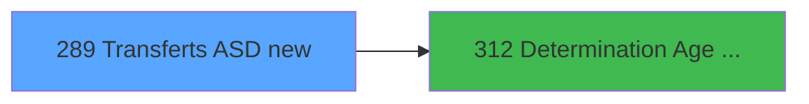

# PBG IDE 289 - Transferts ASD new

> **Analyse**: Phases 1-4 2026-02-03 10:52 -> 10:53 (19s) | Assemblage 10:53
> **Pipeline**: V7.2 Enrichi
> **Structure**: 4 onglets (Resume | Ecrans | Donnees | Connexions)

<!-- TAB:Resume -->

## 1. FICHE D'IDENTITE

| Attribut | Valeur |
|----------|--------|
| Projet | PBG |
| IDE Position | 289 |
| Nom Programme | Transferts ASD new |
| Fichier source | `Prg_289.xml` |
| Dossier IDE | General |
| Taches | 2 (0 ecrans visibles) |
| Tables modifiees | 1 |
| Programmes appeles | 1 |

## 2. DESCRIPTION FONCTIONNELLE

**Transferts ASD new** assure la gestion complete de ce processus, accessible depuis [Traitement des arrivants (IDE 206)](PBG-IDE-206.md).

Le flux de traitement s'organise en **1 blocs fonctionnels** :

- **Traitement** (2 taches) : traitements metier divers

**Donnees modifiees** : 1 tables en ecriture (new_asd).

## 3. BLOCS FONCTIONNELS

### 3.1 Traitement (2 taches)

Traitements internes.

---

#### 289 - Veuillez patienter... [[ECRAN]](#ecran-t1)

**Role** : Traitement : Veuillez patienter....
**Ecran** : 424 x 66 DLU (MDI) | [Voir mockup](#ecran-t1)
**Delegue a** : [Determination Age Debut Sejour (IDE 312)](PBG-IDE-312.md)

---

#### 289.1 - Ecriture ASD

**Role** : Traitement : Ecriture ASD.
**Delegue a** : [Determination Age Debut Sejour (IDE 312)](PBG-IDE-312.md)

## 5. REGLES METIER

*(Aucune regle metier identifiee)*

## 6. CONTEXTE

- **Appele par**: [Traitement des arrivants (IDE 206)](PBG-IDE-206.md)
- **Appelle**: 1 programmes | **Tables**: 4 (W:1 R:1 L:2) | **Taches**: 2 | **Expressions**: 23

<!-- TAB:Ecrans -->

## 8. ECRANS

*(Programme sans ecran visible)*

## 9. NAVIGATION

### 9.3 Structure hierarchique (2 taches)

| Position | Tache | Type | Dimensions | Bloc |
|----------|-------|------|------------|------|
| **289.1** | [**Veuillez patienter...** (289)](#t1) [mockup](#ecran-t1) | MDI | 424x66 | Traitement |
| 289.1.1 | [Ecriture ASD (289.1)](#t4) | MDI | - | |

### 9.4 Algorigramme

> **Legende**: Vert = START/END OK | Rouge = END KO | Bleu = Decisions
> *Algorigramme auto-genere. Utiliser `/algorigramme` pour une synthese metier detaillee.*

<!-- TAB:Donnees -->

## 10. TABLES

### Tables utilisees (4)

| ID | Nom | Description | Type | R | W | L | Usages |
|----|-----|-------------|------|---|---|---|--------|
| 31 | gm-complet_______gmc |  | DB |   |   | L | 1 |
| 34 | hebergement______heb | Hebergement (chambres) | DB | R |   |   | 1 |
| 133 | new_asd |  | DB |   | **W** |   | 1 |
| 569 | pointage_articles_caution | Articles et stock | TMP |   |   | L | 1 |

### Colonnes par table (1 / 2 tables avec colonnes identifiees)

Table 34 - hebergement______heb (R) - 1 usages

| Lettre | Variable | Acces | Type |
|--------|----------|-------|------|
| A | P0-Code Societe | R | Alpha |
| B | P0-Nb Arrivants | R | Numeric |
| C | P0-Num ressource | R | Numeric |
| D | P0 Age Bebe | R | Numeric |
| E | P0 Age Enfant | R | Numeric |
| F | W0-Operande | R | Numeric |
| G | W0-Operateur | R | Numeric |
| H | W0-Pourcentage | R | Numeric |
| I | W0-Calcul Pourcent | R | Numeric |
| J | W0 (B)ebe (E)nfant | R | Alpha |
| K | W-age | R | Numeric |
| L | W-Nb mois | R | Numeric |
| M | V.Compteur | R | Numeric |

Table 133 - new_asd (**W**) - 1 usages

*Table utilisee uniquement en Link ou aucune colonne Real identifiee dans le DataView.*

## 11. VARIABLES

### 11.1 Parametres entrants (2)

Variables recues du programme appelant ([Traitement des arrivants (IDE 206)](PBG-IDE-206.md)).

| Lettre | Nom | Type | Usage dans |
|--------|-----|------|-----------|
| D | P0 Age Bebe | Numeric | - |
| E | P0 Age Enfant | Numeric | - |

### 11.2 Variables de session (1)

Variables persistantes pendant toute la session.

| Lettre | Nom | Type | Usage dans |
|--------|-----|------|-----------|
| M | V.Compteur | Numeric | - |

### 11.3 Variables de travail (1)

Variables internes au programme.

| Lettre | Nom | Type | Usage dans |
|--------|-----|------|-----------|
| J | W0 (B)ebe (E)nfant | Alpha | - |

### 11.4 Autres (9)

Variables diverses.

| Lettre | Nom | Type | Usage dans |
|--------|-----|------|-----------|
| A | P0-Code Societe | Alpha | - |
| B | P0-Nb Arrivants | Numeric | - |
| C | P0-Num ressource | Numeric | - |
| F | W0-Operande | Numeric | - |
| G | W0-Operateur | Numeric | 2x refs |
| H | W0-Pourcentage | Numeric | 1x refs |
| I | W0-Calcul Pourcent | Numeric | - |
| K | W-age | Numeric | 2x refs |
| L | W-Nb mois | Numeric | - |

## 12. EXPRESSIONS

**23 / 23 expressions decodees (100%)**

### 12.1 Repartition par type

| Type | Expressions | Regles |
|------|-------------|--------|
| CALCULATION | 3 | 0 |
| CONDITION | 4 | 0 |
| CONSTANTE | 9 | 0 |
| REFERENCE_VG | 1 | 0 |
| OTHER | 6 | 0 |

### 12.2 Expressions cles par type

#### CALCULATION (3 expressions)

| Type | IDE | Expression | Regle |
|------|-----|------------|-------|
| CALCULATION | 22 | `[CJ]+1` | - |
| CALCULATION | 3 | `([CJ]/VG1)*50` | - |
| CALCULATION | 2 | `([CJ]/VG1)*100` | - |

#### CONDITION (4 expressions)

| Type | IDE | Expression | Regle |
|------|-----|------------|-------|
| CONDITION | 18 | `W-age [K]<=0` | - |
| CONDITION | 21 | `[Q]<>0` | - |
| CONDITION | 16 | `[CH]<=W0-Operateur [G] AND W-age [K]<>'00/00/0000'DATE` | - |
| CONDITION | 17 | `[CH]<=W0-Pourcentage [H] AND [CH]>W0-Operateur [G]` | - |

#### CONSTANTE (9 expressions)

| Type | IDE | Expression | Regle |
|------|-----|------------|-------|
| CONSTANTE | 15 | `'B'` | - |
| CONSTANTE | 14 | `'H'` | - |
| CONSTANTE | 20 | `'E'` | - |
| CONSTANTE | 19 | `''` | - |
| CONSTANTE | 13 | `'Z'` | - |
| ... | | *+4 autres* | |

#### REFERENCE_VG (1 expressions)

| Type | IDE | Expression | Regle |
|------|-----|------------|-------|
| REFERENCE_VG | 4 | `VG20` | - |

#### OTHER (6 expressions)

| Type | IDE | Expression | Regle |
|------|-----|------------|-------|
| OTHER | 10 | `[Q]` | - |
| OTHER | 11 | `[R]` | - |
| OTHER | 23 | `[CK]` | - |
| OTHER | 7 | `[N]` | - |
| OTHER | 8 | `[O]` | - |
| ... | | *+1 autres* | |

### 12.3 Toutes les expressions (23)

Voir les 23 expressions

#### CALCULATION (3)

| IDE | Expression Decodee |
|-----|-------------------|
| 2 | `([CJ]/VG1)*100` |
| 3 | `([CJ]/VG1)*50` |
| 22 | `[CJ]+1` |

#### CONDITION (4)

| IDE | Expression Decodee |
|-----|-------------------|
| 16 | `[CH]<=W0-Operateur [G] AND W-age [K]<>'00/00/0000'DATE` |
| 17 | `[CH]<=W0-Pourcentage [H] AND [CH]>W0-Operateur [G]` |
| 18 | `W-age [K]<=0` |
| 21 | `[Q]<>0` |

#### CONSTANTE (9)

| IDE | Expression Decodee |
|-----|-------------------|
| 1 | `''` |
| 5 | `'F'` |
| 6 | `'I'` |
| 12 | `'A'` |
| 13 | `'Z'` |
| 14 | `'H'` |
| 15 | `'B'` |
| 19 | `''` |
| 20 | `'E'` |

#### REFERENCE_VG (1)

| IDE | Expression Decodee |
|-----|-------------------|
| 4 | `VG20` |

#### OTHER (6)

| IDE | Expression Decodee |
|-----|-------------------|
| 7 | `[N]` |
| 8 | `[O]` |
| 9 | `[P]` |
| 10 | `[Q]` |
| 11 | `[R]` |
| 23 | `[CK]` |

<!-- TAB:Connexions -->

## 13. GRAPHE D'APPELS

### 13.1 Chaine depuis Main (Callers)

Main -> ... -> [Traitement des arrivants (IDE 206)](PBG-IDE-206.md) -> **Transferts ASD new (IDE 289)**

### 13.2 Callers

| IDE | Nom Programme | Nb Appels |
|-----|---------------|-----------|
| [206](PBG-IDE-206.md) | Traitement des arrivants | 1 |

### 13.3 Callees (programmes appeles)

### 13.4 Detail Callees avec contexte

| IDE | Nom Programme | Appels | Contexte |
|-----|---------------|--------|----------|
| [312](PBG-IDE-312.md) | Determination Age Debut Sejour | 1 | Sous-programme |

## 14. RECOMMANDATIONS MIGRATION

### 14.1 Profil du programme

| Metrique | Valeur | Impact migration |
|----------|--------|-----------------|
| Lignes de logique | 106 | Programme compact |
| Expressions | 23 | Peu de logique |
| Tables WRITE | 1 | Impact faible |
| Sous-programmes | 1 | Peu de dependances |
| Ecrans visibles | 0 | Ecran unique ou traitement batch |
| Code desactive | 0% (0 / 106) | Code sain |
| Regles metier | 0 | Pas de regle identifiee |

### 14.2 Plan de migration par bloc

#### Traitement (2 taches: 1 ecran, 1 traitement)

- **Strategie** : Orchestrateur avec 1 ecrans (Razor/React) et 1 traitements backend (services).
- Les ecrans deviennent des composants UI, les traitements invisibles deviennent des services injectables.
- 1 sous-programme(s) a migrer ou a reutiliser depuis les services existants.
- Decomposer les taches en services unitaires testables.

### 14.3 Dependances critiques

| Dependance | Type | Appels | Impact |
|------------|------|--------|--------|
| new_asd | Table WRITE (Database) | 1x | Schema + repository |
| [Determination Age Debut Sejour (IDE 312)](PBG-IDE-312.md) | Sous-programme | 1x | Normale - Sous-programme |

---
*Spec DETAILED generee par Pipeline V7.2 - 2026-02-03 10:53*
