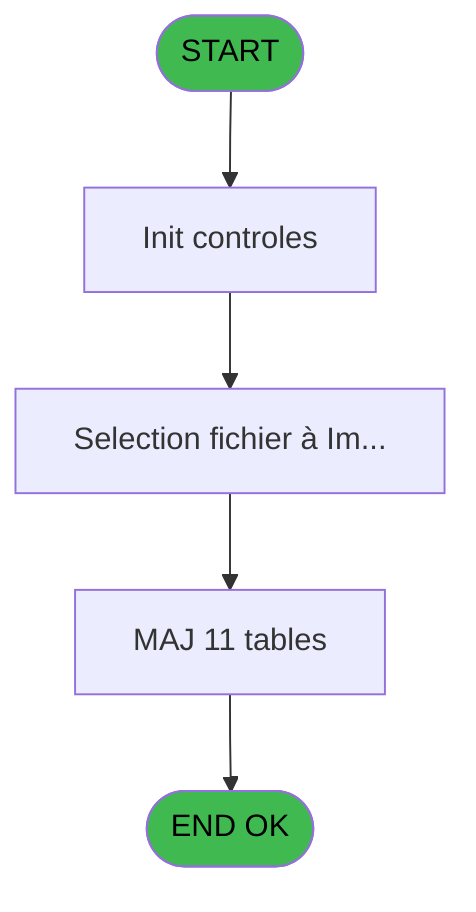
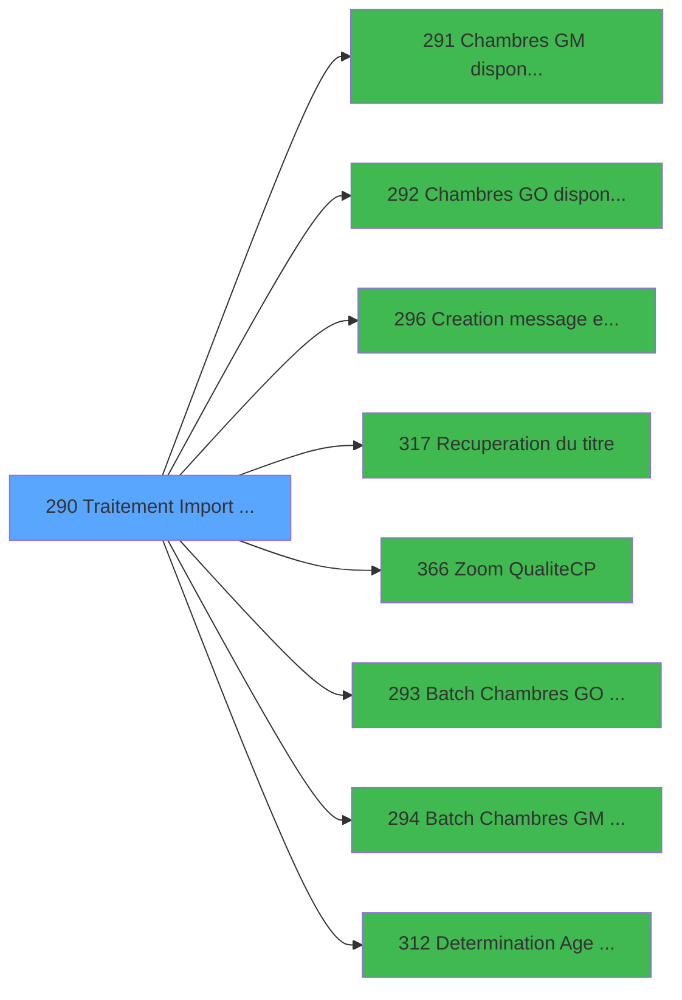

# PBG IDE 290 - Traitement Import Personnel

> **Analyse**: Phases 1-4 2026-02-03 10:53 -> 10:53 (19s) | Assemblage 10:53
> **Pipeline**: V7.2 Enrichi
> **Structure**: 4 onglets (Resume | Ecrans | Donnees | Connexions)

<!-- TAB:Resume -->

## 1. FICHE D'IDENTITE

| Attribut | Valeur |
|----------|--------|
| Projet | PBG |
| IDE Position | 290 |
| Nom Programme | Traitement Import Personnel |
| Fichier source | `Prg_290.xml` |
| Dossier IDE | General |
| Taches | 37 (9 ecrans visibles) |
| Tables modifiees | 11 |
| Programmes appeles | 8 |
| :warning: Statut | **ORPHELIN_POTENTIEL** |

## 2. DESCRIPTION FONCTIONNELLE

**Traitement Import Personnel** assure la gestion complete de ce processus.

Le flux de traitement s'organise en **5 blocs fonctionnels** :

- **Traitement** (23 taches) : traitements metier divers
- **Creation** (5 taches) : insertion d'enregistrements en base (mouvements, prestations)
- **Validation** (3 taches) : controles et verifications de coherence
- **Calcul** (3 taches) : calculs de montants, stocks ou compteurs
- **Consultation** (3 taches) : ecrans de recherche, selection et consultation

**Donnees modifiees** : 11 tables en ecriture (gm-recherche_____gmr, gm-complet_______gmc, hebergement______heb, personnel_go______go, compte_gm________cgm, compteurs________cpt, fichier_validation, tairejet, special_offers, entete_facture_tva, annulation_vente).

Detail : phases du traitement

#### Phase 1 : Traitement (23 taches)

- **290** - (sans nom) **[[ECRAN]](#ecran-t1)**
- **290.1** - Import Personnel GO **[[ECRAN]](#ecran-t3)**
- **290.1.1** - Visualisation import effectués **[[ECRAN]](#ecran-t35)**
- **290.2** - Importation - (Création) **[[ECRAN]](#ecran-t36)**
- **290.4** - Lecture Sequence
- **290.5** - Lecture Sequence
- **290.7** - Affectation Automatique **[[ECRAN]](#ecran-t104)**
- **290.9** - (sans nom)
- **290.10** - Import Personnel GO **[[ECRAN]](#ecran-t130)**
- **290.10.1** - Erreur **[[ECRAN]](#ecran-t131)**
- **290.11** - Maj Fonctions / Seervice **[[ECRAN]](#ecran-t147)**
- **290.11.1** - Maj Civilité / Nationalité
- **290.8.12** - gm chambre
- **290.8.13** - Determination age bebe
- **290.1.2** - Exemple fic Import
- **290.1.2.1** - Récup. village
- **290.12** - Import Personnel GO **[[ECRAN]](#ecran-t173)**
- **290.12.1** - Visualisation import effectués **[[ECRAN]](#ecran-t174)**
- **290.12.2** - Exemple fic Import
- **290.12.2.1** - Récup. village
- **290.13** - Importation - (Création) **[[ECRAN]](#ecran-t179)**
- **290.14** - Import Personnel GO **[[ECRAN]](#ecran-t182)**
- **290.14.1** - Erreur **[[ECRAN]](#ecran-t183)**

Delegue a : [Chambres GM disponibles (IDE 291)](PBG-IDE-291.md), [Chambres GO disponibles (IDE 292)](PBG-IDE-292.md), [Recuperation du titre (IDE 317)](PBG-IDE-317.md), [Batch Chambres GO dispo (IDE 293)](PBG-IDE-293.md), [Batch Chambres GM dispo (IDE 294)](PBG-IDE-294.md), [Determination Age Debut Sejour (IDE 312)](PBG-IDE-312.md)

#### Phase 2 : Creation (5 taches)

- **290.3** - Creation Import sequence **[[ECRAN]](#ecran-t37)**
- **290.8** - Creation des Tables **[[ECRAN]](#ecran-t108)**
- **290.8.4** - Creation Gm Complet
- **290.8.7** - Creation Hebergement **[[ECRAN]](#ecran-t116)**
- **290.8.8** - Creation Hebergement **[[ECRAN]](#ecran-t123)**

Delegue a : [Creation message erreur Import (IDE 296)](PBG-IDE-296.md)

#### Phase 3 : Consultation (3 taches)

- **290.6** - Recherche Chambre **[[ECRAN]](#ecran-t48)**
- **290.8.5** - Creation Gm Recherche
- **290.8.9** - Creation Gm Recherche

Delegue a : [Recuperation du titre (IDE 317)](PBG-IDE-317.md), [Zoom Qualite(C/P) (IDE 366)](PBG-IDE-366.md)

#### Phase 4 : Calcul (3 taches)

- **290.8.1** - Attribution Compte
- **290.8.2** - Creation Compte
- **290.8.3** - Creaton Compte GO

#### Phase 5 : Validation (3 taches)

- **290.8.6** - Creation Validation
- **290.8.10** - Creation Validation
- **290.8.11** - Creation Validation

#### Tables impactees

| Table | Operations | Role metier |
|-------|-----------|-------------|
| special_offers | **W**/L (9 usages) |  |
| hebergement______heb | R/**W** (5 usages) | Hebergement (chambres) |
| entete_facture_tva | R/**W** (5 usages) |  |
| personnel_go______go | **W**/L (3 usages) |  |
| gm-recherche_____gmr | **W** (2 usages) | Index de recherche |
| fichier_validation | **W** (2 usages) |  |
| annulation_vente | **W** (2 usages) | Donnees de ventes |
| gm-complet_______gmc | **W** (1 usages) |  |
| compteurs________cpt | **W** (1 usages) | Comptes GM (generaux) |
| tairejet | **W** (1 usages) |  |
| compte_gm________cgm | **W** (1 usages) | Comptes GM (generaux) |

## 3. BLOCS FONCTIONNELS

### 3.1 Traitement (23 taches)

Traitements internes.

---

#### 290 - (sans nom) [[ECRAN]](#ecran-t1)

**Role** : Tache d'orchestration : point d'entree du programme (23 sous-taches). Coordonne l'enchainement des traitements.
**Ecran** : 175 x 90 DLU (MDI) | [Voir mockup](#ecran-t1)

22 sous-taches directes

| Tache | Nom | Bloc |
|-------|-----|------|
| [290.1](#t3) | Import Personnel GO **[[ECRAN]](#ecran-t3)** | Traitement |
| [290.1.1](#t35) | Visualisation import effectués **[[ECRAN]](#ecran-t35)** | Traitement |
| [290.2](#t36) | Importation - (Création) **[[ECRAN]](#ecran-t36)** | Traitement |
| [290.4](#t38) | Lecture Sequence | Traitement |
| [290.5](#t44) | Lecture Sequence | Traitement |
| [290.7](#t104) | Affectation Automatique **[[ECRAN]](#ecran-t104)** | Traitement |
| [290.9](#t127) | (sans nom) | Traitement |
| [290.10](#t130) | Import Personnel GO **[[ECRAN]](#ecran-t130)** | Traitement |
| [290.10.1](#t131) | Erreur **[[ECRAN]](#ecran-t131)** | Traitement |
| [290.11](#t147) | Maj Fonctions / Seervice **[[ECRAN]](#ecran-t147)** | Traitement |
| [290.11.1](#t150) | Maj Civilité / Nationalité | Traitement |
| [290.8.12](#t166) | gm chambre | Traitement |
| [290.8.13](#t167) | Determination age bebe | Traitement |
| [290.1.2](#t168) | Exemple fic Import | Traitement |
| [290.1.2.1](#t169) | Récup. village | Traitement |
| [290.12](#t173) | Import Personnel GO **[[ECRAN]](#ecran-t173)** | Traitement |
| [290.12.1](#t174) | Visualisation import effectués **[[ECRAN]](#ecran-t174)** | Traitement |
| [290.12.2](#t175) | Exemple fic Import | Traitement |
| [290.12.2.1](#t176) | Récup. village | Traitement |
| [290.13](#t179) | Importation - (Création) **[[ECRAN]](#ecran-t179)** | Traitement |
| [290.14](#t182) | Import Personnel GO **[[ECRAN]](#ecran-t182)** | Traitement |
| [290.14.1](#t183) | Erreur **[[ECRAN]](#ecran-t183)** | Traitement |

---

#### 290.1 - Import Personnel GO [[ECRAN]](#ecran-t3)

**Role** : Traitement : Import Personnel GO.
**Ecran** : 1182 x 293 DLU (MDI) | [Voir mockup](#ecran-t3)
**Variables liees** : N (v. Import WorkDay)

---

#### 290.1.1 - Visualisation import effectués [[ECRAN]](#ecran-t35)

**Role** : Traitement : Visualisation import effectués.
**Ecran** : 579 x 142 DLU | [Voir mockup](#ecran-t35)
**Variables liees** : N (v. Import WorkDay)

---

#### 290.2 - Importation - (Création) [[ECRAN]](#ecran-t36)

**Role** : Traitement : Importation - (Création).
**Ecran** : 351 x 89 DLU | [Voir mockup](#ecran-t36)

---

#### 290.4 - Lecture Sequence

**Role** : Traitement : Lecture Sequence.
**Variables liees** : H (W0-Num Sequence), S (Numero sequence)

---

#### 290.5 - Lecture Sequence

**Role** : Traitement : Lecture Sequence.
**Variables liees** : H (W0-Num Sequence), S (Numero sequence)

---

#### 290.7 - Affectation Automatique [[ECRAN]](#ecran-t104)

**Role** : Traitement : Affectation Automatique.
**Ecran** : 332 x 433 DLU | [Voir mockup](#ecran-t104)

---

#### 290.9 - (sans nom)

**Role** : Traitement interne.

---

#### 290.10 - Import Personnel GO [[ECRAN]](#ecran-t130)

**Role** : Traitement : Import Personnel GO.
**Ecran** : 841 x 460 DLU | [Voir mockup](#ecran-t130)
**Variables liees** : N (v. Import WorkDay)

---

#### 290.10.1 - Erreur [[ECRAN]](#ecran-t131)

**Role** : Traitement : Erreur.
**Ecran** : 369 x 162 DLU | [Voir mockup](#ecran-t131)

---

#### 290.11 - Maj Fonctions / Seervice [[ECRAN]](#ecran-t147)

**Role** : Traitement : Maj Fonctions / Seervice.
**Ecran** : 1226 x 457 DLU | [Voir mockup](#ecran-t147)

---

#### 290.11.1 - Maj Civilité / Nationalité

**Role** : Traitement : Maj Civilité / Nationalité.

---

#### 290.8.12 - gm chambre

**Role** : Traitement : gm chambre.

---

#### 290.8.13 - Determination age bebe

**Role** : Traitement : Determination age bebe.

---

#### 290.1.2 - Exemple fic Import

**Role** : Traitement : Exemple fic Import.
**Variables liees** : N (v. Import WorkDay)

---

#### 290.1.2.1 - Récup. village

**Role** : Traitement : Récup. village.

---

#### 290.12 - Import Personnel GO [[ECRAN]](#ecran-t173)

**Role** : Traitement : Import Personnel GO.
**Ecran** : 1182 x 293 DLU (MDI) | [Voir mockup](#ecran-t173)
**Variables liees** : N (v. Import WorkDay)

---

#### 290.12.1 - Visualisation import effectués [[ECRAN]](#ecran-t174)

**Role** : Traitement : Visualisation import effectués.
**Ecran** : 579 x 142 DLU | [Voir mockup](#ecran-t174)
**Variables liees** : N (v. Import WorkDay)

---

#### 290.12.2 - Exemple fic Import

**Role** : Traitement : Exemple fic Import.
**Variables liees** : N (v. Import WorkDay)

---

#### 290.12.2.1 - Récup. village

**Role** : Traitement : Récup. village.

---

#### 290.13 - Importation - (Création) [[ECRAN]](#ecran-t179)

**Role** : Traitement : Importation - (Création).
**Ecran** : 351 x 89 DLU | [Voir mockup](#ecran-t179)

---

#### 290.14 - Import Personnel GO [[ECRAN]](#ecran-t182)

**Role** : Traitement : Import Personnel GO.
**Ecran** : 841 x 460 DLU | [Voir mockup](#ecran-t182)
**Variables liees** : N (v. Import WorkDay)

---

#### 290.14.1 - Erreur [[ECRAN]](#ecran-t183)

**Role** : Traitement : Erreur.
**Ecran** : 369 x 162 DLU | [Voir mockup](#ecran-t183)

### 3.2 Creation (5 taches)

Insertion de nouveaux enregistrements en base.

---

#### 290.3 - Creation Import sequence [[ECRAN]](#ecran-t37)

**Role** : Creation d'enregistrement : Creation Import sequence.
**Ecran** : 554 x 259 DLU | [Voir mockup](#ecran-t37)
**Variables liees** : N (v. Import WorkDay), H (W0-Num Sequence), S (Numero sequence)
**Delegue a** : [Creation message erreur Import (IDE 296)](PBG-IDE-296.md)

---

#### 290.8 - Creation des Tables [[ECRAN]](#ecran-t108)

**Role** : Creation d'enregistrement : Creation des Tables.
**Ecran** : 331 x 89 DLU | [Voir mockup](#ecran-t108)
**Delegue a** : [Creation message erreur Import (IDE 296)](PBG-IDE-296.md)

---

#### 290.8.4 - Creation Gm Complet

**Role** : Creation d'enregistrement : Creation Gm Complet.
**Delegue a** : [Creation message erreur Import (IDE 296)](PBG-IDE-296.md)

---

#### 290.8.7 - Creation Hebergement [[ECRAN]](#ecran-t116)

**Role** : Creation d'enregistrement : Creation Hebergement.
**Ecran** : 581 x 378 DLU | [Voir mockup](#ecran-t116)
**Delegue a** : [Creation message erreur Import (IDE 296)](PBG-IDE-296.md)

---

#### 290.8.8 - Creation Hebergement [[ECRAN]](#ecran-t123)

**Role** : Creation d'enregistrement : Creation Hebergement.
**Ecran** : 581 x 378 DLU | [Voir mockup](#ecran-t123)
**Delegue a** : [Creation message erreur Import (IDE 296)](PBG-IDE-296.md)

### 3.3 Consultation (3 taches)

Ecrans de recherche et consultation.

---

#### 290.6 - Recherche Chambre [[ECRAN]](#ecran-t48)

**Role** : Traitement : Recherche Chambre.
**Ecran** : 351 x 89 DLU | [Voir mockup](#ecran-t48)
**Variables liees** : G (W0-Recherche)
**Delegue a** : [Zoom Qualite(C/P) (IDE 366)](PBG-IDE-366.md)

---

#### 290.8.5 - Creation Gm Recherche

**Role** : Creation d'enregistrement : Creation Gm Recherche.
**Variables liees** : G (W0-Recherche)
**Delegue a** : [Creation message erreur Import (IDE 296)](PBG-IDE-296.md), [Zoom Qualite(C/P) (IDE 366)](PBG-IDE-366.md)

---

#### 290.8.9 - Creation Gm Recherche

**Role** : Creation d'enregistrement : Creation Gm Recherche.
**Variables liees** : G (W0-Recherche)
**Delegue a** : [Creation message erreur Import (IDE 296)](PBG-IDE-296.md), [Zoom Qualite(C/P) (IDE 366)](PBG-IDE-366.md)

### 3.4 Calcul (3 taches)

Calculs metier : montants, stocks, compteurs.

---

#### 290.8.1 - Attribution Compte

**Role** : Traitement : Attribution Compte.
**Variables liees** : K (W0-Numero Compte)

---

#### 290.8.2 - Creation Compte

**Role** : Creation d'enregistrement : Creation Compte.
**Variables liees** : K (W0-Numero Compte)
**Delegue a** : [Creation message erreur Import (IDE 296)](PBG-IDE-296.md)

---

#### 290.8.3 - Creaton Compte GO

**Role** : Traitement : Creaton Compte GO.
**Variables liees** : K (W0-Numero Compte)

### 3.5 Validation (3 taches)

Controles de coherence : 3 taches verifient les donnees et conditions.

---

#### 290.8.6 - Creation Validation

**Role** : Verification : Creation Validation.
**Variables liees** : M (W0-validation), Q (Type Validation), R (Type de Validation)
**Delegue a** : [Creation message erreur Import (IDE 296)](PBG-IDE-296.md)

---

#### 290.8.10 - Creation Validation

**Role** : Verification : Creation Validation.
**Variables liees** : M (W0-validation), Q (Type Validation), R (Type de Validation)
**Delegue a** : [Creation message erreur Import (IDE 296)](PBG-IDE-296.md)

---

#### 290.8.11 - Creation Validation

**Role** : Verification : Creation Validation.
**Variables liees** : M (W0-validation), Q (Type Validation), R (Type de Validation)
**Delegue a** : [Creation message erreur Import (IDE 296)](PBG-IDE-296.md)

## 5. REGLES METIER

*(Aucune regle metier identifiee)*

## 6. CONTEXTE

- **Appele par**: (aucun)
- **Appelle**: 8 programmes | **Tables**: 20 (W:11 R:7 L:7) | **Taches**: 37 | **Expressions**: 15

<!-- TAB:Ecrans -->

## 8. ECRANS

### 8.1 Forms visibles (9 / 37)

| # | Position | Tache | Nom | Type | Largeur | Hauteur | Bloc |
|---|----------|-------|-----|------|---------|---------|------|
| 1 | 290.1 | 290.1 | Import Personnel GO | MDI | 1182 | 293 | Traitement |
| 2 | 290.1.1 | 290.1.1 | Visualisation import effectués | Type0 | 579 | 142 | Traitement |
| 3 | 290.13 | 290.8 | Creation des Tables | Type0 | 331 | 89 | Creation |
| 4 | 290.9 | 290.10 | Import Personnel GO | Type0 | 841 | 460 | Traitement |
| 5 | 290.9.1 | 290.10.1 | Erreur | Type0 | 369 | 162 | Traitement |
| 6 | 290.2 | 290.12 | Import Personnel GO | MDI | 1182 | 293 | Traitement |
| 7 | 290.2.1 | 290.12.1 | Visualisation import effectués | Type0 | 579 | 142 | Traitement |
| 8 | 290.10 | 290.14 | Import Personnel GO | Type0 | 841 | 460 | Traitement |
| 9 | 290.10.1 | 290.14.1 | Erreur | Type0 | 369 | 162 | Traitement |

### 8.2 Mockups Ecrans

---

#### 290.1 - Import Personnel GO
**Tache** : [290.1](#t3) | **Type** : MDI | **Dimensions** : 1182 x 293 DLU
**Bloc** : Traitement | **Titre IDE** : Import Personnel GO

<!-- FORM-DATA:
{
    "width":  1182,
    "vFactor":  8,
    "type":  "MDI",
    "hFactor":  8,
    "controls":  [
                     {
                         "x":  1,
                         "type":  "label",
                         "var":  "",
                         "y":  0,
                         "w":  1158,
                         "fmt":  "",
                         "name":  "",
                         "h":  21,
                         "color":  "",
                         "text":  "",
                         "parent":  null
                     },
                     {
                         "x":  0,
                         "type":  "label",
                         "var":  "",
                         "y":  271,
                         "w":  1158,
                         "fmt":  "",
                         "name":  "",
                         "h":  21,
                         "color":  "",
                         "text":  "",
                         "parent":  null
                     },
                     {
                         "x":  178,
                         "type":  "label",
                         "var":  "",
                         "y":  72,
                         "w":  184,
                         "fmt":  "",
                         "name":  "",
                         "h":  9,
                         "color":  "42",
                         "text":  "Nom du fichier à traiter",
                         "parent":  null
                     },
                     {
                         "x":  178,
                         "type":  "label",
                         "var":  "",
                         "y":  44,
                         "w":  184,
                         "fmt":  "",
                         "name":  "",
                         "h":  9,
                         "color":  "42",
                         "text":  "Validation automatique",
                         "parent":  null
                     },
                     {
                         "x":  6,
                         "type":  "line",
                         "var":  "",
                         "y":  119,
                         "w":  1156,
                         "fmt":  "",
                         "name":  "",
                         "h":  0,
                         "color":  "",
                         "text":  "",
                         "parent":  null
                     },
                     {
                         "x":  1021,
                         "type":  "button",
                         "var":  "",
                         "y":  78,
                         "w":  154,
                         "fmt":  "Importer",
                         "name":  "B_Importer",
                         "h":  18,
                         "color":  "",
                         "text":  "",
                         "parent":  null
                     },
                     {
                         "x":  9,
                         "type":  "edit",
                         "var":  "",
                         "y":  6,
                         "w":  395,
                         "fmt":  "30",
                         "name":  "",
                         "h":  8,
                         "color":  "",
                         "text":  "",
                         "parent":  1
                     },
                     {
                         "x":  914,
                         "type":  "edit",
                         "var":  "",
                         "y":  6,
                         "w":  232,
                         "fmt":  "WWW DD MMM YYYYT",
                         "name":  "",
                         "h":  8,
                         "color":  "",
                         "text":  "",
                         "parent":  1
                     },
                     {
                         "x":  5,
                         "type":  "image",
                         "var":  "",
                         "y":  71,
                         "w":  165,
                         "fmt":  "",
                         "name":  "",
                         "h":  37,
                         "color":  "",
                         "text":  "",
                         "parent":  null
                     },
                     {
                         "x":  1,
                         "type":  "image",
                         "var":  "",
                         "y":  23,
                         "w":  163,
                         "fmt":  "",
                         "name":  "",
                         "h":  44,
                         "color":  "",
                         "text":  "",
                         "parent":  null
                     },
                     {
                         "x":  19,
                         "type":  "button",
                         "var":  "",
                         "y":  273,
                         "w":  154,
                         "fmt":  "\u0026Quitter",
                         "name":  "",
                         "h":  18,
                         "color":  "",
                         "text":  "",
                         "parent":  6
                     },
                     {
                         "x":  179,
                         "type":  "edit",
                         "var":  "",
                         "y":  82,
                         "w":  781,
                         "fmt":  "",
                         "name":  "",
                         "h":  10,
                         "color":  "",
                         "text":  "",
                         "parent":  null
                     },
                     {
                         "x":  974,
                         "type":  "button",
                         "var":  "",
                         "y":  82,
                         "w":  38,
                         "fmt":  "...",
                         "name":  "v.zoom fichier import",
                         "h":  10,
                         "color":  "",
                         "text":  "",
                         "parent":  null
                     },
                     {
                         "x":  178,
                         "type":  "combobox",
                         "var":  "",
                         "y":  55,
                         "w":  192,
                         "fmt":  "",
                         "name":  "Validation",
                         "h":  12,
                         "color":  "",
                         "text":  "O,N",
                         "parent":  null
                     },
                     {
                         "x":  6,
                         "type":  "subform",
                         "var":  "",
                         "y":  122,
                         "w":  1173,
                         "fmt":  "",
                         "name":  "Visu Import",
                         "h":  144,
                         "color":  "",
                         "text":  "",
                         "parent":  null
                     },
                     {
                         "x":  1021,
                         "type":  "button",
                         "var":  "",
                         "y":  98,
                         "w":  154,
                         "fmt":  "\u0026Exemple",
                         "name":  "Exemple_file_imp",
                         "h":  18,
                         "color":  "",
                         "text":  "",
                         "parent":  null
                     }
                 ],
    "taskId":  "290.1",
    "height":  293
}
-->

<strong>Champs : 4 champs</strong>

| Pos (x,y) | Nom | Variable | Type |
|-----------|-----|----------|------|
| 9,6 | 30 | - | edit |
| 914,6 | WWW DD MMM YYYYT | - | edit |
| 179,82 | (sans nom) | - | edit |
| 178,55 | Validation | - | combobox |

<strong>Boutons : 4 boutons</strong>

| Bouton | Pos (x,y) | Action |
|--------|-----------|--------|
| Importer | 1021,78 | Appel [Creation message erreur Import (IDE 296)](PBG-IDE-296.md) |
| Quitter | 19,273 | Quitte le programme |
| ... | 974,82 | Bouton fonctionnel |
| Exemple | 1021,98 | Bouton fonctionnel |

---

#### 290.1.1 - Visualisation import effectués
**Tache** : [290.1.1](#t35) | **Type** : Type0 | **Dimensions** : 579 x 142 DLU
**Bloc** : Traitement | **Titre IDE** : Visualisation import effectués

<!-- FORM-DATA:
{
    "width":  579,
    "vFactor":  8,
    "type":  "Type0",
    "hFactor":  4,
    "controls":  [
                     {
                         "x":  216,
                         "type":  "label",
                         "var":  "",
                         "y":  2,
                         "w":  126,
                         "fmt":  "",
                         "name":  "",
                         "h":  13,
                         "color":  "42",
                         "text":  "Historique des traitements",
                         "parent":  null
                     },
                     {
                         "x":  5,
                         "type":  "table",
                         "var":  "",
                         "name":  "",
                         "titleH":  12,
                         "color":  "110",
                         "w":  569,
                         "y":  16,
                         "fmt":  "",
                         "parent":  null,
                         "text":  "",
                         "rowH":  13,
                         "h":  104,
                         "cols":  [
                                      {
                                          "title":  "Séquence",
                                          "layer":  1,
                                          "w":  56
                                      },
                                      {
                                          "title":  "Date",
                                          "layer":  2,
                                          "w":  64
                                      },
                                      {
                                          "title":  "Heure",
                                          "layer":  3,
                                          "w":  51
                                      },
                                      {
                                          "title":  "Utilisateur",
                                          "layer":  4,
                                          "w":  83
                                      },
                                      {
                                          "title":  "Nom du fichier",
                                          "layer":  5,
                                          "w":  194
                                      },
                                      {
                                          "title":  "Nbre de lignes",
                                          "layer":  6,
                                          "w":  64
                                      },
                                      {
                                          "title":  "Etat ",
                                          "layer":  7,
                                          "w":  40
                                      }
                                  ],
                         "rows":  7
                     },
                     {
                         "x":  9,
                         "type":  "edit",
                         "var":  "",
                         "y":  31,
                         "w":  48,
                         "fmt":  "N9Z",
                         "name":  "impgos_id",
                         "h":  9,
                         "color":  "110",
                         "text":  "",
                         "parent":  42
                     },
                     {
                         "x":  65,
                         "type":  "edit",
                         "var":  "",
                         "y":  31,
                         "w":  54,
                         "fmt":  "##/##/####Z",
                         "name":  "impgos_date_import",
                         "h":  9,
                         "color":  "110",
                         "text":  "",
                         "parent":  42
                     },
                     {
                         "x":  129,
                         "type":  "edit",
                         "var":  "",
                         "y":  31,
                         "w":  47,
                         "fmt":  "HH:MM:SSZ",
                         "name":  "impgos_heure_import",
                         "h":  9,
                         "color":  "110",
                         "text":  "",
                         "parent":  42
                     },
                     {
                         "x":  180,
                         "type":  "edit",
                         "var":  "",
                         "y":  31,
                         "w":  80,
                         "fmt":  "",
                         "name":  "impgos_user",
                         "h":  9,
                         "color":  "110",
                         "text":  "",
                         "parent":  42
                     },
                     {
                         "x":  263,
                         "type":  "edit",
                         "var":  "",
                         "y":  31,
                         "w":  188,
                         "fmt":  "50",
                         "name":  "impgos_nom_fichier",
                         "h":  9,
                         "color":  "110",
                         "text":  "",
                         "parent":  42
                     },
                     {
                         "x":  457,
                         "type":  "edit",
                         "var":  "",
                         "y":  31,
                         "w":  53,
                         "fmt":  "N10Z",
                         "name":  "impgos_nbre_enregistrement",
                         "h":  9,
                         "color":  "110",
                         "text":  "",
                         "parent":  42
                     },
                     {
                         "x":  521,
                         "type":  "edit",
                         "var":  "",
                         "y":  31,
                         "w":  31,
                         "fmt":  "30",
                         "name":  "impgos_etat_import",
                         "h":  9,
                         "color":  "110",
                         "text":  "",
                         "parent":  42
                     },
                     {
                         "x":  498,
                         "type":  "button",
                         "var":  "",
                         "y":  122,
                         "w":  77,
                         "fmt":  "Exécuter",
                         "name":  "B_Valider",
                         "h":  20,
                         "color":  "",
                         "text":  "",
                         "parent":  null
                     }
                 ],
    "taskId":  "290.1.1",
    "height":  142
}
-->

<strong>Champs : 7 champs</strong>

| Pos (x,y) | Nom | Variable | Type |
|-----------|-----|----------|------|
| 9,31 | impgos_id | - | edit |
| 65,31 | impgos_date_import | - | edit |
| 129,31 | impgos_heure_import | - | edit |
| 180,31 | impgos_user | - | edit |
| 263,31 | impgos_nom_fichier | - | edit |
| 457,31 | impgos_nbre_enregistrement | - | edit |
| 521,31 | impgos_etat_import | - | edit |

<strong>Boutons : 1 boutons</strong>

| Bouton | Pos (x,y) | Action |
|--------|-----------|--------|
| Exécuter | 498,122 | Bouton fonctionnel |

---

#### 290.13 - Creation des Tables
**Tache** : [290.8](#t108) | **Type** : Type0 | **Dimensions** : 331 x 89 DLU
**Bloc** : Creation | **Titre IDE** : Creation des Tables

<!-- FORM-DATA:
{
    "width":  331,
    "vFactor":  8,
    "type":  "Type0",
    "hFactor":  4,
    "controls":  [
                     {
                         "x":  84,
                         "type":  "label",
                         "var":  "",
                         "y":  37,
                         "w":  126,
                         "fmt":  "",
                         "name":  "",
                         "h":  15,
                         "color":  "6",
                         "text":  "Création des tables",
                         "parent":  null
                     },
                     {
                         "x":  215,
                         "type":  "edit",
                         "var":  "",
                         "y":  37,
                         "w":  32,
                         "fmt":  "4",
                         "name":  "",
                         "h":  15,
                         "color":  "6",
                         "text":  "",
                         "parent":  null
                     }
                 ],
    "taskId":  "290.13",
    "height":  89
}
-->

<strong>Champs : 1 champs</strong>

| Pos (x,y) | Nom | Variable | Type |
|-----------|-----|----------|------|
| 215,37 | 4 | - | edit |

---

#### 290.9 - Import Personnel GO
**Tache** : [290.10](#t130) | **Type** : Type0 | **Dimensions** : 841 x 460 DLU
**Bloc** : Traitement | **Titre IDE** : Import Personnel GO

<!-- FORM-DATA:
{
    "width":  841,
    "vFactor":  8,
    "type":  "Type0",
    "hFactor":  4,
    "controls":  [
                     {
                         "x":  47,
                         "type":  "table",
                         "var":  "",
                         "name":  "",
                         "titleH":  24,
                         "color":  "110",
                         "w":  746,
                         "y":  26,
                         "fmt":  "",
                         "parent":  null,
                         "text":  "",
                         "rowH":  13,
                         "h":  250,
                         "cols":  [
                                      {
                                          "title":  "Nom",
                                          "layer":  1,
                                          "w":  144
                                      },
                                      {
                                          "title":  "Prénom",
                                          "layer":  2,
                                          "w":  120
                                      },
                                      {
                                          "title":  "Date naissance",
                                          "layer":  3,
                                          "w":  64
                                      },
                                      {
                                          "title":  "Nation.",
                                          "layer":  4,
                                          "w":  32
                                      },
                                      {
                                          "title":  "Date début",
                                          "layer":  5,
                                          "w":  59
                                      },
                                      {
                                          "title":  "Date Fin",
                                          "layer":  6,
                                          "w":  56
                                      },
                                      {
                                          "title":  "Résultat de l\u0027import",
                                          "layer":  7,
                                          "w":  167
                                      },
                                      {
                                          "title":  "Chambre  Attribuée?",
                                          "layer":  8,
                                          "w":  87
                                      }
                                  ],
                         "rows":  8
                     },
                     {
                         "x":  4,
                         "type":  "label",
                         "var":  "",
                         "y":  279,
                         "w":  338,
                         "fmt":  "",
                         "name":  "",
                         "h":  172,
                         "color":  "",
                         "text":  "",
                         "parent":  null
                     },
                     {
                         "x":  6,
                         "type":  "label",
                         "var":  "",
                         "y":  301,
                         "w":  126,
                         "fmt":  "",
                         "name":  "",
                         "h":  10,
                         "color":  "42",
                         "text":  "Numéro de chambre demandée",
                         "parent":  null
                     },
                     {
                         "x":  6,
                         "type":  "label",
                         "var":  "",
                         "y":  283,
                         "w":  90,
                         "fmt":  "",
                         "name":  "",
                         "h":  9,
                         "color":  "42",
                         "text":  "Numéro adhérent",
                         "parent":  null
                     },
                     {
                         "x":  6,
                         "type":  "label",
                         "var":  "",
                         "y":  341,
                         "w":  153,
                         "fmt":  "",
                         "name":  "",
                         "h":  11,
                         "color":  "42",
                         "text":  "Numéro de chambre pré-attribuée GO",
                         "parent":  null
                     },
                     {
                         "x":  4,
                         "type":  "line",
                         "var":  "",
                         "y":  376,
                         "w":  338,
                         "fmt":  "",
                         "name":  "",
                         "h":  0,
                         "color":  "",
                         "text":  "",
                         "parent":  null
                     },
                     {
                         "x":  4,
                         "type":  "line",
                         "var":  "",
                         "y":  314,
                         "w":  338,
                         "fmt":  "",
                         "name":  "",
                         "h":  0,
                         "color":  "",
                         "text":  "",
                         "parent":  null
                     },
                     {
                         "x":  6,
                         "type":  "label",
                         "var":  "",
                         "y":  360,
                         "w":  148,
                         "fmt":  "",
                         "name":  "",
                         "h":  11,
                         "color":  "42",
                         "text":  "Numéro de chambre pré-attribuée GM",
                         "parent":  null
                     },
                     {
                         "x":  606,
                         "type":  "label",
                         "var":  "",
                         "y":  9,
                         "w":  70,
                         "fmt":  "",
                         "name":  "",
                         "h":  12,
                         "color":  "42",
                         "text":  "Statut des chambres",
                         "parent":  null
                     },
                     {
                         "x":  4,
                         "type":  "line",
                         "var":  "",
                         "y":  337,
                         "w":  338,
                         "fmt":  "",
                         "name":  "",
                         "h":  0,
                         "color":  "",
                         "text":  "",
                         "parent":  null
                     },
                     {
                         "x":  8,
                         "type":  "label",
                         "var":  "",
                         "y":  321,
                         "w":  126,
                         "fmt":  "",
                         "name":  "",
                         "h":  10,
                         "color":  "42",
                         "text":  "Id. vendeur",
                         "parent":  null
                     },
                     {
                         "x":  6,
                         "type":  "label",
                         "var":  "",
                         "y":  419,
                         "w":  51,
                         "fmt":  "",
                         "name":  "",
                         "h":  9,
                         "color":  "42",
                         "text":  "Service",
                         "parent":  null
                     },
                     {
                         "x":  6,
                         "type":  "label",
                         "var":  "",
                         "y":  432,
                         "w":  54,
                         "fmt":  "",
                         "name":  "",
                         "h":  9,
                         "color":  "42",
                         "text":  "Fonction",
                         "parent":  null
                     },
                     {
                         "x":  6,
                         "type":  "label",
                         "var":  "",
                         "y":  380,
                         "w":  61,
                         "fmt":  "",
                         "name":  "",
                         "h":  9,
                         "color":  "42",
                         "text":  "Titre",
                         "parent":  null
                     },
                     {
                         "x":  6,
                         "type":  "label",
                         "var":  "",
                         "y":  393,
                         "w":  86,
                         "fmt":  "",
                         "name":  "",
                         "h":  9,
                         "color":  "42",
                         "text":  "Nationalité",
                         "parent":  null
                     },
                     {
                         "x":  6,
                         "type":  "label",
                         "var":  "",
                         "y":  406,
                         "w":  68,
                         "fmt":  "",
                         "name":  "",
                         "h":  11,
                         "color":  "42",
                         "text":  "Qualité",
                         "parent":  null
                     },
                     {
                         "x":  692,
                         "type":  "combobox",
                         "var":  "",
                         "y":  9,
                         "w":  118,
                         "fmt":  "",
                         "name":  "vCombo Chambre Attibuée",
                         "h":  12,
                         "color":  "6",
                         "text":  "1,2,3",
                         "parent":  null
                     },
                     {
                         "x":  51,
                         "type":  "edit",
                         "var":  "",
                         "y":  53,
                         "w":  140,
                         "fmt":  "30",
                         "name":  "imgo_nom_0001",
                         "h":  9,
                         "color":  "6",
                         "text":  "",
                         "parent":  1
                     },
                     {
                         "x":  195,
                         "type":  "edit",
                         "var":  "",
                         "y":  53,
                         "w":  112,
                         "fmt":  "",
                         "name":  "imgo_prenom",
                         "h":  9,
                         "color":  "6",
                         "text":  "",
                         "parent":  1
                     },
                     {
                         "x":  315,
                         "type":  "edit",
                         "var":  "",
                         "y":  53,
                         "w":  49,
                         "fmt":  "",
                         "name":  "imgo_date_naissance",
                         "h":  10,
                         "color":  "6",
                         "text":  "",
                         "parent":  1
                     },
                     {
                         "x":  379,
                         "type":  "edit",
                         "var":  "",
                         "y":  53,
                         "w":  20,
                         "fmt":  "",
                         "name":  "imgo_nationalite",
                         "h":  10,
                         "color":  "6",
                         "text":  "",
                         "parent":  1
                     },
                     {
                         "x":  411,
                         "type":  "edit",
                         "var":  "",
                         "y":  53,
                         "w":  49,
                         "fmt":  "DD/MM/YYYY",
                         "name":  "imgo_date_debut",
                         "h":  10,
                         "color":  "6",
                         "text":  "",
                         "parent":  1
                     },
                     {
                         "x":  470,
                         "type":  "edit",
                         "var":  "",
                         "y":  53,
                         "w":  49,
                         "fmt":  "DD/MM/YYYY",
                         "name":  "imgo_date_fin",
                         "h":  10,
                         "color":  "6",
                         "text":  "",
                         "parent":  1
                     },
                     {
                         "x":  526,
                         "type":  "edit",
                         "var":  "",
                         "y":  53,
                         "w":  80,
                         "fmt":  "20",
                         "name":  "",
                         "h":  7,
                         "color":  "6",
                         "text":  "",
                         "parent":  1
                     },
                     {
                         "x":  609,
                         "type":  "edit",
                         "var":  "",
                         "y":  53,
                         "w":  80,
                         "fmt":  "20",
                         "name":  "",
                         "h":  7,
                         "color":  "6",
                         "text":  "",
                         "parent":  1
                     },
                     {
                         "x":  725,
                         "type":  "checkbox",
                         "var":  "",
                         "y":  53,
                         "w":  14,
                         "fmt":  "",
                         "name":  "imgo_chambre_attribuée",
                         "h":  9,
                         "color":  "6",
                         "text":  "",
                         "parent":  1
                     },
                     {
                         "x":  429,
                         "type":  "subform",
                         "var":  "",
                         "y":  274,
                         "w":  385,
                         "fmt":  "",
                         "name":  "Erreur",
                         "h":  176,
                         "color":  "",
                         "text":  "",
                         "parent":  null
                     },
                     {
                         "x":  168,
                         "type":  "edit",
                         "var":  "",
                         "y":  284,
                         "w":  59,
                         "fmt":  "",
                         "name":  "imgo_compte_adherent",
                         "h":  10,
                         "color":  "1",
                         "text":  "",
                         "parent":  null
                     },
                     {
                         "x":  168,
                         "type":  "edit",
                         "var":  "",
                         "y":  302,
                         "w":  59,
                         "fmt":  "",
                         "name":  "imgo_numero_chambre",
                         "h":  10,
                         "color":  "6",
                         "text":  "",
                         "parent":  null
                     },
                     {
                         "x":  169,
                         "type":  "edit",
                         "var":  "",
                         "y":  321,
                         "w":  56,
                         "fmt":  "",
                         "name":  "imgo_identifiant_vendeur",
                         "h":  9,
                         "color":  "6",
                         "text":  "",
                         "parent":  null
                     },
                     {
                         "x":  235,
                         "type":  "button",
                         "var":  "",
                         "y":  340,
                         "w":  100,
                         "fmt":  "Recherche Chambre",
                         "name":  "v.Affecter Manuellement G_0001",
                         "h":  14,
                         "color":  "",
                         "text":  "",
                         "parent":  null
                     },
                     {
                         "x":  168,
                         "type":  "edit",
                         "var":  "",
                         "y":  341,
                         "w":  59,
                         "fmt":  "",
                         "name":  "imgo_numero_chambre_attri_0001",
                         "h":  10,
                         "color":  "6",
                         "text":  "",
                         "parent":  null
                     },
                     {
                         "x":  235,
                         "type":  "button",
                         "var":  "",
                         "y":  358,
                         "w":  100,
                         "fmt":  "\u0026Recherche Chambre",
                         "name":  "v.Affecter",
                         "h":  14,
                         "color":  "",
                         "text":  "",
                         "parent":  null
                     },
                     {
                         "x":  168,
                         "type":  "edit",
                         "var":  "",
                         "y":  360,
                         "w":  59,
                         "fmt":  "",
                         "name":  "imgo_numero_chbre_attribuee_Gm",
                         "h":  10,
                         "color":  "6",
                         "text":  "",
                         "parent":  null
                     },
                     {
                         "x":  346,
                         "type":  "button",
                         "var":  "",
                         "y":  366,
                         "w":  78,
                         "fmt":  "\u0026Finaliser",
                         "name":  "v.Affecter \\Automatique",
                         "h":  18,
                         "color":  "",
                         "text":  "",
                         "parent":  null
                     },
                     {
                         "x":  109,
                         "type":  "edit",
                         "var":  "",
                         "y":  380,
                         "w":  43,
                         "fmt":  "",
                         "name":  "imgo_titre_sgbd",
                         "h":  10,
                         "color":  "6",
                         "text":  "",
                         "parent":  null
                     },
                     {
                         "x":  154,
                         "type":  "edit",
                         "var":  "",
                         "y":  380,
                         "w":  26,
                         "fmt":  "30",
                         "name":  "",
                         "h":  10,
                         "color":  "",
                         "text":  "",
                         "parent":  null
                     },
                     {
                         "x":  345,
                         "type":  "button",
                         "var":  "",
                         "y":  392,
                         "w":  78,
                         "fmt":  "\u0026Quitter",
                         "name":  "v.Quitter",
                         "h":  18,
                         "color":  "",
                         "text":  "",
                         "parent":  null
                     },
                     {
                         "x":  109,
                         "type":  "edit",
                         "var":  "",
                         "y":  393,
                         "w":  14,
                         "fmt":  "",
                         "name":  "imgo_nationalite_sgbd",
                         "h":  10,
                         "color":  "6",
                         "text":  "",
                         "parent":  null
                     },
                     {
                         "x":  154,
                         "type":  "edit",
                         "var":  "",
                         "y":  393,
                         "w":  183,
                         "fmt":  "",
                         "name":  "libelle",
                         "h":  10,
                         "color":  "",
                         "text":  "",
                         "parent":  null
                     },
                     {
                         "x":  109,
                         "type":  "edit",
                         "var":  "",
                         "y":  406,
                         "w":  43,
                         "fmt":  "",
                         "name":  "imgo_qualite",
                         "h":  10,
                         "color":  "6",
                         "text":  "",
                         "parent":  null
                     },
                     {
                         "x":  109,
                         "type":  "edit",
                         "var":  "",
                         "y":  419,
                         "w":  43,
                         "fmt":  "",
                         "name":  "imgo_service_sgbg",
                         "h":  10,
                         "color":  "6",
                         "text":  "",
                         "parent":  null
                     },
                     {
                         "x":  154,
                         "type":  "edit",
                         "var":  "",
                         "y":  419,
                         "w":  183,
                         "fmt":  "",
                         "name":  "libelle_trente",
                         "h":  10,
                         "color":  "",
                         "text":  "",
                         "parent":  null
                     },
                     {
                         "x":  109,
                         "type":  "edit",
                         "var":  "",
                         "y":  432,
                         "w":  43,
                         "fmt":  "",
                         "name":  "imgo_fonction_sgbd",
                         "h":  10,
                         "color":  "6",
                         "text":  "",
                         "parent":  null
                     },
                     {
                         "x":  154,
                         "type":  "edit",
                         "var":  "",
                         "y":  432,
                         "w":  183,
                         "fmt":  "",
                         "name":  "libelle_trente_0001",
                         "h":  10,
                         "color":  "",
                         "text":  "",
                         "parent":  null
                     }
                 ],
    "taskId":  "290.9",
    "height":  460
}
-->

<strong>Champs : 24 champs</strong>

| Pos (x,y) | Nom | Variable | Type |
|-----------|-----|----------|------|
| 692,9 | vCombo Chambre Attibuée | - | combobox |
| 51,53 | imgo_nom_0001 | - | edit |
| 195,53 | imgo_prenom | - | edit |
| 315,53 | imgo_date_naissance | - | edit |
| 379,53 | imgo_nationalite | - | edit |
| 411,53 | imgo_date_debut | - | edit |
| 470,53 | imgo_date_fin | - | edit |
| 526,53 | 20 | - | edit |
| 609,53 | 20 | - | edit |
| 725,53 | imgo_chambre_attribuée | - | checkbox |
| 168,284 | imgo_compte_adherent | - | edit |
| 168,302 | imgo_numero_chambre | - | edit |
| 169,321 | imgo_identifiant_vendeur | - | edit |
| 168,341 | imgo_numero_chambre_attri_0001 | - | edit |
| 168,360 | imgo_numero_chbre_attribuee_Gm | - | edit |
| 109,380 | imgo_titre_sgbd | - | edit |
| 154,380 | 30 | - | edit |
| 109,393 | imgo_nationalite_sgbd | - | edit |
| 154,393 | libelle | - | edit |
| 109,406 | imgo_qualite | - | edit |
| 109,419 | imgo_service_sgbg | - | edit |
| 154,419 | libelle_trente | - | edit |
| 109,432 | imgo_fonction_sgbd | - | edit |
| 154,432 | libelle_trente_0001 | - | edit |

<strong>Boutons : 4 boutons</strong>

| Bouton | Pos (x,y) | Action |
|--------|-----------|--------|
| Recherche Chambre | 235,340 | Ouvre la selection |
| Recherche Chambre | 235,358 | Ouvre la selection |
| Finaliser | 346,366 | Bouton fonctionnel |
| Quitter | 345,392 | Quitte le programme |

---

#### 290.9.1 - Erreur
**Tache** : [290.10.1](#t131) | **Type** : Type0 | **Dimensions** : 369 x 162 DLU
**Bloc** : Traitement | **Titre IDE** : Erreur

<!-- FORM-DATA:
{
    "width":  369,
    "vFactor":  8,
    "type":  "Type0",
    "hFactor":  4,
    "controls":  [
                     {
                         "x":  2,
                         "type":  "table",
                         "var":  "",
                         "name":  "",
                         "titleH":  12,
                         "color":  "6",
                         "w":  365,
                         "y":  2,
                         "fmt":  "",
                         "parent":  null,
                         "text":  "",
                         "rowH":  10,
                         "h":  157,
                         "cols":  [
                                      {
                                          "title":  "Date",
                                          "layer":  1,
                                          "w":  56
                                      },
                                      {
                                          "title":  "Heure",
                                          "layer":  2,
                                          "w":  42
                                      },
                                      {
                                          "title":  "Chambre",
                                          "layer":  3,
                                          "w":  45
                                      },
                                      {
                                          "title":  "Message",
                                          "layer":  4,
                                          "w":  201
                                      }
                                  ],
                         "rows":  4
                     },
                     {
                         "x":  6,
                         "type":  "edit",
                         "var":  "",
                         "y":  17,
                         "w":  50,
                         "fmt":  "DD/MM/YYYYZ T",
                         "name":  "imgoe_date",
                         "h":  7,
                         "color":  "6",
                         "text":  "",
                         "parent":  1
                     },
                     {
                         "x":  62,
                         "type":  "edit",
                         "var":  "",
                         "y":  17,
                         "w":  37,
                         "fmt":  "HH:MM:SSZ",
                         "name":  "imgoe_heure",
                         "h":  7,
                         "color":  "6",
                         "text":  "",
                         "parent":  1
                     },
                     {
                         "x":  104,
                         "type":  "edit",
                         "var":  "",
                         "y":  17,
                         "w":  40,
                         "fmt":  "",
                         "name":  "imgoe_chambre",
                         "h":  7,
                         "color":  "6",
                         "text":  "",
                         "parent":  1
                     },
                     {
                         "x":  149,
                         "type":  "edit",
                         "var":  "",
                         "y":  17,
                         "w":  196,
                         "fmt":  "",
                         "name":  "imgoe_message",
                         "h":  7,
                         "color":  "6",
                         "text":  "",
                         "parent":  1
                     }
                 ],
    "taskId":  "290.9.1",
    "height":  162
}
-->

<strong>Champs : 4 champs</strong>

| Pos (x,y) | Nom | Variable | Type |
|-----------|-----|----------|------|
| 6,17 | imgoe_date | - | edit |
| 62,17 | imgoe_heure | - | edit |
| 104,17 | imgoe_chambre | - | edit |
| 149,17 | imgoe_message | - | edit |

---

#### 290.2 - Import Personnel GO
**Tache** : [290.12](#t173) | **Type** : MDI | **Dimensions** : 1182 x 293 DLU
**Bloc** : Traitement | **Titre IDE** : Import Personnel GO

<!-- FORM-DATA:
{
    "width":  1182,
    "vFactor":  8,
    "type":  "MDI",
    "hFactor":  8,
    "controls":  [
                     {
                         "x":  1,
                         "type":  "label",
                         "var":  "",
                         "y":  0,
                         "w":  1158,
                         "fmt":  "",
                         "name":  "",
                         "h":  21,
                         "color":  "",
                         "text":  "",
                         "parent":  null
                     },
                     {
                         "x":  0,
                         "type":  "label",
                         "var":  "",
                         "y":  271,
                         "w":  1158,
                         "fmt":  "",
                         "name":  "",
                         "h":  21,
                         "color":  "",
                         "text":  "",
                         "parent":  null
                     },
                     {
                         "x":  178,
                         "type":  "label",
                         "var":  "",
                         "y":  72,
                         "w":  184,
                         "fmt":  "",
                         "name":  "",
                         "h":  9,
                         "color":  "42",
                         "text":  "Nom du fichier à traiter",
                         "parent":  null
                     },
                     {
                         "x":  178,
                         "type":  "label",
                         "var":  "",
                         "y":  44,
                         "w":  184,
                         "fmt":  "",
                         "name":  "",
                         "h":  9,
                         "color":  "42",
                         "text":  "Validation automatique",
                         "parent":  null
                     },
                     {
                         "x":  6,
                         "type":  "line",
                         "var":  "",
                         "y":  119,
                         "w":  1156,
                         "fmt":  "",
                         "name":  "",
                         "h":  0,
                         "color":  "",
                         "text":  "",
                         "parent":  null
                     },
                     {
                         "x":  1021,
                         "type":  "button",
                         "var":  "",
                         "y":  78,
                         "w":  154,
                         "fmt":  "Importer",
                         "name":  "B_Importer",
                         "h":  18,
                         "color":  "",
                         "text":  "",
                         "parent":  null
                     },
                     {
                         "x":  9,
                         "type":  "edit",
                         "var":  "",
                         "y":  6,
                         "w":  395,
                         "fmt":  "30",
                         "name":  "",
                         "h":  8,
                         "color":  "",
                         "text":  "",
                         "parent":  1
                     },
                     {
                         "x":  914,
                         "type":  "edit",
                         "var":  "",
                         "y":  6,
                         "w":  232,
                         "fmt":  "WWW DD MMM YYYYT",
                         "name":  "",
                         "h":  8,
                         "color":  "",
                         "text":  "",
                         "parent":  1
                     },
                     {
                         "x":  5,
                         "type":  "image",
                         "var":  "",
                         "y":  71,
                         "w":  165,
                         "fmt":  "",
                         "name":  "",
                         "h":  37,
                         "color":  "",
                         "text":  "",
                         "parent":  null
                     },
                     {
                         "x":  1,
                         "type":  "image",
                         "var":  "",
                         "y":  23,
                         "w":  163,
                         "fmt":  "",
                         "name":  "",
                         "h":  44,
                         "color":  "",
                         "text":  "",
                         "parent":  null
                     },
                     {
                         "x":  19,
                         "type":  "button",
                         "var":  "",
                         "y":  273,
                         "w":  154,
                         "fmt":  "\u0026Quitter",
                         "name":  "",
                         "h":  18,
                         "color":  "",
                         "text":  "",
                         "parent":  6
                     },
                     {
                         "x":  179,
                         "type":  "edit",
                         "var":  "",
                         "y":  82,
                         "w":  781,
                         "fmt":  "",
                         "name":  "",
                         "h":  10,
                         "color":  "",
                         "text":  "",
                         "parent":  null
                     },
                     {
                         "x":  974,
                         "type":  "button",
                         "var":  "",
                         "y":  82,
                         "w":  38,
                         "fmt":  "...",
                         "name":  "v.zoom fichier import",
                         "h":  10,
                         "color":  "",
                         "text":  "",
                         "parent":  null
                     },
                     {
                         "x":  178,
                         "type":  "combobox",
                         "var":  "",
                         "y":  55,
                         "w":  192,
                         "fmt":  "",
                         "name":  "Validation",
                         "h":  12,
                         "color":  "",
                         "text":  "O,N",
                         "parent":  null
                     },
                     {
                         "x":  6,
                         "type":  "subform",
                         "var":  "",
                         "y":  122,
                         "w":  1173,
                         "fmt":  "",
                         "name":  "Visu Import",
                         "h":  144,
                         "color":  "",
                         "text":  "",
                         "parent":  null
                     },
                     {
                         "x":  1021,
                         "type":  "button",
                         "var":  "",
                         "y":  98,
                         "w":  154,
                         "fmt":  "\u0026Exemple",
                         "name":  "Exemple_file_imp",
                         "h":  18,
                         "color":  "",
                         "text":  "",
                         "parent":  null
                     }
                 ],
    "taskId":  "290.2",
    "height":  293
}
-->

<strong>Champs : 4 champs</strong>

| Pos (x,y) | Nom | Variable | Type |
|-----------|-----|----------|------|
| 9,6 | 30 | - | edit |
| 914,6 | WWW DD MMM YYYYT | - | edit |
| 179,82 | (sans nom) | - | edit |
| 178,55 | Validation | - | combobox |

<strong>Boutons : 4 boutons</strong>

| Bouton | Pos (x,y) | Action |
|--------|-----------|--------|
| Importer | 1021,78 | Appel [Creation message erreur Import (IDE 296)](PBG-IDE-296.md) |
| Quitter | 19,273 | Quitte le programme |
| ... | 974,82 | Bouton fonctionnel |
| Exemple | 1021,98 | Bouton fonctionnel |

---

#### 290.2.1 - Visualisation import effectués
**Tache** : [290.12.1](#t174) | **Type** : Type0 | **Dimensions** : 579 x 142 DLU
**Bloc** : Traitement | **Titre IDE** : Visualisation import effectués

<!-- FORM-DATA:
{
    "width":  579,
    "vFactor":  8,
    "type":  "Type0",
    "hFactor":  4,
    "controls":  [
                     {
                         "x":  216,
                         "type":  "label",
                         "var":  "",
                         "y":  2,
                         "w":  126,
                         "fmt":  "",
                         "name":  "",
                         "h":  13,
                         "color":  "42",
                         "text":  "Historique des traitements",
                         "parent":  null
                     },
                     {
                         "x":  5,
                         "type":  "table",
                         "var":  "",
                         "name":  "",
                         "titleH":  12,
                         "color":  "110",
                         "w":  569,
                         "y":  16,
                         "fmt":  "",
                         "parent":  null,
                         "text":  "",
                         "rowH":  13,
                         "h":  104,
                         "cols":  [
                                      {
                                          "title":  "Séquence",
                                          "layer":  1,
                                          "w":  56
                                      },
                                      {
                                          "title":  "Date",
                                          "layer":  2,
                                          "w":  64
                                      },
                                      {
                                          "title":  "Heure",
                                          "layer":  3,
                                          "w":  51
                                      },
                                      {
                                          "title":  "Utilisateur",
                                          "layer":  4,
                                          "w":  83
                                      },
                                      {
                                          "title":  "Nom du fichier",
                                          "layer":  5,
                                          "w":  194
                                      },
                                      {
                                          "title":  "Nbre de lignes",
                                          "layer":  6,
                                          "w":  64
                                      },
                                      {
                                          "title":  "Etat ",
                                          "layer":  7,
                                          "w":  40
                                      }
                                  ],
                         "rows":  7
                     },
                     {
                         "x":  9,
                         "type":  "edit",
                         "var":  "",
                         "y":  31,
                         "w":  48,
                         "fmt":  "N9Z",
                         "name":  "impgos_id",
                         "h":  9,
                         "color":  "110",
                         "text":  "",
                         "parent":  42
                     },
                     {
                         "x":  65,
                         "type":  "edit",
                         "var":  "",
                         "y":  31,
                         "w":  54,
                         "fmt":  "##/##/####Z",
                         "name":  "impgos_date_import",
                         "h":  9,
                         "color":  "110",
                         "text":  "",
                         "parent":  42
                     },
                     {
                         "x":  129,
                         "type":  "edit",
                         "var":  "",
                         "y":  31,
                         "w":  47,
                         "fmt":  "HH:MM:SSZ",
                         "name":  "impgos_heure_import",
                         "h":  9,
                         "color":  "110",
                         "text":  "",
                         "parent":  42
                     },
                     {
                         "x":  180,
                         "type":  "edit",
                         "var":  "",
                         "y":  31,
                         "w":  80,
                         "fmt":  "",
                         "name":  "impgos_user",
                         "h":  9,
                         "color":  "110",
                         "text":  "",
                         "parent":  42
                     },
                     {
                         "x":  263,
                         "type":  "edit",
                         "var":  "",
                         "y":  31,
                         "w":  188,
                         "fmt":  "50",
                         "name":  "impgos_nom_fichier",
                         "h":  9,
                         "color":  "110",
                         "text":  "",
                         "parent":  42
                     },
                     {
                         "x":  457,
                         "type":  "edit",
                         "var":  "",
                         "y":  31,
                         "w":  53,
                         "fmt":  "N10Z",
                         "name":  "impgos_nbre_enregistrement",
                         "h":  9,
                         "color":  "110",
                         "text":  "",
                         "parent":  42
                     },
                     {
                         "x":  521,
                         "type":  "edit",
                         "var":  "",
                         "y":  31,
                         "w":  31,
                         "fmt":  "30",
                         "name":  "impgos_etat_import",
                         "h":  9,
                         "color":  "110",
                         "text":  "",
                         "parent":  42
                     },
                     {
                         "x":  498,
                         "type":  "button",
                         "var":  "",
                         "y":  122,
                         "w":  77,
                         "fmt":  "Exécuter",
                         "name":  "B_Valider",
                         "h":  20,
                         "color":  "",
                         "text":  "",
                         "parent":  null
                     }
                 ],
    "taskId":  "290.2.1",
    "height":  142
}
-->

<strong>Champs : 7 champs</strong>

| Pos (x,y) | Nom | Variable | Type |
|-----------|-----|----------|------|
| 9,31 | impgos_id | - | edit |
| 65,31 | impgos_date_import | - | edit |
| 129,31 | impgos_heure_import | - | edit |
| 180,31 | impgos_user | - | edit |
| 263,31 | impgos_nom_fichier | - | edit |
| 457,31 | impgos_nbre_enregistrement | - | edit |
| 521,31 | impgos_etat_import | - | edit |

<strong>Boutons : 1 boutons</strong>

| Bouton | Pos (x,y) | Action |
|--------|-----------|--------|
| Exécuter | 498,122 | Bouton fonctionnel |

---

#### 290.10 - Import Personnel GO
**Tache** : [290.14](#t182) | **Type** : Type0 | **Dimensions** : 841 x 460 DLU
**Bloc** : Traitement | **Titre IDE** : Import Personnel GO

<!-- FORM-DATA:
{
    "width":  841,
    "vFactor":  8,
    "type":  "Type0",
    "hFactor":  4,
    "controls":  [
                     {
                         "x":  47,
                         "type":  "table",
                         "var":  "",
                         "name":  "",
                         "titleH":  24,
                         "color":  "110",
                         "w":  746,
                         "y":  26,
                         "fmt":  "",
                         "parent":  null,
                         "text":  "",
                         "rowH":  13,
                         "h":  250,
                         "cols":  [
                                      {
                                          "title":  "Nom",
                                          "layer":  1,
                                          "w":  144
                                      },
                                      {
                                          "title":  "Prénom",
                                          "layer":  2,
                                          "w":  120
                                      },
                                      {
                                          "title":  "Date naissance",
                                          "layer":  3,
                                          "w":  64
                                      },
                                      {
                                          "title":  "Nation.",
                                          "layer":  4,
                                          "w":  32
                                      },
                                      {
                                          "title":  "Date début",
                                          "layer":  5,
                                          "w":  59
                                      },
                                      {
                                          "title":  "Date Fin",
                                          "layer":  6,
                                          "w":  56
                                      },
                                      {
                                          "title":  "Résultat de l\u0027import",
                                          "layer":  7,
                                          "w":  167
                                      },
                                      {
                                          "title":  "Chambre  Attribuée?",
                                          "layer":  8,
                                          "w":  87
                                      }
                                  ],
                         "rows":  8
                     },
                     {
                         "x":  4,
                         "type":  "label",
                         "var":  "",
                         "y":  279,
                         "w":  338,
                         "fmt":  "",
                         "name":  "",
                         "h":  172,
                         "color":  "",
                         "text":  "",
                         "parent":  null
                     },
                     {
                         "x":  6,
                         "type":  "label",
                         "var":  "",
                         "y":  301,
                         "w":  126,
                         "fmt":  "",
                         "name":  "",
                         "h":  10,
                         "color":  "42",
                         "text":  "Numéro de chambre demandée",
                         "parent":  null
                     },
                     {
                         "x":  6,
                         "type":  "label",
                         "var":  "",
                         "y":  283,
                         "w":  90,
                         "fmt":  "",
                         "name":  "",
                         "h":  9,
                         "color":  "42",
                         "text":  "Numéro adhérent",
                         "parent":  null
                     },
                     {
                         "x":  6,
                         "type":  "label",
                         "var":  "",
                         "y":  341,
                         "w":  153,
                         "fmt":  "",
                         "name":  "",
                         "h":  11,
                         "color":  "42",
                         "text":  "Numéro de chambre pré-attribuée GO",
                         "parent":  null
                     },
                     {
                         "x":  4,
                         "type":  "line",
                         "var":  "",
                         "y":  376,
                         "w":  338,
                         "fmt":  "",
                         "name":  "",
                         "h":  0,
                         "color":  "",
                         "text":  "",
                         "parent":  null
                     },
                     {
                         "x":  4,
                         "type":  "line",
                         "var":  "",
                         "y":  314,
                         "w":  338,
                         "fmt":  "",
                         "name":  "",
                         "h":  0,
                         "color":  "",
                         "text":  "",
                         "parent":  null
                     },
                     {
                         "x":  6,
                         "type":  "label",
                         "var":  "",
                         "y":  360,
                         "w":  148,
                         "fmt":  "",
                         "name":  "",
                         "h":  11,
                         "color":  "42",
                         "text":  "Numéro de chambre pré-attribuée GM",
                         "parent":  null
                     },
                     {
                         "x":  606,
                         "type":  "label",
                         "var":  "",
                         "y":  9,
                         "w":  70,
                         "fmt":  "",
                         "name":  "",
                         "h":  12,
                         "color":  "42",
                         "text":  "Statut des chambres",
                         "parent":  null
                     },
                     {
                         "x":  4,
                         "type":  "line",
                         "var":  "",
                         "y":  337,
                         "w":  338,
                         "fmt":  "",
                         "name":  "",
                         "h":  0,
                         "color":  "",
                         "text":  "",
                         "parent":  null
                     },
                     {
                         "x":  8,
                         "type":  "label",
                         "var":  "",
                         "y":  321,
                         "w":  126,
                         "fmt":  "",
                         "name":  "",
                         "h":  10,
                         "color":  "42",
                         "text":  "Id. vendeur",
                         "parent":  null
                     },
                     {
                         "x":  6,
                         "type":  "label",
                         "var":  "",
                         "y":  380,
                         "w":  61,
                         "fmt":  "",
                         "name":  "",
                         "h":  9,
                         "color":  "42",
                         "text":  "Titre",
                         "parent":  null
                     },
                     {
                         "x":  6,
                         "type":  "label",
                         "var":  "",
                         "y":  393,
                         "w":  86,
                         "fmt":  "",
                         "name":  "",
                         "h":  9,
                         "color":  "42",
                         "text":  "Nationalité",
                         "parent":  null
                     },
                     {
                         "x":  6,
                         "type":  "label",
                         "var":  "",
                         "y":  406,
                         "w":  68,
                         "fmt":  "",
                         "name":  "",
                         "h":  11,
                         "color":  "42",
                         "text":  "Qualité",
                         "parent":  null
                     },
                     {
                         "x":  692,
                         "type":  "combobox",
                         "var":  "",
                         "y":  9,
                         "w":  118,
                         "fmt":  "",
                         "name":  "vCombo Chambre Attibuée",
                         "h":  12,
                         "color":  "6",
                         "text":  "1,2,3",
                         "parent":  null
                     },
                     {
                         "x":  51,
                         "type":  "edit",
                         "var":  "",
                         "y":  53,
                         "w":  140,
                         "fmt":  "30",
                         "name":  "imgo_nom_0001",
                         "h":  9,
                         "color":  "6",
                         "text":  "",
                         "parent":  1
                     },
                     {
                         "x":  195,
                         "type":  "edit",
                         "var":  "",
                         "y":  53,
                         "w":  112,
                         "fmt":  "",
                         "name":  "imgo_prenom",
                         "h":  9,
                         "color":  "6",
                         "text":  "",
                         "parent":  1
                     },
                     {
                         "x":  315,
                         "type":  "edit",
                         "var":  "",
                         "y":  53,
                         "w":  49,
                         "fmt":  "",
                         "name":  "imgo_date_naissance",
                         "h":  10,
                         "color":  "6",
                         "text":  "",
                         "parent":  1
                     },
                     {
                         "x":  379,
                         "type":  "edit",
                         "var":  "",
                         "y":  53,
                         "w":  20,
                         "fmt":  "",
                         "name":  "imgo_nationalite",
                         "h":  10,
                         "color":  "6",
                         "text":  "",
                         "parent":  1
                     },
                     {
                         "x":  411,
                         "type":  "edit",
                         "var":  "",
                         "y":  53,
                         "w":  49,
                         "fmt":  "DD/MM/YYYY",
                         "name":  "imgo_date_debut",
                         "h":  10,
                         "color":  "6",
                         "text":  "",
                         "parent":  1
                     },
                     {
                         "x":  470,
                         "type":  "edit",
                         "var":  "",
                         "y":  53,
                         "w":  49,
                         "fmt":  "DD/MM/YYYY",
                         "name":  "imgo_date_fin",
                         "h":  10,
                         "color":  "6",
                         "text":  "",
                         "parent":  1
                     },
                     {
                         "x":  526,
                         "type":  "edit",
                         "var":  "",
                         "y":  53,
                         "w":  80,
                         "fmt":  "20",
                         "name":  "",
                         "h":  7,
                         "color":  "6",
                         "text":  "",
                         "parent":  1
                     },
                     {
                         "x":  609,
                         "type":  "edit",
                         "var":  "",
                         "y":  53,
                         "w":  80,
                         "fmt":  "20",
                         "name":  "",
                         "h":  7,
                         "color":  "6",
                         "text":  "",
                         "parent":  1
                     },
                     {
                         "x":  725,
                         "type":  "checkbox",
                         "var":  "",
                         "y":  53,
                         "w":  14,
                         "fmt":  "",
                         "name":  "imgo_chambre_attribuée",
                         "h":  9,
                         "color":  "6",
                         "text":  "",
                         "parent":  1
                     },
                     {
                         "x":  429,
                         "type":  "subform",
                         "var":  "",
                         "y":  274,
                         "w":  385,
                         "fmt":  "",
                         "name":  "Erreur",
                         "h":  176,
                         "color":  "",
                         "text":  "",
                         "parent":  null
                     },
                     {
                         "x":  168,
                         "type":  "edit",
                         "var":  "",
                         "y":  284,
                         "w":  59,
                         "fmt":  "",
                         "name":  "imgo_compte_adherent",
                         "h":  10,
                         "color":  "1",
                         "text":  "",
                         "parent":  null
                     },
                     {
                         "x":  168,
                         "type":  "edit",
                         "var":  "",
                         "y":  302,
                         "w":  59,
                         "fmt":  "",
                         "name":  "imgo_numero_chambre",
                         "h":  10,
                         "color":  "6",
                         "text":  "",
                         "parent":  null
                     },
                     {
                         "x":  169,
                         "type":  "edit",
                         "var":  "",
                         "y":  321,
                         "w":  56,
                         "fmt":  "",
                         "name":  "imgo_identifiant_vendeur",
                         "h":  9,
                         "color":  "6",
                         "text":  "",
                         "parent":  null
                     },
                     {
                         "x":  235,
                         "type":  "button",
                         "var":  "",
                         "y":  340,
                         "w":  100,
                         "fmt":  "Recherche Chambre",
                         "name":  "v.Affecter Manuellement G_0001",
                         "h":  14,
                         "color":  "",
                         "text":  "",
                         "parent":  null
                     },
                     {
                         "x":  168,
                         "type":  "edit",
                         "var":  "",
                         "y":  341,
                         "w":  59,
                         "fmt":  "",
                         "name":  "imgo_numero_chambre_attri_0001",
                         "h":  10,
                         "color":  "6",
                         "text":  "",
                         "parent":  null
                     },
                     {
                         "x":  235,
                         "type":  "button",
                         "var":  "",
                         "y":  358,
                         "w":  100,
                         "fmt":  "\u0026Recherche Chambre",
                         "name":  "v.Affecter",
                         "h":  14,
                         "color":  "",
                         "text":  "",
                         "parent":  null
                     },
                     {
                         "x":  168,
                         "type":  "edit",
                         "var":  "",
                         "y":  360,
                         "w":  59,
                         "fmt":  "",
                         "name":  "imgo_numero_chbre_attribuee_Gm",
                         "h":  10,
                         "color":  "6",
                         "text":  "",
                         "parent":  null
                     },
                     {
                         "x":  346,
                         "type":  "button",
                         "var":  "",
                         "y":  366,
                         "w":  78,
                         "fmt":  "\u0026Finaliser",
                         "name":  "v.Affecter \\Automatique",
                         "h":  18,
                         "color":  "",
                         "text":  "",
                         "parent":  null
                     },
                     {
                         "x":  109,
                         "type":  "edit",
                         "var":  "",
                         "y":  380,
                         "w":  43,
                         "fmt":  "",
                         "name":  "imgo_titre_sgbd",
                         "h":  10,
                         "color":  "6",
                         "text":  "",
                         "parent":  null
                     },
                     {
                         "x":  154,
                         "type":  "edit",
                         "var":  "",
                         "y":  380,
                         "w":  26,
                         "fmt":  "30",
                         "name":  "",
                         "h":  10,
                         "color":  "",
                         "text":  "",
                         "parent":  null
                     },
                     {
                         "x":  345,
                         "type":  "button",
                         "var":  "",
                         "y":  392,
                         "w":  78,
                         "fmt":  "\u0026Quitter",
                         "name":  "v.Quitter",
                         "h":  18,
                         "color":  "",
                         "text":  "",
                         "parent":  null
                     },
                     {
                         "x":  109,
                         "type":  "edit",
                         "var":  "",
                         "y":  393,
                         "w":  14,
                         "fmt":  "",
                         "name":  "imgo_nationalite_sgbd",
                         "h":  10,
                         "color":  "6",
                         "text":  "",
                         "parent":  null
                     },
                     {
                         "x":  154,
                         "type":  "edit",
                         "var":  "",
                         "y":  393,
                         "w":  183,
                         "fmt":  "",
                         "name":  "libelle",
                         "h":  10,
                         "color":  "",
                         "text":  "",
                         "parent":  null
                     },
                     {
                         "x":  109,
                         "type":  "edit",
                         "var":  "",
                         "y":  406,
                         "w":  43,
                         "fmt":  "",
                         "name":  "imgo_qualite",
                         "h":  10,
                         "color":  "6",
                         "text":  "",
                         "parent":  null
                     }
                 ],
    "taskId":  "290.10",
    "height":  460
}
-->

<strong>Champs : 20 champs</strong>

| Pos (x,y) | Nom | Variable | Type |
|-----------|-----|----------|------|
| 692,9 | vCombo Chambre Attibuée | - | combobox |
| 51,53 | imgo_nom_0001 | - | edit |
| 195,53 | imgo_prenom | - | edit |
| 315,53 | imgo_date_naissance | - | edit |
| 379,53 | imgo_nationalite | - | edit |
| 411,53 | imgo_date_debut | - | edit |
| 470,53 | imgo_date_fin | - | edit |
| 526,53 | 20 | - | edit |
| 609,53 | 20 | - | edit |
| 725,53 | imgo_chambre_attribuée | - | checkbox |
| 168,284 | imgo_compte_adherent | - | edit |
| 168,302 | imgo_numero_chambre | - | edit |
| 169,321 | imgo_identifiant_vendeur | - | edit |
| 168,341 | imgo_numero_chambre_attri_0001 | - | edit |
| 168,360 | imgo_numero_chbre_attribuee_Gm | - | edit |
| 109,380 | imgo_titre_sgbd | - | edit |
| 154,380 | 30 | - | edit |
| 109,393 | imgo_nationalite_sgbd | - | edit |
| 154,393 | libelle | - | edit |
| 109,406 | imgo_qualite | - | edit |

<strong>Boutons : 4 boutons</strong>

| Bouton | Pos (x,y) | Action |
|--------|-----------|--------|
| Recherche Chambre | 235,340 | Ouvre la selection |
| Recherche Chambre | 235,358 | Ouvre la selection |
| Finaliser | 346,366 | Bouton fonctionnel |
| Quitter | 345,392 | Quitte le programme |

---

#### 290.10.1 - Erreur
**Tache** : [290.14.1](#t183) | **Type** : Type0 | **Dimensions** : 369 x 162 DLU
**Bloc** : Traitement | **Titre IDE** : Erreur

<!-- FORM-DATA:
{
    "width":  369,
    "vFactor":  8,
    "type":  "Type0",
    "hFactor":  4,
    "controls":  [
                     {
                         "x":  2,
                         "type":  "table",
                         "var":  "",
                         "name":  "",
                         "titleH":  12,
                         "color":  "6",
                         "w":  365,
                         "y":  2,
                         "fmt":  "",
                         "parent":  null,
                         "text":  "",
                         "rowH":  10,
                         "h":  157,
                         "cols":  [
                                      {
                                          "title":  "Date",
                                          "layer":  1,
                                          "w":  56
                                      },
                                      {
                                          "title":  "Heure",
                                          "layer":  2,
                                          "w":  42
                                      },
                                      {
                                          "title":  "Chambre",
                                          "layer":  3,
                                          "w":  45
                                      },
                                      {
                                          "title":  "Message",
                                          "layer":  4,
                                          "w":  201
                                      }
                                  ],
                         "rows":  4
                     },
                     {
                         "x":  6,
                         "type":  "edit",
                         "var":  "",
                         "y":  17,
                         "w":  50,
                         "fmt":  "DD/MM/YYYYZ T",
                         "name":  "imgoe_date",
                         "h":  7,
                         "color":  "6",
                         "text":  "",
                         "parent":  1
                     },
                     {
                         "x":  62,
                         "type":  "edit",
                         "var":  "",
                         "y":  17,
                         "w":  37,
                         "fmt":  "HH:MM:SSZ",
                         "name":  "imgoe_heure",
                         "h":  7,
                         "color":  "6",
                         "text":  "",
                         "parent":  1
                     },
                     {
                         "x":  104,
                         "type":  "edit",
                         "var":  "",
                         "y":  17,
                         "w":  40,
                         "fmt":  "",
                         "name":  "imgoe_chambre",
                         "h":  7,
                         "color":  "6",
                         "text":  "",
                         "parent":  1
                     },
                     {
                         "x":  149,
                         "type":  "edit",
                         "var":  "",
                         "y":  17,
                         "w":  196,
                         "fmt":  "",
                         "name":  "imgoe_message",
                         "h":  7,
                         "color":  "6",
                         "text":  "",
                         "parent":  1
                     }
                 ],
    "taskId":  "290.10.1",
    "height":  162
}
-->

<strong>Champs : 4 champs</strong>

| Pos (x,y) | Nom | Variable | Type |
|-----------|-----|----------|------|
| 6,17 | imgoe_date | - | edit |
| 62,17 | imgoe_heure | - | edit |
| 104,17 | imgoe_chambre | - | edit |
| 149,17 | imgoe_message | - | edit |

## 9. NAVIGATION

### 9.1 Enchainement des ecrans

```mermaid
flowchart TD
    START([Entree])
    style START fill:#3fb950
    VF3[290.1 Import Personnel GO]
    style VF3 fill:#58a6ff
    VF35[290.1.1 Visualisation impo...]
    style VF35 fill:#58a6ff
    VF108[290.8 Creation des Tables]
    style VF108 fill:#58a6ff
    VF130[290.10 Import Personnel GO]
    style VF130 fill:#58a6ff
    VF131[290.10.1 Erreur]
    style VF131 fill:#58a6ff
    VF173[290.12 Import Personnel GO]
    style VF173 fill:#58a6ff
    VF174[290.12.1 Visualisation imp...]
    style VF174 fill:#58a6ff
    VF182[290.14 Import Personnel GO]
    style VF182 fill:#58a6ff
    VF183[290.14.1 Erreur]
    style VF183 fill:#58a6ff
    EXT291[IDE 291 Chambres GM di...]
    style EXT291 fill:#3fb950
    EXT292[IDE 292 Chambres GO di...]
    style EXT292 fill:#3fb950
    EXT296[IDE 296 Creation messa...]
    style EXT296 fill:#3fb950
    EXT317[IDE 317 Recuperation d...]
    style EXT317 fill:#3fb950
    EXT366[IDE 366 Zoom QualiteCP]
    style EXT366 fill:#3fb950
    EXT293[IDE 293 Batch Chambres...]
    style EXT293 fill:#3fb950
    EXT294[IDE 294 Batch Chambres...]
    style EXT294 fill:#3fb950
    EXT312[IDE 312 Determination ...]
    style EXT312 fill:#3fb950
    FIN([Sortie])
    style FIN fill:#f85149
    START --> VF3
    VF3 -->|Sous-programme| EXT291
    VF3 -->|Sous-programme| EXT292
    VF3 -->|Sous-programme| EXT296
    VF3 -->|Recuperation donnees| EXT317
    VF3 -->|Selection/consultation| EXT366
    VF3 -->|Sous-programme| EXT293
    VF3 -->|Sous-programme| EXT294
    VF3 -->|Sous-programme| EXT312
    EXT312 --> FIN
```

**Detail par enchainement :**

| Depuis | Action | Vers | Retour |
|--------|--------|------|--------|
| Import Personnel GO | Sous-programme | [Chambres GM disponibles (IDE 291)](PBG-IDE-291.md) | Retour ecran |
| Import Personnel GO | Sous-programme | [Chambres GO disponibles (IDE 292)](PBG-IDE-292.md) | Retour ecran |
| Import Personnel GO | Sous-programme | [Creation message erreur Import (IDE 296)](PBG-IDE-296.md) | Retour ecran |
| Import Personnel GO | Recuperation donnees | [Recuperation du titre (IDE 317)](PBG-IDE-317.md) | Retour ecran |
| Import Personnel GO | Selection/consultation | [Zoom Qualite(C/P) (IDE 366)](PBG-IDE-366.md) | Retour ecran |
| Import Personnel GO | Sous-programme | [Batch Chambres GO dispo (IDE 293)](PBG-IDE-293.md) | Retour ecran |
| Import Personnel GO | Sous-programme | [Batch Chambres GM dispo (IDE 294)](PBG-IDE-294.md) | Retour ecran |
| Import Personnel GO | Sous-programme | [Determination Age Debut Sejour (IDE 312)](PBG-IDE-312.md) | Retour ecran |

### 9.3 Structure hierarchique (37 taches)

| Position | Tache | Type | Dimensions | Bloc |
|----------|-------|------|------------|------|
| **290.1** | [**(sans nom)** (290)](#t1) [mockup](#ecran-t1) | MDI | 175x90 | Traitement |
| 290.1.1 | [Import Personnel GO (290.1)](#t3) [mockup](#ecran-t3) | MDI | 1182x293 | |
| 290.1.2 | [Visualisation import effectués (290.1.1)](#t35) [mockup](#ecran-t35) | - | 579x142 | |
| 290.1.3 | [Importation - (Création) (290.2)](#t36) [mockup](#ecran-t36) | - | 351x89 | |
| 290.1.4 | [Lecture Sequence (290.4)](#t38) | - | - | |
| 290.1.5 | [Lecture Sequence (290.5)](#t44) | - | - | |
| 290.1.6 | [Affectation Automatique (290.7)](#t104) [mockup](#ecran-t104) | - | 332x433 | |
| 290.1.7 | [(sans nom) (290.9)](#t127) | - | - | |
| 290.1.8 | [Import Personnel GO (290.10)](#t130) [mockup](#ecran-t130) | - | 841x460 | |
| 290.1.9 | [Erreur (290.10.1)](#t131) [mockup](#ecran-t131) | - | 369x162 | |
| 290.1.10 | [Maj Fonctions / Seervice (290.11)](#t147) [mockup](#ecran-t147) | - | 1226x457 | |
| 290.1.11 | [Maj Civilité / Nationalité (290.11.1)](#t150) | - | - | |
| 290.1.12 | [gm chambre (290.8.12)](#t166) | - | - | |
| 290.1.13 | [Determination age bebe (290.8.13)](#t167) | - | - | |
| 290.1.14 | [Exemple fic Import (290.1.2)](#t168) | - | - | |
| 290.1.15 | [Récup. village (290.1.2.1)](#t169) | - | - | |
| 290.1.16 | [Import Personnel GO (290.12)](#t173) [mockup](#ecran-t173) | MDI | 1182x293 | |
| 290.1.17 | [Visualisation import effectués (290.12.1)](#t174) [mockup](#ecran-t174) | - | 579x142 | |
| 290.1.18 | [Exemple fic Import (290.12.2)](#t175) | - | - | |
| 290.1.19 | [Récup. village (290.12.2.1)](#t176) | - | - | |
| 290.1.20 | [Importation - (Création) (290.13)](#t179) [mockup](#ecran-t179) | - | 351x89 | |
| 290.1.21 | [Import Personnel GO (290.14)](#t182) [mockup](#ecran-t182) | - | 841x460 | |
| 290.1.22 | [Erreur (290.14.1)](#t183) [mockup](#ecran-t183) | - | 369x162 | |
| **290.2** | [**Creation Import sequence** (290.3)](#t37) [mockup](#ecran-t37) | - | 554x259 | Creation |
| 290.2.1 | [Creation des Tables (290.8)](#t108) [mockup](#ecran-t108) | - | 331x89 | |
| 290.2.2 | [Creation Gm Complet (290.8.4)](#t113) | - | - | |
| 290.2.3 | [Creation Hebergement (290.8.7)](#t116) [mockup](#ecran-t116) | - | 581x378 | |
| 290.2.4 | [Creation Hebergement (290.8.8)](#t123) [mockup](#ecran-t123) | - | 581x378 | |
| **290.3** | [**Recherche Chambre** (290.6)](#t48) [mockup](#ecran-t48) | - | 351x89 | Consultation |
| 290.3.1 | [Creation Gm Recherche (290.8.5)](#t114) | - | - | |
| 290.3.2 | [Creation Gm Recherche (290.8.9)](#t158) | - | - | |
| **290.4** | [**Attribution Compte** (290.8.1)](#t109) | MDI | - | Calcul |
| 290.4.1 | [Creation Compte (290.8.2)](#t111) | MDI | - | |
| 290.4.2 | [Creaton Compte GO (290.8.3)](#t112) | - | - | |
| **290.5** | [**Creation Validation** (290.8.6)](#t115) | - | - | Validation |
| 290.5.1 | [Creation Validation (290.8.10)](#t162) | - | - | |
| 290.5.2 | [Creation Validation (290.8.11)](#t165) | - | - | |

### 9.4 Algorigramme

> **Legende**: Vert = START/END OK | Rouge = END KO | Bleu = Decisions
> *Algorigramme auto-genere. Utiliser `/algorigramme` pour une synthese metier detaillee.*

<!-- TAB:Donnees -->

## 10. TABLES

### Tables utilisees (20)

| ID | Nom | Description | Type | R | W | L | Usages |
|----|-----|-------------|------|---|---|---|--------|
| 30 | gm-recherche_____gmr | Index de recherche | DB |   | **W** |   | 2 |
| 31 | gm-complet_______gmc |  | DB |   | **W** |   | 1 |
| 34 | hebergement______heb | Hebergement (chambres) | DB | R | **W** |   | 5 |
| 35 | personnel_go______go |  | DB |   | **W** | L | 3 |
| 47 | compte_gm________cgm | Comptes GM (generaux) | DB |   | **W** |   | 1 |
| 68 | compteurs________cpt | Comptes GM (generaux) | DB |   | **W** |   | 1 |
| 102 | logement_go______lop |  | DB |   |   | L | 1 |
| 103 | logement_client__loc |  | DB |   |   | L | 1 |
| 113 | tables_village |  | DB | R |   |   | 1 |
| 117 | tables_services | Services / filieres | DB | R |   |   | 3 |
| 119 | tables_pays_tel_ |  | DB | R |   | L | 6 |
| 120 | tables_qualites__qua |  | DB |   |   | L | 3 |
| 131 | fichier_validation |  | DB |   | **W** |   | 2 |
| 364 | pms_footer_comment |  | DB | R |   |   | 1 |
| 372 | pv_budget |  | DB | R |   |   | 2 |
| 455 | tairejet |  | DB |   | **W** |   | 1 |
| 873 | special_offers |  | DB |   | **W** | L | 9 |
| 874 | entete_facture_tva |  | DB | R | **W** |   | 5 |
| 875 | annulation_vente | Donnees de ventes | DB |   | **W** |   | 2 |
| 1092 | Table_1092 |  | MEM |   |   | L | 1 |

### Colonnes par table (14 / 16 tables avec colonnes identifiees)

Table 30 - gm-recherche_____gmr (**W**) - 2 usages

*Table utilisee uniquement en Link ou aucune colonne Real identifiee dans le DataView.*

Table 31 - gm-complet_______gmc (**W**) - 1 usages

*Table utilisee uniquement en Link ou aucune colonne Real identifiee dans le DataView.*

Table 34 - hebergement______heb (R/**W**) - 5 usages

| Lettre | Variable | Acces | Type |
|--------|----------|-------|------|
| A | v.Nom village | W | Alpha |
| B | v.buffer personnel | W | Alpha |

Table 35 - personnel_go______go (**W**/L) - 3 usages

| Lettre | Variable | Acces | Type |
|--------|----------|-------|------|
| B | v.buffer personnel | W | Alpha |

Table 47 - compte_gm________cgm (**W**) - 1 usages

| Lettre | Variable | Acces | Type |
|--------|----------|-------|------|
| K | W0-Numero Compte | W | Numeric |

Table 68 - compteurs________cpt (**W**) - 1 usages

*Table utilisee uniquement en Link ou aucune colonne Real identifiee dans le DataView.*

Table 113 - tables_village (R) - 1 usages

| Lettre | Variable | Acces | Type |
|--------|----------|-------|------|
| A | v.Nom village | R | Alpha |

Table 117 - tables_services (R) - 3 usages

| Lettre | Variable | Acces | Type |
|--------|----------|-------|------|
| A | v ServiceReach | R | Alpha |
| B | v FonctionReach | R | Alpha |
| C | v.Flag/Deflag | R | Logical |
| D | v Sélection chambres à affecter | R | Alpha |
| E | v. Chambre | R | Alpha |
| F | v. Emploi | R | Alpha |
| G | v. Qualité | R | Alpha |
| H | v. Contrat | R | Alpha |
| I | v.Affecter Manuellement GO | R | Alpha |
| J | v.Affecter Manuellement GM | R | Alpha |
| K | v.Affecter Automatique | R | Alpha |
| L | vCombo Chambre Attibuée | R | Alpha |
| M | v.Quitter | R | Alpha |

Table 119 - tables_pays_tel_ (R/L) - 6 usages

| Lettre | Variable | Acces | Type |
|--------|----------|-------|------|
| A | v lien code pays normalisé | R | Logical |
| B | P.Numéro de séquence | R | Numeric |
| C | v.Flag/Deflag | R | Logical |
| D | v Sélection chambres à affecter | R | Alpha |
| E | v. Chambre | R | Alpha |
| F | v. Emploi | R | Alpha |
| G | v. Qualité | R | Alpha |
| H | v. Contrat | R | Alpha |
| I | v.Affecter Manuellement GO | R | Alpha |
| J | v.Affecter Manuellement GM | R | Alpha |
| K | v.Affecter Automatique | R | Alpha |
| L | vCombo Chambre Attibuée | R | Alpha |
| M | v.Quitter | R | Alpha |

Table 131 - fichier_validation (**W**) - 2 usages

| Lettre | Variable | Acces | Type |
|--------|----------|-------|------|
| A | P Nom Fichier Import | W | Alpha |
| C | P.Type Validation | W | Alpha |
| K | v.zoom fichier import | W | Alpha |
| L | v.nom du Fichier import | W | Alpha |
| M | W0-validation | W | Logical |
| O | Nom Fichier | W | Alpha |
| Q | Type Validation | W | Alpha |
| R | Type de Validation | W | Alpha |
| S | Var.Fichier | W | Alpha |
| T | v.flipped nom du Fichier import | W | Unicode |

Table 364 - pms_footer_comment (R) - 1 usages

| Lettre | Variable | Acces | Type |
|--------|----------|-------|------|
| A | P Nom Fichier Import | R | Alpha |
| B | v. buffer import | R | Alpha |
| C | v. location | R | Alpha |
| D | v. employee id | R | Alpha |
| E | v. nom | R | Alpha |
| F | v. prenom | R | Alpha |
| G | v. status | R | Unicode |
| H | v. nationalite | R | Unicode |
| I | v. sexe | R | Unicode |
| J | v. langue | R | Unicode |
| K | v. date de naissance | R | Date |
| L | v. date d'entree | R | Date |
| M | v. date arrive | R | Date |
| N | v. date de sortie | R | Date |
| O | v. management level | R | Unicode |
| P | v. job code | R | Unicode |
| Q | v. emploi | R | Unicode |
| R | v. job family | R | Unicode |
| S | v. job family code | R | Unicode |
| T | v Nbre enregistrement lu | R | Numeric |
| U | v.date debut | R | Alpha |
| V | v.date fin | R | Alpha |
| W | v.date de naissance | R | Alpha |
| X | v.date d'arrivée | R | Alpha |
| Y | v.nationalite | R | Alpha |

Table 372 - pv_budget (R) - 2 usages

*Table utilisee uniquement en Link ou aucune colonne Real identifiee dans le DataView.*

Table 455 - tairejet (**W**) - 1 usages

*Table utilisee uniquement en Link ou aucune colonne Real identifiee dans le DataView.*

Table 873 - special_offers (**W**/L) - 9 usages

| Lettre | Variable | Acces | Type |
|--------|----------|-------|------|
| A | P Nom Fichier Import | W | Alpha |
| B | v Nbre enregistrement lu | W | Numeric |
| C | v.date debut | W | Alpha |
| D | v.date fin | W | Alpha |
| E | v.date de naissance | W | Alpha |
| F | v.date d'arrivée | W | Alpha |

Table 874 - entete_facture_tva (R/**W**) - 5 usages

| Lettre | Variable | Acces | Type |
|--------|----------|-------|------|
| A | B_Valider | W | Alpha |
| B | P.Type Traitement | W | Alpha |
| C | P.Type Validation | W | Alpha |
| D | P.Traitement Creat.Table | W | Logical |
| E | P.Traitement Automatique | W | Logical |

Table 875 - annulation_vente (**W**) - 2 usages

| Lettre | Variable | Acces | Type |
|--------|----------|-------|------|
| A | P.Sequence | W | Numeric |
| B | P.N° Ligne | W | Numeric |

## 11. VARIABLES

### 11.1 Variables de session (4)

Variables persistantes pendant toute la session.

| Lettre | Nom | Type | Usage dans |
|--------|-----|------|-----------|
| N | v. Import WorkDay | Logical | - |
| W | v.date de naissance | Alpha | - |
| X | v.date d'arrivée | Alpha | - |
| Y | v.nationalite | Alpha | - |

### 11.2 Autres (21)

Variables diverses.

| Lettre | Nom | Type | Usage dans |
|--------|-----|------|-----------|
| A | > code logement | Alpha | - |
| B | W0-Code Societe | Alpha | - |
| C | W0-Code Langue | Alpha | - |
| D | W0-Front/Back | Alpha | - |
| E | W0-Fin de Tache | Logical | 1x refs |
| F | W0-Code Suite | Alpha | - |
| G | W0-Recherche | Alpha | - |
| H | W0-Num Sequence | Numeric | - |
| I | W0-Nbre Enregistrement | Numeric | - |
| J | W0-Etat Traitement | Alpha | - |
| K | W0-Numero Compte | Numeric | - |
| L | W0-Numero Adhérent | Numeric | - |
| M | W0-validation | Logical | - |
| O | Nom Fichier | Alpha | - |
| P | Type Traitement | Alpha | - |
| Q | Type Validation | Alpha | - |
| R | Type de Validation | Alpha | [290.8.6](#t115), [290.8.10](#t162), [290.8.11](#t165) |
| S | Numero sequence | Numeric | [290.3](#t37), [290.4](#t38), [290.5](#t44) |
| T | Viens de ? | Alpha | - |
| U | Numero de séquence | Numeric | - |
| V | Flag (Oui,Non) | Logical | - |

Toutes les 25 variables (liste complete)

| Cat | Lettre | Nom Variable | Type |
|-----|--------|--------------|------|
| V. | **N** | v. Import WorkDay | Logical |
| V. | **W** | v.date de naissance | Alpha |
| V. | **X** | v.date d'arrivée | Alpha |
| V. | **Y** | v.nationalite | Alpha |
| Autre | **A** | > code logement | Alpha |
| Autre | **B** | W0-Code Societe | Alpha |
| Autre | **C** | W0-Code Langue | Alpha |
| Autre | **D** | W0-Front/Back | Alpha |
| Autre | **E** | W0-Fin de Tache | Logical |
| Autre | **F** | W0-Code Suite | Alpha |
| Autre | **G** | W0-Recherche | Alpha |
| Autre | **H** | W0-Num Sequence | Numeric |
| Autre | **I** | W0-Nbre Enregistrement | Numeric |
| Autre | **J** | W0-Etat Traitement | Alpha |
| Autre | **K** | W0-Numero Compte | Numeric |
| Autre | **L** | W0-Numero Adhérent | Numeric |
| Autre | **M** | W0-validation | Logical |
| Autre | **O** | Nom Fichier | Alpha |
| Autre | **P** | Type Traitement | Alpha |
| Autre | **Q** | Type Validation | Alpha |
| Autre | **R** | Type de Validation | Alpha |
| Autre | **S** | Numero sequence | Numeric |
| Autre | **T** | Viens de ? | Alpha |
| Autre | **U** | Numero de séquence | Numeric |
| Autre | **V** | Flag (Oui,Non) | Logical |

## 12. EXPRESSIONS

**15 / 15 expressions decodees (100%)**

### 12.1 Repartition par type

| Type | Expressions | Regles |
|------|-------------|--------|
| CONSTANTE | 4 | 0 |
| OTHER | 7 | 0 |
| CONDITION | 3 | 0 |
| REFERENCE_VG | 1 | 0 |

### 12.2 Expressions cles par type

#### CONSTANTE (4 expressions)

| Type | IDE | Expression | Regle |
|------|-----|------------|-------|
| CONSTANTE | 14 | `'2'` | - |
| CONSTANTE | 15 | `'1'` | - |
| CONSTANTE | 7 | `'3'` | - |
| CONSTANTE | 9 | `'1'` | - |

#### OTHER (7 expressions)

| Type | IDE | Expression | Regle |
|------|-----|------------|-------|
| OTHER | 11 | `SetCrsr (1)` | - |
| OTHER | 12 | `[AD]` | - |
| OTHER | 13 | `NOT([AD])` | - |
| OTHER | 10 | `SetCrsr (2)` | - |
| OTHER | 1 | `GetParam ('SOCIETE')` | - |
| ... | | *+2 autres* | |

#### CONDITION (3 expressions)

| Type | IDE | Expression | Regle |
|------|-----|------------|-------|
| CONDITION | 8 | `[Z]='1'` | - |
| CONDITION | 5 | `Numero sequence [S]='2'` | - |
| CONDITION | 4 | `Type de Validation [R]='1'` | - |

#### REFERENCE_VG (1 expressions)

| Type | IDE | Expression | Regle |
|------|-----|------------|-------|
| REFERENCE_VG | 6 | `VG145` | - |

<!-- TAB:Connexions -->

## 13. GRAPHE D'APPELS

### 13.1 Chaine depuis Main (Callers)

**Chemin**: (pas de callers directs)

### 13.2 Callers

| IDE | Nom Programme | Nb Appels |
|-----|---------------|-----------|
| - | (aucun) | - |

### 13.3 Callees (programmes appeles)

### 13.4 Detail Callees avec contexte

| IDE | Nom Programme | Appels | Contexte |
|-----|---------------|--------|----------|
| [291](PBG-IDE-291.md) | Chambres GM disponibles | 2 | Sous-programme |
| [292](PBG-IDE-292.md) | Chambres GO disponibles | 2 | Sous-programme |
| [296](PBG-IDE-296.md) | Creation message erreur Import | 2 | Sous-programme |
| [317](PBG-IDE-317.md) | Recuperation du titre | 2 | Recuperation donnees |
| [366](PBG-IDE-366.md) | Zoom Qualite(C/P) | 2 | Selection/consultation |
| [293](PBG-IDE-293.md) | Batch Chambres GO dispo | 1 | Sous-programme |
| [294](PBG-IDE-294.md) | Batch Chambres GM dispo | 1 | Sous-programme |
| [312](PBG-IDE-312.md) | Determination Age Debut Sejour | 1 | Sous-programme |

## 14. RECOMMANDATIONS MIGRATION

### 14.1 Profil du programme

| Metrique | Valeur | Impact migration |
|----------|--------|-----------------|
| Lignes de logique | 1357 | Programme volumineux |
| Expressions | 15 | Peu de logique |
| Tables WRITE | 11 | Fort impact donnees |
| Sous-programmes | 8 | Dependances moderees |
| Ecrans visibles | 9 | Interface complexe multi-ecrans |
| Code desactive | 1.2% (16 / 1357) | Code sain |
| Regles metier | 0 | Pas de regle identifiee |

### 14.2 Plan de migration par bloc

#### Traitement (23 taches: 13 ecrans, 10 traitements)

- **Strategie** : Orchestrateur avec 13 ecrans (Razor/React) et 10 traitements backend (services).
- Les ecrans deviennent des composants UI, les traitements invisibles deviennent des services injectables.
- 8 sous-programme(s) a migrer ou a reutiliser depuis les services existants.
- Decomposer les taches en services unitaires testables.

#### Creation (5 taches: 4 ecrans, 1 traitement)

- **Strategie** : Repository pattern avec Entity Framework Core.
- Insertion via `IRepository<T>.CreateAsync()`

#### Consultation (3 taches: 1 ecran, 2 traitements)

- **Strategie** : Composants de recherche/selection en modales.
- 1 ecran : Recherche Chambre

#### Calcul (3 taches: 0 ecran, 3 traitements)

- **Strategie** : Services de calcul purs (Domain Services).
- Migrer la logique de calcul (stock, compteurs, montants)

#### Validation (3 taches: 0 ecran, 3 traitements)

- **Strategie** : FluentValidation avec validators specifiques.
- Chaque tache de validation -> un validator injectable

### 14.3 Dependances critiques

| Dependance | Type | Appels | Impact |
|------------|------|--------|--------|
| gm-recherche_____gmr | Table WRITE (Database) | 2x | Schema + repository |
| gm-complet_______gmc | Table WRITE (Database) | 1x | Schema + repository |
| hebergement______heb | Table WRITE (Database) | 3x | Schema + repository |
| personnel_go______go | Table WRITE (Database) | 1x | Schema + repository |
| compte_gm________cgm | Table WRITE (Database) | 1x | Schema + repository |
| compteurs________cpt | Table WRITE (Database) | 1x | Schema + repository |
| fichier_validation | Table WRITE (Database) | 2x | Schema + repository |
| tairejet | Table WRITE (Database) | 1x | Schema + repository |
| special_offers | Table WRITE (Database) | 4x | Schema + repository |
| entete_facture_tva | Table WRITE (Database) | 2x | Schema + repository |
| annulation_vente | Table WRITE (Database) | 2x | Schema + repository |
| [Recuperation du titre (IDE 317)](PBG-IDE-317.md) | Sous-programme | 2x | Haute - Recuperation donnees |
| [Zoom Qualite(C/P) (IDE 366)](PBG-IDE-366.md) | Sous-programme | 2x | Haute - Selection/consultation |
| [Creation message erreur Import (IDE 296)](PBG-IDE-296.md) | Sous-programme | 2x | Haute - Sous-programme |
| [Chambres GM disponibles (IDE 291)](PBG-IDE-291.md) | Sous-programme | 2x | Haute - Sous-programme |
| [Chambres GO disponibles (IDE 292)](PBG-IDE-292.md) | Sous-programme | 2x | Haute - Sous-programme |
| [Determination Age Debut Sejour (IDE 312)](PBG-IDE-312.md) | Sous-programme | 1x | Normale - Sous-programme |
| [Batch Chambres GM dispo (IDE 294)](PBG-IDE-294.md) | Sous-programme | 1x | Normale - Sous-programme |
| [Batch Chambres GO dispo (IDE 293)](PBG-IDE-293.md) | Sous-programme | 1x | Normale - Sous-programme |

---
*Spec DETAILED generee par Pipeline V7.2 - 2026-02-03 10:53*
