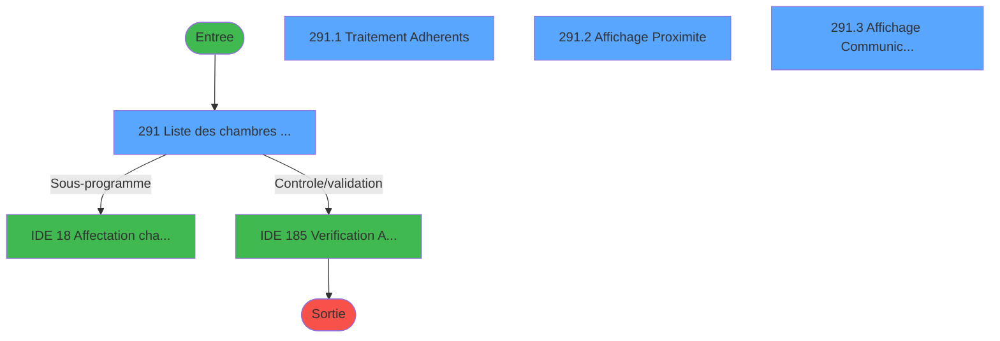
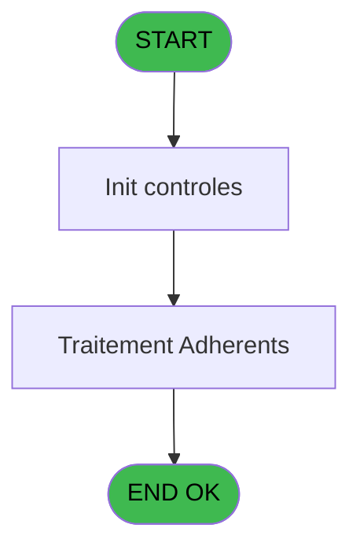
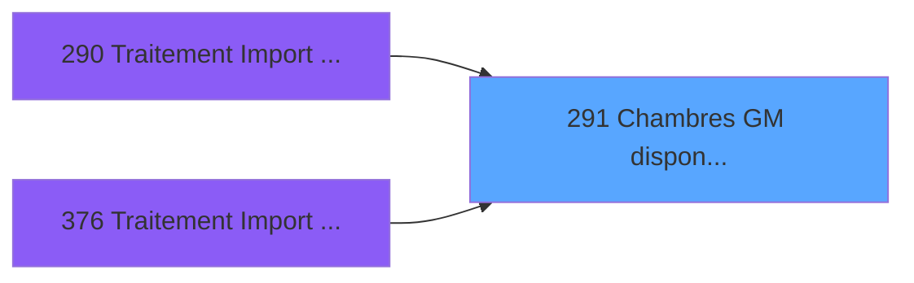
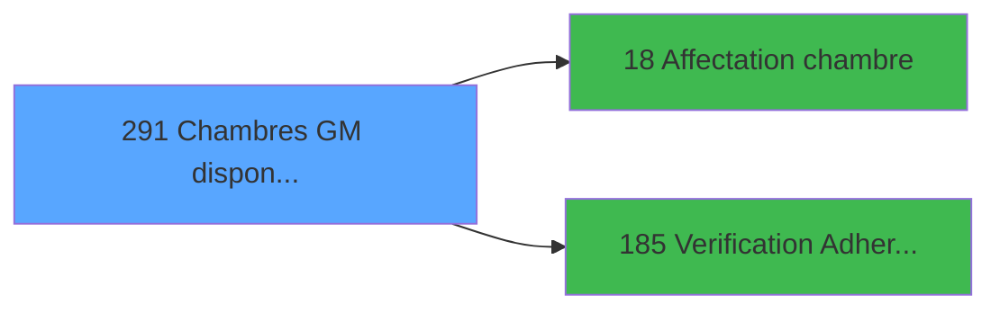

# PBG IDE 291 - Chambres GM disponibles

> **Analyse**: Phases 1-4 2026-02-03 10:53 -> 10:54 (19s) | Assemblage 10:54
> **Pipeline**: V7.2 Enrichi
> **Structure**: 4 onglets (Resume | Ecrans | Donnees | Connexions)

<!-- TAB:Resume -->

## 1. FICHE D'IDENTITE

| Attribut | Valeur |
|----------|--------|
| Projet | PBG |
| IDE Position | 291 |
| Nom Programme | Chambres GM disponibles |
| Fichier source | `Prg_291.xml` |
| Dossier IDE | General |
| Taches | 4 (4 ecrans visibles) |
| Tables modifiees | 0 |
| Programmes appeles | 2 |

## 2. DESCRIPTION FONCTIONNELLE

**Chambres GM disponibles** assure la gestion complete de ce processus, accessible depuis [Traitement Import Personnel (IDE 290)](PBG-IDE-290.md), [Traitement Import Personnel SA (IDE 376)](PBG-IDE-376.md).

Le flux de traitement s'organise en **2 blocs fonctionnels** :

- **Consultation** (2 taches) : ecrans de recherche, selection et consultation
- **Traitement** (2 taches) : traitements metier divers

**Logique metier** : 6 regles identifiees couvrant conditions metier.

Detail : phases du traitement

#### Phase 1 : Traitement (2 taches)

- **291** - Liste des chambres disponibles **[[ECRAN]](#ecran-t3)**
- **291.1** - Traitement Adherents **[[ECRAN]](#ecran-t24)**

Delegue a : [Affectation chambre (IDE 18)](PBG-IDE-18.md)

#### Phase 2 : Consultation (2 taches)

- **291.2** - Affichage Proximite **[[ECRAN]](#ecran-t25)**
- **291.3** - Affichage Communicante **[[ECRAN]](#ecran-t26)**

## 3. BLOCS FONCTIONNELS

### 3.1 Traitement (2 taches)

Traitements internes.

---

#### 291 - Liste des chambres disponibles [[ECRAN]](#ecran-t3)

**Role** : Traitement : Liste des chambres disponibles.
**Ecran** : 1350 x 273 DLU (MDI) | [Voir mockup](#ecran-t3)
**Delegue a** : [Affectation chambre (IDE 18)](PBG-IDE-18.md)

---

#### 291.1 - Traitement Adherents [[ECRAN]](#ecran-t24)

**Role** : Traitement : Traitement Adherents.
**Ecran** : 850 x 92 DLU (Modal) | [Voir mockup](#ecran-t24)
**Delegue a** : [Affectation chambre (IDE 18)](PBG-IDE-18.md)

### 3.2 Consultation (2 taches)

Ecrans de recherche et consultation.

---

#### 291.2 - Affichage Proximite [[ECRAN]](#ecran-t25)

**Role** : Reinitialisation : Affichage Proximite.
**Ecran** : 144 x 80 DLU (Modal) | [Voir mockup](#ecran-t25)

---

#### 291.3 - Affichage Communicante [[ECRAN]](#ecran-t26)

**Role** : Reinitialisation : Affichage Communicante.
**Ecran** : 142 x 78 DLU (Modal) | [Voir mockup](#ecran-t26)

## 5. REGLES METIER

6 regles identifiees:

### Autres (6 regles)

#### [RM-001] Si [BC]='00/00/0000'DATE alors MlsTrans ('Non Prête') sinon MlsTrans ('Prête'))

| Element | Detail |
|---------|--------|
| **Condition** | `[BC]='00/00/0000'DATE` |
| **Si vrai** | MlsTrans ('Non Prête') |
| **Si faux** | MlsTrans ('Prête')) |
| **Expression source** | Expression 8 : `IF ([BC]='00/00/0000'DATE,MlsTrans ('Non Prête'),MlsTrans ('` |
| **Exemple** | Si [BC]='00/00/0000'DATE → MlsTrans ('Non Prête'). Sinon → MlsTrans ('Prête')) |

#### [RM-002] Si [AK]='C' alors 'Cl' sinon 'Pe')

| Element | Detail |
|---------|--------|
| **Condition** | `[AK]='C'` |
| **Si vrai** | 'Cl' |
| **Si faux** | 'Pe') |
| **Expression source** | Expression 10 : `IF ([AK]='C','Cl','Pe')` |
| **Exemple** | Si [AK]='C' → 'Cl'. Sinon → 'Pe') |

#### [RM-003] Si [AH]='N' alors MlsTrans ('Non') sinon [AH])

| Element | Detail |
|---------|--------|
| **Condition** | `[AH]='N'` |
| **Si vrai** | MlsTrans ('Non') |
| **Si faux** | [AH]) |
| **Expression source** | Expression 11 : `IF ([AH]='N',MlsTrans ('Non'),[AH])` |
| **Exemple** | Si [AH]='N' → MlsTrans ('Non'). Sinon → [AH]) |

#### [RM-004] Si [AI]='N' alors MlsTrans ('Non') sinon [AI])

| Element | Detail |
|---------|--------|
| **Condition** | `[AI]='N'` |
| **Si vrai** | MlsTrans ('Non') |
| **Si faux** | [AI]) |
| **Expression source** | Expression 12 : `IF ([AI]='N',MlsTrans ('Non'),[AI])` |
| **Exemple** | Si [AI]='N' → MlsTrans ('Non'). Sinon → [AI]) |

#### [RM-005] Si [AJ]='N' alors MlsTrans ('Non') sinon [AJ])

| Element | Detail |
|---------|--------|
| **Condition** | `[AJ]='N'` |
| **Si vrai** | MlsTrans ('Non') |
| **Si faux** | [AJ]) |
| **Expression source** | Expression 13 : `IF ([AJ]='N',MlsTrans ('Non'),[AJ])` |
| **Exemple** | Si [AJ]='N' → MlsTrans ('Non'). Sinon → [AJ]) |

#### [RM-006] Si [BE]='N' alors MlsTrans ('Non') sinon [BE])

| Element | Detail |
|---------|--------|
| **Condition** | `[BE]='N'` |
| **Si vrai** | MlsTrans ('Non') |
| **Si faux** | [BE]) |
| **Expression source** | Expression 14 : `IF ([BE]='N',MlsTrans ('Non'),[BE])` |
| **Exemple** | Si [BE]='N' → MlsTrans ('Non'). Sinon → [BE]) |

## 6. CONTEXTE

- **Appele par**: [Traitement Import Personnel (IDE 290)](PBG-IDE-290.md), [Traitement Import Personnel SA (IDE 376)](PBG-IDE-376.md)
- **Appelle**: 2 programmes | **Tables**: 5 (W:0 R:3 L:3) | **Taches**: 4 | **Expressions**: 24

<!-- TAB:Ecrans -->

## 8. ECRANS

### 8.1 Forms visibles (4 / 4)

| # | Position | Tache | Nom | Type | Largeur | Hauteur | Bloc |
|---|----------|-------|-----|------|---------|---------|------|
| 1 | 291.1 | 291 | Liste des chambres disponibles | MDI | 1350 | 273 | Traitement |
| 2 | 291.1.1 | 291.1 | Traitement Adherents | Modal | 850 | 92 | Traitement |
| 3 | 291.1.2 | 291.2 | Affichage Proximite | Modal | 144 | 80 | Consultation |
| 4 | 291.1.3 | 291.3 | Affichage Communicante | Modal | 142 | 78 | Consultation |

### 8.2 Mockups Ecrans

---

#### 291.1 - Liste des chambres disponibles
**Tache** : [291](#t3) | **Type** : MDI | **Dimensions** : 1350 x 273 DLU
**Bloc** : Traitement | **Titre IDE** : Liste des chambres disponibles

<!-- FORM-DATA:
{
    "width":  1350,
    "vFactor":  8,
    "type":  "MDI",
    "hFactor":  8,
    "controls":  [
                     {
                         "x":  16,
                         "type":  "table",
                         "var":  "",
                         "name":  "",
                         "titleH":  12,
                         "color":  "110",
                         "w":  180,
                         "y":  8,
                         "fmt":  "",
                         "parent":  null,
                         "text":  "",
                         "rowH":  13,
                         "h":  260,
                         "cols":  [
                                      {
                                          "title":  "Nom standard",
                                          "layer":  1,
                                          "w":  146
                                      }
                                  ],
                         "rows":  1
                     },
                     {
                         "x":  216,
                         "type":  "label",
                         "var":  "",
                         "y":  42,
                         "w":  761,
                         "fmt":  "",
                         "name":  "",
                         "h":  98,
                         "color":  "195",
                         "text":  "Renseignements",
                         "parent":  null
                     },
                     {
                         "x":  662,
                         "type":  "label",
                         "var":  "",
                         "y":  52,
                         "w":  144,
                         "fmt":  "",
                         "name":  "",
                         "h":  8,
                         "color":  "",
                         "text":  "Lit Pliant",
                         "parent":  29
                     },
                     {
                         "x":  296,
                         "type":  "label",
                         "var":  "",
                         "y":  53,
                         "w":  182,
                         "fmt":  "",
                         "name":  "",
                         "h":  8,
                         "color":  "",
                         "text":  "Ensemble",
                         "parent":  29
                     },
                     {
                         "x":  662,
                         "type":  "label",
                         "var":  "",
                         "y":  67,
                         "w":  146,
                         "fmt":  "",
                         "name":  "",
                         "h":  8,
                         "color":  "",
                         "text":  "Lit Bébé",
                         "parent":  29
                     },
                     {
                         "x":  296,
                         "type":  "label",
                         "var":  "",
                         "y":  68,
                         "w":  218,
                         "fmt":  "",
                         "name":  "",
                         "h":  8,
                         "color":  "",
                         "text":  "Logement :",
                         "parent":  29
                     },
                     {
                         "x":  662,
                         "type":  "label",
                         "var":  "",
                         "y":  82,
                         "w":  172,
                         "fmt":  "",
                         "name":  "",
                         "h":  8,
                         "color":  "",
                         "text":  "Banquette",
                         "parent":  29
                     },
                     {
                         "x":  296,
                         "type":  "label",
                         "var":  "",
                         "y":  83,
                         "w":  160,
                         "fmt":  "",
                         "name":  "",
                         "h":  8,
                         "color":  "",
                         "text":  "Batiment",
                         "parent":  29
                     },
                     {
                         "x":  662,
                         "type":  "label",
                         "var":  "",
                         "y":  96,
                         "w":  96,
                         "fmt":  "",
                         "name":  "",
                         "h":  8,
                         "color":  "",
                         "text":  "Zone",
                         "parent":  29
                     },
                     {
                         "x":  296,
                         "type":  "label",
                         "var":  "",
                         "y":  97,
                         "w":  106,
                         "fmt":  "",
                         "name":  "",
                         "h":  8,
                         "color":  "",
                         "text":  "Etage",
                         "parent":  29
                     },
                     {
                         "x":  662,
                         "type":  "label",
                         "var":  "",
                         "y":  111,
                         "w":  134,
                         "fmt":  "",
                         "name":  "",
                         "h":  8,
                         "color":  "",
                         "text":  "Secteur",
                         "parent":  29
                     },
                     {
                         "x":  296,
                         "type":  "label",
                         "var":  "",
                         "y":  112,
                         "w":  76,
                         "fmt":  "",
                         "name":  "",
                         "h":  8,
                         "color":  "",
                         "text":  "Vue",
                         "parent":  29
                     },
                     {
                         "x":  662,
                         "type":  "label",
                         "var":  "",
                         "y":  126,
                         "w":  182,
                         "fmt":  "",
                         "name":  "",
                         "h":  8,
                         "color":  "",
                         "text":  "Handicapé",
                         "parent":  29
                     },
                     {
                         "x":  296,
                         "type":  "label",
                         "var":  "",
                         "y":  127,
                         "w":  192,
                         "fmt":  "",
                         "name":  "",
                         "h":  8,
                         "color":  "",
                         "text":  "Occupation",
                         "parent":  29
                     },
                     {
                         "x":  216,
                         "type":  "label",
                         "var":  "",
                         "y":  3,
                         "w":  1124,
                         "fmt":  "",
                         "name":  "",
                         "h":  32,
                         "color":  "",
                         "text":  "",
                         "parent":  null
                     },
                     {
                         "x":  491,
                         "type":  "label",
                         "var":  "",
                         "y":  11,
                         "w":  53,
                         "fmt":  "",
                         "name":  "",
                         "h":  8,
                         "color":  "",
                         "text":  "Statut",
                         "parent":  54
                     },
                     {
                         "x":  563,
                         "type":  "label",
                         "var":  "",
                         "y":  11,
                         "w":  119,
                         "fmt":  "",
                         "name":  "",
                         "h":  8,
                         "color":  "",
                         "text":  "Tel. Intérieur",
                         "parent":  54
                     },
                     {
                         "x":  661,
                         "type":  "label",
                         "var":  "",
                         "y":  11,
                         "w":  193,
                         "fmt":  "",
                         "name":  "",
                         "h":  8,
                         "color":  "",
                         "text":  "Lieu sej/Code log.",
                         "parent":  54
                     },
                     {
                         "x":  861,
                         "type":  "label",
                         "var":  "",
                         "y":  11,
                         "w":  74,
                         "fmt":  "",
                         "name":  "",
                         "h":  8,
                         "color":  "",
                         "text":  "Standing",
                         "parent":  54
                     },
                     {
                         "x":  949,
                         "type":  "label",
                         "var":  "",
                         "y":  11,
                         "w":  87,
                         "fmt":  "",
                         "name":  "",
                         "h":  8,
                         "color":  "",
                         "text":  "Attribution",
                         "parent":  54
                     },
                     {
                         "x":  24,
                         "type":  "edit",
                         "var":  "",
                         "y":  23,
                         "w":  74,
                         "fmt":  "",
                         "name":  "loc_nom_standard",
                         "h":  10,
                         "color":  "110",
                         "text":  "",
                         "parent":  1
                     },
                     {
                         "x":  237,
                         "type":  "edit",
                         "var":  "",
                         "y":  16,
                         "w":  203,
                         "fmt":  "15",
                         "name":  "loc_nom_complet",
                         "h":  8,
                         "color":  "142",
                         "text":  "",
                         "parent":  54
                     },
                     {
                         "x":  462,
                         "type":  "edit",
                         "var":  "",
                         "y":  22,
                         "w":  109,
                         "fmt":  "9",
                         "name":  "",
                         "h":  8,
                         "color":  "",
                         "text":  "",
                         "parent":  54
                     },
                     {
                         "x":  584,
                         "type":  "edit",
                         "var":  "",
                         "y":  22,
                         "w":  75,
                         "fmt":  "",
                         "name":  "loc_tel_interieur",
                         "h":  8,
                         "color":  "",
                         "text":  "",
                         "parent":  54
                     },
                     {
                         "x":  736,
                         "type":  "edit",
                         "var":  "",
                         "y":  22,
                         "w":  75,
                         "fmt":  "6",
                         "name":  "",
                         "h":  8,
                         "color":  "",
                         "text":  "",
                         "parent":  54
                     },
                     {
                         "x":  882,
                         "type":  "edit",
                         "var":  "",
                         "y":  22,
                         "w":  30,
                         "fmt":  "",
                         "name":  "loc_standing",
                         "h":  8,
                         "color":  "",
                         "text":  "",
                         "parent":  54
                     },
                     {
                         "x":  978,
                         "type":  "edit",
                         "var":  "",
                         "y":  22,
                         "w":  30,
                         "fmt":  "2",
                         "name":  "",
                         "h":  8,
                         "color":  "",
                         "text":  "",
                         "parent":  54
                     },
                     {
                         "x":  1013,
                         "type":  "subform",
                         "var":  "",
                         "y":  42,
                         "w":  158,
                         "fmt":  "",
                         "name":  "Affichage Communicante",
                         "h":  100,
                         "color":  "",
                         "text":  "",
                         "parent":  null
                     },
                     {
                         "x":  1181,
                         "type":  "subform",
                         "var":  "",
                         "y":  42,
                         "w":  158,
                         "fmt":  "",
                         "name":  "Affichage Communicante",
                         "h":  100,
                         "color":  "",
                         "text":  "",
                         "parent":  null
                     },
                     {
                         "x":  533,
                         "type":  "edit",
                         "var":  "",
                         "y":  52,
                         "w":  90,
                         "fmt":  "",
                         "name":  "LOC Ensemble",
                         "h":  9,
                         "color":  "",
                         "text":  "",
                         "parent":  29
                     },
                     {
                         "x":  854,
                         "type":  "edit",
                         "var":  "",
                         "y":  52,
                         "w":  106,
                         "fmt":  "4",
                         "name":  "",
                         "h":  9,
                         "color":  "",
                         "text":  "",
                         "parent":  29
                     },
                     {
                         "x":  854,
                         "type":  "edit",
                         "var":  "",
                         "y":  67,
                         "w":  106,
                         "fmt":  "4",
                         "name":  "",
                         "h":  9,
                         "color":  "",
                         "text":  "",
                         "parent":  29
                     },
                     {
                         "x":  533,
                         "type":  "edit",
                         "var":  "",
                         "y":  68,
                         "w":  90,
                         "fmt":  "",
                         "name":  "loc_type_logement",
                         "h":  9,
                         "color":  "",
                         "text":  "",
                         "parent":  29
                     },
                     {
                         "x":  854,
                         "type":  "edit",
                         "var":  "",
                         "y":  82,
                         "w":  106,
                         "fmt":  "4",
                         "name":  "",
                         "h":  9,
                         "color":  "",
                         "text":  "",
                         "parent":  29
                     },
                     {
                         "x":  533,
                         "type":  "edit",
                         "var":  "",
                         "y":  83,
                         "w":  90,
                         "fmt":  "",
                         "name":  "loc_batiment",
                         "h":  9,
                         "color":  "",
                         "text":  "",
                         "parent":  29
                     },
                     {
                         "x":  854,
                         "type":  "edit",
                         "var":  "",
                         "y":  96,
                         "w":  106,
                         "fmt":  "",
                         "name":  "loc_zone_menage",
                         "h":  9,
                         "color":  "",
                         "text":  "",
                         "parent":  29
                     },
                     {
                         "x":  533,
                         "type":  "edit",
                         "var":  "",
                         "y":  97,
                         "w":  90,
                         "fmt":  "",
                         "name":  "loc_etage",
                         "h":  9,
                         "color":  "",
                         "text":  "",
                         "parent":  29
                     },
                     {
                         "x":  854,
                         "type":  "edit",
                         "var":  "",
                         "y":  111,
                         "w":  106,
                         "fmt":  "",
                         "name":  "loc_secteur_menage",
                         "h":  9,
                         "color":  "",
                         "text":  "",
                         "parent":  29
                     },
                     {
                         "x":  533,
                         "type":  "edit",
                         "var":  "",
                         "y":  112,
                         "w":  90,
                         "fmt":  "",
                         "name":  "loc_vue",
                         "h":  9,
                         "color":  "",
                         "text":  "",
                         "parent":  29
                     },
                     {
                         "x":  854,
                         "type":  "edit",
                         "var":  "",
                         "y":  126,
                         "w":  106,
                         "fmt":  "4",
                         "name":  "",
                         "h":  9,
                         "color":  "",
                         "text":  "",
                         "parent":  29
                     },
                     {
                         "x":  533,
                         "type":  "edit",
                         "var":  "",
                         "y":  127,
                         "w":  90,
                         "fmt":  "",
                         "name":  "loc_occupation_std",
                         "h":  9,
                         "color":  "",
                         "text":  "",
                         "parent":  29
                     },
                     {
                         "x":  217,
                         "type":  "subform",
                         "var":  "",
                         "y":  146,
                         "w":  1122,
                         "fmt":  "",
                         "name":  "Traitement Adherents",
                         "h":  102,
                         "color":  "",
                         "text":  "",
                         "parent":  null
                     },
                     {
                         "x":  1020,
                         "type":  "button",
                         "var":  "",
                         "y":  253,
                         "w":  150,
                         "fmt":  "\u0026Pré-\\Affecter",
                         "name":  "Bt.Affecter",
                         "h":  18,
                         "color":  "",
                         "text":  "",
                         "parent":  null
                     },
                     {
                         "x":  1184,
                         "type":  "button",
                         "var":  "",
                         "y":  253,
                         "w":  150,
                         "fmt":  "\u0026Quitter",
                         "name":  "Bt.Quitter",
                         "h":  18,
                         "color":  "",
                         "text":  "",
                         "parent":  null
                     }
                 ],
    "taskId":  "291.1",
    "height":  273
}
-->

<strong>Champs : 19 champs</strong>

| Pos (x,y) | Nom | Variable | Type |
|-----------|-----|----------|------|
| 24,23 | loc_nom_standard | - | edit |
| 237,16 | loc_nom_complet | - | edit |
| 462,22 | 9 | - | edit |
| 584,22 | loc_tel_interieur | - | edit |
| 736,22 | 6 | - | edit |
| 882,22 | loc_standing | - | edit |
| 978,22 | 2 | - | edit |
| 533,52 | LOC Ensemble | - | edit |
| 854,52 | 4 | - | edit |
| 854,67 | 4 | - | edit |
| 533,68 | loc_type_logement | - | edit |
| 854,82 | 4 | - | edit |
| 533,83 | loc_batiment | - | edit |
| 854,96 | loc_zone_menage | - | edit |
| 533,97 | loc_etage | - | edit |
| 854,111 | loc_secteur_menage | - | edit |
| 533,112 | loc_vue | - | edit |
| 854,126 | 4 | - | edit |
| 533,127 | loc_occupation_std | - | edit |

<strong>Boutons : 2 boutons</strong>

| Bouton | Pos (x,y) | Action |
|--------|-----------|--------|
| Pré-\Affecter | 1020,253 | Bouton fonctionnel |
| Quitter | 1184,253 | Quitte le programme |

---

#### 291.1.1 - Traitement Adherents
**Tache** : [291.1](#t24) | **Type** : Modal | **Dimensions** : 850 x 92 DLU
**Bloc** : Traitement | **Titre IDE** : Traitement Adherents

<!-- FORM-DATA:
{
    "width":  850,
    "vFactor":  8,
    "type":  "Modal",
    "hFactor":  8,
    "controls":  [
                     {
                         "x":  1,
                         "type":  "table",
                         "var":  "",
                         "name":  "",
                         "titleH":  11,
                         "color":  "7",
                         "w":  840,
                         "y":  2,
                         "fmt":  "",
                         "parent":  null,
                         "text":  "",
                         "rowH":  11,
                         "h":  89,
                         "cols":  [
                                      {
                                          "title":  "Nom",
                                          "layer":  1,
                                          "w":  278
                                      },
                                      {
                                          "title":  "Fid.",
                                          "layer":  2,
                                          "w":  44
                                      },
                                      {
                                          "title":  "Date Deb/Heure",
                                          "layer":  3,
                                          "w":  147
                                      },
                                      {
                                          "title":  "Date Fin/Heure",
                                          "layer":  4,
                                          "w":  148
                                      },
                                      {
                                          "title":  "Nat.",
                                          "layer":  5,
                                          "w":  58
                                      },
                                      {
                                          "title":  "Age",
                                          "layer":  6,
                                          "w":  64
                                      },
                                      {
                                          "title":  "Fumeur",
                                          "layer":  7,
                                          "w":  63
                                      }
                                  ],
                         "rows":  7
                     },
                     {
                         "x":  90,
                         "type":  "edit",
                         "var":  "",
                         "y":  16,
                         "w":  181,
                         "fmt":  "",
                         "name":  "HEB Libelle",
                         "h":  8,
                         "color":  "110",
                         "text":  "",
                         "parent":  1
                     },
                     {
                         "x":  326,
                         "type":  "edit",
                         "var":  "",
                         "y":  16,
                         "w":  64,
                         "fmt":  "##/##",
                         "name":  "",
                         "h":  8,
                         "color":  "110",
                         "text":  "",
                         "parent":  1
                     },
                     {
                         "x":  395,
                         "type":  "edit",
                         "var":  "",
                         "y":  16,
                         "w":  42,
                         "fmt":  "UUH",
                         "name":  "",
                         "h":  8,
                         "color":  "110",
                         "text":  "",
                         "parent":  1
                     },
                     {
                         "x":  477,
                         "type":  "edit",
                         "var":  "",
                         "y":  16,
                         "w":  64,
                         "fmt":  "##/##",
                         "name":  "",
                         "h":  8,
                         "color":  "110",
                         "text":  "",
                         "parent":  1
                     },
                     {
                         "x":  558,
                         "type":  "edit",
                         "var":  "",
                         "y":  16,
                         "w":  42,
                         "fmt":  "UUH",
                         "name":  "",
                         "h":  8,
                         "color":  "110",
                         "text":  "",
                         "parent":  1
                     },
                     {
                         "x":  635,
                         "type":  "edit",
                         "var":  "",
                         "y":  16,
                         "w":  30,
                         "fmt":  "",
                         "name":  "",
                         "h":  8,
                         "color":  "110",
                         "text":  "",
                         "parent":  1
                     },
                     {
                         "x":  13,
                         "type":  "edit",
                         "var":  "",
                         "y":  16,
                         "w":  41,
                         "fmt":  "3",
                         "name":  "",
                         "h":  8,
                         "color":  "110",
                         "text":  "",
                         "parent":  1
                     },
                     {
                         "x":  58,
                         "type":  "edit",
                         "var":  "",
                         "y":  16,
                         "w":  30,
                         "fmt":  "UX",
                         "name":  "",
                         "h":  8,
                         "color":  "110",
                         "text":  "",
                         "parent":  1
                     },
                     {
                         "x":  286,
                         "type":  "edit",
                         "var":  "",
                         "y":  16,
                         "w":  32,
                         "fmt":  "UUU",
                         "name":  "",
                         "h":  8,
                         "color":  "110",
                         "text":  "",
                         "parent":  1
                     },
                     {
                         "x":  690,
                         "type":  "edit",
                         "var":  "",
                         "y":  16,
                         "w":  49,
                         "fmt":  "#2Z",
                         "name":  "heb_age",
                         "h":  8,
                         "color":  "110",
                         "text":  "",
                         "parent":  1
                     },
                     {
                         "x":  754,
                         "type":  "edit",
                         "var":  "",
                         "y":  16,
                         "w":  42,
                         "fmt":  "UX2",
                         "name":  "",
                         "h":  8,
                         "color":  "110",
                         "text":  "",
                         "parent":  1
                     }
                 ],
    "taskId":  "291.1.1",
    "height":  92
}
-->

<strong>Champs : 11 champs</strong>

| Pos (x,y) | Nom | Variable | Type |
|-----------|-----|----------|------|
| 90,16 | HEB Libelle | - | edit |
| 326,16 | ##/## | - | edit |
| 395,16 | UUH | - | edit |
| 477,16 | ##/## | - | edit |
| 558,16 | UUH | - | edit |
| 635,16 | (sans nom) | - | edit |
| 13,16 | 3 | - | edit |
| 58,16 | UX | - | edit |
| 286,16 | UUU | - | edit |
| 690,16 | heb_age | - | edit |
| 754,16 | UX2 | - | edit |

---

#### 291.1.2 - Affichage Proximite
**Tache** : [291.2](#t25) | **Type** : Modal | **Dimensions** : 144 x 80 DLU
**Bloc** : Consultation | **Titre IDE** : Affichage Proximite

<!-- FORM-DATA:
{
    "width":  144,
    "vFactor":  8,
    "type":  "Modal",
    "hFactor":  8,
    "controls":  [
                     {
                         "x":  3,
                         "type":  "table",
                         "var":  "",
                         "name":  "",
                         "titleH":  12,
                         "color":  "110",
                         "w":  141,
                         "y":  0,
                         "fmt":  "",
                         "parent":  null,
                         "text":  "",
                         "rowH":  12,
                         "h":  74,
                         "cols":  [
                                      {
                                          "title":  "Proximité",
                                          "layer":  1,
                                          "w":  135
                                      }
                                  ],
                         "rows":  1
                     },
                     {
                         "x":  26,
                         "type":  "edit",
                         "var":  "",
                         "y":  15,
                         "w":  75,
                         "fmt":  "",
                         "name":  "libelle_complement",
                         "h":  8,
                         "color":  "110",
                         "text":  "",
                         "parent":  1
                     }
                 ],
    "taskId":  "291.1.2",
    "height":  80
}
-->

<strong>Champs : 1 champs</strong>

| Pos (x,y) | Nom | Variable | Type |
|-----------|-----|----------|------|
| 26,15 | libelle_complement | - | edit |

---

#### 291.1.3 - Affichage Communicante
**Tache** : [291.3](#t26) | **Type** : Modal | **Dimensions** : 142 x 78 DLU
**Bloc** : Consultation | **Titre IDE** : Affichage Communicante

<!-- FORM-DATA:
{
    "width":  142,
    "vFactor":  8,
    "type":  "Modal",
    "hFactor":  8,
    "controls":  [
                     {
                         "x":  3,
                         "type":  "table",
                         "var":  "",
                         "name":  "",
                         "titleH":  12,
                         "color":  "110",
                         "w":  139,
                         "y":  0,
                         "fmt":  "",
                         "parent":  null,
                         "text":  "",
                         "rowH":  12,
                         "h":  75,
                         "cols":  [
                                      {
                                          "title":  "Communicante",
                                          "layer":  1,
                                          "w":  133
                                      }
                                  ],
                         "rows":  1
                     },
                     {
                         "x":  21,
                         "type":  "edit",
                         "var":  "",
                         "y":  15,
                         "w":  88,
                         "fmt":  "",
                         "name":  "loc_nom_standard",
                         "h":  8,
                         "color":  "110",
                         "text":  "",
                         "parent":  1
                     }
                 ],
    "taskId":  "291.1.3",
    "height":  78
}
-->

<strong>Champs : 1 champs</strong>

| Pos (x,y) | Nom | Variable | Type |
|-----------|-----|----------|------|
| 21,15 | loc_nom_standard | - | edit |

## 9. NAVIGATION

### 9.1 Enchainement des ecrans

**Detail par enchainement :**

| Depuis | Action | Vers | Retour |
|--------|--------|------|--------|
| Liste des chambres disponibles | Sous-programme | [Affectation chambre (IDE 18)](PBG-IDE-18.md) | Retour ecran |
| Liste des chambres disponibles | Controle/validation | [Verification Adherents (IDE 185)](PBG-IDE-185.md) | Retour ecran |

### 9.3 Structure hierarchique (4 taches)

| Position | Tache | Type | Dimensions | Bloc |
|----------|-------|------|------------|------|
| **291.1** | [**Liste des chambres disponibles** (291)](#t3) [mockup](#ecran-t3) | MDI | 1350x273 | Traitement |
| 291.1.1 | [Traitement Adherents (291.1)](#t24) [mockup](#ecran-t24) | Modal | 850x92 | |
| **291.2** | [**Affichage Proximite** (291.2)](#t25) [mockup](#ecran-t25) | Modal | 144x80 | Consultation |
| 291.2.1 | [Affichage Communicante (291.3)](#t26) [mockup](#ecran-t26) | Modal | 142x78 | |

### 9.4 Algorigramme

> **Legende**: Vert = START/END OK | Rouge = END KO | Bleu = Decisions
> *Algorigramme auto-genere. Utiliser `/algorigramme` pour une synthese metier detaillee.*

<!-- TAB:Donnees -->

## 10. TABLES

### Tables utilisees (5)

| ID | Nom | Description | Type | R | W | L | Usages |
|----|-----|-------------|------|---|---|---|--------|
| 31 | gm-complet_______gmc |  | DB | R |   |   | 1 |
| 34 | hebergement______heb | Hebergement (chambres) | DB | R |   | L | 2 |
| 103 | logement_client__loc |  | DB |   |   | L | 1 |
| 105 | logement_complement |  | DB | R |   |   | 2 |
| 358 | import_mod |  | DB |   |   | L | 1 |

### Colonnes par table (4 / 3 tables avec colonnes identifiees)

Table 31 - gm-complet_______gmc (R) - 1 usages

| Lettre | Variable | Acces | Type |
|--------|----------|-------|------|
| A | P.Nom logement | R | Alpha |
| B | W3-Date/Heure | R | Numeric |
| C | W3 Autorisation | R | Alpha |
| D | W3 Fin de tâche | R | Logical |
| E | V.Code fidelisation | R | Alpha |
| F | B-Liberer | R | Alpha |

Table 34 - hebergement______heb (R/L) - 2 usages

| Lettre | Variable | Acces | Type |
|--------|----------|-------|------|
| A | P.Societe | R | Alpha |
| B | P.compte | R | Numeric |
| C | P.Date Debut | R | Date |
| D | P.Date Fin | R | Date |
| E | P.Logement/Chambre | R | Alpha |
| F | P.Lieu de séjour | R | Alpha |
| G | P.Heure Début | R | Time |
| H | p.Heure Fin | R | Time |
| I | P.Code Logement | R | Alpha |
| J | V.Dispo ? | R | Logical |
| K | V.verif reservation ? | R | Logical |
| L | Bt.Affecter | R | Alpha |
| M | Bt.Editer | R | Alpha |
| N | V.ok affectation | R | Logical |

Table 105 - logement_complement (R) - 2 usages

| Lettre | Variable | Acces | Type |
|--------|----------|-------|------|
| A | P.Nom logement | R | Alpha |
| E | P.Logement/Chambre | R | Alpha |
| I | P.Code Logement | R | Alpha |

## 11. VARIABLES

### 11.1 Parametres entrants (9)

Variables recues du programme appelant ([Traitement Import Personnel (IDE 290)](PBG-IDE-290.md)).

| Lettre | Nom | Type | Usage dans |
|--------|-----|------|-----------|
| A | P.Societe | Alpha | 2x parametre entrant |
| B | P.compte | Numeric | 2x parametre entrant |
| C | P.Date Debut | Date | - |
| D | P.Date Fin | Date | - |
| E | P.Logement/Chambre | Alpha | - |
| F | P.Lieu de séjour | Alpha | - |
| G | P.Heure Début | Time | - |
| H | p.Heure Fin | Time | - |
| I | P.Code Logement | Alpha | - |

### 11.2 Variables de session (3)

Variables persistantes pendant toute la session.

| Lettre | Nom | Type | Usage dans |
|--------|-----|------|-----------|
| J | V.Dispo ? | Logical | - |
| K | V.verif reservation ? | Logical | - |
| N | V.ok affectation | Logical | - |

### 11.3 Autres (2)

Variables diverses.

| Lettre | Nom | Type | Usage dans |
|--------|-----|------|-----------|
| L | Bt.Affecter | Alpha | - |
| M | Bt.Editer | Alpha | - |

## 12. EXPRESSIONS

**24 / 24 expressions decodees (100%)**

### 12.1 Repartition par type

| Type | Expressions | Regles |
|------|-------------|--------|
| CONCATENATION | 1 | 0 |
| CAST_LOGIQUE | 1 | 0 |
| CONDITION | 7 | 6 |
| CONSTANTE | 5 | 0 |
| FORMAT | 2 | 0 |
| OTHER | 8 | 0 |

### 12.2 Expressions cles par type

#### CONCATENATION (1 expressions)

| Type | IDE | Expression | Regle |
|------|-----|------------|-------|
| CONCATENATION | 9 | `Trim ([AO])&'-'&Trim ([AN])` | - |

#### CAST_LOGIQUE (1 expressions)

| Type | IDE | Expression | Regle |
|------|-----|------------|-------|
| CAST_LOGIQUE | 16 | `CallProg('{675,-1}'PROG,'TRUE'LOG,P.compte [B],P.Societe [A],[BX],[CC],[BY],[CD],[AE],0)` | - |

#### CONDITION (7 expressions)

| Type | IDE | Expression | Regle |
|------|-----|------------|-------|
| CONDITION | 12 | `IF ([AI]='N',MlsTrans ('Non'),[AI])` | [RM-004](#rm-RM-004) |
| CONDITION | 13 | `IF ([AJ]='N',MlsTrans ('Non'),[AJ])` | [RM-005](#rm-RM-005) |
| CONDITION | 14 | `IF ([BE]='N',MlsTrans ('Non'),[BE])` | [RM-006](#rm-RM-006) |
| CONDITION | 8 | `IF ([BC]='00/00/0000'DATE,MlsTrans ('Non Prête'),MlsTrans ('Prête'))` | [RM-001](#rm-RM-001) |
| CONDITION | 10 | `IF ([AK]='C','Cl','Pe')` | [RM-002](#rm-RM-002) |
| ... | | *+2 autres* | |

#### CONSTANTE (5 expressions)

| Type | IDE | Expression | Regle |
|------|-----|------------|-------|
| CONSTANTE | 21 | `'20'` | - |
| CONSTANTE | 22 | `0` | - |
| CONSTANTE | 15 | `'N'` | - |
| CONSTANTE | 5 | `'H'` | - |
| CONSTANTE | 7 | `'#'` | - |

#### FORMAT (2 expressions)

| Type | IDE | Expression | Regle |
|------|-----|------------|-------|
| FORMAT | 20 | `'P'&Trim(Str([AE],'2'))` | - |
| FORMAT | 23 | `'Recherche de disponibilité de chambres : GM du : '&DStr([BX],'DD/MM/YYYY')&' au '&DStr([BY],'DD/MM/YYYY')` | - |

#### OTHER (8 expressions)

| Type | IDE | Expression | Regle |
|------|-----|------------|-------|
| OTHER | 18 | `[BS]` | - |
| OTHER | 17 | `GetParam('LANGUE')` | - |
| OTHER | 24 | `[AN]` | - |
| OTHER | 19 | `[BF]` | - |
| OTHER | 3 | `[BZ]` | - |
| ... | | *+3 autres* | |

### 12.3 Toutes les expressions (24)

Voir les 24 expressions

#### CONCATENATION (1)

| IDE | Expression Decodee |
|-----|-------------------|
| 9 | `Trim ([AO])&'-'&Trim ([AN])` |

#### CAST_LOGIQUE (1)

| IDE | Expression Decodee |
|-----|-------------------|
| 16 | `CallProg('{675,-1}'PROG,'TRUE'LOG,P.compte [B],P.Societe [A],[BX],[CC],[BY],[CD],[AE],0)` |

#### CONDITION (7)

| IDE | Expression Decodee |
|-----|-------------------|
| 8 | `IF ([BC]='00/00/0000'DATE,MlsTrans ('Non Prête'),MlsTrans ('Prête'))` |
| 10 | `IF ([AK]='C','Cl','Pe')` |
| 11 | `IF ([AH]='N',MlsTrans ('Non'),[AH])` |
| 12 | `IF ([AI]='N',MlsTrans ('Non'),[AI])` |
| 13 | `IF ([AJ]='N',MlsTrans ('Non'),[AJ])` |
| 14 | `IF ([BE]='N',MlsTrans ('Non'),[BE])` |
| 2 | `CndRange([CA]<>'',[CA])` |

#### CONSTANTE (5)

| IDE | Expression Decodee |
|-----|-------------------|
| 5 | `'H'` |
| 7 | `'#'` |
| 15 | `'N'` |
| 21 | `'20'` |
| 22 | `0` |

#### FORMAT (2)

| IDE | Expression Decodee |
|-----|-------------------|
| 23 | `'Recherche de disponibilité de chambres : GM du : '&DStr([BX],'DD/MM/YYYY')&' au '&DStr([BY],'DD/MM/YYYY')` |
| 20 | `'P'&Trim(Str([AE],'2'))` |

#### OTHER (8)

| IDE | Expression Decodee |
|-----|-------------------|
| 1 | `[BW]` |
| 3 | `[BZ]` |
| 4 | `P.Societe [A]` |
| 6 | `P.compte [B]` |
| 17 | `GetParam('LANGUE')` |
| 18 | `[BS]` |
| 19 | `[BF]` |
| 24 | `[AN]` |

<!-- TAB:Connexions -->

## 13. GRAPHE D'APPELS

### 13.1 Chaine depuis Main (Callers)

Main -> ... -> [Traitement Import Personnel (IDE 290)](PBG-IDE-290.md) -> **Chambres GM disponibles (IDE 291)**

Main -> ... -> [Traitement Import Personnel SA (IDE 376)](PBG-IDE-376.md) -> **Chambres GM disponibles (IDE 291)**

### 13.2 Callers

| IDE | Nom Programme | Nb Appels |
|-----|---------------|-----------|
| [290](PBG-IDE-290.md) | Traitement Import Personnel | 2 |
| [376](PBG-IDE-376.md) | Traitement Import Personnel SA | 1 |

### 13.3 Callees (programmes appeles)

### 13.4 Detail Callees avec contexte

| IDE | Nom Programme | Appels | Contexte |
|-----|---------------|--------|----------|
| [18](PBG-IDE-18.md) | Affectation chambre | 1 | Sous-programme |
| [185](PBG-IDE-185.md) | Verification Adherents | 1 | Controle/validation |

## 14. RECOMMANDATIONS MIGRATION

### 14.1 Profil du programme

| Metrique | Valeur | Impact migration |
|----------|--------|-----------------|
| Lignes de logique | 138 | Programme compact |
| Expressions | 24 | Peu de logique |
| Tables WRITE | 0 | Impact faible |
| Sous-programmes | 2 | Peu de dependances |
| Ecrans visibles | 4 | Quelques ecrans |
| Code desactive | 0.7% (1 / 138) | Code sain |
| Regles metier | 6 | Quelques regles a preserver |

### 14.2 Plan de migration par bloc

#### Traitement (2 taches: 2 ecrans, 0 traitement)

- **Strategie** : 2 composant(s) UI (Razor/React) avec formulaires et validation.
- 2 sous-programme(s) a migrer ou a reutiliser depuis les services existants.
- Decomposer les taches en services unitaires testables.

#### Consultation (2 taches: 2 ecrans, 0 traitement)

- **Strategie** : Composants de recherche/selection en modales.
- 2 ecrans : Affichage Proximite, Affichage Communicante

### 14.3 Dependances critiques

| Dependance | Type | Appels | Impact |
|------------|------|--------|--------|
| [Verification Adherents (IDE 185)](PBG-IDE-185.md) | Sous-programme | 1x | Normale - Controle/validation |
| [Affectation chambre (IDE 18)](PBG-IDE-18.md) | Sous-programme | 1x | Normale - Sous-programme |

---
*Spec DETAILED generee par Pipeline V7.2 - 2026-02-03 10:54*
