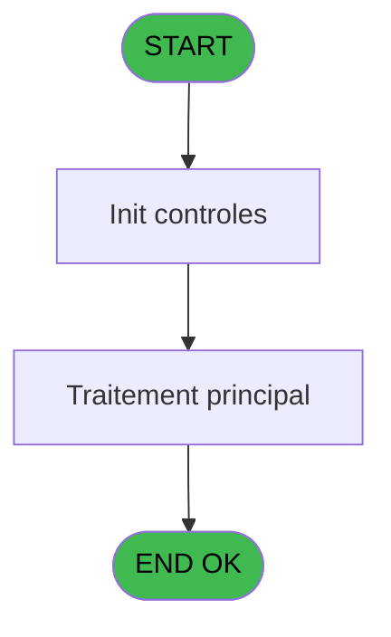
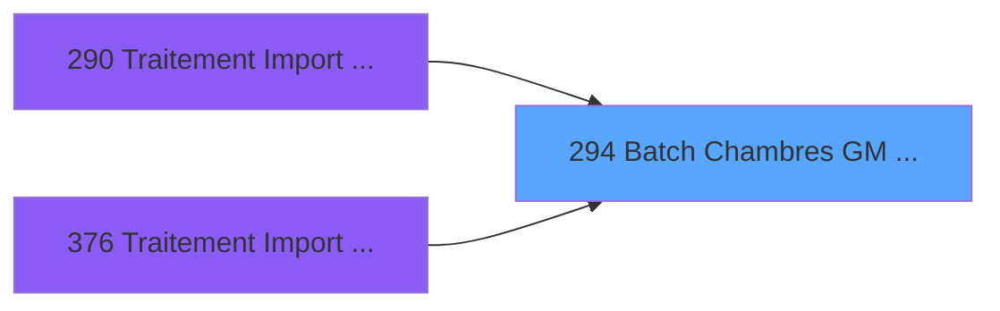
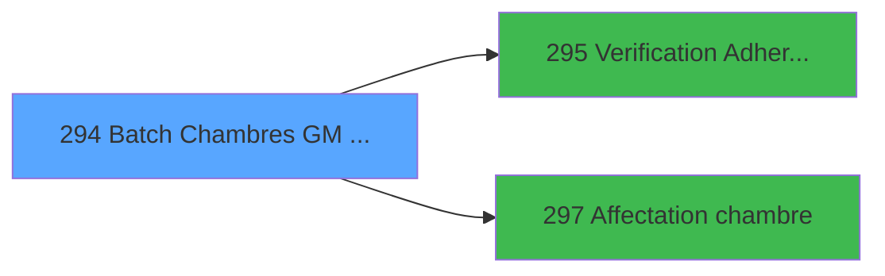

# PBG IDE 294 - Batch Chambres GM dispo

> **Analyse**: Phases 1-4 2026-02-03 10:55 -> 10:55 (20s) | Assemblage 10:55
> **Pipeline**: V7.2 Enrichi
> **Structure**: 4 onglets (Resume | Ecrans | Donnees | Connexions)

<!-- TAB:Resume -->

## 1. FICHE D'IDENTITE

| Attribut | Valeur |
|----------|--------|
| Projet | PBG |
| IDE Position | 294 |
| Nom Programme | Batch Chambres GM dispo |
| Fichier source | `Prg_294.xml` |
| Dossier IDE | General |
| Taches | 1 (0 ecrans visibles) |
| Tables modifiees | 0 |
| Programmes appeles | 2 |

## 2. DESCRIPTION FONCTIONNELLE

**Batch Chambres GM dispo** assure la gestion complete de ce processus, accessible depuis [Traitement Import Personnel (IDE 290)](PBG-IDE-290.md), [Traitement Import Personnel SA (IDE 376)](PBG-IDE-376.md).

Le flux de traitement s'organise en **1 blocs fonctionnels** :

- **Traitement** (1 tache) : traitements metier divers

## 3. BLOCS FONCTIONNELS

### 3.1 Traitement (1 tache)

Traitements internes.

---

#### 294 - Liste des chambres disponibles [[ECRAN]](#ecran-t3)

**Role** : Traitement : Liste des chambres disponibles.
**Ecran** : 256 x 10 DLU (MDI) | [Voir mockup](#ecran-t3)
**Delegue a** : [Affectation chambre (IDE 297)](PBG-IDE-297.md)

## 5. REGLES METIER

*(Aucune regle metier identifiee)*

## 6. CONTEXTE

- **Appele par**: [Traitement Import Personnel (IDE 290)](PBG-IDE-290.md), [Traitement Import Personnel SA (IDE 376)](PBG-IDE-376.md)
- **Appelle**: 2 programmes | **Tables**: 2 (W:0 R:1 L:1) | **Taches**: 1 | **Expressions**: 16

<!-- TAB:Ecrans -->

## 8. ECRANS

*(Programme sans ecran visible)*

## 9. NAVIGATION

### 9.3 Structure hierarchique (1 tache)

| Position | Tache | Type | Dimensions | Bloc |
|----------|-------|------|------------|------|
| **294.1** | [**Liste des chambres disponibles** (294)](#t3) [mockup](#ecran-t3) | MDI | 256x10 | Traitement |

### 9.4 Algorigramme

> **Legende**: Vert = START/END OK | Rouge = END KO | Bleu = Decisions
> *Algorigramme auto-genere. Utiliser `/algorigramme` pour une synthese metier detaillee.*

<!-- TAB:Donnees -->

## 10. TABLES

### Tables utilisees (2)

| ID | Nom | Description | Type | R | W | L | Usages |
|----|-----|-------------|------|---|---|---|--------|
| 34 | hebergement______heb | Hebergement (chambres) | DB | R |   |   | 1 |
| 103 | logement_client__loc |  | DB |   |   | L | 1 |

### Colonnes par table (2 / 1 tables avec colonnes identifiees)

Table 34 - hebergement______heb (R) - 1 usages

| Lettre | Variable | Acces | Type |
|--------|----------|-------|------|
| A | P.Societe | R | Alpha |
| B | P.compte | R | Numeric |
| C | P.Date Debut | R | Date |
| D | P.Date Fin | R | Date |
| E | P.Logement/Chambre | R | Alpha |
| F | P.Heure Début | R | Time |
| G | p.Heure Fin | R | Time |
| H | P.Message Erreur | R | Alpha |
| I | P.Chambre Dispo | R | Logical |
| J | P.Code Logement | R | Alpha |
| K | V.Dispo ? | R | Logical |
| L | V.verif reservation ? | R | Logical |
| M | Bt.Affecter | R | Alpha |
| N | Bt.Editer | R | Alpha |
| O | V.ok affectation | R | Logical |

## 11. VARIABLES

### 11.1 Parametres entrants (10)

Variables recues du programme appelant ([Traitement Import Personnel (IDE 290)](PBG-IDE-290.md)).

| Lettre | Nom | Type | Usage dans |
|--------|-----|------|-----------|
| A | P.Societe | Alpha | 2x parametre entrant |
| B | P.compte | Numeric | 2x parametre entrant |
| C | P.Date Debut | Date | - |
| D | P.Date Fin | Date | - |
| E | P.Logement/Chambre | Alpha | - |
| F | P.Heure Début | Time | 1x parametre entrant |
| G | p.Heure Fin | Time | - |
| H | P.Message Erreur | Alpha | - |
| I | P.Chambre Dispo | Logical | - |
| J | P.Code Logement | Alpha | - |

### 11.2 Variables de session (3)

Variables persistantes pendant toute la session.

| Lettre | Nom | Type | Usage dans |
|--------|-----|------|-----------|
| K | V.Dispo ? | Logical | - |
| L | V.verif reservation ? | Logical | - |
| O | V.ok affectation | Logical | - |

### 11.3 Autres (2)

Variables diverses.

| Lettre | Nom | Type | Usage dans |
|--------|-----|------|-----------|
| M | Bt.Affecter | Alpha | - |
| N | Bt.Editer | Alpha | - |

## 12. EXPRESSIONS

**16 / 16 expressions decodees (100%)**

### 12.1 Repartition par type

| Type | Expressions | Regles |
|------|-------------|--------|
| CAST_LOGIQUE | 3 | 0 |
| CONSTANTE | 5 | 0 |
| OTHER | 6 | 0 |
| CONDITION | 1 | 0 |
| FORMAT | 1 | 0 |

### 12.2 Expressions cles par type

#### CAST_LOGIQUE (3 expressions)

| Type | IDE | Expression | Regle |
|------|-----|------------|-------|
| CAST_LOGIQUE | 16 | `'TRUE'LOG` | - |
| CAST_LOGIQUE | 15 | `'FALSE'LOG` | - |
| CAST_LOGIQUE | 8 | `CallProg('{675,-1}'PROG,'TRUE'LOG,P.compte [B],P.Societe [A],[BX],[CC],[BY],[CD],P.Heure Début [F],0)` | - |

#### CONSTANTE (5 expressions)

| Type | IDE | Expression | Regle |
|------|-----|------------|-------|
| CONSTANTE | 13 | `'18'` | - |
| CONSTANTE | 14 | `0` | - |
| CONSTANTE | 7 | `'N'` | - |
| CONSTANTE | 4 | `'H'` | - |
| CONSTANTE | 6 | `'#'` | - |

#### OTHER (6 expressions)

| Type | IDE | Expression | Regle |
|------|-----|------------|-------|
| OTHER | 9 | `GetParam('LANGUE')` | - |
| OTHER | 10 | `[BS]` | - |
| OTHER | 11 | `[BF]` | - |
| OTHER | 1 | `[BW]` | - |
| OTHER | 3 | `P.Societe [A]` | - |
| ... | | *+1 autres* | |

#### CONDITION (1 expressions)

| Type | IDE | Expression | Regle |
|------|-----|------------|-------|
| CONDITION | 2 | `CndRange([BZ]<>'',[BZ])` | - |

#### FORMAT (1 expressions)

| Type | IDE | Expression | Regle |
|------|-----|------------|-------|
| FORMAT | 12 | `'P'&Trim(Str([AE],'2'))` | - |

<!-- TAB:Connexions -->

## 13. GRAPHE D'APPELS

### 13.1 Chaine depuis Main (Callers)

Main -> ... -> [Traitement Import Personnel (IDE 290)](PBG-IDE-290.md) -> **Batch Chambres GM dispo (IDE 294)**

Main -> ... -> [Traitement Import Personnel SA (IDE 376)](PBG-IDE-376.md) -> **Batch Chambres GM dispo (IDE 294)**

### 13.2 Callers

| IDE | Nom Programme | Nb Appels |
|-----|---------------|-----------|
| [290](PBG-IDE-290.md) | Traitement Import Personnel | 1 |
| [376](PBG-IDE-376.md) | Traitement Import Personnel SA | 1 |

### 13.3 Callees (programmes appeles)

### 13.4 Detail Callees avec contexte

| IDE | Nom Programme | Appels | Contexte |
|-----|---------------|--------|----------|
| [295](PBG-IDE-295.md) | Verification Adherents Batch I | 1 | Controle/validation |
| [297](PBG-IDE-297.md) | Affectation chambre | 1 | Sous-programme |

## 14. RECOMMANDATIONS MIGRATION

### 14.1 Profil du programme

| Metrique | Valeur | Impact migration |
|----------|--------|-----------------|
| Lignes de logique | 57 | Programme compact |
| Expressions | 16 | Peu de logique |
| Tables WRITE | 0 | Impact faible |
| Sous-programmes | 2 | Peu de dependances |
| Ecrans visibles | 0 | Ecran unique ou traitement batch |
| Code desactive | 0% (0 / 57) | Code sain |
| Regles metier | 0 | Pas de regle identifiee |

### 14.2 Plan de migration par bloc

#### Traitement (1 tache: 1 ecran, 0 traitement)

- **Strategie** : 1 composant(s) UI (Razor/React) avec formulaires et validation.
- 2 sous-programme(s) a migrer ou a reutiliser depuis les services existants.
- Decomposer les taches en services unitaires testables.

### 14.3 Dependances critiques

| Dependance | Type | Appels | Impact |
|------------|------|--------|--------|
| [Affectation chambre (IDE 297)](PBG-IDE-297.md) | Sous-programme | 1x | Normale - Sous-programme |
| [Verification Adherents Batch I (IDE 295)](PBG-IDE-295.md) | Sous-programme | 1x | Normale - Controle/validation |

---
*Spec DETAILED generee par Pipeline V7.2 - 2026-02-03 10:55*
