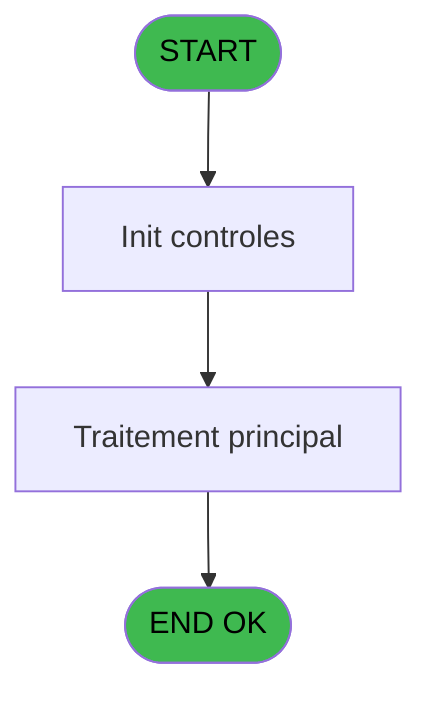
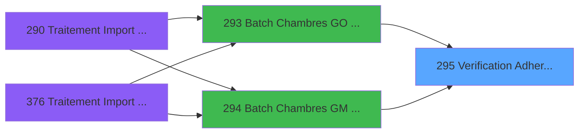

# PBG IDE 295 - Verification Adherents Batch I

> **Analyse**: Phases 1-4 2026-02-03 10:55 -> 10:56 (20s) | Assemblage 10:56
> **Pipeline**: V7.2 Enrichi
> **Structure**: 4 onglets (Resume | Ecrans | Donnees | Connexions)

<!-- TAB:Resume -->

## 1. FICHE D'IDENTITE

| Attribut | Valeur |
|----------|--------|
| Projet | PBG |
| IDE Position | 295 |
| Nom Programme | Verification Adherents Batch I |
| Fichier source | `Prg_295.xml` |
| Dossier IDE | General |
| Taches | 1 (0 ecrans visibles) |
| Tables modifiees | 0 |
| Programmes appeles | 0 |

## 2. DESCRIPTION FONCTIONNELLE

**Verification Adherents Batch I** assure la gestion complete de ce processus, accessible depuis [Batch Chambres GO dispo (IDE 293)](PBG-IDE-293.md), [Batch Chambres GM dispo (IDE 294)](PBG-IDE-294.md).

Le flux de traitement s'organise en **1 blocs fonctionnels** :

- **Validation** (1 tache) : controles et verifications de coherence

**Logique metier** : 1 regles identifiees couvrant conditions metier.

## 3. BLOCS FONCTIONNELS

### 3.1 Validation (1 tache)

Controles de coherence : 1 tache verifie les donnees et conditions.

---

#### 295 - Verification Occupation [[ECRAN]](#ecran-t1)

**Role** : Verification : Verification Occupation.
**Ecran** : 594 x 184 DLU (MDI) | [Voir mockup](#ecran-t1)
**Variables liees** : D (P0-Occupation Std), E (P0-P/U Occupation), J (P0-Type Occupation), M (W0-Occupation), N (W0-Flag Occupation)

## 5. REGLES METIER

1 regles identifiees:

### Autres (1 regles)

#### [RM-001] Condition toujours vraie (flag actif)

| Element | Detail |
|---------|--------|
| **Condition** | `W0-Occupation [M]=6 AND W0-Flag Occupation [N]=6 AND W0-Flag Single [O]=6 AND W0-Flag Blocage [P]=6` |
| **Si vrai** | 'TRUE'LOG |
| **Si faux** | 'FALSE'LOG) |
| **Variables** | M (W0-Occupation), N (W0-Flag Occupation), O (W0-Flag Single), P (W0-Flag Blocage) |
| **Expression source** | Expression 14 : `IF (W0-Occupation [M]=6 AND W0-Flag Occupation [N]=6 AND W0-` |
| **Exemple** | Si W0-Occupation [M]=6 AND W0-Flag Occupation [N]=6 AND W0-Flag Single [O]=6 AND W0-Flag Blocage [P]=6 → 'TRUE'LOG. Sinon → 'FALSE'LOG) |

## 6. CONTEXTE

- **Appele par**: [Batch Chambres GO dispo (IDE 293)](PBG-IDE-293.md), [Batch Chambres GM dispo (IDE 294)](PBG-IDE-294.md)
- **Appelle**: 0 programmes | **Tables**: 1 (W:0 R:1 L:0) | **Taches**: 1 | **Expressions**: 24

<!-- TAB:Ecrans -->

## 8. ECRANS

*(Programme sans ecran visible)*

## 9. NAVIGATION

### 9.3 Structure hierarchique (1 tache)

| Position | Tache | Type | Dimensions | Bloc |
|----------|-------|------|------------|------|
| **295.1** | [**Verification Occupation** (295)](#t1) [mockup](#ecran-t1) | MDI | 594x184 | Validation |

### 9.4 Algorigramme

> **Legende**: Vert = START/END OK | Rouge = END KO | Bleu = Decisions
> *Algorigramme auto-genere. Utiliser `/algorigramme` pour une synthese metier detaillee.*

<!-- TAB:Donnees -->

## 10. TABLES

### Tables utilisees (1)

| ID | Nom | Description | Type | R | W | L | Usages |
|----|-----|-------------|------|---|---|---|--------|
| 34 | hebergement______heb | Hebergement (chambres) | DB | R |   |   | 1 |

### Colonnes par table (1 / 1 tables avec colonnes identifiees)

Table 34 - hebergement______heb (R) - 1 usages

| Lettre | Variable | Acces | Type |
|--------|----------|-------|------|
| A | P0-Code Societe | R | Alpha |
| B | P0-Code Langue | R | Alpha |
| C | P0-Nom Logement | R | Alpha |
| D | P0-Occupation Std | R | Numeric |
| E | P0-P/U Occupation | R | Alpha |
| F | P0-Date Debut | R | Date |
| G | P0-Heure Debut | R | Alpha |
| H | P0-Date Fin | R | Date |
| I | P0-Heure Fin | R | Alpha |
| J | P0-Type Occupation | R | Alpha |
| K | P0-Autorisation | R | Logical |
| L | P0-Message Retour | R | Alpha |
| M | W0-Occupation | R | Numeric |
| N | W0-Flag Occupation | R | Numeric |
| O | W0-Flag Single | R | Numeric |
| P | W0-Flag Blocage | R | Numeric |
| Q | W0-Flag Qualite | R | Numeric |
| R | W0-Date/Heure Debut | R | Numeric |
| S | W0-Date/Heure Fin | R | Numeric |

## 11. VARIABLES

### 11.1 Autres (19)

Variables diverses.

| Lettre | Nom | Type | Usage dans |
|--------|-----|------|-----------|
| A | P0-Code Societe | Alpha | 1x refs |
| B | P0-Code Langue | Alpha | - |
| C | P0-Nom Logement | Alpha | 1x refs |
| D | P0-Occupation Std | Numeric | 1x refs |
| E | P0-P/U Occupation | Alpha | [295](#t1) |
| F | P0-Date Debut | Date | 1x refs |
| G | P0-Heure Debut | Alpha | 1x refs |
| H | P0-Date Fin | Date | 1x refs |
| I | P0-Heure Fin | Alpha | 1x refs |
| J | P0-Type Occupation | Alpha | [295](#t1) |
| K | P0-Autorisation | Logical | - |
| L | P0-Message Retour | Alpha | 3x refs |
| M | W0-Occupation | Numeric | 3x refs |
| N | W0-Flag Occupation | Numeric | [295](#t1) |
| O | W0-Flag Single | Numeric | 5x refs |
| P | W0-Flag Blocage | Numeric | 2x refs |
| Q | W0-Flag Qualite | Numeric | 1x refs |
| R | W0-Date/Heure Debut | Numeric | 1x refs |
| S | W0-Date/Heure Fin | Numeric | - |

Toutes les 19 variables (liste complete)

| Cat | Lettre | Nom Variable | Type |
|-----|--------|--------------|------|
| Autre | **A** | P0-Code Societe | Alpha |
| Autre | **B** | P0-Code Langue | Alpha |
| Autre | **C** | P0-Nom Logement | Alpha |
| Autre | **D** | P0-Occupation Std | Numeric |
| Autre | **E** | P0-P/U Occupation | Alpha |
| Autre | **F** | P0-Date Debut | Date |
| Autre | **G** | P0-Heure Debut | Alpha |
| Autre | **H** | P0-Date Fin | Date |
| Autre | **I** | P0-Heure Fin | Alpha |
| Autre | **J** | P0-Type Occupation | Alpha |
| Autre | **K** | P0-Autorisation | Logical |
| Autre | **L** | P0-Message Retour | Alpha |
| Autre | **M** | W0-Occupation | Numeric |
| Autre | **N** | W0-Flag Occupation | Numeric |
| Autre | **O** | W0-Flag Single | Numeric |
| Autre | **P** | W0-Flag Blocage | Numeric |
| Autre | **Q** | W0-Flag Qualite | Numeric |
| Autre | **R** | W0-Date/Heure Debut | Numeric |
| Autre | **S** | W0-Date/Heure Fin | Numeric |

## 12. EXPRESSIONS

**24 / 24 expressions decodees (100%)**

### 12.1 Repartition par type

| Type | Expressions | Regles |
|------|-------------|--------|
| CALCULATION | 3 | 0 |
| CALCUL | 1 | 0 |
| CONCATENATION | 3 | 0 |
| CAST_LOGIQUE | 2 | 5 |
| CONSTANTE | 4 | 0 |
| OTHER | 2 | 0 |
| CONDITION | 9 | 0 |

### 12.2 Expressions cles par type

#### CALCULATION (3 expressions)

| Type | IDE | Expression | Regle |
|------|-----|------------|-------|
| CALCULATION | 8 | `P0-Message Retour [L]+1` | - |
| CALCULATION | 3 | `P0-Date Fin [H]*100+Val (P0-Heure Fin [I],'##')` | - |
| CALCULATION | 2 | `P0-Date Debut [F]*100+Val (P0-Heure Debut [G],'##')` | - |

#### CALCUL (1 expressions)

| Type | IDE | Expression | Regle |
|------|-----|------------|-------|
| CALCUL | 7 | `[V]*100+Val ([W],'##')<W0-Date/Heure Debut [R] AND [X]*100+Val ([Y],'##')>W0-Flag Qualite [Q]` | - |

#### CONCATENATION (3 expressions)

| Type | IDE | Expression | Regle |
|------|-----|------------|-------|
| CONCATENATION | 24 | `Trim([BC])&' '&'Client avec personnel ! '` | - |
| CONCATENATION | 22 | `Trim([BC])&' '&'Single non respecté !! '` | - |
| CONCATENATION | 23 | `Trim([BC])&' '&'Sur-occupation logement ! '` | - |

#### CAST_LOGIQUE (2 expressions)

| Type | IDE | Expression | Regle |
|------|-----|------------|-------|
| CAST_LOGIQUE | 14 | `IF (W0-Occupation [M]=6 AND W0-Flag Occupation [N]=6 AND W0-Flag Single [O]=6 AND W0-Flag Blocage [P]=6,'TRUE'LOG,'FALSE'LOG)` | [RM-001](#rm-RM-001) |
| CAST_LOGIQUE | 1 | `'FALSE'LOG` | - |

#### CONSTANTE (4 expressions)

| Type | IDE | Expression | Regle |
|------|-----|------------|-------|
| CONSTANTE | 16 | `0` | - |
| CONSTANTE | 21 | `'Logement bloqué !!'` | - |
| CONSTANTE | 5 | `'H'` | - |
| CONSTANTE | 15 | `6` | - |

#### OTHER (2 expressions)

| Type | IDE | Expression | Regle |
|------|-----|------------|-------|
| OTHER | 6 | `P0-Nom Logement [C]` | - |
| OTHER | 4 | `P0-Code Societe [A]` | - |

#### CONDITION (9 expressions)

| Type | IDE | Expression | Regle |
|------|-----|------------|-------|
| CONDITION | 19 | `[Z]=ASCIIChr (15)` | - |
| CONDITION | 17 | `P0-Message Retour [L]>=P0-Occupation Std [D]` | - |
| CONDITION | 18 | `Trim(MID(P0-P/U Occupation [E],2,2))='1' AND P0-Message Retour [L]>0 OR Trim(MID([Z],2,2))='1'` | - |
| CONDITION | 20 | `P0-Type Occupation [J]<>[AA] AND [Z]<>ASCIIChr (15)` | - |
| CONDITION | 13 | `W0-Flag Single [O]=6 AND W0-Flag Occupation [N]=6 AND W0-Occupation [M]=6 AND W0-Flag Blocage [P]<>6` | - |
| ... | | *+4 autres* | |

### 12.3 Toutes les expressions (24)

Voir les 24 expressions

#### CALCULATION (3)

| IDE | Expression Decodee |
|-----|-------------------|
| 2 | `P0-Date Debut [F]*100+Val (P0-Heure Debut [G],'##')` |
| 3 | `P0-Date Fin [H]*100+Val (P0-Heure Fin [I],'##')` |
| 8 | `P0-Message Retour [L]+1` |

#### CALCUL (1)

| IDE | Expression Decodee |
|-----|-------------------|
| 7 | `[V]*100+Val ([W],'##')<W0-Date/Heure Debut [R] AND [X]*100+Val ([Y],'##')>W0-Flag Qualite [Q]` |

#### CONCATENATION (3)

| IDE | Expression Decodee |
|-----|-------------------|
| 23 | `Trim([BC])&' '&'Sur-occupation logement ! '` |
| 22 | `Trim([BC])&' '&'Single non respecté !! '` |
| 24 | `Trim([BC])&' '&'Client avec personnel ! '` |

#### CAST_LOGIQUE (2)

| IDE | Expression Decodee |
|-----|-------------------|
| 14 | `IF (W0-Occupation [M]=6 AND W0-Flag Occupation [N]=6 AND W0-Flag Single [O]=6 AND W0-Flag Blocage [P]=6,'TRUE'LOG,'FALSE'LOG)` |
| 1 | `'FALSE'LOG` |

#### CONSTANTE (4)

| IDE | Expression Decodee |
|-----|-------------------|
| 5 | `'H'` |
| 15 | `6` |
| 16 | `0` |
| 21 | `'Logement bloqué !!'` |

#### OTHER (2)

| IDE | Expression Decodee |
|-----|-------------------|
| 4 | `P0-Code Societe [A]` |
| 6 | `P0-Nom Logement [C]` |

#### CONDITION (9)

| IDE | Expression Decodee |
|-----|-------------------|
| 9 | `[Z]<>ASCIIChr (15)` |
| 10 | `W0-Flag Single [O]<>6` |
| 11 | `W0-Flag Single [O]=6  AND W0-Flag Occupation [N]<>6` |
| 12 | `W0-Flag Single [O]=6 AND W0-Flag Occupation [N]=6 AND W0-Occupation [M]<>6` |
| 13 | `W0-Flag Single [O]=6 AND W0-Flag Occupation [N]=6 AND W0-Occupation [M]=6 AND W0-Flag Blocage [P]<>6` |
| 17 | `P0-Message Retour [L]>=P0-Occupation Std [D]` |
| 19 | `[Z]=ASCIIChr (15)` |
| 20 | `P0-Type Occupation [J]<>[AA] AND [Z]<>ASCIIChr (15)` |
| 18 | `Trim(MID(P0-P/U Occupation [E],2,2))='1' AND P0-Message Retour [L]>0 OR Trim(MID([Z],2,2))='1'` |

<!-- TAB:Connexions -->

## 13. GRAPHE D'APPELS

### 13.1 Chaine depuis Main (Callers)

Main -> ... -> [Batch Chambres GO dispo (IDE 293)](PBG-IDE-293.md) -> **Verification Adherents Batch I (IDE 295)**

Main -> ... -> [Batch Chambres GM dispo (IDE 294)](PBG-IDE-294.md) -> **Verification Adherents Batch I (IDE 295)**

### 13.2 Callers

| IDE | Nom Programme | Nb Appels |
|-----|---------------|-----------|
| [293](PBG-IDE-293.md) | Batch Chambres GO dispo | 1 |
| [294](PBG-IDE-294.md) | Batch Chambres GM dispo | 1 |

### 13.3 Callees (programmes appeles)

### 13.4 Detail Callees avec contexte

| IDE | Nom Programme | Appels | Contexte |
|-----|---------------|--------|----------|
| - | (aucun) | - | - |

## 14. RECOMMANDATIONS MIGRATION

### 14.1 Profil du programme

| Metrique | Valeur | Impact migration |
|----------|--------|-----------------|
| Lignes de logique | 59 | Programme compact |
| Expressions | 24 | Peu de logique |
| Tables WRITE | 0 | Impact faible |
| Sous-programmes | 0 | Peu de dependances |
| Ecrans visibles | 0 | Ecran unique ou traitement batch |
| Code desactive | 0% (0 / 59) | Code sain |
| Regles metier | 1 | Quelques regles a preserver |

### 14.2 Plan de migration par bloc

#### Validation (1 tache: 1 ecran, 0 traitement)

- **Strategie** : FluentValidation avec validators specifiques.
- Chaque tache de validation -> un validator injectable

### 14.3 Dependances critiques

| Dependance | Type | Appels | Impact |
|------------|------|--------|--------|

---
*Spec DETAILED generee par Pipeline V7.2 - 2026-02-03 10:56*
