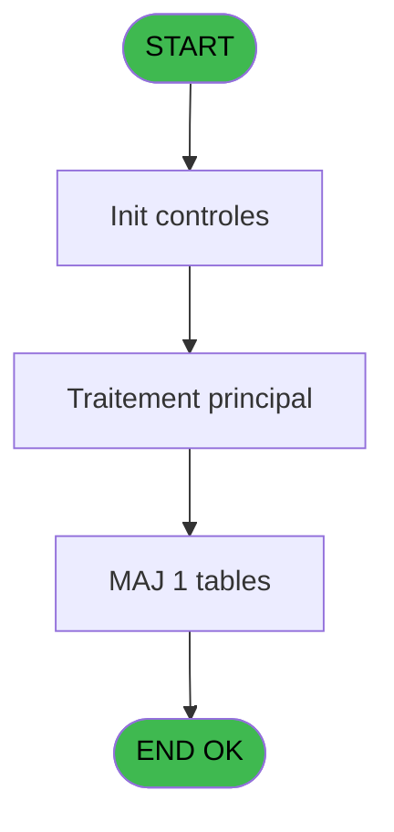
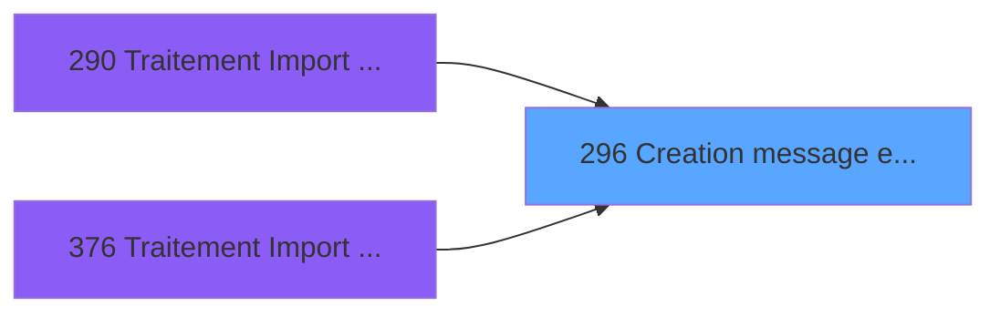

# PBG IDE 296 - Creation message erreur Import

> **Analyse**: Phases 1-4 2026-02-03 10:56 -> 10:56 (19s) | Assemblage 10:56
> **Pipeline**: V7.2 Enrichi
> **Structure**: 4 onglets (Resume | Ecrans | Donnees | Connexions)

<!-- TAB:Resume -->

## 1. FICHE D'IDENTITE

| Attribut | Valeur |
|----------|--------|
| Projet | PBG |
| IDE Position | 296 |
| Nom Programme | Creation message erreur Import |
| Fichier source | `Prg_296.xml` |
| Dossier IDE | General |
| Taches | 1 (0 ecrans visibles) |
| Tables modifiees | 1 |
| Programmes appeles | 0 |

## 2. DESCRIPTION FONCTIONNELLE

**Creation message erreur Import** assure la gestion complete de ce processus, accessible depuis [Traitement Import Personnel (IDE 290)](PBG-IDE-290.md), [Traitement Import Personnel SA (IDE 376)](PBG-IDE-376.md).

Le flux de traitement s'organise en **1 blocs fonctionnels** :

- **Creation** (1 tache) : insertion d'enregistrements en base (mouvements, prestations)

**Donnees modifiees** : 1 tables en ecriture (annulation_vente).

## 3. BLOCS FONCTIONNELS

### 3.1 Creation (1 tache)

Insertion de nouveaux enregistrements en base.

---

#### 296 - Creation message erreur Import

**Role** : Creation d'enregistrement : Creation message erreur Import.
**Variables liees** : F (P.Message)

## 5. REGLES METIER

*(Aucune regle metier identifiee)*

## 6. CONTEXTE

- **Appele par**: [Traitement Import Personnel (IDE 290)](PBG-IDE-290.md), [Traitement Import Personnel SA (IDE 376)](PBG-IDE-376.md)
- **Appelle**: 0 programmes | **Tables**: 1 (W:1 R:0 L:0) | **Taches**: 1 | **Expressions**: 6

<!-- TAB:Ecrans -->

## 8. ECRANS

*(Programme sans ecran visible)*

## 9. NAVIGATION

### 9.3 Structure hierarchique (1 tache)

| Position | Tache | Type | Dimensions | Bloc |
|----------|-------|------|------------|------|
| **296.1** | [**Creation message erreur Import** (296)](#t1) | - | - | Creation |

### 9.4 Algorigramme

> **Legende**: Vert = START/END OK | Rouge = END KO | Bleu = Decisions
> *Algorigramme auto-genere. Utiliser `/algorigramme` pour une synthese metier detaillee.*

<!-- TAB:Donnees -->

## 10. TABLES

### Tables utilisees (1)

| ID | Nom | Description | Type | R | W | L | Usages |
|----|-----|-------------|------|---|---|---|--------|
| 875 | annulation_vente | Donnees de ventes | DB |   | **W** |   | 1 |

### Colonnes par table (1 / 1 tables avec colonnes identifiees)

Table 875 - annulation_vente (**W**) - 1 usages

| Lettre | Variable | Acces | Type |
|--------|----------|-------|------|
| A | P.Sequence | W | Numeric |
| B | P.Ligne | W | Numeric |
| C | P.Date | W | Date |
| D | P.Heure | W | Time |
| E | P.Chambre | W | Alpha |
| F | P.Message | W | Alpha |

## 11. VARIABLES

### 11.1 Parametres entrants (6)

Variables recues du programme appelant ([Traitement Import Personnel (IDE 290)](PBG-IDE-290.md)).

| Lettre | Nom | Type | Usage dans |
|--------|-----|------|-----------|
| A | P.Sequence | Numeric | 1x parametre entrant |
| B | P.Ligne | Numeric | - |
| C | P.Date | Date | - |
| D | P.Heure | Time | - |
| E | P.Chambre | Alpha | - |
| F | P.Message | Alpha | - |

## 12. EXPRESSIONS

**6 / 6 expressions decodees (100%)**

### 12.1 Repartition par type

| Type | Expressions | Regles |
|------|-------------|--------|
| OTHER | 6 | 0 |

### 12.2 Expressions cles par type

#### OTHER (6 expressions)

| Type | IDE | Expression | Regle |
|------|-----|------------|-------|
| OTHER | 4 | `[M]` | - |
| OTHER | 5 | `[J]` | - |
| OTHER | 6 | `[K]` | - |
| OTHER | 1 | `P.Sequence [A]` | - |
| OTHER | 2 | `[H]` | - |
| ... | | *+1 autres* | |

<!-- TAB:Connexions -->

## 13. GRAPHE D'APPELS

### 13.1 Chaine depuis Main (Callers)

Main -> ... -> [Traitement Import Personnel (IDE 290)](PBG-IDE-290.md) -> **Creation message erreur Import (IDE 296)**

Main -> ... -> [Traitement Import Personnel SA (IDE 376)](PBG-IDE-376.md) -> **Creation message erreur Import (IDE 296)**

### 13.2 Callers

| IDE | Nom Programme | Nb Appels |
|-----|---------------|-----------|
| [290](PBG-IDE-290.md) | Traitement Import Personnel | 2 |
| [376](PBG-IDE-376.md) | Traitement Import Personnel SA | 2 |

### 13.3 Callees (programmes appeles)

### 13.4 Detail Callees avec contexte

| IDE | Nom Programme | Appels | Contexte |
|-----|---------------|--------|----------|
| - | (aucun) | - | - |

## 14. RECOMMANDATIONS MIGRATION

### 14.1 Profil du programme

| Metrique | Valeur | Impact migration |
|----------|--------|-----------------|
| Lignes de logique | 17 | Programme compact |
| Expressions | 6 | Peu de logique |
| Tables WRITE | 1 | Impact faible |
| Sous-programmes | 0 | Peu de dependances |
| Ecrans visibles | 0 | Ecran unique ou traitement batch |
| Code desactive | 0% (0 / 17) | Code sain |
| Regles metier | 0 | Pas de regle identifiee |

### 14.2 Plan de migration par bloc

#### Creation (1 tache: 0 ecran, 1 traitement)

- **Strategie** : Repository pattern avec Entity Framework Core.
- Insertion via `IRepository<T>.CreateAsync()`

### 14.3 Dependances critiques

| Dependance | Type | Appels | Impact |
|------------|------|--------|--------|
| annulation_vente | Table WRITE (Database) | 1x | Schema + repository |

---
*Spec DETAILED generee par Pipeline V7.2 - 2026-02-03 10:56*
