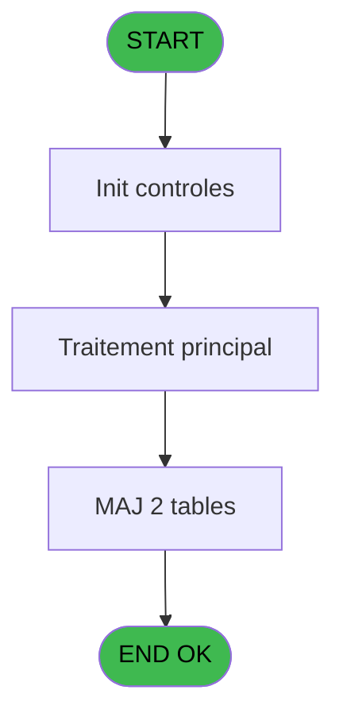
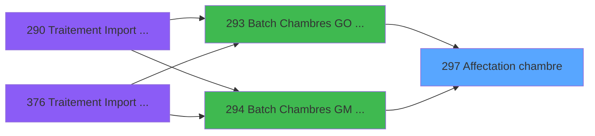

# PBG IDE 297 - Affectation chambre

> **Analyse**: Phases 1-4 2026-02-03 10:56 -> 10:57 (20s) | Assemblage 10:57
> **Pipeline**: V7.2 Enrichi
> **Structure**: 4 onglets (Resume | Ecrans | Donnees | Connexions)

<!-- TAB:Resume -->

## 1. FICHE D'IDENTITE

| Attribut | Valeur |
|----------|--------|
| Projet | PBG |
| IDE Position | 297 |
| Nom Programme | Affectation chambre |
| Fichier source | `Prg_297.xml` |
| Dossier IDE | General |
| Taches | 3 (0 ecrans visibles) |
| Tables modifiees | 2 |
| Programmes appeles | 0 |

## 2. DESCRIPTION FONCTIONNELLE

**Affectation chambre** assure la gestion complete de ce processus, accessible depuis [Batch Chambres GO dispo (IDE 293)](PBG-IDE-293.md), [Batch Chambres GM dispo (IDE 294)](PBG-IDE-294.md).

Le flux de traitement s'organise en **1 blocs fonctionnels** :

- **Traitement** (3 taches) : traitements metier divers

**Donnees modifiees** : 2 tables en ecriture (hebergement______heb, tairejet).

## 3. BLOCS FONCTIONNELS

### 3.1 Traitement (3 taches)

Traitements internes.

---

#### 297 - Affectation chambre

**Role** : Traitement : Affectation chambre.

---

#### 297.1 - Crzation chambre

**Role** : Traitement : Crzation chambre.

---

#### 297.2 - Affectation

**Role** : Traitement : Affectation.

## 5. REGLES METIER

*(Aucune regle metier identifiee)*

## 6. CONTEXTE

- **Appele par**: [Batch Chambres GO dispo (IDE 293)](PBG-IDE-293.md), [Batch Chambres GM dispo (IDE 294)](PBG-IDE-294.md)
- **Appelle**: 0 programmes | **Tables**: 3 (W:2 R:1 L:0) | **Taches**: 3 | **Expressions**: 3

<!-- TAB:Ecrans -->

## 8. ECRANS

*(Programme sans ecran visible)*

## 9. NAVIGATION

### 9.3 Structure hierarchique (3 taches)

| Position | Tache | Type | Dimensions | Bloc |
|----------|-------|------|------------|------|
| **297.1** | [**Affectation chambre** (297)](#t1) | - | - | Traitement |
| 297.1.1 | [Crzation chambre (297.1)](#t19) | - | - | |
| 297.1.2 | [Affectation (297.2)](#t23) | - | - | |

### 9.4 Algorigramme

> **Legende**: Vert = START/END OK | Rouge = END KO | Bleu = Decisions
> *Algorigramme auto-genere. Utiliser `/algorigramme` pour une synthese metier detaillee.*

<!-- TAB:Donnees -->

## 10. TABLES

### Tables utilisees (3)

| ID | Nom | Description | Type | R | W | L | Usages |
|----|-----|-------------|------|---|---|---|--------|
| 30 | gm-recherche_____gmr | Index de recherche | DB | R |   |   | 1 |
| 34 | hebergement______heb | Hebergement (chambres) | DB |   | **W** |   | 1 |
| 455 | tairejet |  | DB |   | **W** |   | 1 |

### Colonnes par table (1 / 3 tables avec colonnes identifiees)

Table 30 - gm-recherche_____gmr (R) - 1 usages

| Lettre | Variable | Acces | Type |
|--------|----------|-------|------|
| A | P.Societe | R | Alpha |
| B | P.Compte | R | Numeric |
| C | P.Filiation | R | Numeric |
| D | P.Date debut | R | Date |
| E | P.Date fin | R | Date |
| F | P.Nom logement | R | Alpha |
| G | P.Traitement auto | R | Alpha |
| H | P.Code Logement | R | Alpha |

Table 34 - hebergement______heb (**W**) - 1 usages

*Table utilisee uniquement en Link ou aucune colonne Real identifiee dans le DataView.*

Table 455 - tairejet (**W**) - 1 usages

*Table utilisee uniquement en Link ou aucune colonne Real identifiee dans le DataView.*

## 11. VARIABLES

### 11.1 Parametres entrants (8)

Variables recues du programme appelant ([Batch Chambres GO dispo (IDE 293)](PBG-IDE-293.md)).

| Lettre | Nom | Type | Usage dans |
|--------|-----|------|-----------|
| A | P.Societe | Alpha | 1x parametre entrant |
| B | P.Compte | Numeric | 1x parametre entrant |
| C | P.Filiation | Numeric | 1x parametre entrant |
| D | P.Date debut | Date | - |
| E | P.Date fin | Date | - |
| F | P.Nom logement | Alpha | - |
| G | P.Traitement auto | Alpha | - |
| H | P.Code Logement | Alpha | - |

## 12. EXPRESSIONS

**3 / 3 expressions decodees (100%)**

### 12.1 Repartition par type

| Type | Expressions | Regles |
|------|-------------|--------|
| OTHER | 3 | 0 |

### 12.2 Expressions cles par type

#### OTHER (3 expressions)

| Type | IDE | Expression | Regle |
|------|-----|------------|-------|
| OTHER | 3 | `P.Filiation [C]` | - |
| OTHER | 2 | `P.Compte [B]` | - |
| OTHER | 1 | `P.Societe [A]` | - |

<!-- TAB:Connexions -->

## 13. GRAPHE D'APPELS

### 13.1 Chaine depuis Main (Callers)

Main -> ... -> [Batch Chambres GO dispo (IDE 293)](PBG-IDE-293.md) -> **Affectation chambre (IDE 297)**

Main -> ... -> [Batch Chambres GM dispo (IDE 294)](PBG-IDE-294.md) -> **Affectation chambre (IDE 297)**

### 13.2 Callers

| IDE | Nom Programme | Nb Appels |
|-----|---------------|-----------|
| [293](PBG-IDE-293.md) | Batch Chambres GO dispo | 1 |
| [294](PBG-IDE-294.md) | Batch Chambres GM dispo | 1 |

### 13.3 Callees (programmes appeles)

### 13.4 Detail Callees avec contexte

| IDE | Nom Programme | Appels | Contexte |
|-----|---------------|--------|----------|
| - | (aucun) | - | - |

## 14. RECOMMANDATIONS MIGRATION

### 14.1 Profil du programme

| Metrique | Valeur | Impact migration |
|----------|--------|-----------------|
| Lignes de logique | 43 | Programme compact |
| Expressions | 3 | Peu de logique |
| Tables WRITE | 2 | Impact faible |
| Sous-programmes | 0 | Peu de dependances |
| Ecrans visibles | 0 | Ecran unique ou traitement batch |
| Code desactive | 0% (0 / 43) | Code sain |
| Regles metier | 0 | Pas de regle identifiee |

### 14.2 Plan de migration par bloc

#### Traitement (3 taches: 0 ecran, 3 traitements)

- **Strategie** : 3 service(s) backend injectable(s) (Domain Services).
- Decomposer les taches en services unitaires testables.

### 14.3 Dependances critiques

| Dependance | Type | Appels | Impact |
|------------|------|--------|--------|
| hebergement______heb | Table WRITE (Database) | 1x | Schema + repository |
| tairejet | Table WRITE (Database) | 1x | Schema + repository |

---
*Spec DETAILED generee par Pipeline V7.2 - 2026-02-03 10:57*
