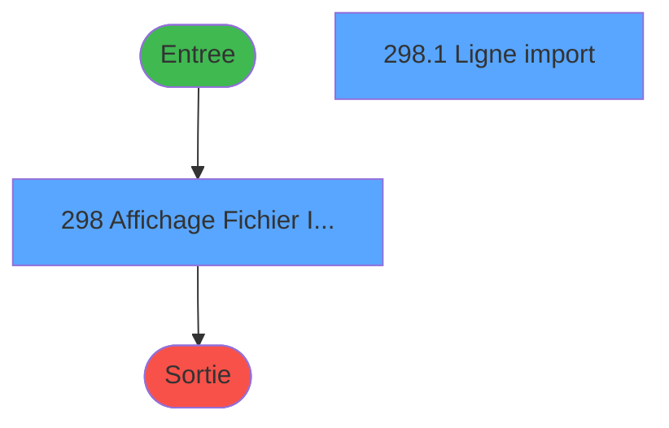
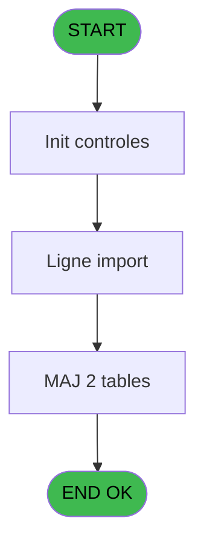

# PBG IDE 298 - Affichage Import GO

> **Analyse**: Phases 1-4 2026-02-03 10:57 -> 10:57 (18s) | Assemblage 10:57
> **Pipeline**: V7.2 Enrichi
> **Structure**: 4 onglets (Resume | Ecrans | Donnees | Connexions)

<!-- TAB:Resume -->

## 1. FICHE D'IDENTITE

| Attribut | Valeur |
|----------|--------|
| Projet | PBG |
| IDE Position | 298 |
| Nom Programme | Affichage Import GO |
| Fichier source | `Prg_298.xml` |
| Dossier IDE | General |
| Taches | 2 (2 ecrans visibles) |
| Tables modifiees | 2 |
| Programmes appeles | 0 |
| :warning: Statut | **ORPHELIN_POTENTIEL** |

## 2. DESCRIPTION FONCTIONNELLE

**Affichage Import GO** assure la gestion complete de ce processus.

Le flux de traitement s'organise en **2 blocs fonctionnels** :

- **Traitement** (1 tache) : traitements metier divers
- **Consultation** (1 tache) : ecrans de recherche, selection et consultation

**Donnees modifiees** : 2 tables en ecriture (special_offers, entete_facture_tva).

**Logique metier** : 2 regles identifiees couvrant conditions metier.

Detail : phases du traitement

#### Phase 1 : Consultation (1 tache)

- **298** - Affichage Fichier Import GO **[[ECRAN]](#ecran-t2)**

#### Phase 2 : Traitement (1 tache)

- **298.1** - Ligne import **[[ECRAN]](#ecran-t3)**

#### Tables impactees

| Table | Operations | Role metier |
|-------|-----------|-------------|
| special_offers | **W** (1 usages) |  |
| entete_facture_tva | **W** (1 usages) |  |

## 3. BLOCS FONCTIONNELS

### 3.1 Consultation (1 tache)

Ecrans de recherche et consultation.

---

#### 298 - Affichage Fichier Import GO [[ECRAN]](#ecran-t2)

**Role** : Reinitialisation : Affichage Fichier Import GO.
**Ecran** : 1309 x 341 DLU (MDI) | [Voir mockup](#ecran-t2)

### 3.2 Traitement (1 tache)

Traitements internes.

---

#### 298.1 - Ligne import [[ECRAN]](#ecran-t3)

**Role** : Traitement : Ligne import.
**Ecran** : 637 x 177 DLU | [Voir mockup](#ecran-t3)

## 5. REGLES METIER

2 regles identifiees:

### Autres (2 regles)

#### [RM-001] Si [W]='1' alors 'Remplacer les données' sinon IF([W]='2','Mettre à jour les données',''))

| Element | Detail |
|---------|--------|
| **Condition** | `[W]='1'` |
| **Si vrai** | 'Remplacer les données' |
| **Si faux** | IF([W]='2','Mettre à jour les données','')) |
| **Expression source** | Expression 5 : `IF([W]='1','Remplacer les données',IF([W]='2','Mettre à jour` |
| **Exemple** | Si [W]='1' → 'Remplacer les données'. Sinon → IF([W]='2','Mettre à jour les données','')) |

#### [RM-002] Si [X]='1' alors 'Sans validation' sinon IF([X]='2','Validation automatique',IF([X]='3','Validation manuelle','')))

| Element | Detail |
|---------|--------|
| **Condition** | `[X]='1'` |
| **Si vrai** | 'Sans validation' |
| **Si faux** | IF([X]='2','Validation automatique',IF([X]='3','Validation manuelle',''))) |
| **Expression source** | Expression 6 : `IF([X]='1','Sans validation',IF([X]='2','Validation automati` |
| **Exemple** | Si [X]='1' → 'Sans validation' |

## 6. CONTEXTE

- **Appele par**: (aucun)
- **Appelle**: 0 programmes | **Tables**: 2 (W:2 R:0 L:0) | **Taches**: 2 | **Expressions**: 8

<!-- TAB:Ecrans -->

## 8. ECRANS

### 8.1 Forms visibles (2 / 2)

| # | Position | Tache | Nom | Type | Largeur | Hauteur | Bloc |
|---|----------|-------|-----|------|---------|---------|------|
| 1 | 298.1 | 298 | Affichage Fichier Import GO | MDI | 1309 | 341 | Consultation |
| 2 | 298.1.1 | 298.1 | Ligne import | Type0 | 637 | 177 | Traitement |

### 8.2 Mockups Ecrans

---

#### 298.1 - Affichage Fichier Import GO
**Tache** : [298](#t2) | **Type** : MDI | **Dimensions** : 1309 x 341 DLU
**Bloc** : Consultation | **Titre IDE** : Affichage Fichier Import GO

<!-- FORM-DATA:
{
    "width":  1309,
    "vFactor":  8,
    "type":  "MDI",
    "hFactor":  8,
    "controls":  [
                     {
                         "x":  0,
                         "type":  "label",
                         "var":  "",
                         "y":  0,
                         "w":  1303,
                         "fmt":  "",
                         "name":  "",
                         "h":  19,
                         "color":  "",
                         "text":  "",
                         "parent":  null
                     },
                     {
                         "x":  17,
                         "type":  "table",
                         "var":  "",
                         "name":  "",
                         "titleH":  16,
                         "color":  "110",
                         "w":  1274,
                         "y":  21,
                         "fmt":  "",
                         "parent":  null,
                         "text":  "",
                         "rowH":  24,
                         "h":  67,
                         "cols":  [
                                      {
                                          "title":  "Import",
                                          "layer":  1,
                                          "w":  168
                                      },
                                      {
                                          "title":  "Date / Utilisateur",
                                          "layer":  2,
                                          "w":  378
                                      },
                                      {
                                          "title":  "Nom du fichier importé",
                                          "layer":  3,
                                          "w":  667
                                      }
                                  ],
                         "rows":  3
                     },
                     {
                         "x":  32,
                         "type":  "label",
                         "var":  "",
                         "y":  289,
                         "w":  155,
                         "fmt":  "",
                         "name":  "",
                         "h":  12,
                         "color":  "",
                         "text":  "Type de traitement",
                         "parent":  null
                     },
                     {
                         "x":  32,
                         "type":  "label",
                         "var":  "",
                         "y":  304,
                         "w":  155,
                         "fmt":  "",
                         "name":  "",
                         "h":  12,
                         "color":  "",
                         "text":  "Type de validation",
                         "parent":  null
                     },
                     {
                         "x":  534,
                         "type":  "label",
                         "var":  "",
                         "y":  289,
                         "w":  189,
                         "fmt":  "",
                         "name":  "",
                         "h":  12,
                         "color":  "",
                         "text":  "Traitement Chambre",
                         "parent":  null
                     },
                     {
                         "x":  534,
                         "type":  "label",
                         "var":  "",
                         "y":  304,
                         "w":  189,
                         "fmt":  "",
                         "name":  "",
                         "h":  12,
                         "color":  "",
                         "text":  "Traitement Table",
                         "parent":  null
                     },
                     {
                         "x":  534,
                         "type":  "label",
                         "var":  "",
                         "y":  319,
                         "w":  189,
                         "fmt":  "",
                         "name":  "",
                         "h":  12,
                         "color":  "",
                         "text":  "Traitement Automatique",
                         "parent":  null
                     },
                     {
                         "x":  18,
                         "type":  "label",
                         "var":  "",
                         "y":  280,
                         "w":  1287,
                         "fmt":  "",
                         "name":  "",
                         "h":  59,
                         "color":  "",
                         "text":  "",
                         "parent":  null
                     },
                     {
                         "x":  26,
                         "type":  "edit",
                         "var":  "",
                         "y":  40,
                         "w":  158,
                         "fmt":  "",
                         "name":  "impgos_id",
                         "h":  8,
                         "color":  "110",
                         "text":  "",
                         "parent":  4
                     },
                     {
                         "x":  190,
                         "type":  "edit",
                         "var":  "",
                         "y":  40,
                         "w":  120,
                         "fmt":  "DD/MM/YYYYT",
                         "name":  "impgos_date_import",
                         "h":  8,
                         "color":  "110",
                         "text":  "",
                         "parent":  4
                     },
                     {
                         "x":  7,
                         "type":  "edit",
                         "var":  "",
                         "y":  5,
                         "w":  267,
                         "fmt":  "20",
                         "name":  "",
                         "h":  8,
                         "color":  "",
                         "text":  "",
                         "parent":  null
                     },
                     {
                         "x":  1041,
                         "type":  "edit",
                         "var":  "",
                         "y":  6,
                         "w":  247,
                         "fmt":  "WWW DD MMM YYYYT",
                         "name":  "",
                         "h":  8,
                         "color":  "",
                         "text":  "",
                         "parent":  null
                     },
                     {
                         "x":  27,
                         "type":  "button",
                         "var":  "",
                         "y":  318,
                         "w":  175,
                         "fmt":  "\u0026Quitter",
                         "name":  "",
                         "h":  18,
                         "color":  "",
                         "text":  "",
                         "parent":  null
                     },
                     {
                         "x":  323,
                         "type":  "edit",
                         "var":  "",
                         "y":  40,
                         "w":  231,
                         "fmt":  "",
                         "name":  "impgos_user",
                         "h":  10,
                         "color":  "110",
                         "text":  "",
                         "parent":  4
                     },
                     {
                         "x":  190,
                         "type":  "edit",
                         "var":  "",
                         "y":  51,
                         "w":  93,
                         "fmt":  "",
                         "name":  "impgos_heure_import",
                         "h":  10,
                         "color":  "110",
                         "text":  "",
                         "parent":  4
                     },
                     {
                         "x":  26,
                         "type":  "edit",
                         "var":  "",
                         "y":  51,
                         "w":  158,
                         "fmt":  "15",
                         "name":  "impgos_nbre_enregistrement",
                         "h":  10,
                         "color":  "6",
                         "text":  "",
                         "parent":  4
                     },
                     {
                         "x":  250,
                         "type":  "edit",
                         "var":  "",
                         "y":  289,
                         "w":  221,
                         "fmt":  "30",
                         "name":  "",
                         "h":  12,
                         "color":  "",
                         "text":  "",
                         "parent":  null
                     },
                     {
                         "x":  250,
                         "type":  "edit",
                         "var":  "",
                         "y":  303,
                         "w":  221,
                         "fmt":  "30",
                         "name":  "impgos_type_validation",
                         "h":  12,
                         "color":  "",
                         "text":  "",
                         "parent":  null
                     },
                     {
                         "x":  570,
                         "type":  "edit",
                         "var":  "",
                         "y":  40,
                         "w":  658,
                         "fmt":  "",
                         "name":  "impgos_nom_fichier",
                         "h":  10,
                         "color":  "6",
                         "text":  "",
                         "parent":  4
                     },
                     {
                         "x":  745,
                         "type":  "combobox",
                         "var":  "",
                         "y":  289,
                         "w":  112,
                         "fmt":  "",
                         "name":  "impgos_traitement_chambre",
                         "h":  12,
                         "color":  "",
                         "text":  "Oui,Non",
                         "parent":  null
                     },
                     {
                         "x":  745,
                         "type":  "combobox",
                         "var":  "",
                         "y":  303,
                         "w":  112,
                         "fmt":  "",
                         "name":  "impgos_traitement_table_0001",
                         "h":  12,
                         "color":  "",
                         "text":  "Oui,Non",
                         "parent":  null
                     },
                     {
                         "x":  745,
                         "type":  "combobox",
                         "var":  "",
                         "y":  319,
                         "w":  112,
                         "fmt":  "",
                         "name":  "impgos_traitement_automat_0001",
                         "h":  12,
                         "color":  "",
                         "text":  "Oui,Non",
                         "parent":  null
                     },
                     {
                         "x":  3,
                         "type":  "subform",
                         "var":  "",
                         "y":  91,
                         "w":  1301,
                         "fmt":  "",
                         "name":  "Ligne",
                         "h":  187,
                         "color":  "",
                         "text":  "",
                         "parent":  null
                     }
                 ],
    "taskId":  "298.1",
    "height":  341
}
-->

<strong>Champs : 13 champs</strong>

| Pos (x,y) | Nom | Variable | Type |
|-----------|-----|----------|------|
| 26,40 | impgos_id | - | edit |
| 190,40 | impgos_date_import | - | edit |
| 7,5 | 20 | - | edit |
| 1041,6 | WWW DD MMM YYYYT | - | edit |
| 323,40 | impgos_user | - | edit |
| 190,51 | impgos_heure_import | - | edit |
| 26,51 | impgos_nbre_enregistrement | - | edit |
| 250,289 | 30 | - | edit |
| 250,303 | impgos_type_validation | - | edit |
| 570,40 | impgos_nom_fichier | - | edit |
| 745,289 | impgos_traitement_chambre | - | combobox |
| 745,303 | impgos_traitement_table_0001 | - | combobox |
| 745,319 | impgos_traitement_automat_0001 | - | combobox |

<strong>Boutons : 1 boutons</strong>

| Bouton | Pos (x,y) | Action |
|--------|-----------|--------|
| Quitter | 27,318 | Quitte le programme |

---

#### 298.1.1 - Ligne import
**Tache** : [298.1](#t3) | **Type** : Type0 | **Dimensions** : 637 x 177 DLU
**Bloc** : Traitement | **Titre IDE** : Ligne import

<!-- FORM-DATA:
{
    "width":  637,
    "vFactor":  8,
    "type":  "Type0",
    "hFactor":  4,
    "controls":  [
                     {
                         "x":  1,
                         "type":  "table",
                         "var":  "",
                         "name":  "",
                         "titleH":  12,
                         "color":  "6",
                         "w":  629,
                         "y":  0,
                         "fmt":  "",
                         "parent":  null,
                         "text":  "",
                         "rowH":  13,
                         "h":  154,
                         "cols":  [
                                      {
                                          "title":  "N° Ligne",
                                          "layer":  1,
                                          "w":  39
                                      },
                                      {
                                          "title":  "Id. Vendeur",
                                          "layer":  2,
                                          "w":  64
                                      },
                                      {
                                          "title":  "Nom \u0026 Prénom",
                                          "layer":  3,
                                          "w":  175
                                      },
                                      {
                                          "title":  "Date début",
                                          "layer":  4,
                                          "w":  58
                                      },
                                      {
                                          "title":  "Date fin",
                                          "layer":  5,
                                          "w":  59
                                      },
                                      {
                                          "title":  "Chambre demandée",
                                          "layer":  6,
                                          "w":  84
                                      },
                                      {
                                          "title":  "Chambre Attribuée",
                                          "layer":  7,
                                          "w":  80
                                      },
                                      {
                                          "title":  "Type Ch.",
                                          "layer":  8,
                                          "w":  41
                                      }
                                  ],
                         "rows":  8
                     },
                     {
                         "x":  10,
                         "type":  "label",
                         "var":  "",
                         "y":  155,
                         "w":  32,
                         "fmt":  "",
                         "name":  "",
                         "h":  9,
                         "color":  "",
                         "text":  "Qualité",
                         "parent":  null
                     },
                     {
                         "x":  11,
                         "type":  "label",
                         "var":  "",
                         "y":  169,
                         "w":  32,
                         "fmt":  "",
                         "name":  "",
                         "h":  9,
                         "color":  "",
                         "text":  "Contrat",
                         "parent":  null
                     },
                     {
                         "x":  120,
                         "type":  "label",
                         "var":  "",
                         "y":  155,
                         "w":  48,
                         "fmt":  "",
                         "name":  "",
                         "h":  9,
                         "color":  "",
                         "text":  "Emploi",
                         "parent":  null
                     },
                     {
                         "x":  5,
                         "type":  "edit",
                         "var":  "",
                         "y":  15,
                         "w":  28,
                         "fmt":  "4",
                         "name":  "imgo_no_ligne",
                         "h":  9,
                         "color":  "6",
                         "text":  "",
                         "parent":  11
                     },
                     {
                         "x":  44,
                         "type":  "edit",
                         "var":  "",
                         "y":  15,
                         "w":  56,
                         "fmt":  "",
                         "name":  "imgo_identifiant_vendeur",
                         "h":  9,
                         "color":  "6",
                         "text":  "",
                         "parent":  11
                     },
                     {
                         "x":  108,
                         "type":  "edit",
                         "var":  "",
                         "y":  15,
                         "w":  168,
                         "fmt":  "30",
                         "name":  "",
                         "h":  9,
                         "color":  "6",
                         "text":  "",
                         "parent":  11
                     },
                     {
                         "x":  283,
                         "type":  "edit",
                         "var":  "",
                         "y":  15,
                         "w":  61,
                         "fmt":  "",
                         "name":  "imgo_date_debut",
                         "h":  10,
                         "color":  "6",
                         "text":  "",
                         "parent":  11
                     },
                     {
                         "x":  341,
                         "type":  "edit",
                         "var":  "",
                         "y":  15,
                         "w":  54,
                         "fmt":  "",
                         "name":  "imgo_date_fin",
                         "h":  9,
                         "color":  "6",
                         "text":  "",
                         "parent":  11
                     },
                     {
                         "x":  400,
                         "type":  "edit",
                         "var":  "",
                         "y":  15,
                         "w":  56,
                         "fmt":  "",
                         "name":  "imgo_numero_chambre_demandee",
                         "h":  9,
                         "color":  "6",
                         "text":  "",
                         "parent":  11
                     },
                     {
                         "x":  484,
                         "type":  "edit",
                         "var":  "",
                         "y":  15,
                         "w":  56,
                         "fmt":  "10",
                         "name":  "imgo_num_chbre_pré_attribuee_Go",
                         "h":  9,
                         "color":  "6",
                         "text":  "",
                         "parent":  11
                     },
                     {
                         "x":  568,
                         "type":  "edit",
                         "var":  "",
                         "y":  15,
                         "w":  11,
                         "fmt":  "2",
                         "name":  "",
                         "h":  9,
                         "color":  "6",
                         "text":  "",
                         "parent":  11
                     },
                     {
                         "x":  45,
                         "type":  "edit",
                         "var":  "",
                         "y":  155,
                         "w":  59,
                         "fmt":  "",
                         "name":  "imgo_qualite",
                         "h":  9,
                         "color":  "",
                         "text":  "",
                         "parent":  null
                     },
                     {
                         "x":  169,
                         "type":  "edit",
                         "var":  "",
                         "y":  155,
                         "w":  171,
                         "fmt":  "",
                         "name":  "imgo_emploi",
                         "h":  9,
                         "color":  "",
                         "text":  "",
                         "parent":  null
                     },
                     {
                         "x":  45,
                         "type":  "edit",
                         "var":  "",
                         "y":  169,
                         "w":  59,
                         "fmt":  "",
                         "name":  "imgo_contrat",
                         "h":  9,
                         "color":  "",
                         "text":  "",
                         "parent":  null
                     }
                 ],
    "taskId":  "298.1.1",
    "height":  177
}
-->

<strong>Champs : 11 champs</strong>

| Pos (x,y) | Nom | Variable | Type |
|-----------|-----|----------|------|
| 5,15 | imgo_no_ligne | - | edit |
| 44,15 | imgo_identifiant_vendeur | - | edit |
| 108,15 | 30 | - | edit |
| 283,15 | imgo_date_debut | - | edit |
| 341,15 | imgo_date_fin | - | edit |
| 400,15 | imgo_numero_chambre_demandee | - | edit |
| 484,15 | imgo_num_chbre_pré_attribuee_Go | - | edit |
| 568,15 | 2 | - | edit |
| 45,155 | imgo_qualite | - | edit |
| 169,155 | imgo_emploi | - | edit |
| 45,169 | imgo_contrat | - | edit |

## 9. NAVIGATION

### 9.1 Enchainement des ecrans

**Detail par enchainement :**

| Depuis | Action | Vers | Retour |
|--------|--------|------|--------|

### 9.3 Structure hierarchique (2 taches)

| Position | Tache | Type | Dimensions | Bloc |
|----------|-------|------|------------|------|
| **298.1** | [**Affichage Fichier Import GO** (298)](#t2) [mockup](#ecran-t2) | MDI | 1309x341 | Consultation |
| **298.2** | [**Ligne import** (298.1)](#t3) [mockup](#ecran-t3) | - | 637x177 | Traitement |

### 9.4 Algorigramme

> **Legende**: Vert = START/END OK | Rouge = END KO | Bleu = Decisions
> *Algorigramme auto-genere. Utiliser `/algorigramme` pour une synthese metier detaillee.*

<!-- TAB:Donnees -->

## 10. TABLES

### Tables utilisees (2)

| ID | Nom | Description | Type | R | W | L | Usages |
|----|-----|-------------|------|---|---|---|--------|
| 873 | special_offers |  | DB |   | **W** |   | 1 |
| 874 | entete_facture_tva |  | DB |   | **W** |   | 1 |

### Colonnes par table (0 / 2 tables avec colonnes identifiees)

Table 873 - special_offers (**W**) - 1 usages

*Table utilisee uniquement en Link ou aucune colonne Real identifiee dans le DataView.*

Table 874 - entete_facture_tva (**W**) - 1 usages

*Table utilisee uniquement en Link ou aucune colonne Real identifiee dans le DataView.*

## 11. VARIABLES

*(Programme sans variables locales mappees)*

## 12. EXPRESSIONS

**8 / 8 expressions decodees (100%)**

### 12.1 Repartition par type

| Type | Expressions | Regles |
|------|-------------|--------|
| CONDITION | 2 | 2 |
| DATE | 1 | 0 |
| REFERENCE_VG | 1 | 0 |
| OTHER | 1 | 0 |
| STRING | 1 | 0 |
| FORMAT | 1 | 0 |
| CONCATENATION | 1 | 0 |

### 12.2 Expressions cles par type

#### CONDITION (2 expressions)

| Type | IDE | Expression | Regle |
|------|-----|------------|-------|
| CONDITION | 6 | `IF([X]='1','Sans validation',IF([X]='2','Validation automatique',IF([X]='3','Validation manuelle','')))` | [RM-002](#rm-RM-002) |
| CONDITION | 5 | `IF([W]='1','Remplacer les données',IF([W]='2','Mettre à jour les données',''))` | [RM-001](#rm-RM-001) |

#### DATE (1 expressions)

| Type | IDE | Expression | Regle |
|------|-----|------------|-------|
| DATE | 2 | `Date ()` | - |

#### REFERENCE_VG (1 expressions)

| Type | IDE | Expression | Regle |
|------|-----|------------|-------|
| REFERENCE_VG | 3 | `VG21` | - |

#### OTHER (1 expressions)

| Type | IDE | Expression | Regle |
|------|-----|------------|-------|
| OTHER | 7 | `{1,1}` | - |

#### STRING (1 expressions)

| Type | IDE | Expression | Regle |
|------|-----|------------|-------|
| STRING | 1 | `Trim ([I])` | - |

#### FORMAT (1 expressions)

| Type | IDE | Expression | Regle |
|------|-----|------------|-------|
| FORMAT | 4 | `Trim(Str([V],'10P'))&' Enreg.'` | - |

#### CONCATENATION (1 expressions)

| Type | IDE | Expression | Regle |
|------|-----|------------|-------|
| CONCATENATION | 8 | `Trim([E])&' '&Trim([F])` | - |

<!-- TAB:Connexions -->

## 13. GRAPHE D'APPELS

### 13.1 Chaine depuis Main (Callers)

**Chemin**: (pas de callers directs)

### 13.2 Callers

| IDE | Nom Programme | Nb Appels |
|-----|---------------|-----------|
| - | (aucun) | - |

### 13.3 Callees (programmes appeles)

### 13.4 Detail Callees avec contexte

| IDE | Nom Programme | Appels | Contexte |
|-----|---------------|--------|----------|
| - | (aucun) | - | - |

## 14. RECOMMANDATIONS MIGRATION

### 14.1 Profil du programme

| Metrique | Valeur | Impact migration |
|----------|--------|-----------------|
| Lignes de logique | 39 | Programme compact |
| Expressions | 8 | Peu de logique |
| Tables WRITE | 2 | Impact faible |
| Sous-programmes | 0 | Peu de dependances |
| Ecrans visibles | 2 | Quelques ecrans |
| Code desactive | 0% (0 / 39) | Code sain |
| Regles metier | 2 | Quelques regles a preserver |

### 14.2 Plan de migration par bloc

#### Consultation (1 tache: 1 ecran, 0 traitement)

- **Strategie** : Composants de recherche/selection en modales.
- 1 ecran : Affichage Fichier Import GO

#### Traitement (1 tache: 1 ecran, 0 traitement)

- **Strategie** : 1 composant(s) UI (Razor/React) avec formulaires et validation.
- Decomposer les taches en services unitaires testables.

### 14.3 Dependances critiques

| Dependance | Type | Appels | Impact |
|------------|------|--------|--------|
| special_offers | Table WRITE (Database) | 1x | Schema + repository |
| entete_facture_tva | Table WRITE (Database) | 1x | Schema + repository |

---
*Spec DETAILED generee par Pipeline V7.2 - 2026-02-03 10:57*
