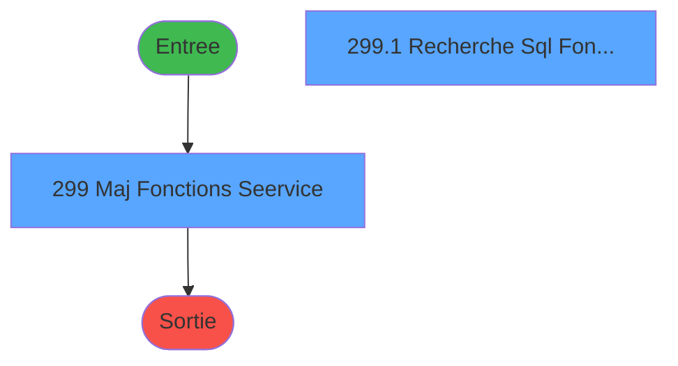
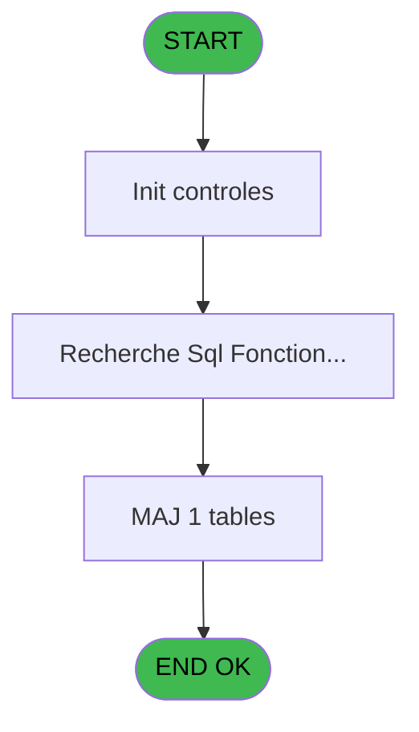

# PBG IDE 299 - Maj Fonctions / Service

> **Analyse**: Phases 1-4 2026-02-03 10:57 -> 10:57 (20s) | Assemblage 10:58
> **Pipeline**: V7.2 Enrichi
> **Structure**: 4 onglets (Resume | Ecrans | Donnees | Connexions)

<!-- TAB:Resume -->

## 1. FICHE D'IDENTITE

| Attribut | Valeur |
|----------|--------|
| Projet | PBG |
| IDE Position | 299 |
| Nom Programme | Maj Fonctions / Service |
| Fichier source | `Prg_299.xml` |
| Dossier IDE | General |
| Taches | 2 (2 ecrans visibles) |
| Tables modifiees | 1 |
| Programmes appeles | 0 |
| :warning: Statut | **ORPHELIN_POTENTIEL** |

## 2. DESCRIPTION FONCTIONNELLE

**Maj Fonctions / Service** assure la gestion complete de ce processus.

Le flux de traitement s'organise en **2 blocs fonctionnels** :

- **Consultation** (1 tache) : ecrans de recherche, selection et consultation
- **Traitement** (1 tache) : traitements metier divers

**Donnees modifiees** : 1 tables en ecriture (special_offers).

Detail : phases du traitement

#### Phase 1 : Traitement (1 tache)

- **299** - Maj Fonctions / Seervice **[[ECRAN]](#ecran-t2)**

#### Phase 2 : Consultation (1 tache)

- **299.1** - Recherche Sql Fonction/Service **[[ECRAN]](#ecran-t140)**

#### Tables impactees

| Table | Operations | Role metier |
|-------|-----------|-------------|
| special_offers | **W** (1 usages) |  |

## 3. BLOCS FONCTIONNELS

### 3.1 Traitement (1 tache)

Traitements internes.

---

#### 299 - Maj Fonctions / Seervice [[ECRAN]](#ecran-t2)

**Role** : Traitement : Maj Fonctions / Seervice.
**Ecran** : 1226 x 457 DLU | [Voir mockup](#ecran-t2)

### 3.2 Consultation (1 tache)

Ecrans de recherche et consultation.

---

#### 299.1 - Recherche Sql Fonction/Service [[ECRAN]](#ecran-t140)

**Role** : Traitement : Recherche Sql Fonction/Service.
**Ecran** : 1218 x 195 DLU | [Voir mockup](#ecran-t140)

## 5. REGLES METIER

*(Aucune regle metier identifiee)*

## 6. CONTEXTE

- **Appele par**: (aucun)
- **Appelle**: 0 programmes | **Tables**: 2 (W:1 R:1 L:0) | **Taches**: 2 | **Expressions**: 8

<!-- TAB:Ecrans -->

## 8. ECRANS

### 8.1 Forms visibles (2 / 2)

| # | Position | Tache | Nom | Type | Largeur | Hauteur | Bloc |
|---|----------|-------|-----|------|---------|---------|------|
| 1 | 299.1 | 299 | Maj Fonctions / Seervice | Type0 | 1226 | 457 | Traitement |
| 2 | 299.1.1 | 299.1 | Recherche Sql Fonction/Service | Type0 | 1218 | 195 | Consultation |

### 8.2 Mockups Ecrans

---

#### 299.1 - Maj Fonctions / Seervice
**Tache** : [299](#t2) | **Type** : Type0 | **Dimensions** : 1226 x 457 DLU
**Bloc** : Traitement | **Titre IDE** : Maj Fonctions / Seervice

<!-- FORM-DATA:
{
    "width":  1226,
    "vFactor":  8,
    "type":  "Type0",
    "hFactor":  8,
    "controls":  [
                     {
                         "x":  5,
                         "type":  "table",
                         "var":  "",
                         "name":  "",
                         "titleH":  12,
                         "color":  "",
                         "w":  1125,
                         "y":  2,
                         "fmt":  "",
                         "parent":  null,
                         "text":  "",
                         "rowH":  13,
                         "h":  64,
                         "cols":  [
                                      {
                                          "title":  "imgo_sequence",
                                          "layer":  1,
                                          "w":  126
                                      },
                                      {
                                          "title":  "imgo_emploi",
                                          "layer":  2,
                                          "w":  354
                                      },
                                      {
                                          "title":  "imgo_service",
                                          "layer":  3,
                                          "w":  354
                                      }
                                  ],
                         "rows":  3
                     },
                     {
                         "x":  11,
                         "type":  "edit",
                         "var":  "",
                         "y":  17,
                         "w":  102,
                         "fmt":  "",
                         "name":  "imgo_sequence",
                         "h":  10,
                         "color":  "",
                         "text":  "",
                         "parent":  1
                     },
                     {
                         "x":  137,
                         "type":  "edit",
                         "var":  "",
                         "y":  17,
                         "w":  342,
                         "fmt":  "",
                         "name":  "imgo_emploi",
                         "h":  10,
                         "color":  "",
                         "text":  "",
                         "parent":  1
                     },
                     {
                         "x":  491,
                         "type":  "edit",
                         "var":  "",
                         "y":  17,
                         "w":  342,
                         "fmt":  "",
                         "name":  "imgo_service",
                         "h":  10,
                         "color":  "",
                         "text":  "",
                         "parent":  1
                     }
                 ],
    "taskId":  "299.1",
    "height":  457
}
-->

<strong>Champs : 3 champs</strong>

| Pos (x,y) | Nom | Variable | Type |
|-----------|-----|----------|------|
| 11,17 | imgo_sequence | - | edit |
| 137,17 | imgo_emploi | - | edit |
| 491,17 | imgo_service | - | edit |

---

#### 299.1.1 - Recherche Sql Fonction/Service
**Tache** : [299.1](#t140) | **Type** : Type0 | **Dimensions** : 1218 x 195 DLU
**Bloc** : Consultation | **Titre IDE** : Recherche Sql Fonction/Service

<!-- FORM-DATA:
{
    "width":  1218,
    "vFactor":  8,
    "type":  "Type0",
    "hFactor":  8,
    "controls":  [
                     {
                         "x":  18,
                         "type":  "table",
                         "var":  "",
                         "name":  "",
                         "titleH":  12,
                         "color":  "",
                         "w":  798,
                         "y":  10,
                         "fmt":  "",
                         "parent":  null,
                         "text":  "",
                         "rowH":  13,
                         "h":  168,
                         "cols":  [
                                      {
                                          "title":  "societe",
                                          "layer":  1,
                                          "w":  61
                                      },
                                      {
                                          "title":  "nom_de_table",
                                          "layer":  2,
                                          "w":  114
                                      },
                                      {
                                          "title":  "code_alpha6",
                                          "layer":  3,
                                          "w":  106
                                      },
                                      {
                                          "title":  "libelle_dix",
                                          "layer":  4,
                                          "w":  130
                                      },
                                      {
                                          "title":  "libelle_trente",
                                          "layer":  5,
                                          "w":  354
                                      }
                                  ],
                         "rows":  5
                     },
                     {
                         "x":  24,
                         "type":  "edit",
                         "var":  "",
                         "y":  25,
                         "w":  18,
                         "fmt":  "",
                         "name":  "societe",
                         "h":  10,
                         "color":  "",
                         "text":  "",
                         "parent":  14
                     },
                     {
                         "x":  85,
                         "type":  "edit",
                         "var":  "",
                         "y":  25,
                         "w":  74,
                         "fmt":  "",
                         "name":  "nom_de_table",
                         "h":  10,
                         "color":  "",
                         "text":  "",
                         "parent":  14
                     },
                     {
                         "x":  199,
                         "type":  "edit",
                         "var":  "",
                         "y":  25,
                         "w":  74,
                         "fmt":  "",
                         "name":  "code_alpha6",
                         "h":  10,
                         "color":  "",
                         "text":  "",
                         "parent":  14
                     },
                     {
                         "x":  305,
                         "type":  "edit",
                         "var":  "",
                         "y":  25,
                         "w":  118,
                         "fmt":  "",
                         "name":  "libelle_dix",
                         "h":  10,
                         "color":  "",
                         "text":  "",
                         "parent":  14
                     },
                     {
                         "x":  435,
                         "type":  "edit",
                         "var":  "",
                         "y":  25,
                         "w":  342,
                         "fmt":  "",
                         "name":  "libelle_trente",
                         "h":  10,
                         "color":  "",
                         "text":  "",
                         "parent":  14
                     },
                     {
                         "x":  725,
                         "type":  "edit",
                         "var":  "",
                         "y":  23,
                         "w":  467,
                         "fmt":  "",
                         "name":  "v EmploiReach",
                         "h":  10,
                         "color":  "",
                         "text":  "",
                         "parent":  null
                     }
                 ],
    "taskId":  "299.1.1",
    "height":  195
}
-->

<strong>Champs : 6 champs</strong>

| Pos (x,y) | Nom | Variable | Type |
|-----------|-----|----------|------|
| 24,25 | societe | - | edit |
| 85,25 | nom_de_table | - | edit |
| 199,25 | code_alpha6 | - | edit |
| 305,25 | libelle_dix | - | edit |
| 435,25 | libelle_trente | - | edit |
| 725,23 | v EmploiReach | - | edit |

## 9. NAVIGATION

### 9.1 Enchainement des ecrans

**Detail par enchainement :**

| Depuis | Action | Vers | Retour |
|--------|--------|------|--------|

### 9.3 Structure hierarchique (2 taches)

| Position | Tache | Type | Dimensions | Bloc |
|----------|-------|------|------------|------|
| **299.1** | [**Maj Fonctions / Seervice** (299)](#t2) [mockup](#ecran-t2) | - | 1226x457 | Traitement |
| **299.2** | [**Recherche Sql Fonction/Service** (299.1)](#t140) [mockup](#ecran-t140) | - | 1218x195 | Consultation |

### 9.4 Algorigramme

> **Legende**: Vert = START/END OK | Rouge = END KO | Bleu = Decisions
> *Algorigramme auto-genere. Utiliser `/algorigramme` pour une synthese metier detaillee.*

<!-- TAB:Donnees -->

## 10. TABLES

### Tables utilisees (2)

| ID | Nom | Description | Type | R | W | L | Usages |
|----|-----|-------------|------|---|---|---|--------|
| 117 | tables_services | Services / filieres | DB | R |   |   | 1 |
| 873 | special_offers |  | DB |   | **W** |   | 1 |

### Colonnes par table (1 / 2 tables avec colonnes identifiees)

Table 117 - tables_services (R) - 1 usages

| Lettre | Variable | Acces | Type |
|--------|----------|-------|------|
| A | nom_de_table trouvé | R | Unicode |
| B | libelle_trente trouvé | R | Unicode |

Table 873 - special_offers (**W**) - 1 usages

*Table utilisee uniquement en Link ou aucune colonne Real identifiee dans le DataView.*

## 11. VARIABLES

### 11.1 Variables de session (1)

Variables persistantes pendant toute la session.

| Lettre | Nom | Type | Usage dans |
|--------|-----|------|-----------|
| A | v EmploiReach | Alpha | - |

### 11.2 Autres (1)

Variables diverses.

| Lettre | Nom | Type | Usage dans |
|--------|-----|------|-----------|
| B | libelle_trente trouvé | Unicode | - |

## 12. EXPRESSIONS

**8 / 8 expressions decodees (100%)**

### 12.1 Repartition par type

| Type | Expressions | Regles |
|------|-------------|--------|
| CONSTANTE | 2 | 0 |
| CONDITION | 1 | 0 |
| OTHER | 2 | 0 |
| STRING | 2 | 0 |
| CONCATENATION | 1 | 0 |

### 12.2 Expressions cles par type

#### CONSTANTE (2 expressions)

| Type | IDE | Expression | Regle |
|------|-----|------------|-------|
| CONSTANTE | 6 | `'F'` | - |
| CONSTANTE | 4 | `'C'` | - |

#### CONDITION (1 expressions)

| Type | IDE | Expression | Regle |
|------|-----|------------|-------|
| CONDITION | 1 | `Counter(0)>1` | - |

#### OTHER (2 expressions)

| Type | IDE | Expression | Regle |
|------|-----|------------|-------|
| OTHER | 7 | `[P]` | - |
| OTHER | 3 | `[D]` | - |

#### STRING (2 expressions)

| Type | IDE | Expression | Regle |
|------|-----|------------|-------|
| STRING | 5 | `Trim([C])` | - |
| STRING | 2 | `RepStr ([D],ASCIIChr(039),ASCIIChr(039)&ASCIIChr(039))` | - |

#### CONCATENATION (1 expressions)

| Type | IDE | Expression | Regle |
|------|-----|------------|-------|
| CONCATENATION | 8 | `'%'&Trim({1,10})&'%'` | - |

<!-- TAB:Connexions -->

## 13. GRAPHE D'APPELS

### 13.1 Chaine depuis Main (Callers)

**Chemin**: (pas de callers directs)

### 13.2 Callers

| IDE | Nom Programme | Nb Appels |
|-----|---------------|-----------|
| - | (aucun) | - |

### 13.3 Callees (programmes appeles)

### 13.4 Detail Callees avec contexte

| IDE | Nom Programme | Appels | Contexte |
|-----|---------------|--------|----------|
| - | (aucun) | - | - |

## 14. RECOMMANDATIONS MIGRATION

### 14.1 Profil du programme

| Metrique | Valeur | Impact migration |
|----------|--------|-----------------|
| Lignes de logique | 30 | Programme compact |
| Expressions | 8 | Peu de logique |
| Tables WRITE | 1 | Impact faible |
| Sous-programmes | 0 | Peu de dependances |
| Ecrans visibles | 2 | Quelques ecrans |
| Code desactive | 0% (0 / 30) | Code sain |
| Regles metier | 0 | Pas de regle identifiee |

### 14.2 Plan de migration par bloc

#### Traitement (1 tache: 1 ecran, 0 traitement)

- **Strategie** : 1 composant(s) UI (Razor/React) avec formulaires et validation.
- Decomposer les taches en services unitaires testables.

#### Consultation (1 tache: 1 ecran, 0 traitement)

- **Strategie** : Composants de recherche/selection en modales.
- 1 ecran : Recherche Sql Fonction/Service

### 14.3 Dependances critiques

| Dependance | Type | Appels | Impact |
|------------|------|--------|--------|
| special_offers | Table WRITE (Database) | 1x | Schema + repository |

---
*Spec DETAILED generee par Pipeline V7.2 - 2026-02-03 10:58*
