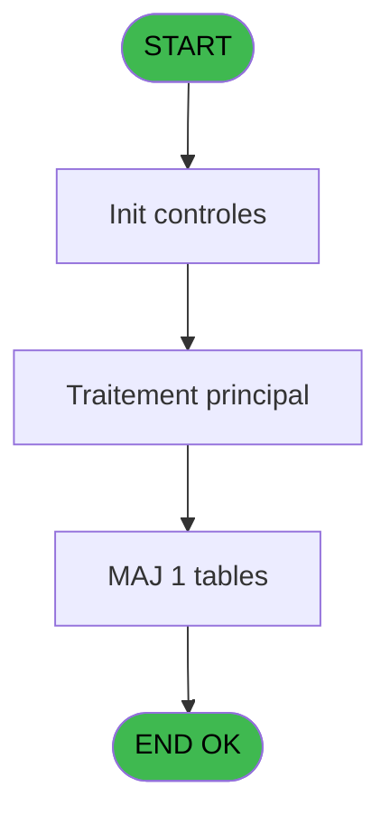
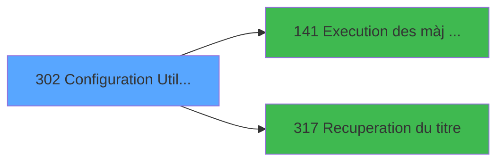

# PBG IDE 302 - Configuration Utilisateur

> **Analyse**: Phases 1-4 2026-02-03 10:59 -> 10:59 (22s) | Assemblage 10:59
> **Pipeline**: V7.2 Enrichi
> **Structure**: 4 onglets (Resume | Ecrans | Donnees | Connexions)

<!-- TAB:Resume -->

## 1. FICHE D'IDENTITE

| Attribut | Valeur |
|----------|--------|
| Projet | PBG |
| IDE Position | 302 |
| Nom Programme | Configuration Utilisateur |
| Fichier source | `Prg_302.xml` |
| Dossier IDE | General |
| Taches | 1 (1 ecrans visibles) |
| Tables modifiees | 1 |
| Programmes appeles | 2 |
| :warning: Statut | **ORPHELIN_POTENTIEL** |

## 2. DESCRIPTION FONCTIONNELLE

**Configuration Utilisateur** assure la gestion complete de ce processus.

Le flux de traitement s'organise en **1 blocs fonctionnels** :

- **Traitement** (1 tache) : traitements metier divers

**Donnees modifiees** : 1 tables en ecriture (table_utilisateurs).

**Logique metier** : 1 regles identifiees couvrant conditions metier.

## 3. BLOCS FONCTIONNELS

### 3.1 Traitement (1 tache)

Traitements internes.

---

#### 302 - Configuration Utilisateur [[ECRAN]](#ecran-t1)

**Role** : Traitement : Configuration Utilisateur.
**Ecran** : 549 x 145 DLU (Modal) | [Voir mockup](#ecran-t1)
**Delegue a** : [Execution des màj combo (IDE 141)](PBG-IDE-141.md), [Recuperation du titre (IDE 317)](PBG-IDE-317.md)

## 5. REGLES METIER

1 regles identifiees:

### Autres (1 regles)

#### [RM-001] Si [D]='F' alors 'Français' sinon 'Anglais')

| Element | Detail |
|---------|--------|
| **Condition** | `[D]='F'` |
| **Si vrai** | 'Français' |
| **Si faux** | 'Anglais') |
| **Expression source** | Expression 6 : `IF ([D]='F','Français','Anglais')` |
| **Exemple** | Si [D]='F' → 'Français'. Sinon → 'Anglais') |

## 6. CONTEXTE

- **Appele par**: (aucun)
- **Appelle**: 2 programmes | **Tables**: 1 (W:1 R:0 L:0) | **Taches**: 1 | **Expressions**: 9

<!-- TAB:Ecrans -->

## 8. ECRANS

### 8.1 Forms visibles (1 / 1)

| # | Position | Tache | Nom | Type | Largeur | Hauteur | Bloc |
|---|----------|-------|-----|------|---------|---------|------|
| 1 | 302 | 302 | Configuration Utilisateur | Modal | 549 | 145 | Traitement |

### 8.2 Mockups Ecrans

---

#### 302 - Configuration Utilisateur
**Tache** : [302](#t1) | **Type** : Modal | **Dimensions** : 549 x 145 DLU
**Bloc** : Traitement | **Titre IDE** : Configuration Utilisateur

<!-- FORM-DATA:
{
    "width":  549,
    "vFactor":  8,
    "type":  "Modal",
    "hFactor":  8,
    "controls":  [
                     {
                         "x":  0,
                         "type":  "label",
                         "var":  "",
                         "y":  2,
                         "w":  541,
                         "fmt":  "",
                         "name":  "",
                         "h":  20,
                         "color":  "1",
                         "text":  "",
                         "parent":  null
                     },
                     {
                         "x":  14,
                         "type":  "label",
                         "var":  "",
                         "y":  27,
                         "w":  306,
                         "fmt":  "",
                         "name":  "",
                         "h":  81,
                         "color":  "195",
                         "text":  "Utilisateur",
                         "parent":  null
                     },
                     {
                         "x":  344,
                         "type":  "label",
                         "var":  "",
                         "y":  30,
                         "w":  181,
                         "fmt":  "",
                         "name":  "",
                         "h":  78,
                         "color":  "1",
                         "text":  "",
                         "parent":  null
                     },
                     {
                         "x":  41,
                         "type":  "label",
                         "var":  "",
                         "y":  39,
                         "w":  82,
                         "fmt":  "",
                         "name":  "",
                         "h":  9,
                         "color":  "",
                         "text":  "Utilisateur",
                         "parent":  4
                     },
                     {
                         "x":  41,
                         "type":  "label",
                         "var":  "",
                         "y":  56,
                         "w":  82,
                         "fmt":  "",
                         "name":  "",
                         "h":  9,
                         "color":  "",
                         "text":  "Societe",
                         "parent":  4
                     },
                     {
                         "x":  41,
                         "type":  "label",
                         "var":  "",
                         "y":  73,
                         "w":  85,
                         "fmt":  "",
                         "name":  "",
                         "h":  8,
                         "color":  "",
                         "text":  "Langue",
                         "parent":  4
                     },
                     {
                         "x":  41,
                         "type":  "label",
                         "var":  "",
                         "y":  91,
                         "w":  115,
                         "fmt":  "",
                         "name":  "",
                         "h":  12,
                         "color":  "",
                         "text":  "Zone/Secteur",
                         "parent":  4
                     },
                     {
                         "x":  0,
                         "type":  "label",
                         "var":  "",
                         "y":  118,
                         "w":  538,
                         "fmt":  "",
                         "name":  "",
                         "h":  24,
                         "color":  "1",
                         "text":  "",
                         "parent":  null
                     },
                     {
                         "x":  162,
                         "type":  "edit",
                         "var":  "",
                         "y":  39,
                         "w":  123,
                         "fmt":  "",
                         "name":  "",
                         "h":  9,
                         "color":  "",
                         "text":  "",
                         "parent":  4
                     },
                     {
                         "x":  162,
                         "type":  "edit",
                         "var":  "",
                         "y":  56,
                         "w":  22,
                         "fmt":  "",
                         "name":  "",
                         "h":  9,
                         "color":  "",
                         "text":  "",
                         "parent":  4
                     },
                     {
                         "x":  162,
                         "type":  "combobox",
                         "var":  "",
                         "y":  91,
                         "w":  110,
                         "fmt":  "",
                         "name":  "",
                         "h":  12,
                         "color":  "7",
                         "text":  "Zone,Secteur",
                         "parent":  null
                     },
                     {
                         "x":  332,
                         "type":  "edit",
                         "var":  "",
                         "y":  8,
                         "w":  203,
                         "fmt":  "WWW DD MMM YYYYT",
                         "name":  "",
                         "h":  8,
                         "color":  "",
                         "text":  "",
                         "parent":  null
                     },
                     {
                         "x":  162,
                         "type":  "edit",
                         "var":  "",
                         "y":  73,
                         "w":  123,
                         "fmt":  "U10",
                         "name":  "",
                         "h":  9,
                         "color":  "",
                         "text":  "",
                         "parent":  4
                     },
                     {
                         "x":  357,
                         "type":  "button",
                         "var":  "",
                         "y":  37,
                         "w":  154,
                         "fmt":  "\u0026Visualisation",
                         "name":  "",
                         "h":  18,
                         "color":  "",
                         "text":  "",
                         "parent":  null
                     },
                     {
                         "x":  357,
                         "type":  "button",
                         "var":  "",
                         "y":  60,
                         "w":  154,
                         "fmt":  "\u0026Modification",
                         "name":  "",
                         "h":  18,
                         "color":  "",
                         "text":  "",
                         "parent":  null
                     },
                     {
                         "x":  357,
                         "type":  "button",
                         "var":  "",
                         "y":  83,
                         "w":  154,
                         "fmt":  "\u0026Annulation",
                         "name":  "",
                         "h":  18,
                         "color":  "",
                         "text":  "",
                         "parent":  null
                     },
                     {
                         "x":  10,
                         "type":  "button",
                         "var":  "",
                         "y":  121,
                         "w":  154,
                         "fmt":  "\u0026Quitter",
                         "name":  "",
                         "h":  18,
                         "color":  "",
                         "text":  "",
                         "parent":  null
                     },
                     {
                         "x":  11,
                         "type":  "edit",
                         "var":  "",
                         "y":  8,
                         "w":  267,
                         "fmt":  "20",
                         "name":  "",
                         "h":  8,
                         "color":  "",
                         "text":  "",
                         "parent":  null
                     }
                 ],
    "taskId":  "302",
    "height":  145
}
-->

<strong>Champs : 6 champs</strong>

| Pos (x,y) | Nom | Variable | Type |
|-----------|-----|----------|------|
| 162,39 | (sans nom) | - | edit |
| 162,56 | (sans nom) | - | edit |
| 162,91 | Zone,Secteur | - | combobox |
| 332,8 | WWW DD MMM YYYYT | - | edit |
| 162,73 | U10 | - | edit |
| 11,8 | 20 | - | edit |

<strong>Boutons : 4 boutons</strong>

| Bouton | Pos (x,y) | Action |
|--------|-----------|--------|
| Visualisation | 357,37 | Bouton fonctionnel |
| Modification | 357,60 | Modifie l'element |
| Annulation | 357,83 | Annule et retour au menu |
| Quitter | 10,121 | Quitte le programme |

## 9. NAVIGATION

Ecran unique: **Configuration Utilisateur**

### 9.3 Structure hierarchique (1 tache)

| Position | Tache | Type | Dimensions | Bloc |
|----------|-------|------|------------|------|
| **302.1** | [**Configuration Utilisateur** (302)](#t1) [mockup](#ecran-t1) | Modal | 549x145 | Traitement |

### 9.4 Algorigramme

> **Legende**: Vert = START/END OK | Rouge = END KO | Bleu = Decisions
> *Algorigramme auto-genere. Utiliser `/algorigramme` pour une synthese metier detaillee.*

<!-- TAB:Donnees -->

## 10. TABLES

### Tables utilisees (1)

| ID | Nom | Description | Type | R | W | L | Usages |
|----|-----|-------------|------|---|---|---|--------|
| 109 | table_utilisateurs |  | DB |   | **W** |   | 1 |

### Colonnes par table (0 / 1 tables avec colonnes identifiees)

Table 109 - table_utilisateurs (**W**) - 1 usages

*Table utilisee uniquement en Link ou aucune colonne Real identifiee dans le DataView.*

## 11. VARIABLES

*(Programme sans variables locales mappees)*

## 12. EXPRESSIONS

**9 / 9 expressions decodees (100%)**

### 12.1 Repartition par type

| Type | Expressions | Regles |
|------|-------------|--------|
| CONDITION | 1 | 5 |
| CONSTANTE | 1 | 0 |
| DATE | 1 | 0 |
| REFERENCE_VG | 2 | 0 |
| NEGATION | 1 | 0 |
| OTHER | 2 | 0 |
| STRING | 1 | 0 |

### 12.2 Expressions cles par type

#### CONDITION (1 expressions)

| Type | IDE | Expression | Regle |
|------|-----|------------|-------|
| CONDITION | 6 | `IF ([D]='F','Français','Anglais')` | [RM-001](#rm-RM-001) |

#### CONSTANTE (1 expressions)

| Type | IDE | Expression | Regle |
|------|-----|------------|-------|
| CONSTANTE | 1 | `16` | - |

#### DATE (1 expressions)

| Type | IDE | Expression | Regle |
|------|-----|------------|-------|
| DATE | 4 | `Date ()` | - |

#### REFERENCE_VG (2 expressions)

| Type | IDE | Expression | Regle |
|------|-----|------------|-------|
| REFERENCE_VG | 5 | `VG20` | - |
| REFERENCE_VG | 3 | `VG21` | - |

#### NEGATION (1 expressions)

| Type | IDE | Expression | Regle |
|------|-----|------------|-------|
| NEGATION | 7 | `NOT (Stat (0,'E'MODE))` | - |

#### OTHER (2 expressions)

| Type | IDE | Expression | Regle |
|------|-----|------------|-------|
| OTHER | 9 | `SetParam ('VERIF_USERB','N')` | - |
| OTHER | 8 | `Stat (0,'E'MODE)` | - |

#### STRING (1 expressions)

| Type | IDE | Expression | Regle |
|------|-----|------------|-------|
| STRING | 2 | `Trim (v.titre [A])` | - |

<!-- TAB:Connexions -->

## 13. GRAPHE D'APPELS

### 13.1 Chaine depuis Main (Callers)

**Chemin**: (pas de callers directs)

### 13.2 Callers

| IDE | Nom Programme | Nb Appels |
|-----|---------------|-----------|
| - | (aucun) | - |

### 13.3 Callees (programmes appeles)

### 13.4 Detail Callees avec contexte

| IDE | Nom Programme | Appels | Contexte |
|-----|---------------|--------|----------|
| [141](PBG-IDE-141.md) | Execution des màj combo | 1 | Sous-programme |
| [317](PBG-IDE-317.md) | Recuperation du titre | 1 | Recuperation donnees |

## 14. RECOMMANDATIONS MIGRATION

### 14.1 Profil du programme

| Metrique | Valeur | Impact migration |
|----------|--------|-----------------|
| Lignes de logique | 17 | Programme compact |
| Expressions | 9 | Peu de logique |
| Tables WRITE | 1 | Impact faible |
| Sous-programmes | 2 | Peu de dependances |
| Ecrans visibles | 1 | Ecran unique ou traitement batch |
| Code desactive | 0% (0 / 17) | Code sain |
| Regles metier | 1 | Quelques regles a preserver |

### 14.2 Plan de migration par bloc

#### Traitement (1 tache: 1 ecran, 0 traitement)

- **Strategie** : 1 composant(s) UI (Razor/React) avec formulaires et validation.
- 2 sous-programme(s) a migrer ou a reutiliser depuis les services existants.
- Decomposer les taches en services unitaires testables.

### 14.3 Dependances critiques

| Dependance | Type | Appels | Impact |
|------------|------|--------|--------|
| table_utilisateurs | Table WRITE (Database) | 1x | Schema + repository |
| [Recuperation du titre (IDE 317)](PBG-IDE-317.md) | Sous-programme | 1x | Normale - Recuperation donnees |
| [Execution des màj combo (IDE 141)](PBG-IDE-141.md) | Sous-programme | 1x | Normale - Sous-programme |

---
*Spec DETAILED generee par Pipeline V7.2 - 2026-02-03 10:59*
