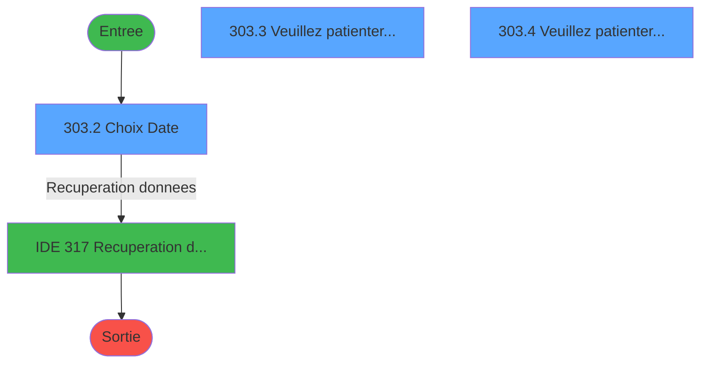
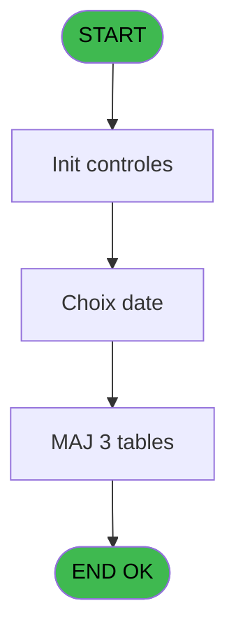
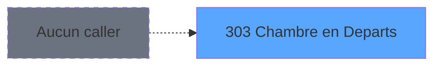
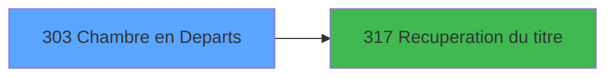

# PBG IDE 303 - Chambre en Departs

> **Analyse**: Phases 1-4 2026-02-03 10:59 -> 11:00 (23s) | Assemblage 11:00
> **Pipeline**: V7.2 Enrichi
> **Structure**: 4 onglets (Resume | Ecrans | Donnees | Connexions)

<!-- TAB:Resume -->

## 1. FICHE D'IDENTITE

| Attribut | Valeur |
|----------|--------|
| Projet | PBG |
| IDE Position | 303 |
| Nom Programme | Chambre en Departs |
| Fichier source | `Prg_303.xml` |
| Dossier IDE | General |
| Taches | 8 (3 ecrans visibles) |
| Tables modifiees | 3 |
| Programmes appeles | 1 |
| :warning: Statut | **ORPHELIN_POTENTIEL** |

## 2. DESCRIPTION FONCTIONNELLE

**Chambre en Departs** assure la gestion complete de ce processus.

Le flux de traitement s'organise en **4 blocs fonctionnels** :

- **Consultation** (3 taches) : ecrans de recherche, selection et consultation
- **Traitement** (3 taches) : traitements metier divers
- **Creation** (1 tache) : insertion d'enregistrements en base (mouvements, prestations)
- **Validation** (1 tache) : controles et verifications de coherence

**Donnees modifiees** : 3 tables en ecriture (historik_station, logement_go______lop, logement_client__loc).

**Logique metier** : 2 regles identifiees couvrant valeurs par defaut.

Detail : phases du traitement

#### Phase 1 : Traitement (3 taches)

- **303** - Logement Standard
- **303.3** - Veuillez patienter... **[[ECRAN]](#ecran-t4)**
- **303.4** - Veuillez patienter... **[[ECRAN]](#ecran-t6)**

Delegue a : [Recuperation du titre (IDE 317)](PBG-IDE-317.md)

#### Phase 2 : Validation (1 tache)

- **303.1** - Verification Logement

#### Phase 3 : Consultation (3 taches)

- **303.2** - Choix Date **[[ECRAN]](#ecran-t3)**
- **303.3.1** - Recherche si chambre en depart
- **303.4.1** - Recherche si chambre en depart

Delegue a : [Recuperation du titre (IDE 317)](PBG-IDE-317.md)

#### Phase 4 : Creation (1 tache)

- **303.5** - Creation Historique

#### Tables impactees

| Table | Operations | Role metier |
|-------|-----------|-------------|
| logement_client__loc | R/**W** (2 usages) |  |
| logement_go______lop | **W**/L (2 usages) |  |
| historik_station | **W** (1 usages) | Historique / journal |

## 3. BLOCS FONCTIONNELS

### 3.1 Traitement (3 taches)

Traitements internes.

---

#### 303 - Logement Standard

**Role** : Traitement : Logement Standard.
**Delegue a** : [Recuperation du titre (IDE 317)](PBG-IDE-317.md)

---

#### 303.3 - Veuillez patienter... [[ECRAN]](#ecran-t4)

**Role** : Traitement : Veuillez patienter....
**Ecran** : 422 x 56 DLU (MDI) | [Voir mockup](#ecran-t4)
**Delegue a** : [Recuperation du titre (IDE 317)](PBG-IDE-317.md)

---

#### 303.4 - Veuillez patienter... [[ECRAN]](#ecran-t6)

**Role** : Traitement : Veuillez patienter....
**Ecran** : 422 x 56 DLU (MDI) | [Voir mockup](#ecran-t6)
**Delegue a** : [Recuperation du titre (IDE 317)](PBG-IDE-317.md)

### 3.2 Validation (1 tache)

Controles de coherence : 1 tache verifie les donnees et conditions.

---

#### 303.1 - Verification Logement

**Role** : Verification : Verification Logement.

### 3.3 Consultation (3 taches)

Ecrans de recherche et consultation.

---

#### 303.2 - Choix Date [[ECRAN]](#ecran-t3)

**Role** : Selection par l'operateur : Choix Date.
**Ecran** : 530 x 111 DLU (MDI) | [Voir mockup](#ecran-t3)
**Variables liees** : E (W0 Date), A (P0-Choix Programme)

---

#### 303.3.1 - Recherche si chambre en depart

**Role** : Traitement : Recherche si chambre en depart.

---

#### 303.4.1 - Recherche si chambre en depart

**Role** : Traitement : Recherche si chambre en depart.

### 3.4 Creation (1 tache)

Insertion de nouveaux enregistrements en base.

---

#### 303.5 - Creation Historique

**Role** : Consultation/chargement : Creation Historique.

## 5. REGLES METIER

2 regles identifiees:

### Autres (2 regles)

#### [RM-001] Valeur par defaut si P0-Code Societe [B] est vide

| Element | Detail |
|---------|--------|
| **Condition** | `P0-Code Societe [B]=''` |
| **Si vrai** | 'C' |
| **Si faux** | P0-Code Societe [B]) |
| **Variables** | B (P0-Code Societe) |
| **Expression source** | Expression 3 : `IF (P0-Code Societe [B]='','C',P0-Code Societe [B])` |
| **Exemple** | Si P0-Code Societe [B]='' → 'C'. Sinon → P0-Code Societe [B]) |

#### [RM-002] Valeur par defaut si P0-Code Langue [C] est vide

| Element | Detail |
|---------|--------|
| **Condition** | `P0-Code Langue [C]=''` |
| **Si vrai** | 'F' |
| **Si faux** | P0-Code Langue [C]) |
| **Variables** | C (P0-Code Langue) |
| **Expression source** | Expression 4 : `IF (P0-Code Langue [C]='','F',P0-Code Langue [C])` |
| **Exemple** | Si P0-Code Langue [C]='' → 'F'. Sinon → P0-Code Langue [C]) |

## 6. CONTEXTE

- **Appele par**: (aucun)
- **Appelle**: 1 programmes | **Tables**: 4 (W:3 R:2 L:1) | **Taches**: 8 | **Expressions**: 6

<!-- TAB:Ecrans -->

## 8. ECRANS

### 8.1 Forms visibles (3 / 8)

| # | Position | Tache | Nom | Type | Largeur | Hauteur | Bloc |
|---|----------|-------|-----|------|---------|---------|------|
| 1 | 303.2 | 303.2 | Choix Date | MDI | 530 | 111 | Consultation |
| 2 | 303.3 | 303.3 | Veuillez patienter... | MDI | 422 | 56 | Traitement |
| 3 | 303.4 | 303.4 | Veuillez patienter... | MDI | 422 | 56 | Traitement |

### 8.2 Mockups Ecrans

---

#### 303.2 - Choix Date
**Tache** : [303.2](#t3) | **Type** : MDI | **Dimensions** : 530 x 111 DLU
**Bloc** : Consultation | **Titre IDE** : Choix Date

<!-- FORM-DATA:
{
    "width":  530,
    "vFactor":  8,
    "type":  "MDI",
    "hFactor":  8,
    "controls":  [
                     {
                         "x":  1,
                         "type":  "label",
                         "var":  "",
                         "y":  2,
                         "w":  523,
                         "fmt":  "",
                         "name":  "",
                         "h":  21,
                         "color":  "",
                         "text":  "",
                         "parent":  null
                     },
                     {
                         "x":  241,
                         "type":  "label",
                         "var":  "",
                         "y":  37,
                         "w":  258,
                         "fmt":  "",
                         "name":  "",
                         "h":  28,
                         "color":  "195",
                         "text":  "Date de depart.",
                         "parent":  null
                     },
                     {
                         "x":  0,
                         "type":  "label",
                         "var":  "",
                         "y":  83,
                         "w":  523,
                         "fmt":  "",
                         "name":  "",
                         "h":  24,
                         "color":  "",
                         "text":  "",
                         "parent":  null
                     },
                     {
                         "x":  281,
                         "type":  "edit",
                         "var":  "",
                         "y":  48,
                         "w":  123,
                         "fmt":  "DD/MM/YYYY",
                         "name":  "W1-Date",
                         "h":  9,
                         "color":  "110",
                         "text":  "",
                         "parent":  5
                     },
                     {
                         "x":  409,
                         "type":  "button",
                         "var":  "",
                         "y":  48,
                         "w":  26,
                         "fmt":  "...",
                         "name":  "W1bouton date",
                         "h":  9,
                         "color":  "",
                         "text":  "",
                         "parent":  5
                     },
                     {
                         "x":  8,
                         "type":  "button",
                         "var":  "",
                         "y":  86,
                         "w":  154,
                         "fmt":  "",
                         "name":  "W1-bouton valider",
                         "h":  18,
                         "color":  "",
                         "text":  "",
                         "parent":  null
                     },
                     {
                         "x":  315,
                         "type":  "edit",
                         "var":  "",
                         "y":  7,
                         "w":  203,
                         "fmt":  "WWW DD MMM YYYYT",
                         "name":  "",
                         "h":  8,
                         "color":  "",
                         "text":  "",
                         "parent":  null
                     },
                     {
                         "x":  11,
                         "type":  "edit",
                         "var":  "",
                         "y":  8,
                         "w":  267,
                         "fmt":  "20",
                         "name":  "",
                         "h":  8,
                         "color":  "",
                         "text":  "",
                         "parent":  null
                     },
                     {
                         "x":  35,
                         "type":  "image",
                         "var":  "",
                         "y":  26,
                         "w":  165,
                         "fmt":  "",
                         "name":  "",
                         "h":  52,
                         "color":  "",
                         "text":  "",
                         "parent":  null
                     },
                     {
                         "x":  359,
                         "type":  "button",
                         "var":  "",
                         "y":  86,
                         "w":  154,
                         "fmt":  "A\u0026bandonner",
                         "name":  "",
                         "h":  18,
                         "color":  "",
                         "text":  "",
                         "parent":  null
                     }
                 ],
    "taskId":  "303.2",
    "height":  111
}
-->

<strong>Champs : 3 champs</strong>

| Pos (x,y) | Nom | Variable | Type |
|-----------|-----|----------|------|
| 281,48 | W1-Date | - | edit |
| 315,7 | WWW DD MMM YYYYT | - | edit |
| 11,8 | 20 | - | edit |

<strong>Boutons : 3 boutons</strong>

| Bouton | Pos (x,y) | Action |
|--------|-----------|--------|
| ... | 409,48 | Bouton fonctionnel |
| W1-bouton valider | 8,86 | Valide la saisie et enregistre |
| Abandonner | 359,86 | Annule et retour au menu |

---

#### 303.3 - Veuillez patienter...
**Tache** : [303.3](#t4) | **Type** : MDI | **Dimensions** : 422 x 56 DLU
**Bloc** : Traitement | **Titre IDE** : Veuillez patienter...

<!-- FORM-DATA:
{
    "width":  422,
    "vFactor":  8,
    "type":  "MDI",
    "hFactor":  8,
    "controls":  [
                     {
                         "x":  0,
                         "type":  "label",
                         "var":  "",
                         "y":  0,
                         "w":  423,
                         "fmt":  "",
                         "name":  "",
                         "h":  29,
                         "color":  "",
                         "text":  "",
                         "parent":  null
                     },
                     {
                         "x":  78,
                         "type":  "label",
                         "var":  "",
                         "y":  10,
                         "w":  341,
                         "fmt":  "",
                         "name":  "",
                         "h":  8,
                         "color":  "7",
                         "text":  "Marquage chambres GM en cours ...",
                         "parent":  null
                     },
                     {
                         "x":  0,
                         "type":  "label",
                         "var":  "",
                         "y":  29,
                         "w":  423,
                         "fmt":  "",
                         "name":  "",
                         "h":  27,
                         "color":  "",
                         "text":  "",
                         "parent":  null
                     },
                     {
                         "x":  4,
                         "type":  "image",
                         "var":  "",
                         "y":  2,
                         "w":  72,
                         "fmt":  "",
                         "name":  "",
                         "h":  25,
                         "color":  "",
                         "text":  "",
                         "parent":  null
                     },
                     {
                         "x":  36,
                         "type":  "edit",
                         "var":  "",
                         "y":  37,
                         "w":  350,
                         "fmt":  "30",
                         "name":  "",
                         "h":  10,
                         "color":  "",
                         "text":  "",
                         "parent":  null
                     }
                 ],
    "taskId":  "303.3",
    "height":  56
}
-->

<strong>Champs : 1 champs</strong>

| Pos (x,y) | Nom | Variable | Type |
|-----------|-----|----------|------|
| 36,37 | 30 | - | edit |

---

#### 303.4 - Veuillez patienter...
**Tache** : [303.4](#t6) | **Type** : MDI | **Dimensions** : 422 x 56 DLU
**Bloc** : Traitement | **Titre IDE** : Veuillez patienter...

<!-- FORM-DATA:
{
    "width":  422,
    "vFactor":  8,
    "type":  "MDI",
    "hFactor":  8,
    "controls":  [
                     {
                         "x":  0,
                         "type":  "label",
                         "var":  "",
                         "y":  0,
                         "w":  423,
                         "fmt":  "",
                         "name":  "",
                         "h":  29,
                         "color":  "",
                         "text":  "",
                         "parent":  null
                     },
                     {
                         "x":  78,
                         "type":  "label",
                         "var":  "",
                         "y":  10,
                         "w":  341,
                         "fmt":  "",
                         "name":  "",
                         "h":  8,
                         "color":  "7",
                         "text":  "Marquage chambres GO en cours ...",
                         "parent":  null
                     },
                     {
                         "x":  0,
                         "type":  "label",
                         "var":  "",
                         "y":  29,
                         "w":  423,
                         "fmt":  "",
                         "name":  "",
                         "h":  27,
                         "color":  "",
                         "text":  "",
                         "parent":  null
                     },
                     {
                         "x":  4,
                         "type":  "image",
                         "var":  "",
                         "y":  2,
                         "w":  72,
                         "fmt":  "",
                         "name":  "",
                         "h":  25,
                         "color":  "",
                         "text":  "",
                         "parent":  null
                     },
                     {
                         "x":  36,
                         "type":  "edit",
                         "var":  "",
                         "y":  37,
                         "w":  350,
                         "fmt":  "30",
                         "name":  "",
                         "h":  10,
                         "color":  "",
                         "text":  "",
                         "parent":  null
                     }
                 ],
    "taskId":  "303.4",
    "height":  56
}
-->

<strong>Champs : 1 champs</strong>

| Pos (x,y) | Nom | Variable | Type |
|-----------|-----|----------|------|
| 36,37 | 30 | - | edit |

## 9. NAVIGATION

### 9.1 Enchainement des ecrans

**Detail par enchainement :**

| Depuis | Action | Vers | Retour |
|--------|--------|------|--------|
| Choix Date | Recuperation donnees | [Recuperation du titre (IDE 317)](PBG-IDE-317.md) | Retour ecran |

### 9.3 Structure hierarchique (8 taches)

| Position | Tache | Type | Dimensions | Bloc |
|----------|-------|------|------------|------|
| **303.1** | [**Logement Standard** (303)](#t1) | MDI | - | Traitement |
| 303.1.1 | [Veuillez patienter... (303.3)](#t4) [mockup](#ecran-t4) | MDI | 422x56 | |
| 303.1.2 | [Veuillez patienter... (303.4)](#t6) [mockup](#ecran-t6) | MDI | 422x56 | |
| **303.2** | [**Verification Logement** (303.1)](#t2) | MDI | - | Validation |
| **303.3** | [**Choix Date** (303.2)](#t3) [mockup](#ecran-t3) | MDI | 530x111 | Consultation |
| 303.3.1 | [Recherche si chambre en depart (303.3.1)](#t5) | MDI | - | |
| 303.3.2 | [Recherche si chambre en depart (303.4.1)](#t7) | MDI | - | |
| **303.4** | [**Creation Historique** (303.5)](#t8) | MDI | - | Creation |

### 9.4 Algorigramme

> **Legende**: Vert = START/END OK | Rouge = END KO | Bleu = Decisions
> *Algorigramme auto-genere. Utiliser `/algorigramme` pour une synthese metier detaillee.*

<!-- TAB:Donnees -->

## 10. TABLES

### Tables utilisees (4)

| ID | Nom | Description | Type | R | W | L | Usages |
|----|-----|-------------|------|---|---|---|--------|
| 34 | hebergement______heb | Hebergement (chambres) | DB | R |   |   | 2 |
| 88 | historik_station | Historique / journal | DB |   | **W** |   | 1 |
| 102 | logement_go______lop |  | DB |   | **W** | L | 2 |
| 103 | logement_client__loc |  | DB | R | **W** |   | 2 |

### Colonnes par table (1 / 4 tables avec colonnes identifiees)

Table 34 - hebergement______heb (R) - 2 usages

*Table utilisee uniquement en Link ou aucune colonne Real identifiee dans le DataView.*

Table 88 - historik_station (**W**) - 1 usages

*Table utilisee uniquement en Link ou aucune colonne Real identifiee dans le DataView.*

Table 102 - logement_go______lop (**W**/L) - 2 usages

*Table utilisee uniquement en Link ou aucune colonne Real identifiee dans le DataView.*

Table 103 - logement_client__loc (R/**W**) - 2 usages

| Lettre | Variable | Acces | Type |
|--------|----------|-------|------|
| A | W1-Code Retour GM | W | Numeric |
| B | W1-Code Retour GO | W | Numeric |

## 11. VARIABLES

### 11.1 Variables de travail (1)

Variables internes au programme.

| Lettre | Nom | Type | Usage dans |
|--------|-----|------|-----------|
| E | W0 Date | Date | - |

### 11.2 Autres (4)

Variables diverses.

| Lettre | Nom | Type | Usage dans |
|--------|-----|------|-----------|
| A | P0-Choix Programme | Alpha | - |
| B | P0-Code Societe | Alpha | 1x refs |
| C | P0-Code Langue | Alpha | 1x refs |
| D | W0-Code Suite | Alpha | 1x refs |

## 12. EXPRESSIONS

**6 / 6 expressions decodees (100%)**

### 12.1 Repartition par type

| Type | Expressions | Regles |
|------|-------------|--------|
| CONDITION | 3 | 2 |
| OTHER | 2 | 0 |
| REFERENCE_VG | 1 | 0 |

### 12.2 Expressions cles par type

#### CONDITION (3 expressions)

| Type | IDE | Expression | Regle |
|------|-----|------------|-------|
| CONDITION | 4 | `IF (P0-Code Langue [C]='','F',P0-Code Langue [C])` | [RM-002](#rm-RM-002) |
| CONDITION | 3 | `IF (P0-Code Societe [B]='','C',P0-Code Societe [B])` | [RM-001](#rm-RM-001) |
| CONDITION | 5 | `W0-Code Suite [D]='O'` | - |

#### OTHER (2 expressions)

| Type | IDE | Expression | Regle |
|------|-----|------------|-------|
| OTHER | 2 | `GetParam ('LANGUE')` | - |
| OTHER | 1 | `GetParam ('SOCIETE')` | - |

#### REFERENCE_VG (1 expressions)

| Type | IDE | Expression | Regle |
|------|-----|------------|-------|
| REFERENCE_VG | 6 | `VG71` | - |

<!-- TAB:Connexions -->

## 13. GRAPHE D'APPELS

### 13.1 Chaine depuis Main (Callers)

**Chemin**: (pas de callers directs)

### 13.2 Callers

| IDE | Nom Programme | Nb Appels |
|-----|---------------|-----------|
| - | (aucun) | - |

### 13.3 Callees (programmes appeles)

### 13.4 Detail Callees avec contexte

| IDE | Nom Programme | Appels | Contexte |
|-----|---------------|--------|----------|
| [317](PBG-IDE-317.md) | Recuperation du titre | 1 | Recuperation donnees |

## 14. RECOMMANDATIONS MIGRATION

### 14.1 Profil du programme

| Metrique | Valeur | Impact migration |
|----------|--------|-----------------|
| Lignes de logique | 134 | Programme compact |
| Expressions | 6 | Peu de logique |
| Tables WRITE | 3 | Impact modere |
| Sous-programmes | 1 | Peu de dependances |
| Ecrans visibles | 3 | Quelques ecrans |
| Code desactive | 0% (0 / 134) | Code sain |
| Regles metier | 2 | Quelques regles a preserver |

### 14.2 Plan de migration par bloc

#### Traitement (3 taches: 2 ecrans, 1 traitement)

- **Strategie** : Orchestrateur avec 2 ecrans (Razor/React) et 1 traitements backend (services).
- Les ecrans deviennent des composants UI, les traitements invisibles deviennent des services injectables.
- 1 sous-programme(s) a migrer ou a reutiliser depuis les services existants.
- Decomposer les taches en services unitaires testables.

#### Validation (1 tache: 0 ecran, 1 traitement)

- **Strategie** : FluentValidation avec validators specifiques.
- Chaque tache de validation -> un validator injectable

#### Consultation (3 taches: 1 ecran, 2 traitements)

- **Strategie** : Composants de recherche/selection en modales.
- 1 ecran : Choix Date

#### Creation (1 tache: 0 ecran, 1 traitement)

- **Strategie** : Repository pattern avec Entity Framework Core.
- Insertion via `IRepository<T>.CreateAsync()`

### 14.3 Dependances critiques

| Dependance | Type | Appels | Impact |
|------------|------|--------|--------|
| historik_station | Table WRITE (Database) | 1x | Schema + repository |
| logement_go______lop | Table WRITE (Database) | 1x | Schema + repository |
| logement_client__loc | Table WRITE (Database) | 1x | Schema + repository |
| [Recuperation du titre (IDE 317)](PBG-IDE-317.md) | Sous-programme | 1x | Normale - Recuperation donnees |

---
*Spec DETAILED generee par Pipeline V7.2 - 2026-02-03 11:00*
