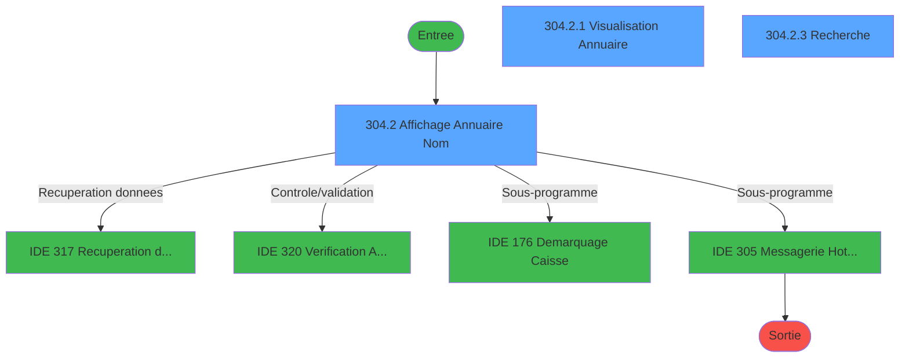
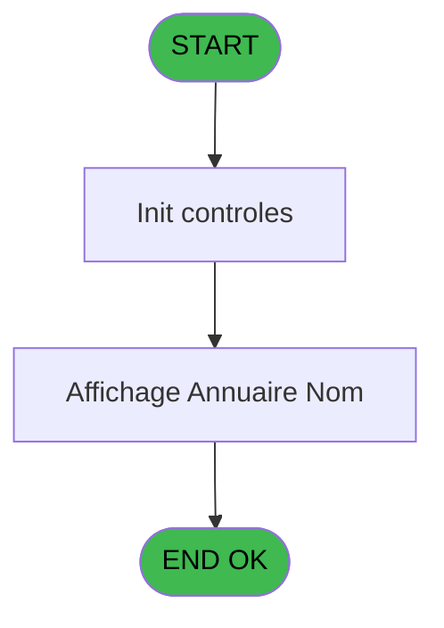
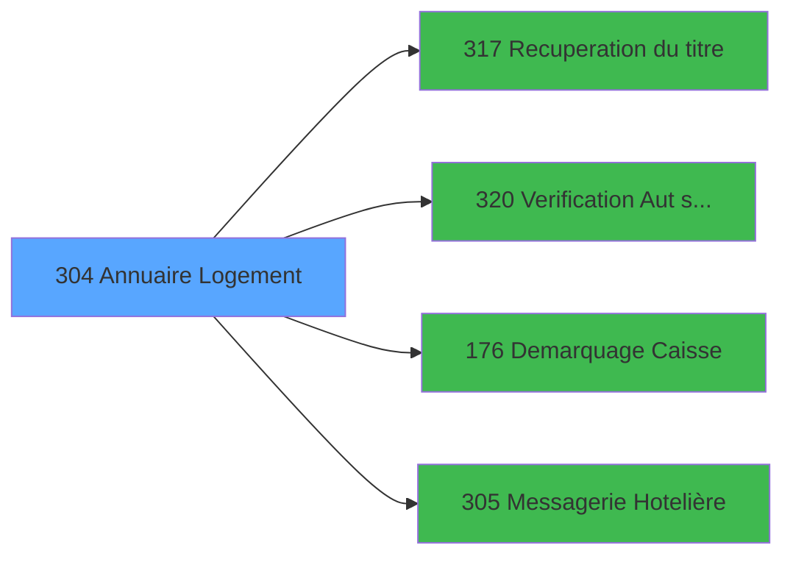

# PBG IDE 304 - Annuaire Logement

> **Analyse**: Phases 1-4 2026-02-03 11:00 -> 11:00 (22s) | Assemblage 11:00
> **Pipeline**: V7.2 Enrichi
> **Structure**: 4 onglets (Resume | Ecrans | Donnees | Connexions)

<!-- TAB:Resume -->

## 1. FICHE D'IDENTITE

| Attribut | Valeur |
|----------|--------|
| Projet | PBG |
| IDE Position | 304 |
| Nom Programme | Annuaire Logement |
| Fichier source | `Prg_304.xml` |
| Dossier IDE | General |
| Taches | 7 (3 ecrans visibles) |
| Tables modifiees | 0 |
| Programmes appeles | 4 |
| :warning: Statut | **ORPHELIN_POTENTIEL** |

## 2. DESCRIPTION FONCTIONNELLE

**Annuaire Logement** assure la gestion complete de ce processus.

Le flux de traitement s'organise en **3 blocs fonctionnels** :

- **Traitement** (4 taches) : traitements metier divers
- **Consultation** (2 taches) : ecrans de recherche, selection et consultation
- **Validation** (1 tache) : controles et verifications de coherence

**Logique metier** : 2 regles identifiees couvrant valeurs par defaut.

Detail : phases du traitement

#### Phase 1 : Traitement (4 taches)

- **304** - Annuaire Logement
- **304.2.1** - Visualisation Annuaire **[[ECRAN]](#ecran-t4)**
- **304.2.2** - Visualisation Messagerie
- **304.3** - Visualisation Messagerie

Delegue a : [Recuperation du titre (IDE 317)](PBG-IDE-317.md), [Demarquage Caisse (IDE 176)](PBG-IDE-176.md), [Messagerie Hotelière (IDE 305)](PBG-IDE-305.md)

#### Phase 2 : Validation (1 tache)

- **304.1** - Verification Annuaire

Delegue a : [Verification Aut sans ecran (IDE 320)](PBG-IDE-320.md)

#### Phase 3 : Consultation (2 taches)

- **304.2** - Affichage Annuaire Nom **[[ECRAN]](#ecran-t3)**
- **304.2.3** - Recherche **[[ECRAN]](#ecran-t7)**

Delegue a : [Recuperation du titre (IDE 317)](PBG-IDE-317.md)

## 3. BLOCS FONCTIONNELS

### 3.1 Traitement (4 taches)

Traitements internes.

---

#### 304 - Annuaire Logement

**Role** : Traitement : Annuaire Logement.

3 sous-taches directes

| Tache | Nom | Bloc |
|-------|-----|------|
| [304.2.1](#t4) | Visualisation Annuaire **[[ECRAN]](#ecran-t4)** | Traitement |
| [304.2.2](#t5) | Visualisation Messagerie | Traitement |
| [304.3](#t8) | Visualisation Messagerie | Traitement |

**Delegue a** : [Recuperation du titre (IDE 317)](PBG-IDE-317.md), [Demarquage Caisse (IDE 176)](PBG-IDE-176.md), [Messagerie Hotelière (IDE 305)](PBG-IDE-305.md)

---

#### 304.2.1 - Visualisation Annuaire [[ECRAN]](#ecran-t4)

**Role** : Traitement : Visualisation Annuaire.
**Ecran** : 517 x 55 DLU (Modal) | [Voir mockup](#ecran-t4)
**Delegue a** : [Recuperation du titre (IDE 317)](PBG-IDE-317.md), [Demarquage Caisse (IDE 176)](PBG-IDE-176.md), [Messagerie Hotelière (IDE 305)](PBG-IDE-305.md)

---

#### 304.2.2 - Visualisation Messagerie

**Role** : Traitement : Visualisation Messagerie.
**Delegue a** : [Recuperation du titre (IDE 317)](PBG-IDE-317.md), [Demarquage Caisse (IDE 176)](PBG-IDE-176.md), [Messagerie Hotelière (IDE 305)](PBG-IDE-305.md)

---

#### 304.3 - Visualisation Messagerie

**Role** : Traitement : Visualisation Messagerie.
**Delegue a** : [Recuperation du titre (IDE 317)](PBG-IDE-317.md), [Demarquage Caisse (IDE 176)](PBG-IDE-176.md), [Messagerie Hotelière (IDE 305)](PBG-IDE-305.md)

### 3.2 Validation (1 tache)

Controles de coherence : 1 tache verifie les donnees et conditions.

---

#### 304.1 - Verification Annuaire

**Role** : Verification : Verification Annuaire.
**Delegue a** : [Verification Aut sans ecran (IDE 320)](PBG-IDE-320.md)

### 3.3 Consultation (2 taches)

Ecrans de recherche et consultation.

---

#### 304.2 - Affichage Annuaire Nom [[ECRAN]](#ecran-t3)

**Role** : Reinitialisation : Affichage Annuaire Nom.
**Ecran** : 920 x 265 DLU (MDI) | [Voir mockup](#ecran-t3)

---

#### 304.2.3 - Recherche [[ECRAN]](#ecran-t7)

**Role** : Traitement : Recherche.
**Ecran** : 613 x 111 DLU (MDI) | [Voir mockup](#ecran-t7)
**Variables liees** : I (W0-Nom Recherche), J (W0-Prenom Recherche)

## 5. REGLES METIER

2 regles identifiees:

### Autres (2 regles)

#### [RM-001] Valeur par defaut si P0-Code Societe [B] est vide

| Element | Detail |
|---------|--------|
| **Condition** | `P0-Code Societe [B]=''` |
| **Si vrai** | 'C' |
| **Si faux** | P0-Code Societe [B]) |
| **Variables** | B (P0-Code Societe) |
| **Expression source** | Expression 8 : `IF (P0-Code Societe [B]='','C',P0-Code Societe [B])` |
| **Exemple** | Si P0-Code Societe [B]='' → 'C'. Sinon → P0-Code Societe [B]) |

#### [RM-002] Valeur par defaut si P0-Code Langue [C] est vide

| Element | Detail |
|---------|--------|
| **Condition** | `P0-Code Langue [C]=''` |
| **Si vrai** | 'F' |
| **Si faux** | P0-Code Langue [C]) |
| **Variables** | C (P0-Code Langue) |
| **Expression source** | Expression 9 : `IF (P0-Code Langue [C]='','F',P0-Code Langue [C])` |
| **Exemple** | Si P0-Code Langue [C]='' → 'F'. Sinon → P0-Code Langue [C]) |

## 6. CONTEXTE

- **Appele par**: (aucun)
- **Appelle**: 4 programmes | **Tables**: 8 (W:0 R:3 L:7) | **Taches**: 7 | **Expressions**: 22

<!-- TAB:Ecrans -->

## 8. ECRANS

### 8.1 Forms visibles (3 / 7)

| # | Position | Tache | Nom | Type | Largeur | Hauteur | Bloc |
|---|----------|-------|-----|------|---------|---------|------|
| 1 | 304.2 | 304.2 | Affichage Annuaire Nom | MDI | 920 | 265 | Consultation |
| 2 | 304.2.1 | 304.2.1 | Visualisation Annuaire | Modal | 517 | 55 | Traitement |
| 3 | 304.2.3 | 304.2.3 | Recherche | MDI | 613 | 111 | Consultation |

### 8.2 Mockups Ecrans

---

#### 304.2 - Affichage Annuaire Nom
**Tache** : [304.2](#t3) | **Type** : MDI | **Dimensions** : 920 x 265 DLU
**Bloc** : Consultation | **Titre IDE** : Affichage Annuaire Nom

<!-- FORM-DATA:
{
    "width":  920,
    "vFactor":  8,
    "type":  "MDI",
    "hFactor":  8,
    "controls":  [
                     {
                         "x":  0,
                         "type":  "label",
                         "var":  "",
                         "y":  1,
                         "w":  914,
                         "fmt":  "",
                         "name":  "",
                         "h":  21,
                         "color":  "",
                         "text":  "",
                         "parent":  null
                     },
                     {
                         "x":  379,
                         "type":  "label",
                         "var":  "",
                         "y":  26,
                         "w":  533,
                         "fmt":  "",
                         "name":  "",
                         "h":  94,
                         "color":  "195",
                         "text":  "Renseignements",
                         "parent":  null
                     },
                     {
                         "x":  7,
                         "type":  "table",
                         "var":  "",
                         "name":  "",
                         "titleH":  14,
                         "color":  "110",
                         "w":  369,
                         "y":  29,
                         "fmt":  "",
                         "parent":  null,
                         "text":  "",
                         "rowH":  12,
                         "h":  198,
                         "cols":  [
                                      {
                                          "title":  "Nom",
                                          "layer":  1,
                                          "w":  216
                                      },
                                      {
                                          "title":  "Prénom",
                                          "layer":  2,
                                          "w":  117
                                      }
                                  ],
                         "rows":  2
                     },
                     {
                         "x":  11,
                         "type":  "label",
                         "var":  "",
                         "y":  46,
                         "w":  26,
                         "fmt":  "",
                         "name":  "",
                         "h":  8,
                         "color":  "149",
                         "text":  "*",
                         "parent":  5
                     },
                     {
                         "x":  383,
                         "type":  "label",
                         "var":  "",
                         "y":  72,
                         "w":  93,
                         "fmt":  "",
                         "name":  "",
                         "h":  9,
                         "color":  "",
                         "text":  "Prénom",
                         "parent":  4
                     },
                     {
                         "x":  383,
                         "type":  "label",
                         "var":  "",
                         "y":  83,
                         "w":  42,
                         "fmt":  "",
                         "name":  "",
                         "h":  9,
                         "color":  "",
                         "text":  "Titre",
                         "parent":  4
                     },
                     {
                         "x":  565,
                         "type":  "label",
                         "var":  "",
                         "y":  83,
                         "w":  61,
                         "fmt":  "",
                         "name":  "",
                         "h":  9,
                         "color":  "",
                         "text":  "Qualité",
                         "parent":  4
                     },
                     {
                         "x":  383,
                         "type":  "label",
                         "var":  "",
                         "y":  94,
                         "w":  145,
                         "fmt":  "",
                         "name":  "",
                         "h":  9,
                         "color":  "",
                         "text":  "Date Début",
                         "parent":  4
                     },
                     {
                         "x":  659,
                         "type":  "label",
                         "var":  "",
                         "y":  94,
                         "w":  96,
                         "fmt":  "",
                         "name":  "",
                         "h":  9,
                         "color":  "",
                         "text":  "Date Fin",
                         "parent":  4
                     },
                     {
                         "x":  383,
                         "type":  "label",
                         "var":  "",
                         "y":  105,
                         "w":  95,
                         "fmt":  "",
                         "name":  "",
                         "h":  9,
                         "color":  "",
                         "text":  "Pays",
                         "parent":  4
                     },
                     {
                         "x":  659,
                         "type":  "label",
                         "var":  "",
                         "y":  105,
                         "w":  38,
                         "fmt":  "",
                         "name":  "",
                         "h":  9,
                         "color":  "",
                         "text":  "Age",
                         "parent":  4
                     },
                     {
                         "x":  379,
                         "type":  "label",
                         "var":  "",
                         "y":  120,
                         "w":  533,
                         "fmt":  "",
                         "name":  "",
                         "h":  42,
                         "color":  "195",
                         "text":  "Adresse",
                         "parent":  null
                     },
                     {
                         "x":  379,
                         "type":  "label",
                         "var":  "",
                         "y":  163,
                         "w":  533,
                         "fmt":  "",
                         "name":  "",
                         "h":  68,
                         "color":  "195",
                         "text":  "Hebergements",
                         "parent":  null
                     },
                     {
                         "x":  0,
                         "type":  "label",
                         "var":  "",
                         "y":  239,
                         "w":  914,
                         "fmt":  "",
                         "name":  "",
                         "h":  24,
                         "color":  "",
                         "text":  "",
                         "parent":  null
                     },
                     {
                         "x":  42,
                         "type":  "edit",
                         "var":  "",
                         "y":  45,
                         "w":  176,
                         "fmt":  "",
                         "name":  "VAL Nom",
                         "h":  8,
                         "color":  "110",
                         "text":  "",
                         "parent":  5
                     },
                     {
                         "x":  226,
                         "type":  "edit",
                         "var":  "",
                         "y":  45,
                         "w":  109,
                         "fmt":  "UX8",
                         "name":  "VAL Prenom",
                         "h":  8,
                         "color":  "6",
                         "text":  "",
                         "parent":  5
                     },
                     {
                         "x":  526,
                         "type":  "edit",
                         "var":  "",
                         "y":  83,
                         "w":  34,
                         "fmt":  "",
                         "name":  "",
                         "h":  9,
                         "color":  "",
                         "text":  "",
                         "parent":  4
                     },
                     {
                         "x":  531,
                         "type":  "edit",
                         "var":  "",
                         "y":  94,
                         "w":  123,
                         "fmt":  "",
                         "name":  "",
                         "h":  9,
                         "color":  "",
                         "text":  "",
                         "parent":  4
                     },
                     {
                         "x":  755,
                         "type":  "edit",
                         "var":  "",
                         "y":  94,
                         "w":  123,
                         "fmt":  "",
                         "name":  "",
                         "h":  9,
                         "color":  "",
                         "text":  "",
                         "parent":  4
                     },
                     {
                         "x":  531,
                         "type":  "edit",
                         "var":  "",
                         "y":  106,
                         "w":  34,
                         "fmt":  "",
                         "name":  "",
                         "h":  9,
                         "color":  "",
                         "text":  "",
                         "parent":  4
                     },
                     {
                         "x":  410,
                         "type":  "edit",
                         "var":  "",
                         "y":  140,
                         "w":  400,
                         "fmt":  "",
                         "name":  "",
                         "h":  8,
                         "color":  "",
                         "text":  "",
                         "parent":  30
                     },
                     {
                         "x":  410,
                         "type":  "edit",
                         "var":  "",
                         "y":  150,
                         "w":  120,
                         "fmt":  "",
                         "name":  "",
                         "h":  8,
                         "color":  "",
                         "text":  "",
                         "parent":  30
                     },
                     {
                         "x":  410,
                         "type":  "edit",
                         "var":  "",
                         "y":  129,
                         "w":  120,
                         "fmt":  "",
                         "name":  "",
                         "h":  8,
                         "color":  "",
                         "text":  "",
                         "parent":  30
                     },
                     {
                         "x":  536,
                         "type":  "edit",
                         "var":  "",
                         "y":  129,
                         "w":  344,
                         "fmt":  "",
                         "name":  "",
                         "h":  8,
                         "color":  "",
                         "text":  "",
                         "parent":  30
                     },
                     {
                         "x":  536,
                         "type":  "edit",
                         "var":  "",
                         "y":  150,
                         "w":  344,
                         "fmt":  "",
                         "name":  "",
                         "h":  8,
                         "color":  "",
                         "text":  "",
                         "parent":  30
                     },
                     {
                         "x":  395,
                         "type":  "edit",
                         "var":  "",
                         "y":  40,
                         "w":  23,
                         "fmt":  "",
                         "name":  "V.Code fidelisation",
                         "h":  8,
                         "color":  "164",
                         "text":  "",
                         "parent":  4
                     },
                     {
                         "x":  434,
                         "type":  "edit",
                         "var":  "",
                         "y":  40,
                         "w":  200,
                         "fmt":  "",
                         "name":  "V.Libelle fidelisation",
                         "h":  8,
                         "color":  "164",
                         "text":  "",
                         "parent":  4
                     },
                     {
                         "x":  578,
                         "type":  "button",
                         "var":  "",
                         "y":  242,
                         "w":  154,
                         "fmt":  "\u0026Recherche",
                         "name":  "W1-bouton rech nom",
                         "h":  18,
                         "color":  "",
                         "text":  "",
                         "parent":  37
                     },
                     {
                         "x":  748,
                         "type":  "button",
                         "var":  "",
                         "y":  242,
                         "w":  154,
                         "fmt":  "\u0026Message",
                         "name":  "W1-bouton message",
                         "h":  18,
                         "color":  "",
                         "text":  "",
                         "parent":  37
                     },
                     {
                         "x":  412,
                         "type":  "button",
                         "var":  "",
                         "y":  242,
                         "w":  154,
                         "fmt":  "20",
                         "name":  "W1-bouton Hebergement",
                         "h":  18,
                         "color":  "",
                         "text":  "",
                         "parent":  37
                     },
                     {
                         "x":  8,
                         "type":  "button",
                         "var":  "",
                         "y":  242,
                         "w":  154,
                         "fmt":  "\u0026Quitter",
                         "name":  "W1-bouton quitter",
                         "h":  18,
                         "color":  "",
                         "text":  "",
                         "parent":  37
                     },
                     {
                         "x":  6,
                         "type":  "edit",
                         "var":  "",
                         "y":  7,
                         "w":  267,
                         "fmt":  "20",
                         "name":  "",
                         "h":  8,
                         "color":  "",
                         "text":  "",
                         "parent":  null
                     },
                     {
                         "x":  543,
                         "type":  "edit",
                         "var":  "",
                         "y":  7,
                         "w":  363,
                         "fmt":  "WWW DD MMM YYYYT",
                         "name":  "",
                         "h":  7,
                         "color":  "",
                         "text":  "",
                         "parent":  null
                     },
                     {
                         "x":  662,
                         "type":  "image",
                         "var":  "",
                         "y":  32,
                         "w":  157,
                         "fmt":  "",
                         "name":  "",
                         "h":  41,
                         "color":  "7",
                         "text":  "",
                         "parent":  4
                     },
                     {
                         "x":  395,
                         "type":  "edit",
                         "var":  "",
                         "y":  61,
                         "w":  203,
                         "fmt":  "U15",
                         "name":  "",
                         "h":  8,
                         "color":  "",
                         "text":  "",
                         "parent":  4
                     },
                     {
                         "x":  526,
                         "type":  "edit",
                         "var":  "",
                         "y":  73,
                         "w":  222,
                         "fmt":  "UX9",
                         "name":  "",
                         "h":  9,
                         "color":  "",
                         "text":  "",
                         "parent":  4
                     },
                     {
                         "x":  757,
                         "type":  "edit",
                         "var":  "",
                         "y":  73,
                         "w":  53,
                         "fmt":  "U4",
                         "name":  "",
                         "h":  9,
                         "color":  "",
                         "text":  "",
                         "parent":  4
                     },
                     {
                         "x":  830,
                         "type":  "edit",
                         "var":  "",
                         "y":  73,
                         "w":  75,
                         "fmt":  "U6",
                         "name":  "",
                         "h":  9,
                         "color":  "",
                         "text":  "",
                         "parent":  4
                     },
                     {
                         "x":  631,
                         "type":  "edit",
                         "var":  "",
                         "y":  83,
                         "w":  123,
                         "fmt":  "10",
                         "name":  "",
                         "h":  9,
                         "color":  "",
                         "text":  "",
                         "parent":  4
                     },
                     {
                         "x":  755,
                         "type":  "edit",
                         "var":  "",
                         "y":  83,
                         "w":  101,
                         "fmt":  "U8",
                         "name":  "",
                         "h":  9,
                         "color":  "",
                         "text":  "",
                         "parent":  4
                     },
                     {
                         "x":  755,
                         "type":  "edit",
                         "var":  "",
                         "y":  104,
                         "w":  34,
                         "fmt":  "#2Z",
                         "name":  "",
                         "h":  9,
                         "color":  "",
                         "text":  "",
                         "parent":  4
                     },
                     {
                         "x":  384,
                         "type":  "subform",
                         "var":  "",
                         "y":  171,
                         "w":  522,
                         "fmt":  "",
                         "name":  "Visualisation Annuaire",
                         "h":  57,
                         "color":  "",
                         "text":  "",
                         "parent":  36
                     }
                 ],
    "taskId":  "304.2",
    "height":  265
}
-->

<strong>Champs : 22 champs</strong>

| Pos (x,y) | Nom | Variable | Type |
|-----------|-----|----------|------|
| 42,45 | VAL Nom | - | edit |
| 226,45 | VAL Prenom | - | edit |
| 526,83 | (sans nom) | - | edit |
| 531,94 | (sans nom) | - | edit |
| 755,94 | (sans nom) | - | edit |
| 531,106 | (sans nom) | - | edit |
| 410,140 | (sans nom) | - | edit |
| 410,150 | (sans nom) | - | edit |
| 410,129 | (sans nom) | - | edit |
| 536,129 | (sans nom) | - | edit |
| 536,150 | (sans nom) | - | edit |
| 395,40 | V.Code fidelisation | - | edit |
| 434,40 | V.Libelle fidelisation | - | edit |
| 6,7 | 20 | - | edit |
| 543,7 | WWW DD MMM YYYYT | - | edit |
| 395,61 | U15 | - | edit |
| 526,73 | UX9 | - | edit |
| 757,73 | U4 | - | edit |
| 830,73 | U6 | - | edit |
| 631,83 | 10 | - | edit |
| 755,83 | U8 | - | edit |
| 755,104 | #2Z | - | edit |

<strong>Boutons : 4 boutons</strong>

| Bouton | Pos (x,y) | Action |
|--------|-----------|--------|
| Recherche | 578,242 | Ouvre la selection |
| Message | 748,242 | Appel [Messagerie Hotelière (IDE 305)](PBG-IDE-305.md) |
| 20 | 412,242 | Bouton fonctionnel |
| Quitter | 8,242 | Quitte le programme |

---

#### 304.2.1 - Visualisation Annuaire
**Tache** : [304.2.1](#t4) | **Type** : Modal | **Dimensions** : 517 x 55 DLU
**Bloc** : Traitement | **Titre IDE** : Visualisation Annuaire

<!-- FORM-DATA:
{
    "width":  517,
    "vFactor":  8,
    "type":  "Modal",
    "hFactor":  8,
    "controls":  [
                     {
                         "x":  0,
                         "type":  "table",
                         "var":  "",
                         "name":  "",
                         "titleH":  12,
                         "color":  "110",
                         "w":  514,
                         "y":  1,
                         "fmt":  "",
                         "parent":  null,
                         "text":  "",
                         "rowH":  12,
                         "h":  52,
                         "cols":  [
                                      {
                                          "title":  "Début",
                                          "layer":  1,
                                          "w":  155
                                      },
                                      {
                                          "title":  "Fin",
                                          "layer":  2,
                                          "w":  158
                                      },
                                      {
                                          "title":  "Log",
                                          "layer":  3,
                                          "w":  85
                                      },
                                      {
                                          "title":  "Poste",
                                          "layer":  4,
                                          "w":  80
                                      }
                                  ],
                         "rows":  4
                     },
                     {
                         "x":  6,
                         "type":  "edit",
                         "var":  "",
                         "y":  15,
                         "w":  104,
                         "fmt":  "",
                         "name":  "",
                         "h":  8,
                         "color":  "110",
                         "text":  "",
                         "parent":  1
                     },
                     {
                         "x":  115,
                         "type":  "edit",
                         "var":  "",
                         "y":  15,
                         "w":  37,
                         "fmt":  "U2h",
                         "name":  "",
                         "h":  8,
                         "color":  "110",
                         "text":  "",
                         "parent":  1
                     },
                     {
                         "x":  162,
                         "type":  "edit",
                         "var":  "",
                         "y":  15,
                         "w":  104,
                         "fmt":  "",
                         "name":  "",
                         "h":  8,
                         "color":  "110",
                         "text":  "",
                         "parent":  1
                     },
                     {
                         "x":  270,
                         "type":  "edit",
                         "var":  "",
                         "y":  15,
                         "w":  39,
                         "fmt":  "U2h",
                         "name":  "",
                         "h":  8,
                         "color":  "110",
                         "text":  "",
                         "parent":  1
                     },
                     {
                         "x":  320,
                         "type":  "edit",
                         "var":  "",
                         "y":  15,
                         "w":  75,
                         "fmt":  "",
                         "name":  "",
                         "h":  8,
                         "color":  "110",
                         "text":  "",
                         "parent":  1
                     },
                     {
                         "x":  405,
                         "type":  "edit",
                         "var":  "",
                         "y":  15,
                         "w":  75,
                         "fmt":  "",
                         "name":  "",
                         "h":  8,
                         "color":  "110",
                         "text":  "",
                         "parent":  1
                     }
                 ],
    "taskId":  "304.2.1",
    "height":  55
}
-->

<strong>Champs : 6 champs</strong>

| Pos (x,y) | Nom | Variable | Type |
|-----------|-----|----------|------|
| 6,15 | (sans nom) | - | edit |
| 115,15 | U2h | - | edit |
| 162,15 | (sans nom) | - | edit |
| 270,15 | U2h | - | edit |
| 320,15 | (sans nom) | - | edit |
| 405,15 | (sans nom) | - | edit |

---

#### 304.2.3 - Recherche
**Tache** : [304.2.3](#t7) | **Type** : MDI | **Dimensions** : 613 x 111 DLU
**Bloc** : Consultation | **Titre IDE** : Recherche

<!-- FORM-DATA:
{
    "width":  613,
    "vFactor":  8,
    "type":  "MDI",
    "hFactor":  8,
    "controls":  [
                     {
                         "x":  0,
                         "type":  "label",
                         "var":  "",
                         "y":  1,
                         "w":  610,
                         "fmt":  "",
                         "name":  "",
                         "h":  19,
                         "color":  "",
                         "text":  "",
                         "parent":  null
                     },
                     {
                         "x":  175,
                         "type":  "label",
                         "var":  "",
                         "y":  34,
                         "w":  418,
                         "fmt":  "",
                         "name":  "",
                         "h":  37,
                         "color":  "",
                         "text":  "",
                         "parent":  null
                     },
                     {
                         "x":  178,
                         "type":  "label",
                         "var":  "",
                         "y":  35,
                         "w":  412,
                         "fmt":  "",
                         "name":  "",
                         "h":  35,
                         "color":  "",
                         "text":  "",
                         "parent":  null
                     },
                     {
                         "x":  195,
                         "type":  "label",
                         "var":  "",
                         "y":  49,
                         "w":  288,
                         "fmt":  "",
                         "name":  "",
                         "h":  8,
                         "color":  "",
                         "text":  "Entrer les premières lettres du prenom",
                         "parent":  null
                     },
                     {
                         "x":  195,
                         "type":  "label",
                         "var":  "",
                         "y":  49,
                         "w":  272,
                         "fmt":  "",
                         "name":  "",
                         "h":  8,
                         "color":  "",
                         "text":  "Entrer les premières lettres du nom",
                         "parent":  6
                     },
                     {
                         "x":  0,
                         "type":  "label",
                         "var":  "",
                         "y":  85,
                         "w":  609,
                         "fmt":  "",
                         "name":  "",
                         "h":  24,
                         "color":  "",
                         "text":  "",
                         "parent":  null
                     },
                     {
                         "x":  489,
                         "type":  "edit",
                         "var":  "",
                         "y":  49,
                         "w":  93,
                         "fmt":  "U7",
                         "name":  "",
                         "h":  10,
                         "color":  "110",
                         "text":  "",
                         "parent":  6
                     },
                     {
                         "x":  321,
                         "type":  "edit",
                         "var":  "",
                         "y":  6,
                         "w":  203,
                         "fmt":  "WWW DD MMM YYYYT",
                         "name":  "",
                         "h":  8,
                         "color":  "",
                         "text":  "",
                         "parent":  null
                     },
                     {
                         "x":  4,
                         "type":  "image",
                         "var":  "",
                         "y":  23,
                         "w":  154,
                         "fmt":  "",
                         "name":  "",
                         "h":  59,
                         "color":  "",
                         "text":  "",
                         "parent":  null
                     },
                     {
                         "x":  7,
                         "type":  "button",
                         "var":  "",
                         "y":  88,
                         "w":  154,
                         "fmt":  "\u0026Valider",
                         "name":  "",
                         "h":  18,
                         "color":  "",
                         "text":  "",
                         "parent":  null
                     },
                     {
                         "x":  448,
                         "type":  "button",
                         "var":  "",
                         "y":  88,
                         "w":  154,
                         "fmt":  "\u0026Abandonner",
                         "name":  "",
                         "h":  18,
                         "color":  "",
                         "text":  "",
                         "parent":  null
                     },
                     {
                         "x":  5,
                         "type":  "edit",
                         "var":  "",
                         "y":  6,
                         "w":  267,
                         "fmt":  "20",
                         "name":  "",
                         "h":  8,
                         "color":  "",
                         "text":  "",
                         "parent":  null
                     }
                 ],
    "taskId":  "304.2.3",
    "height":  111
}
-->

<strong>Champs : 3 champs</strong>

| Pos (x,y) | Nom | Variable | Type |
|-----------|-----|----------|------|
| 489,49 | U7 | - | edit |
| 321,6 | WWW DD MMM YYYYT | - | edit |
| 5,6 | 20 | - | edit |

<strong>Boutons : 2 boutons</strong>

| Bouton | Pos (x,y) | Action |
|--------|-----------|--------|
| Valider | 7,88 | Valide la saisie et enregistre |
| Abandonner | 448,88 | Annule et retour au menu |

## 9. NAVIGATION

### 9.1 Enchainement des ecrans

**Detail par enchainement :**

| Depuis | Action | Vers | Retour |
|--------|--------|------|--------|
| Affichage Annuaire Nom | Recuperation donnees | [Recuperation du titre (IDE 317)](PBG-IDE-317.md) | Retour ecran |
| Affichage Annuaire Nom | Controle/validation | [Verification Aut sans ecran (IDE 320)](PBG-IDE-320.md) | Retour ecran |
| Affichage Annuaire Nom | Sous-programme | [Demarquage Caisse (IDE 176)](PBG-IDE-176.md) | Retour ecran |
| Affichage Annuaire Nom | Sous-programme | [Messagerie Hotelière (IDE 305)](PBG-IDE-305.md) | Retour ecran |

### 9.3 Structure hierarchique (7 taches)

| Position | Tache | Type | Dimensions | Bloc |
|----------|-------|------|------------|------|
| **304.1** | [**Annuaire Logement** (304)](#t1) | MDI | - | Traitement |
| 304.1.1 | [Visualisation Annuaire (304.2.1)](#t4) [mockup](#ecran-t4) | Modal | 517x55 | |
| 304.1.2 | [Visualisation Messagerie (304.2.2)](#t5) | MDI | - | |
| 304.1.3 | [Visualisation Messagerie (304.3)](#t8) | MDI | - | |
| **304.2** | [**Verification Annuaire** (304.1)](#t2) | MDI | - | Validation |
| **304.3** | [**Affichage Annuaire Nom** (304.2)](#t3) [mockup](#ecran-t3) | MDI | 920x265 | Consultation |
| 304.3.1 | [Recherche (304.2.3)](#t7) [mockup](#ecran-t7) | MDI | 613x111 | |

### 9.4 Algorigramme

> **Legende**: Vert = START/END OK | Rouge = END KO | Bleu = Decisions
> *Algorigramme auto-genere. Utiliser `/algorigramme` pour une synthese metier detaillee.*

<!-- TAB:Donnees -->

## 10. TABLES

### Tables utilisees (8)

| ID | Nom | Description | Type | R | W | L | Usages |
|----|-----|-------------|------|---|---|---|--------|
| 30 | gm-recherche_____gmr | Index de recherche | DB | R |   |   | 1 |
| 31 | gm-complet_______gmc |  | DB |   |   | L | 1 |
| 34 | hebergement______heb | Hebergement (chambres) | DB | R |   | L | 2 |
| 104 | fichier_menage |  | DB |   |   | L | 2 |
| 131 | fichier_validation |  | DB | R |   | L | 2 |
| 358 | import_mod |  | DB |   |   | L | 1 |
| 738 | pv_selling_unit |  | DB |   |   | L | 1 |
| 846 | stat_lieu_vente | Statistiques point de vente | TMP |   |   | L | 1 |

### Colonnes par table (2 / 3 tables avec colonnes identifiees)

Table 30 - gm-recherche_____gmr (R) - 1 usages

| Lettre | Variable | Acces | Type |
|--------|----------|-------|------|
| A | W1-Fin de Tache | R | Alpha |
| B | W1-Selection Choix | R | Alpha |
| C | W1-Date/Heure | R | Numeric |
| D | V.Code fidelisation | R | Alpha |
| E | V.Libelle fidelisation | R | Alpha |
| F | V.Couleur fidelisation | R | Numeric |
| G | W1-bouton rech nom | R | Alpha |
| H | Autorisation messagerie | R | Alpha |
| I | W1-bouton message | R | Alpha |
| J | W1-bouton Hebergement | R | Alpha |
| K | W1-bouton quitter | R | Alpha |
| L | v. titre | R | Alpha |

Table 34 - hebergement______heb (R/L) - 2 usages

| Lettre | Variable | Acces | Type |
|--------|----------|-------|------|
| A | P.Numero compte | R | Numeric |
| B | P.Filiation compte | R | Numeric |

Table 131 - fichier_validation (R/L) - 2 usages

*Table utilisee uniquement en Link ou aucune colonne Real identifiee dans le DataView.*

## 11. VARIABLES

### 11.1 Parametres entrants (1)

Variables recues en parametre.

| Lettre | Nom | Type | Usage dans |
|--------|-----|------|-----------|
| D | P0 Front/Back | Alpha | - |

### 11.2 Variables de travail (2)

Variables internes au programme.

| Lettre | Nom | Type | Usage dans |
|--------|-----|------|-----------|
| R | W0 Code 19 | Alpha | - |
| S | W0 date / time | Numeric | - |

### 11.3 Autres (16)

Variables diverses.

| Lettre | Nom | Type | Usage dans |
|--------|-----|------|-----------|
| A | P0-Choix Programme | Alpha | - |
| B | P0-Code Societe | Alpha | 1x refs |
| C | P0-Code Langue | Alpha | 1x refs |
| E | W0-valeur Tri | Numeric | 1x refs |
| F | W0-Fin de Tache | Alpha | 1x refs |
| G | W0-Accord Suite | Alpha | 4x refs |
| H | W0-Code Tri | Alpha | - |
| I | W0-Nom Recherche | Alpha | - |
| J | W0-Prenom Recherche | Alpha | - |
| K | W0-Societe | Alpha | - |
| L | W0-Numero Compte | Numeric | - |
| M | W0-Filiation Compte | Numeric | - |
| N | W0-Code F003 | Alpha | - |
| O | W0-Code F008 | Alpha | - |
| P | W0-Code F011 | Alpha | - |
| Q | W0-Code F025 | Alpha | - |

Toutes les 19 variables (liste complete)

| Cat | Lettre | Nom Variable | Type |
|-----|--------|--------------|------|
| P0 | **D** | P0 Front/Back | Alpha |
| W0 | **R** | W0 Code 19 | Alpha |
| W0 | **S** | W0 date / time | Numeric |
| Autre | **A** | P0-Choix Programme | Alpha |
| Autre | **B** | P0-Code Societe | Alpha |
| Autre | **C** | P0-Code Langue | Alpha |
| Autre | **E** | W0-valeur Tri | Numeric |
| Autre | **F** | W0-Fin de Tache | Alpha |
| Autre | **G** | W0-Accord Suite | Alpha |
| Autre | **H** | W0-Code Tri | Alpha |
| Autre | **I** | W0-Nom Recherche | Alpha |
| Autre | **J** | W0-Prenom Recherche | Alpha |
| Autre | **K** | W0-Societe | Alpha |
| Autre | **L** | W0-Numero Compte | Numeric |
| Autre | **M** | W0-Filiation Compte | Numeric |
| Autre | **N** | W0-Code F003 | Alpha |
| Autre | **O** | W0-Code F008 | Alpha |
| Autre | **P** | W0-Code F011 | Alpha |
| Autre | **Q** | W0-Code F025 | Alpha |

## 12. EXPRESSIONS

**22 / 22 expressions decodees (100%)**

### 12.1 Repartition par type

| Type | Expressions | Regles |
|------|-------------|--------|
| CONDITION | 8 | 2 |
| CONSTANTE | 10 | 0 |
| DATE | 1 | 0 |
| OTHER | 3 | 0 |

### 12.2 Expressions cles par type

#### CONDITION (8 expressions)

| Type | IDE | Expression | Regle |
|------|-----|------------|-------|
| CONDITION | 9 | `IF (P0-Code Langue [C]='','F',P0-Code Langue [C])` | [RM-002](#rm-RM-002) |
| CONDITION | 8 | `IF (P0-Code Societe [B]='','C',P0-Code Societe [B])` | [RM-001](#rm-RM-001) |
| CONDITION | 13 | `W0-Accord Suite [G]='N'` | - |
| CONDITION | 14 | `W0-Accord Suite [G]='O'` | - |
| CONDITION | 15 | `W0-Accord Suite [G]='M'` | - |
| ... | | *+3 autres* | |

#### CONSTANTE (10 expressions)

| Type | IDE | Expression | Regle |
|------|-----|------------|-------|
| CONSTANTE | 18 | `'F011'` | - |
| CONSTANTE | 17 | `'F008'` | - |
| CONSTANTE | 19 | `'F025'` | - |
| CONSTANTE | 21 | `'F'` | - |
| CONSTANTE | 20 | `'19'` | - |
| ... | | *+5 autres* | |

#### DATE (1 expressions)

| Type | IDE | Expression | Regle |
|------|-----|------------|-------|
| DATE | 22 | `Date ()*100+Hour (Time ())` | - |

#### OTHER (3 expressions)

| Type | IDE | Expression | Regle |
|------|-----|------------|-------|
| OTHER | 5 | `GetParam ('FRONT')` | - |
| OTHER | 4 | `GetParam ('LANGUE')` | - |
| OTHER | 3 | `GetParam ('SOCIETE')` | - |

### 12.3 Toutes les expressions (22)

Voir les 22 expressions

#### CONDITION (8)

| IDE | Expression Decodee |
|-----|-------------------|
| 8 | `IF (P0-Code Societe [B]='','C',P0-Code Societe [B])` |
| 9 | `IF (P0-Code Langue [C]='','F',P0-Code Langue [C])` |
| 1 | `W0-valeur Tri [E]=0` |
| 6 | `W0-Fin de Tache [F]='F'` |
| 12 | `W0-Accord Suite [G]=''` |
| 13 | `W0-Accord Suite [G]='N'` |
| 14 | `W0-Accord Suite [G]='O'` |
| 15 | `W0-Accord Suite [G]='M'` |

#### CONSTANTE (10)

| IDE | Expression Decodee |
|-----|-------------------|
| 2 | `2` |
| 7 | `''` |
| 10 | `'N'` |
| 11 | `'/'` |
| 16 | `'F003'` |
| 17 | `'F008'` |
| 18 | `'F011'` |
| 19 | `'F025'` |
| 20 | `'19'` |
| 21 | `'F'` |

#### DATE (1)

| IDE | Expression Decodee |
|-----|-------------------|
| 22 | `Date ()*100+Hour (Time ())` |

#### OTHER (3)

| IDE | Expression Decodee |
|-----|-------------------|
| 3 | `GetParam ('SOCIETE')` |
| 4 | `GetParam ('LANGUE')` |
| 5 | `GetParam ('FRONT')` |

<!-- TAB:Connexions -->

## 13. GRAPHE D'APPELS

### 13.1 Chaine depuis Main (Callers)

**Chemin**: (pas de callers directs)

### 13.2 Callers

| IDE | Nom Programme | Nb Appels |
|-----|---------------|-----------|
| - | (aucun) | - |

### 13.3 Callees (programmes appeles)

### 13.4 Detail Callees avec contexte

| IDE | Nom Programme | Appels | Contexte |
|-----|---------------|--------|----------|
| [317](PBG-IDE-317.md) | Recuperation du titre | 2 | Recuperation donnees |
| [320](PBG-IDE-320.md) | Verification Aut sans ecran | 2 | Controle/validation |
| [176](PBG-IDE-176.md) | Demarquage Caisse | 1 | Sous-programme |
| [305](PBG-IDE-305.md) | Messagerie Hotelière | 1 | Sous-programme |

## 14. RECOMMANDATIONS MIGRATION

### 14.1 Profil du programme

| Metrique | Valeur | Impact migration |
|----------|--------|-----------------|
| Lignes de logique | 212 | Taille moyenne |
| Expressions | 22 | Peu de logique |
| Tables WRITE | 0 | Impact faible |
| Sous-programmes | 4 | Peu de dependances |
| Ecrans visibles | 3 | Quelques ecrans |
| Code desactive | 0% (0 / 212) | Code sain |
| Regles metier | 2 | Quelques regles a preserver |

### 14.2 Plan de migration par bloc

#### Traitement (4 taches: 1 ecran, 3 traitements)

- **Strategie** : Orchestrateur avec 1 ecrans (Razor/React) et 3 traitements backend (services).
- Les ecrans deviennent des composants UI, les traitements invisibles deviennent des services injectables.
- 4 sous-programme(s) a migrer ou a reutiliser depuis les services existants.
- Decomposer les taches en services unitaires testables.

#### Validation (1 tache: 0 ecran, 1 traitement)

- **Strategie** : FluentValidation avec validators specifiques.
- Chaque tache de validation -> un validator injectable

#### Consultation (2 taches: 2 ecrans, 0 traitement)

- **Strategie** : Composants de recherche/selection en modales.
- 2 ecrans : Affichage Annuaire Nom, Recherche

### 14.3 Dependances critiques

| Dependance | Type | Appels | Impact |
|------------|------|--------|--------|
| [Verification Aut sans ecran (IDE 320)](PBG-IDE-320.md) | Sous-programme | 2x | Haute - Controle/validation |
| [Recuperation du titre (IDE 317)](PBG-IDE-317.md) | Sous-programme | 2x | Haute - Recuperation donnees |
| [Messagerie Hotelière (IDE 305)](PBG-IDE-305.md) | Sous-programme | 1x | Normale - Sous-programme |
| [Demarquage Caisse (IDE 176)](PBG-IDE-176.md) | Sous-programme | 1x | Normale - Sous-programme |

---
*Spec DETAILED generee par Pipeline V7.2 - 2026-02-03 11:00*
