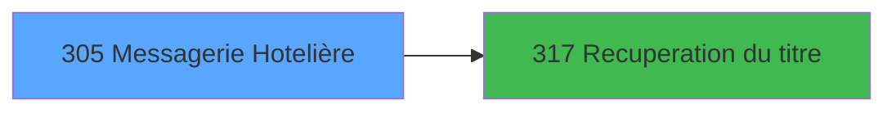

# PBG IDE 305 - Messagerie Hotelière

> **Analyse**: Phases 1-4 2026-02-03 11:00 -> 11:01 (21s) | Assemblage 11:01
> **Pipeline**: V7.2 Enrichi
> **Structure**: 4 onglets (Resume | Ecrans | Donnees | Connexions)

<!-- TAB:Resume -->

## 1. FICHE D'IDENTITE

| Attribut | Valeur |
|----------|--------|
| Projet | PBG |
| IDE Position | 305 |
| Nom Programme | Messagerie Hotelière |
| Fichier source | `Prg_305.xml` |
| Dossier IDE | General |
| Taches | 26 (2 ecrans visibles) |
| Tables modifiees | 5 |
| Programmes appeles | 1 |

## 2. DESCRIPTION FONCTIONNELLE

**Messagerie Hotelière** assure la gestion complete de ce processus, accessible depuis [Annuaire Logement (IDE 304)](PBG-IDE-304.md).

Le flux de traitement s'organise en **6 blocs fonctionnels** :

- **Creation** (9 taches) : insertion d'enregistrements en base (mouvements, prestations)
- **Traitement** (9 taches) : traitements metier divers
- **Validation** (5 taches) : controles et verifications de coherence
- **Calcul** (1 tache) : calculs de montants, stocks ou compteurs
- **Saisie** (1 tache) : ecrans de saisie utilisateur (formulaires, champs, donnees)
- **Consultation** (1 tache) : ecrans de recherche, selection et consultation

**Donnees modifiees** : 5 tables en ecriture (compteurs________cpt, historik_station, fichier_messagerie, fichier_validation, fichier_echanges).

Detail : phases du traitement

#### Phase 1 : Traitement (9 taches)

- **305** - Messagerie Hotelière **[[ECRAN]](#ecran-t1)**
- **305.1** - Lecture paramètres TEL
- **305.4** - Lecture Messagerie
- **305.4.1** - Marquage Lecture
- **305.4.3.1.1** - Recuperation Personne
- **305.4.3.1.3** - Confirmation Message **[[ECRAN]](#ecran-t12)**
- **305.4.3.1.4** - Confirmation Message **[[ECRAN]](#ecran-t13)**
- **305.4.4** - Effaçage Batch
- **305.4.4.2** - Marquage Messagerie

Delegue a : [Recuperation du titre (IDE 317)](PBG-IDE-317.md)

#### Phase 2 : Validation (5 taches)

- **305.2** - Verification Messagerie
- **305.3** - Verification Messagerie
- **305.4.2** - Verification Messagerie
- **305.4.3.1.5.4** - Mise à Jour Validation
- **305.4.4.3** - Mise à Jour Validation

#### Phase 3 : Consultation (1 tache)

- **305.4.3** - Affichage Message **[[ECRAN]](#ecran-t8)**

Delegue a : [Recuperation du titre (IDE 317)](PBG-IDE-317.md)

#### Phase 4 : Creation (9 taches)

- **305.4.3.1** - Creation Messagerie
- **305.4.3.1.5** - Creation Batch
- **305.4.3.1.5.2** - Creation Messagerie
- **305.4.3.1.5.3** - Creation Historique
- **305.4.3.1.5.5** - Creation Echange v1
- **305.4.4.1** - Creation Historique
- **305.4.4.4** - Creation Echange v1
- **305.4.3.1.5.6** - Creation Echange v1
- **305.4.4.5** - Creation Echange v1

#### Phase 5 : Saisie (1 tache)

- **305.4.3.1.2** - Saisie du message (Creation) **[[ECRAN]](#ecran-t11)**

#### Phase 6 : Calcul (1 tache)

- **305.4.3.1.5.1** - Compteur Numero

#### Tables impactees

| Table | Operations | Role metier |
|-------|-----------|-------------|
| fichier_messagerie | R/**W** (7 usages) |  |
| fichier_echanges | **W** (4 usages) |  |
| fichier_validation | R/**W** (3 usages) |  |
| historik_station | **W**/L (3 usages) | Historique / journal |
| compteurs________cpt | **W** (1 usages) | Comptes GM (generaux) |

## 3. BLOCS FONCTIONNELS

### 3.1 Traitement (9 taches)

Traitements internes.

---

#### 305 - Messagerie Hotelière [[ECRAN]](#ecran-t1)

**Role** : Tache d'orchestration : point d'entree du programme (9 sous-taches). Coordonne l'enchainement des traitements.
**Ecran** : 106 x 38 DLU (MDI) | [Voir mockup](#ecran-t1)

8 sous-taches directes

| Tache | Nom | Bloc |
|-------|-----|------|
| [305.1](#t2) | Lecture paramètres TEL | Traitement |
| [305.4](#t5) | Lecture Messagerie | Traitement |
| [305.4.1](#t6) | Marquage Lecture | Traitement |
| [305.4.3.1.1](#t10) | Recuperation Personne | Traitement |
| [305.4.3.1.3](#t12) | Confirmation Message **[[ECRAN]](#ecran-t12)** | Traitement |
| [305.4.3.1.4](#t13) | Confirmation Message **[[ECRAN]](#ecran-t13)** | Traitement |
| [305.4.4](#t26) | Effaçage Batch | Traitement |
| [305.4.4.2](#t28) | Marquage Messagerie | Traitement |

**Delegue a** : [Recuperation du titre (IDE 317)](PBG-IDE-317.md)

---

#### 305.1 - Lecture paramètres TEL

**Role** : Traitement : Lecture paramètres TEL.
**Delegue a** : [Recuperation du titre (IDE 317)](PBG-IDE-317.md)

---

#### 305.4 - Lecture Messagerie

**Role** : Traitement : Lecture Messagerie.
**Delegue a** : [Recuperation du titre (IDE 317)](PBG-IDE-317.md)

---

#### 305.4.1 - Marquage Lecture

**Role** : Traitement : Marquage Lecture.
**Delegue a** : [Recuperation du titre (IDE 317)](PBG-IDE-317.md)

---

#### 305.4.3.1.1 - Recuperation Personne

**Role** : Consultation/chargement : Recuperation Personne.
**Variables liees** : F (W0-Nom Personne), G (W0-Prenom Personne)
**Delegue a** : [Recuperation du titre (IDE 317)](PBG-IDE-317.md)

---

#### 305.4.3.1.3 - Confirmation Message [[ECRAN]](#ecran-t12)

**Role** : Traitement : Confirmation Message.
**Ecran** : 116 x 32 DLU (Modal) | [Voir mockup](#ecran-t12)
**Delegue a** : [Recuperation du titre (IDE 317)](PBG-IDE-317.md)

---

#### 305.4.3.1.4 - Confirmation Message [[ECRAN]](#ecran-t13)

**Role** : Traitement : Confirmation Message.
**Ecran** : 140 x 32 DLU (Modal) | [Voir mockup](#ecran-t13)
**Delegue a** : [Recuperation du titre (IDE 317)](PBG-IDE-317.md)

---

#### 305.4.4 - Effaçage Batch

**Role** : Traitement : Effaçage Batch.
**Delegue a** : [Recuperation du titre (IDE 317)](PBG-IDE-317.md)

---

#### 305.4.4.2 - Marquage Messagerie

**Role** : Traitement : Marquage Messagerie.
**Delegue a** : [Recuperation du titre (IDE 317)](PBG-IDE-317.md)

### 3.2 Validation (5 taches)

Controles de coherence : 5 taches verifient les donnees et conditions.

---

#### 305.2 - Verification Messagerie

**Role** : Verification : Verification Messagerie.

---

#### 305.3 - Verification Messagerie

**Role** : Verification : Verification Messagerie.

---

#### 305.4.2 - Verification Messagerie

**Role** : Verification : Verification Messagerie.

---

#### 305.4.3.1.5.4 - Mise à Jour Validation

**Role** : Verification : Mise à Jour Validation.

---

#### 305.4.4.3 - Mise à Jour Validation

**Role** : Verification : Mise à Jour Validation.

### 3.3 Consultation (1 tache)

Ecrans de recherche et consultation.

---

#### 305.4.3 - Affichage Message [[ECRAN]](#ecran-t8)

**Role** : Reinitialisation : Affichage Message.
**Ecran** : 915 x 223 DLU (MDI) | [Voir mockup](#ecran-t8)

### 3.4 Creation (9 taches)

Insertion de nouveaux enregistrements en base.

---

#### 305.4.3.1 - Creation Messagerie

**Role** : Creation d'enregistrement : Creation Messagerie.

---

#### 305.4.3.1.5 - Creation Batch

**Role** : Creation d'enregistrement : Creation Batch.

---

#### 305.4.3.1.5.2 - Creation Messagerie

**Role** : Creation d'enregistrement : Creation Messagerie.

---

#### 305.4.3.1.5.3 - Creation Historique

**Role** : Consultation/chargement : Creation Historique.

---

#### 305.4.3.1.5.5 - Creation Echange v1

**Role** : Creation d'enregistrement : Creation Echange v1.

---

#### 305.4.4.1 - Creation Historique

**Role** : Consultation/chargement : Creation Historique.

---

#### 305.4.4.4 - Creation Echange v1

**Role** : Creation d'enregistrement : Creation Echange v1.

---

#### 305.4.3.1.5.6 - Creation Echange v1

**Role** : Creation d'enregistrement : Creation Echange v1.

---

#### 305.4.4.5 - Creation Echange v1

**Role** : Creation d'enregistrement : Creation Echange v1.

### 3.5 Saisie (1 tache)

L'operateur saisit les donnees de la transaction via 1 ecran (Saisie du message (Creation)).

---

#### 305.4.3.1.2 - Saisie du message (Creation) [[ECRAN]](#ecran-t11)

**Role** : Saisie des donnees : Saisie du message (Creation).
**Ecran** : 629 x 114 DLU (MDI) | [Voir mockup](#ecran-t11)

### 3.6 Calcul (1 tache)

Calculs metier : montants, stocks, compteurs.

---

#### 305.4.3.1.5.1 - Compteur Numero

**Role** : Calcul : Compteur Numero.
**Variables liees** : B (P0-Numero Compte)

## 5. REGLES METIER

*(Aucune regle metier identifiee)*

## 6. CONTEXTE

- **Appele par**: [Annuaire Logement (IDE 304)](PBG-IDE-304.md)
- **Appelle**: 1 programmes | **Tables**: 8 (W:5 R:4 L:2) | **Taches**: 26 | **Expressions**: 4

<!-- TAB:Ecrans -->

## 8. ECRANS

### 8.1 Forms visibles (2 / 26)

| # | Position | Tache | Nom | Type | Largeur | Hauteur | Bloc |
|---|----------|-------|-----|------|---------|---------|------|
| 1 | 305.4.3 | 305.4.3 | Affichage Message | MDI | 915 | 223 | Consultation |
| 2 | 305.4.3.1.2 | 305.4.3.1.2 | Saisie du message (Creation) | MDI | 629 | 114 | Saisie |

### 8.2 Mockups Ecrans

---

#### 305.4.3 - Affichage Message
**Tache** : [305.4.3](#t8) | **Type** : MDI | **Dimensions** : 915 x 223 DLU
**Bloc** : Consultation | **Titre IDE** : Affichage Message

<!-- FORM-DATA:
{
    "width":  915,
    "vFactor":  8,
    "type":  "MDI",
    "hFactor":  8,
    "controls":  [
                     {
                         "x":  0,
                         "type":  "label",
                         "var":  "",
                         "y":  1,
                         "w":  914,
                         "fmt":  "",
                         "name":  "",
                         "h":  21,
                         "color":  "",
                         "text":  "",
                         "parent":  null
                     },
                     {
                         "x":  1,
                         "type":  "label",
                         "var":  "",
                         "y":  32,
                         "w":  913,
                         "fmt":  "",
                         "name":  "",
                         "h":  58,
                         "color":  "1",
                         "text":  "",
                         "parent":  null
                     },
                     {
                         "x":  238,
                         "type":  "label",
                         "var":  "",
                         "y":  48,
                         "w":  80,
                         "fmt":  "",
                         "name":  "",
                         "h":  9,
                         "color":  "",
                         "text":  "Nom",
                         "parent":  4
                     },
                     {
                         "x":  528,
                         "type":  "label",
                         "var":  "",
                         "y":  48,
                         "w":  85,
                         "fmt":  "",
                         "name":  "",
                         "h":  9,
                         "color":  "",
                         "text":  "Prenom",
                         "parent":  4
                     },
                     {
                         "x":  238,
                         "type":  "label",
                         "var":  "",
                         "y":  65,
                         "w":  110,
                         "fmt":  "",
                         "name":  "",
                         "h":  9,
                         "color":  "",
                         "text":  "Provenance",
                         "parent":  4
                     },
                     {
                         "x":  528,
                         "type":  "label",
                         "var":  "",
                         "y":  65,
                         "w":  79,
                         "fmt":  "",
                         "name":  "",
                         "h":  9,
                         "color":  "",
                         "text":  "Emis le",
                         "parent":  4
                     },
                     {
                         "x":  771,
                         "type":  "label",
                         "var":  "",
                         "y":  65,
                         "w":  18,
                         "fmt":  "",
                         "name":  "",
                         "h":  9,
                         "color":  "",
                         "text":  "à",
                         "parent":  4
                     },
                     {
                         "x":  25,
                         "type":  "table",
                         "var":  "",
                         "name":  "",
                         "titleH":  12,
                         "color":  "110",
                         "w":  870,
                         "y":  95,
                         "fmt":  "",
                         "parent":  null,
                         "text":  "",
                         "rowH":  11,
                         "h":  98,
                         "cols":  [
                                      {
                                          "title":  "Messages",
                                          "layer":  1,
                                          "w":  836
                                      }
                                  ],
                         "rows":  1
                     },
                     {
                         "x":  0,
                         "type":  "label",
                         "var":  "",
                         "y":  198,
                         "w":  914,
                         "fmt":  "",
                         "name":  "",
                         "h":  24,
                         "color":  "",
                         "text":  "",
                         "parent":  null
                     },
                     {
                         "x":  336,
                         "type":  "edit",
                         "var":  "",
                         "y":  48,
                         "w":  179,
                         "fmt":  "",
                         "name":  "",
                         "h":  9,
                         "color":  "",
                         "text":  "",
                         "parent":  4
                     },
                     {
                         "x":  639,
                         "type":  "edit",
                         "var":  "",
                         "y":  48,
                         "w":  109,
                         "fmt":  "",
                         "name":  "",
                         "h":  9,
                         "color":  "",
                         "text":  "",
                         "parent":  4
                     },
                     {
                         "x":  639,
                         "type":  "edit",
                         "var":  "",
                         "y":  65,
                         "w":  120,
                         "fmt":  "",
                         "name":  "",
                         "h":  9,
                         "color":  "",
                         "text":  "",
                         "parent":  4
                     },
                     {
                         "x":  800,
                         "type":  "edit",
                         "var":  "",
                         "y":  65,
                         "w":  101,
                         "fmt":  "HH:MMZ",
                         "name":  "",
                         "h":  9,
                         "color":  "",
                         "text":  "",
                         "parent":  4
                     },
                     {
                         "x":  336,
                         "type":  "edit",
                         "var":  "",
                         "y":  65,
                         "w":  123,
                         "fmt":  "",
                         "name":  "",
                         "h":  9,
                         "color":  "",
                         "text":  "",
                         "parent":  4
                     },
                     {
                         "x":  32,
                         "type":  "edit",
                         "var":  "",
                         "y":  111,
                         "w":  826,
                         "fmt":  "",
                         "name":  "MESSAGE",
                         "h":  8,
                         "color":  "110",
                         "text":  "",
                         "parent":  16
                     },
                     {
                         "x":  588,
                         "type":  "button",
                         "var":  "",
                         "y":  201,
                         "w":  154,
                         "fmt":  "\u0026Creation",
                         "name":  "W2-bouton creation",
                         "h":  18,
                         "color":  "",
                         "text":  "",
                         "parent":  19
                     },
                     {
                         "x":  752,
                         "type":  "button",
                         "var":  "",
                         "y":  201,
                         "w":  154,
                         "fmt":  "\u0026Suppression",
                         "name":  "W2-bouton annulation",
                         "h":  18,
                         "color":  "",
                         "text":  "",
                         "parent":  19
                     },
                     {
                         "x":  6,
                         "type":  "edit",
                         "var":  "",
                         "y":  7,
                         "w":  267,
                         "fmt":  "20",
                         "name":  "",
                         "h":  8,
                         "color":  "",
                         "text":  "",
                         "parent":  null
                     },
                     {
                         "x":  701,
                         "type":  "edit",
                         "var":  "",
                         "y":  7,
                         "w":  203,
                         "fmt":  "WWW DD MMM YYYYT",
                         "name":  "",
                         "h":  8,
                         "color":  "",
                         "text":  "",
                         "parent":  null
                     },
                     {
                         "x":  60,
                         "type":  "image",
                         "var":  "",
                         "y":  36,
                         "w":  147,
                         "fmt":  "",
                         "name":  "",
                         "h":  50,
                         "color":  "7",
                         "text":  "",
                         "parent":  null
                     },
                     {
                         "x":  8,
                         "type":  "button",
                         "var":  "",
                         "y":  201,
                         "w":  154,
                         "fmt":  "\u0026Quitter",
                         "name":  "FINAFF",
                         "h":  18,
                         "color":  "",
                         "text":  "",
                         "parent":  19
                     }
                 ],
    "taskId":  "305.4.3",
    "height":  223
}
-->

<strong>Champs : 8 champs</strong>

| Pos (x,y) | Nom | Variable | Type |
|-----------|-----|----------|------|
| 336,48 | (sans nom) | - | edit |
| 639,48 | (sans nom) | - | edit |
| 639,65 | (sans nom) | - | edit |
| 800,65 | HH:MMZ | - | edit |
| 336,65 | (sans nom) | - | edit |
| 32,111 | MESSAGE | - | edit |
| 6,7 | 20 | - | edit |
| 701,7 | WWW DD MMM YYYYT | - | edit |

<strong>Boutons : 3 boutons</strong>

| Bouton | Pos (x,y) | Action |
|--------|-----------|--------|
| Creation | 588,201 | Bouton fonctionnel |
| Suppression | 752,201 | Supprime l'element selectionne |
| Quitter | 8,201 | Quitte le programme |

---

#### 305.4.3.1.2 - Saisie du message (Creation)
**Tache** : [305.4.3.1.2](#t11) | **Type** : MDI | **Dimensions** : 629 x 114 DLU
**Bloc** : Saisie | **Titre IDE** : Saisie du message (Creation)

<!-- FORM-DATA:
{
    "width":  629,
    "vFactor":  8,
    "type":  "MDI",
    "hFactor":  8,
    "controls":  [
                     {
                         "x":  0,
                         "type":  "label",
                         "var":  "",
                         "y":  0,
                         "w":  625,
                         "fmt":  "",
                         "name":  "",
                         "h":  19,
                         "color":  "",
                         "text":  "",
                         "parent":  null
                     },
                     {
                         "x":  7,
                         "type":  "label",
                         "var":  "",
                         "y":  23,
                         "w":  610,
                         "fmt":  "",
                         "name":  "",
                         "h":  56,
                         "color":  "195",
                         "text":  "Message",
                         "parent":  null
                     },
                     {
                         "x":  2,
                         "type":  "label",
                         "var":  "",
                         "y":  86,
                         "w":  622,
                         "fmt":  "",
                         "name":  "",
                         "h":  24,
                         "color":  "",
                         "text":  "",
                         "parent":  null
                     },
                     {
                         "x":  20,
                         "type":  "edit",
                         "var":  "",
                         "y":  37,
                         "w":  414,
                         "fmt":  "",
                         "name":  "",
                         "h":  27,
                         "color":  "110",
                         "text":  "",
                         "parent":  4
                     },
                     {
                         "x":  415,
                         "type":  "edit",
                         "var":  "",
                         "y":  5,
                         "w":  203,
                         "fmt":  "WWW DD MMM YYYYT",
                         "name":  "",
                         "h":  8,
                         "color":  "",
                         "text":  "",
                         "parent":  null
                     },
                     {
                         "x":  457,
                         "type":  "image",
                         "var":  "",
                         "y":  29,
                         "w":  148,
                         "fmt":  "",
                         "name":  "",
                         "h":  46,
                         "color":  "",
                         "text":  "",
                         "parent":  null
                     },
                     {
                         "x":  11,
                         "type":  "button",
                         "var":  "",
                         "y":  89,
                         "w":  154,
                         "fmt":  "\u0026Valider",
                         "name":  "",
                         "h":  18,
                         "color":  "",
                         "text":  "",
                         "parent":  null
                     },
                     {
                         "x":  457,
                         "type":  "button",
                         "var":  "",
                         "y":  89,
                         "w":  154,
                         "fmt":  "A\u0026bandonner",
                         "name":  "",
                         "h":  18,
                         "color":  "",
                         "text":  "",
                         "parent":  null
                     },
                     {
                         "x":  7,
                         "type":  "edit",
                         "var":  "",
                         "y":  5,
                         "w":  267,
                         "fmt":  "20",
                         "name":  "",
                         "h":  8,
                         "color":  "",
                         "text":  "",
                         "parent":  null
                     }
                 ],
    "taskId":  "305.4.3.1.2",
    "height":  114
}
-->

<strong>Champs : 3 champs</strong>

| Pos (x,y) | Nom | Variable | Type |
|-----------|-----|----------|------|
| 20,37 | (sans nom) | - | edit |
| 415,5 | WWW DD MMM YYYYT | - | edit |
| 7,5 | 20 | - | edit |

<strong>Boutons : 2 boutons</strong>

| Bouton | Pos (x,y) | Action |
|--------|-----------|--------|
| Valider | 11,89 | Valide la saisie et enregistre |
| Abandonner | 457,89 | Annule et retour au menu |

## 9. NAVIGATION

### 9.1 Enchainement des ecrans

**Detail par enchainement :**

| Depuis | Action | Vers | Retour |
|--------|--------|------|--------|
| Affichage Message | Recuperation donnees | [Recuperation du titre (IDE 317)](PBG-IDE-317.md) | Retour ecran |

### 9.3 Structure hierarchique (26 taches)

| Position | Tache | Type | Dimensions | Bloc |
|----------|-------|------|------------|------|
| **305.1** | [**Messagerie Hotelière** (305)](#t1) [mockup](#ecran-t1) | MDI | 106x38 | Traitement |
| 305.1.1 | [Lecture paramètres TEL (305.1)](#t2) | MDI | - | |
| 305.1.2 | [Lecture Messagerie (305.4)](#t5) | MDI | - | |
| 305.1.3 | [Marquage Lecture (305.4.1)](#t6) | MDI | - | |
| 305.1.4 | [Recuperation Personne (305.4.3.1.1)](#t10) | MDI | - | |
| 305.1.5 | [Confirmation Message (305.4.3.1.3)](#t12) [mockup](#ecran-t12) | Modal | 116x32 | |
| 305.1.6 | [Confirmation Message (305.4.3.1.4)](#t13) [mockup](#ecran-t13) | Modal | 140x32 | |
| 305.1.7 | [Effaçage Batch (305.4.4)](#t26) | MDI | - | |
| 305.1.8 | [Marquage Messagerie (305.4.4.2)](#t28) | MDI | - | |
| **305.2** | [**Verification Messagerie** (305.2)](#t3) | MDI | - | Validation |
| 305.2.1 | [Verification Messagerie (305.3)](#t4) | MDI | - | |
| 305.2.2 | [Verification Messagerie (305.4.2)](#t7) | MDI | - | |
| 305.2.3 | [Mise à Jour Validation (305.4.3.1.5.4)](#t18) | MDI | - | |
| 305.2.4 | [Mise à Jour Validation (305.4.4.3)](#t29) | MDI | - | |
| **305.3** | [**Affichage Message** (305.4.3)](#t8) [mockup](#ecran-t8) | MDI | 915x223 | Consultation |
| **305.4** | [**Creation Messagerie** (305.4.3.1)](#t9) | MDI | - | Creation |
| 305.4.1 | [Creation Batch (305.4.3.1.5)](#t14) | MDI | - | |
| 305.4.2 | [Creation Messagerie (305.4.3.1.5.2)](#t16) | MDI | - | |
| 305.4.3 | [Creation Historique (305.4.3.1.5.3)](#t17) | MDI | - | |
| 305.4.4 | [Creation Echange v1 (305.4.3.1.5.5)](#t19) | MDI | - | |
| 305.4.5 | [Creation Historique (305.4.4.1)](#t27) | MDI | - | |
| 305.4.6 | [Creation Echange v1 (305.4.4.4)](#t30) | MDI | - | |
| 305.4.7 | [Creation Echange v1 (305.4.3.1.5.6)](#t33) | MDI | - | |
| 305.4.8 | [Creation Echange v1 (305.4.4.5)](#t36) | MDI | - | |
| **305.5** | [**Saisie du message (Creation)** (305.4.3.1.2)](#t11) [mockup](#ecran-t11) | MDI | 629x114 | Saisie |
| **305.6** | [**Compteur Numero** (305.4.3.1.5.1)](#t15) | MDI | - | Calcul |

### 9.4 Algorigramme

> **Legende**: Vert = START/END OK | Rouge = END KO | Bleu = Decisions
> *Algorigramme auto-genere. Utiliser `/algorigramme` pour une synthese metier detaillee.*

<!-- TAB:Donnees -->

## 10. TABLES

### Tables utilisees (8)

| ID | Nom | Description | Type | R | W | L | Usages |
|----|-----|-------------|------|---|---|---|--------|
| 63 | parametres___par |  | DB |   |   | L | 1 |
| 68 | compteurs________cpt | Comptes GM (generaux) | DB |   | **W** |   | 1 |
| 78 | param__telephone_tel |  | DB | R |   |   | 1 |
| 80 | codes_autocom____aut |  | DB | R |   |   | 1 |
| 88 | historik_station | Historique / journal | DB |   | **W** | L | 3 |
| 123 | fichier_messagerie |  | DB | R | **W** |   | 7 |
| 131 | fichier_validation |  | DB | R | **W** |   | 3 |
| 136 | fichier_echanges |  | DB |   | **W** |   | 4 |

### Colonnes par table (1 / 7 tables avec colonnes identifiees)

Table 68 - compteurs________cpt (**W**) - 1 usages

*Table utilisee uniquement en Link ou aucune colonne Real identifiee dans le DataView.*

Table 78 - param__telephone_tel (R) - 1 usages

*Table utilisee uniquement en Link ou aucune colonne Real identifiee dans le DataView.*

Table 80 - codes_autocom____aut (R) - 1 usages

*Table utilisee uniquement en Link ou aucune colonne Real identifiee dans le DataView.*

Table 88 - historik_station (**W**/L) - 3 usages

*Table utilisee uniquement en Link ou aucune colonne Real identifiee dans le DataView.*

Table 123 - fichier_messagerie (R/**W**) - 7 usages

| Lettre | Variable | Acces | Type |
|--------|----------|-------|------|
| A | W1-Code Retour | W | Numeric |
| B | W1-Accord Suite | W | Alpha |
| C | W1-Numero Message | W | Numeric |
| D | W1-Suppression | W | Logical |
| E | v. titre | W | Alpha |

Table 131 - fichier_validation (R/**W**) - 3 usages

*Table utilisee uniquement en Link ou aucune colonne Real identifiee dans le DataView.*

Table 136 - fichier_echanges (**W**) - 4 usages

*Table utilisee uniquement en Link ou aucune colonne Real identifiee dans le DataView.*

## 11. VARIABLES

### 11.1 Variables de travail (3)

Variables internes au programme.

| Lettre | Nom | Type | Usage dans |
|--------|-----|------|-----------|
| K | W0 village TEL | Alpha | 1x calcul interne |
| L | W0 interface | Alpha | 1x calcul interne |
| M | W0 type triplet | Alpha | 1x calcul interne |

### 11.2 Autres (12)

Variables diverses.

| Lettre | Nom | Type | Usage dans |
|--------|-----|------|-----------|
| A | P0-Societe | Alpha | - |
| B | P0-Numero Compte | Numeric | - |
| C | P0-Filiation Compte | Numeric | - |
| D | W0-Fin de Tache | Alpha | 1x refs |
| E | W0-Accord Suite | Alpha | - |
| F | W0-Nom Personne | Alpha | - |
| G | W0-Prenom Personne | Alpha | - |
| H | W0-Provenance | Alpha | - |
| I | W0-Date | Date | - |
| J | W0-Heure | Time | - |
| N | W0-n° poste | Numeric | - |
| O | W0-n° ligne | Numeric | - |

## 12. EXPRESSIONS

**4 / 4 expressions decodees (100%)**

### 12.1 Repartition par type

| Type | Expressions | Regles |
|------|-------------|--------|
| CONSTANTE | 1 | 0 |
| OTHER | 1 | 0 |
| CONDITION | 2 | 0 |

### 12.2 Expressions cles par type

#### CONSTANTE (1 expressions)

| Type | IDE | Expression | Regle |
|------|-----|------------|-------|
| CONSTANTE | 2 | `'F'` | - |

#### OTHER (1 expressions)

| Type | IDE | Expression | Regle |
|------|-----|------------|-------|
| OTHER | 1 | `GetParam ('SOCIETE')` | - |

#### CONDITION (2 expressions)

| Type | IDE | Expression | Regle |
|------|-----|------------|-------|
| CONDITION | 4 | `W0 village TEL [K]='O' AND W0 interface [L]='CLUB' AND W0 type triplet [M]='1'` | - |
| CONDITION | 3 | `W0-Fin de Tache [D]='F'` | - |

<!-- TAB:Connexions -->

## 13. GRAPHE D'APPELS

### 13.1 Chaine depuis Main (Callers)

Main -> ... -> [Annuaire Logement (IDE 304)](PBG-IDE-304.md) -> **Messagerie Hotelière (IDE 305)**

### 13.2 Callers

| IDE | Nom Programme | Nb Appels |
|-----|---------------|-----------|
| [304](PBG-IDE-304.md) | Annuaire Logement | 1 |

### 13.3 Callees (programmes appeles)

### 13.4 Detail Callees avec contexte

| IDE | Nom Programme | Appels | Contexte |
|-----|---------------|--------|----------|
| [317](PBG-IDE-317.md) | Recuperation du titre | 2 | Recuperation donnees |

## 14. RECOMMANDATIONS MIGRATION

### 14.1 Profil du programme

| Metrique | Valeur | Impact migration |
|----------|--------|-----------------|
| Lignes de logique | 370 | Taille moyenne |
| Expressions | 4 | Peu de logique |
| Tables WRITE | 5 | Impact modere |
| Sous-programmes | 1 | Peu de dependances |
| Ecrans visibles | 2 | Quelques ecrans |
| Code desactive | 0% (0 / 370) | Code sain |
| Regles metier | 0 | Pas de regle identifiee |

### 14.2 Plan de migration par bloc

#### Traitement (9 taches: 3 ecrans, 6 traitements)

- **Strategie** : Orchestrateur avec 3 ecrans (Razor/React) et 6 traitements backend (services).
- Les ecrans deviennent des composants UI, les traitements invisibles deviennent des services injectables.
- 1 sous-programme(s) a migrer ou a reutiliser depuis les services existants.
- Decomposer les taches en services unitaires testables.

#### Validation (5 taches: 0 ecran, 5 traitements)

- **Strategie** : FluentValidation avec validators specifiques.
- Chaque tache de validation -> un validator injectable

#### Consultation (1 tache: 1 ecran, 0 traitement)

- **Strategie** : Composants de recherche/selection en modales.
- 1 ecran : Affichage Message

#### Creation (9 taches: 0 ecran, 9 traitements)

- **Strategie** : Repository pattern avec Entity Framework Core.
- Insertion via `IRepository<T>.CreateAsync()`

#### Saisie (1 tache: 1 ecran, 0 traitement)

- **Strategie** : Formulaire React/Blazor avec validation Zod/FluentValidation.
- Reproduire 1 ecran : Saisie du message (Creation)
- Validation temps reel cote client + serveur

#### Calcul (1 tache: 0 ecran, 1 traitement)

- **Strategie** : Services de calcul purs (Domain Services).
- Migrer la logique de calcul (stock, compteurs, montants)

### 14.3 Dependances critiques

| Dependance | Type | Appels | Impact |
|------------|------|--------|--------|
| compteurs________cpt | Table WRITE (Database) | 1x | Schema + repository |
| historik_station | Table WRITE (Database) | 2x | Schema + repository |
| fichier_messagerie | Table WRITE (Database) | 4x | Schema + repository |
| fichier_validation | Table WRITE (Database) | 2x | Schema + repository |
| fichier_echanges | Table WRITE (Database) | 4x | Schema + repository |
| [Recuperation du titre (IDE 317)](PBG-IDE-317.md) | Sous-programme | 2x | Haute - Recuperation donnees |

---
*Spec DETAILED generee par Pipeline V7.2 - 2026-02-03 11:01*
