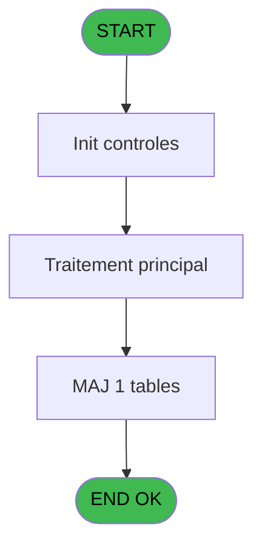

# PBG IDE 306 - Alimentation Combo VOL/creat

> **Analyse**: Phases 1-4 2026-02-03 11:01 -> 11:01 (23s) | Assemblage 11:01
> **Pipeline**: V7.2 Enrichi
> **Structure**: 4 onglets (Resume | Ecrans | Donnees | Connexions)

<!-- TAB:Resume -->

## 1. FICHE D'IDENTITE

| Attribut | Valeur |
|----------|--------|
| Projet | PBG |
| IDE Position | 306 |
| Nom Programme | Alimentation Combo VOL/creat |
| Fichier source | `Prg_306.xml` |
| Dossier IDE | General |
| Taches | 4 (0 ecrans visibles) |
| Tables modifiees | 1 |
| Programmes appeles | 1 |

## 2. DESCRIPTION FONCTIONNELLE

**Alimentation Combo VOL/creat** assure la gestion complete de ce processus, accessible depuis [Validation Arrivants (IDE 124)](PBG-IDE-124.md).

Le flux de traitement s'organise en **2 blocs fonctionnels** :

- **Consultation** (3 taches) : ecrans de recherche, selection et consultation
- **Creation** (1 tache) : insertion d'enregistrements en base (mouvements, prestations)

**Donnees modifiees** : 1 tables en ecriture (groupe_arr_dep___vol).

Detail : phases du traitement

#### Phase 1 : Consultation (3 taches)

- **306** - Selection Nationalite **[[ECRAN]](#ecran-t1)**
- **306.2** - Selection Nationalite **[[ECRAN]](#ecran-t3)**
- **306.3** - Selection Nationalite **[[ECRAN]](#ecran-t9)**

#### Phase 2 : Creation (1 tache)

- **306.1** - creation V/V

#### Tables impactees

| Table | Operations | Role metier |
|-------|-----------|-------------|
| groupe_arr_dep___vol | **W**/L (2 usages) |  |

## 3. BLOCS FONCTIONNELS

### 3.1 Consultation (3 taches)

Ecrans de recherche et consultation.

---

#### 306 - Selection Nationalite [[ECRAN]](#ecran-t1)

**Role** : Selection par l'operateur : Selection Nationalite.
**Ecran** : 1355 x 0 DLU (MDI) | [Voir mockup](#ecran-t1)

---

#### 306.2 - Selection Nationalite [[ECRAN]](#ecran-t3)

**Role** : Selection par l'operateur : Selection Nationalite.
**Ecran** : 1357 x 246 DLU (MDI) | [Voir mockup](#ecran-t3)

---

#### 306.3 - Selection Nationalite [[ECRAN]](#ecran-t9)

**Role** : Selection par l'operateur : Selection Nationalite.
**Ecran** : 1357 x 246 DLU (MDI) | [Voir mockup](#ecran-t9)

### 3.2 Creation (1 tache)

Insertion de nouveaux enregistrements en base.

---

#### 306.1 - creation V/V

**Role** : Creation d'enregistrement : creation V/V.

## 5. REGLES METIER

*(Aucune regle metier identifiee)*

## 6. CONTEXTE

- **Appele par**: [Validation Arrivants (IDE 124)](PBG-IDE-124.md)
- **Appelle**: 1 programmes | **Tables**: 4 (W:1 R:2 L:3) | **Taches**: 4 | **Expressions**: 2

<!-- TAB:Ecrans -->

## 8. ECRANS

*(Programme sans ecran visible)*

## 9. NAVIGATION

### 9.3 Structure hierarchique (4 taches)

| Position | Tache | Type | Dimensions | Bloc |
|----------|-------|------|------------|------|
| **306.1** | [**Selection Nationalite** (306)](#t1) [mockup](#ecran-t1) | MDI | 1355x0 | Consultation |
| 306.1.1 | [Selection Nationalite (306.2)](#t3) [mockup](#ecran-t3) | MDI | 1357x246 | |
| 306.1.2 | [Selection Nationalite (306.3)](#t9) [mockup](#ecran-t9) | MDI | 1357x246 | |
| **306.2** | [**creation V/V** (306.1)](#t2) | MDI | - | Creation |

### 9.4 Algorigramme

> **Legende**: Vert = START/END OK | Rouge = END KO | Bleu = Decisions
> *Algorigramme auto-genere. Utiliser `/algorigramme` pour une synthese metier detaillee.*

<!-- TAB:Donnees -->

## 10. TABLES

### Tables utilisees (4)

| ID | Nom | Description | Type | R | W | L | Usages |
|----|-----|-------------|------|---|---|---|--------|
| 112 | tables_paris |  | DB | R |   |   | 1 |
| 132 | code_vol_________vot |  | DB | R |   | L | 2 |
| 134 | groupe_arr_dep___vol |  | DB |   | **W** | L | 2 |
| 1023 | Table_1023 |  | MEM |   |   | L | 1 |

### Colonnes par table (2 / 3 tables avec colonnes identifiees)

Table 112 - tables_paris (R) - 1 usages

| Lettre | Variable | Acces | Type |
|--------|----------|-------|------|
| A | v. verification VV1 ... | R | Logical |
| B | v.Ligne vol | R | Unicode |

Table 132 - code_vol_________vot (R/L) - 2 usages

| Lettre | Variable | Acces | Type |
|--------|----------|-------|------|
| A | v. verification VV1 ... | R | Logical |
| B | v.Ligne vol | R | Unicode |

Table 134 - groupe_arr_dep___vol (**W**/L) - 2 usages

*Table utilisee uniquement en Link ou aucune colonne Real identifiee dans le DataView.*

## 11. VARIABLES

### 11.1 Parametres entrants (3)

Variables recues du programme appelant ([Validation Arrivants (IDE 124)](PBG-IDE-124.md)).

| Lettre | Nom | Type | Usage dans |
|--------|-----|------|-----------|
| A | p.o.Chaine | Alpha | - |
| B | p.i.Aller/Retour | Alpha | - |
| C | p.i.Date Arrivee | Date | - |

## 12. EXPRESSIONS

**2 / 2 expressions decodees (100%)**

### 12.1 Repartition par type

| Type | Expressions | Regles |
|------|-------------|--------|
| CONSTANTE | 1 | 0 |
| NEGATION | 1 | 0 |

### 12.2 Expressions cles par type

#### CONSTANTE (1 expressions)

| Type | IDE | Expression | Regle |
|------|-----|------------|-------|
| CONSTANTE | 1 | `''` | - |

#### NEGATION (1 expressions)

| Type | IDE | Expression | Regle |
|------|-----|------------|-------|
| NEGATION | 2 | `NOT VG76` | - |

<!-- TAB:Connexions -->

## 13. GRAPHE D'APPELS

### 13.1 Chaine depuis Main (Callers)

Main -> ... -> [Validation Arrivants (IDE 124)](PBG-IDE-124.md) -> **Alimentation Combo VOL/creat (IDE 306)**

### 13.2 Callers

| IDE | Nom Programme | Nb Appels |
|-----|---------------|-----------|
| [124](PBG-IDE-124.md) | Validation Arrivants | 2 |

### 13.3 Callees (programmes appeles)

### 13.4 Detail Callees avec contexte

| IDE | Nom Programme | Appels | Contexte |
|-----|---------------|--------|----------|
| [315](PBG-IDE-315.md) | Suppression Carac interdit | 2 | Validation saisie |

## 14. RECOMMANDATIONS MIGRATION

### 14.1 Profil du programme

| Metrique | Valeur | Impact migration |
|----------|--------|-----------------|
| Lignes de logique | 109 | Programme compact |
| Expressions | 2 | Peu de logique |
| Tables WRITE | 1 | Impact faible |
| Sous-programmes | 1 | Peu de dependances |
| Ecrans visibles | 0 | Ecran unique ou traitement batch |
| Code desactive | 0% (0 / 109) | Code sain |
| Regles metier | 0 | Pas de regle identifiee |

### 14.2 Plan de migration par bloc

#### Consultation (3 taches: 3 ecrans, 0 traitement)

- **Strategie** : Composants de recherche/selection en modales.
- 3 ecrans : Selection Nationalite, Selection Nationalite, Selection Nationalite

#### Creation (1 tache: 0 ecran, 1 traitement)

- **Strategie** : Repository pattern avec Entity Framework Core.
- Insertion via `IRepository<T>.CreateAsync()`

### 14.3 Dependances critiques

| Dependance | Type | Appels | Impact |
|------------|------|--------|--------|
| groupe_arr_dep___vol | Table WRITE (Database) | 1x | Schema + repository |
| [Suppression Carac interdit (IDE 315)](PBG-IDE-315.md) | Sous-programme | 2x | Haute - Validation saisie |

---
*Spec DETAILED generee par Pipeline V7.2 - 2026-02-03 11:01*
