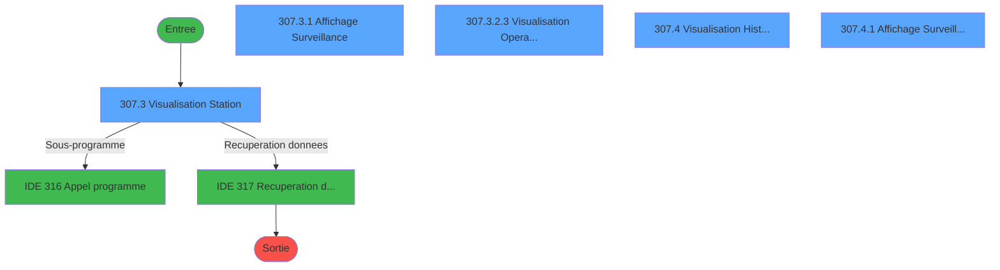
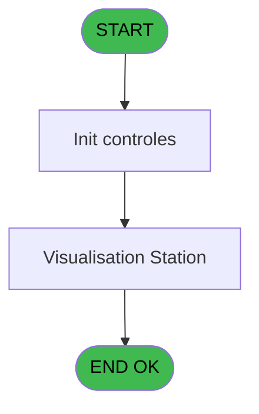
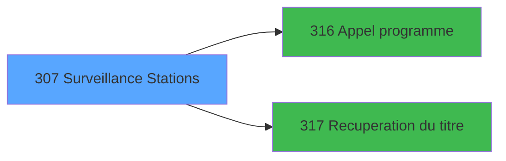

# PBG IDE 307 - Surveillance Stations

> **Analyse**: Phases 1-4 2026-02-03 11:01 -> 11:02 (21s) | Assemblage 11:02
> **Pipeline**: V7.2 Enrichi
> **Structure**: 4 onglets (Resume | Ecrans | Donnees | Connexions)

<!-- TAB:Resume -->

## 1. FICHE D'IDENTITE

| Attribut | Valeur |
|----------|--------|
| Projet | PBG |
| IDE Position | 307 |
| Nom Programme | Surveillance Stations |
| Fichier source | `Prg_307.xml` |
| Dossier IDE | General |
| Taches | 11 (5 ecrans visibles) |
| Tables modifiees | 0 |
| Programmes appeles | 2 |
| :warning: Statut | **ORPHELIN_POTENTIEL** |

## 2. DESCRIPTION FONCTIONNELLE

**Surveillance Stations** assure la gestion complete de ce processus.

Le flux de traitement s'organise en **3 blocs fonctionnels** :

- **Traitement** (6 taches) : traitements metier divers
- **Validation** (3 taches) : controles et verifications de coherence
- **Consultation** (2 taches) : ecrans de recherche, selection et consultation

Detail : phases du traitement

#### Phase 1 : Traitement (6 taches)

- **307** - Surveillance Stations
- **307.2** - Aucun Historique
- **307.3** - Visualisation Station **[[ECRAN]](#ecran-t4)**
- **307.3.2.2** - Aucune Visualisation
- **307.3.2.3** - Visualisation Operateur **[[ECRAN]](#ecran-t9)**
- **307.4** - Visualisation Historique **[[ECRAN]](#ecran-t10)**

Delegue a : [Appel programme (IDE 316)](PBG-IDE-316.md), [Recuperation du titre (IDE 317)](PBG-IDE-317.md)

#### Phase 2 : Validation (3 taches)

- **307.1** - Verification Historique
- **307.3.2** - Verification Utilisateur
- **307.3.2.1** - Verification Historique

#### Phase 3 : Consultation (2 taches)

- **307.3.1** - Affichage Surveillance **[[ECRAN]](#ecran-t5)**
- **307.4.1** - Affichage Surveillance **[[ECRAN]](#ecran-t11)**

Delegue a : [Recuperation du titre (IDE 317)](PBG-IDE-317.md)

## 3. BLOCS FONCTIONNELS

### 3.1 Traitement (6 taches)

Traitements internes.

---

#### 307 - Surveillance Stations

**Role** : Tache d'orchestration : point d'entree du programme (6 sous-taches). Coordonne l'enchainement des traitements.

5 sous-taches directes

| Tache | Nom | Bloc |
|-------|-----|------|
| [307.2](#t3) | Aucun Historique | Traitement |
| [307.3](#t4) | Visualisation Station **[[ECRAN]](#ecran-t4)** | Traitement |
| [307.3.2.2](#t8) | Aucune Visualisation | Traitement |
| [307.3.2.3](#t9) | Visualisation Operateur **[[ECRAN]](#ecran-t9)** | Traitement |
| [307.4](#t10) | Visualisation Historique **[[ECRAN]](#ecran-t10)** | Traitement |

**Delegue a** : [Appel programme (IDE 316)](PBG-IDE-316.md), [Recuperation du titre (IDE 317)](PBG-IDE-317.md)

---

#### 307.2 - Aucun Historique

**Role** : Consultation/chargement : Aucun Historique.
**Delegue a** : [Appel programme (IDE 316)](PBG-IDE-316.md), [Recuperation du titre (IDE 317)](PBG-IDE-317.md)

---

#### 307.3 - Visualisation Station [[ECRAN]](#ecran-t4)

**Role** : Traitement : Visualisation Station.
**Ecran** : 898 x 264 DLU (MDI) | [Voir mockup](#ecran-t4)
**Delegue a** : [Appel programme (IDE 316)](PBG-IDE-316.md), [Recuperation du titre (IDE 317)](PBG-IDE-317.md)

---

#### 307.3.2.2 - Aucune Visualisation

**Role** : Traitement : Aucune Visualisation.
**Delegue a** : [Appel programme (IDE 316)](PBG-IDE-316.md), [Recuperation du titre (IDE 317)](PBG-IDE-317.md)

---

#### 307.3.2.3 - Visualisation Operateur [[ECRAN]](#ecran-t9)

**Role** : Configuration/parametrage : Visualisation Operateur.
**Ecran** : 784 x 225 DLU (MDI) | [Voir mockup](#ecran-t9)
**Delegue a** : [Appel programme (IDE 316)](PBG-IDE-316.md), [Recuperation du titre (IDE 317)](PBG-IDE-317.md)

---

#### 307.4 - Visualisation Historique [[ECRAN]](#ecran-t10)

**Role** : Consultation/chargement : Visualisation Historique.
**Ecran** : 907 x 284 DLU (MDI) | [Voir mockup](#ecran-t10)
**Delegue a** : [Appel programme (IDE 316)](PBG-IDE-316.md), [Recuperation du titre (IDE 317)](PBG-IDE-317.md)

### 3.2 Validation (3 taches)

Controles de coherence : 3 taches verifient les donnees et conditions.

---

#### 307.1 - Verification Historique

**Role** : Verification : Verification Historique.

---

#### 307.3.2 - Verification Utilisateur

**Role** : Verification : Verification Utilisateur.

---

#### 307.3.2.1 - Verification Historique

**Role** : Verification : Verification Historique.

### 3.3 Consultation (2 taches)

Ecrans de recherche et consultation.

---

#### 307.3.1 - Affichage Surveillance [[ECRAN]](#ecran-t5)

**Role** : Reinitialisation : Affichage Surveillance.
**Ecran** : 891 x 114 DLU (Modal) | [Voir mockup](#ecran-t5)

---

#### 307.4.1 - Affichage Surveillance [[ECRAN]](#ecran-t11)

**Role** : Reinitialisation : Affichage Surveillance.
**Ecran** : 878 x 126 DLU (Modal) | [Voir mockup](#ecran-t11)

## 5. REGLES METIER

*(Aucune regle metier identifiee)*

## 6. CONTEXTE

- **Appele par**: (aucun)
- **Appelle**: 2 programmes | **Tables**: 4 (W:0 R:3 L:3) | **Taches**: 11 | **Expressions**: 8

<!-- TAB:Ecrans -->

## 8. ECRANS

### 8.1 Forms visibles (5 / 11)

| # | Position | Tache | Nom | Type | Largeur | Hauteur | Bloc |
|---|----------|-------|-----|------|---------|---------|------|
| 1 | 307.3 | 307.3 | Visualisation Station | MDI | 898 | 264 | Traitement |
| 2 | 307.3.1 | 307.3.1 | Affichage Surveillance | Modal | 891 | 114 | Consultation |
| 3 | 307.3.2.3 | 307.3.2.3 | Visualisation Operateur | MDI | 784 | 225 | Traitement |
| 4 | 307.4 | 307.4 | Visualisation Historique | MDI | 907 | 284 | Traitement |
| 5 | 307.4.1 | 307.4.1 | Affichage Surveillance | Modal | 878 | 126 | Consultation |

### 8.2 Mockups Ecrans

---

#### 307.3 - Visualisation Station
**Tache** : [307.3](#t4) | **Type** : MDI | **Dimensions** : 898 x 264 DLU
**Bloc** : Traitement | **Titre IDE** : Visualisation Station

<!-- FORM-DATA:
{
    "width":  898,
    "vFactor":  8,
    "type":  "MDI",
    "hFactor":  8,
    "controls":  [
                     {
                         "x":  0,
                         "type":  "label",
                         "var":  "",
                         "y":  2,
                         "w":  890,
                         "fmt":  "",
                         "name":  "",
                         "h":  21,
                         "color":  "",
                         "text":  "",
                         "parent":  null
                     },
                     {
                         "x":  385,
                         "type":  "label",
                         "var":  "",
                         "y":  31,
                         "w":  491,
                         "fmt":  "",
                         "name":  "",
                         "h":  79,
                         "color":  "195",
                         "text":  "Renseignements",
                         "parent":  null
                     },
                     {
                         "x":  20,
                         "type":  "table",
                         "var":  "",
                         "name":  "",
                         "titleH":  14,
                         "color":  "110",
                         "w":  350,
                         "y":  34,
                         "fmt":  "",
                         "parent":  null,
                         "text":  "",
                         "rowH":  15,
                         "h":  75,
                         "cols":  [
                                      {
                                          "title":  "Nom",
                                          "layer":  1,
                                          "w":  316
                                      }
                                  ],
                         "rows":  1
                     },
                     {
                         "x":  405,
                         "type":  "label",
                         "var":  "",
                         "y":  41,
                         "w":  61,
                         "fmt":  "",
                         "name":  "",
                         "h":  8,
                         "color":  "",
                         "text":  "Login",
                         "parent":  4
                     },
                     {
                         "x":  405,
                         "type":  "label",
                         "var":  "",
                         "y":  55,
                         "w":  45,
                         "fmt":  "",
                         "name":  "",
                         "h":  8,
                         "color":  "",
                         "text":  "Date",
                         "parent":  4
                     },
                     {
                         "x":  405,
                         "type":  "label",
                         "var":  "",
                         "y":  69,
                         "w":  54,
                         "fmt":  "",
                         "name":  "",
                         "h":  8,
                         "color":  "",
                         "text":  "Heure",
                         "parent":  4
                     },
                     {
                         "x":  405,
                         "type":  "label",
                         "var":  "",
                         "y":  83,
                         "w":  98,
                         "fmt":  "",
                         "name":  "",
                         "h":  8,
                         "color":  "",
                         "text":  "Superviseur",
                         "parent":  4
                     },
                     {
                         "x":  405,
                         "type":  "label",
                         "var":  "",
                         "y":  97,
                         "w":  66,
                         "fmt":  "",
                         "name":  "",
                         "h":  8,
                         "color":  "",
                         "text":  "Creer le",
                         "parent":  4
                     },
                     {
                         "x":  0,
                         "type":  "label",
                         "var":  "",
                         "y":  237,
                         "w":  892,
                         "fmt":  "",
                         "name":  "",
                         "h":  24,
                         "color":  "",
                         "text":  "",
                         "parent":  null
                     },
                     {
                         "x":  32,
                         "type":  "edit",
                         "var":  "",
                         "y":  51,
                         "w":  288,
                         "fmt":  "",
                         "name":  "NOM COMPLET",
                         "h":  8,
                         "color":  "110",
                         "text":  "",
                         "parent":  5
                     },
                     {
                         "x":  527,
                         "type":  "edit",
                         "var":  "",
                         "y":  41,
                         "w":  139,
                         "fmt":  "",
                         "name":  "",
                         "h":  8,
                         "color":  "",
                         "text":  "",
                         "parent":  4
                     },
                     {
                         "x":  527,
                         "type":  "edit",
                         "var":  "",
                         "y":  97,
                         "w":  120,
                         "fmt":  "DD/MM/YYYYT",
                         "name":  "",
                         "h":  8,
                         "color":  "",
                         "text":  "",
                         "parent":  4
                     },
                     {
                         "x":  527,
                         "type":  "edit",
                         "var":  "",
                         "y":  55,
                         "w":  120,
                         "fmt":  "DD/MM/YYYYZ",
                         "name":  "",
                         "h":  8,
                         "color":  "",
                         "text":  "",
                         "parent":  4
                     },
                     {
                         "x":  527,
                         "type":  "edit",
                         "var":  "",
                         "y":  69,
                         "w":  120,
                         "fmt":  "",
                         "name":  "",
                         "h":  8,
                         "color":  "",
                         "text":  "",
                         "parent":  4
                     },
                     {
                         "x":  6,
                         "type":  "edit",
                         "var":  "",
                         "y":  8,
                         "w":  267,
                         "fmt":  "20",
                         "name":  "",
                         "h":  8,
                         "color":  "",
                         "text":  "",
                         "parent":  null
                     },
                     {
                         "x":  678,
                         "type":  "edit",
                         "var":  "",
                         "y":  8,
                         "w":  203,
                         "fmt":  "WWW DD MMM YYYYT",
                         "name":  "",
                         "h":  8,
                         "color":  "",
                         "text":  "",
                         "parent":  null
                     },
                     {
                         "x":  676,
                         "type":  "image",
                         "var":  "",
                         "y":  44,
                         "w":  182,
                         "fmt":  "",
                         "name":  "",
                         "h":  55,
                         "color":  "",
                         "text":  "",
                         "parent":  4
                     },
                     {
                         "x":  527,
                         "type":  "edit",
                         "var":  "",
                         "y":  83,
                         "w":  42,
                         "fmt":  "UX2",
                         "name":  "",
                         "h":  8,
                         "color":  "",
                         "text":  "",
                         "parent":  4
                     },
                     {
                         "x":  6,
                         "type":  "button",
                         "var":  "",
                         "y":  240,
                         "w":  154,
                         "fmt":  "\u0026Quitter",
                         "name":  "",
                         "h":  18,
                         "color":  "",
                         "text":  "",
                         "parent":  null
                     },
                     {
                         "x":  713,
                         "type":  "button",
                         "var":  "",
                         "y":  240,
                         "w":  173,
                         "fmt":  "Visu. \u0026Historique",
                         "name":  "S",
                         "h":  18,
                         "color":  "",
                         "text":  "",
                         "parent":  null
                     },
                     {
                         "x":  0,
                         "type":  "subform",
                         "var":  "",
                         "y":  114,
                         "w":  896,
                         "fmt":  "",
                         "name":  "Affichage Surveillance",
                         "h":  120,
                         "color":  "",
                         "text":  "",
                         "parent":  null
                     }
                 ],
    "taskId":  "307.3",
    "height":  264
}
-->

<strong>Champs : 8 champs</strong>

| Pos (x,y) | Nom | Variable | Type |
|-----------|-----|----------|------|
| 32,51 | NOM COMPLET | - | edit |
| 527,41 | (sans nom) | - | edit |
| 527,97 | DD/MM/YYYYT | - | edit |
| 527,55 | DD/MM/YYYYZ | - | edit |
| 527,69 | (sans nom) | - | edit |
| 6,8 | 20 | - | edit |
| 678,8 | WWW DD MMM YYYYT | - | edit |
| 527,83 | UX2 | - | edit |

<strong>Boutons : 2 boutons</strong>

| Bouton | Pos (x,y) | Action |
|--------|-----------|--------|
| Quitter | 6,240 | Quitte le programme |
| Visu. Historique | 713,240 | Bouton fonctionnel |

---

#### 307.3.1 - Affichage Surveillance
**Tache** : [307.3.1](#t5) | **Type** : Modal | **Dimensions** : 891 x 114 DLU
**Bloc** : Consultation | **Titre IDE** : Affichage Surveillance

<!-- FORM-DATA:
{
    "width":  891,
    "vFactor":  8,
    "type":  "Modal",
    "hFactor":  8,
    "controls":  [
                     {
                         "x":  1,
                         "type":  "table",
                         "var":  "",
                         "name":  "",
                         "titleH":  14,
                         "color":  "110",
                         "w":  890,
                         "y":  0,
                         "fmt":  "",
                         "parent":  null,
                         "text":  "",
                         "rowH":  14,
                         "h":  99,
                         "cols":  [
                                      {
                                          "title":  "Libellé historique",
                                          "layer":  1,
                                          "w":  390
                                      },
                                      {
                                          "title":  "Erreur",
                                          "layer":  2,
                                          "w":  465
                                      }
                                  ],
                         "rows":  2
                     },
                     {
                         "x":  174,
                         "type":  "label",
                         "var":  "",
                         "y":  105,
                         "w":  18,
                         "fmt":  "",
                         "name":  "",
                         "h":  8,
                         "color":  "",
                         "text":  "à",
                         "parent":  null
                     },
                     {
                         "x":  5,
                         "type":  "label",
                         "var":  "",
                         "y":  106,
                         "w":  27,
                         "fmt":  "",
                         "name":  "",
                         "h":  8,
                         "color":  "",
                         "text":  "Le",
                         "parent":  null
                     },
                     {
                         "x":  36,
                         "type":  "edit",
                         "var":  "",
                         "y":  106,
                         "w":  120,
                         "fmt":  "DD/MM/YYYYZ",
                         "name":  "",
                         "h":  8,
                         "color":  "",
                         "text":  "",
                         "parent":  null
                     },
                     {
                         "x":  198,
                         "type":  "edit",
                         "var":  "",
                         "y":  106,
                         "w":  98,
                         "fmt":  "",
                         "name":  "",
                         "h":  8,
                         "color":  "",
                         "text":  "",
                         "parent":  null
                     },
                     {
                         "x":  10,
                         "type":  "edit",
                         "var":  "",
                         "y":  17,
                         "w":  366,
                         "fmt":  "",
                         "name":  "",
                         "h":  8,
                         "color":  "110",
                         "text":  "",
                         "parent":  1
                     },
                     {
                         "x":  398,
                         "type":  "edit",
                         "var":  "",
                         "y":  17,
                         "w":  456,
                         "fmt":  "UX39",
                         "name":  "",
                         "h":  8,
                         "color":  "110",
                         "text":  "",
                         "parent":  1
                     }
                 ],
    "taskId":  "307.3.1",
    "height":  114
}
-->

<strong>Champs : 4 champs</strong>

| Pos (x,y) | Nom | Variable | Type |
|-----------|-----|----------|------|
| 36,106 | DD/MM/YYYYZ | - | edit |
| 198,106 | (sans nom) | - | edit |
| 10,17 | (sans nom) | - | edit |
| 398,17 | UX39 | - | edit |

---

#### 307.3.2.3 - Visualisation Operateur
**Tache** : [307.3.2.3](#t9) | **Type** : MDI | **Dimensions** : 784 x 225 DLU
**Bloc** : Traitement | **Titre IDE** : Visualisation Operateur

<!-- FORM-DATA:
{
    "width":  784,
    "vFactor":  8,
    "type":  "MDI",
    "hFactor":  8,
    "controls":  [
                     {
                         "x":  0,
                         "type":  "label",
                         "var":  "",
                         "y":  1,
                         "w":  778,
                         "fmt":  "",
                         "name":  "",
                         "h":  21,
                         "color":  "",
                         "text":  "",
                         "parent":  null
                     },
                     {
                         "x":  15,
                         "type":  "label",
                         "var":  "",
                         "y":  35,
                         "w":  746,
                         "fmt":  "",
                         "name":  "",
                         "h":  41,
                         "color":  "",
                         "text":  "",
                         "parent":  null
                     },
                     {
                         "x":  29,
                         "type":  "label",
                         "var":  "",
                         "y":  44,
                         "w":  104,
                         "fmt":  "",
                         "name":  "",
                         "h":  8,
                         "color":  "",
                         "text":  "Nom Complet :",
                         "parent":  null
                     },
                     {
                         "x":  470,
                         "type":  "label",
                         "var":  "",
                         "y":  44,
                         "w":  120,
                         "fmt":  "",
                         "name":  "",
                         "h":  8,
                         "color":  "",
                         "text":  "Date Historique",
                         "parent":  null
                     },
                     {
                         "x":  29,
                         "type":  "label",
                         "var":  "",
                         "y":  61,
                         "w":  50,
                         "fmt":  "",
                         "name":  "",
                         "h":  8,
                         "color":  "",
                         "text":  "Login",
                         "parent":  null
                     },
                     {
                         "x":  470,
                         "type":  "label",
                         "var":  "",
                         "y":  61,
                         "w":  134,
                         "fmt":  "",
                         "name":  "",
                         "h":  8,
                         "color":  "",
                         "text":  "Heure Historique",
                         "parent":  null
                     },
                     {
                         "x":  79,
                         "type":  "table",
                         "var":  "",
                         "name":  "",
                         "titleH":  12,
                         "color":  "110",
                         "w":  629,
                         "y":  82,
                         "fmt":  "",
                         "parent":  null,
                         "text":  "",
                         "rowH":  16,
                         "h":  109,
                         "cols":  [
                                      {
                                          "title":  "",
                                          "layer":  1,
                                          "w":  272
                                      },
                                      {
                                          "title":  "",
                                          "layer":  2,
                                          "w":  347
                                      }
                                  ],
                         "rows":  2
                     },
                     {
                         "x":  4,
                         "type":  "label",
                         "var":  "",
                         "y":  197,
                         "w":  774,
                         "fmt":  "",
                         "name":  "",
                         "h":  24,
                         "color":  "",
                         "text":  "",
                         "parent":  null
                     },
                     {
                         "x":  153,
                         "type":  "edit",
                         "var":  "",
                         "y":  61,
                         "w":  120,
                         "fmt":  "",
                         "name":  "",
                         "h":  8,
                         "color":  "",
                         "text":  "",
                         "parent":  null
                     },
                     {
                         "x":  622,
                         "type":  "edit",
                         "var":  "",
                         "y":  44,
                         "w":  120,
                         "fmt":  "DD/MM/YYYYT",
                         "name":  "",
                         "h":  8,
                         "color":  "",
                         "text":  "",
                         "parent":  null
                     },
                     {
                         "x":  622,
                         "type":  "edit",
                         "var":  "",
                         "y":  61,
                         "w":  98,
                         "fmt":  "",
                         "name":  "",
                         "h":  8,
                         "color":  "",
                         "text":  "",
                         "parent":  null
                     },
                     {
                         "x":  153,
                         "type":  "edit",
                         "var":  "",
                         "y":  44,
                         "w":  288,
                         "fmt":  "",
                         "name":  "",
                         "h":  8,
                         "color":  "",
                         "text":  "",
                         "parent":  null
                     },
                     {
                         "x":  6,
                         "type":  "edit",
                         "var":  "",
                         "y":  7,
                         "w":  267,
                         "fmt":  "20",
                         "name":  "",
                         "h":  8,
                         "color":  "",
                         "text":  "",
                         "parent":  null
                     },
                     {
                         "x":  566,
                         "type":  "edit",
                         "var":  "",
                         "y":  7,
                         "w":  203,
                         "fmt":  "WWW DD MMM YYYYT",
                         "name":  "",
                         "h":  8,
                         "color":  "",
                         "text":  "",
                         "parent":  null
                     },
                     {
                         "x":  90,
                         "type":  "edit",
                         "var":  "",
                         "y":  87,
                         "w":  256,
                         "fmt":  "U32",
                         "name":  "",
                         "h":  8,
                         "color":  "110",
                         "text":  "",
                         "parent":  13
                     },
                     {
                         "x":  365,
                         "type":  "edit",
                         "var":  "",
                         "y":  87,
                         "w":  320,
                         "fmt":  "UX39",
                         "name":  "",
                         "h":  8,
                         "color":  "110",
                         "text":  "",
                         "parent":  13
                     },
                     {
                         "x":  13,
                         "type":  "button",
                         "var":  "",
                         "y":  200,
                         "w":  154,
                         "fmt":  "\u0026Quitter",
                         "name":  "",
                         "h":  18,
                         "color":  "",
                         "text":  "",
                         "parent":  null
                     }
                 ],
    "taskId":  "307.3.2.3",
    "height":  225
}
-->

<strong>Champs : 8 champs</strong>

| Pos (x,y) | Nom | Variable | Type |
|-----------|-----|----------|------|
| 153,61 | (sans nom) | - | edit |
| 622,44 | DD/MM/YYYYT | - | edit |
| 622,61 | (sans nom) | - | edit |
| 153,44 | (sans nom) | - | edit |
| 6,7 | 20 | - | edit |
| 566,7 | WWW DD MMM YYYYT | - | edit |
| 90,87 | U32 | - | edit |
| 365,87 | UX39 | - | edit |

<strong>Boutons : 1 boutons</strong>

| Bouton | Pos (x,y) | Action |
|--------|-----------|--------|
| Quitter | 13,200 | Quitte le programme |

---

#### 307.4 - Visualisation Historique
**Tache** : [307.4](#t10) | **Type** : MDI | **Dimensions** : 907 x 284 DLU
**Bloc** : Traitement | **Titre IDE** : Visualisation Historique

<!-- FORM-DATA:
{
    "width":  907,
    "vFactor":  8,
    "type":  "MDI",
    "hFactor":  8,
    "controls":  [
                     {
                         "x":  0,
                         "type":  "label",
                         "var":  "",
                         "y":  2,
                         "w":  901,
                         "fmt":  "",
                         "name":  "",
                         "h":  21,
                         "color":  "",
                         "text":  "",
                         "parent":  null
                     },
                     {
                         "x":  23,
                         "type":  "table",
                         "var":  "",
                         "name":  "",
                         "titleH":  14,
                         "color":  "110",
                         "w":  341,
                         "y":  27,
                         "fmt":  "",
                         "parent":  null,
                         "text":  "",
                         "rowH":  15,
                         "h":  87,
                         "cols":  [
                                      {
                                          "title":  "Libellé Historique",
                                          "layer":  1,
                                          "w":  306
                                      }
                                  ],
                         "rows":  1
                     },
                     {
                         "x":  2,
                         "type":  "label",
                         "var":  "",
                         "y":  258,
                         "w":  902,
                         "fmt":  "",
                         "name":  "",
                         "h":  24,
                         "color":  "",
                         "text":  "",
                         "parent":  null
                     },
                     {
                         "x":  35,
                         "type":  "edit",
                         "var":  "",
                         "y":  45,
                         "w":  288,
                         "fmt":  "",
                         "name":  "LIBELLE HISTORIQUE",
                         "h":  8,
                         "color":  "110",
                         "text":  "",
                         "parent":  5
                     },
                     {
                         "x":  6,
                         "type":  "edit",
                         "var":  "",
                         "y":  8,
                         "w":  267,
                         "fmt":  "20",
                         "name":  "",
                         "h":  8,
                         "color":  "",
                         "text":  "",
                         "parent":  null
                     },
                     {
                         "x":  689,
                         "type":  "edit",
                         "var":  "",
                         "y":  8,
                         "w":  203,
                         "fmt":  "WWW DD MMM YYYYT",
                         "name":  "",
                         "h":  8,
                         "color":  "",
                         "text":  "",
                         "parent":  null
                     },
                     {
                         "x":  513,
                         "type":  "image",
                         "var":  "",
                         "y":  23,
                         "w":  264,
                         "fmt":  "",
                         "name":  "",
                         "h":  95,
                         "color":  "",
                         "text":  "",
                         "parent":  null
                     },
                     {
                         "x":  11,
                         "type":  "button",
                         "var":  "",
                         "y":  261,
                         "w":  154,
                         "fmt":  "\u0026Quitter",
                         "name":  "",
                         "h":  18,
                         "color":  "",
                         "text":  "",
                         "parent":  null
                     },
                     {
                         "x":  0,
                         "type":  "subform",
                         "var":  "",
                         "y":  121,
                         "w":  907,
                         "fmt":  "",
                         "name":  "Affichage Surveillance",
                         "h":  135,
                         "color":  "",
                         "text":  "",
                         "parent":  null
                     }
                 ],
    "taskId":  "307.4",
    "height":  284
}
-->

<strong>Champs : 3 champs</strong>

| Pos (x,y) | Nom | Variable | Type |
|-----------|-----|----------|------|
| 35,45 | LIBELLE HISTORIQUE | - | edit |
| 6,8 | 20 | - | edit |
| 689,8 | WWW DD MMM YYYYT | - | edit |

<strong>Boutons : 1 boutons</strong>

| Bouton | Pos (x,y) | Action |
|--------|-----------|--------|
| Quitter | 11,261 | Quitte le programme |

---

#### 307.4.1 - Affichage Surveillance
**Tache** : [307.4.1](#t11) | **Type** : Modal | **Dimensions** : 878 x 126 DLU
**Bloc** : Consultation | **Titre IDE** : Affichage Surveillance

<!-- FORM-DATA:
{
    "width":  878,
    "vFactor":  8,
    "type":  "Modal",
    "hFactor":  8,
    "controls":  [
                     {
                         "x":  0,
                         "type":  "table",
                         "var":  "",
                         "name":  "",
                         "titleH":  14,
                         "color":  "110",
                         "w":  878,
                         "y":  0,
                         "fmt":  "",
                         "parent":  null,
                         "text":  "",
                         "rowH":  17,
                         "h":  119,
                         "cols":  [
                                      {
                                          "title":  "",
                                          "layer":  1,
                                          "w":  131
                                      },
                                      {
                                          "title":  "",
                                          "layer":  2,
                                          "w":  134
                                      },
                                      {
                                          "title":  "",
                                          "layer":  3,
                                          "w":  114
                                      },
                                      {
                                          "title":  "",
                                          "layer":  4,
                                          "w":  472
                                      }
                                  ],
                         "rows":  4
                     },
                     {
                         "x":  6,
                         "type":  "label",
                         "var":  "",
                         "y":  2,
                         "w":  115,
                         "fmt":  "",
                         "name":  "",
                         "h":  11,
                         "color":  "7",
                         "text":  "Operateur",
                         "parent":  1
                     },
                     {
                         "x":  139,
                         "type":  "label",
                         "var":  "",
                         "y":  2,
                         "w":  120,
                         "fmt":  "",
                         "name":  "",
                         "h":  11,
                         "color":  "7",
                         "text":  "Date",
                         "parent":  1
                     },
                     {
                         "x":  275,
                         "type":  "label",
                         "var":  "",
                         "y":  2,
                         "w":  95,
                         "fmt":  "",
                         "name":  "",
                         "h":  11,
                         "color":  "7",
                         "text":  "Heure",
                         "parent":  1
                     },
                     {
                         "x":  387,
                         "type":  "label",
                         "var":  "",
                         "y":  2,
                         "w":  480,
                         "fmt":  "",
                         "name":  "",
                         "h":  11,
                         "color":  "7",
                         "text":  "Libelle",
                         "parent":  1
                     },
                     {
                         "x":  141,
                         "type":  "edit",
                         "var":  "",
                         "y":  20,
                         "w":  120,
                         "fmt":  "DD/MM/YYYYT",
                         "name":  "",
                         "h":  8,
                         "color":  "",
                         "text":  "",
                         "parent":  1
                     },
                     {
                         "x":  275,
                         "type":  "edit",
                         "var":  "",
                         "y":  20,
                         "w":  98,
                         "fmt":  "",
                         "name":  "",
                         "h":  8,
                         "color":  "",
                         "text":  "",
                         "parent":  1
                     },
                     {
                         "x":  389,
                         "type":  "edit",
                         "var":  "",
                         "y":  20,
                         "w":  456,
                         "fmt":  "",
                         "name":  "",
                         "h":  8,
                         "color":  "",
                         "text":  "",
                         "parent":  1
                     },
                     {
                         "x":  4,
                         "type":  "edit",
                         "var":  "",
                         "y":  20,
                         "w":  120,
                         "fmt":  "",
                         "name":  "",
                         "h":  8,
                         "color":  "",
                         "text":  "",
                         "parent":  1
                     }
                 ],
    "taskId":  "307.4.1",
    "height":  126
}
-->

<strong>Champs : 4 champs</strong>

| Pos (x,y) | Nom | Variable | Type |
|-----------|-----|----------|------|
| 141,20 | DD/MM/YYYYT | - | edit |
| 275,20 | (sans nom) | - | edit |
| 389,20 | (sans nom) | - | edit |
| 4,20 | (sans nom) | - | edit |

## 9. NAVIGATION

### 9.1 Enchainement des ecrans

**Detail par enchainement :**

| Depuis | Action | Vers | Retour |
|--------|--------|------|--------|
| Visualisation Station | Sous-programme | [Appel programme (IDE 316)](PBG-IDE-316.md) | Retour ecran |
| Visualisation Station | Recuperation donnees | [Recuperation du titre (IDE 317)](PBG-IDE-317.md) | Retour ecran |

### 9.3 Structure hierarchique (11 taches)

| Position | Tache | Type | Dimensions | Bloc |
|----------|-------|------|------------|------|
| **307.1** | [**Surveillance Stations** (307)](#t1) | MDI | - | Traitement |
| 307.1.1 | [Aucun Historique (307.2)](#t3) | Modal | - | |
| 307.1.2 | [Visualisation Station (307.3)](#t4) [mockup](#ecran-t4) | MDI | 898x264 | |
| 307.1.3 | [Aucune Visualisation (307.3.2.2)](#t8) | MDI | - | |
| 307.1.4 | [Visualisation Operateur (307.3.2.3)](#t9) [mockup](#ecran-t9) | MDI | 784x225 | |
| 307.1.5 | [Visualisation Historique (307.4)](#t10) [mockup](#ecran-t10) | MDI | 907x284 | |
| **307.2** | [**Verification Historique** (307.1)](#t2) | MDI | - | Validation |
| 307.2.1 | [Verification Utilisateur (307.3.2)](#t6) | MDI | - | |
| 307.2.2 | [Verification Historique (307.3.2.1)](#t7) | MDI | - | |
| **307.3** | [**Affichage Surveillance** (307.3.1)](#t5) [mockup](#ecran-t5) | Modal | 891x114 | Consultation |
| 307.3.1 | [Affichage Surveillance (307.4.1)](#t11) [mockup](#ecran-t11) | Modal | 878x126 | |

### 9.4 Algorigramme

> **Legende**: Vert = START/END OK | Rouge = END KO | Bleu = Decisions
> *Algorigramme auto-genere. Utiliser `/algorigramme` pour une synthese metier detaillee.*

<!-- TAB:Donnees -->

## 10. TABLES

### Tables utilisees (4)

| ID | Nom | Description | Type | R | W | L | Usages |
|----|-----|-------------|------|---|---|---|--------|
| 88 | historik_station | Historique / journal | DB | R |   |   | 5 |
| 111 | tables_historiques | Historique / journal | DB | R |   | L | 3 |
| 115 | tables_erreurs |  | DB |   |   | L | 2 |
| 691 | commandes |  | DB | R |   | L | 3 |

### Colonnes par table (2 / 3 tables avec colonnes identifiees)

Table 88 - historik_station (R) - 5 usages

| Lettre | Variable | Acces | Type |
|--------|----------|-------|------|
| A | W1-Fin de Tache | R | Alpha |
| B | W1-Code Retour | R | Logical |
| C | W3-Selection Choix | R | Alpha |
| D | v. titre ecran | R | Alpha |

Table 111 - tables_historiques (R/L) - 3 usages

*Table utilisee uniquement en Link ou aucune colonne Real identifiee dans le DataView.*

Table 691 - commandes (R/L) - 3 usages

| Lettre | Variable | Acces | Type |
|--------|----------|-------|------|
| A | W1 fin | R | Alpha |
| B | W1 choix | R | Alpha |
| C | v. titre ecran | R | Alpha |

## 11. VARIABLES

### 11.1 Autres (6)

Variables diverses.

| Lettre | Nom | Type | Usage dans |
|--------|-----|------|-----------|
| A | P0-Code Choix | Alpha | - |
| B | P0-Code Societe | Alpha | - |
| C | P0-Code Langue | Alpha | - |
| D | W0-Fin de Tache | Alpha | 1x refs |
| E | W0-Accord Suite | Alpha | 3x refs |
| F | W0-Code Tri | Alpha | 2x refs |

## 12. EXPRESSIONS

**8 / 8 expressions decodees (100%)**

### 12.1 Repartition par type

| Type | Expressions | Regles |
|------|-------------|--------|
| CONSTANTE | 2 | 0 |
| OTHER | 2 | 0 |
| CONDITION | 4 | 0 |

### 12.2 Expressions cles par type

#### CONSTANTE (2 expressions)

| Type | IDE | Expression | Regle |
|------|-----|------------|-------|
| CONSTANTE | 4 | `'S'` | - |
| CONSTANTE | 1 | `''` | - |

#### OTHER (2 expressions)

| Type | IDE | Expression | Regle |
|------|-----|------------|-------|
| OTHER | 3 | `GetParam ('LANGUE')` | - |
| OTHER | 2 | `GetParam ('SOCIETE')` | - |

#### CONDITION (4 expressions)

| Type | IDE | Expression | Regle |
|------|-----|------------|-------|
| CONDITION | 7 | `W0-Accord Suite [E]='O' AND W0-Code Tri [F]='H'` | - |
| CONDITION | 8 | `W0-Fin de Tache [D]='F'` | - |
| CONDITION | 5 | `W0-Accord Suite [E]='N'` | - |
| CONDITION | 6 | `W0-Accord Suite [E]='O' AND W0-Code Tri [F]='S'` | - |

<!-- TAB:Connexions -->

## 13. GRAPHE D'APPELS

### 13.1 Chaine depuis Main (Callers)

**Chemin**: (pas de callers directs)

### 13.2 Callers

| IDE | Nom Programme | Nb Appels |
|-----|---------------|-----------|
| - | (aucun) | - |

### 13.3 Callees (programmes appeles)

### 13.4 Detail Callees avec contexte

| IDE | Nom Programme | Appels | Contexte |
|-----|---------------|--------|----------|
| [316](PBG-IDE-316.md) | Appel programme | 3 | Sous-programme |
| [317](PBG-IDE-317.md) | Recuperation du titre | 1 | Recuperation donnees |

## 14. RECOMMANDATIONS MIGRATION

### 14.1 Profil du programme

| Metrique | Valeur | Impact migration |
|----------|--------|-----------------|
| Lignes de logique | 178 | Programme compact |
| Expressions | 8 | Peu de logique |
| Tables WRITE | 0 | Impact faible |
| Sous-programmes | 2 | Peu de dependances |
| Ecrans visibles | 5 | Quelques ecrans |
| Code desactive | 0% (0 / 178) | Code sain |
| Regles metier | 0 | Pas de regle identifiee |

### 14.2 Plan de migration par bloc

#### Traitement (6 taches: 3 ecrans, 3 traitements)

- **Strategie** : Orchestrateur avec 3 ecrans (Razor/React) et 3 traitements backend (services).
- Les ecrans deviennent des composants UI, les traitements invisibles deviennent des services injectables.
- 2 sous-programme(s) a migrer ou a reutiliser depuis les services existants.
- Decomposer les taches en services unitaires testables.

#### Validation (3 taches: 0 ecran, 3 traitements)

- **Strategie** : FluentValidation avec validators specifiques.
- Chaque tache de validation -> un validator injectable

#### Consultation (2 taches: 2 ecrans, 0 traitement)

- **Strategie** : Composants de recherche/selection en modales.
- 2 ecrans : Affichage Surveillance, Affichage Surveillance

### 14.3 Dependances critiques

| Dependance | Type | Appels | Impact |
|------------|------|--------|--------|
| [Appel programme (IDE 316)](PBG-IDE-316.md) | Sous-programme | 3x | **CRITIQUE** - Sous-programme |
| [Recuperation du titre (IDE 317)](PBG-IDE-317.md) | Sous-programme | 1x | Normale - Recuperation donnees |

---
*Spec DETAILED generee par Pipeline V7.2 - 2026-02-03 11:02*
