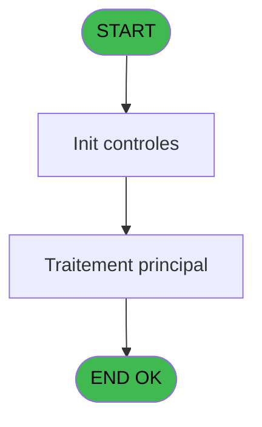
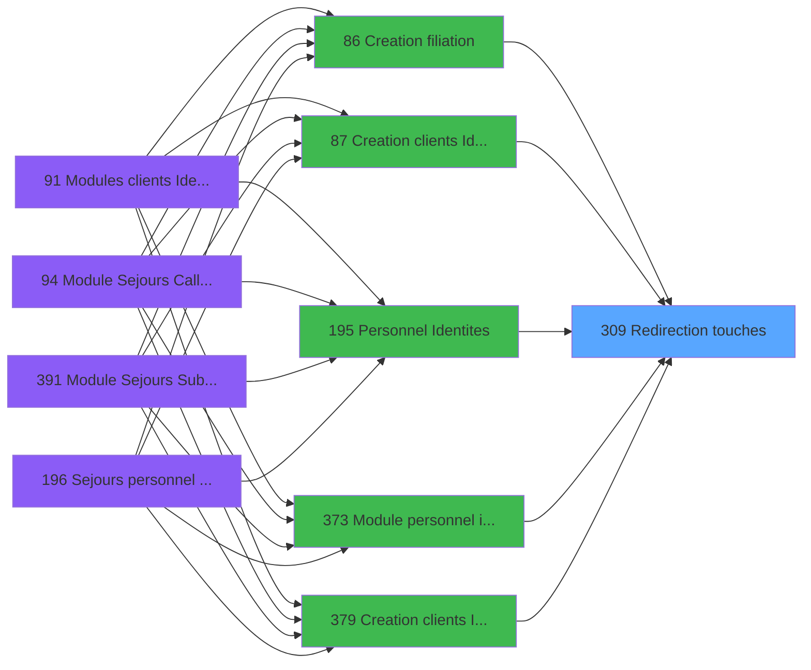

# PBG IDE 309 - Redirection touches

> **Analyse**: Phases 1-4 2026-02-03 11:02 -> 11:03 (17s) | Assemblage 11:03
> **Pipeline**: V7.2 Enrichi
> **Structure**: 4 onglets (Resume | Ecrans | Donnees | Connexions)

<!-- TAB:Resume -->

## 1. FICHE D'IDENTITE

| Attribut | Valeur |
|----------|--------|
| Projet | PBG |
| IDE Position | 309 |
| Nom Programme | Redirection touches |
| Fichier source | `Prg_309.xml` |
| Dossier IDE | General |
| Taches | 1 (0 ecrans visibles) |
| Tables modifiees | 0 |
| Programmes appeles | 0 |

## 2. DESCRIPTION FONCTIONNELLE

**Redirection touches** assure la gestion complete de ce processus, accessible depuis [Creation filiation (IDE 86)](PBG-IDE-86.md), [Creation clients Identite (IDE 87)](PBG-IDE-87.md), [Personnel Identites (IDE 195)](PBG-IDE-195.md), [Module personnel identites (IDE 373)](PBG-IDE-373.md), [Creation clients Identite SAV (IDE 379)](PBG-IDE-379.md), [Creation clients Identite P185 (IDE 382)](PBG-IDE-382.md), [Creation clients Identite PROD (IDE 383)](PBG-IDE-383.md), [Creation clients Identite en c (IDE 384)](PBG-IDE-384.md), [Creation clients Identite SAV* (IDE 386)](PBG-IDE-386.md), [Creation clients Identite_sav (IDE 387)](PBG-IDE-387.md).

Le flux de traitement s'organise en **1 blocs fonctionnels** :

- **Traitement** (1 tache) : traitements metier divers

## 3. BLOCS FONCTIONNELS

### 3.1 Traitement (1 tache)

Traitements internes.

---

#### 309 - Redirection touches

**Role** : Traitement : Redirection touches.

## 5. REGLES METIER

*(Aucune regle metier identifiee)*

## 6. CONTEXTE

- **Appele par**: [Creation filiation (IDE 86)](PBG-IDE-86.md), [Creation clients Identite (IDE 87)](PBG-IDE-87.md), [Personnel Identites (IDE 195)](PBG-IDE-195.md), [Module personnel identites (IDE 373)](PBG-IDE-373.md), [Creation clients Identite SAV (IDE 379)](PBG-IDE-379.md), [Creation clients Identite P185 (IDE 382)](PBG-IDE-382.md), [Creation clients Identite PROD (IDE 383)](PBG-IDE-383.md), [Creation clients Identite en c (IDE 384)](PBG-IDE-384.md), [Creation clients Identite SAV* (IDE 386)](PBG-IDE-386.md), [Creation clients Identite_sav (IDE 387)](PBG-IDE-387.md)
- **Appelle**: 0 programmes | **Tables**: 0 (W:0 R:0 L:0) | **Taches**: 1 | **Expressions**: 0

<!-- TAB:Ecrans -->

## 8. ECRANS

*(Programme sans ecran visible)*

## 9. NAVIGATION

### 9.3 Structure hierarchique (1 tache)

| Position | Tache | Type | Dimensions | Bloc |
|----------|-------|------|------------|------|
| **309.1** | [**Redirection touches** (309)](#t1) | MDI | - | Traitement |

### 9.4 Algorigramme

> **Legende**: Vert = START/END OK | Rouge = END KO | Bleu = Decisions
> *Algorigramme auto-genere. Utiliser `/algorigramme` pour une synthese metier detaillee.*

<!-- TAB:Donnees -->

## 10. TABLES

### Tables utilisees (0)

| ID | Nom | Description | Type | R | W | L | Usages |
|----|-----|-------------|------|---|---|---|--------|

### Colonnes par table (0 / 0 tables avec colonnes identifiees)

## 11. VARIABLES

*(Programme sans variables locales mappees)*

## 12. EXPRESSIONS

**0 / 0 expressions decodees (0%)**

### 12.1 Repartition par type

| Type | Expressions | Regles |
|------|-------------|--------|

### 12.2 Expressions cles par type

<!-- TAB:Connexions -->

## 13. GRAPHE D'APPELS

### 13.1 Chaine depuis Main (Callers)

Main -> ... -> [Creation filiation (IDE 86)](PBG-IDE-86.md) -> **Redirection touches (IDE 309)**

Main -> ... -> [Creation clients Identite (IDE 87)](PBG-IDE-87.md) -> **Redirection touches (IDE 309)**

Main -> ... -> [Personnel Identites (IDE 195)](PBG-IDE-195.md) -> **Redirection touches (IDE 309)**

Main -> ... -> [Module personnel identites (IDE 373)](PBG-IDE-373.md) -> **Redirection touches (IDE 309)**

Main -> ... -> [Creation clients Identite SAV (IDE 379)](PBG-IDE-379.md) -> **Redirection touches (IDE 309)**

Main -> ... -> [Creation clients Identite P185 (IDE 382)](PBG-IDE-382.md) -> **Redirection touches (IDE 309)**

Main -> ... -> [Creation clients Identite PROD (IDE 383)](PBG-IDE-383.md) -> **Redirection touches (IDE 309)**

Main -> ... -> [Creation clients Identite en c (IDE 384)](PBG-IDE-384.md) -> **Redirection touches (IDE 309)**

Main -> ... -> [Creation clients Identite SAV* (IDE 386)](PBG-IDE-386.md) -> **Redirection touches (IDE 309)**

Main -> ... -> [Creation clients Identite_sav (IDE 387)](PBG-IDE-387.md) -> **Redirection touches (IDE 309)**

### 13.2 Callers

| IDE | Nom Programme | Nb Appels |
|-----|---------------|-----------|
| [86](PBG-IDE-86.md) | Creation filiation | 4 |
| [87](PBG-IDE-87.md) | Creation clients Identite | 4 |
| [195](PBG-IDE-195.md) | Personnel Identites | 4 |
| [373](PBG-IDE-373.md) | Module personnel identites | 4 |
| [379](PBG-IDE-379.md) | Creation clients Identite SAV | 4 |
| [382](PBG-IDE-382.md) | Creation clients Identite P185 | 4 |
| [383](PBG-IDE-383.md) | Creation clients Identite PROD | 4 |
| [384](PBG-IDE-384.md) | Creation clients Identite en c | 4 |
| [386](PBG-IDE-386.md) | Creation clients Identite SAV* | 4 |
| [387](PBG-IDE-387.md) | Creation clients Identite_sav | 4 |

### 13.3 Callees (programmes appeles)

### 13.4 Detail Callees avec contexte

| IDE | Nom Programme | Appels | Contexte |
|-----|---------------|--------|----------|
| - | (aucun) | - | - |

## 14. RECOMMANDATIONS MIGRATION

### 14.1 Profil du programme

| Metrique | Valeur | Impact migration |
|----------|--------|-----------------|
| Lignes de logique | 1 | Programme compact |
| Expressions | 0 | Peu de logique |
| Tables WRITE | 0 | Impact faible |
| Sous-programmes | 0 | Peu de dependances |
| Ecrans visibles | 0 | Ecran unique ou traitement batch |
| Code desactive | 0% (0 / 1) | Code sain |
| Regles metier | 0 | Pas de regle identifiee |

### 14.2 Plan de migration par bloc

#### Traitement (1 tache: 0 ecran, 1 traitement)

- **Strategie** : 1 service(s) backend injectable(s) (Domain Services).
- Decomposer les taches en services unitaires testables.

### 14.3 Dependances critiques

| Dependance | Type | Appels | Impact |
|------------|------|--------|--------|

---
*Spec DETAILED generee par Pipeline V7.2 - 2026-02-03 11:03*
