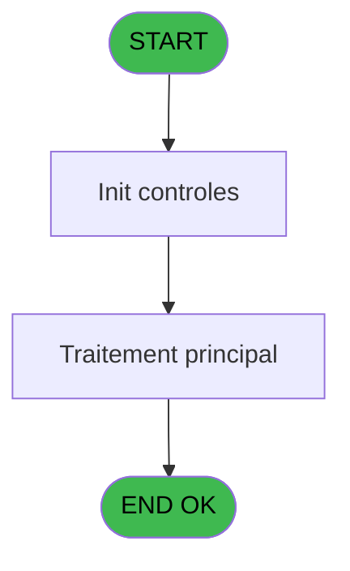
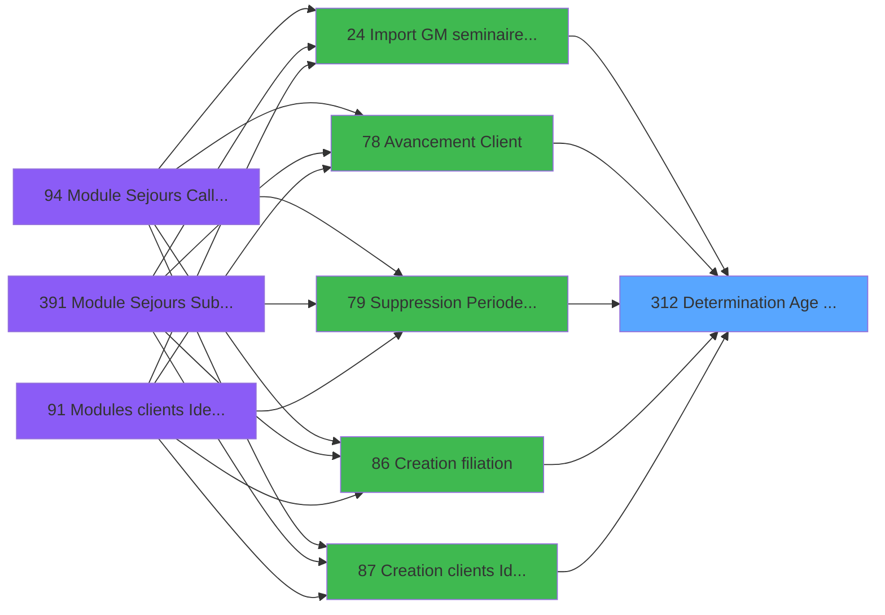

# PBG IDE 312 - Determination Age Debut Sejour

> **Analyse**: Phases 1-4 2026-02-03 11:04 -> 11:04 (18s) | Assemblage 11:04
> **Pipeline**: V7.2 Enrichi
> **Structure**: 4 onglets (Resume | Ecrans | Donnees | Connexions)

<!-- TAB:Resume -->

## 1. FICHE D'IDENTITE

| Attribut | Valeur |
|----------|--------|
| Projet | PBG |
| IDE Position | 312 |
| Nom Programme | Determination Age Debut Sejour |
| Fichier source | `Prg_312.xml` |
| Dossier IDE | General |
| Taches | 1 (0 ecrans visibles) |
| Tables modifiees | 0 |
| Programmes appeles | 0 |

## 2. DESCRIPTION FONCTIONNELLE

**Determination Age Debut Sejour** assure la gestion complete de ce processus, accessible depuis [Modules clients Identite (IDE 91)](PBG-IDE-91.md), [Creation clients Identite (IDE 87)](PBG-IDE-87.md), [Creation clients Identite SAV (IDE 379)](PBG-IDE-379.md), [Creation clients Identite P185 (IDE 382)](PBG-IDE-382.md), [Creation clients Identite PROD (IDE 383)](PBG-IDE-383.md), [Creation clients Identite en c (IDE 384)](PBG-IDE-384.md), [Creation clients Identite SAV* (IDE 386)](PBG-IDE-386.md), [Creation clients Identite_sav (IDE 387)](PBG-IDE-387.md), [Saisie des fiches de police (IDE 93)](PBG-IDE-93.md), [    Fiche de police Brésil (IDE 92)](PBG-IDE-92.md), [ Integrite clients Identite (IDE 346)](PBG-IDE-346.md), [Import GM seminaire via txt (IDE 24)](PBG-IDE-24.md), [   Avancement Client (IDE 78)](PBG-IDE-78.md), [   Suppression Periode Client (IDE 79)](PBG-IDE-79.md), [Creation filiation (IDE 86)](PBG-IDE-86.md), [  Avancement Personnel (IDE 188)](PBG-IDE-188.md), [  Suppression Periode Personn (IDE 189)](PBG-IDE-189.md), [  Creation personnel identites (IDE 194)](PBG-IDE-194.md), [Personnel Identites (IDE 195)](PBG-IDE-195.md), [Transferts ASD (IDE 208)](PBG-IDE-208.md).

Le flux de traitement s'organise en **1 blocs fonctionnels** :

- **Traitement** (1 tache) : traitements metier divers

**Logique metier** : 3 regles identifiees couvrant conditions metier.

## 3. BLOCS FONCTIONNELS

### 3.1 Traitement (1 tache)

Traitements internes.

---

#### 312 - Determination Age

**Role** : Traitement : Determination Age.

## 5. REGLES METIER

3 regles identifiees:

### Autres (3 regles)

#### [RM-001] Si P0-Date debut Sejour [B]='00/00/0000'DATE alors Date () sinon P0-Date debut Sejour [B])

| Element | Detail |
|---------|--------|
| **Condition** | `P0-Date debut Sejour [B]='00/00/0000'DATE` |
| **Si vrai** | Date () |
| **Si faux** | P0-Date debut Sejour [B]) |
| **Variables** | B (P0-Date debut Sejour) |
| **Expression source** | Expression 1 : `IF (P0-Date debut Sejour [B]='00/00/0000'DATE,Date (),P0-Dat` |
| **Exemple** | Si P0-Date debut Sejour [B]='00/00/0000'DATE → Date (). Sinon → P0-Date debut Sejour [B]) |

#### [RM-002] Si P0-Age [C]>100 alors ASCIIChr (200) sinon ASCIIChr (P0-Age [C]+100))

| Element | Detail |
|---------|--------|
| **Condition** | `P0-Age [C]>100` |
| **Si vrai** | ASCIIChr (200) |
| **Si faux** | ASCIIChr (P0-Age [C]+100)) |
| **Variables** | C (P0-Age) |
| **Expression source** | Expression 8 : `IF (P0-Age [C]>100,ASCIIChr (200),ASCIIChr (P0-Age [C]+100))` |
| **Exemple** | Si P0-Age [C]>100 → ASCIIChr (200). Sinon → ASCIIChr (P0-Age [C]+100)) |

#### [RM-003] Si Month (P0-Nb mois [E])<=Month (P0-Date de Naissance [A]) alors Month (P0-Nb mois [E])+12-Month (P0-Date de Naissance [A]) sinon Month (P0-Nb mois [E])-Month (P0-Date de Naissance [A]))

| Element | Detail |
|---------|--------|
| **Condition** | `Month (P0-Nb mois [E])<=Month (P0-Date de Naissance [A])` |
| **Si vrai** | Month (P0-Nb mois [E])+12-Month (P0-Date de Naissance [A]) |
| **Si faux** | Month (P0-Nb mois [E])-Month (P0-Date de Naissance [A])) |
| **Variables** | A (P0-Date de Naissance), E (P0-Nb mois) |
| **Expression source** | Expression 10 : `IF (Month (P0-Nb mois [E])<=Month (P0-Date de Naissance [A])` |
| **Exemple** | Si Month (P0-Nb mois [E])<=Month (P0-Date de Naissance [A]) → Month (P0-Nb mois [E])+12-Month (P0-Date de Naissance [A]). Sinon → Month (P0-Nb mois [E])-Month (P0-Date de Naissance [A])) |

## 6. CONTEXTE

- **Appele par**: [Modules clients Identite (IDE 91)](PBG-IDE-91.md), [Creation clients Identite (IDE 87)](PBG-IDE-87.md), [Creation clients Identite SAV (IDE 379)](PBG-IDE-379.md), [Creation clients Identite P185 (IDE 382)](PBG-IDE-382.md), [Creation clients Identite PROD (IDE 383)](PBG-IDE-383.md), [Creation clients Identite en c (IDE 384)](PBG-IDE-384.md), [Creation clients Identite SAV* (IDE 386)](PBG-IDE-386.md), [Creation clients Identite_sav (IDE 387)](PBG-IDE-387.md), [Saisie des fiches de police (IDE 93)](PBG-IDE-93.md), [    Fiche de police Brésil (IDE 92)](PBG-IDE-92.md), [ Integrite clients Identite (IDE 346)](PBG-IDE-346.md), [Import GM seminaire via txt (IDE 24)](PBG-IDE-24.md), [   Avancement Client (IDE 78)](PBG-IDE-78.md), [   Suppression Periode Client (IDE 79)](PBG-IDE-79.md), [Creation filiation (IDE 86)](PBG-IDE-86.md), [  Avancement Personnel (IDE 188)](PBG-IDE-188.md), [  Suppression Periode Personn (IDE 189)](PBG-IDE-189.md), [  Creation personnel identites (IDE 194)](PBG-IDE-194.md), [Personnel Identites (IDE 195)](PBG-IDE-195.md), [Transferts ASD (IDE 208)](PBG-IDE-208.md)
- **Appelle**: 0 programmes | **Tables**: 0 (W:0 R:0 L:0) | **Taches**: 1 | **Expressions**: 23

<!-- TAB:Ecrans -->

## 8. ECRANS

*(Programme sans ecran visible)*

## 9. NAVIGATION

### 9.3 Structure hierarchique (1 tache)

| Position | Tache | Type | Dimensions | Bloc |
|----------|-------|------|------------|------|
| **312.1** | [**Determination Age** (312)](#t1) | MDI | - | Traitement |

### 9.4 Algorigramme

> **Legende**: Vert = START/END OK | Rouge = END KO | Bleu = Decisions
> *Algorigramme auto-genere. Utiliser `/algorigramme` pour une synthese metier detaillee.*

<!-- TAB:Donnees -->

## 10. TABLES

### Tables utilisees (0)

| ID | Nom | Description | Type | R | W | L | Usages |
|----|-----|-------------|------|---|---|---|--------|

### Colonnes par table (0 / 0 tables avec colonnes identifiees)

## 11. VARIABLES

### 11.1 Variables de travail (2)

Variables internes au programme.

| Lettre | Nom | Type | Usage dans |
|--------|-----|------|-----------|
| F | W0 Date debut sejour | Date | 4x calcul interne |
| G | W0 Nb de Mois | Numeric | 1x calcul interne |

### 11.2 Autres (6)

Variables diverses.

| Lettre | Nom | Type | Usage dans |
|--------|-----|------|-----------|
| A | P0-Date de Naissance | Date | 8x refs |
| B | P0-Date debut Sejour | Date | 1x refs |
| C | P0-Age | Numeric | 5x refs |
| D | P0-Age Codifie | Alpha | - |
| E | P0-Nb mois | Numeric | 5x refs |
| H | W0-Fin de Tache | Alpha | - |

## 12. EXPRESSIONS

**23 / 23 expressions decodees (100%)**

### 12.1 Repartition par type

| Type | Expressions | Regles |
|------|-------------|--------|
| CALCULATION | 4 | 0 |
| CONDITION | 13 | 3 |
| CONSTANTE | 4 | 0 |
| OTHER | 2 | 0 |

### 12.2 Expressions cles par type

#### CALCULATION (4 expressions)

| Type | IDE | Expression | Regle |
|------|-----|------------|-------|
| CALCULATION | 12 | `W0 Date debut sejour [F]-1` | - |
| CALCULATION | 15 | `ASCIIChr (80+W0 Date debut sejour [F])` | - |
| CALCULATION | 3 | `Year (P0-Nb mois [E])-Year (P0-Date de Naissance [A])` | - |
| CALCULATION | 5 | `P0-Age [C]-1` | - |

#### CONDITION (13 expressions)

| Type | IDE | Expression | Regle |
|------|-----|------------|-------|
| CONDITION | 8 | `IF (P0-Age [C]>100,ASCIIChr (200),ASCIIChr (P0-Age [C]+100))` | [RM-002](#rm-RM-002) |
| CONDITION | 1 | `IF (P0-Date debut Sejour [B]='00/00/0000'DATE,Date (),P0-Date debut Sejour [B])` | [RM-001](#rm-RM-001) |
| CONDITION | 10 | `IF (Month (P0-Nb mois [E])<=Month (P0-Date de Naissance [A]),Month (P0-Nb mois [E])+12-Month (P0-Date de Naissance [A]),Month (P0-Nb mois [E])-Month (P0-Date de Naissance [A]))` | [RM-003](#rm-RM-003) |
| CONDITION | 11 | `Day (P0-Nb mois [E])<Day (P0-Date de Naissance [A])` | - |
| CONDITION | 9 | `P0-Age [C]=0` | - |
| ... | | *+8 autres* | |

#### CONSTANTE (4 expressions)

| Type | IDE | Expression | Regle |
|------|-----|------------|-------|
| CONSTANTE | 19 | `'F'` | - |
| CONSTANTE | 22 | `40` | - |
| CONSTANTE | 14 | `1` | - |
| CONSTANTE | 17 | `0` | - |

#### OTHER (2 expressions)

| Type | IDE | Expression | Regle |
|------|-----|------------|-------|
| OTHER | 23 | `W0 Date debut sejour [F]` | - |
| OTHER | 18 | `ASCIIChr (80)` | - |

### 12.3 Toutes les expressions (23)

Voir les 23 expressions

#### CALCULATION (4)

| IDE | Expression Decodee |
|-----|-------------------|
| 3 | `Year (P0-Nb mois [E])-Year (P0-Date de Naissance [A])` |
| 5 | `P0-Age [C]-1` |
| 12 | `W0 Date debut sejour [F]-1` |
| 15 | `ASCIIChr (80+W0 Date debut sejour [F])` |

#### CONDITION (13)

| IDE | Expression Decodee |
|-----|-------------------|
| 21 | `P0-Age [C]=0 AND P0-Date de Naissance [A]='00/00/0000'DATE` |
| 1 | `IF (P0-Date debut Sejour [B]='00/00/0000'DATE,Date (),P0-Date debut Sejour [B])` |
| 8 | `IF (P0-Age [C]>100,ASCIIChr (200),ASCIIChr (P0-Age [C]+100))` |
| 10 | `IF (Month (P0-Nb mois [E])<=Month (P0-Date de Naissance [A]),Month (P0-Nb mois [E])+12-Month (P0-Date de Naissance [A]),Month (P0-Nb mois [E])-Month (P0-Date de Naissance [A]))` |
| 2 | `P0-Date de Naissance [A]>0` |
| 4 | `Month (P0-Nb mois [E])<Month (P0-Date de Naissance [A])` |
| 6 | `Month (P0-Nb mois [E])=Month (P0-Date de Naissance [A]) AND Day (P0-Nb mois [E])<Day (P0-Date de Naissance [A])` |
| 7 | `P0-Age [C]>0` |
| 9 | `P0-Age [C]=0` |
| 11 | `Day (P0-Nb mois [E])<Day (P0-Date de Naissance [A])` |
| 13 | `W0 Date debut sejour [F]=0 OR W0 Date debut sejour [F]=12` |
| 16 | `P0-Date de Naissance [A]<=0` |
| 20 | `W0 Nb de Mois [G]='F'` |

#### CONSTANTE (4)

| IDE | Expression Decodee |
|-----|-------------------|
| 14 | `1` |
| 17 | `0` |
| 19 | `'F'` |
| 22 | `40` |

#### OTHER (2)

| IDE | Expression Decodee |
|-----|-------------------|
| 18 | `ASCIIChr (80)` |
| 23 | `W0 Date debut sejour [F]` |

<!-- TAB:Connexions -->

## 13. GRAPHE D'APPELS

### 13.1 Chaine depuis Main (Callers)

Main -> ... -> [Modules clients Identite (IDE 91)](PBG-IDE-91.md) -> **Determination Age Debut Sejour (IDE 312)**

Main -> ... -> [Creation clients Identite (IDE 87)](PBG-IDE-87.md) -> **Determination Age Debut Sejour (IDE 312)**

Main -> ... -> [Creation clients Identite SAV (IDE 379)](PBG-IDE-379.md) -> **Determination Age Debut Sejour (IDE 312)**

Main -> ... -> [Creation clients Identite P185 (IDE 382)](PBG-IDE-382.md) -> **Determination Age Debut Sejour (IDE 312)**

Main -> ... -> [Creation clients Identite PROD (IDE 383)](PBG-IDE-383.md) -> **Determination Age Debut Sejour (IDE 312)**

Main -> ... -> [Creation clients Identite en c (IDE 384)](PBG-IDE-384.md) -> **Determination Age Debut Sejour (IDE 312)**

Main -> ... -> [Creation clients Identite SAV* (IDE 386)](PBG-IDE-386.md) -> **Determination Age Debut Sejour (IDE 312)**

Main -> ... -> [Creation clients Identite_sav (IDE 387)](PBG-IDE-387.md) -> **Determination Age Debut Sejour (IDE 312)**

Main -> ... -> [Saisie des fiches de police (IDE 93)](PBG-IDE-93.md) -> **Determination Age Debut Sejour (IDE 312)**

Main -> ... -> [    Fiche de police Brésil (IDE 92)](PBG-IDE-92.md) -> **Determination Age Debut Sejour (IDE 312)**

Main -> ... -> [ Integrite clients Identite (IDE 346)](PBG-IDE-346.md) -> **Determination Age Debut Sejour (IDE 312)**

Main -> ... -> [Import GM seminaire via txt (IDE 24)](PBG-IDE-24.md) -> **Determination Age Debut Sejour (IDE 312)**

Main -> ... -> [   Avancement Client (IDE 78)](PBG-IDE-78.md) -> **Determination Age Debut Sejour (IDE 312)**

Main -> ... -> [   Suppression Periode Client (IDE 79)](PBG-IDE-79.md) -> **Determination Age Debut Sejour (IDE 312)**

Main -> ... -> [Creation filiation (IDE 86)](PBG-IDE-86.md) -> **Determination Age Debut Sejour (IDE 312)**

Main -> ... -> [  Avancement Personnel (IDE 188)](PBG-IDE-188.md) -> **Determination Age Debut Sejour (IDE 312)**

Main -> ... -> [  Suppression Periode Personn (IDE 189)](PBG-IDE-189.md) -> **Determination Age Debut Sejour (IDE 312)**

Main -> ... -> [  Creation personnel identites (IDE 194)](PBG-IDE-194.md) -> **Determination Age Debut Sejour (IDE 312)**

Main -> ... -> [Personnel Identites (IDE 195)](PBG-IDE-195.md) -> **Determination Age Debut Sejour (IDE 312)**

Main -> ... -> [Transferts ASD (IDE 208)](PBG-IDE-208.md) -> **Determination Age Debut Sejour (IDE 312)**

### 13.2 Callers

| IDE | Nom Programme | Nb Appels |
|-----|---------------|-----------|
| [91](PBG-IDE-91.md) | Modules clients Identite | 5 |
| [87](PBG-IDE-87.md) | Creation clients Identite | 4 |
| [379](PBG-IDE-379.md) | Creation clients Identite SAV | 4 |
| [382](PBG-IDE-382.md) | Creation clients Identite P185 | 4 |
| [383](PBG-IDE-383.md) | Creation clients Identite PROD | 4 |
| [384](PBG-IDE-384.md) | Creation clients Identite en c | 4 |
| [386](PBG-IDE-386.md) | Creation clients Identite SAV* | 4 |
| [387](PBG-IDE-387.md) | Creation clients Identite_sav | 4 |
| [93](PBG-IDE-93.md) | Saisie des fiches de police | 3 |
| [92](PBG-IDE-92.md) |     Fiche de police Brésil | 2 |
| [346](PBG-IDE-346.md) |  Integrite clients Identite | 2 |
| [24](PBG-IDE-24.md) | Import GM seminaire via txt | 1 |
| [78](PBG-IDE-78.md) |    Avancement Client | 1 |
| [79](PBG-IDE-79.md) |    Suppression Periode Client | 1 |
| [86](PBG-IDE-86.md) | Creation filiation | 1 |
| [188](PBG-IDE-188.md) |   Avancement Personnel | 1 |
| [189](PBG-IDE-189.md) |   Suppression Periode Personn | 1 |
| [194](PBG-IDE-194.md) |   Creation personnel identites | 1 |
| [195](PBG-IDE-195.md) | Personnel Identites | 1 |
| [208](PBG-IDE-208.md) | Transferts ASD | 1 |

### 13.3 Callees (programmes appeles)

### 13.4 Detail Callees avec contexte

| IDE | Nom Programme | Appels | Contexte |
|-----|---------------|--------|----------|
| - | (aucun) | - | - |

## 14. RECOMMANDATIONS MIGRATION

### 14.1 Profil du programme

| Metrique | Valeur | Impact migration |
|----------|--------|-----------------|
| Lignes de logique | 44 | Programme compact |
| Expressions | 23 | Peu de logique |
| Tables WRITE | 0 | Impact faible |
| Sous-programmes | 0 | Peu de dependances |
| Ecrans visibles | 0 | Ecran unique ou traitement batch |
| Code desactive | 0% (0 / 44) | Code sain |
| Regles metier | 3 | Quelques regles a preserver |

### 14.2 Plan de migration par bloc

#### Traitement (1 tache: 0 ecran, 1 traitement)

- **Strategie** : 1 service(s) backend injectable(s) (Domain Services).
- Decomposer les taches en services unitaires testables.

### 14.3 Dependances critiques

| Dependance | Type | Appels | Impact |
|------------|------|--------|--------|

---
*Spec DETAILED generee par Pipeline V7.2 - 2026-02-03 11:04*
