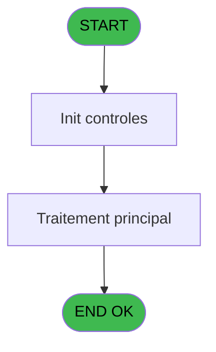
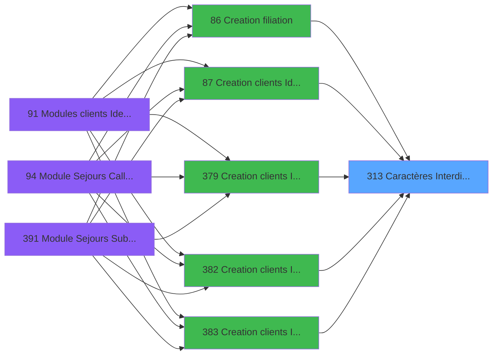

# PBG IDE 313 - Caractères Interdits (A20) - L

> **Analyse**: Phases 1-4 2026-02-03 11:04 -> 11:04 (19s) | Assemblage 11:04
> **Pipeline**: V7.2 Enrichi
> **Structure**: 4 onglets (Resume | Ecrans | Donnees | Connexions)

<!-- TAB:Resume -->

## 1. FICHE D'IDENTITE

| Attribut | Valeur |
|----------|--------|
| Projet | PBG |
| IDE Position | 313 |
| Nom Programme | Caractères Interdits (A20) - L |
| Fichier source | `Prg_313.xml` |
| Dossier IDE | General |
| Taches | 2 (0 ecrans visibles) |
| Tables modifiees | 0 |
| Programmes appeles | 0 |

## 2. DESCRIPTION FONCTIONNELLE

**Caractères Interdits (A20) - L** assure la gestion complete de ce processus, accessible depuis [Creation filiation (IDE 86)](PBG-IDE-86.md), [Creation clients Identite (IDE 87)](PBG-IDE-87.md), [Creation clients Identite SAV (IDE 379)](PBG-IDE-379.md), [Creation clients Identite P185 (IDE 382)](PBG-IDE-382.md), [Creation clients Identite PROD (IDE 383)](PBG-IDE-383.md), [Creation clients Identite en c (IDE 384)](PBG-IDE-384.md), [Creation clients Identite SAV* (IDE 386)](PBG-IDE-386.md), [Creation clients Identite_sav (IDE 387)](PBG-IDE-387.md).

Le flux de traitement s'organise en **2 blocs fonctionnels** :

- **Validation** (1 tache) : controles et verifications de coherence
- **Traitement** (1 tache) : traitements metier divers

Detail : phases du traitement

#### Phase 1 : Traitement (1 tache)

- **313** - Caractères Interdits

#### Phase 2 : Validation (1 tache)

- **313.1** - Verification Chaine

## 3. BLOCS FONCTIONNELS

### 3.1 Traitement (1 tache)

Traitements internes.

---

#### 313 - Caractères Interdits

**Role** : Traitement : Caractères Interdits.

### 3.2 Validation (1 tache)

Controles de coherence : 1 tache verifie les donnees et conditions.

---

#### 313.1 - Verification Chaine

**Role** : Verification : Verification Chaine.
**Variables liees** : A (P0-Chaine caractere)

## 5. REGLES METIER

*(Aucune regle metier identifiee)*

## 6. CONTEXTE

- **Appele par**: [Creation filiation (IDE 86)](PBG-IDE-86.md), [Creation clients Identite (IDE 87)](PBG-IDE-87.md), [Creation clients Identite SAV (IDE 379)](PBG-IDE-379.md), [Creation clients Identite P185 (IDE 382)](PBG-IDE-382.md), [Creation clients Identite PROD (IDE 383)](PBG-IDE-383.md), [Creation clients Identite en c (IDE 384)](PBG-IDE-384.md), [Creation clients Identite SAV* (IDE 386)](PBG-IDE-386.md), [Creation clients Identite_sav (IDE 387)](PBG-IDE-387.md)
- **Appelle**: 0 programmes | **Tables**: 0 (W:0 R:0 L:0) | **Taches**: 2 | **Expressions**: 4

<!-- TAB:Ecrans -->

## 8. ECRANS

*(Programme sans ecran visible)*

## 9. NAVIGATION

### 9.3 Structure hierarchique (2 taches)

| Position | Tache | Type | Dimensions | Bloc |
|----------|-------|------|------------|------|
| **313.1** | [**Caractères Interdits** (313)](#t1) | MDI | - | Traitement |
| **313.2** | [**Verification Chaine** (313.1)](#t2) | MDI | - | Validation |

### 9.4 Algorigramme

> **Legende**: Vert = START/END OK | Rouge = END KO | Bleu = Decisions
> *Algorigramme auto-genere. Utiliser `/algorigramme` pour une synthese metier detaillee.*

<!-- TAB:Donnees -->

## 10. TABLES

### Tables utilisees (0)

| ID | Nom | Description | Type | R | W | L | Usages |
|----|-----|-------------|------|---|---|---|--------|

### Colonnes par table (0 / 0 tables avec colonnes identifiees)

## 11. VARIABLES

### 11.1 Autres (3)

Variables diverses.

| Lettre | Nom | Type | Usage dans |
|--------|-----|------|-----------|
| A | P0-Chaine caractere | Alpha | - |
| B | P0-Accord Suite | Logical | - |
| C | W0-Code B014 | Alpha | - |

## 12. EXPRESSIONS

**4 / 4 expressions decodees (100%)**

### 12.1 Repartition par type

| Type | Expressions | Regles |
|------|-------------|--------|
| CONCATENATION | 1 | 0 |
| CONSTANTE | 1 | 0 |
| CAST_LOGIQUE | 2 | 0 |

### 12.2 Expressions cles par type

#### CONCATENATION (1 expressions)

| Type | IDE | Expression | Regle |
|------|-----|------------|-------|
| CONCATENATION | 4 | `InStr ('ABCDEFGHIJKLMNOPQRSTUVWXYZ-'&ASCIIChr (32)&ASCIIChr (39),MID ({1,1},Counter (0),1))=0` | - |

#### CONSTANTE (1 expressions)

| Type | IDE | Expression | Regle |
|------|-----|------------|-------|
| CONSTANTE | 1 | `'B014'` | - |

#### CAST_LOGIQUE (2 expressions)

| Type | IDE | Expression | Regle |
|------|-----|------------|-------|
| CAST_LOGIQUE | 3 | `'FALSE'LOG` | - |
| CAST_LOGIQUE | 2 | `'TRUE'LOG` | - |

<!-- TAB:Connexions -->

## 13. GRAPHE D'APPELS

### 13.1 Chaine depuis Main (Callers)

Main -> ... -> [Creation filiation (IDE 86)](PBG-IDE-86.md) -> **Caractères Interdits (A20) - L (IDE 313)**

Main -> ... -> [Creation clients Identite (IDE 87)](PBG-IDE-87.md) -> **Caractères Interdits (A20) - L (IDE 313)**

Main -> ... -> [Creation clients Identite SAV (IDE 379)](PBG-IDE-379.md) -> **Caractères Interdits (A20) - L (IDE 313)**

Main -> ... -> [Creation clients Identite P185 (IDE 382)](PBG-IDE-382.md) -> **Caractères Interdits (A20) - L (IDE 313)**

Main -> ... -> [Creation clients Identite PROD (IDE 383)](PBG-IDE-383.md) -> **Caractères Interdits (A20) - L (IDE 313)**

Main -> ... -> [Creation clients Identite en c (IDE 384)](PBG-IDE-384.md) -> **Caractères Interdits (A20) - L (IDE 313)**

Main -> ... -> [Creation clients Identite SAV* (IDE 386)](PBG-IDE-386.md) -> **Caractères Interdits (A20) - L (IDE 313)**

Main -> ... -> [Creation clients Identite_sav (IDE 387)](PBG-IDE-387.md) -> **Caractères Interdits (A20) - L (IDE 313)**

### 13.2 Callers

| IDE | Nom Programme | Nb Appels |
|-----|---------------|-----------|
| [86](PBG-IDE-86.md) | Creation filiation | 1 |
| [87](PBG-IDE-87.md) | Creation clients Identite | 1 |
| [379](PBG-IDE-379.md) | Creation clients Identite SAV | 1 |
| [382](PBG-IDE-382.md) | Creation clients Identite P185 | 1 |
| [383](PBG-IDE-383.md) | Creation clients Identite PROD | 1 |
| [384](PBG-IDE-384.md) | Creation clients Identite en c | 1 |
| [386](PBG-IDE-386.md) | Creation clients Identite SAV* | 1 |
| [387](PBG-IDE-387.md) | Creation clients Identite_sav | 1 |

### 13.3 Callees (programmes appeles)

### 13.4 Detail Callees avec contexte

| IDE | Nom Programme | Appels | Contexte |
|-----|---------------|--------|----------|
| - | (aucun) | - | - |

## 14. RECOMMANDATIONS MIGRATION

### 14.1 Profil du programme

| Metrique | Valeur | Impact migration |
|----------|--------|-----------------|
| Lignes de logique | 11 | Programme compact |
| Expressions | 4 | Peu de logique |
| Tables WRITE | 0 | Impact faible |
| Sous-programmes | 0 | Peu de dependances |
| Ecrans visibles | 0 | Ecran unique ou traitement batch |
| Code desactive | 0% (0 / 11) | Code sain |
| Regles metier | 0 | Pas de regle identifiee |

### 14.2 Plan de migration par bloc

#### Traitement (1 tache: 0 ecran, 1 traitement)

- **Strategie** : 1 service(s) backend injectable(s) (Domain Services).
- Decomposer les taches en services unitaires testables.

#### Validation (1 tache: 0 ecran, 1 traitement)

- **Strategie** : FluentValidation avec validators specifiques.
- Chaque tache de validation -> un validator injectable

### 14.3 Dependances critiques

| Dependance | Type | Appels | Impact |
|------------|------|--------|--------|

---
*Spec DETAILED generee par Pipeline V7.2 - 2026-02-03 11:04*
