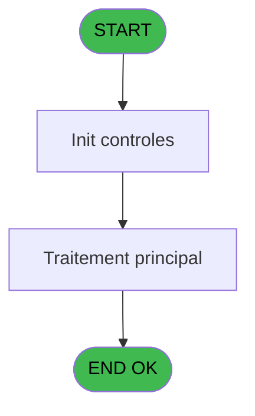
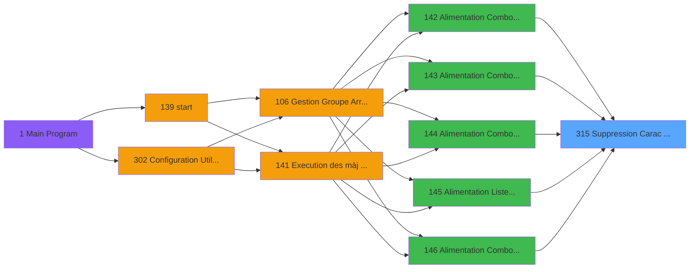

# PBG IDE 315 - Suppression Carac interdit

> **Analyse**: Phases 1-4 2026-02-03 11:05 -> 11:05 (18s) | Assemblage 11:05
> **Pipeline**: V7.2 Enrichi
> **Structure**: 4 onglets (Resume | Ecrans | Donnees | Connexions)

<!-- TAB:Resume -->

## 1. FICHE D'IDENTITE

| Attribut | Valeur |
|----------|--------|
| Projet | PBG |
| IDE Position | 315 |
| Nom Programme | Suppression Carac interdit |
| Fichier source | `Prg_315.xml` |
| Dossier IDE | General |
| Taches | 1 (0 ecrans visibles) |
| Tables modifiees | 0 |
| Programmes appeles | 0 |

## 2. DESCRIPTION FONCTIONNELLE

**Suppression Carac interdit** assure la gestion complete de ce processus, accessible depuis [  Alimentation Combo Rais. Abs (IDE 144)](PBG-IDE-144.md), [  Alimentation Combo VOL/creat (IDE 306)](PBG-IDE-306.md), [  Alimentation Combo HEURE (IDE 142)](PBG-IDE-142.md), [  Alimentation Combo TRANSPORT (IDE 143)](PBG-IDE-143.md), [  Alimentation Liste Handicap (IDE 145)](PBG-IDE-145.md), [  Alimentation Combo Type Mill (IDE 146)](PBG-IDE-146.md), [  Alim Combo code fidelisation (IDE 147)](PBG-IDE-147.md), [  Alimentation Combos VIP (IDE 148)](PBG-IDE-148.md), [  Alimentation Combos MODIF VA (IDE 149)](PBG-IDE-149.md), [  Alimentation Combos U/P (IDE 150)](PBG-IDE-150.md), [  Alimentation Combos NATION P (IDE 151)](PBG-IDE-151.md), [  Alimentation Combos NATIONAL (IDE 152)](PBG-IDE-152.md), [  Alimentation Combos INSCRIPT (IDE 153)](PBG-IDE-153.md), [  Alimentation Combos LIEU SEJ (IDE 154)](PBG-IDE-154.md), [  Alimentation Combos LANGUE (IDE 155)](PBG-IDE-155.md), [  Alimentation Combos CHOIX (IDE 156)](PBG-IDE-156.md), [  Alimentation Combos FUMEUR (IDE 157)](PBG-IDE-157.md), [  Alimentation Combos FLEURS (IDE 158)](PBG-IDE-158.md), [  Alimentation Combos CONTRAT (IDE 159)](PBG-IDE-159.md), [  Alimentation Combos BASE OCC (IDE 160)](PBG-IDE-160.md).

Le flux de traitement s'organise en **1 blocs fonctionnels** :

- **Traitement** (1 tache) : traitements metier divers

## 3. BLOCS FONCTIONNELS

### 3.1 Traitement (1 tache)

Traitements internes.

---

#### 315 - Suppression Carac interdit

**Role** : Traitement : Suppression Carac interdit.

## 5. REGLES METIER

*(Aucune regle metier identifiee)*

## 6. CONTEXTE

- **Appele par**: [  Alimentation Combo Rais. Abs (IDE 144)](PBG-IDE-144.md), [  Alimentation Combo VOL/creat (IDE 306)](PBG-IDE-306.md), [  Alimentation Combo HEURE (IDE 142)](PBG-IDE-142.md), [  Alimentation Combo TRANSPORT (IDE 143)](PBG-IDE-143.md), [  Alimentation Liste Handicap (IDE 145)](PBG-IDE-145.md), [  Alimentation Combo Type Mill (IDE 146)](PBG-IDE-146.md), [  Alim Combo code fidelisation (IDE 147)](PBG-IDE-147.md), [  Alimentation Combos VIP (IDE 148)](PBG-IDE-148.md), [  Alimentation Combos MODIF VA (IDE 149)](PBG-IDE-149.md), [  Alimentation Combos U/P (IDE 150)](PBG-IDE-150.md), [  Alimentation Combos NATION P (IDE 151)](PBG-IDE-151.md), [  Alimentation Combos NATIONAL (IDE 152)](PBG-IDE-152.md), [  Alimentation Combos INSCRIPT (IDE 153)](PBG-IDE-153.md), [  Alimentation Combos LIEU SEJ (IDE 154)](PBG-IDE-154.md), [  Alimentation Combos LANGUE (IDE 155)](PBG-IDE-155.md), [  Alimentation Combos CHOIX (IDE 156)](PBG-IDE-156.md), [  Alimentation Combos FUMEUR (IDE 157)](PBG-IDE-157.md), [  Alimentation Combos FLEURS (IDE 158)](PBG-IDE-158.md), [  Alimentation Combos CONTRAT (IDE 159)](PBG-IDE-159.md), [  Alimentation Combos BASE OCC (IDE 160)](PBG-IDE-160.md)
- **Appelle**: 0 programmes | **Tables**: 0 (W:0 R:0 L:0) | **Taches**: 1 | **Expressions**: 3

<!-- TAB:Ecrans -->

## 8. ECRANS

*(Programme sans ecran visible)*

## 9. NAVIGATION

### 9.3 Structure hierarchique (1 tache)

| Position | Tache | Type | Dimensions | Bloc |
|----------|-------|------|------------|------|
| **315.1** | [**Suppression Carac interdit** (315)](#t1) | MDI | - | Traitement |

### 9.4 Algorigramme

> **Legende**: Vert = START/END OK | Rouge = END KO | Bleu = Decisions
> *Algorigramme auto-genere. Utiliser `/algorigramme` pour une synthese metier detaillee.*

<!-- TAB:Donnees -->

## 10. TABLES

### Tables utilisees (0)

| ID | Nom | Description | Type | R | W | L | Usages |
|----|-----|-------------|------|---|---|---|--------|

### Colonnes par table (0 / 0 tables avec colonnes identifiees)

## 11. VARIABLES

*(Programme sans variables locales mappees)*

## 12. EXPRESSIONS

**3 / 3 expressions decodees (100%)**

### 12.1 Repartition par type

| Type | Expressions | Regles |
|------|-------------|--------|
| CONDITION | 1 | 0 |
| CONCATENATION | 1 | 0 |
| FORMAT | 1 | 0 |

### 12.2 Expressions cles par type

#### CONDITION (1 expressions)

| Type | IDE | Expression | Regle |
|------|-----|------------|-------|
| CONDITION | 1 | `InStr (< v. combo [A],'-')<>0` | - |

#### CONCATENATION (1 expressions)

| Type | IDE | Expression | Regle |
|------|-----|------------|-------|
| CONCATENATION | 2 | `Left (< v. combo [A],InStr (< v. combo [A],'-')-1)&'_'&Right (< v. combo [A],Len (< v. combo [A])-InStr (< v. combo [A],'-'))` | - |

#### FORMAT (1 expressions)

| Type | IDE | Expression | Regle |
|------|-----|------------|-------|
| FORMAT | 3 | `RepStr(< v. combo [A],'-','_')` | - |

<!-- TAB:Connexions -->

## 13. GRAPHE D'APPELS

### 13.1 Chaine depuis Main (Callers)

Main -> ... -> [  Alimentation Combo Rais. Abs (IDE 144)](PBG-IDE-144.md) -> **Suppression Carac interdit (IDE 315)**

Main -> ... -> [  Alimentation Combo VOL/creat (IDE 306)](PBG-IDE-306.md) -> **Suppression Carac interdit (IDE 315)**

Main -> ... -> [  Alimentation Combo HEURE (IDE 142)](PBG-IDE-142.md) -> **Suppression Carac interdit (IDE 315)**

Main -> ... -> [  Alimentation Combo TRANSPORT (IDE 143)](PBG-IDE-143.md) -> **Suppression Carac interdit (IDE 315)**

Main -> ... -> [  Alimentation Liste Handicap (IDE 145)](PBG-IDE-145.md) -> **Suppression Carac interdit (IDE 315)**

Main -> ... -> [  Alimentation Combo Type Mill (IDE 146)](PBG-IDE-146.md) -> **Suppression Carac interdit (IDE 315)**

Main -> ... -> [  Alim Combo code fidelisation (IDE 147)](PBG-IDE-147.md) -> **Suppression Carac interdit (IDE 315)**

Main -> ... -> [  Alimentation Combos VIP (IDE 148)](PBG-IDE-148.md) -> **Suppression Carac interdit (IDE 315)**

Main -> ... -> [  Alimentation Combos MODIF VA (IDE 149)](PBG-IDE-149.md) -> **Suppression Carac interdit (IDE 315)**

Main -> ... -> [  Alimentation Combos U/P (IDE 150)](PBG-IDE-150.md) -> **Suppression Carac interdit (IDE 315)**

Main -> ... -> [  Alimentation Combos NATION P (IDE 151)](PBG-IDE-151.md) -> **Suppression Carac interdit (IDE 315)**

Main -> ... -> [  Alimentation Combos NATIONAL (IDE 152)](PBG-IDE-152.md) -> **Suppression Carac interdit (IDE 315)**

Main -> ... -> [  Alimentation Combos INSCRIPT (IDE 153)](PBG-IDE-153.md) -> **Suppression Carac interdit (IDE 315)**

Main -> ... -> [  Alimentation Combos LIEU SEJ (IDE 154)](PBG-IDE-154.md) -> **Suppression Carac interdit (IDE 315)**

Main -> ... -> [  Alimentation Combos LANGUE (IDE 155)](PBG-IDE-155.md) -> **Suppression Carac interdit (IDE 315)**

Main -> ... -> [  Alimentation Combos CHOIX (IDE 156)](PBG-IDE-156.md) -> **Suppression Carac interdit (IDE 315)**

Main -> ... -> [  Alimentation Combos FUMEUR (IDE 157)](PBG-IDE-157.md) -> **Suppression Carac interdit (IDE 315)**

Main -> ... -> [  Alimentation Combos FLEURS (IDE 158)](PBG-IDE-158.md) -> **Suppression Carac interdit (IDE 315)**

Main -> ... -> [  Alimentation Combos CONTRAT (IDE 159)](PBG-IDE-159.md) -> **Suppression Carac interdit (IDE 315)**

Main -> ... -> [  Alimentation Combos BASE OCC (IDE 160)](PBG-IDE-160.md) -> **Suppression Carac interdit (IDE 315)**

### 13.2 Callers

| IDE | Nom Programme | Nb Appels |
|-----|---------------|-----------|
| [144](PBG-IDE-144.md) |   Alimentation Combo Rais. Abs | 2 |
| [306](PBG-IDE-306.md) |   Alimentation Combo VOL/creat | 2 |
| [142](PBG-IDE-142.md) |   Alimentation Combo HEURE | 1 |
| [143](PBG-IDE-143.md) |   Alimentation Combo TRANSPORT | 1 |
| [145](PBG-IDE-145.md) |   Alimentation Liste Handicap | 1 |
| [146](PBG-IDE-146.md) |   Alimentation Combo Type Mill | 1 |
| [147](PBG-IDE-147.md) |   Alim Combo code fidelisation | 1 |
| [148](PBG-IDE-148.md) |   Alimentation Combos VIP | 1 |
| [149](PBG-IDE-149.md) |   Alimentation Combos MODIF VA | 1 |
| [150](PBG-IDE-150.md) |   Alimentation Combos U/P | 1 |
| [151](PBG-IDE-151.md) |   Alimentation Combos NATION P | 1 |
| [152](PBG-IDE-152.md) |   Alimentation Combos NATIONAL | 1 |
| [153](PBG-IDE-153.md) |   Alimentation Combos INSCRIPT | 1 |
| [154](PBG-IDE-154.md) |   Alimentation Combos LIEU SEJ | 1 |
| [155](PBG-IDE-155.md) |   Alimentation Combos LANGUE | 1 |
| [156](PBG-IDE-156.md) |   Alimentation Combos CHOIX | 1 |
| [157](PBG-IDE-157.md) |   Alimentation Combos FUMEUR | 1 |
| [158](PBG-IDE-158.md) |   Alimentation Combos FLEURS | 1 |
| [159](PBG-IDE-159.md) |   Alimentation Combos CONTRAT | 1 |
| [160](PBG-IDE-160.md) |   Alimentation Combos BASE OCC | 1 |

### 13.3 Callees (programmes appeles)

### 13.4 Detail Callees avec contexte

| IDE | Nom Programme | Appels | Contexte |
|-----|---------------|--------|----------|
| - | (aucun) | - | - |

## 14. RECOMMANDATIONS MIGRATION

### 14.1 Profil du programme

| Metrique | Valeur | Impact migration |
|----------|--------|-----------------|
| Lignes de logique | 4 | Programme compact |
| Expressions | 3 | Peu de logique |
| Tables WRITE | 0 | Impact faible |
| Sous-programmes | 0 | Peu de dependances |
| Ecrans visibles | 0 | Ecran unique ou traitement batch |
| Code desactive | 25% (1 / 4) | Nettoyer avant migration |
| Regles metier | 0 | Pas de regle identifiee |

### 14.2 Plan de migration par bloc

#### Traitement (1 tache: 0 ecran, 1 traitement)

- **Strategie** : 1 service(s) backend injectable(s) (Domain Services).
- Decomposer les taches en services unitaires testables.

### 14.3 Dependances critiques

| Dependance | Type | Appels | Impact |
|------------|------|--------|--------|

---
*Spec DETAILED generee par Pipeline V7.2 - 2026-02-03 11:05*
