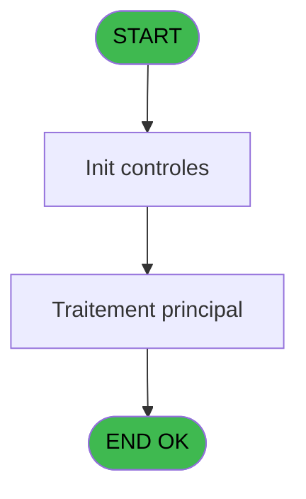
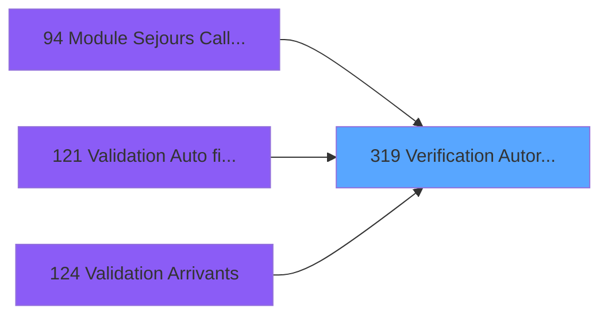

# PBG IDE 319 - Verification Autorisation

> **Analyse**: Phases 1-4 2026-02-03 11:07 -> 11:07 (17s) | Assemblage 11:07
> **Pipeline**: V7.2 Enrichi
> **Structure**: 4 onglets (Resume | Ecrans | Donnees | Connexions)

<!-- TAB:Resume -->

## 1. FICHE D'IDENTITE

| Attribut | Valeur |
|----------|--------|
| Projet | PBG |
| IDE Position | 319 |
| Nom Programme | Verification Autorisation |
| Fichier source | `Prg_319.xml` |
| Dossier IDE | General |
| Taches | 20 (0 ecrans visibles) |
| Tables modifiees | 0 |
| Programmes appeles | 0 |

## 2. DESCRIPTION FONCTIONNELLE

**Verification Autorisation** assure la gestion complete de ce processus, accessible depuis [Module Sejours CallTask (IDE 0)](PBG-IDE-0.md), [Sejours personnel SubForm (IDE 0)](PBG-IDE-0.md), [Module Sejours CallTask (IDE 94)](PBG-IDE-94.md), [Sejours personnel CallTask (IDE 196)](PBG-IDE-196.md), [Module Sejours SubForm (IDE 391)](PBG-IDE-391.md), [Validation Arrivants (IDE 124)](PBG-IDE-124.md), [    Validation Auto filiations (IDE 121)](PBG-IDE-121.md).

Le flux de traitement s'organise en **3 blocs fonctionnels** :

- **Traitement** (16 taches) : traitements metier divers
- **Validation** (3 taches) : controles et verifications de coherence
- **Creation** (1 tache) : insertion d'enregistrements en base (mouvements, prestations)

Detail : phases du traitement

#### Phase 1 : Validation (3 taches)

- **319** - Verification Autorisation
- **319.12** - Aut.Validation
- **319.13** - Aut.Devalidation

#### Phase 2 : Creation (1 tache)

- **319.1** - Aut.Creation

#### Phase 3 : Traitement (16 taches)

- **319.2** - Aut.Modification
- **319.3** - Aut.Modification
- **319.4** - Aut.Affectation
- **319.5** - Aut.Affectation
- **319.6** - Aut.Prolongation
- **319.7** - Aut.Interruption
- **319.8** - Aut.Avancement
- **319.9** - Aut.Recodification
- **319.10** - Aut.Annulation
- **319.11** - Aut.Messagerie
- **319.14** - Aut.Immigration
- **319.15** - Aut.Liberation
- **319.16** - Aut.Blocage
- **319.17** - Aut.Statut
- **319.18** - Aut.Statut
- **319.19** - Aut.Statut

## 3. BLOCS FONCTIONNELS

### 3.1 Validation (3 taches)

Controles de coherence : 3 taches verifient les donnees et conditions.

---

#### 319 - Verification Autorisation

**Role** : Verification : Verification Autorisation.
**Variables liees** : B (P0-Autorisation)

---

#### 319.12 - Aut.Validation

**Role** : Verification : Aut.Validation.

---

#### 319.13 - Aut.Devalidation

**Role** : Verification : Aut.Devalidation.

### 3.2 Creation (1 tache)

Insertion de nouveaux enregistrements en base.

---

#### 319.1 - Aut.Creation

**Role** : Creation d'enregistrement : Aut.Creation.

### 3.3 Traitement (16 taches)

Traitements internes.

---

#### 319.2 - Aut.Modification

**Role** : Traitement : Aut.Modification.

---

#### 319.3 - Aut.Modification

**Role** : Traitement : Aut.Modification.

---

#### 319.4 - Aut.Affectation

**Role** : Traitement : Aut.Affectation.

---

#### 319.5 - Aut.Affectation

**Role** : Traitement : Aut.Affectation.

---

#### 319.6 - Aut.Prolongation

**Role** : Traitement : Aut.Prolongation.

---

#### 319.7 - Aut.Interruption

**Role** : Traitement : Aut.Interruption.

---

#### 319.8 - Aut.Avancement

**Role** : Traitement : Aut.Avancement.

---

#### 319.9 - Aut.Recodification

**Role** : Traitement : Aut.Recodification.

---

#### 319.10 - Aut.Annulation

**Role** : Traitement : Aut.Annulation.

---

#### 319.11 - Aut.Messagerie

**Role** : Traitement : Aut.Messagerie.

---

#### 319.14 - Aut.Immigration

**Role** : Traitement : Aut.Immigration.

---

#### 319.15 - Aut.Liberation

**Role** : Traitement : Aut.Liberation.

---

#### 319.16 - Aut.Blocage

**Role** : Traitement : Aut.Blocage.

---

#### 319.17 - Aut.Statut

**Role** : Traitement : Aut.Statut.

---

#### 319.18 - Aut.Statut

**Role** : Traitement : Aut.Statut.

---

#### 319.19 - Aut.Statut

**Role** : Traitement : Aut.Statut.

## 5. REGLES METIER

*(Aucune regle metier identifiee)*

## 6. CONTEXTE

- **Appele par**: [Module Sejours CallTask (IDE 0)](PBG-IDE-0.md), [Sejours personnel SubForm (IDE 0)](PBG-IDE-0.md), [Module Sejours CallTask (IDE 94)](PBG-IDE-94.md), [Sejours personnel CallTask (IDE 196)](PBG-IDE-196.md), [Module Sejours SubForm (IDE 391)](PBG-IDE-391.md), [Validation Arrivants (IDE 124)](PBG-IDE-124.md), [    Validation Auto filiations (IDE 121)](PBG-IDE-121.md)
- **Appelle**: 0 programmes | **Tables**: 1 (W:0 R:1 L:0) | **Taches**: 20 | **Expressions**: 25

<!-- TAB:Ecrans -->

## 8. ECRANS

*(Programme sans ecran visible)*

## 9. NAVIGATION

### 9.3 Structure hierarchique (20 taches)

| Position | Tache | Type | Dimensions | Bloc |
|----------|-------|------|------------|------|
| **319.1** | [**Verification Autorisation** (319)](#t1) | MDI | - | Validation |
| 319.1.1 | [Aut.Validation (319.12)](#t13) | MDI | - | |
| 319.1.2 | [Aut.Devalidation (319.13)](#t14) | MDI | - | |
| **319.2** | [**Aut.Creation** (319.1)](#t2) | MDI | - | Creation |
| **319.3** | [**Aut.Modification** (319.2)](#t3) | MDI | - | Traitement |
| 319.3.1 | [Aut.Modification (319.3)](#t4) | MDI | - | |
| 319.3.2 | [Aut.Affectation (319.4)](#t5) | MDI | - | |
| 319.3.3 | [Aut.Affectation (319.5)](#t6) | MDI | - | |
| 319.3.4 | [Aut.Prolongation (319.6)](#t7) | MDI | - | |
| 319.3.5 | [Aut.Interruption (319.7)](#t8) | MDI | - | |
| 319.3.6 | [Aut.Avancement (319.8)](#t9) | MDI | - | |
| 319.3.7 | [Aut.Recodification (319.9)](#t10) | MDI | - | |
| 319.3.8 | [Aut.Annulation (319.10)](#t11) | MDI | - | |
| 319.3.9 | [Aut.Messagerie (319.11)](#t12) | MDI | - | |
| 319.3.10 | [Aut.Immigration (319.14)](#t15) | MDI | - | |
| 319.3.11 | [Aut.Liberation (319.15)](#t16) | MDI | - | |
| 319.3.12 | [Aut.Blocage (319.16)](#t17) | MDI | - | |
| 319.3.13 | [Aut.Statut (319.17)](#t18) | MDI | - | |
| 319.3.14 | [Aut.Statut (319.18)](#t19) | MDI | - | |
| 319.3.15 | [Aut.Statut (319.19)](#t26) | MDI | - | |

### 9.4 Algorigramme

> **Legende**: Vert = START/END OK | Rouge = END KO | Bleu = Decisions
> *Algorigramme auto-genere. Utiliser `/algorigramme` pour une synthese metier detaillee.*

<!-- TAB:Donnees -->

## 10. TABLES

### Tables utilisees (1)

| ID | Nom | Description | Type | R | W | L | Usages |
|----|-----|-------------|------|---|---|---|--------|
| 691 | commandes |  | DB | R |   |   | 19 |

### Colonnes par table (0 / 1 tables avec colonnes identifiees)

Table 691 - commandes (R) - 19 usages

*Table utilisee uniquement en Link ou aucune colonne Real identifiee dans le DataView.*

## 11. VARIABLES

### 11.1 Autres (4)

Variables diverses.

| Lettre | Nom | Type | Usage dans |
|--------|-----|------|-----------|
| A | P0-Societe | Alpha | - |
| B | P0-Autorisation | Alpha | 19x refs |
| C | P0-Accord Suite | Alpha | 1x refs |
| D | W0-Code F008 | Alpha | - |

## 12. EXPRESSIONS

**25 / 25 expressions decodees (100%)**

### 12.1 Repartition par type

| Type | Expressions | Regles |
|------|-------------|--------|
| CONSTANTE | 2 | 0 |
| CONDITION | 20 | 0 |
| REFERENCE_VG | 2 | 0 |
| OTHER | 1 | 0 |

### 12.2 Expressions cles par type

#### CONSTANTE (2 expressions)

| Type | IDE | Expression | Regle |
|------|-----|------------|-------|
| CONSTANTE | 2 | `'F008'` | - |
| CONSTANTE | 1 | `'N'` | - |

#### CONDITION (20 expressions)

| Type | IDE | Expression | Regle |
|------|-----|------------|-------|
| CONDITION | 16 | `P0-Autorisation [B]='22'` | - |
| CONDITION | 17 | `P0-Autorisation [B]='23'` | - |
| CONDITION | 15 | `P0-Autorisation [B]='21'` | - |
| CONDITION | 13 | `P0-Autorisation [B]='19'` | - |
| CONDITION | 14 | `P0-Autorisation [B]='20'` | - |
| ... | | *+15 autres* | |

#### REFERENCE_VG (2 expressions)

| Type | IDE | Expression | Regle |
|------|-----|------------|-------|
| REFERENCE_VG | 25 | `VG20` | - |
| REFERENCE_VG | 23 | `VG28` | - |

#### OTHER (1 expressions)

| Type | IDE | Expression | Regle |
|------|-----|------------|-------|
| OTHER | 24 | `{1,1}` | - |

### 12.3 Toutes les expressions (25)

Voir les 25 expressions

#### CONSTANTE (2)

| IDE | Expression Decodee |
|-----|-------------------|
| 1 | `'N'` |
| 2 | `'F008'` |

#### CONDITION (20)

| IDE | Expression Decodee |
|-----|-------------------|
| 3 | `P0-Autorisation [B]='09'` |
| 4 | `P0-Autorisation [B]='10'` |
| 5 | `P0-Autorisation [B]='11'` |
| 6 | `P0-Autorisation [B]='12'` |
| 7 | `P0-Autorisation [B]='13'` |
| 8 | `P0-Autorisation [B]='14'` |
| 9 | `P0-Autorisation [B]='15'` |
| 10 | `P0-Autorisation [B]='16'` |
| 11 | `P0-Autorisation [B]='17'` |
| 12 | `P0-Autorisation [B]='18'` |
| 13 | `P0-Autorisation [B]='19'` |
| 14 | `P0-Autorisation [B]='20'` |
| 15 | `P0-Autorisation [B]='21'` |
| 16 | `P0-Autorisation [B]='22'` |
| 17 | `P0-Autorisation [B]='23'` |
| 18 | `P0-Autorisation [B]='24'` |
| 19 | `P0-Autorisation [B]='25'` |
| 20 | `P0-Autorisation [B]='26'` |
| 21 | `P0-Autorisation [B]='27'` |
| 22 | `P0-Accord Suite [C]='N'` |

#### REFERENCE_VG (2)

| IDE | Expression Decodee |
|-----|-------------------|
| 23 | `VG28` |
| 25 | `VG20` |

#### OTHER (1)

| IDE | Expression Decodee |
|-----|-------------------|
| 24 | `{1,1}` |

<!-- TAB:Connexions -->

## 13. GRAPHE D'APPELS

### 13.1 Chaine depuis Main (Callers)

Main -> ... -> [Module Sejours CallTask (IDE 0)](PBG-IDE-0.md) -> **Verification Autorisation (IDE 319)**

Main -> ... -> [Sejours personnel SubForm (IDE 0)](PBG-IDE-0.md) -> **Verification Autorisation (IDE 319)**

Main -> ... -> [Module Sejours CallTask (IDE 94)](PBG-IDE-94.md) -> **Verification Autorisation (IDE 319)**

Main -> ... -> [Sejours personnel CallTask (IDE 196)](PBG-IDE-196.md) -> **Verification Autorisation (IDE 319)**

Main -> ... -> [Module Sejours SubForm (IDE 391)](PBG-IDE-391.md) -> **Verification Autorisation (IDE 319)**

Main -> ... -> [Validation Arrivants (IDE 124)](PBG-IDE-124.md) -> **Verification Autorisation (IDE 319)**

Main -> ... -> [    Validation Auto filiations (IDE 121)](PBG-IDE-121.md) -> **Verification Autorisation (IDE 319)**

### 13.2 Callers

| IDE | Nom Programme | Nb Appels |
|-----|---------------|-----------|
| [0](PBG-IDE-0.md) | Module Sejours CallTask | 5 |
| [0](PBG-IDE-0.md) | Sejours personnel SubForm | 5 |
| [94](PBG-IDE-94.md) | Module Sejours CallTask | 5 |
| [196](PBG-IDE-196.md) | Sejours personnel CallTask | 5 |
| [391](PBG-IDE-391.md) | Module Sejours SubForm | 5 |
| [124](PBG-IDE-124.md) | Validation Arrivants | 3 |
| [121](PBG-IDE-121.md) |     Validation Auto filiations | 1 |

### 13.3 Callees (programmes appeles)

### 13.4 Detail Callees avec contexte

| IDE | Nom Programme | Appels | Contexte |
|-----|---------------|--------|----------|
| - | (aucun) | - | - |

## 14. RECOMMANDATIONS MIGRATION

### 14.1 Profil du programme

| Metrique | Valeur | Impact migration |
|----------|--------|-----------------|
| Lignes de logique | 198 | Programme compact |
| Expressions | 25 | Peu de logique |
| Tables WRITE | 0 | Impact faible |
| Sous-programmes | 0 | Peu de dependances |
| Ecrans visibles | 0 | Ecran unique ou traitement batch |
| Code desactive | 0% (0 / 198) | Code sain |
| Regles metier | 0 | Pas de regle identifiee |

### 14.2 Plan de migration par bloc

#### Validation (3 taches: 0 ecran, 3 traitements)

- **Strategie** : FluentValidation avec validators specifiques.
- Chaque tache de validation -> un validator injectable

#### Creation (1 tache: 0 ecran, 1 traitement)

- **Strategie** : Repository pattern avec Entity Framework Core.
- Insertion via `IRepository<T>.CreateAsync()`

#### Traitement (16 taches: 0 ecran, 16 traitements)

- **Strategie** : 16 service(s) backend injectable(s) (Domain Services).
- Decomposer les taches en services unitaires testables.

### 14.3 Dependances critiques

| Dependance | Type | Appels | Impact |
|------------|------|--------|--------|

---
*Spec DETAILED generee par Pipeline V7.2 - 2026-02-03 11:07*
