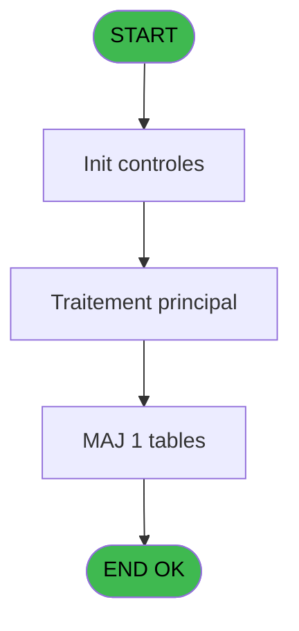

# PBG IDE 322 - Erreurs hebergement

> **Analyse**: Phases 1-4 2026-02-03 11:08 -> 11:08 (19s) | Assemblage 11:08
> **Pipeline**: V7.2 Enrichi
> **Structure**: 4 onglets (Resume | Ecrans | Donnees | Connexions)

<!-- TAB:Resume -->

## 1. FICHE D'IDENTITE

| Attribut | Valeur |
|----------|--------|
| Projet | PBG |
| IDE Position | 322 |
| Nom Programme | Erreurs hebergement |
| Fichier source | `Prg_322.xml` |
| Dossier IDE | General |
| Taches | 3 (0 ecrans visibles) |
| Tables modifiees | 1 |
| Programmes appeles | 0 |
| :warning: Statut | **ORPHELIN_POTENTIEL** |

## 2. DESCRIPTION FONCTIONNELLE

**Erreurs hebergement** assure la gestion complete de ce processus.

Le flux de traitement s'organise en **1 blocs fonctionnels** :

- **Traitement** (3 taches) : traitements metier divers

**Donnees modifiees** : 1 tables en ecriture (histoticket_dat).

## 3. BLOCS FONCTIONNELS

### 3.1 Traitement (3 taches)

Traitements internes.

---

#### 322 - Erreurs hebergement [[ECRAN]](#ecran-t1)

**Role** : Traitement : Erreurs hebergement.
**Ecran** : 494 x 0 DLU | [Voir mockup](#ecran-t1)

---

#### 322.1 - Erreurs hebergement [[ECRAN]](#ecran-t2)

**Role** : Traitement : Erreurs hebergement.
**Ecran** : 494 x 0 DLU | [Voir mockup](#ecran-t2)

---

#### 322.2 - Export - Hebergement Manquant [[ECRAN]](#ecran-t6)

**Role** : Traitement : Export - Hebergement Manquant.
**Ecran** : 986 x 195 DLU | [Voir mockup](#ecran-t6)

## 5. REGLES METIER

*(Aucune regle metier identifiee)*

## 6. CONTEXTE

- **Appele par**: (aucun)
- **Appelle**: 0 programmes | **Tables**: 3 (W:1 R:2 L:1) | **Taches**: 3 | **Expressions**: 11

<!-- TAB:Ecrans -->

## 8. ECRANS

*(Programme sans ecran visible)*

## 9. NAVIGATION

### 9.3 Structure hierarchique (3 taches)

| Position | Tache | Type | Dimensions | Bloc |
|----------|-------|------|------------|------|
| **322.1** | [**Erreurs hebergement** (322)](#t1) [mockup](#ecran-t1) | - | 494x0 | Traitement |
| 322.1.1 | [Erreurs hebergement (322.1)](#t2) [mockup](#ecran-t2) | - | 494x0 | |
| 322.1.2 | [Export - Hebergement Manquant (322.2)](#t6) [mockup](#ecran-t6) | - | 986x195 | |

### 9.4 Algorigramme

> **Legende**: Vert = START/END OK | Rouge = END KO | Bleu = Decisions
> *Algorigramme auto-genere. Utiliser `/algorigramme` pour une synthese metier detaillee.*

<!-- TAB:Donnees -->

## 10. TABLES

### Tables utilisees (3)

| ID | Nom | Description | Type | R | W | L | Usages |
|----|-----|-------------|------|---|---|---|--------|
| 1 | histoticket_dat | Historique / journal | DB | R | **W** |   | 2 |
| 34 | hebergement______heb | Hebergement (chambres) | DB | R |   |   | 1 |
| 167 | troncon__________tro |  | DB |   |   | L | 1 |

### Colonnes par table (1 / 2 tables avec colonnes identifiees)

Table 1 - histoticket_dat (R/**W**) - 2 usages

*Table utilisee uniquement en Link ou aucune colonne Real identifiee dans le DataView.*

Table 34 - hebergement______heb (R) - 1 usages

| Lettre | Variable | Acces | Type |
|--------|----------|-------|------|
| A | Retour A | R | Logical |
| B | Retour Z | R | Logical |

## 11. VARIABLES

### 11.1 Autres (2)

Variables diverses.

| Lettre | Nom | Type | Usage dans |
|--------|-----|------|-----------|
| A | Retour A | Logical | 1x refs |
| B | Retour Z | Logical | 1x refs |

## 12. EXPRESSIONS

**11 / 11 expressions decodees (100%)**

### 12.1 Repartition par type

| Type | Expressions | Regles |
|------|-------------|--------|
| CALCULATION | 2 | 0 |
| CONSTANTE | 4 | 0 |
| OTHER | 5 | 0 |

### 12.2 Expressions cles par type

#### CALCULATION (2 expressions)

| Type | IDE | Expression | Regle |
|------|-----|------------|-------|
| CALCULATION | 11 | `DbDel('{1,-1}'DSOURCE,'')` | - |
| CALCULATION | 2 | `'11/04/2014'DATE` | - |

#### CONSTANTE (4 expressions)

| Type | IDE | Expression | Regle |
|------|-----|------------|-------|
| CONSTANTE | 7 | `'A'` | - |
| CONSTANTE | 8 | `'Z'` | - |
| CONSTANTE | 1 | `'H'` | - |
| CONSTANTE | 3 | `19000` | - |

#### OTHER (5 expressions)

| Type | IDE | Expression | Regle |
|------|-----|------------|-------|
| OTHER | 9 | `NOT([X])` | - |
| OTHER | 10 | `NOT([Y])` | - |
| OTHER | 6 | `[C]` | - |
| OTHER | 4 | `Retour A [A]` | - |
| OTHER | 5 | `Retour Z [B]` | - |

<!-- TAB:Connexions -->

## 13. GRAPHE D'APPELS

### 13.1 Chaine depuis Main (Callers)

**Chemin**: (pas de callers directs)

### 13.2 Callers

| IDE | Nom Programme | Nb Appels |
|-----|---------------|-----------|
| - | (aucun) | - |

### 13.3 Callees (programmes appeles)

### 13.4 Detail Callees avec contexte

| IDE | Nom Programme | Appels | Contexte |
|-----|---------------|--------|----------|
| - | (aucun) | - | - |

## 14. RECOMMANDATIONS MIGRATION

### 14.1 Profil du programme

| Metrique | Valeur | Impact migration |
|----------|--------|-----------------|
| Lignes de logique | 100 | Programme compact |
| Expressions | 11 | Peu de logique |
| Tables WRITE | 1 | Impact faible |
| Sous-programmes | 0 | Peu de dependances |
| Ecrans visibles | 0 | Ecran unique ou traitement batch |
| Code desactive | 0% (0 / 100) | Code sain |
| Regles metier | 0 | Pas de regle identifiee |

### 14.2 Plan de migration par bloc

#### Traitement (3 taches: 3 ecrans, 0 traitement)

- **Strategie** : 3 composant(s) UI (Razor/React) avec formulaires et validation.
- Decomposer les taches en services unitaires testables.

### 14.3 Dependances critiques

| Dependance | Type | Appels | Impact |
|------------|------|--------|--------|
| histoticket_dat | Table WRITE (Database) | 1x | Schema + repository |

---
*Spec DETAILED generee par Pipeline V7.2 - 2026-02-03 11:08*
