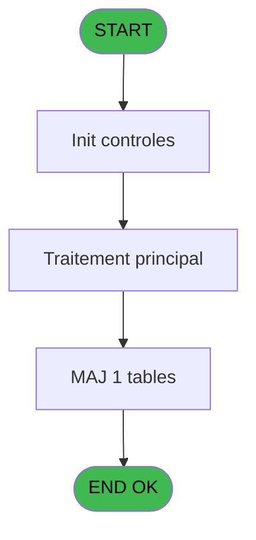

# PBG IDE 324 - 1Correction hebergement A et Z

> **Analyse**: Phases 1-4 2026-02-03 11:09 -> 11:09 (21s) | Assemblage 11:09
> **Pipeline**: V7.2 Enrichi
> **Structure**: 4 onglets (Resume | Ecrans | Donnees | Connexions)

<!-- TAB:Resume -->

## 1. FICHE D'IDENTITE

| Attribut | Valeur |
|----------|--------|
| Projet | PBG |
| IDE Position | 324 |
| Nom Programme | 1Correction hebergement A et Z |
| Fichier source | `Prg_324.xml` |
| Dossier IDE | General |
| Taches | 1 (1 ecrans visibles) |
| Tables modifiees | 1 |
| Programmes appeles | 0 |
| :warning: Statut | **ORPHELIN_POTENTIEL** |

## 2. DESCRIPTION FONCTIONNELLE

**1Correction hebergement A et Z** assure la gestion complete de ce processus.

Le flux de traitement s'organise en **1 blocs fonctionnels** :

- **Traitement** (1 tache) : traitements metier divers

**Donnees modifiees** : 1 tables en ecriture (gm-recherche_____gmr).

## 3. BLOCS FONCTIONNELS

### 3.1 Traitement (1 tache)

Traitements internes.

---

#### 324 - 1Correction hebergement A et Z [[ECRAN]](#ecran-t1)

**Role** : Traitement : 1Correction hebergement A et Z.
**Ecran** : 494 x 0 DLU | [Voir mockup](#ecran-t1)

## 5. REGLES METIER

*(Aucune regle metier identifiee)*

## 6. CONTEXTE

- **Appele par**: (aucun)
- **Appelle**: 0 programmes | **Tables**: 6 (W:1 R:0 L:5) | **Taches**: 1 | **Expressions**: 30

<!-- TAB:Ecrans -->

## 8. ECRANS

### 8.1 Forms visibles (1 / 1)

| # | Position | Tache | Nom | Type | Largeur | Hauteur | Bloc |
|---|----------|-------|-----|------|---------|---------|------|
| 1 | 324 | 324 | 1Correction hebergement A et Z | Type0 | 494 | 0 | Traitement |

### 8.2 Mockups Ecrans

---

#### 324 - 1Correction hebergement A et Z
**Tache** : [324](#t1) | **Type** : Type0 | **Dimensions** : 494 x 0 DLU
**Bloc** : Traitement | **Titre IDE** : 1Correction hebergement A et Z

<!-- FORM-DATA:
{
    "width":  494,
    "vFactor":  8,
    "type":  "Type0",
    "hFactor":  4,
    "controls":  [
                     {
                         "x":  32,
                         "type":  "label",
                         "var":  "",
                         "y":  24,
                         "w":  70,
                         "fmt":  "",
                         "name":  "",
                         "h":  9,
                         "color":  "",
                         "text":  "heb_num_compte",
                         "parent":  null
                     },
                     {
                         "x":  36,
                         "type":  "label",
                         "var":  "",
                         "y":  40,
                         "w":  46,
                         "fmt":  "",
                         "name":  "",
                         "h":  9,
                         "color":  "",
                         "text":  "heb_filiation",
                         "parent":  null
                     },
                     {
                         "x":  40,
                         "type":  "label",
                         "var":  "",
                         "y":  56,
                         "w":  78,
                         "fmt":  "",
                         "name":  "",
                         "h":  9,
                         "color":  "",
                         "text":  "heb_code_package",
                         "parent":  null
                     },
                     {
                         "x":  106,
                         "type":  "edit",
                         "var":  "",
                         "y":  24,
                         "w":  42,
                         "fmt":  "",
                         "name":  "heb_num_compte",
                         "h":  10,
                         "color":  "",
                         "text":  "",
                         "parent":  null
                     },
                     {
                         "x":  86,
                         "type":  "edit",
                         "var":  "",
                         "y":  40,
                         "w":  18,
                         "fmt":  "",
                         "name":  "heb_filiation",
                         "h":  10,
                         "color":  "",
                         "text":  "",
                         "parent":  null
                     },
                     {
                         "x":  122,
                         "type":  "edit",
                         "var":  "",
                         "y":  56,
                         "w":  9,
                         "fmt":  "",
                         "name":  "heb_code_package",
                         "h":  10,
                         "color":  "",
                         "text":  "",
                         "parent":  null
                     }
                 ],
    "taskId":  "324",
    "height":  0
}
-->

<strong>Champs : 3 champs</strong>

| Pos (x,y) | Nom | Variable | Type |
|-----------|-----|----------|------|
| 106,24 | heb_num_compte | - | edit |
| 86,40 | heb_filiation | - | edit |
| 122,56 | heb_code_package | - | edit |

## 9. NAVIGATION

Ecran unique: **1Correction hebergement A et Z**

### 9.3 Structure hierarchique (1 tache)

| Position | Tache | Type | Dimensions | Bloc |
|----------|-------|------|------------|------|
| **324.1** | [**1Correction hebergement A et Z** (324)](#t1) [mockup](#ecran-t1) | - | 494x0 | Traitement |

### 9.4 Algorigramme

> **Legende**: Vert = START/END OK | Rouge = END KO | Bleu = Decisions
> *Algorigramme auto-genere. Utiliser `/algorigramme` pour une synthese metier detaillee.*

<!-- TAB:Donnees -->

## 10. TABLES

### Tables utilisees (6)

| ID | Nom | Description | Type | R | W | L | Usages |
|----|-----|-------------|------|---|---|---|--------|
| 30 | gm-recherche_____gmr | Index de recherche | DB |   | **W** |   | 1 |
| 34 | hebergement______heb | Hebergement (chambres) | DB |   |   | L | 1 |
| 36 | client_gm |  | DB |   |   | L | 1 |
| 131 | fichier_validation |  | DB |   |   | L | 1 |
| 134 | groupe_arr_dep___vol |  | DB |   |   | L | 1 |
| 167 | troncon__________tro |  | DB |   |   | L | 1 |

### Colonnes par table (1 / 1 tables avec colonnes identifiees)

Table 30 - gm-recherche_____gmr (**W**) - 1 usages

| Lettre | Variable | Acces | Type |
|--------|----------|-------|------|
| A | Retour A | W | Logical |
| B | Retour Z | W | Logical |
| C | V.existe vol aller | W | Logical |
| D | V.Existe vol retour | W | Logical |

## 11. VARIABLES

### 11.1 Variables de session (2)

Variables persistantes pendant toute la session.

| Lettre | Nom | Type | Usage dans |
|--------|-----|------|-----------|
| C | V.existe vol aller | Logical | 1x session |
| D | V.Existe vol retour | Logical | - |

### 11.2 Autres (2)

Variables diverses.

| Lettre | Nom | Type | Usage dans |
|--------|-----|------|-----------|
| A | Retour A | Logical | 1x refs |
| B | Retour Z | Logical | 1x refs |

## 12. EXPRESSIONS

**30 / 30 expressions decodees (100%)**

### 12.1 Repartition par type

| Type | Expressions | Regles |
|------|-------------|--------|
| CONSTANTE | 10 | 0 |
| OTHER | 15 | 0 |
| CONDITION | 1 | 0 |
| FORMAT | 2 | 0 |
| STRING | 2 | 0 |

### 12.2 Expressions cles par type

#### CONSTANTE (10 expressions)

| Type | IDE | Expression | Regle |
|------|-----|------------|-------|
| CONSTANTE | 23 | `'VV2'` | - |
| CONSTANTE | 22 | `'V'` | - |
| CONSTANTE | 24 | `'Village/Village'` | - |
| CONSTANTE | 30 | `'18'` | - |
| CONSTANTE | 25 | `1` | - |
| ... | | *+5 autres* | |

#### OTHER (15 expressions)

| Type | IDE | Expression | Regle |
|------|-----|------------|-------|
| OTHER | 20 | `[BT]` | - |
| OTHER | 18 | `[BF]` | - |
| OTHER | 17 | `[BS]` | - |
| OTHER | 21 | `[BU]` | - |
| OTHER | 28 | `[DE]` | - |
| ... | | *+10 autres* | |

#### CONDITION (1 expressions)

| Type | IDE | Expression | Regle |
|------|-----|------------|-------|
| CONDITION | 13 | `[AH]=0 OR [AJ]=0` | - |

#### FORMAT (2 expressions)

| Type | IDE | Expression | Regle |
|------|-----|------------|-------|
| FORMAT | 29 | `Trim(Str([DC],'2'))` | - |
| FORMAT | 9 | `Trim(Str([CN],'2'))` | - |

#### STRING (2 expressions)

| Type | IDE | Expression | Regle |
|------|-----|------------|-------|
| STRING | 19 | `Trim([BH])` | - |
| STRING | 16 | `Trim([BG])` | - |

### 12.3 Toutes les expressions (30)

Voir les 30 expressions

#### CONSTANTE (10)

| IDE | Expression Decodee |
|-----|-------------------|
| 1 | `'H'` |
| 6 | `'A'` |
| 7 | `'Z'` |
| 10 | `'A'` |
| 11 | `'R'` |
| 22 | `'V'` |
| 23 | `'VV2'` |
| 24 | `'Village/Village'` |
| 25 | `1` |
| 30 | `'18'` |

#### OTHER (15)

| IDE | Expression Decodee |
|-----|-------------------|
| 2 | `Retour A [A]` |
| 3 | `Retour Z [B]` |
| 4 | `V.existe vol aller [C]` |
| 5 | `[BH]` |
| 8 | `[F]` |
| 12 | `[H]` |
| 14 | `[BQ]` |
| 15 | `[AS]` |
| 17 | `[BS]` |
| 18 | `[BF]` |
| 20 | `[BT]` |
| 21 | `[BU]` |
| 26 | `[BG]` |
| 27 | `[CX]` |
| 28 | `[DE]` |

#### CONDITION (1)

| IDE | Expression Decodee |
|-----|-------------------|
| 13 | `[AH]=0 OR [AJ]=0` |

#### FORMAT (2)

| IDE | Expression Decodee |
|-----|-------------------|
| 9 | `Trim(Str([CN],'2'))` |
| 29 | `Trim(Str([DC],'2'))` |

#### STRING (2)

| IDE | Expression Decodee |
|-----|-------------------|
| 16 | `Trim([BG])` |
| 19 | `Trim([BH])` |

<!-- TAB:Connexions -->

## 13. GRAPHE D'APPELS

### 13.1 Chaine depuis Main (Callers)

**Chemin**: (pas de callers directs)

### 13.2 Callers

| IDE | Nom Programme | Nb Appels |
|-----|---------------|-----------|
| - | (aucun) | - |

### 13.3 Callees (programmes appeles)

### 13.4 Detail Callees avec contexte

| IDE | Nom Programme | Appels | Contexte |
|-----|---------------|--------|----------|
| - | (aucun) | - | - |

## 14. RECOMMANDATIONS MIGRATION

### 14.1 Profil du programme

| Metrique | Valeur | Impact migration |
|----------|--------|-----------------|
| Lignes de logique | 145 | Programme compact |
| Expressions | 30 | Peu de logique |
| Tables WRITE | 1 | Impact faible |
| Sous-programmes | 0 | Peu de dependances |
| Ecrans visibles | 1 | Ecran unique ou traitement batch |
| Code desactive | 0% (0 / 145) | Code sain |
| Regles metier | 0 | Pas de regle identifiee |

### 14.2 Plan de migration par bloc

#### Traitement (1 tache: 1 ecran, 0 traitement)

- **Strategie** : 1 composant(s) UI (Razor/React) avec formulaires et validation.
- Decomposer les taches en services unitaires testables.

### 14.3 Dependances critiques

| Dependance | Type | Appels | Impact |
|------------|------|--------|--------|
| gm-recherche_____gmr | Table WRITE (Database) | 1x | Schema + repository |

---
*Spec DETAILED generee par Pipeline V7.2 - 2026-02-03 11:09*
