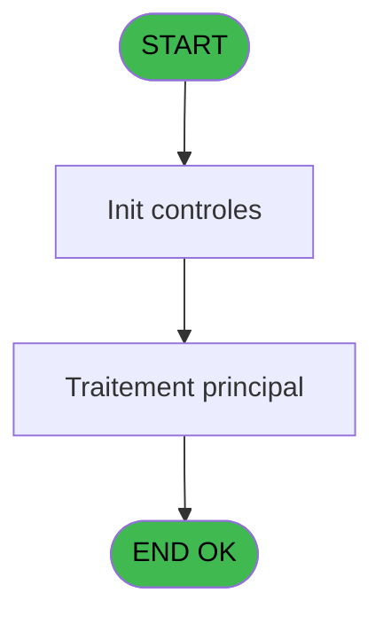

# PBG IDE 325 - Affichage Hebergement

> **Analyse**: Phases 1-4 2026-02-03 11:09 -> 11:10 (18s) | Assemblage 11:10
> **Pipeline**: V7.2 Enrichi
> **Structure**: 4 onglets (Resume | Ecrans | Donnees | Connexions)

<!-- TAB:Resume -->

## 1. FICHE D'IDENTITE

| Attribut | Valeur |
|----------|--------|
| Projet | PBG |
| IDE Position | 325 |
| Nom Programme | Affichage Hebergement |
| Fichier source | `Prg_325.xml` |
| Dossier IDE | General |
| Taches | 1 (1 ecrans visibles) |
| Tables modifiees | 0 |
| Programmes appeles | 0 |
| :warning: Statut | **ORPHELIN_POTENTIEL** |

## 2. DESCRIPTION FONCTIONNELLE

**Affichage Hebergement** assure la gestion complete de ce processus.

Le flux de traitement s'organise en **1 blocs fonctionnels** :

- **Consultation** (1 tache) : ecrans de recherche, selection et consultation

## 3. BLOCS FONCTIONNELS

### 3.1 Consultation (1 tache)

Ecrans de recherche et consultation.

---

#### 325 - Affichage Hebergement [[ECRAN]](#ecran-t1)

**Role** : Reinitialisation : Affichage Hebergement.
**Ecran** : 797 x 0 DLU | [Voir mockup](#ecran-t1)

## 5. REGLES METIER

*(Aucune regle metier identifiee)*

## 6. CONTEXTE

- **Appele par**: (aucun)
- **Appelle**: 0 programmes | **Tables**: 3 (W:0 R:1 L:2) | **Taches**: 1 | **Expressions**: 7

<!-- TAB:Ecrans -->

## 8. ECRANS

### 8.1 Forms visibles (1 / 1)

| # | Position | Tache | Nom | Type | Largeur | Hauteur | Bloc |
|---|----------|-------|-----|------|---------|---------|------|
| 1 | 325 | 325 | Affichage Hebergement | Type0 | 797 | 0 | Consultation |

### 8.2 Mockups Ecrans

---

#### 325 - Affichage Hebergement
**Tache** : [325](#t1) | **Type** : Type0 | **Dimensions** : 797 x 0 DLU
**Bloc** : Consultation | **Titre IDE** : Affichage Hebergement

<!-- FORM-DATA:
{
    "width":  797,
    "vFactor":  8,
    "type":  "Type0",
    "hFactor":  4,
    "controls":  [
                     {
                         "x":  4,
                         "type":  "table",
                         "var":  "",
                         "name":  "",
                         "titleH":  12,
                         "color":  "",
                         "w":  736,
                         "y":  8,
                         "fmt":  "",
                         "parent":  null,
                         "text":  "",
                         "rowH":  13,
                         "h":  184,
                         "cols":  [
                                      {
                                          "title":  "heb_num_compte",
                                          "layer":  1,
                                          "w":  71
                                      },
                                      {
                                          "title":  "heb_filiation",
                                          "layer":  2,
                                          "w":  48
                                      },
                                      {
                                          "title":  "gmc_nom_complet",
                                          "layer":  3,
                                          "w":  178
                                      },
                                      {
                                          "title":  "gmc_prenom_complet",
                                          "layer":  4,
                                          "w":  122
                                      },
                                      {
                                          "title":  "heb_nom_logement",
                                          "layer":  5,
                                          "w":  78
                                      },
                                      {
                                          "title":  "gmc_numero_import",
                                          "layer":  6,
                                          "w":  79
                                      }
                                  ],
                         "rows":  6
                     },
                     {
                         "x":  8,
                         "type":  "edit",
                         "var":  "",
                         "y":  23,
                         "w":  42,
                         "fmt":  "",
                         "name":  "heb_num_compte",
                         "h":  10,
                         "color":  "",
                         "text":  "",
                         "parent":  1
                     },
                     {
                         "x":  79,
                         "type":  "edit",
                         "var":  "",
                         "y":  23,
                         "w":  18,
                         "fmt":  "",
                         "name":  "heb_filiation",
                         "h":  10,
                         "color":  "",
                         "text":  "",
                         "parent":  1
                     },
                     {
                         "x":  127,
                         "type":  "edit",
                         "var":  "",
                         "y":  23,
                         "w":  171,
                         "fmt":  "",
                         "name":  "gmc_nom_complet",
                         "h":  10,
                         "color":  "",
                         "text":  "",
                         "parent":  1
                     },
                     {
                         "x":  305,
                         "type":  "edit",
                         "var":  "",
                         "y":  23,
                         "w":  115,
                         "fmt":  "",
                         "name":  "gmc_prenom_complet",
                         "h":  10,
                         "color":  "",
                         "text":  "",
                         "parent":  1
                     },
                     {
                         "x":  427,
                         "type":  "edit",
                         "var":  "",
                         "y":  23,
                         "w":  37,
                         "fmt":  "",
                         "name":  "heb_nom_logement",
                         "h":  10,
                         "color":  "",
                         "text":  "",
                         "parent":  1
                     },
                     {
                         "x":  505,
                         "type":  "edit",
                         "var":  "",
                         "y":  23,
                         "w":  32,
                         "fmt":  "",
                         "name":  "gmc_numero_import",
                         "h":  10,
                         "color":  "",
                         "text":  "",
                         "parent":  1
                     }
                 ],
    "taskId":  "325",
    "height":  0
}
-->

<strong>Champs : 6 champs</strong>

| Pos (x,y) | Nom | Variable | Type |
|-----------|-----|----------|------|
| 8,23 | heb_num_compte | - | edit |
| 79,23 | heb_filiation | - | edit |
| 127,23 | gmc_nom_complet | - | edit |
| 305,23 | gmc_prenom_complet | - | edit |
| 427,23 | heb_nom_logement | - | edit |
| 505,23 | gmc_numero_import | - | edit |

## 9. NAVIGATION

Ecran unique: **Affichage Hebergement**

### 9.3 Structure hierarchique (1 tache)

| Position | Tache | Type | Dimensions | Bloc |
|----------|-------|------|------------|------|
| **325.1** | [**Affichage Hebergement** (325)](#t1) [mockup](#ecran-t1) | - | 797x0 | Consultation |

### 9.4 Algorigramme

> **Legende**: Vert = START/END OK | Rouge = END KO | Bleu = Decisions
> *Algorigramme auto-genere. Utiliser `/algorigramme` pour une synthese metier detaillee.*

<!-- TAB:Donnees -->

## 10. TABLES

### Tables utilisees (3)

| ID | Nom | Description | Type | R | W | L | Usages |
|----|-----|-------------|------|---|---|---|--------|
| 31 | gm-complet_______gmc |  | DB | R |   |   | 1 |
| 34 | hebergement______heb | Hebergement (chambres) | DB |   |   | L | 1 |
| 104 | fichier_menage |  | DB |   |   | L | 1 |

### Colonnes par table (0 / 1 tables avec colonnes identifiees)

Table 31 - gm-complet_______gmc (R) - 1 usages

*Table utilisee uniquement en Link ou aucune colonne Real identifiee dans le DataView.*

## 11. VARIABLES

*(Programme sans variables locales mappees)*

## 12. EXPRESSIONS

**7 / 7 expressions decodees (100%)**

### 12.1 Repartition par type

| Type | Expressions | Regles |
|------|-------------|--------|
| CONSTANTE | 2 | 0 |
| OTHER | 4 | 0 |
| CONDITION | 1 | 0 |

### 12.2 Expressions cles par type

#### CONSTANTE (2 expressions)

| Type | IDE | Expression | Regle |
|------|-----|------------|-------|
| CONSTANTE | 2 | `'GM'` | - |
| CONSTANTE | 1 | `'H'` | - |

#### OTHER (4 expressions)

| Type | IDE | Expression | Regle |
|------|-----|------------|-------|
| OTHER | 5 | `[C]` | - |
| OTHER | 6 | `[E]` | - |
| OTHER | 3 | `Retour Chambre [A]` | - |
| OTHER | 4 | `[B]` | - |

#### CONDITION (1 expressions)

| Type | IDE | Expression | Regle |
|------|-----|------------|-------|
| CONDITION | 7 | `Trim([E])<>'' AND NOT([M])` | - |

<!-- TAB:Connexions -->

## 13. GRAPHE D'APPELS

### 13.1 Chaine depuis Main (Callers)

**Chemin**: (pas de callers directs)

### 13.2 Callers

| IDE | Nom Programme | Nb Appels |
|-----|---------------|-----------|
| - | (aucun) | - |

### 13.3 Callees (programmes appeles)

### 13.4 Detail Callees avec contexte

| IDE | Nom Programme | Appels | Contexte |
|-----|---------------|--------|----------|
| - | (aucun) | - | - |

## 14. RECOMMANDATIONS MIGRATION

### 14.1 Profil du programme

| Metrique | Valeur | Impact migration |
|----------|--------|-----------------|
| Lignes de logique | 21 | Programme compact |
| Expressions | 7 | Peu de logique |
| Tables WRITE | 0 | Impact faible |
| Sous-programmes | 0 | Peu de dependances |
| Ecrans visibles | 1 | Ecran unique ou traitement batch |
| Code desactive | 0% (0 / 21) | Code sain |
| Regles metier | 0 | Pas de regle identifiee |

### 14.2 Plan de migration par bloc

#### Consultation (1 tache: 1 ecran, 0 traitement)

- **Strategie** : Composants de recherche/selection en modales.
- 1 ecran : Affichage Hebergement

### 14.3 Dependances critiques

| Dependance | Type | Appels | Impact |
|------------|------|--------|--------|

---
*Spec DETAILED generee par Pipeline V7.2 - 2026-02-03 11:10*
