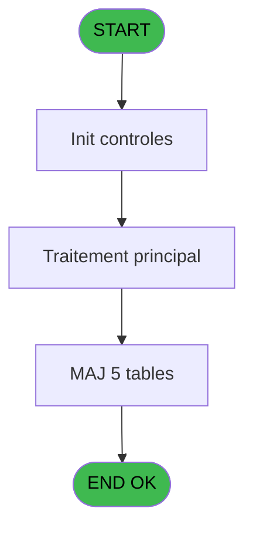

# PBG IDE 328 - reprise go gm

> **Analyse**: Phases 1-4 2026-02-03 11:11 -> 11:11 (20s) | Assemblage 11:11
> **Pipeline**: V7.2 Enrichi
> **Structure**: 4 onglets (Resume | Ecrans | Donnees | Connexions)

<!-- TAB:Resume -->

## 1. FICHE D'IDENTITE

| Attribut | Valeur |
|----------|--------|
| Projet | PBG |
| IDE Position | 328 |
| Nom Programme | reprise go gm |
| Fichier source | `Prg_328.xml` |
| Dossier IDE | General |
| Taches | 6 (1 ecrans visibles) |
| Tables modifiees | 5 |
| Programmes appeles | 0 |
| :warning: Statut | **ORPHELIN_POTENTIEL** |

## 2. DESCRIPTION FONCTIONNELLE

**reprise go gm** assure la gestion complete de ce processus.

Le flux de traitement s'organise en **3 blocs fonctionnels** :

- **Consultation** (4 taches) : ecrans de recherche, selection et consultation
- **Calcul** (1 tache) : calculs de montants, stocks ou compteurs
- **Traitement** (1 tache) : traitements metier divers

**Donnees modifiees** : 5 tables en ecriture (gm-recherche_____gmr, personnel_go______go, client_gm, compte_gm________cgm, fichier_validation).

Detail : phases du traitement

#### Phase 1 : Traitement (1 tache)

- **328** - Veuillez patienter... **[[ECRAN]](#ecran-t1)**

#### Phase 2 : Consultation (4 taches)

- **328.1** - Creation Recherche
- **328.2** - Creation Recherche
- **328.3** - Creation Recherche
- **328.4** - Creation Recherche

#### Phase 3 : Calcul (1 tache)

- **328.5** - Creation compte

#### Tables impactees

| Table | Operations | Role metier |
|-------|-----------|-------------|
| gm-recherche_____gmr | R/**W** (2 usages) | Index de recherche |
| compte_gm________cgm | **W** (1 usages) | Comptes GM (generaux) |
| fichier_validation | **W** (1 usages) |  |
| client_gm | **W** (1 usages) |  |
| personnel_go______go | **W** (1 usages) |  |

## 3. BLOCS FONCTIONNELS

### 3.1 Traitement (1 tache)

Traitements internes.

---

#### 328 - Veuillez patienter... [[ECRAN]](#ecran-t1)

**Role** : Traitement : Veuillez patienter....
**Ecran** : 427 x 68 DLU (MDI) | [Voir mockup](#ecran-t1)

### 3.2 Consultation (4 taches)

Ecrans de recherche et consultation.

---

#### 328.1 - Creation Recherche

**Role** : Creation d'enregistrement : Creation Recherche.

---

#### 328.2 - Creation Recherche

**Role** : Creation d'enregistrement : Creation Recherche.

---

#### 328.3 - Creation Recherche

**Role** : Creation d'enregistrement : Creation Recherche.

---

#### 328.4 - Creation Recherche

**Role** : Creation d'enregistrement : Creation Recherche.

### 3.3 Calcul (1 tache)

Calculs metier : montants, stocks, compteurs.

---

#### 328.5 - Creation compte

**Role** : Creation d'enregistrement : Creation compte.

## 5. REGLES METIER

*(Aucune regle metier identifiee)*

## 6. CONTEXTE

- **Appele par**: (aucun)
- **Appelle**: 0 programmes | **Tables**: 7 (W:5 R:1 L:2) | **Taches**: 6 | **Expressions**: 15

<!-- TAB:Ecrans -->

## 8. ECRANS

### 8.1 Forms visibles (1 / 6)

| # | Position | Tache | Nom | Type | Largeur | Hauteur | Bloc |
|---|----------|-------|-----|------|---------|---------|------|
| 1 | 328 | 328 | Veuillez patienter... | MDI | 427 | 68 | Traitement |

### 8.2 Mockups Ecrans

---

#### 328 - Veuillez patienter...
**Tache** : [328](#t1) | **Type** : MDI | **Dimensions** : 427 x 68 DLU
**Bloc** : Traitement | **Titre IDE** : Veuillez patienter...

<!-- FORM-DATA:
{
    "width":  427,
    "vFactor":  8,
    "type":  "MDI",
    "hFactor":  8,
    "controls":  [
                     {
                         "x":  152,
                         "type":  "edit",
                         "var":  "",
                         "y":  18,
                         "w":  152,
                         "fmt":  "6",
                         "name":  "",
                         "h":  10,
                         "color":  "",
                         "text":  "",
                         "parent":  null
                     }
                 ],
    "taskId":  "328",
    "height":  68
}
-->

<strong>Champs : 1 champs</strong>

| Pos (x,y) | Nom | Variable | Type |
|-----------|-----|----------|------|
| 152,18 | 6 | - | edit |

## 9. NAVIGATION

Ecran unique: **Veuillez patienter...**

### 9.3 Structure hierarchique (6 taches)

| Position | Tache | Type | Dimensions | Bloc |
|----------|-------|------|------------|------|
| **328.1** | [**Veuillez patienter...** (328)](#t1) [mockup](#ecran-t1) | MDI | 427x68 | Traitement |
| **328.2** | [**Creation Recherche** (328.1)](#t4) | MDI | - | Consultation |
| 328.2.1 | [Creation Recherche (328.2)](#t5) | MDI | - | |
| 328.2.2 | [Creation Recherche (328.3)](#t6) | MDI | - | |
| 328.2.3 | [Creation Recherche (328.4)](#t13) | MDI | - | |
| **328.3** | [**Creation compte** (328.5)](#t14) | - | - | Calcul |

### 9.4 Algorigramme

> **Legende**: Vert = START/END OK | Rouge = END KO | Bleu = Decisions
> *Algorigramme auto-genere. Utiliser `/algorigramme` pour une synthese metier detaillee.*

<!-- TAB:Donnees -->

## 10. TABLES

### Tables utilisees (7)

| ID | Nom | Description | Type | R | W | L | Usages |
|----|-----|-------------|------|---|---|---|--------|
| 30 | gm-recherche_____gmr | Index de recherche | DB | R | **W** |   | 2 |
| 31 | gm-complet_______gmc |  | DB |   |   | L | 1 |
| 34 | hebergement______heb | Hebergement (chambres) | DB |   |   | L | 1 |
| 35 | personnel_go______go |  | DB |   | **W** |   | 1 |
| 36 | client_gm |  | DB |   | **W** |   | 1 |
| 47 | compte_gm________cgm | Comptes GM (generaux) | DB |   | **W** |   | 1 |
| 131 | fichier_validation |  | DB |   | **W** |   | 1 |

### Colonnes par table (0 / 5 tables avec colonnes identifiees)

Table 30 - gm-recherche_____gmr (R/**W**) - 2 usages

*Table utilisee uniquement en Link ou aucune colonne Real identifiee dans le DataView.*

Table 35 - personnel_go______go (**W**) - 1 usages

*Table utilisee uniquement en Link ou aucune colonne Real identifiee dans le DataView.*

Table 36 - client_gm (**W**) - 1 usages

*Table utilisee uniquement en Link ou aucune colonne Real identifiee dans le DataView.*

Table 47 - compte_gm________cgm (**W**) - 1 usages

*Table utilisee uniquement en Link ou aucune colonne Real identifiee dans le DataView.*

Table 131 - fichier_validation (**W**) - 1 usages

*Table utilisee uniquement en Link ou aucune colonne Real identifiee dans le DataView.*

## 11. VARIABLES

*(Programme sans variables locales mappees)*

## 12. EXPRESSIONS

**15 / 15 expressions decodees (100%)**

### 12.1 Repartition par type

| Type | Expressions | Regles |
|------|-------------|--------|
| CONSTANTE | 5 | 0 |
| OTHER | 6 | 0 |
| CONDITION | 2 | 0 |
| NEGATION | 1 | 0 |
| FORMAT | 1 | 0 |

### 12.2 Expressions cles par type

#### CONSTANTE (5 expressions)

| Type | IDE | Expression | Regle |
|------|-----|------------|-------|
| CONSTANTE | 9 | `'Z'` | - |
| CONSTANTE | 13 | `'c:\temp\gmrecup.txt'` | - |
| CONSTANTE | 8 | `'A'` | - |
| CONSTANTE | 1 | `'C'` | - |
| CONSTANTE | 5 | `'H'` | - |

#### OTHER (6 expressions)

| Type | IDE | Expression | Regle |
|------|-----|------------|-------|
| OTHER | 10 | `[O]` | - |
| OTHER | 11 | `[R]` | - |
| OTHER | 15 | `Counter(0)` | - |
| OTHER | 2 | `[J]` | - |
| OTHER | 3 | `[K]` | - |
| ... | | *+1 autres* | |

#### CONDITION (2 expressions)

| Type | IDE | Expression | Regle |
|------|-----|------------|-------|
| CONDITION | 7 | `[DF]='GM'` | - |
| CONDITION | 6 | `[DF]='GO'` | - |

#### NEGATION (1 expressions)

| Type | IDE | Expression | Regle |
|------|-----|------------|-------|
| NEGATION | 12 | `NOT [DQ]` | - |

#### FORMAT (1 expressions)

| Type | IDE | Expression | Regle |
|------|-----|------------|-------|
| FORMAT | 14 | `Str(Counter(0),'6')` | - |

<!-- TAB:Connexions -->

## 13. GRAPHE D'APPELS

### 13.1 Chaine depuis Main (Callers)

**Chemin**: (pas de callers directs)

### 13.2 Callers

| IDE | Nom Programme | Nb Appels |
|-----|---------------|-----------|
| - | (aucun) | - |

### 13.3 Callees (programmes appeles)

### 13.4 Detail Callees avec contexte

| IDE | Nom Programme | Appels | Contexte |
|-----|---------------|--------|----------|
| - | (aucun) | - | - |

## 14. RECOMMANDATIONS MIGRATION

### 14.1 Profil du programme

| Metrique | Valeur | Impact migration |
|----------|--------|-----------------|
| Lignes de logique | 247 | Taille moyenne |
| Expressions | 15 | Peu de logique |
| Tables WRITE | 5 | Impact modere |
| Sous-programmes | 0 | Peu de dependances |
| Ecrans visibles | 1 | Ecran unique ou traitement batch |
| Code desactive | 0% (0 / 247) | Code sain |
| Regles metier | 0 | Pas de regle identifiee |

### 14.2 Plan de migration par bloc

#### Traitement (1 tache: 1 ecran, 0 traitement)

- **Strategie** : 1 composant(s) UI (Razor/React) avec formulaires et validation.
- Decomposer les taches en services unitaires testables.

#### Consultation (4 taches: 0 ecran, 4 traitements)

- **Strategie** : Composants de recherche/selection en modales.

#### Calcul (1 tache: 0 ecran, 1 traitement)

- **Strategie** : Services de calcul purs (Domain Services).
- Migrer la logique de calcul (stock, compteurs, montants)

### 14.3 Dependances critiques

| Dependance | Type | Appels | Impact |
|------------|------|--------|--------|
| gm-recherche_____gmr | Table WRITE (Database) | 1x | Schema + repository |
| personnel_go______go | Table WRITE (Database) | 1x | Schema + repository |
| client_gm | Table WRITE (Database) | 1x | Schema + repository |
| compte_gm________cgm | Table WRITE (Database) | 1x | Schema + repository |
| fichier_validation | Table WRITE (Database) | 1x | Schema + repository |

---
*Spec DETAILED generee par Pipeline V7.2 - 2026-02-03 11:11*
