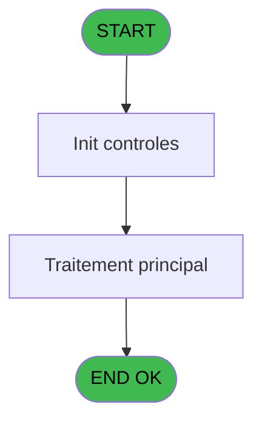
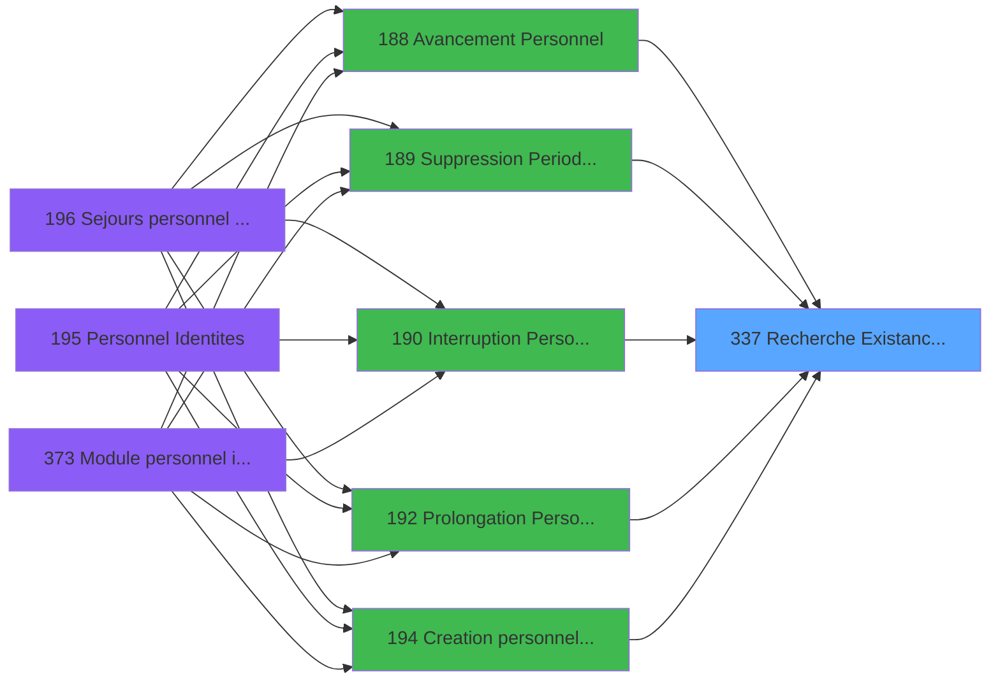

# PBG IDE 337 - Recherche Existance Groupe A/D

> **Analyse**: Phases 1-4 2026-02-03 11:15 -> 11:15 (17s) | Assemblage 11:15
> **Pipeline**: V7.2 Enrichi
> **Structure**: 4 onglets (Resume | Ecrans | Donnees | Connexions)

<!-- TAB:Resume -->

## 1. FICHE D'IDENTITE

| Attribut | Valeur |
|----------|--------|
| Projet | PBG |
| IDE Position | 337 |
| Nom Programme | Recherche Existance Groupe A/D |
| Fichier source | `Prg_337.xml` |
| Dossier IDE | Consultation |
| Taches | 1 (0 ecrans visibles) |
| Tables modifiees | 0 |
| Programmes appeles | 0 |

## 2. DESCRIPTION FONCTIONNELLE

**Recherche Existance Groupe A/D** assure la gestion complete de ce processus, accessible depuis [  Suppression Periode Personn (IDE 189)](PBG-IDE-189.md), [  Creation personnel identites (IDE 194)](PBG-IDE-194.md), [Personnel Identites (IDE 195)](PBG-IDE-195.md), [Module personnel identites (IDE 373)](PBG-IDE-373.md), [Creation personnel identites S (IDE 380)](PBG-IDE-380.md), [  Avancement Personnel (IDE 188)](PBG-IDE-188.md), [  Interruption Personnel (IDE 190)](PBG-IDE-190.md), [  Prolongation Personnel (IDE 192)](PBG-IDE-192.md).

Le flux de traitement s'organise en **1 blocs fonctionnels** :

- **Consultation** (1 tache) : ecrans de recherche, selection et consultation

## 3. BLOCS FONCTIONNELS

### 3.1 Consultation (1 tache)

Ecrans de recherche et consultation.

---

#### 337 - Recherche Existance Groupe A/D

**Role** : Traitement : Recherche Existance Groupe A/D.

## 5. REGLES METIER

*(Aucune regle metier identifiee)*

## 6. CONTEXTE

- **Appele par**: [  Suppression Periode Personn (IDE 189)](PBG-IDE-189.md), [  Creation personnel identites (IDE 194)](PBG-IDE-194.md), [Personnel Identites (IDE 195)](PBG-IDE-195.md), [Module personnel identites (IDE 373)](PBG-IDE-373.md), [Creation personnel identites S (IDE 380)](PBG-IDE-380.md), [  Avancement Personnel (IDE 188)](PBG-IDE-188.md), [  Interruption Personnel (IDE 190)](PBG-IDE-190.md), [  Prolongation Personnel (IDE 192)](PBG-IDE-192.md)
- **Appelle**: 0 programmes | **Tables**: 1 (W:0 R:1 L:0) | **Taches**: 1 | **Expressions**: 8

<!-- TAB:Ecrans -->

## 8. ECRANS

*(Programme sans ecran visible)*

## 9. NAVIGATION

### 9.3 Structure hierarchique (1 tache)

| Position | Tache | Type | Dimensions | Bloc |
|----------|-------|------|------------|------|
| **337.1** | [**Recherche Existance Groupe A/D** (337)](#t1) | - | - | Consultation |

### 9.4 Algorigramme

> **Legende**: Vert = START/END OK | Rouge = END KO | Bleu = Decisions
> *Algorigramme auto-genere. Utiliser `/algorigramme` pour une synthese metier detaillee.*

<!-- TAB:Donnees -->

## 10. TABLES

### Tables utilisees (1)

| ID | Nom | Description | Type | R | W | L | Usages |
|----|-----|-------------|------|---|---|---|--------|
| 134 | groupe_arr_dep___vol |  | DB | R |   |   | 1 |

### Colonnes par table (1 / 1 tables avec colonnes identifiees)

Table 134 - groupe_arr_dep___vol (R) - 1 usages

| Lettre | Variable | Acces | Type |
|--------|----------|-------|------|
| A | P.Societe | R | Alpha |
| B | P.Date | R | Date |
| C | P.Aller ou Retour | R | Alpha |
| D | P.Existe ? | R | Logical |

## 11. VARIABLES

### 11.1 Parametres entrants (4)

Variables recues du programme appelant ([  Suppression Periode Personn (IDE 189)](PBG-IDE-189.md)).

| Lettre | Nom | Type | Usage dans |
|--------|-----|------|-----------|
| A | P.Societe | Alpha | - |
| B | P.Date | Date | - |
| C | P.Aller ou Retour | Alpha | 1x parametre entrant |
| D | P.Existe ? | Logical | 1x parametre entrant |

## 12. EXPRESSIONS

**8 / 8 expressions decodees (100%)**

### 12.1 Repartition par type

| Type | Expressions | Regles |
|------|-------------|--------|
| CONSTANTE | 3 | 0 |
| CAST_LOGIQUE | 2 | 0 |
| OTHER | 3 | 0 |

### 12.2 Expressions cles par type

#### CONSTANTE (3 expressions)

| Type | IDE | Expression | Regle |
|------|-----|------------|-------|
| CONSTANTE | 3 | `'M'` | - |
| CONSTANTE | 2 | `'VV3'` | - |
| CONSTANTE | 1 | `'VV1'` | - |

#### CAST_LOGIQUE (2 expressions)

| Type | IDE | Expression | Regle |
|------|-----|------------|-------|
| CAST_LOGIQUE | 7 | `'FALSE'LOG` | - |
| CAST_LOGIQUE | 4 | `'TRUE'LOG` | - |

#### OTHER (3 expressions)

| Type | IDE | Expression | Regle |
|------|-----|------------|-------|
| OTHER | 8 | `[H]` | - |
| OTHER | 6 | `P.Existe ? [D]` | - |
| OTHER | 5 | `P.Aller ou Retour [C]` | - |

<!-- TAB:Connexions -->

## 13. GRAPHE D'APPELS

### 13.1 Chaine depuis Main (Callers)

Main -> ... -> [  Suppression Periode Personn (IDE 189)](PBG-IDE-189.md) -> **Recherche Existance Groupe A/D (IDE 337)**

Main -> ... -> [  Creation personnel identites (IDE 194)](PBG-IDE-194.md) -> **Recherche Existance Groupe A/D (IDE 337)**

Main -> ... -> [Personnel Identites (IDE 195)](PBG-IDE-195.md) -> **Recherche Existance Groupe A/D (IDE 337)**

Main -> ... -> [Module personnel identites (IDE 373)](PBG-IDE-373.md) -> **Recherche Existance Groupe A/D (IDE 337)**

Main -> ... -> [Creation personnel identites S (IDE 380)](PBG-IDE-380.md) -> **Recherche Existance Groupe A/D (IDE 337)**

Main -> ... -> [  Avancement Personnel (IDE 188)](PBG-IDE-188.md) -> **Recherche Existance Groupe A/D (IDE 337)**

Main -> ... -> [  Interruption Personnel (IDE 190)](PBG-IDE-190.md) -> **Recherche Existance Groupe A/D (IDE 337)**

Main -> ... -> [  Prolongation Personnel (IDE 192)](PBG-IDE-192.md) -> **Recherche Existance Groupe A/D (IDE 337)**

### 13.2 Callers

| IDE | Nom Programme | Nb Appels |
|-----|---------------|-----------|
| [189](PBG-IDE-189.md) |   Suppression Periode Personn | 2 |
| [194](PBG-IDE-194.md) |   Creation personnel identites | 2 |
| [195](PBG-IDE-195.md) | Personnel Identites | 2 |
| [373](PBG-IDE-373.md) | Module personnel identites | 2 |
| [380](PBG-IDE-380.md) | Creation personnel identites S | 2 |
| [188](PBG-IDE-188.md) |   Avancement Personnel | 1 |
| [190](PBG-IDE-190.md) |   Interruption Personnel | 1 |
| [192](PBG-IDE-192.md) |   Prolongation Personnel | 1 |

### 13.3 Callees (programmes appeles)

### 13.4 Detail Callees avec contexte

| IDE | Nom Programme | Appels | Contexte |
|-----|---------------|--------|----------|
| - | (aucun) | - | - |

## 14. RECOMMANDATIONS MIGRATION

### 14.1 Profil du programme

| Metrique | Valeur | Impact migration |
|----------|--------|-----------------|
| Lignes de logique | 13 | Programme compact |
| Expressions | 8 | Peu de logique |
| Tables WRITE | 0 | Impact faible |
| Sous-programmes | 0 | Peu de dependances |
| Ecrans visibles | 0 | Ecran unique ou traitement batch |
| Code desactive | 0% (0 / 13) | Code sain |
| Regles metier | 0 | Pas de regle identifiee |

### 14.2 Plan de migration par bloc

#### Consultation (1 tache: 0 ecran, 1 traitement)

- **Strategie** : Composants de recherche/selection en modales.

### 14.3 Dependances critiques

| Dependance | Type | Appels | Impact |
|------------|------|--------|--------|

---
*Spec DETAILED generee par Pipeline V7.2 - 2026-02-03 11:15*
