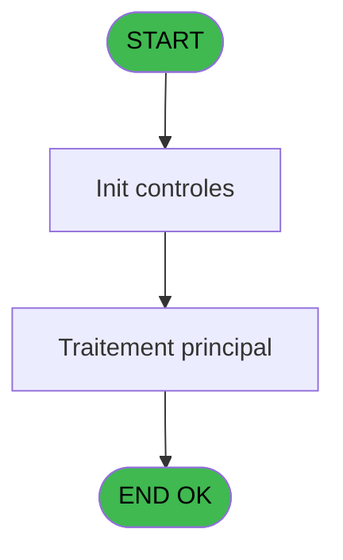
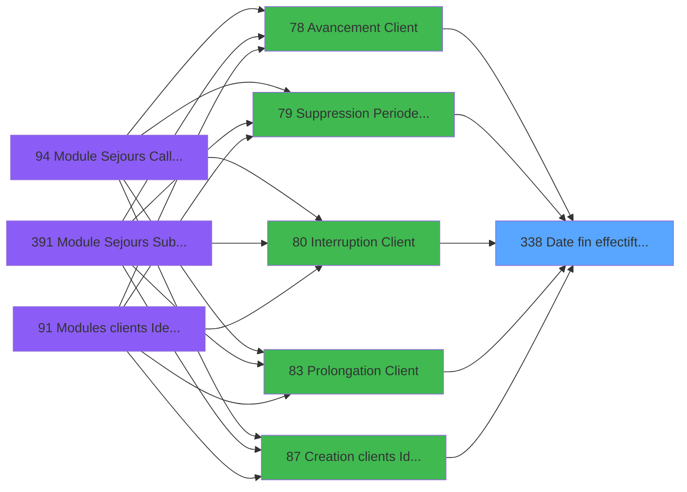

# PBG IDE 338 - Date fin effectif/t transfert

> **Analyse**: Phases 1-4 2026-02-03 11:15 -> 11:15 (17s) | Assemblage 11:15
> **Pipeline**: V7.2 Enrichi
> **Structure**: 4 onglets (Resume | Ecrans | Donnees | Connexions)

<!-- TAB:Resume -->

## 1. FICHE D'IDENTITE

| Attribut | Valeur |
|----------|--------|
| Projet | PBG |
| IDE Position | 338 |
| Nom Programme | Date fin effectif/t transfert |
| Fichier source | `Prg_338.xml` |
| Dossier IDE | General |
| Taches | 2 (0 ecrans visibles) |
| Tables modifiees | 0 |
| Programmes appeles | 0 |

## 2. DESCRIPTION FONCTIONNELLE

**Date fin effectif/t transfert** assure la gestion complete de ce processus, accessible depuis [Traitement des Voyages (IDE 213)](PBG-IDE-213.md), [   Avancement Client (IDE 78)](PBG-IDE-78.md), [   Suppression Periode Client (IDE 79)](PBG-IDE-79.md), [   Interruption Client (IDE 80)](PBG-IDE-80.md), [   Prolongation Client (IDE 83)](PBG-IDE-83.md), [Creation clients Identite (IDE 87)](PBG-IDE-87.md), [Modules clients Identite (IDE 91)](PBG-IDE-91.md), [    Validation Auto filiations (IDE 121)](PBG-IDE-121.md), [    Validation Auto seminaire (IDE 122)](PBG-IDE-122.md), [  Interruption Personnel (IDE 190)](PBG-IDE-190.md), [  Prolongation Personnel (IDE 192)](PBG-IDE-192.md).

Le flux de traitement s'organise en **1 blocs fonctionnels** :

- **Transfert** (2 taches) : transferts de donnees entre modules ou deversements

## 3. BLOCS FONCTIONNELS

### 3.1 Transfert (2 taches)

Transfert de donnees entre modules.

---

#### 338 - Date fin effectif/t transfert

**Role** : Transfert de donnees : Date fin effectif/t transfert.
**Variables liees** : B (i.Date retour)

---

#### 338.1 - Date fin effectif/t transfert

**Role** : Transfert de donnees : Date fin effectif/t transfert.
**Variables liees** : B (i.Date retour)

## 5. REGLES METIER

*(Aucune regle metier identifiee)*

## 6. CONTEXTE

- **Appele par**: [Traitement des Voyages (IDE 213)](PBG-IDE-213.md), [   Avancement Client (IDE 78)](PBG-IDE-78.md), [   Suppression Periode Client (IDE 79)](PBG-IDE-79.md), [   Interruption Client (IDE 80)](PBG-IDE-80.md), [   Prolongation Client (IDE 83)](PBG-IDE-83.md), [Creation clients Identite (IDE 87)](PBG-IDE-87.md), [Modules clients Identite (IDE 91)](PBG-IDE-91.md), [    Validation Auto filiations (IDE 121)](PBG-IDE-121.md), [    Validation Auto seminaire (IDE 122)](PBG-IDE-122.md), [  Interruption Personnel (IDE 190)](PBG-IDE-190.md), [  Prolongation Personnel (IDE 192)](PBG-IDE-192.md)
- **Appelle**: 0 programmes | **Tables**: 2 (W:0 R:1 L:1) | **Taches**: 2 | **Expressions**: 10

<!-- TAB:Ecrans -->

## 8. ECRANS

*(Programme sans ecran visible)*

## 9. NAVIGATION

### 9.3 Structure hierarchique (2 taches)

| Position | Tache | Type | Dimensions | Bloc |
|----------|-------|------|------------|------|
| **338.1** | [**Date fin effectif/t transfert** (338)](#t1) | - | - | Transfert |
| 338.1.1 | [Date fin effectif/t transfert (338.1)](#t4) | - | - | |

### 9.4 Algorigramme

> **Legende**: Vert = START/END OK | Rouge = END KO | Bleu = Decisions
> *Algorigramme auto-genere. Utiliser `/algorigramme` pour une synthese metier detaillee.*

<!-- TAB:Donnees -->

## 10. TABLES

### Tables utilisees (2)

| ID | Nom | Description | Type | R | W | L | Usages |
|----|-----|-------------|------|---|---|---|--------|
| 113 | tables_village |  | DB | R |   |   | 1 |
| 1023 | Table_1023 |  | MEM |   |   | L | 1 |

### Colonnes par table (0 / 1 tables avec colonnes identifiees)

Table 113 - tables_village (R) - 1 usages

*Table utilisee uniquement en Link ou aucune colonne Real identifiee dans le DataView.*

## 11. VARIABLES

### 11.1 Autres (4)

Variables diverses.

| Lettre | Nom | Type | Usage dans |
|--------|-----|------|-----------|
| A | i.Code vol/Nom logement Z | Unicode | - |
| B | i.Date retour | Date | - |
| C | i.Heure initialie | Unicode | - |
| D | o.Heure avec décalage | Unicode | - |

## 12. EXPRESSIONS

**10 / 10 expressions decodees (100%)**

### 12.1 Repartition par type

| Type | Expressions | Regles |
|------|-------------|--------|
| FORMAT | 1 | 0 |
| CONSTANTE | 3 | 0 |
| CONDITION | 1 | 0 |
| OTHER | 5 | 0 |

### 12.2 Expressions cles par type

#### FORMAT (1 expressions)

| Type | IDE | Expression | Regle |
|------|-----|------------|-------|
| FORMAT | 7 | `Str(Val({1,16}, '2') - ([W]/60), '2')` | - |

#### CONSTANTE (3 expressions)

| Type | IDE | Expression | Regle |
|------|-----|------------|-------|
| CONSTANTE | 9 | `'R'` | - |
| CONSTANTE | 5 | `'F'` | - |
| CONSTANTE | 4 | `'AERGR'` | - |

#### CONDITION (1 expressions)

| Type | IDE | Expression | Regle |
|------|-----|------------|-------|
| CONDITION | 1 | `VG76 AND [AB]<>''` | - |

#### OTHER (5 expressions)

| Type | IDE | Expression | Regle |
|------|-----|------------|-------|
| OTHER | 8 | `{1,1}` | - |
| OTHER | 10 | `[AD]` | - |
| OTHER | 6 | `{1,28}` | - |
| OTHER | 2 | `[P]` | - |
| OTHER | 3 | `GetParam ('SOCIETE')` | - |

<!-- TAB:Connexions -->

## 13. GRAPHE D'APPELS

### 13.1 Chaine depuis Main (Callers)

Main -> ... -> [Traitement des Voyages (IDE 213)](PBG-IDE-213.md) -> **Date fin effectif/t transfert (IDE 338)**

Main -> ... -> [   Avancement Client (IDE 78)](PBG-IDE-78.md) -> **Date fin effectif/t transfert (IDE 338)**

Main -> ... -> [   Suppression Periode Client (IDE 79)](PBG-IDE-79.md) -> **Date fin effectif/t transfert (IDE 338)**

Main -> ... -> [   Interruption Client (IDE 80)](PBG-IDE-80.md) -> **Date fin effectif/t transfert (IDE 338)**

Main -> ... -> [   Prolongation Client (IDE 83)](PBG-IDE-83.md) -> **Date fin effectif/t transfert (IDE 338)**

Main -> ... -> [Creation clients Identite (IDE 87)](PBG-IDE-87.md) -> **Date fin effectif/t transfert (IDE 338)**

Main -> ... -> [Modules clients Identite (IDE 91)](PBG-IDE-91.md) -> **Date fin effectif/t transfert (IDE 338)**

Main -> ... -> [    Validation Auto filiations (IDE 121)](PBG-IDE-121.md) -> **Date fin effectif/t transfert (IDE 338)**

Main -> ... -> [    Validation Auto seminaire (IDE 122)](PBG-IDE-122.md) -> **Date fin effectif/t transfert (IDE 338)**

Main -> ... -> [  Interruption Personnel (IDE 190)](PBG-IDE-190.md) -> **Date fin effectif/t transfert (IDE 338)**

Main -> ... -> [  Prolongation Personnel (IDE 192)](PBG-IDE-192.md) -> **Date fin effectif/t transfert (IDE 338)**

### 13.2 Callers

| IDE | Nom Programme | Nb Appels |
|-----|---------------|-----------|
| [213](PBG-IDE-213.md) | Traitement des Voyages | 2 |
| [78](PBG-IDE-78.md) |    Avancement Client | 1 |
| [79](PBG-IDE-79.md) |    Suppression Periode Client | 1 |
| [80](PBG-IDE-80.md) |    Interruption Client | 1 |
| [83](PBG-IDE-83.md) |    Prolongation Client | 1 |
| [87](PBG-IDE-87.md) | Creation clients Identite | 1 |
| [91](PBG-IDE-91.md) | Modules clients Identite | 1 |
| [121](PBG-IDE-121.md) |     Validation Auto filiations | 1 |
| [122](PBG-IDE-122.md) |     Validation Auto seminaire | 1 |
| [190](PBG-IDE-190.md) |   Interruption Personnel | 1 |
| [192](PBG-IDE-192.md) |   Prolongation Personnel | 1 |

### 13.3 Callees (programmes appeles)

### 13.4 Detail Callees avec contexte

| IDE | Nom Programme | Appels | Contexte |
|-----|---------------|--------|----------|
| - | (aucun) | - | - |

## 14. RECOMMANDATIONS MIGRATION

### 14.1 Profil du programme

| Metrique | Valeur | Impact migration |
|----------|--------|-----------------|
| Lignes de logique | 39 | Programme compact |
| Expressions | 10 | Peu de logique |
| Tables WRITE | 0 | Impact faible |
| Sous-programmes | 0 | Peu de dependances |
| Ecrans visibles | 0 | Ecran unique ou traitement batch |
| Code desactive | 0% (0 / 39) | Code sain |
| Regles metier | 0 | Pas de regle identifiee |

### 14.2 Plan de migration par bloc

#### Transfert (2 taches: 0 ecran, 2 traitements)

- **Strategie** : Service `ITransfertService` avec logique de deversement.

### 14.3 Dependances critiques

| Dependance | Type | Appels | Impact |
|------------|------|--------|--------|

---
*Spec DETAILED generee par Pipeline V7.2 - 2026-02-03 11:15*
