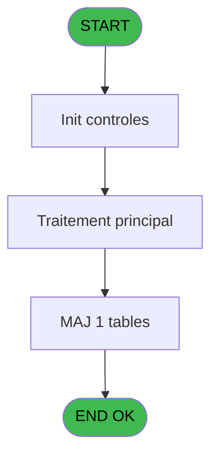
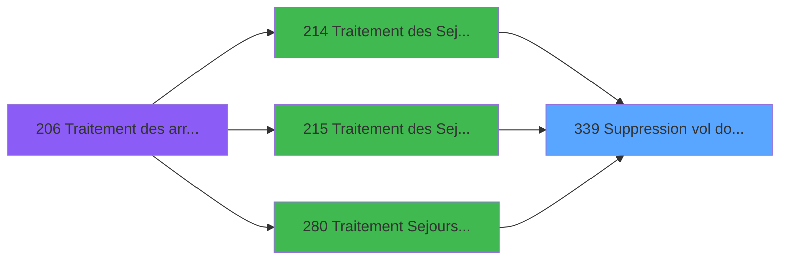

# PBG IDE 339 - Suppression vol doublons

> **Analyse**: Phases 1-4 2026-02-03 11:15 -> 11:16 (17s) | Assemblage 11:16
> **Pipeline**: V7.2 Enrichi
> **Structure**: 4 onglets (Resume | Ecrans | Donnees | Connexions)

<!-- TAB:Resume -->

## 1. FICHE D'IDENTITE

| Attribut | Valeur |
|----------|--------|
| Projet | PBG |
| IDE Position | 339 |
| Nom Programme | Suppression vol doublons |
| Fichier source | `Prg_339.xml` |
| Dossier IDE | General |
| Taches | 4 (0 ecrans visibles) |
| Tables modifiees | 1 |
| Programmes appeles | 0 |

## 2. DESCRIPTION FONCTIONNELLE

**Suppression vol doublons** assure la gestion complete de ce processus, accessible depuis [Traitement Sejours new (IDE 280)](PBG-IDE-280.md), [Traitement des Sejours reprise (IDE 214)](PBG-IDE-214.md), [Traitement des Sejours (IDE 215)](PBG-IDE-215.md).

Le flux de traitement s'organise en **1 blocs fonctionnels** :

- **Traitement** (4 taches) : traitements metier divers

**Donnees modifiees** : 1 tables en ecriture (code_vol_________vot).

Detail : phases du traitement

#### Phase 1 : Traitement (4 taches)

- **339** - Suppression vol doublons
- **339.1** - Suppresion du vol à NULL
- **339.2** - Suppresion du vol à NULL
- **339.1.1** - Suppresion du vol à NULL

#### Tables impactees

| Table | Operations | Role metier |
|-------|-----------|-------------|
| code_vol_________vot | **W** (3 usages) |  |

## 3. BLOCS FONCTIONNELS

### 3.1 Traitement (4 taches)

Traitements internes.

---

#### 339 - Suppression vol doublons

**Role** : Selection par l'operateur : Suppression vol doublons.

---

#### 339.1 - Suppresion du vol à NULL

**Role** : Selection par l'operateur : Suppresion du vol à NULL.

---

#### 339.2 - Suppresion du vol à NULL

**Role** : Selection par l'operateur : Suppresion du vol à NULL.

---

#### 339.1.1 - Suppresion du vol à NULL

**Role** : Selection par l'operateur : Suppresion du vol à NULL.

## 5. REGLES METIER

*(Aucune regle metier identifiee)*

## 6. CONTEXTE

- **Appele par**: [Traitement Sejours new (IDE 280)](PBG-IDE-280.md), [Traitement des Sejours reprise (IDE 214)](PBG-IDE-214.md), [Traitement des Sejours (IDE 215)](PBG-IDE-215.md)
- **Appelle**: 0 programmes | **Tables**: 1 (W:1 R:0 L:0) | **Taches**: 4 | **Expressions**: 6

<!-- TAB:Ecrans -->

## 8. ECRANS

*(Programme sans ecran visible)*

## 9. NAVIGATION

### 9.3 Structure hierarchique (4 taches)

| Position | Tache | Type | Dimensions | Bloc |
|----------|-------|------|------------|------|
| **339.1** | [**Suppression vol doublons** (339)](#t4) | - | - | Traitement |
| 339.1.1 | [Suppresion du vol à NULL (339.1)](#t35) | - | - | |
| 339.1.2 | [Suppresion du vol à NULL (339.2)](#t44) | - | - | |
| 339.1.3 | [Suppresion du vol à NULL (339.1.1)](#t47) | - | - | |

### 9.4 Algorigramme

> **Legende**: Vert = START/END OK | Rouge = END KO | Bleu = Decisions
> *Algorigramme auto-genere. Utiliser `/algorigramme` pour une synthese metier detaillee.*

<!-- TAB:Donnees -->

## 10. TABLES

### Tables utilisees (1)

| ID | Nom | Description | Type | R | W | L | Usages |
|----|-----|-------------|------|---|---|---|--------|
| 132 | code_vol_________vot |  | DB |   | **W** |   | 3 |

### Colonnes par table (1 / 1 tables avec colonnes identifiees)

Table 132 - code_vol_________vot (**W**) - 3 usages

| Lettre | Variable | Acces | Type |
|--------|----------|-------|------|
| F | v.code_vol | W | Unicode |

## 11. VARIABLES

### 11.1 Variables de session (6)

Variables persistantes pendant toute la session.

| Lettre | Nom | Type | Usage dans |
|--------|-----|------|-----------|
| A | v.nombre enreg | Numeric | - |
| B | v.societe | Unicode | - |
| C | v.aller_div_retour | Unicode | - |
| D | v.date | Unicode | - |
| E | v.selection | Unicode | - |
| F | v.code_vol | Unicode | - |

## 12. EXPRESSIONS

**6 / 6 expressions decodees (100%)**

### 12.1 Repartition par type

| Type | Expressions | Regles |
|------|-------------|--------|
| CONSTANTE | 1 | 0 |
| DATE | 1 | 0 |
| OTHER | 4 | 0 |

### 12.2 Expressions cles par type

#### CONSTANTE (1 expressions)

| Type | IDE | Expression | Regle |
|------|-----|------------|-------|
| CONSTANTE | 6 | `''` | - |

#### DATE (1 expressions)

| Type | IDE | Expression | Regle |
|------|-----|------------|-------|
| DATE | 3 | `DVal({1,30},'YYYYMMDD')` | - |

#### OTHER (4 expressions)

| Type | IDE | Expression | Regle |
|------|-----|------------|-------|
| OTHER | 4 | `{1,32}` | - |
| OTHER | 5 | `{1,33}` | - |
| OTHER | 1 | `{1,28}` | - |
| OTHER | 2 | `{1,29}` | - |

<!-- TAB:Connexions -->

## 13. GRAPHE D'APPELS

### 13.1 Chaine depuis Main (Callers)

Main -> ... -> [Traitement Sejours new (IDE 280)](PBG-IDE-280.md) -> **Suppression vol doublons (IDE 339)**

Main -> ... -> [Traitement des Sejours reprise (IDE 214)](PBG-IDE-214.md) -> **Suppression vol doublons (IDE 339)**

Main -> ... -> [Traitement des Sejours (IDE 215)](PBG-IDE-215.md) -> **Suppression vol doublons (IDE 339)**

### 13.2 Callers

| IDE | Nom Programme | Nb Appels |
|-----|---------------|-----------|
| [280](PBG-IDE-280.md) | Traitement Sejours new | 2 |
| [214](PBG-IDE-214.md) | Traitement des Sejours reprise | 1 |
| [215](PBG-IDE-215.md) | Traitement des Sejours | 1 |

### 13.3 Callees (programmes appeles)

### 13.4 Detail Callees avec contexte

| IDE | Nom Programme | Appels | Contexte |
|-----|---------------|--------|----------|
| - | (aucun) | - | - |

## 14. RECOMMANDATIONS MIGRATION

### 14.1 Profil du programme

| Metrique | Valeur | Impact migration |
|----------|--------|-----------------|
| Lignes de logique | 48 | Programme compact |
| Expressions | 6 | Peu de logique |
| Tables WRITE | 1 | Impact faible |
| Sous-programmes | 0 | Peu de dependances |
| Ecrans visibles | 0 | Ecran unique ou traitement batch |
| Code desactive | 0% (0 / 48) | Code sain |
| Regles metier | 0 | Pas de regle identifiee |

### 14.2 Plan de migration par bloc

#### Traitement (4 taches: 0 ecran, 4 traitements)

- **Strategie** : 4 service(s) backend injectable(s) (Domain Services).
- Decomposer les taches en services unitaires testables.

### 14.3 Dependances critiques

| Dependance | Type | Appels | Impact |
|------------|------|--------|--------|
| code_vol_________vot | Table WRITE (Database) | 3x | Schema + repository |

---
*Spec DETAILED generee par Pipeline V7.2 - 2026-02-03 11:16*
