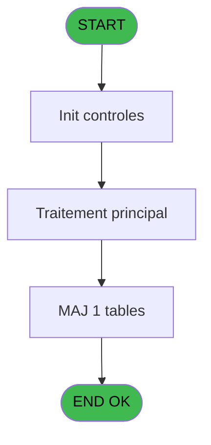
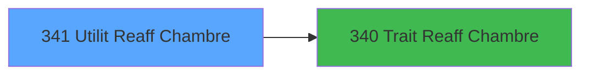

# PBG IDE 341 - Utilit Reaff Chambre

> **Analyse**: Phases 1-4 2026-02-03 11:16 -> 11:17 (17s) | Assemblage 11:17
> **Pipeline**: V7.2 Enrichi
> **Structure**: 4 onglets (Resume | Ecrans | Donnees | Connexions)

<!-- TAB:Resume -->

## 1. FICHE D'IDENTITE

| Attribut | Valeur |
|----------|--------|
| Projet | PBG |
| IDE Position | 341 |
| Nom Programme | Utilit Reaff Chambre |
| Fichier source | `Prg_341.xml` |
| Dossier IDE | General |
| Taches | 1 (1 ecrans visibles) |
| Tables modifiees | 1 |
| Programmes appeles | 1 |
| :warning: Statut | **ORPHELIN_POTENTIEL** |

## 2. DESCRIPTION FONCTIONNELLE

**Utilit Reaff Chambre** assure la gestion complete de ce processus.

Le flux de traitement s'organise en **1 blocs fonctionnels** :

- **Traitement** (1 tache) : traitements metier divers

**Donnees modifiees** : 1 tables en ecriture (fichier_statistiques).

## 3. BLOCS FONCTIONNELS

### 3.1 Traitement (1 tache)

Traitements internes.

---

#### 341 - Utilitaire [[ECRAN]](#ecran-t1)

**Role** : Traitement : Utilitaire.
**Ecran** : 528 x 224 DLU | [Voir mockup](#ecran-t1)
**Delegue a** : [Trait Reaff Chambre (IDE 340)](PBG-IDE-340.md)

## 5. REGLES METIER

*(Aucune regle metier identifiee)*

## 6. CONTEXTE

- **Appele par**: (aucun)
- **Appelle**: 1 programmes | **Tables**: 2 (W:1 R:0 L:1) | **Taches**: 1 | **Expressions**: 7

<!-- TAB:Ecrans -->

## 8. ECRANS

### 8.1 Forms visibles (1 / 1)

| # | Position | Tache | Nom | Type | Largeur | Hauteur | Bloc |
|---|----------|-------|-----|------|---------|---------|------|
| 1 | 341 | 341 | Utilitaire | Type0 | 528 | 224 | Traitement |

### 8.2 Mockups Ecrans

---

#### 341 - Utilitaire
**Tache** : [341](#t1) | **Type** : Type0 | **Dimensions** : 528 x 224 DLU
**Bloc** : Traitement | **Titre IDE** : Utilitaire

<!-- FORM-DATA:
{
    "width":  528,
    "vFactor":  8,
    "type":  "Type0",
    "hFactor":  8,
    "controls":  [
                     {
                         "x":  8,
                         "type":  "table",
                         "var":  "",
                         "name":  "",
                         "titleH":  12,
                         "color":  "110",
                         "w":  512,
                         "y":  27,
                         "fmt":  "",
                         "parent":  null,
                         "text":  "",
                         "rowH":  13,
                         "h":  160,
                         "cols":  [
                                      {
                                          "title":  "Date",
                                          "layer":  1,
                                          "w":  136
                                      },
                                      {
                                          "title":  "Arrivants",
                                          "layer":  2,
                                          "w":  138
                                      },
                                      {
                                          "title":  "Commentaire",
                                          "layer":  3,
                                          "w":  196
                                      }
                                  ],
                         "rows":  3
                     },
                     {
                         "x":  8,
                         "type":  "label",
                         "var":  "",
                         "y":  2,
                         "w":  512,
                         "fmt":  "",
                         "name":  "",
                         "h":  19,
                         "color":  "",
                         "text":  "",
                         "parent":  null
                     },
                     {
                         "x":  8,
                         "type":  "label",
                         "var":  "",
                         "y":  192,
                         "w":  512,
                         "fmt":  "",
                         "name":  "",
                         "h":  24,
                         "color":  "",
                         "text":  "",
                         "parent":  null
                     },
                     {
                         "x":  18,
                         "type":  "edit",
                         "var":  "",
                         "y":  8,
                         "w":  268,
                         "fmt":  "30",
                         "name":  "",
                         "h":  8,
                         "color":  "",
                         "text":  "",
                         "parent":  null
                     },
                     {
                         "x":  304,
                         "type":  "edit",
                         "var":  "",
                         "y":  8,
                         "w":  204,
                         "fmt":  "WWW DD MMM YYYYT",
                         "name":  "",
                         "h":  8,
                         "color":  "",
                         "text":  "",
                         "parent":  null
                     },
                     {
                         "x":  16,
                         "type":  "edit",
                         "var":  "",
                         "y":  42,
                         "w":  122,
                         "fmt":  "##/##/####Z",
                         "name":  "date_import",
                         "h":  10,
                         "color":  "110",
                         "text":  "",
                         "parent":  1
                     },
                     {
                         "x":  232,
                         "type":  "edit",
                         "var":  "",
                         "y":  42,
                         "w":  45,
                         "fmt":  "",
                         "name":  "nombre_arrivants",
                         "h":  10,
                         "color":  "110",
                         "text":  "",
                         "parent":  1
                     },
                     {
                         "x":  286,
                         "type":  "edit",
                         "var":  "",
                         "y":  42,
                         "w":  186,
                         "fmt":  "",
                         "name":  "commentaire",
                         "h":  10,
                         "color":  "110",
                         "text":  "",
                         "parent":  1
                     },
                     {
                         "x":  22,
                         "type":  "button",
                         "var":  "",
                         "y":  195,
                         "w":  168,
                         "fmt":  "Réa\u0026ffecter",
                         "name":  "",
                         "h":  18,
                         "color":  "",
                         "text":  "",
                         "parent":  null
                     },
                     {
                         "x":  337,
                         "type":  "button",
                         "var":  "",
                         "y":  195,
                         "w":  168,
                         "fmt":  "\u0026Quitter",
                         "name":  "",
                         "h":  18,
                         "color":  "",
                         "text":  "",
                         "parent":  null
                     }
                 ],
    "taskId":  "341",
    "height":  224
}
-->

<strong>Champs : 5 champs</strong>

| Pos (x,y) | Nom | Variable | Type |
|-----------|-----|----------|------|
| 18,8 | 30 | - | edit |
| 304,8 | WWW DD MMM YYYYT | - | edit |
| 16,42 | date_import | - | edit |
| 232,42 | nombre_arrivants | - | edit |
| 286,42 | commentaire | - | edit |

<strong>Boutons : 2 boutons</strong>

| Bouton | Pos (x,y) | Action |
|--------|-----------|--------|
| Réaffecter | 22,195 | Bouton fonctionnel |
| Quitter | 337,195 | Quitte le programme |

## 9. NAVIGATION

Ecran unique: **Utilitaire**

### 9.3 Structure hierarchique (1 tache)

| Position | Tache | Type | Dimensions | Bloc |
|----------|-------|------|------------|------|
| **341.1** | [**Utilitaire** (341)](#t1) [mockup](#ecran-t1) | - | 528x224 | Traitement |

### 9.4 Algorigramme

> **Legende**: Vert = START/END OK | Rouge = END KO | Bleu = Decisions
> *Algorigramme auto-genere. Utiliser `/algorigramme` pour une synthese metier detaillee.*

<!-- TAB:Donnees -->

## 10. TABLES

### Tables utilisees (2)

| ID | Nom | Description | Type | R | W | L | Usages |
|----|-----|-------------|------|---|---|---|--------|
| 129 | fichier_statistiques |  | DB |   | **W** |   | 1 |
| 558 | import_troncon___imt |  | TMP |   |   | L | 1 |

### Colonnes par table (0 / 1 tables avec colonnes identifiees)

Table 129 - fichier_statistiques (**W**) - 1 usages

*Table utilisee uniquement en Link ou aucune colonne Real identifiee dans le DataView.*

## 11. VARIABLES

*(Programme sans variables locales mappees)*

## 12. EXPRESSIONS

**7 / 7 expressions decodees (100%)**

### 12.1 Repartition par type

| Type | Expressions | Regles |
|------|-------------|--------|
| DATE | 1 | 0 |
| REFERENCE_VG | 1 | 0 |
| OTHER | 4 | 0 |
| CONDITION | 1 | 0 |

### 12.2 Expressions cles par type

#### DATE (1 expressions)

| Type | IDE | Expression | Regle |
|------|-----|------------|-------|
| DATE | 1 | `Date()` | - |

#### REFERENCE_VG (1 expressions)

| Type | IDE | Expression | Regle |
|------|-----|------------|-------|
| REFERENCE_VG | 2 | `VG21` | - |

#### OTHER (4 expressions)

| Type | IDE | Expression | Regle |
|------|-----|------------|-------|
| OTHER | 6 | `[C]` | - |
| OTHER | 7 | `[M]` | - |
| OTHER | 3 | `[C]` | - |
| OTHER | 5 | `[B]` | - |

#### CONDITION (1 expressions)

| Type | IDE | Expression | Regle |
|------|-----|------------|-------|
| CONDITION | 4 | `[C]<>0` | - |

<!-- TAB:Connexions -->

## 13. GRAPHE D'APPELS

### 13.1 Chaine depuis Main (Callers)

**Chemin**: (pas de callers directs)

### 13.2 Callers

| IDE | Nom Programme | Nb Appels |
|-----|---------------|-----------|
| - | (aucun) | - |

### 13.3 Callees (programmes appeles)

### 13.4 Detail Callees avec contexte

| IDE | Nom Programme | Appels | Contexte |
|-----|---------------|--------|----------|
| [340](PBG-IDE-340.md) | Trait Reaff Chambre | 1 | Sous-programme |

## 14. RECOMMANDATIONS MIGRATION

### 14.1 Profil du programme

| Metrique | Valeur | Impact migration |
|----------|--------|-----------------|
| Lignes de logique | 18 | Programme compact |
| Expressions | 7 | Peu de logique |
| Tables WRITE | 1 | Impact faible |
| Sous-programmes | 1 | Peu de dependances |
| Ecrans visibles | 1 | Ecran unique ou traitement batch |
| Code desactive | 0% (0 / 18) | Code sain |
| Regles metier | 0 | Pas de regle identifiee |

### 14.2 Plan de migration par bloc

#### Traitement (1 tache: 1 ecran, 0 traitement)

- **Strategie** : 1 composant(s) UI (Razor/React) avec formulaires et validation.
- 1 sous-programme(s) a migrer ou a reutiliser depuis les services existants.
- Decomposer les taches en services unitaires testables.

### 14.3 Dependances critiques

| Dependance | Type | Appels | Impact |
|------------|------|--------|--------|
| fichier_statistiques | Table WRITE (Database) | 1x | Schema + repository |
| [Trait Reaff Chambre (IDE 340)](PBG-IDE-340.md) | Sous-programme | 1x | Normale - Sous-programme |

---
*Spec DETAILED generee par Pipeline V7.2 - 2026-02-03 11:17*
