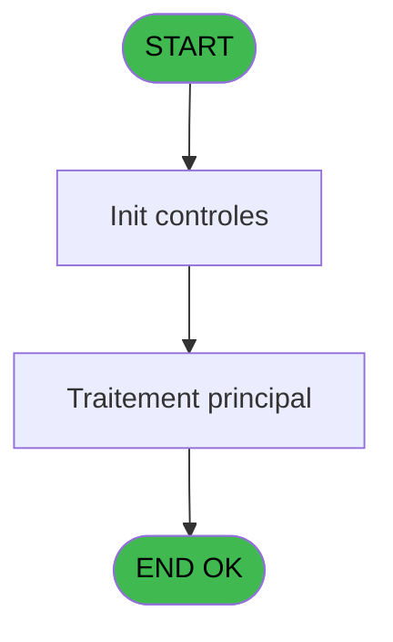
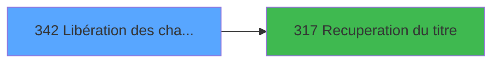

# PBG IDE 342 - Libération des chambres

> **Analyse**: Phases 1-4 2026-02-03 11:17 -> 11:17 (17s) | Assemblage 11:17
> **Pipeline**: V7.2 Enrichi
> **Structure**: 4 onglets (Resume | Ecrans | Donnees | Connexions)

<!-- TAB:Resume -->

## 1. FICHE D'IDENTITE

| Attribut | Valeur |
|----------|--------|
| Projet | PBG |
| IDE Position | 342 |
| Nom Programme | Libération des chambres |
| Fichier source | `Prg_342.xml` |
| Dossier IDE | General |
| Taches | 6 (1 ecrans visibles) |
| Tables modifiees | 0 |
| Programmes appeles | 1 |
| :warning: Statut | **ORPHELIN_POTENTIEL** |

## 2. DESCRIPTION FONCTIONNELLE

**Libération des chambres** assure la gestion complete de ce processus.

Le flux de traitement s'organise en **2 blocs fonctionnels** :

- **Traitement** (5 taches) : traitements metier divers
- **Consultation** (1 tache) : ecrans de recherche, selection et consultation

Detail : phases du traitement

#### Phase 1 : Consultation (1 tache)

- **342** - Choix Date **[[ECRAN]](#ecran-t3)**

Delegue a : [Recuperation du titre (IDE 317)](PBG-IDE-317.md)

#### Phase 2 : Traitement (5 taches)

- **342.1** - DSQL update cafil012
- **342.2** - DSQL update cafil012
- **342.3** - DSQL update cafil012
- **342.4** - DSQL update cafil012
- **342.5** - DSQL update cafil012

Delegue a : [Recuperation du titre (IDE 317)](PBG-IDE-317.md)

## 3. BLOCS FONCTIONNELS

### 3.1 Consultation (1 tache)

Ecrans de recherche et consultation.

---

#### 342 - Choix Date [[ECRAN]](#ecran-t3)

**Role** : Selection par l'operateur : Choix Date.
**Ecran** : 530 x 111 DLU (MDI) | [Voir mockup](#ecran-t3)
**Variables liees** : A (W1-Date), B (W1bouton date)

### 3.2 Traitement (5 taches)

Traitements internes.

---

#### 342.1 - DSQL update cafil012

**Role** : Traitement : DSQL update cafil012.
**Delegue a** : [Recuperation du titre (IDE 317)](PBG-IDE-317.md)

---

#### 342.2 - DSQL update cafil012

**Role** : Traitement : DSQL update cafil012.
**Delegue a** : [Recuperation du titre (IDE 317)](PBG-IDE-317.md)

---

#### 342.3 - DSQL update cafil012

**Role** : Traitement : DSQL update cafil012.
**Delegue a** : [Recuperation du titre (IDE 317)](PBG-IDE-317.md)

---

#### 342.4 - DSQL update cafil012

**Role** : Traitement : DSQL update cafil012.
**Delegue a** : [Recuperation du titre (IDE 317)](PBG-IDE-317.md)

---

#### 342.5 - DSQL update cafil012

**Role** : Traitement : DSQL update cafil012.
**Delegue a** : [Recuperation du titre (IDE 317)](PBG-IDE-317.md)

## 5. REGLES METIER

*(Aucune regle metier identifiee)*

## 6. CONTEXTE

- **Appele par**: (aucun)
- **Appelle**: 1 programmes | **Tables**: 0 (W:0 R:0 L:0) | **Taches**: 6 | **Expressions**: 11

<!-- TAB:Ecrans -->

## 8. ECRANS

### 8.1 Forms visibles (1 / 6)

| # | Position | Tache | Nom | Type | Largeur | Hauteur | Bloc |
|---|----------|-------|-----|------|---------|---------|------|
| 1 | 342.1 | 342 | Choix Date | MDI | 530 | 111 | Consultation |

### 8.2 Mockups Ecrans

---

#### 342.1 - Choix Date
**Tache** : [342](#t3) | **Type** : MDI | **Dimensions** : 530 x 111 DLU
**Bloc** : Consultation | **Titre IDE** : Choix Date

<!-- FORM-DATA:
{
    "width":  530,
    "vFactor":  8,
    "type":  "MDI",
    "hFactor":  8,
    "controls":  [
                     {
                         "x":  1,
                         "type":  "label",
                         "var":  "",
                         "y":  2,
                         "w":  523,
                         "fmt":  "",
                         "name":  "",
                         "h":  21,
                         "color":  "",
                         "text":  "",
                         "parent":  null
                     },
                     {
                         "x":  241,
                         "type":  "label",
                         "var":  "",
                         "y":  37,
                         "w":  258,
                         "fmt":  "",
                         "name":  "",
                         "h":  28,
                         "color":  "195",
                         "text":  "Date de depart.",
                         "parent":  null
                     },
                     {
                         "x":  0,
                         "type":  "label",
                         "var":  "",
                         "y":  83,
                         "w":  523,
                         "fmt":  "",
                         "name":  "",
                         "h":  24,
                         "color":  "",
                         "text":  "",
                         "parent":  null
                     },
                     {
                         "x":  281,
                         "type":  "edit",
                         "var":  "",
                         "y":  48,
                         "w":  123,
                         "fmt":  "DD/MM/YYYY",
                         "name":  "W1-Date",
                         "h":  9,
                         "color":  "110",
                         "text":  "",
                         "parent":  5
                     },
                     {
                         "x":  409,
                         "type":  "button",
                         "var":  "",
                         "y":  48,
                         "w":  26,
                         "fmt":  "...",
                         "name":  "W1bouton date",
                         "h":  9,
                         "color":  "",
                         "text":  "",
                         "parent":  5
                     },
                     {
                         "x":  8,
                         "type":  "button",
                         "var":  "",
                         "y":  86,
                         "w":  154,
                         "fmt":  "",
                         "name":  "W1-bouton valider",
                         "h":  18,
                         "color":  "",
                         "text":  "",
                         "parent":  null
                     },
                     {
                         "x":  315,
                         "type":  "edit",
                         "var":  "",
                         "y":  7,
                         "w":  203,
                         "fmt":  "WWW DD MMM YYYYT",
                         "name":  "",
                         "h":  8,
                         "color":  "",
                         "text":  "",
                         "parent":  null
                     },
                     {
                         "x":  11,
                         "type":  "edit",
                         "var":  "",
                         "y":  8,
                         "w":  267,
                         "fmt":  "20",
                         "name":  "",
                         "h":  8,
                         "color":  "",
                         "text":  "",
                         "parent":  null
                     },
                     {
                         "x":  35,
                         "type":  "image",
                         "var":  "",
                         "y":  26,
                         "w":  165,
                         "fmt":  "",
                         "name":  "",
                         "h":  52,
                         "color":  "",
                         "text":  "",
                         "parent":  null
                     },
                     {
                         "x":  359,
                         "type":  "button",
                         "var":  "",
                         "y":  86,
                         "w":  154,
                         "fmt":  "A\u0026bandonner",
                         "name":  "",
                         "h":  18,
                         "color":  "",
                         "text":  "",
                         "parent":  null
                     }
                 ],
    "taskId":  "342.1",
    "height":  111
}
-->

<strong>Champs : 3 champs</strong>

| Pos (x,y) | Nom | Variable | Type |
|-----------|-----|----------|------|
| 281,48 | W1-Date | - | edit |
| 315,7 | WWW DD MMM YYYYT | - | edit |
| 11,8 | 20 | - | edit |

<strong>Boutons : 3 boutons</strong>

| Bouton | Pos (x,y) | Action |
|--------|-----------|--------|
| ... | 409,48 | Bouton fonctionnel |
| W1-bouton valider | 8,86 | Valide la saisie et enregistre |
| Abandonner | 359,86 | Annule et retour au menu |

## 9. NAVIGATION

Ecran unique: **Choix Date**

### 9.3 Structure hierarchique (6 taches)

| Position | Tache | Type | Dimensions | Bloc |
|----------|-------|------|------------|------|
| **342.1** | [**Choix Date** (342)](#t3) [mockup](#ecran-t3) | MDI | 530x111 | Consultation |
| **342.2** | [**DSQL update cafil012** (342.1)](#t9) | - | - | Traitement |
| 342.2.1 | [DSQL update cafil012 (342.2)](#t13) | - | - | |
| 342.2.2 | [DSQL update cafil012 (342.3)](#t17) | - | - | |
| 342.2.3 | [DSQL update cafil012 (342.4)](#t20) | - | - | |
| 342.2.4 | [DSQL update cafil012 (342.5)](#t23) | - | - | |

### 9.4 Algorigramme

> **Legende**: Vert = START/END OK | Rouge = END KO | Bleu = Decisions
> *Algorigramme auto-genere. Utiliser `/algorigramme` pour une synthese metier detaillee.*

<!-- TAB:Donnees -->

## 10. TABLES

### Tables utilisees (0)

| ID | Nom | Description | Type | R | W | L | Usages |
|----|-----|-------------|------|---|---|---|--------|

### Colonnes par table (0 / 0 tables avec colonnes identifiees)

## 11. VARIABLES

### 11.1 Variables de session (1)

Variables persistantes pendant toute la session.

| Lettre | Nom | Type | Usage dans |
|--------|-----|------|-----------|
| E | v. titre | Alpha | 1x session |

### 11.2 Autres (4)

Variables diverses.

| Lettre | Nom | Type | Usage dans |
|--------|-----|------|-----------|
| A | W1-Date | Date | 1x refs |
| B | W1bouton date | Alpha | - |
| C | W1-confirmation | Numeric | 1x refs |
| D | W1-bouton valider | Alpha | - |

## 12. EXPRESSIONS

**11 / 11 expressions decodees (100%)**

### 12.1 Repartition par type

| Type | Expressions | Regles |
|------|-------------|--------|
| CONSTANTE | 3 | 0 |
| CONDITION | 2 | 0 |
| DATE | 2 | 0 |
| FORMAT | 1 | 0 |
| REFERENCE_VG | 1 | 0 |
| OTHER | 1 | 0 |
| STRING | 1 | 0 |

### 12.2 Expressions cles par type

#### CONSTANTE (3 expressions)

| Type | IDE | Expression | Regle |
|------|-----|------------|-------|
| CONSTANTE | 9 | `'La date doit être inférieure à la date du jour !'` | - |
| CONSTANTE | 8 | `'&Valider'` | - |
| CONSTANTE | 4 | `20` | - |

#### CONDITION (2 expressions)

| Type | IDE | Expression | Regle |
|------|-----|------------|-------|
| CONDITION | 1 | `W1-confirmation [C]=6` | - |
| CONDITION | 2 | `W1-Date [A]>=Date ()` | - |

#### DATE (2 expressions)

| Type | IDE | Expression | Regle |
|------|-----|------------|-------|
| DATE | 7 | `Date ()-1` | - |
| DATE | 5 | `Date ()` | - |

#### FORMAT (1 expressions)

| Type | IDE | Expression | Regle |
|------|-----|------------|-------|
| FORMAT | 11 | `DStr({1,1},'YYYYMMDD')` | - |

#### REFERENCE_VG (1 expressions)

| Type | IDE | Expression | Regle |
|------|-----|------------|-------|
| REFERENCE_VG | 6 | `VG21` | - |

#### OTHER (1 expressions)

| Type | IDE | Expression | Regle |
|------|-----|------------|-------|
| OTHER | 10 | `MlsTrans('La libération des chambres en départ est terminée')` | - |

#### STRING (1 expressions)

| Type | IDE | Expression | Regle |
|------|-----|------------|-------|
| STRING | 3 | `Trim (v. titre [E])` | - |

<!-- TAB:Connexions -->

## 13. GRAPHE D'APPELS

### 13.1 Chaine depuis Main (Callers)

**Chemin**: (pas de callers directs)

### 13.2 Callers

| IDE | Nom Programme | Nb Appels |
|-----|---------------|-----------|
| - | (aucun) | - |

### 13.3 Callees (programmes appeles)

### 13.4 Detail Callees avec contexte

| IDE | Nom Programme | Appels | Contexte |
|-----|---------------|--------|----------|
| [317](PBG-IDE-317.md) | Recuperation du titre | 1 | Recuperation donnees |

## 14. RECOMMANDATIONS MIGRATION

### 14.1 Profil du programme

| Metrique | Valeur | Impact migration |
|----------|--------|-----------------|
| Lignes de logique | 33 | Programme compact |
| Expressions | 11 | Peu de logique |
| Tables WRITE | 0 | Impact faible |
| Sous-programmes | 1 | Peu de dependances |
| Ecrans visibles | 1 | Ecran unique ou traitement batch |
| Code desactive | 0% (0 / 33) | Code sain |
| Regles metier | 0 | Pas de regle identifiee |

### 14.2 Plan de migration par bloc

#### Consultation (1 tache: 1 ecran, 0 traitement)

- **Strategie** : Composants de recherche/selection en modales.
- 1 ecran : Choix Date

#### Traitement (5 taches: 0 ecran, 5 traitements)

- **Strategie** : 5 service(s) backend injectable(s) (Domain Services).
- 1 sous-programme(s) a migrer ou a reutiliser depuis les services existants.
- Decomposer les taches en services unitaires testables.

### 14.3 Dependances critiques

| Dependance | Type | Appels | Impact |
|------------|------|--------|--------|
| [Recuperation du titre (IDE 317)](PBG-IDE-317.md) | Sous-programme | 1x | Normale - Recuperation donnees |

---
*Spec DETAILED generee par Pipeline V7.2 - 2026-02-03 11:17*
