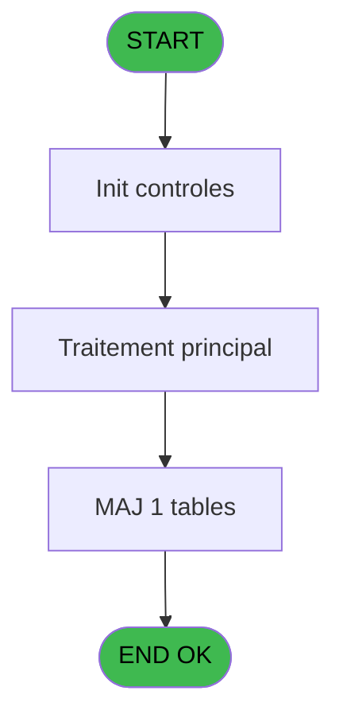

# PBG IDE 343 - Gestion Taxes Séjour

> **Analyse**: Phases 1-4 2026-02-03 11:17 -> 11:17 (17s) | Assemblage 11:17
> **Pipeline**: V7.2 Enrichi
> **Structure**: 4 onglets (Resume | Ecrans | Donnees | Connexions)

<!-- TAB:Resume -->

## 1. FICHE D'IDENTITE

| Attribut | Valeur |
|----------|--------|
| Projet | PBG |
| IDE Position | 343 |
| Nom Programme | Gestion Taxes Séjour |
| Fichier source | `Prg_343.xml` |
| Dossier IDE | General |
| Taches | 2 (0 ecrans visibles) |
| Tables modifiees | 1 |
| Programmes appeles | 0 |
| :warning: Statut | **ORPHELIN_POTENTIEL** |

## 2. DESCRIPTION FONCTIONNELLE

**Gestion Taxes Séjour** assure la gestion complete de ce processus.

Le flux de traitement s'organise en **1 blocs fonctionnels** :

- **Consultation** (2 taches) : ecrans de recherche, selection et consultation

**Donnees modifiees** : 1 tables en ecriture (gm-recherche_____gmr).

## 3. BLOCS FONCTIONNELS

### 3.1 Consultation (2 taches)

Ecrans de recherche et consultation.

---

#### 343 - Choix Date [[ECRAN]](#ecran-t3)

**Role** : Selection par l'operateur : Choix Date.
**Ecran** : 530 x 111 DLU (MDI) | [Voir mockup](#ecran-t3)

---

#### 343.1 - Choix Date [[ECRAN]](#ecran-t26)

**Role** : Selection par l'operateur : Choix Date.
**Ecran** : 530 x 111 DLU (MDI) | [Voir mockup](#ecran-t26)

## 5. REGLES METIER

*(Aucune regle metier identifiee)*

## 6. CONTEXTE

- **Appele par**: (aucun)
- **Appelle**: 0 programmes | **Tables**: 4 (W:1 R:1 L:2) | **Taches**: 2 | **Expressions**: 8

<!-- TAB:Ecrans -->

## 8. ECRANS

*(Programme sans ecran visible)*

## 9. NAVIGATION

### 9.3 Structure hierarchique (2 taches)

| Position | Tache | Type | Dimensions | Bloc |
|----------|-------|------|------------|------|
| **343.1** | [**Choix Date** (343)](#t3) [mockup](#ecran-t3) | MDI | 530x111 | Consultation |
| 343.1.1 | [Choix Date (343.1)](#t26) [mockup](#ecran-t26) | MDI | 530x111 | |

### 9.4 Algorigramme

> **Legende**: Vert = START/END OK | Rouge = END KO | Bleu = Decisions
> *Algorigramme auto-genere. Utiliser `/algorigramme` pour une synthese metier detaillee.*

<!-- TAB:Donnees -->

## 10. TABLES

### Tables utilisees (4)

| ID | Nom | Description | Type | R | W | L | Usages |
|----|-----|-------------|------|---|---|---|--------|
| 30 | gm-recherche_____gmr | Index de recherche | DB |   | **W** |   | 1 |
| 31 | gm-complet_______gmc |  | DB |   |   | L | 1 |
| 372 | pv_budget |  | DB |   |   | L | 1 |
| 837 | ##_pv_customer_dat |  | DB | R |   |   | 1 |

### Colonnes par table (2 / 2 tables avec colonnes identifiees)

Table 30 - gm-recherche_____gmr (**W**) - 1 usages

| Lettre | Variable | Acces | Type |
|--------|----------|-------|------|
| A | P.No Compte | W | Numeric |
| B | P.Filiation_compte | W | Numeric |
| C | P.Toutes les filiations? | W | Logical |
| D | P.Validation?(Dévalider) | W | Logical |
| E | V.Montant de la taxe personnell | W | Numeric |
| F | V.Montant de la taxe | W | Numeric |
| G | V.Age début séjour | W | Numeric |
| H | V.Age fin séjour | W | Numeric |

Table 837 - ##_pv_customer_dat (R) - 1 usages

| Lettre | Variable | Acces | Type |
|--------|----------|-------|------|
| A | P.Jour du séjour | R | Numeric |
| B | V.Age à date | R | Numeric |
| C | V.date écart | R | Date |
| D | V.Mois | R | Numeric |
| E | V.Jour | R | Numeric |
| F | V.Nombre de jour du calcul | R | Numeric |
| G | V.info pour test | R | Logical |
| H | V.info pour test 2 | R | Logical |

## 11. VARIABLES

### 11.1 Parametres entrants (4)

Variables recues en parametre.

| Lettre | Nom | Type | Usage dans |
|--------|-----|------|-----------|
| A | P.No Compte | Numeric | 1x parametre entrant |
| B | P.Filiation_compte | Numeric | 1x parametre entrant |
| C | P.Toutes les filiations? | Logical | 1x parametre entrant |
| D | P.Validation?(Dévalider) | Logical | - |

### 11.2 Variables de session (4)

Variables persistantes pendant toute la session.

| Lettre | Nom | Type | Usage dans |
|--------|-----|------|-----------|
| E | V.Montant de la taxe personnell | Numeric | - |
| F | V.Montant de la taxe | Numeric | - |
| G | V.Age début séjour | Numeric | - |
| H | V.Age fin séjour | Numeric | - |

## 12. EXPRESSIONS

**8 / 8 expressions decodees (100%)**

### 12.1 Repartition par type

| Type | Expressions | Regles |
|------|-------------|--------|
| CALCULATION | 1 | 0 |
| CONSTANTE | 1 | 0 |
| OTHER | 5 | 0 |
| CAST_LOGIQUE | 1 | 0 |

### 12.2 Expressions cles par type

#### CALCULATION (1 expressions)

| Type | IDE | Expression | Regle |
|------|-----|------------|-------|
| CALCULATION | 6 | `[M]+[K]` | - |

#### CONSTANTE (1 expressions)

| Type | IDE | Expression | Regle |
|------|-----|------------|-------|
| CONSTANTE | 8 | `691346` | - |

#### OTHER (5 expressions)

| Type | IDE | Expression | Regle |
|------|-----|------------|-------|
| OTHER | 4 | `[R]` | - |
| OTHER | 5 | `[S]` | - |
| OTHER | 3 | `CndRange(NOT(P.Toutes les filiations? [C]),P.Filiation_compte [B])` | - |
| OTHER | 1 | `GetParam ('SOCIETE')` | - |
| OTHER | 2 | `P.No Compte [A]` | - |

#### CAST_LOGIQUE (1 expressions)

| Type | IDE | Expression | Regle |
|------|-----|------------|-------|
| CAST_LOGIQUE | 7 | `'TRUE'LOG` | - |

<!-- TAB:Connexions -->

## 13. GRAPHE D'APPELS

### 13.1 Chaine depuis Main (Callers)

**Chemin**: (pas de callers directs)

### 13.2 Callers

| IDE | Nom Programme | Nb Appels |
|-----|---------------|-----------|
| - | (aucun) | - |

### 13.3 Callees (programmes appeles)

### 13.4 Detail Callees avec contexte

| IDE | Nom Programme | Appels | Contexte |
|-----|---------------|--------|----------|
| - | (aucun) | - | - |

## 14. RECOMMANDATIONS MIGRATION

### 14.1 Profil du programme

| Metrique | Valeur | Impact migration |
|----------|--------|-----------------|
| Lignes de logique | 67 | Programme compact |
| Expressions | 8 | Peu de logique |
| Tables WRITE | 1 | Impact faible |
| Sous-programmes | 0 | Peu de dependances |
| Ecrans visibles | 0 | Ecran unique ou traitement batch |
| Code desactive | 0% (0 / 67) | Code sain |
| Regles metier | 0 | Pas de regle identifiee |

### 14.2 Plan de migration par bloc

#### Consultation (2 taches: 2 ecrans, 0 traitement)

- **Strategie** : Composants de recherche/selection en modales.
- 2 ecrans : Choix Date, Choix Date

### 14.3 Dependances critiques

| Dependance | Type | Appels | Impact |
|------------|------|--------|--------|
| gm-recherche_____gmr | Table WRITE (Database) | 1x | Schema + repository |

---
*Spec DETAILED generee par Pipeline V7.2 - 2026-02-03 11:17*
