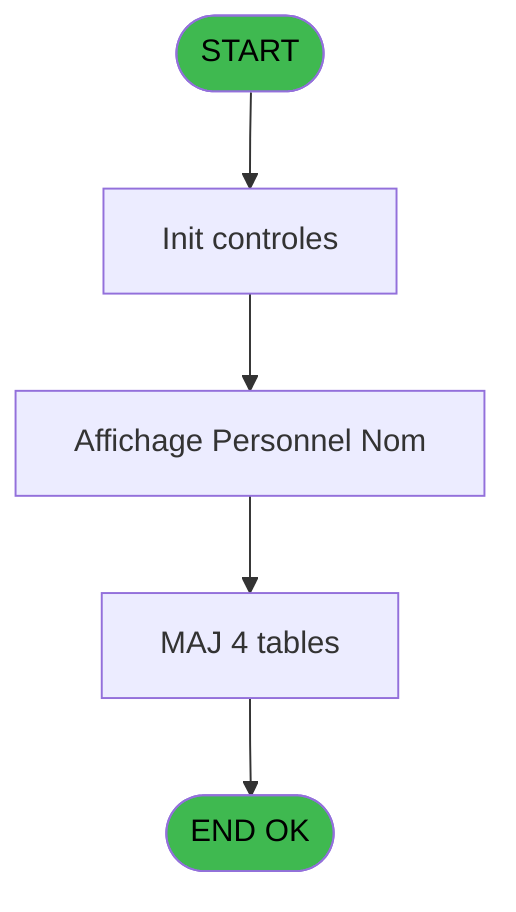

# PBG IDE 345 - Integrite personnel identites

> **Analyse**: Phases 1-4 2026-02-03 11:18 -> 11:18 (17s) | Assemblage 11:18
> **Pipeline**: V7.2 Enrichi
> **Structure**: 4 onglets (Resume | Ecrans | Donnees | Connexions)

<!-- TAB:Resume -->

## 1. FICHE D'IDENTITE

| Attribut | Valeur |
|----------|--------|
| Projet | PBG |
| IDE Position | 345 |
| Nom Programme | Integrite personnel identites |
| Fichier source | `Prg_345.xml` |
| Dossier IDE | General |
| Taches | 10 (1 ecrans visibles) |
| Tables modifiees | 4 |
| Programmes appeles | 2 |

## 2. DESCRIPTION FONCTIONNELLE

**Integrite personnel identites** assure la gestion complete de ce processus, accessible depuis [Traitement integrite base (IDE 347)](PBG-IDE-347.md).

Le flux de traitement s'organise en **5 blocs fonctionnels** :

- **Traitement** (4 taches) : traitements metier divers
- **Validation** (2 taches) : controles et verifications de coherence
- **Creation** (2 taches) : insertion d'enregistrements en base (mouvements, prestations)
- **Calcul** (1 tache) : calculs de montants, stocks ou compteurs
- **Consultation** (1 tache) : ecrans de recherche, selection et consultation

**Donnees modifiees** : 4 tables en ecriture (gm-recherche_____gmr, gm-complet_______gmc, compte_gm________cgm, fi_complet_______gm_go).

**Logique metier** : 1 regles identifiees couvrant valeurs par defaut.

Detail : phases du traitement

#### Phase 1 : Traitement (4 taches)

- **345** - Module des Identites
- **345.1** - Determination Age Bebe
- **345.2** - Veuillez patienter ... **[[ECRAN]](#ecran-t4)**
- **345.2.1** - Veuillez patienter... **[[ECRAN]](#ecran-t5)**

Delegue a : [Recuperation du titre (IDE 317)](PBG-IDE-317.md)

#### Phase 2 : Creation (2 taches)

- **345.2.1.1** - Creation Complet
- **345.2.1.5** - Creation Complet

#### Phase 3 : Calcul (1 tache)

- **345.2.1.2** - Creation Compte

#### Phase 4 : Consultation (1 tache)

- **345.2.1.3** - Creation Recherche

Delegue a : [Recuperation du titre (IDE 317)](PBG-IDE-317.md)

#### Phase 5 : Validation (2 taches)

- **345.2.1.4** - Creation Validation
- **345.2.1.6** - Verif si Greek

Delegue a : [Verification Aut sans ecran (IDE 320)](PBG-IDE-320.md)

#### Tables impactees

| Table | Operations | Role metier |
|-------|-----------|-------------|
| gm-recherche_____gmr | **W** (3 usages) | Index de recherche |
| gm-complet_______gmc | **W**/L (2 usages) |  |
| compte_gm________cgm | **W** (1 usages) | Comptes GM (generaux) |
| fi_complet_______gm_go | **W** (1 usages) |  |

## 3. BLOCS FONCTIONNELS

### 3.1 Traitement (4 taches)

Traitements internes.

---

#### 345 - Module des Identites

**Role** : Traitement : Module des Identites.

3 sous-taches directes

| Tache | Nom | Bloc |
|-------|-----|------|
| [345.1](#t2) | Determination Age Bebe | Traitement |
| [345.2](#t4) | Veuillez patienter ... **[[ECRAN]](#ecran-t4)** | Traitement |
| [345.2.1](#t5) | Veuillez patienter... **[[ECRAN]](#ecran-t5)** | Traitement |

**Delegue a** : [Recuperation du titre (IDE 317)](PBG-IDE-317.md)

---

#### 345.1 - Determination Age Bebe

**Role** : Traitement : Determination Age Bebe.
**Variables liees** : C (W0-Age Bebe)
**Delegue a** : [Recuperation du titre (IDE 317)](PBG-IDE-317.md)

---

#### 345.2 - Veuillez patienter ... [[ECRAN]](#ecran-t4)

**Role** : Traitement : Veuillez patienter ....
**Ecran** : 424 x 56 DLU (MDI) | [Voir mockup](#ecran-t4)
**Delegue a** : [Recuperation du titre (IDE 317)](PBG-IDE-317.md)

---

#### 345.2.1 - Veuillez patienter... [[ECRAN]](#ecran-t5)

**Role** : Traitement : Veuillez patienter....
**Ecran** : 422 x 56 DLU (MDI) | [Voir mockup](#ecran-t5)
**Delegue a** : [Recuperation du titre (IDE 317)](PBG-IDE-317.md)

### 3.2 Creation (2 taches)

Insertion de nouveaux enregistrements en base.

---

#### 345.2.1.1 - Creation Complet

**Role** : Creation d'enregistrement : Creation Complet.
**Variables liees** : H (W0-autorisation creation)

---

#### 345.2.1.5 - Creation Complet

**Role** : Creation d'enregistrement : Creation Complet.
**Variables liees** : H (W0-autorisation creation)

### 3.3 Calcul (1 tache)

Calculs metier : montants, stocks, compteurs.

---

#### 345.2.1.2 - Creation Compte

**Role** : Creation d'enregistrement : Creation Compte.
**Variables liees** : G (W0-numero compte memo), H (W0-autorisation creation), Q (W0-Compte)

### 3.4 Consultation (1 tache)

Ecrans de recherche et consultation.

---

#### 345.2.1.3 - Creation Recherche

**Role** : Creation d'enregistrement : Creation Recherche.
**Variables liees** : H (W0-autorisation creation)

### 3.5 Validation (2 taches)

Controles de coherence : 2 taches verifient les donnees et conditions.

---

#### 345.2.1.4 - Creation Validation

**Role** : Verification : Creation Validation.
**Variables liees** : H (W0-autorisation creation)
**Delegue a** : [Verification Aut sans ecran (IDE 320)](PBG-IDE-320.md)

---

#### 345.2.1.6 - Verif si Greek

**Role** : Verification : Verif si Greek.
**Delegue a** : [Verification Aut sans ecran (IDE 320)](PBG-IDE-320.md)

## 5. REGLES METIER

1 regles identifiees:

### Autres (1 regles)

#### [RM-001] Valeur par defaut si Trim (> Mode attaque ecran [A]) est vide

| Element | Detail |
|---------|--------|
| **Condition** | `Trim (> Mode attaque ecran [A])=''` |
| **Si vrai** | 'E'MODE |
| **Si faux** | > Mode attaque ecran [A]) |
| **Variables** | A (> Mode attaque ecran) |
| **Expression source** | Expression 3 : `IF (Trim (> Mode attaque ecran [A])='','E'MODE,> Mode attaqu` |
| **Exemple** | Si Trim (> Mode attaque ecran [A])='' → 'E'MODE. Sinon → > Mode attaque ecran [A]) |

## 6. CONTEXTE

- **Appele par**: [Traitement integrite base (IDE 347)](PBG-IDE-347.md)
- **Appelle**: 2 programmes | **Tables**: 12 (W:4 R:3 L:7) | **Taches**: 10 | **Expressions**: 14

<!-- TAB:Ecrans -->

## 8. ECRANS

### 8.1 Forms visibles (1 / 10)

| # | Position | Tache | Nom | Type | Largeur | Hauteur | Bloc |
|---|----------|-------|-----|------|---------|---------|------|
| 1 | 345.2 | 345.2 | Veuillez patienter ... | MDI | 424 | 56 | Traitement |

### 8.2 Mockups Ecrans

---

#### 345.2 - Veuillez patienter ...
**Tache** : [345.2](#t4) | **Type** : MDI | **Dimensions** : 424 x 56 DLU
**Bloc** : Traitement | **Titre IDE** : Veuillez patienter ...

<!-- FORM-DATA:
{
    "width":  424,
    "vFactor":  8,
    "type":  "MDI",
    "hFactor":  8,
    "controls":  [
                     {
                         "x":  0,
                         "type":  "label",
                         "var":  "",
                         "y":  0,
                         "w":  423,
                         "fmt":  "",
                         "name":  "",
                         "h":  29,
                         "color":  "",
                         "text":  "",
                         "parent":  null
                     },
                     {
                         "x":  117,
                         "type":  "label",
                         "var":  "",
                         "y":  10,
                         "w":  275,
                         "fmt":  "",
                         "name":  "",
                         "h":  8,
                         "color":  "7",
                         "text":  "Integrite de la base",
                         "parent":  null
                     },
                     {
                         "x":  0,
                         "type":  "label",
                         "var":  "",
                         "y":  29,
                         "w":  423,
                         "fmt":  "",
                         "name":  "",
                         "h":  27,
                         "color":  "",
                         "text":  "",
                         "parent":  null
                     },
                     {
                         "x":  38,
                         "type":  "label",
                         "var":  "",
                         "y":  39,
                         "w":  347,
                         "fmt":  "",
                         "name":  "",
                         "h":  8,
                         "color":  "",
                         "text":  "Verification des GO",
                         "parent":  null
                     },
                     {
                         "x":  1,
                         "type":  "image",
                         "var":  "",
                         "y":  2,
                         "w":  72,
                         "fmt":  "",
                         "name":  "",
                         "h":  25,
                         "color":  "",
                         "text":  "",
                         "parent":  null
                     }
                 ],
    "taskId":  "345.2",
    "height":  56
}
-->

## 9. NAVIGATION

Ecran unique: **Veuillez patienter ...**

### 9.3 Structure hierarchique (10 taches)

| Position | Tache | Type | Dimensions | Bloc |
|----------|-------|------|------------|------|
| **345.1** | [**Module des Identites** (345)](#t1) | MDI | - | Traitement |
| 345.1.1 | [Determination Age Bebe (345.1)](#t2) | MDI | - | |
| 345.1.2 | [Veuillez patienter ... (345.2)](#t4) [mockup](#ecran-t4) | MDI | 424x56 | |
| 345.1.3 | [Veuillez patienter... (345.2.1)](#t5) [mockup](#ecran-t5) | MDI | 422x56 | |
| **345.2** | [**Creation Complet** (345.2.1.1)](#t6) | MDI | - | Creation |
| 345.2.1 | [Creation Complet (345.2.1.5)](#t10) | MDI | - | |
| **345.3** | [**Creation Compte** (345.2.1.2)](#t7) | MDI | - | Calcul |
| **345.4** | [**Creation Recherche** (345.2.1.3)](#t8) | MDI | - | Consultation |
| **345.5** | [**Creation Validation** (345.2.1.4)](#t9) | MDI | - | Validation |
| 345.5.1 | [Verif si Greek (345.2.1.6)](#t11) | MDI | - | |

### 9.4 Algorigramme

> **Legende**: Vert = START/END OK | Rouge = END KO | Bleu = Decisions
> *Algorigramme auto-genere. Utiliser `/algorigramme` pour une synthese metier detaillee.*

<!-- TAB:Donnees -->

## 10. TABLES

### Tables utilisees (12)

| ID | Nom | Description | Type | R | W | L | Usages |
|----|-----|-------------|------|---|---|---|--------|
| 30 | gm-recherche_____gmr | Index de recherche | DB |   | **W** |   | 3 |
| 31 | gm-complet_______gmc |  | DB |   | **W** | L | 2 |
| 34 | hebergement______heb | Hebergement (chambres) | DB | R |   |   | 1 |
| 35 | personnel_go______go |  | DB |   |   | L | 1 |
| 47 | compte_gm________cgm | Comptes GM (generaux) | DB |   | **W** |   | 1 |
| 113 | tables_village |  | DB | R |   | L | 2 |
| 117 | tables_services | Services / filieres | DB |   |   | L | 1 |
| 119 | tables_pays_tel_ |  | DB |   |   | L | 1 |
| 120 | tables_qualites__qua |  | DB | R |   |   | 1 |
| 130 | fichier_langue |  | DB |   |   | L | 1 |
| 131 | fichier_validation |  | DB |   |   | L | 1 |
| 315 | fi_complet_______gm_go |  | DB |   | **W** |   | 1 |

### Colonnes par table (3 / 7 tables avec colonnes identifiees)

Table 30 - gm-recherche_____gmr (**W**) - 3 usages

| Lettre | Variable | Acces | Type |
|--------|----------|-------|------|
| A | W1-Fin de Tache | W | Logical |
| B | W1-Arrêt | W | Alpha |
| C | W1-Age codifie | W | Alpha |
| D | W1-Nb mois | W | Numeric |
| E | W1-Bebe | W | Alpha |
| F | W1-Acces planning | W | Alpha |
| G | W1- Numero compte memo | W | Numeric |
| H | W1-Select qualite | W | Alpha |
| I | W1-Select titre | W | Alpha |
| J | W1-Select Service | W | Alpha |
| K | W1-Select Contrat | W | Alpha |
| L | W1-select nationalite | W | Alpha |
| M | W1-Select Langue | W | Alpha |

Table 31 - gm-complet_______gmc (**W**/L) - 2 usages

*Table utilisee uniquement en Link ou aucune colonne Real identifiee dans le DataView.*

Table 34 - hebergement______heb (R) - 1 usages

*Table utilisee uniquement en Link ou aucune colonne Real identifiee dans le DataView.*

Table 47 - compte_gm________cgm (**W**) - 1 usages

| Lettre | Variable | Acces | Type |
|--------|----------|-------|------|
| A | v. prise en compte greek | W | Logical |
| G | W0-numero compte memo | W | Numeric |
| Q | W0-Compte | W | Numeric |

Table 113 - tables_village (R/L) - 2 usages

*Table utilisee uniquement en Link ou aucune colonne Real identifiee dans le DataView.*

Table 120 - tables_qualites__qua (R) - 1 usages

*Table utilisee uniquement en Link ou aucune colonne Real identifiee dans le DataView.*

Table 315 - fi_complet_______gm_go (**W**) - 1 usages

*Table utilisee uniquement en Link ou aucune colonne Real identifiee dans le DataView.*

## 11. VARIABLES

### 11.1 Parametres entrants (1)

Variables recues du programme appelant ([Traitement integrite base (IDE 347)](PBG-IDE-347.md)).

| Lettre | Nom | Type | Usage dans |
|--------|-----|------|-----------|
| B | P0 Front/Back | Alpha | 2x parametre entrant |

### 11.2 Variables de session (1)

Variables persistantes pendant toute la session.

| Lettre | Nom | Type | Usage dans |
|--------|-----|------|-----------|
| F | v.ecran titre | Alpha | - |

### 11.3 Autres (17)

Variables diverses.

| Lettre | Nom | Type | Usage dans |
|--------|-----|------|-----------|
| A | > Mode attaque ecran | Alpha | 1x refs |
| C | W0-Age Bebe | Numeric | - |
| D | W0-Base Vide | Alpha | - |
| E | WO-Valeur tri | Numeric | 1x refs |
| G | W0-numero compte memo | Numeric | - |
| H | W0-autorisation creation | Alpha | - |
| I | W0-autorisation modif | Alpha | - |
| J | W0-autorisation | Alpha | - |
| K | W0-code base occup | Alpha | - |
| L | W0-heberg | Alpha | - |
| M | W0-Saisie langue ? | Alpha | - |
| N | W0-Bloquage effectue | Alpha | - |
| O | W0-Table service | Alpha | - |
| P | W0-Code fonction | Alpha | - |
| Q | W0-Compte | Numeric | - |
| R | W0-Adhesion | Numeric | - |
| S | WO-Fin de tache | Logical | - |

Toutes les 19 variables (liste complete)

| Cat | Lettre | Nom Variable | Type |
|-----|--------|--------------|------|
| P0 | **B** | P0 Front/Back | Alpha |
| V. | **F** | v.ecran titre | Alpha |
| Autre | **A** | > Mode attaque ecran | Alpha |
| Autre | **C** | W0-Age Bebe | Numeric |
| Autre | **D** | W0-Base Vide | Alpha |
| Autre | **E** | WO-Valeur tri | Numeric |
| Autre | **G** | W0-numero compte memo | Numeric |
| Autre | **H** | W0-autorisation creation | Alpha |
| Autre | **I** | W0-autorisation modif | Alpha |
| Autre | **J** | W0-autorisation | Alpha |
| Autre | **K** | W0-code base occup | Alpha |
| Autre | **L** | W0-heberg | Alpha |
| Autre | **M** | W0-Saisie langue ? | Alpha |
| Autre | **N** | W0-Bloquage effectue | Alpha |
| Autre | **O** | W0-Table service | Alpha |
| Autre | **P** | W0-Code fonction | Alpha |
| Autre | **Q** | W0-Compte | Numeric |
| Autre | **R** | W0-Adhesion | Numeric |
| Autre | **S** | WO-Fin de tache | Logical |

## 12. EXPRESSIONS

**14 / 14 expressions decodees (100%)**

### 12.1 Repartition par type

| Type | Expressions | Regles |
|------|-------------|--------|
| CONDITION | 5 | 5 |
| CONSTANTE | 7 | 0 |
| OTHER | 2 | 0 |

### 12.2 Expressions cles par type

#### CONDITION (5 expressions)

| Type | IDE | Expression | Regle |
|------|-----|------------|-------|
| CONDITION | 3 | `IF (Trim (> Mode attaque ecran [A])='','E'MODE,> Mode attaque ecran [A])` | [RM-001](#rm-RM-001) |
| CONDITION | 12 | `P0 Front/Back [B]='B'` | - |
| CONDITION | 14 | `Level (1)<>''` | - |
| CONDITION | 5 | `WO-Valeur tri [E]=0` | - |
| CONDITION | 11 | `P0 Front/Back [B]='F'` | - |

#### CONSTANTE (7 expressions)

| Type | IDE | Expression | Regle |
|------|-----|------------|-------|
| CONSTANTE | 9 | `'09'` | - |
| CONSTANTE | 10 | `'10'` | - |
| CONSTANTE | 13 | `'O'` | - |
| CONSTANTE | 6 | `2` | - |
| CONSTANTE | 1 | `'N'` | - |
| ... | | *+2 autres* | |

#### OTHER (2 expressions)

| Type | IDE | Expression | Regle |
|------|-----|------------|-------|
| OTHER | 8 | `GetParam ('SOCIETE')` | - |
| OTHER | 7 | `GetParam ('FRONT')` | - |

<!-- TAB:Connexions -->

## 13. GRAPHE D'APPELS

### 13.1 Chaine depuis Main (Callers)

Main -> ... -> [Traitement integrite base (IDE 347)](PBG-IDE-347.md) -> **Integrite personnel identites (IDE 345)**

### 13.2 Callers

| IDE | Nom Programme | Nb Appels |
|-----|---------------|-----------|
| [347](PBG-IDE-347.md) | Traitement integrite base | 1 |

### 13.3 Callees (programmes appeles)

### 13.4 Detail Callees avec contexte

| IDE | Nom Programme | Appels | Contexte |
|-----|---------------|--------|----------|
| [320](PBG-IDE-320.md) | Verification Aut sans ecran | 2 | Controle/validation |
| [317](PBG-IDE-317.md) | Recuperation du titre | 1 | Recuperation donnees |

## 14. RECOMMANDATIONS MIGRATION

### 14.1 Profil du programme

| Metrique | Valeur | Impact migration |
|----------|--------|-----------------|
| Lignes de logique | 411 | Taille moyenne |
| Expressions | 14 | Peu de logique |
| Tables WRITE | 4 | Impact modere |
| Sous-programmes | 2 | Peu de dependances |
| Ecrans visibles | 1 | Ecran unique ou traitement batch |
| Code desactive | 0.2% (1 / 411) | Code sain |
| Regles metier | 1 | Quelques regles a preserver |

### 14.2 Plan de migration par bloc

#### Traitement (4 taches: 2 ecrans, 2 traitements)

- **Strategie** : Orchestrateur avec 2 ecrans (Razor/React) et 2 traitements backend (services).
- Les ecrans deviennent des composants UI, les traitements invisibles deviennent des services injectables.
- 2 sous-programme(s) a migrer ou a reutiliser depuis les services existants.
- Decomposer les taches en services unitaires testables.

#### Creation (2 taches: 0 ecran, 2 traitements)

- **Strategie** : Repository pattern avec Entity Framework Core.
- Insertion via `IRepository<T>.CreateAsync()`

#### Calcul (1 tache: 0 ecran, 1 traitement)

- **Strategie** : Services de calcul purs (Domain Services).
- Migrer la logique de calcul (stock, compteurs, montants)

#### Consultation (1 tache: 0 ecran, 1 traitement)

- **Strategie** : Composants de recherche/selection en modales.

#### Validation (2 taches: 0 ecran, 2 traitements)

- **Strategie** : FluentValidation avec validators specifiques.
- Chaque tache de validation -> un validator injectable

### 14.3 Dependances critiques

| Dependance | Type | Appels | Impact |
|------------|------|--------|--------|
| gm-recherche_____gmr | Table WRITE (Database) | 3x | Schema + repository |
| gm-complet_______gmc | Table WRITE (Database) | 1x | Schema + repository |
| compte_gm________cgm | Table WRITE (Database) | 1x | Schema + repository |
| fi_complet_______gm_go | Table WRITE (Database) | 1x | Schema + repository |
| [Verification Aut sans ecran (IDE 320)](PBG-IDE-320.md) | Sous-programme | 2x | Haute - Controle/validation |
| [Recuperation du titre (IDE 317)](PBG-IDE-317.md) | Sous-programme | 1x | Normale - Recuperation donnees |

---
*Spec DETAILED generee par Pipeline V7.2 - 2026-02-03 11:18*
