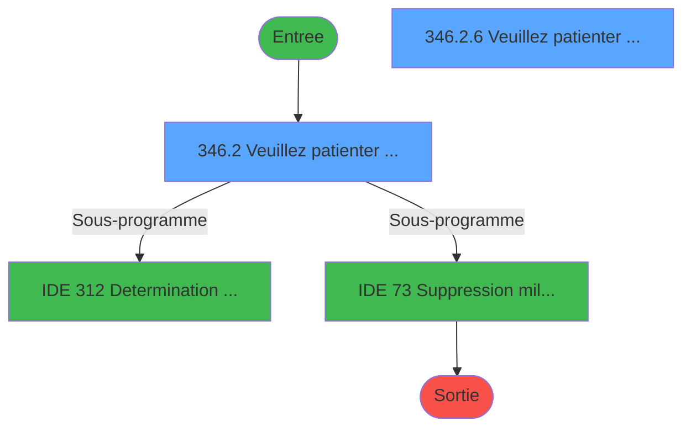
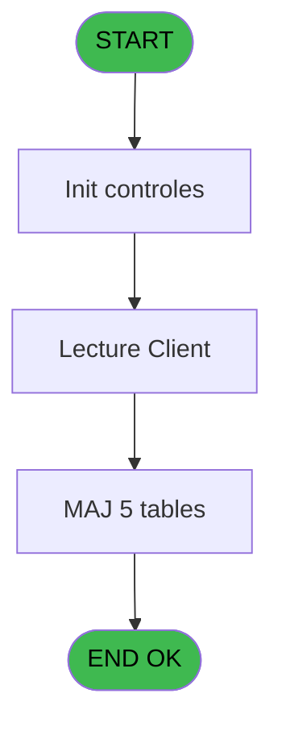
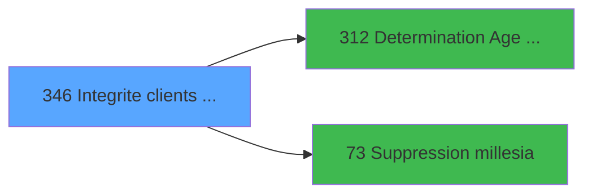

# PBG IDE 346 - Integrite clients Identite

> **Analyse**: Phases 1-4 2026-02-03 11:18 -> 11:19 (17s) | Assemblage 11:19
> **Pipeline**: V7.2 Enrichi
> **Structure**: 4 onglets (Resume | Ecrans | Donnees | Connexions)

<!-- TAB:Resume -->

## 1. FICHE D'IDENTITE

| Attribut | Valeur |
|----------|--------|
| Projet | PBG |
| IDE Position | 346 |
| Nom Programme | Integrite clients Identite |
| Fichier source | `Prg_346.xml` |
| Dossier IDE | General |
| Taches | 11 (2 ecrans visibles) |
| Tables modifiees | 5 |
| Programmes appeles | 2 |

## 2. DESCRIPTION FONCTIONNELLE

**Integrite clients Identite** assure la gestion complete de ce processus, accessible depuis [Traitement integrite base (IDE 347)](PBG-IDE-347.md).

Le flux de traitement s'organise en **2 blocs fonctionnels** :

- **Traitement** (10 taches) : traitements metier divers
- **Consultation** (1 tache) : ecrans de recherche, selection et consultation

**Donnees modifiees** : 5 tables en ecriture (gm-recherche_____gmr, gm-complet_______gmc, compte_gm________cgm, heb_circuit______hci, fi_complet_______gm_go).

**Logique metier** : 1 regles identifiees couvrant conditions metier.

Detail : phases du traitement

#### Phase 1 : Traitement (10 taches)

- **346** - Module des Clients
- **346.1** - Determination Age Bebe
- **346.2** - Veuillez patienter ... **[[ECRAN]](#ecran-t3)**
- **346.2.1** - Modification Hebergement
- **346.2.2** - Modification Hebergement
- **346.2.3** - Clients **[[ECRAN]](#ecran-t6)**
- **346.2.5** - Clients **[[ECRAN]](#ecran-t8)**
- **346.2.6** - Veuillez patienter ... **[[ECRAN]](#ecran-t9)**
- **346.3** - Telephone Grec
- **346.3.1** - Upd Histo Tel

Delegue a : [Determination Age Debut Sejour (IDE 312)](PBG-IDE-312.md), [   Suppression millesia (IDE 73)](PBG-IDE-73.md)

#### Phase 2 : Consultation (1 tache)

- **346.2.4** - Modif recherche

#### Tables impactees

| Table | Operations | Role metier |
|-------|-----------|-------------|
| gm-recherche_____gmr | R/**W** (3 usages) | Index de recherche |
| gm-complet_______gmc | **W** (2 usages) |  |
| compte_gm________cgm | **W** (1 usages) | Comptes GM (generaux) |
| fi_complet_______gm_go | **W** (1 usages) |  |
| heb_circuit______hci | **W** (1 usages) | Hebergement (chambres) |

## 3. BLOCS FONCTIONNELS

### 3.1 Traitement (10 taches)

Traitements internes.

---

#### 346 - Module des Clients

**Role** : Tache d'orchestration : point d'entree du programme (10 sous-taches). Coordonne l'enchainement des traitements.

9 sous-taches directes

| Tache | Nom | Bloc |
|-------|-----|------|
| [346.1](#t2) | Determination Age Bebe | Traitement |
| [346.2](#t3) | Veuillez patienter ... **[[ECRAN]](#ecran-t3)** | Traitement |
| [346.2.1](#t4) | Modification Hebergement | Traitement |
| [346.2.2](#t5) | Modification Hebergement | Traitement |
| [346.2.3](#t6) | Clients **[[ECRAN]](#ecran-t6)** | Traitement |
| [346.2.5](#t8) | Clients **[[ECRAN]](#ecran-t8)** | Traitement |
| [346.2.6](#t9) | Veuillez patienter ... **[[ECRAN]](#ecran-t9)** | Traitement |
| [346.3](#t10) | Telephone Grec | Traitement |
| [346.3.1](#t11) | Upd Histo Tel | Traitement |

**Delegue a** : [Determination Age Debut Sejour (IDE 312)](PBG-IDE-312.md), [   Suppression millesia (IDE 73)](PBG-IDE-73.md)

---

#### 346.1 - Determination Age Bebe

**Role** : Traitement : Determination Age Bebe.
**Variables liees** : K (W0-Age Bebe)
**Delegue a** : [Determination Age Debut Sejour (IDE 312)](PBG-IDE-312.md), [   Suppression millesia (IDE 73)](PBG-IDE-73.md)

---

#### 346.2 - Veuillez patienter ... [[ECRAN]](#ecran-t3)

**Role** : Traitement : Veuillez patienter ....
**Ecran** : 424 x 57 DLU (MDI) | [Voir mockup](#ecran-t3)
**Delegue a** : [Determination Age Debut Sejour (IDE 312)](PBG-IDE-312.md), [   Suppression millesia (IDE 73)](PBG-IDE-73.md)

---

#### 346.2.1 - Modification Hebergement

**Role** : Traitement : Modification Hebergement.
**Delegue a** : [Determination Age Debut Sejour (IDE 312)](PBG-IDE-312.md), [   Suppression millesia (IDE 73)](PBG-IDE-73.md)

---

#### 346.2.2 - Modification Hebergement

**Role** : Traitement : Modification Hebergement.
**Delegue a** : [Determination Age Debut Sejour (IDE 312)](PBG-IDE-312.md), [   Suppression millesia (IDE 73)](PBG-IDE-73.md)

---

#### 346.2.3 - Clients [[ECRAN]](#ecran-t6)

**Role** : Traitement : Clients.
**Ecran** : 216 x 52 DLU (MDI) | [Voir mockup](#ecran-t6)
**Delegue a** : [Determination Age Debut Sejour (IDE 312)](PBG-IDE-312.md), [   Suppression millesia (IDE 73)](PBG-IDE-73.md)

---

#### 346.2.5 - Clients [[ECRAN]](#ecran-t8)

**Role** : Traitement : Clients.
**Ecran** : 216 x 52 DLU (MDI) | [Voir mockup](#ecran-t8)
**Delegue a** : [Determination Age Debut Sejour (IDE 312)](PBG-IDE-312.md), [   Suppression millesia (IDE 73)](PBG-IDE-73.md)

---

#### 346.2.6 - Veuillez patienter ... [[ECRAN]](#ecran-t9)

**Role** : Traitement : Veuillez patienter ....
**Ecran** : 424 x 57 DLU (MDI) | [Voir mockup](#ecran-t9)
**Delegue a** : [Determination Age Debut Sejour (IDE 312)](PBG-IDE-312.md), [   Suppression millesia (IDE 73)](PBG-IDE-73.md)

---

#### 346.3 - Telephone Grec

**Role** : Traitement : Telephone Grec.
**Delegue a** : [Determination Age Debut Sejour (IDE 312)](PBG-IDE-312.md), [   Suppression millesia (IDE 73)](PBG-IDE-73.md)

---

#### 346.3.1 - Upd Histo Tel

**Role** : Traitement : Upd Histo Tel.
**Delegue a** : [Determination Age Debut Sejour (IDE 312)](PBG-IDE-312.md), [   Suppression millesia (IDE 73)](PBG-IDE-73.md)

### 3.2 Consultation (1 tache)

Ecrans de recherche et consultation.

---

#### 346.2.4 - Modif recherche

**Role** : Traitement : Modif recherche.
**Variables liees** : BC (W0 recherche accompa), P (W0- autorisation modif)

## 5. REGLES METIER

1 regles identifiees:

### Autres (1 regles)

#### [RM-001] Traitement conditionnel si GetParam ('NB_LIEU_SEJOUR') est a zero

| Element | Detail |
|---------|--------|
| **Condition** | `GetParam ('NB_LIEU_SEJOUR')=0` |
| **Si vrai** | 'G' |
| **Si faux** | IF (GetParam ('NB_LIEU_SEJOUR')=1,GetParam ('CODE_LIEU_SEJOUR'),'')) |
| **Expression source** | Expression 1 : `IF (GetParam ('NB_LIEU_SEJOUR')=0,'G',IF (GetParam ('NB_LIEU` |
| **Exemple** | Si GetParam ('NB_LIEU_SEJOUR')=0 → 'G' |

## 6. CONTEXTE

- **Appele par**: [Traitement integrite base (IDE 347)](PBG-IDE-347.md)
- **Appelle**: 2 programmes | **Tables**: 19 (W:5 R:3 L:13) | **Taches**: 11 | **Expressions**: 3

<!-- TAB:Ecrans -->

## 8. ECRANS

### 8.1 Forms visibles (2 / 11)

| # | Position | Tache | Nom | Type | Largeur | Hauteur | Bloc |
|---|----------|-------|-----|------|---------|---------|------|
| 1 | 346.2 | 346.2 | Veuillez patienter ... | MDI | 424 | 57 | Traitement |
| 2 | 346.2.6 | 346.2.6 | Veuillez patienter ... | MDI | 424 | 57 | Traitement |

### 8.2 Mockups Ecrans

---

#### 346.2 - Veuillez patienter ...
**Tache** : [346.2](#t3) | **Type** : MDI | **Dimensions** : 424 x 57 DLU
**Bloc** : Traitement | **Titre IDE** : Veuillez patienter ...

<!-- FORM-DATA:
{
    "width":  424,
    "vFactor":  8,
    "type":  "MDI",
    "hFactor":  8,
    "controls":  [
                     {
                         "x":  0,
                         "type":  "label",
                         "var":  "",
                         "y":  0,
                         "w":  423,
                         "fmt":  "",
                         "name":  "",
                         "h":  29,
                         "color":  "",
                         "text":  "",
                         "parent":  null
                     },
                     {
                         "x":  117,
                         "type":  "label",
                         "var":  "",
                         "y":  10,
                         "w":  275,
                         "fmt":  "",
                         "name":  "",
                         "h":  8,
                         "color":  "7",
                         "text":  "Integrite de la base",
                         "parent":  null
                     },
                     {
                         "x":  0,
                         "type":  "label",
                         "var":  "",
                         "y":  29,
                         "w":  423,
                         "fmt":  "",
                         "name":  "",
                         "h":  27,
                         "color":  "",
                         "text":  "",
                         "parent":  null
                     },
                     {
                         "x":  38,
                         "type":  "label",
                         "var":  "",
                         "y":  39,
                         "w":  347,
                         "fmt":  "",
                         "name":  "",
                         "h":  8,
                         "color":  "",
                         "text":  "Verification des GM",
                         "parent":  null
                     },
                     {
                         "x":  1,
                         "type":  "image",
                         "var":  "",
                         "y":  2,
                         "w":  72,
                         "fmt":  "",
                         "name":  "",
                         "h":  25,
                         "color":  "",
                         "text":  "",
                         "parent":  null
                     }
                 ],
    "taskId":  "346.2",
    "height":  57
}
-->

---

#### 346.2.6 - Veuillez patienter ...
**Tache** : [346.2.6](#t9) | **Type** : MDI | **Dimensions** : 424 x 57 DLU
**Bloc** : Traitement | **Titre IDE** : Veuillez patienter ...

<!-- FORM-DATA:
{
    "width":  424,
    "vFactor":  8,
    "type":  "MDI",
    "hFactor":  8,
    "controls":  [
                     {
                         "x":  0,
                         "type":  "label",
                         "var":  "",
                         "y":  0,
                         "w":  423,
                         "fmt":  "",
                         "name":  "",
                         "h":  29,
                         "color":  "",
                         "text":  "",
                         "parent":  null
                     },
                     {
                         "x":  117,
                         "type":  "label",
                         "var":  "",
                         "y":  10,
                         "w":  275,
                         "fmt":  "",
                         "name":  "",
                         "h":  8,
                         "color":  "7",
                         "text":  "Integrite de la base",
                         "parent":  null
                     },
                     {
                         "x":  0,
                         "type":  "label",
                         "var":  "",
                         "y":  29,
                         "w":  423,
                         "fmt":  "",
                         "name":  "",
                         "h":  27,
                         "color":  "",
                         "text":  "",
                         "parent":  null
                     },
                     {
                         "x":  38,
                         "type":  "label",
                         "var":  "",
                         "y":  39,
                         "w":  347,
                         "fmt":  "",
                         "name":  "",
                         "h":  8,
                         "color":  "",
                         "text":  "Verification des GM",
                         "parent":  null
                     },
                     {
                         "x":  1,
                         "type":  "image",
                         "var":  "",
                         "y":  2,
                         "w":  72,
                         "fmt":  "",
                         "name":  "",
                         "h":  25,
                         "color":  "",
                         "text":  "",
                         "parent":  null
                     }
                 ],
    "taskId":  "346.2.6",
    "height":  57
}
-->

## 9. NAVIGATION

### 9.1 Enchainement des ecrans

**Detail par enchainement :**

| Depuis | Action | Vers | Retour |
|--------|--------|------|--------|
| Veuillez patienter ... | Sous-programme | [Determination Age Debut Sejour (IDE 312)](PBG-IDE-312.md) | Retour ecran |
| Veuillez patienter ... | Sous-programme | [   Suppression millesia (IDE 73)](PBG-IDE-73.md) | Retour ecran |

### 9.3 Structure hierarchique (11 taches)

| Position | Tache | Type | Dimensions | Bloc |
|----------|-------|------|------------|------|
| **346.1** | [**Module des Clients** (346)](#t1) | MDI | - | Traitement |
| 346.1.1 | [Determination Age Bebe (346.1)](#t2) | MDI | - | |
| 346.1.2 | [Veuillez patienter ... (346.2)](#t3) [mockup](#ecran-t3) | MDI | 424x57 | |
| 346.1.3 | [Modification Hebergement (346.2.1)](#t4) | MDI | - | |
| 346.1.4 | [Modification Hebergement (346.2.2)](#t5) | MDI | - | |
| 346.1.5 | [Clients (346.2.3)](#t6) [mockup](#ecran-t6) | MDI | 216x52 | |
| 346.1.6 | [Clients (346.2.5)](#t8) [mockup](#ecran-t8) | MDI | 216x52 | |
| 346.1.7 | [Veuillez patienter ... (346.2.6)](#t9) [mockup](#ecran-t9) | MDI | 424x57 | |
| 346.1.8 | [Telephone Grec (346.3)](#t10) | MDI | - | |
| 346.1.9 | [Upd Histo Tel (346.3.1)](#t11) | MDI | - | |
| **346.2** | [**Modif recherche** (346.2.4)](#t7) | MDI | - | Consultation |

### 9.4 Algorigramme

> **Legende**: Vert = START/END OK | Rouge = END KO | Bleu = Decisions
> *Algorigramme auto-genere. Utiliser `/algorigramme` pour une synthese metier detaillee.*

<!-- TAB:Donnees -->

## 10. TABLES

### Tables utilisees (19)

| ID | Nom | Description | Type | R | W | L | Usages |
|----|-----|-------------|------|---|---|---|--------|
| 30 | gm-recherche_____gmr | Index de recherche | DB | R | **W** |   | 3 |
| 31 | gm-complet_______gmc |  | DB |   | **W** |   | 2 |
| 34 | hebergement______heb | Hebergement (chambres) | DB |   |   | L | 1 |
| 36 | client_gm |  | DB |   |   | L | 1 |
| 47 | compte_gm________cgm | Comptes GM (generaux) | DB |   | **W** |   | 1 |
| 60 | table_code_acces_tca |  | DB | R |   |   | 1 |
| 63 | parametres___par |  | DB |   |   | L | 1 |
| 78 | param__telephone_tel |  | DB |   |   | L | 1 |
| 80 | codes_autocom____aut |  | DB |   |   | L | 1 |
| 113 | tables_village |  | DB | R |   | L | 2 |
| 119 | tables_pays_tel_ |  | DB |   |   | L | 1 |
| 131 | fichier_validation |  | DB |   |   | L | 2 |
| 137 | fichier_histotel | Historique / journal | DB |   |   | L | 1 |
| 138 | fichier_taxetel |  | DB |   |   | L | 1 |
| 155 | historique_pabx | Historique / journal | DB |   |   | L | 1 |
| 157 | coef__telephone__coe |  | DB |   |   | L | 1 |
| 168 | heb_circuit______hci | Hebergement (chambres) | DB |   | **W** |   | 1 |
| 171 | commentaire______com |  | DB |   |   | L | 1 |
| 315 | fi_complet_______gm_go |  | DB |   | **W** |   | 1 |

### Colonnes par table (6 / 7 tables avec colonnes identifiees)

Table 30 - gm-recherche_____gmr (R/**W**) - 3 usages

*Table utilisee uniquement en Link ou aucune colonne Real identifiee dans le DataView.*

Table 31 - gm-complet_______gmc (**W**) - 2 usages

| Lettre | Variable | Acces | Type |
|--------|----------|-------|------|
| A | W1-autorisation | W | Alpha |
| B | W1-fin tache | W | Logical |
| C | W1 ret lien comment | W | Numeric |
| D | W1-age codifie | W | Alpha |
| E | W1-Nb mois | W | Numeric |
| F | W1-fin compte | W | Date |
| G | W1-Numero compte memo | W | Numeric |
| H | W1-Filliation | W | Numeric |
| I | W1-planning | W | Logical |
| J | W1-saisie langue ? | W | Logical |
| K | v cdr dgm complet | W | Logical |
| L | W1-select fleurs | W | Alpha |
| M | W1-select honey moon | W | Alpha |
| N | W1-select millesia | W | Alpha |
| O | W1-retour vol retour | W | Logical |
| P | W1-accord filiation | W | Logical |
| Q | W1-select fumeur | W | Alpha |
| R | W1 N° Piece | W | Alpha |
| S | W1 Date de delivrance | W | Date |
| T | W1 Ville delivrance | W | Alpha |
| U | W1 pays delivrance piece | W | Alpha |
| V | W1 n dans la rue | W | Alpha |
| W | W1 Nom de la rue | W | Alpha |
| X | W1 Commune | W | Alpha |
| Y | W1 Code postal | W | Alpha |
| Z | W1 Ville | W | Alpha |
| BA | W1 Proffession | W | Alpha |

Table 47 - compte_gm________cgm (**W**) - 1 usages

| Lettre | Variable | Acces | Type |
|--------|----------|-------|------|
| B | >Numero Compte | W | Numeric |
| C | >Filiation Compte | W | Numeric |
| F | W1-fin compte | W | Date |
| G | W1-Numero compte memo | W | Numeric |
| W | W0-compteur lieu | W | Numeric |

Table 60 - table_code_acces_tca (R) - 1 usages

| Lettre | Variable | Acces | Type |
|--------|----------|-------|------|
| Y | W1 Code postal | R | Alpha |

Table 113 - tables_village (R/L) - 2 usages

*Table utilisee uniquement en Link ou aucune colonne Real identifiee dans le DataView.*

Table 168 - heb_circuit______hci (**W**) - 1 usages

*Table utilisee uniquement en Link ou aucune colonne Real identifiee dans le DataView.*

Table 315 - fi_complet_______gm_go (**W**) - 1 usages

| Lettre | Variable | Acces | Type |
|--------|----------|-------|------|
| K | v cdr dgm complet | W | Logical |

## 11. VARIABLES

### 11.1 Parametres entrants (1)

Variables recues du programme appelant ([Traitement integrite base (IDE 347)](PBG-IDE-347.md)).

| Lettre | Nom | Type | Usage dans |
|--------|-----|------|-----------|
| F | P0 Front/Back | Alpha | - |

### 11.2 Variables de travail (11)

Variables internes au programme.

| Lettre | Nom | Type | Usage dans |
|--------|-----|------|-----------|
| M | W0 combo nationalite | Alpha | - |
| N | W0 valeur tri | Numeric | - |
| R | W0 vol arrive | Alpha | - |
| S | W0 vol depart | Alpha | - |
| T | W0 titre | Alpha | - |
| U | W0 titre 2 | Alpha | - |
| Y | W0 libelle nationalite | Alpha | - |
| Z | W0 filiation club1 | Numeric | - |
| BA | W0 filiation club2 | Numeric | - |
| BB | W0 nom | Alpha | - |
| BC | W0 recherche accompa | Logical | - |

### 11.3 Autres (17)

Variables diverses.

| Lettre | Nom | Type | Usage dans |
|--------|-----|------|-----------|
| A | > Mode attaque ecran | Alpha | - |
| B | >Numero Compte | Numeric | - |
| C | >Filiation Compte | Numeric | - |
| D | >Nom Adherent | Alpha | - |
| E | >Prenom Adherent | Alpha | - |
| G | W0-Type Client | Alpha | - |
| H | W0-N°Adherent | Numeric | - |
| I | W0-Filiation | Numeric | - |
| J | W0-Fin de Tache | Logical | - |
| K | W0-Age Bebe | Numeric | - |
| L | W0-Base Vide | Alpha | - |
| O | W0-autorisation creation | Alpha | - |
| P | W0- autorisation modif | Alpha | - |
| Q | W0- Blocage effectue | Alpha | - |
| V | W0-lieu sejour general | Alpha | - |
| W | W0-compteur lieu | Numeric | - |
| X | W0-lieu sejour | Alpha | - |

Toutes les 29 variables (liste complete)

| Cat | Lettre | Nom Variable | Type |
|-----|--------|--------------|------|
| P0 | **F** | P0 Front/Back | Alpha |
| W0 | **M** | W0 combo nationalite | Alpha |
| W0 | **N** | W0 valeur tri | Numeric |
| W0 | **R** | W0 vol arrive | Alpha |
| W0 | **S** | W0 vol depart | Alpha |
| W0 | **T** | W0 titre | Alpha |
| W0 | **U** | W0 titre 2 | Alpha |
| W0 | **Y** | W0 libelle nationalite | Alpha |
| W0 | **Z** | W0 filiation club1 | Numeric |
| W0 | **BA** | W0 filiation club2 | Numeric |
| W0 | **BB** | W0 nom | Alpha |
| W0 | **BC** | W0 recherche accompa | Logical |
| Autre | **A** | > Mode attaque ecran | Alpha |
| Autre | **B** | >Numero Compte | Numeric |
| Autre | **C** | >Filiation Compte | Numeric |
| Autre | **D** | >Nom Adherent | Alpha |
| Autre | **E** | >Prenom Adherent | Alpha |
| Autre | **G** | W0-Type Client | Alpha |
| Autre | **H** | W0-N°Adherent | Numeric |
| Autre | **I** | W0-Filiation | Numeric |
| Autre | **J** | W0-Fin de Tache | Logical |
| Autre | **K** | W0-Age Bebe | Numeric |
| Autre | **L** | W0-Base Vide | Alpha |
| Autre | **O** | W0-autorisation creation | Alpha |
| Autre | **P** | W0- autorisation modif | Alpha |
| Autre | **Q** | W0- Blocage effectue | Alpha |
| Autre | **V** | W0-lieu sejour general | Alpha |
| Autre | **W** | W0-compteur lieu | Numeric |
| Autre | **X** | W0-lieu sejour | Alpha |

## 12. EXPRESSIONS

**3 / 3 expressions decodees (100%)**

### 12.1 Repartition par type

| Type | Expressions | Regles |
|------|-------------|--------|
| CONDITION | 2 | 5 |
| OTHER | 1 | 0 |

### 12.2 Expressions cles par type

#### CONDITION (2 expressions)

| Type | IDE | Expression | Regle |
|------|-----|------------|-------|
| CONDITION | 1 | `IF (GetParam ('NB_LIEU_SEJOUR')=0,'G',IF (GetParam ('NB_LIEU_SEJOUR')=1,GetParam ('CODE_LIEU_SEJOUR'),''))` | [RM-001](#rm-RM-001) |
| CONDITION | 3 | `Trim (GetParam ('FISCALITEGREC'))='O'` | - |

#### OTHER (1 expressions)

| Type | IDE | Expression | Regle |
|------|-----|------------|-------|
| OTHER | 2 | `GetParam ('NOM')` | - |

<!-- TAB:Connexions -->

## 13. GRAPHE D'APPELS

### 13.1 Chaine depuis Main (Callers)

Main -> ... -> [Traitement integrite base (IDE 347)](PBG-IDE-347.md) -> **Integrite clients Identite (IDE 346)**

### 13.2 Callers

| IDE | Nom Programme | Nb Appels |
|-----|---------------|-----------|
| [347](PBG-IDE-347.md) | Traitement integrite base | 1 |

### 13.3 Callees (programmes appeles)

### 13.4 Detail Callees avec contexte

| IDE | Nom Programme | Appels | Contexte |
|-----|---------------|--------|----------|
| [312](PBG-IDE-312.md) | Determination Age Debut Sejour | 2 | Sous-programme |
| [73](PBG-IDE-73.md) |    Suppression millesia | 1 | Sous-programme |

## 14. RECOMMANDATIONS MIGRATION

### 14.1 Profil du programme

| Metrique | Valeur | Impact migration |
|----------|--------|-----------------|
| Lignes de logique | 595 | Programme volumineux |
| Expressions | 3 | Peu de logique |
| Tables WRITE | 5 | Impact modere |
| Sous-programmes | 2 | Peu de dependances |
| Ecrans visibles | 2 | Quelques ecrans |
| Code desactive | 0.2% (1 / 595) | Code sain |
| Regles metier | 1 | Quelques regles a preserver |

### 14.2 Plan de migration par bloc

#### Traitement (10 taches: 4 ecrans, 6 traitements)

- **Strategie** : Orchestrateur avec 4 ecrans (Razor/React) et 6 traitements backend (services).
- Les ecrans deviennent des composants UI, les traitements invisibles deviennent des services injectables.
- 2 sous-programme(s) a migrer ou a reutiliser depuis les services existants.
- Decomposer les taches en services unitaires testables.

#### Consultation (1 tache: 0 ecran, 1 traitement)

- **Strategie** : Composants de recherche/selection en modales.

### 14.3 Dependances critiques

| Dependance | Type | Appels | Impact |
|------------|------|--------|--------|
| gm-recherche_____gmr | Table WRITE (Database) | 2x | Schema + repository |
| gm-complet_______gmc | Table WRITE (Database) | 2x | Schema + repository |
| compte_gm________cgm | Table WRITE (Database) | 1x | Schema + repository |
| heb_circuit______hci | Table WRITE (Database) | 1x | Schema + repository |
| fi_complet_______gm_go | Table WRITE (Database) | 1x | Schema + repository |
| [Determination Age Debut Sejour (IDE 312)](PBG-IDE-312.md) | Sous-programme | 2x | Haute - Sous-programme |
| [   Suppression millesia (IDE 73)](PBG-IDE-73.md) | Sous-programme | 1x | Normale - Sous-programme |

---
*Spec DETAILED generee par Pipeline V7.2 - 2026-02-03 11:19*
