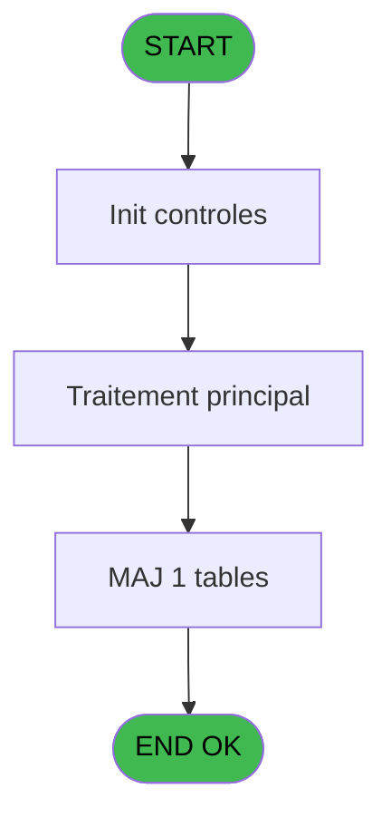
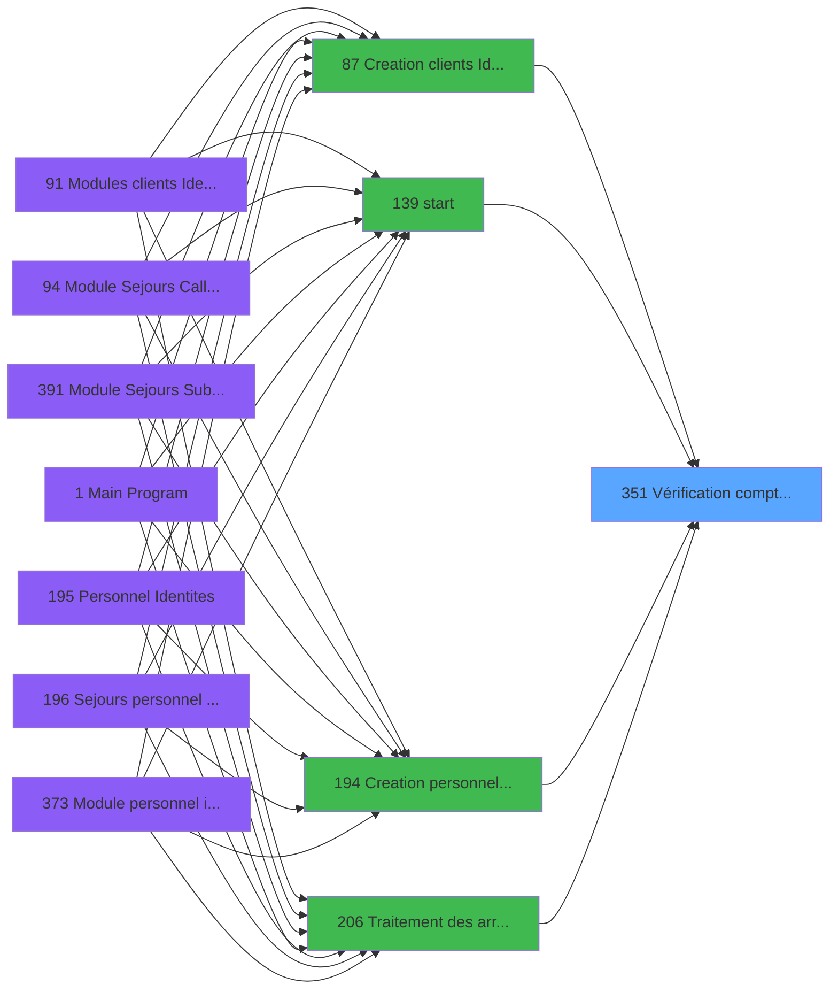

# PBG IDE 351 - Vérification compteur compte

> **Analyse**: Phases 1-4 2026-02-03 11:20 -> 11:21 (17s) | Assemblage 11:21
> **Pipeline**: V7.2 Enrichi
> **Structure**: 4 onglets (Resume | Ecrans | Donnees | Connexions)

<!-- TAB:Resume -->

## 1. FICHE D'IDENTITE

| Attribut | Valeur |
|----------|--------|
| Projet | PBG |
| IDE Position | 351 |
| Nom Programme | Vérification compteur compte |
| Fichier source | `Prg_351.xml` |
| Dossier IDE | Comptabilite |
| Taches | 2 (0 ecrans visibles) |
| Tables modifiees | 1 |
| Programmes appeles | 0 |

## 2. DESCRIPTION FONCTIONNELLE

**Vérification compteur compte** assure la gestion complete de ce processus, accessible depuis [Creation clients Identite (IDE 87)](PBG-IDE-87.md), [start (IDE 139)](PBG-IDE-139.md), [  Creation personnel identites (IDE 194)](PBG-IDE-194.md), [Traitement des arrivants (IDE 206)](PBG-IDE-206.md).

Le flux de traitement s'organise en **1 blocs fonctionnels** :

- **Calcul** (2 taches) : calculs de montants, stocks ou compteurs

**Donnees modifiees** : 1 tables en ecriture (compteurs________cpt).

## 3. BLOCS FONCTIONNELS

### 3.1 Calcul (2 taches)

Calculs metier : montants, stocks, compteurs.

---

#### 351 - Vérification compteur compte

**Role** : Calcul : Vérification compteur compte.

---

#### 351.1 - Update Compteur

**Role** : Calcul : Update Compteur.

## 5. REGLES METIER

*(Aucune regle metier identifiee)*

## 6. CONTEXTE

- **Appele par**: [Creation clients Identite (IDE 87)](PBG-IDE-87.md), [start (IDE 139)](PBG-IDE-139.md), [  Creation personnel identites (IDE 194)](PBG-IDE-194.md), [Traitement des arrivants (IDE 206)](PBG-IDE-206.md)
- **Appelle**: 0 programmes | **Tables**: 1 (W:1 R:0 L:0) | **Taches**: 2 | **Expressions**: 3

<!-- TAB:Ecrans -->

## 8. ECRANS

*(Programme sans ecran visible)*

## 9. NAVIGATION

### 9.3 Structure hierarchique (2 taches)

| Position | Tache | Type | Dimensions | Bloc |
|----------|-------|------|------------|------|
| **351.1** | [**Vérification compteur compte** (351)](#t1) | - | - | Calcul |
| 351.1.1 | [Update Compteur (351.1)](#t2) | - | - | |

### 9.4 Algorigramme

> **Legende**: Vert = START/END OK | Rouge = END KO | Bleu = Decisions
> *Algorigramme auto-genere. Utiliser `/algorigramme` pour une synthese metier detaillee.*

<!-- TAB:Donnees -->

## 10. TABLES

### Tables utilisees (1)

| ID | Nom | Description | Type | R | W | L | Usages |
|----|-----|-------------|------|---|---|---|--------|
| 68 | compteurs________cpt | Comptes GM (generaux) | DB |   | **W** |   | 1 |

### Colonnes par table (0 / 1 tables avec colonnes identifiees)

Table 68 - compteurs________cpt (**W**) - 1 usages

*Table utilisee uniquement en Link ou aucune colonne Real identifiee dans le DataView.*

## 11. VARIABLES

### 11.1 Autres (4)

Variables diverses.

| Lettre | Nom | Type | Usage dans |
|--------|-----|------|-----------|
| A | max_recherche | Numeric | - |
| B | max_complet | Numeric | - |
| C | max_go | Numeric | 1x refs |
| D | max_gm | Numeric | - |

## 12. EXPRESSIONS

**3 / 3 expressions decodees (100%)**

### 12.1 Repartition par type

| Type | Expressions | Regles |
|------|-------------|--------|
| CONSTANTE | 1 | 0 |
| OTHER | 1 | 0 |
| CONDITION | 1 | 0 |

### 12.2 Expressions cles par type

#### CONSTANTE (1 expressions)

| Type | IDE | Expression | Regle |
|------|-----|------------|-------|
| CONSTANTE | 1 | `'CCPT'` | - |

#### OTHER (1 expressions)

| Type | IDE | Expression | Regle |
|------|-----|------------|-------|
| OTHER | 2 | `MAX({1,6},{1,7},{1,8},{1,9})` | - |

#### CONDITION (1 expressions)

| Type | IDE | Expression | Regle |
|------|-----|------------|-------|
| CONDITION | 3 | `MAX({1,6},{1,7},{1,8},{1,9})>max_go [C]` | - |

<!-- TAB:Connexions -->

## 13. GRAPHE D'APPELS

### 13.1 Chaine depuis Main (Callers)

Main -> ... -> [Creation clients Identite (IDE 87)](PBG-IDE-87.md) -> **Vérification compteur compte (IDE 351)**

Main -> ... -> [start (IDE 139)](PBG-IDE-139.md) -> **Vérification compteur compte (IDE 351)**

Main -> ... -> [  Creation personnel identites (IDE 194)](PBG-IDE-194.md) -> **Vérification compteur compte (IDE 351)**

Main -> ... -> [Traitement des arrivants (IDE 206)](PBG-IDE-206.md) -> **Vérification compteur compte (IDE 351)**

### 13.2 Callers

| IDE | Nom Programme | Nb Appels |
|-----|---------------|-----------|
| [87](PBG-IDE-87.md) | Creation clients Identite | 1 |
| [139](PBG-IDE-139.md) | start | 1 |
| [194](PBG-IDE-194.md) |   Creation personnel identites | 1 |
| [206](PBG-IDE-206.md) | Traitement des arrivants | 1 |

### 13.3 Callees (programmes appeles)

### 13.4 Detail Callees avec contexte

| IDE | Nom Programme | Appels | Contexte |
|-----|---------------|--------|----------|
| - | (aucun) | - | - |

## 14. RECOMMANDATIONS MIGRATION

### 14.1 Profil du programme

| Metrique | Valeur | Impact migration |
|----------|--------|-----------------|
| Lignes de logique | 13 | Programme compact |
| Expressions | 3 | Peu de logique |
| Tables WRITE | 1 | Impact faible |
| Sous-programmes | 0 | Peu de dependances |
| Ecrans visibles | 0 | Ecran unique ou traitement batch |
| Code desactive | 0% (0 / 13) | Code sain |
| Regles metier | 0 | Pas de regle identifiee |

### 14.2 Plan de migration par bloc

#### Calcul (2 taches: 0 ecran, 2 traitements)

- **Strategie** : Services de calcul purs (Domain Services).
- Migrer la logique de calcul (stock, compteurs, montants)

### 14.3 Dependances critiques

| Dependance | Type | Appels | Impact |
|------------|------|--------|--------|
| compteurs________cpt | Table WRITE (Database) | 1x | Schema + repository |

---
*Spec DETAILED generee par Pipeline V7.2 - 2026-02-03 11:21*
