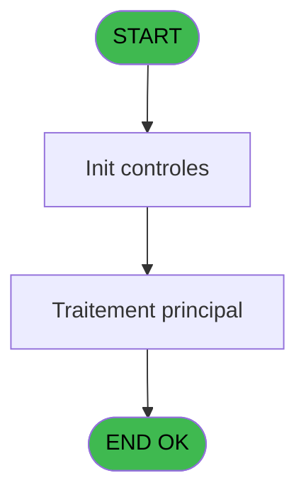
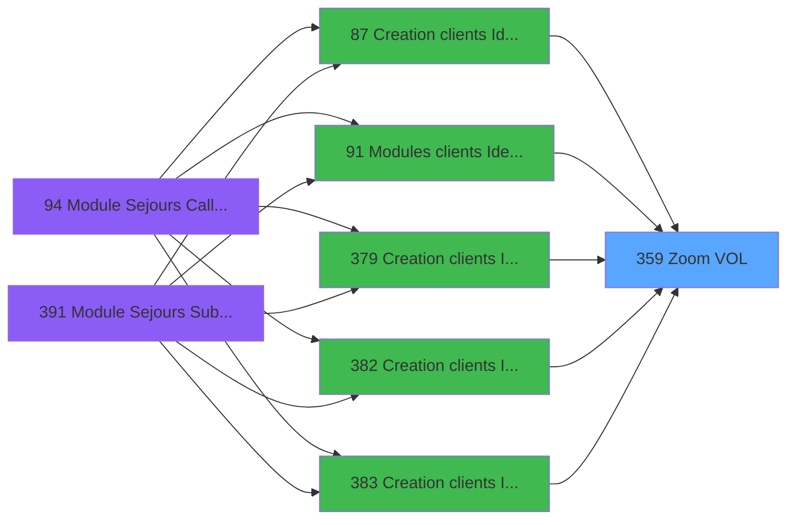
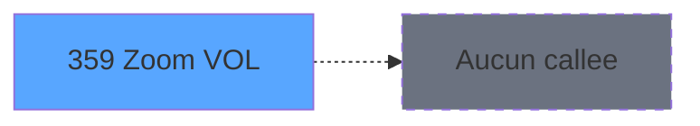

# PBG IDE 359 - Zoom VOL

> **Analyse**: Phases 1-4 2026-02-03 11:24 -> 11:24 (19s) | Assemblage 11:24
> **Pipeline**: V7.2 Enrichi
> **Structure**: 4 onglets (Resume | Ecrans | Donnees | Connexions)

<!-- TAB:Resume -->

## 1. FICHE D'IDENTITE

| Attribut | Valeur |
|----------|--------|
| Projet | PBG |
| IDE Position | 359 |
| Nom Programme | Zoom VOL |
| Fichier source | `Prg_359.xml` |
| Dossier IDE | Consultation |
| Taches | 1 (1 ecrans visibles) |
| Tables modifiees | 0 |
| Programmes appeles | 0 |

## 2. DESCRIPTION FONCTIONNELLE

**Zoom VOL** assure la gestion complete de ce processus, accessible depuis [Creation clients Identite (IDE 87)](PBG-IDE-87.md), [Creation clients Identite SAV (IDE 379)](PBG-IDE-379.md), [Creation clients Identite P185 (IDE 382)](PBG-IDE-382.md), [Creation clients Identite PROD (IDE 383)](PBG-IDE-383.md), [Creation clients Identite en c (IDE 384)](PBG-IDE-384.md), [Creation clients Identite SAV* (IDE 386)](PBG-IDE-386.md), [Creation clients Identite_sav (IDE 387)](PBG-IDE-387.md), [Modules clients Identite (IDE 91)](PBG-IDE-91.md).

Le flux de traitement s'organise en **1 blocs fonctionnels** :

- **Consultation** (1 tache) : ecrans de recherche, selection et consultation

**Logique metier** : 1 regles identifiees couvrant conditions metier.

## 3. BLOCS FONCTIONNELS

### 3.1 Consultation (1 tache)

Ecrans de recherche et consultation.

---

#### 359 - Selection Vol [[ECRAN]](#ecran-t1)

**Role** : Selection par l'operateur : Selection Vol.
**Ecran** : 654 x 154 DLU (MDI) | [Voir mockup](#ecran-t1)

## 5. REGLES METIER

1 regles identifiees:

### Autres (1 regles)

#### [RM-001] Si [AP] alors [AQ] sinon [J]*3600)

| Element | Detail |
|---------|--------|
| **Condition** | `[AP]` |
| **Si vrai** | [AQ] |
| **Si faux** | [J]*3600) |
| **Expression source** | Expression 18 : `IF([AP],[AQ],[J]*3600)` |
| **Exemple** | Si [AP] → [AQ]. Sinon → [J]*3600) |

## 6. CONTEXTE

- **Appele par**: [Creation clients Identite (IDE 87)](PBG-IDE-87.md), [Creation clients Identite SAV (IDE 379)](PBG-IDE-379.md), [Creation clients Identite P185 (IDE 382)](PBG-IDE-382.md), [Creation clients Identite PROD (IDE 383)](PBG-IDE-383.md), [Creation clients Identite en c (IDE 384)](PBG-IDE-384.md), [Creation clients Identite SAV* (IDE 386)](PBG-IDE-386.md), [Creation clients Identite_sav (IDE 387)](PBG-IDE-387.md), [Modules clients Identite (IDE 91)](PBG-IDE-91.md)
- **Appelle**: 0 programmes | **Tables**: 3 (W:0 R:1 L:2) | **Taches**: 1 | **Expressions**: 20

<!-- TAB:Ecrans -->

## 8. ECRANS

### 8.1 Forms visibles (1 / 1)

| # | Position | Tache | Nom | Type | Largeur | Hauteur | Bloc |
|---|----------|-------|-----|------|---------|---------|------|
| 1 | 359 | 359 | Selection Vol | MDI | 654 | 154 | Consultation |

### 8.2 Mockups Ecrans

---

#### 359 - Selection Vol
**Tache** : [359](#t1) | **Type** : MDI | **Dimensions** : 654 x 154 DLU
**Bloc** : Consultation | **Titre IDE** : Selection Vol

<!-- FORM-DATA:
{
    "width":  654,
    "vFactor":  8,
    "type":  "MDI",
    "hFactor":  8,
    "controls":  [
                     {
                         "x":  26,
                         "type":  "table",
                         "var":  "",
                         "name":  "",
                         "titleH":  12,
                         "color":  "196",
                         "w":  605,
                         "y":  5,
                         "fmt":  "",
                         "parent":  null,
                         "text":  "",
                         "rowH":  12,
                         "h":  99,
                         "cols":  [
                                      {
                                          "title":  "Vol",
                                          "layer":  1,
                                          "w":  136
                                      },
                                      {
                                          "title":  "Heure",
                                          "layer":  2,
                                          "w":  80
                                      },
                                      {
                                          "title":  "Description",
                                          "layer":  3,
                                          "w":  354
                                      }
                                  ],
                         "rows":  3
                     },
                     {
                         "x":  0,
                         "type":  "label",
                         "var":  "",
                         "y":  128,
                         "w":  653,
                         "fmt":  "",
                         "name":  "",
                         "h":  24,
                         "color":  "",
                         "text":  "",
                         "parent":  null
                     },
                     {
                         "x":  30,
                         "type":  "edit",
                         "var":  "",
                         "y":  19,
                         "w":  30,
                         "fmt":  "",
                         "name":  "vot_compagnie",
                         "h":  10,
                         "color":  "196",
                         "text":  "",
                         "parent":  2
                     },
                     {
                         "x":  67,
                         "type":  "edit",
                         "var":  "",
                         "y":  19,
                         "w":  88,
                         "fmt":  "",
                         "name":  "",
                         "h":  10,
                         "color":  "196",
                         "text":  "",
                         "parent":  2
                     },
                     {
                         "x":  176,
                         "type":  "edit",
                         "var":  "",
                         "y":  19,
                         "w":  57,
                         "fmt":  "HH:MM",
                         "name":  "",
                         "h":  10,
                         "color":  "196",
                         "text":  "",
                         "parent":  2
                     },
                     {
                         "x":  249,
                         "type":  "edit",
                         "var":  "",
                         "y":  19,
                         "w":  344,
                         "fmt":  "",
                         "name":  "",
                         "h":  10,
                         "color":  "196",
                         "text":  "",
                         "parent":  2
                     },
                     {
                         "x":  99,
                         "type":  "button",
                         "var":  "",
                         "y":  131,
                         "w":  154,
                         "fmt":  "\u0026Selectionner",
                         "name":  "",
                         "h":  18,
                         "color":  "",
                         "text":  "",
                         "parent":  null
                     },
                     {
                         "x":  402,
                         "type":  "button",
                         "var":  "",
                         "y":  131,
                         "w":  154,
                         "fmt":  "\u0026Quitter",
                         "name":  "",
                         "h":  18,
                         "color":  "",
                         "text":  "",
                         "parent":  null
                     },
                     {
                         "x":  298,
                         "type":  "image",
                         "var":  "",
                         "y":  108,
                         "w":  55,
                         "fmt":  "",
                         "name":  "",
                         "h":  18,
                         "color":  "",
                         "text":  "",
                         "parent":  null
                     }
                 ],
    "taskId":  "359",
    "height":  154
}
-->

<strong>Champs : 4 champs</strong>

| Pos (x,y) | Nom | Variable | Type |
|-----------|-----|----------|------|
| 30,19 | vot_compagnie | - | edit |
| 67,19 | (sans nom) | - | edit |
| 176,19 | HH:MM | - | edit |
| 249,19 | (sans nom) | - | edit |

<strong>Boutons : 2 boutons</strong>

| Bouton | Pos (x,y) | Action |
|--------|-----------|--------|
| Selectionner | 99,131 | Ouvre la selection |
| Quitter | 402,131 | Quitte le programme |

## 9. NAVIGATION

Ecran unique: **Selection Vol**

### 9.3 Structure hierarchique (1 tache)

| Position | Tache | Type | Dimensions | Bloc |
|----------|-------|------|------------|------|
| **359.1** | [**Selection Vol** (359)](#t1) [mockup](#ecran-t1) | MDI | 654x154 | Consultation |

### 9.4 Algorigramme

> **Legende**: Vert = START/END OK | Rouge = END KO | Bleu = Decisions
> *Algorigramme auto-genere. Utiliser `/algorigramme` pour une synthese metier detaillee.*

<!-- TAB:Donnees -->

## 10. TABLES

### Tables utilisees (3)

| ID | Nom | Description | Type | R | W | L | Usages |
|----|-----|-------------|------|---|---|---|--------|
| 112 | tables_paris |  | DB | R |   |   | 1 |
| 132 | code_vol_________vot |  | DB |   |   | L | 1 |
| 134 | groupe_arr_dep___vol |  | DB |   |   | L | 1 |

### Colonnes par table (2 / 1 tables avec colonnes identifiees)

Table 112 - tables_paris (R) - 1 usages

| Lettre | Variable | Acces | Type |
|--------|----------|-------|------|
| A | > Date Arrivee | R | Date |
| B | > code A/R | R | Alpha |
| C | > code vol | R | Alpha |
| D | < heure | R | Alpha |
| E | v.Vol? | R | Logical |

## 11. VARIABLES

### 11.1 Variables de session (1)

Variables persistantes pendant toute la session.

| Lettre | Nom | Type | Usage dans |
|--------|-----|------|-----------|
| E | v.Vol? | Logical | 1x session |

### 11.2 Autres (4)

Variables diverses.

| Lettre | Nom | Type | Usage dans |
|--------|-----|------|-----------|
| A | > Date Arrivee | Date | 1x refs |
| B | > code A/R | Alpha | 1x refs |
| C | > code vol | Alpha | 1x refs |
| D | < heure | Alpha | - |

## 12. EXPRESSIONS

**20 / 20 expressions decodees (100%)**

### 12.1 Repartition par type

| Type | Expressions | Regles |
|------|-------------|--------|
| CONDITION | 4 | 5 |
| CONSTANTE | 3 | 0 |
| OTHER | 12 | 0 |
| STRING | 1 | 0 |

### 12.2 Expressions cles par type

#### CONDITION (4 expressions)

| Type | IDE | Expression | Regle |
|------|-----|------------|-------|
| CONDITION | 18 | `IF([AP],[AQ],[J]*3600)` | [RM-001](#rm-RM-001) |
| CONDITION | 8 | `> Date Arrivee [A]` | - |
| CONDITION | 4 | `> code A/R [B]` | - |
| CONDITION | 2 | `> code vol [C]` | - |

#### CONSTANTE (3 expressions)

| Type | IDE | Expression | Regle |
|------|-----|------------|-------|
| CONSTANTE | 12 | `'TTRAN'` | - |
| CONSTANTE | 10 | `'A'` | - |
| CONSTANTE | 9 | `'M'` | - |

#### OTHER (12 expressions)

| Type | IDE | Expression | Regle |
|------|-----|------------|-------|
| OTHER | 16 | `[H]` | - |
| OTHER | 15 | `[G]` | - |
| OTHER | 14 | `[F]` | - |
| OTHER | 20 | `Heure_vol_Max([J])` | - |
| OTHER | 19 | `Heure_vol_Min([J])` | - |
| ... | | *+7 autres* | |

#### STRING (1 expressions)

| Type | IDE | Expression | Regle |
|------|-----|------------|-------|
| STRING | 3 | `Str ([J],'2')` | - |

<!-- TAB:Connexions -->

## 13. GRAPHE D'APPELS

### 13.1 Chaine depuis Main (Callers)

Main -> ... -> [Creation clients Identite (IDE 87)](PBG-IDE-87.md) -> **Zoom VOL (IDE 359)**

Main -> ... -> [Creation clients Identite SAV (IDE 379)](PBG-IDE-379.md) -> **Zoom VOL (IDE 359)**

Main -> ... -> [Creation clients Identite P185 (IDE 382)](PBG-IDE-382.md) -> **Zoom VOL (IDE 359)**

Main -> ... -> [Creation clients Identite PROD (IDE 383)](PBG-IDE-383.md) -> **Zoom VOL (IDE 359)**

Main -> ... -> [Creation clients Identite en c (IDE 384)](PBG-IDE-384.md) -> **Zoom VOL (IDE 359)**

Main -> ... -> [Creation clients Identite SAV* (IDE 386)](PBG-IDE-386.md) -> **Zoom VOL (IDE 359)**

Main -> ... -> [Creation clients Identite_sav (IDE 387)](PBG-IDE-387.md) -> **Zoom VOL (IDE 359)**

Main -> ... -> [Modules clients Identite (IDE 91)](PBG-IDE-91.md) -> **Zoom VOL (IDE 359)**

### 13.2 Callers

| IDE | Nom Programme | Nb Appels |
|-----|---------------|-----------|
| [87](PBG-IDE-87.md) | Creation clients Identite | 6 |
| [379](PBG-IDE-379.md) | Creation clients Identite SAV | 6 |
| [382](PBG-IDE-382.md) | Creation clients Identite P185 | 6 |
| [383](PBG-IDE-383.md) | Creation clients Identite PROD | 6 |
| [384](PBG-IDE-384.md) | Creation clients Identite en c | 6 |
| [386](PBG-IDE-386.md) | Creation clients Identite SAV* | 6 |
| [387](PBG-IDE-387.md) | Creation clients Identite_sav | 6 |
| [91](PBG-IDE-91.md) | Modules clients Identite | 4 |

### 13.3 Callees (programmes appeles)

### 13.4 Detail Callees avec contexte

| IDE | Nom Programme | Appels | Contexte |
|-----|---------------|--------|----------|
| - | (aucun) | - | - |

## 14. RECOMMANDATIONS MIGRATION

### 14.1 Profil du programme

| Metrique | Valeur | Impact migration |
|----------|--------|-----------------|
| Lignes de logique | 35 | Programme compact |
| Expressions | 20 | Peu de logique |
| Tables WRITE | 0 | Impact faible |
| Sous-programmes | 0 | Peu de dependances |
| Ecrans visibles | 1 | Ecran unique ou traitement batch |
| Code desactive | 0% (0 / 35) | Code sain |
| Regles metier | 1 | Quelques regles a preserver |

### 14.2 Plan de migration par bloc

#### Consultation (1 tache: 1 ecran, 0 traitement)

- **Strategie** : Composants de recherche/selection en modales.
- 1 ecran : Selection Vol

### 14.3 Dependances critiques

| Dependance | Type | Appels | Impact |
|------------|------|--------|--------|

---
*Spec DETAILED generee par Pipeline V7.2 - 2026-02-03 11:24*
