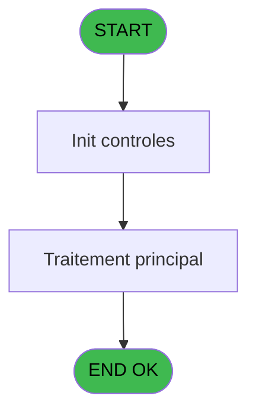
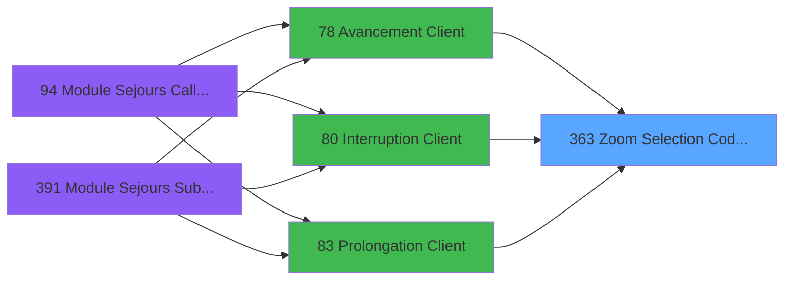
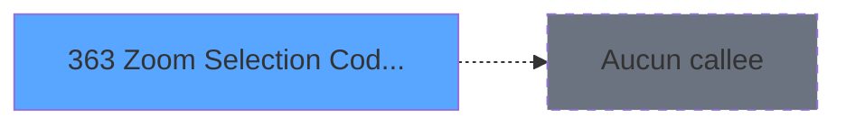

# PBG IDE 363 - Zoom Selection Code-Vol

> **Analyse**: Phases 1-4 2026-02-03 11:25 -> 11:26 (17s) | Assemblage 11:26
> **Pipeline**: V7.2 Enrichi
> **Structure**: 4 onglets (Resume | Ecrans | Donnees | Connexions)

<!-- TAB:Resume -->

## 1. FICHE D'IDENTITE

| Attribut | Valeur |
|----------|--------|
| Projet | PBG |
| IDE Position | 363 |
| Nom Programme | Zoom Selection Code-Vol |
| Fichier source | `Prg_363.xml` |
| Dossier IDE | Consultation |
| Taches | 1 (1 ecrans visibles) |
| Tables modifiees | 0 |
| Programmes appeles | 0 |

## 2. DESCRIPTION FONCTIONNELLE

**Zoom Selection Code-Vol** assure la gestion complete de ce processus, accessible depuis [   Avancement Client (IDE 78)](PBG-IDE-78.md), [   Prolongation Client (IDE 83)](PBG-IDE-83.md), [   Interruption Client (IDE 80)](PBG-IDE-80.md).

Le flux de traitement s'organise en **1 blocs fonctionnels** :

- **Consultation** (1 tache) : ecrans de recherche, selection et consultation

**Logique metier** : 1 regles identifiees couvrant valeurs par defaut.

## 3. BLOCS FONCTIONNELS

### 3.1 Consultation (1 tache)

Ecrans de recherche et consultation.

---

#### 363 - Selection Code Vol [[ECRAN]](#ecran-t1)

**Role** : Selection par l'operateur : Selection Code Vol.
**Ecran** : 515 x 146 DLU (MDI) | [Voir mockup](#ecran-t1)
**Variables liees** : B (> Code langue), E (< Code vol), J (> Selection A/R)

## 5. REGLES METIER

1 regles identifiees:

### Autres (1 regles)

#### [RM-001] Valeur par defaut si [P] est vide

| Element | Detail |
|---------|--------|
| **Condition** | `[P]=''` |
| **Si vrai** | '' |
| **Si faux** | ':00') |
| **Expression source** | Expression 18 : `IF ([P]='','',':00')` |
| **Exemple** | Si [P]='' → ''. Sinon → ':00') |

## 6. CONTEXTE

- **Appele par**: [   Avancement Client (IDE 78)](PBG-IDE-78.md), [   Prolongation Client (IDE 83)](PBG-IDE-83.md), [   Interruption Client (IDE 80)](PBG-IDE-80.md)
- **Appelle**: 0 programmes | **Tables**: 2 (W:0 R:1 L:1) | **Taches**: 1 | **Expressions**: 22

<!-- TAB:Ecrans -->

## 8. ECRANS

### 8.1 Forms visibles (1 / 1)

| # | Position | Tache | Nom | Type | Largeur | Hauteur | Bloc |
|---|----------|-------|-----|------|---------|---------|------|
| 1 | 363 | 363 | Selection Code Vol | MDI | 515 | 146 | Consultation |

### 8.2 Mockups Ecrans

---

#### 363 - Selection Code Vol
**Tache** : [363](#t1) | **Type** : MDI | **Dimensions** : 515 x 146 DLU
**Bloc** : Consultation | **Titre IDE** : Selection Code Vol

<!-- FORM-DATA:
{
    "width":  515,
    "vFactor":  8,
    "type":  "MDI",
    "hFactor":  8,
    "controls":  [
                     {
                         "x":  37,
                         "type":  "table",
                         "var":  "",
                         "name":  "",
                         "titleH":  12,
                         "color":  "196",
                         "w":  445,
                         "y":  20,
                         "fmt":  "",
                         "parent":  null,
                         "text":  "",
                         "rowH":  12,
                         "h":  74,
                         "cols":  [
                                      {
                                          "title":  "Vol",
                                          "layer":  1,
                                          "w":  88
                                      },
                                      {
                                          "title":  "Ville",
                                          "layer":  2,
                                          "w":  91
                                      },
                                      {
                                          "title":  "Heure",
                                          "layer":  3,
                                          "w":  112
                                      },
                                      {
                                          "title":  "Libellé",
                                          "layer":  4,
                                          "w":  116
                                      }
                                  ],
                         "rows":  4
                     },
                     {
                         "x":  0,
                         "type":  "label",
                         "var":  "",
                         "y":  121,
                         "w":  509,
                         "fmt":  "",
                         "name":  "",
                         "h":  24,
                         "color":  "",
                         "text":  "",
                         "parent":  null
                     },
                     {
                         "x":  121,
                         "type":  "edit",
                         "var":  "",
                         "y":  3,
                         "w":  267,
                         "fmt":  "20",
                         "name":  "",
                         "h":  8,
                         "color":  "142",
                         "text":  "",
                         "parent":  null
                     },
                     {
                         "x":  46,
                         "type":  "edit",
                         "var":  "",
                         "y":  35,
                         "w":  75,
                         "fmt":  "",
                         "name":  "",
                         "h":  8,
                         "color":  "196",
                         "text":  "",
                         "parent":  2
                     },
                     {
                         "x":  138,
                         "type":  "edit",
                         "var":  "",
                         "y":  35,
                         "w":  75,
                         "fmt":  "",
                         "name":  "",
                         "h":  8,
                         "color":  "196",
                         "text":  "",
                         "parent":  2
                     },
                     {
                         "x":  229,
                         "type":  "edit",
                         "var":  "",
                         "y":  35,
                         "w":  30,
                         "fmt":  "2P0",
                         "name":  "",
                         "h":  8,
                         "color":  "196",
                         "text":  "",
                         "parent":  2
                     },
                     {
                         "x":  339,
                         "type":  "edit",
                         "var":  "",
                         "y":  35,
                         "w":  98,
                         "fmt":  "8",
                         "name":  "",
                         "h":  8,
                         "color":  "196",
                         "text":  "",
                         "parent":  2
                     },
                     {
                         "x":  225,
                         "type":  "image",
                         "var":  "",
                         "y":  98,
                         "w":  58,
                         "fmt":  "",
                         "name":  "",
                         "h":  18,
                         "color":  "",
                         "text":  "",
                         "parent":  null
                     },
                     {
                         "x":  7,
                         "type":  "button",
                         "var":  "",
                         "y":  124,
                         "w":  154,
                         "fmt":  "\u0026Selectionner",
                         "name":  "",
                         "h":  18,
                         "color":  "",
                         "text":  "",
                         "parent":  null
                     },
                     {
                         "x":  349,
                         "type":  "button",
                         "var":  "",
                         "y":  124,
                         "w":  154,
                         "fmt":  "\u0026Quitter",
                         "name":  "",
                         "h":  18,
                         "color":  "",
                         "text":  "",
                         "parent":  null
                     },
                     {
                         "x":  277,
                         "type":  "edit",
                         "var":  "",
                         "y":  35,
                         "w":  42,
                         "fmt":  "3",
                         "name":  "",
                         "h":  8,
                         "color":  "196",
                         "text":  "",
                         "parent":  2
                     }
                 ],
    "taskId":  "363",
    "height":  146
}
-->

<strong>Champs : 6 champs</strong>

| Pos (x,y) | Nom | Variable | Type |
|-----------|-----|----------|------|
| 121,3 | 20 | - | edit |
| 46,35 | (sans nom) | - | edit |
| 138,35 | (sans nom) | - | edit |
| 229,35 | 2P0 | - | edit |
| 339,35 | 8 | - | edit |
| 277,35 | 3 | - | edit |

<strong>Boutons : 2 boutons</strong>

| Bouton | Pos (x,y) | Action |
|--------|-----------|--------|
| Selectionner | 7,124 | Ouvre la selection |
| Quitter | 349,124 | Quitte le programme |

## 9. NAVIGATION

Ecran unique: **Selection Code Vol**

### 9.3 Structure hierarchique (1 tache)

| Position | Tache | Type | Dimensions | Bloc |
|----------|-------|------|------------|------|
| **363.1** | [**Selection Code Vol** (363)](#t1) [mockup](#ecran-t1) | MDI | 515x146 | Consultation |

### 9.4 Algorigramme

> **Legende**: Vert = START/END OK | Rouge = END KO | Bleu = Decisions
> *Algorigramme auto-genere. Utiliser `/algorigramme` pour une synthese metier detaillee.*

<!-- TAB:Donnees -->

## 10. TABLES

### Tables utilisees (2)

| ID | Nom | Description | Type | R | W | L | Usages |
|----|-----|-------------|------|---|---|---|--------|
| 112 | tables_paris |  | DB |   |   | L | 1 |
| 134 | groupe_arr_dep___vol |  | DB | R |   |   | 1 |

### Colonnes par table (1 / 1 tables avec colonnes identifiees)

Table 134 - groupe_arr_dep___vol (R) - 1 usages

| Lettre | Variable | Acces | Type |
|--------|----------|-------|------|
| A | > Societe | R | Alpha |
| B | > Code langue | R | Alpha |
| C | < Date debut | R | Date |
| D | < Heure debut | R | Alpha |
| E | < Code vol | R | Alpha |
| F | < Accord suite | R | Alpha |
| G | < Transport | R | Alpha |
| H | < Ville | R | Alpha |
| I | < libelle transport | R | Alpha |
| J | > Selection A/R | R | Alpha |
| K | v.titre | R | Alpha |

## 11. VARIABLES

### 11.1 Variables de session (1)

Variables persistantes pendant toute la session.

| Lettre | Nom | Type | Usage dans |
|--------|-----|------|-----------|
| K | v.titre | Alpha | - |

### 11.2 Autres (10)

Variables diverses.

| Lettre | Nom | Type | Usage dans |
|--------|-----|------|-----------|
| A | > Societe | Alpha | 1x refs |
| B | > Code langue | Alpha | [363](#t1) |
| C | < Date debut | Date | 1x refs |
| D | < Heure debut | Alpha | - |
| E | < Code vol | Alpha | [363](#t1) |
| F | < Accord suite | Alpha | - |
| G | < Transport | Alpha | - |
| H | < Ville | Alpha | - |
| I | < libelle transport | Alpha | - |
| J | > Selection A/R | Alpha | [363](#t1) |

## 12. EXPRESSIONS

**22 / 22 expressions decodees (100%)**

### 12.1 Repartition par type

| Type | Expressions | Regles |
|------|-------------|--------|
| CONDITION | 8 | 5 |
| CONSTANTE | 5 | 0 |
| OTHER | 8 | 0 |
| STRING | 1 | 0 |

### 12.2 Expressions cles par type

#### CONDITION (8 expressions)

| Type | IDE | Expression | Regle |
|------|-----|------------|-------|
| CONDITION | 18 | `IF ([P]='','',':00')` | [RM-001](#rm-RM-001) |
| CONDITION | 8 | `> Selection A/R [J]` | - |
| CONDITION | 9 | `< Date debut [C]` | - |
| CONDITION | 20 | `> Code langue [B]` | - |
| CONDITION | 7 | `> Societe [A]` | - |
| ... | | *+3 autres* | |

#### CONSTANTE (5 expressions)

| Type | IDE | Expression | Regle |
|------|-----|------------|-------|
| CONSTANTE | 17 | `'O'` | - |
| CONSTANTE | 19 | `'TTRAN'` | - |
| CONSTANTE | 11 | `'M'` | - |
| CONSTANTE | 6 | `'N'` | - |
| CONSTANTE | 10 | `'A'` | - |

#### OTHER (8 expressions)

| Type | IDE | Expression | Regle |
|------|-----|------------|-------|
| OTHER | 16 | `[W]` | - |
| OTHER | 15 | `[Q]` | - |
| OTHER | 22 | `MlsTrans ('Selection Code Vol')` | - |
| OTHER | 21 | `[R]` | - |
| OTHER | 5 | `MlsTrans ('Groupe arrivee')` | - |
| ... | | *+3 autres* | |

#### STRING (1 expressions)

| Type | IDE | Expression | Regle |
|------|-----|------------|-------|
| STRING | 12 | `Str ([S],'2P0')&':00'` | - |

### 12.3 Toutes les expressions (22)

Voir les 22 expressions

#### CONDITION (8)

| IDE | Expression Decodee |
|-----|-------------------|
| 18 | `IF ([P]='','',':00')` |
| 1 | `< Code vol [E]` |
| 2 | `> Selection A/R [J]='R'` |
| 4 | `> Selection A/R [J]='A'` |
| 7 | `> Societe [A]` |
| 8 | `> Selection A/R [J]` |
| 9 | `< Date debut [C]` |
| 20 | `> Code langue [B]` |

#### CONSTANTE (5)

| IDE | Expression Decodee |
|-----|-------------------|
| 6 | `'N'` |
| 10 | `'A'` |
| 11 | `'M'` |
| 17 | `'O'` |
| 19 | `'TTRAN'` |

#### OTHER (8)

| IDE | Expression Decodee |
|-----|-------------------|
| 3 | `MlsTrans ('Groupe depart')` |
| 5 | `MlsTrans ('Groupe arrivee')` |
| 13 | `[P]` |
| 14 | `[R]` |
| 15 | `[Q]` |
| 16 | `[W]` |
| 21 | `[R]` |
| 22 | `MlsTrans ('Selection Code Vol')` |

#### STRING (1)

| IDE | Expression Decodee |
|-----|-------------------|
| 12 | `Str ([S],'2P0')&':00'` |

<!-- TAB:Connexions -->

## 13. GRAPHE D'APPELS

### 13.1 Chaine depuis Main (Callers)

Main -> ... -> [   Avancement Client (IDE 78)](PBG-IDE-78.md) -> **Zoom Selection Code-Vol (IDE 363)**

Main -> ... -> [   Prolongation Client (IDE 83)](PBG-IDE-83.md) -> **Zoom Selection Code-Vol (IDE 363)**

Main -> ... -> [   Interruption Client (IDE 80)](PBG-IDE-80.md) -> **Zoom Selection Code-Vol (IDE 363)**

### 13.2 Callers

| IDE | Nom Programme | Nb Appels |
|-----|---------------|-----------|
| [78](PBG-IDE-78.md) |    Avancement Client | 2 |
| [83](PBG-IDE-83.md) |    Prolongation Client | 2 |
| [80](PBG-IDE-80.md) |    Interruption Client | 1 |

### 13.3 Callees (programmes appeles)

### 13.4 Detail Callees avec contexte

| IDE | Nom Programme | Appels | Contexte |
|-----|---------------|--------|----------|
| - | (aucun) | - | - |

## 14. RECOMMANDATIONS MIGRATION

### 14.1 Profil du programme

| Metrique | Valeur | Impact migration |
|----------|--------|-----------------|
| Lignes de logique | 40 | Programme compact |
| Expressions | 22 | Peu de logique |
| Tables WRITE | 0 | Impact faible |
| Sous-programmes | 0 | Peu de dependances |
| Ecrans visibles | 1 | Ecran unique ou traitement batch |
| Code desactive | 0% (0 / 40) | Code sain |
| Regles metier | 1 | Quelques regles a preserver |

### 14.2 Plan de migration par bloc

#### Consultation (1 tache: 1 ecran, 0 traitement)

- **Strategie** : Composants de recherche/selection en modales.
- 1 ecran : Selection Code Vol

### 14.3 Dependances critiques

| Dependance | Type | Appels | Impact |
|------------|------|--------|--------|

---
*Spec DETAILED generee par Pipeline V7.2 - 2026-02-03 11:26*
