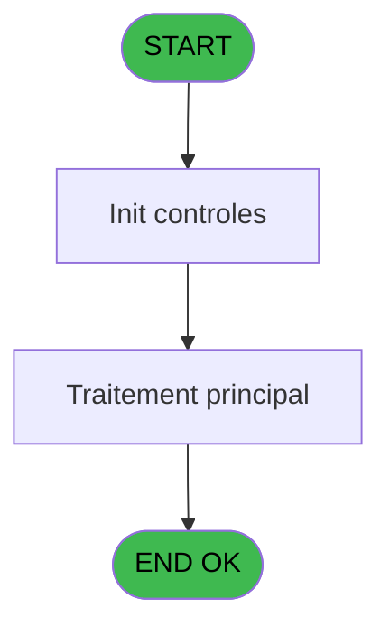
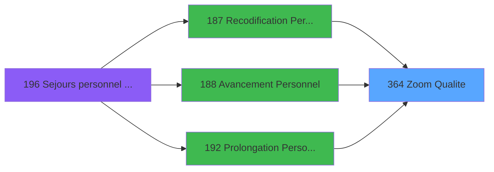
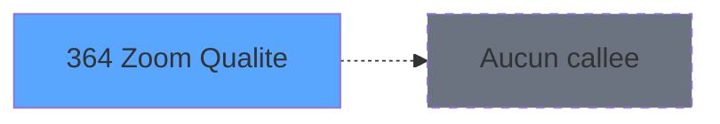

# PBG IDE 364 - Zoom Qualite

> **Analyse**: Phases 1-4 2026-02-03 11:26 -> 11:26 (18s) | Assemblage 11:26
> **Pipeline**: V7.2 Enrichi
> **Structure**: 4 onglets (Resume | Ecrans | Donnees | Connexions)

<!-- TAB:Resume -->

## 1. FICHE D'IDENTITE

| Attribut | Valeur |
|----------|--------|
| Projet | PBG |
| IDE Position | 364 |
| Nom Programme | Zoom Qualite |
| Fichier source | `Prg_364.xml` |
| Dossier IDE | Consultation |
| Taches | 1 (1 ecrans visibles) |
| Tables modifiees | 0 |
| Programmes appeles | 0 |

## 2. DESCRIPTION FONCTIONNELLE

**Zoom Qualite** assure la gestion complete de ce processus, accessible depuis [  Recodification Personnel (IDE 187)](PBG-IDE-187.md), [  Avancement Personnel (IDE 188)](PBG-IDE-188.md), [  Prolongation Personnel (IDE 192)](PBG-IDE-192.md).

Le flux de traitement s'organise en **1 blocs fonctionnels** :

- **Consultation** (1 tache) : ecrans de recherche, selection et consultation

## 3. BLOCS FONCTIONNELS

### 3.1 Consultation (1 tache)

Ecrans de recherche et consultation.

---

#### 364 - Affichage Qualite GO [[ECRAN]](#ecran-t1)

**Role** : Reinitialisation : Affichage Qualite GO.
**Ecran** : 350 x 153 DLU (MDI) | [Voir mockup](#ecran-t1)
**Variables liees** : C (< Qualite), D (< Complement qualite)

## 5. REGLES METIER

*(Aucune regle metier identifiee)*

## 6. CONTEXTE

- **Appele par**: [  Recodification Personnel (IDE 187)](PBG-IDE-187.md), [  Avancement Personnel (IDE 188)](PBG-IDE-188.md), [  Prolongation Personnel (IDE 192)](PBG-IDE-192.md)
- **Appelle**: 0 programmes | **Tables**: 1 (W:0 R:1 L:0) | **Taches**: 1 | **Expressions**: 10

<!-- TAB:Ecrans -->

## 8. ECRANS

### 8.1 Forms visibles (1 / 1)

| # | Position | Tache | Nom | Type | Largeur | Hauteur | Bloc |
|---|----------|-------|-----|------|---------|---------|------|
| 1 | 364 | 364 | Affichage Qualite GO | MDI | 350 | 153 | Consultation |

### 8.2 Mockups Ecrans

---

#### 364 - Affichage Qualite GO
**Tache** : [364](#t1) | **Type** : MDI | **Dimensions** : 350 x 153 DLU
**Bloc** : Consultation | **Titre IDE** : Affichage Qualite GO

<!-- FORM-DATA:
{
    "width":  350,
    "vFactor":  8,
    "type":  "MDI",
    "hFactor":  8,
    "controls":  [
                     {
                         "x":  96,
                         "type":  "table",
                         "var":  "",
                         "name":  "",
                         "titleH":  12,
                         "color":  "196",
                         "w":  162,
                         "y":  5,
                         "fmt":  "",
                         "parent":  null,
                         "text":  "",
                         "rowH":  12,
                         "h":  90,
                         "cols":  [
                                      {
                                          "title":  "Qualité",
                                          "layer":  1,
                                          "w":  126
                                      }
                                  ],
                         "rows":  1
                     },
                     {
                         "x":  0,
                         "type":  "label",
                         "var":  "",
                         "y":  125,
                         "w":  345,
                         "fmt":  "",
                         "name":  "",
                         "h":  24,
                         "color":  "",
                         "text":  "",
                         "parent":  null
                     },
                     {
                         "x":  102,
                         "type":  "edit",
                         "var":  "",
                         "y":  19,
                         "w":  42,
                         "fmt":  "",
                         "name":  "",
                         "h":  8,
                         "color":  "196",
                         "text":  "",
                         "parent":  1
                     },
                     {
                         "x":  162,
                         "type":  "edit",
                         "var":  "",
                         "y":  19,
                         "w":  53,
                         "fmt":  "",
                         "name":  "",
                         "h":  8,
                         "color":  "196",
                         "text":  "",
                         "parent":  1
                     },
                     {
                         "x":  5,
                         "type":  "button",
                         "var":  "",
                         "y":  128,
                         "w":  154,
                         "fmt":  "\u0026Selectionner",
                         "name":  "",
                         "h":  18,
                         "color":  "",
                         "text":  "",
                         "parent":  null
                     },
                     {
                         "x":  185,
                         "type":  "button",
                         "var":  "",
                         "y":  128,
                         "w":  154,
                         "fmt":  "\u0026Quitter",
                         "name":  "",
                         "h":  18,
                         "color":  "",
                         "text":  "",
                         "parent":  null
                     },
                     {
                         "x":  143,
                         "type":  "image",
                         "var":  "",
                         "y":  101,
                         "w":  58,
                         "fmt":  "",
                         "name":  "",
                         "h":  18,
                         "color":  "",
                         "text":  "",
                         "parent":  null
                     }
                 ],
    "taskId":  "364",
    "height":  153
}
-->

<strong>Champs : 2 champs</strong>

| Pos (x,y) | Nom | Variable | Type |
|-----------|-----|----------|------|
| 102,19 | (sans nom) | - | edit |
| 162,19 | (sans nom) | - | edit |

<strong>Boutons : 2 boutons</strong>

| Bouton | Pos (x,y) | Action |
|--------|-----------|--------|
| Selectionner | 5,128 | Ouvre la selection |
| Quitter | 185,128 | Quitte le programme |

## 9. NAVIGATION

Ecran unique: **Affichage Qualite GO**

### 9.3 Structure hierarchique (1 tache)

| Position | Tache | Type | Dimensions | Bloc |
|----------|-------|------|------------|------|
| **364.1** | [**Affichage Qualite GO** (364)](#t1) [mockup](#ecran-t1) | MDI | 350x153 | Consultation |

### 9.4 Algorigramme

> **Legende**: Vert = START/END OK | Rouge = END KO | Bleu = Decisions
> *Algorigramme auto-genere. Utiliser `/algorigramme` pour une synthese metier detaillee.*

<!-- TAB:Donnees -->

## 10. TABLES

### Tables utilisees (1)

| ID | Nom | Description | Type | R | W | L | Usages |
|----|-----|-------------|------|---|---|---|--------|
| 120 | tables_qualites__qua |  | DB | R |   |   | 1 |

### Colonnes par table (1 / 1 tables avec colonnes identifiees)

Table 120 - tables_qualites__qua (R) - 1 usages

| Lettre | Variable | Acces | Type |
|--------|----------|-------|------|
| A | > Societe | R | Alpha |
| B | < Accord suite | R | Alpha |
| C | < Qualite | R | Alpha |
| D | < Complement qualite | R | Alpha |

## 11. VARIABLES

### 11.1 Autres (4)

Variables diverses.

| Lettre | Nom | Type | Usage dans |
|--------|-----|------|-----------|
| A | > Societe | Alpha | 1x refs |
| B | < Accord suite | Alpha | - |
| C | < Qualite | Alpha | [364](#t1) |
| D | < Complement qualite | Alpha | [364](#t1) |

## 12. EXPRESSIONS

**10 / 10 expressions decodees (100%)**

### 12.1 Repartition par type

| Type | Expressions | Regles |
|------|-------------|--------|
| CONSTANTE | 4 | 0 |
| CONDITION | 3 | 0 |
| OTHER | 3 | 0 |

### 12.2 Expressions cles par type

#### CONSTANTE (4 expressions)

| Type | IDE | Expression | Regle |
|------|-----|------------|-------|
| CONSTANTE | 5 | `'P'` | - |
| CONSTANTE | 8 | `'O'` | - |
| CONSTANTE | 2 | `'N'` | - |
| CONSTANTE | 3 | `''` | - |

#### CONDITION (3 expressions)

| Type | IDE | Expression | Regle |
|------|-----|------------|-------|
| CONDITION | 9 | `< Qualite [C]<>'' AND < Complement qualite [D]<>''` | - |
| CONDITION | 4 | `> Societe [A]` | - |
| CONDITION | 1 | `< Qualite [C]` | - |

#### OTHER (3 expressions)

| Type | IDE | Expression | Regle |
|------|-----|------------|-------|
| OTHER | 10 | `MlsTrans ('Affichage Qualite GO')` | - |
| OTHER | 7 | `[H]` | - |
| OTHER | 6 | `[G]` | - |

<!-- TAB:Connexions -->

## 13. GRAPHE D'APPELS

### 13.1 Chaine depuis Main (Callers)

Main -> ... -> [  Recodification Personnel (IDE 187)](PBG-IDE-187.md) -> **Zoom Qualite (IDE 364)**

Main -> ... -> [  Avancement Personnel (IDE 188)](PBG-IDE-188.md) -> **Zoom Qualite (IDE 364)**

Main -> ... -> [  Prolongation Personnel (IDE 192)](PBG-IDE-192.md) -> **Zoom Qualite (IDE 364)**

### 13.2 Callers

| IDE | Nom Programme | Nb Appels |
|-----|---------------|-----------|
| [187](PBG-IDE-187.md) |   Recodification Personnel | 1 |
| [188](PBG-IDE-188.md) |   Avancement Personnel | 1 |
| [192](PBG-IDE-192.md) |   Prolongation Personnel | 1 |

### 13.3 Callees (programmes appeles)

### 13.4 Detail Callees avec contexte

| IDE | Nom Programme | Appels | Contexte |
|-----|---------------|--------|----------|
| - | (aucun) | - | - |

## 14. RECOMMANDATIONS MIGRATION

### 14.1 Profil du programme

| Metrique | Valeur | Impact migration |
|----------|--------|-----------------|
| Lignes de logique | 22 | Programme compact |
| Expressions | 10 | Peu de logique |
| Tables WRITE | 0 | Impact faible |
| Sous-programmes | 0 | Peu de dependances |
| Ecrans visibles | 1 | Ecran unique ou traitement batch |
| Code desactive | 0% (0 / 22) | Code sain |
| Regles metier | 0 | Pas de regle identifiee |

### 14.2 Plan de migration par bloc

#### Consultation (1 tache: 1 ecran, 0 traitement)

- **Strategie** : Composants de recherche/selection en modales.
- 1 ecran : Affichage Qualite GO

### 14.3 Dependances critiques

| Dependance | Type | Appels | Impact |
|------------|------|--------|--------|

---
*Spec DETAILED generee par Pipeline V7.2 - 2026-02-03 11:26*
