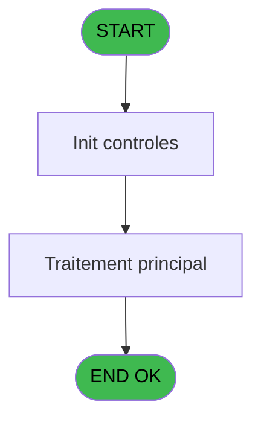
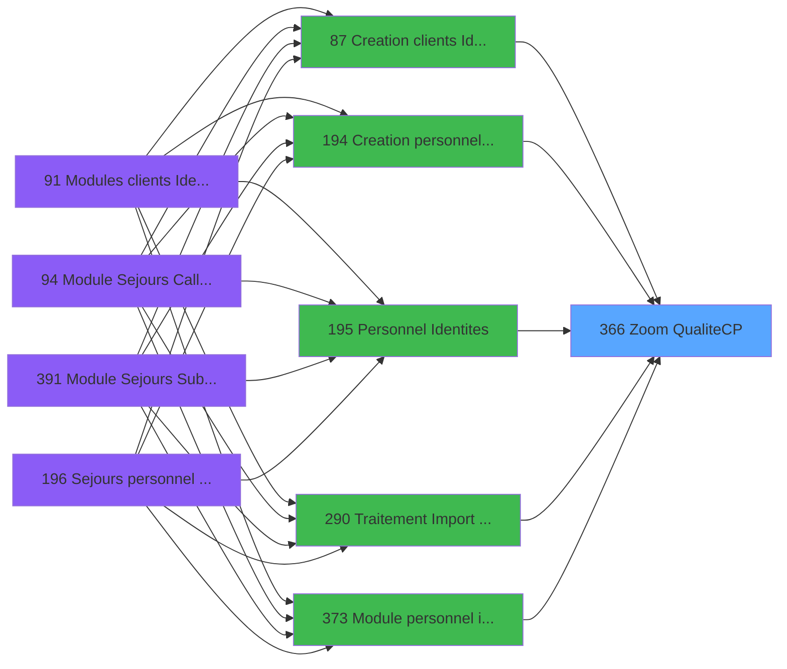
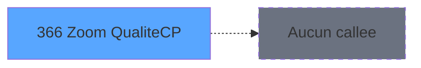

# PBG IDE 366 - Zoom Qualite(C/P)

> **Analyse**: Phases 1-4 2026-02-03 11:27 -> 11:27 (17s) | Assemblage 11:27
> **Pipeline**: V7.2 Enrichi
> **Structure**: 4 onglets (Resume | Ecrans | Donnees | Connexions)

<!-- TAB:Resume -->

## 1. FICHE D'IDENTITE

| Attribut | Valeur |
|----------|--------|
| Projet | PBG |
| IDE Position | 366 |
| Nom Programme | Zoom Qualite(C/P) |
| Fichier source | `Prg_366.xml` |
| Dossier IDE | Consultation |
| Taches | 1 (1 ecrans visibles) |
| Tables modifiees | 0 |
| Programmes appeles | 0 |

## 2. DESCRIPTION FONCTIONNELLE

**Zoom Qualite(C/P)** assure la gestion complete de ce processus, accessible depuis [Creation clients Identite (IDE 87)](PBG-IDE-87.md), [Creation clients Identite SAV (IDE 379)](PBG-IDE-379.md), [Creation clients Identite P185 (IDE 382)](PBG-IDE-382.md), [Creation clients Identite PROD (IDE 383)](PBG-IDE-383.md), [Creation clients Identite en c (IDE 384)](PBG-IDE-384.md), [Creation clients Identite SAV* (IDE 386)](PBG-IDE-386.md), [Creation clients Identite_sav (IDE 387)](PBG-IDE-387.md), [  Creation personnel identites (IDE 194)](PBG-IDE-194.md), [Personnel Identites (IDE 195)](PBG-IDE-195.md), [Traitement Import Personnel (IDE 290)](PBG-IDE-290.md), [Module personnel identites (IDE 373)](PBG-IDE-373.md), [Creation personnel identites S (IDE 380)](PBG-IDE-380.md), [Traitement Import Personnel SA (IDE 376)](PBG-IDE-376.md).

Le flux de traitement s'organise en **1 blocs fonctionnels** :

- **Consultation** (1 tache) : ecrans de recherche, selection et consultation

## 3. BLOCS FONCTIONNELS

### 3.1 Consultation (1 tache)

Ecrans de recherche et consultation.

---

#### 366 - Zoom Qualite (C/P) [[ECRAN]](#ecran-t1)

**Role** : Selection par l'operateur : Zoom Qualite (C/P).
**Ecran** : 454 x 150 DLU (MDI) | [Voir mockup](#ecran-t1)
**Variables liees** : A (>Code Qualite), B (<Complement Qualite)

## 5. REGLES METIER

*(Aucune regle metier identifiee)*

## 6. CONTEXTE

- **Appele par**: [Creation clients Identite (IDE 87)](PBG-IDE-87.md), [Creation clients Identite SAV (IDE 379)](PBG-IDE-379.md), [Creation clients Identite P185 (IDE 382)](PBG-IDE-382.md), [Creation clients Identite PROD (IDE 383)](PBG-IDE-383.md), [Creation clients Identite en c (IDE 384)](PBG-IDE-384.md), [Creation clients Identite SAV* (IDE 386)](PBG-IDE-386.md), [Creation clients Identite_sav (IDE 387)](PBG-IDE-387.md), [  Creation personnel identites (IDE 194)](PBG-IDE-194.md), [Personnel Identites (IDE 195)](PBG-IDE-195.md), [Traitement Import Personnel (IDE 290)](PBG-IDE-290.md), [Module personnel identites (IDE 373)](PBG-IDE-373.md), [Creation personnel identites S (IDE 380)](PBG-IDE-380.md), [Traitement Import Personnel SA (IDE 376)](PBG-IDE-376.md)
- **Appelle**: 0 programmes | **Tables**: 1 (W:0 R:1 L:0) | **Taches**: 1 | **Expressions**: 6

<!-- TAB:Ecrans -->

## 8. ECRANS

### 8.1 Forms visibles (1 / 1)

| # | Position | Tache | Nom | Type | Largeur | Hauteur | Bloc |
|---|----------|-------|-----|------|---------|---------|------|
| 1 | 366 | 366 | Zoom Qualite (C/P) | MDI | 454 | 150 | Consultation |

### 8.2 Mockups Ecrans

---

#### 366 - Zoom Qualite (C/P)
**Tache** : [366](#t1) | **Type** : MDI | **Dimensions** : 454 x 150 DLU
**Bloc** : Consultation | **Titre IDE** : Zoom Qualite (C/P)

<!-- FORM-DATA:
{
    "width":  454,
    "vFactor":  8,
    "type":  "MDI",
    "hFactor":  8,
    "controls":  [
                     {
                         "x":  13,
                         "type":  "table",
                         "var":  "",
                         "name":  "",
                         "titleH":  12,
                         "color":  "196",
                         "w":  434,
                         "y":  6,
                         "fmt":  "",
                         "parent":  null,
                         "text":  "",
                         "rowH":  12,
                         "h":  90,
                         "cols":  [
                                      {
                                          "title":  "Qualité",
                                          "layer":  1,
                                          "w":  398
                                      }
                                  ],
                         "rows":  1
                     },
                     {
                         "x":  0,
                         "type":  "label",
                         "var":  "",
                         "y":  125,
                         "w":  451,
                         "fmt":  "",
                         "name":  "",
                         "h":  24,
                         "color":  "",
                         "text":  "",
                         "parent":  null
                     },
                     {
                         "x":  18,
                         "type":  "edit",
                         "var":  "",
                         "y":  19,
                         "w":  48,
                         "fmt":  "",
                         "name":  "",
                         "h":  10,
                         "color":  "196",
                         "text":  "",
                         "parent":  1
                     },
                     {
                         "x":  77,
                         "type":  "edit",
                         "var":  "",
                         "y":  19,
                         "w":  53,
                         "fmt":  "",
                         "name":  "",
                         "h":  10,
                         "color":  "196",
                         "text":  "",
                         "parent":  1
                     },
                     {
                         "x":  134,
                         "type":  "edit",
                         "var":  "",
                         "y":  19,
                         "w":  277,
                         "fmt":  "",
                         "name":  "",
                         "h":  10,
                         "color":  "196",
                         "text":  "",
                         "parent":  1
                     },
                     {
                         "x":  5,
                         "type":  "button",
                         "var":  "",
                         "y":  128,
                         "w":  154,
                         "fmt":  "\u0026Selectionner",
                         "name":  "",
                         "h":  18,
                         "color":  "",
                         "text":  "",
                         "parent":  null
                     },
                     {
                         "x":  291,
                         "type":  "button",
                         "var":  "",
                         "y":  128,
                         "w":  154,
                         "fmt":  "\u0026Quitter",
                         "name":  "",
                         "h":  18,
                         "color":  "",
                         "text":  "",
                         "parent":  null
                     },
                     {
                         "x":  196,
                         "type":  "image",
                         "var":  "",
                         "y":  101,
                         "w":  58,
                         "fmt":  "",
                         "name":  "",
                         "h":  18,
                         "color":  "",
                         "text":  "",
                         "parent":  null
                     }
                 ],
    "taskId":  "366",
    "height":  150
}
-->

<strong>Champs : 3 champs</strong>

| Pos (x,y) | Nom | Variable | Type |
|-----------|-----|----------|------|
| 18,19 | (sans nom) | - | edit |
| 77,19 | (sans nom) | - | edit |
| 134,19 | (sans nom) | - | edit |

<strong>Boutons : 2 boutons</strong>

| Bouton | Pos (x,y) | Action |
|--------|-----------|--------|
| Selectionner | 5,128 | Ouvre la selection |
| Quitter | 291,128 | Quitte le programme |

## 9. NAVIGATION

Ecran unique: **Zoom Qualite (C/P)**

### 9.3 Structure hierarchique (1 tache)

| Position | Tache | Type | Dimensions | Bloc |
|----------|-------|------|------------|------|
| **366.1** | [**Zoom Qualite (C/P)** (366)](#t1) [mockup](#ecran-t1) | MDI | 454x150 | Consultation |

### 9.4 Algorigramme

> **Legende**: Vert = START/END OK | Rouge = END KO | Bleu = Decisions
> *Algorigramme auto-genere. Utiliser `/algorigramme` pour une synthese metier detaillee.*

<!-- TAB:Donnees -->

## 10. TABLES

### Tables utilisees (1)

| ID | Nom | Description | Type | R | W | L | Usages |
|----|-----|-------------|------|---|---|---|--------|
| 120 | tables_qualites__qua |  | DB | R |   |   | 1 |

### Colonnes par table (1 / 1 tables avec colonnes identifiees)

Table 120 - tables_qualites__qua (R) - 1 usages

| Lettre | Variable | Acces | Type |
|--------|----------|-------|------|
| A | >Code Qualite | R | Alpha |
| B | <Complement Qualite | R | Alpha |
| C | <Libelle | R | Alpha |

## 11. VARIABLES

### 11.1 Autres (3)

Variables diverses.

| Lettre | Nom | Type | Usage dans |
|--------|-----|------|-----------|
| A | >Code Qualite | Alpha | [366](#t1) |
| B | <Complement Qualite | Alpha | [366](#t1) |
| C | <Libelle | Alpha | - |

## 12. EXPRESSIONS

**6 / 6 expressions decodees (100%)**

### 12.1 Repartition par type

| Type | Expressions | Regles |
|------|-------------|--------|
| CALCULATION | 1 | 0 |
| CONDITION | 2 | 0 |
| OTHER | 3 | 0 |

### 12.2 Expressions cles par type

#### CALCULATION (1 expressions)

| Type | IDE | Expression | Regle |
|------|-----|------------|-------|
| CALCULATION | 6 | `MlsTrans ('Zoom Qualite (C/P)')` | - |

#### CONDITION (2 expressions)

| Type | IDE | Expression | Regle |
|------|-----|------------|-------|
| CONDITION | 4 | `>Code Qualite [A]` | - |
| CONDITION | 1 | `<Complement Qualite [B]` | - |

#### OTHER (3 expressions)

| Type | IDE | Expression | Regle |
|------|-----|------------|-------|
| OTHER | 5 | `GetParam ('SOCIETE')` | - |
| OTHER | 3 | `[F]` | - |
| OTHER | 2 | `[G]` | - |

<!-- TAB:Connexions -->

## 13. GRAPHE D'APPELS

### 13.1 Chaine depuis Main (Callers)

Main -> ... -> [Creation clients Identite (IDE 87)](PBG-IDE-87.md) -> **Zoom Qualite(C/P) (IDE 366)**

Main -> ... -> [Creation clients Identite SAV (IDE 379)](PBG-IDE-379.md) -> **Zoom Qualite(C/P) (IDE 366)**

Main -> ... -> [Creation clients Identite P185 (IDE 382)](PBG-IDE-382.md) -> **Zoom Qualite(C/P) (IDE 366)**

Main -> ... -> [Creation clients Identite PROD (IDE 383)](PBG-IDE-383.md) -> **Zoom Qualite(C/P) (IDE 366)**

Main -> ... -> [Creation clients Identite en c (IDE 384)](PBG-IDE-384.md) -> **Zoom Qualite(C/P) (IDE 366)**

Main -> ... -> [Creation clients Identite SAV* (IDE 386)](PBG-IDE-386.md) -> **Zoom Qualite(C/P) (IDE 366)**

Main -> ... -> [Creation clients Identite_sav (IDE 387)](PBG-IDE-387.md) -> **Zoom Qualite(C/P) (IDE 366)**

Main -> ... -> [  Creation personnel identites (IDE 194)](PBG-IDE-194.md) -> **Zoom Qualite(C/P) (IDE 366)**

Main -> ... -> [Personnel Identites (IDE 195)](PBG-IDE-195.md) -> **Zoom Qualite(C/P) (IDE 366)**

Main -> ... -> [Traitement Import Personnel (IDE 290)](PBG-IDE-290.md) -> **Zoom Qualite(C/P) (IDE 366)**

Main -> ... -> [Module personnel identites (IDE 373)](PBG-IDE-373.md) -> **Zoom Qualite(C/P) (IDE 366)**

Main -> ... -> [Creation personnel identites S (IDE 380)](PBG-IDE-380.md) -> **Zoom Qualite(C/P) (IDE 366)**

Main -> ... -> [Traitement Import Personnel SA (IDE 376)](PBG-IDE-376.md) -> **Zoom Qualite(C/P) (IDE 366)**

### 13.2 Callers

| IDE | Nom Programme | Nb Appels |
|-----|---------------|-----------|
| [87](PBG-IDE-87.md) | Creation clients Identite | 3 |
| [379](PBG-IDE-379.md) | Creation clients Identite SAV | 3 |
| [382](PBG-IDE-382.md) | Creation clients Identite P185 | 3 |
| [383](PBG-IDE-383.md) | Creation clients Identite PROD | 3 |
| [384](PBG-IDE-384.md) | Creation clients Identite en c | 3 |
| [386](PBG-IDE-386.md) | Creation clients Identite SAV* | 3 |
| [387](PBG-IDE-387.md) | Creation clients Identite_sav | 3 |
| [194](PBG-IDE-194.md) |   Creation personnel identites | 2 |
| [195](PBG-IDE-195.md) | Personnel Identites | 2 |
| [290](PBG-IDE-290.md) | Traitement Import Personnel | 2 |
| [373](PBG-IDE-373.md) | Module personnel identites | 2 |
| [380](PBG-IDE-380.md) | Creation personnel identites S | 2 |
| [376](PBG-IDE-376.md) | Traitement Import Personnel SA | 1 |

### 13.3 Callees (programmes appeles)

### 13.4 Detail Callees avec contexte

| IDE | Nom Programme | Appels | Contexte |
|-----|---------------|--------|----------|
| - | (aucun) | - | - |

## 14. RECOMMANDATIONS MIGRATION

### 14.1 Profil du programme

| Metrique | Valeur | Impact migration |
|----------|--------|-----------------|
| Lignes de logique | 11 | Programme compact |
| Expressions | 6 | Peu de logique |
| Tables WRITE | 0 | Impact faible |
| Sous-programmes | 0 | Peu de dependances |
| Ecrans visibles | 1 | Ecran unique ou traitement batch |
| Code desactive | 0% (0 / 11) | Code sain |
| Regles metier | 0 | Pas de regle identifiee |

### 14.2 Plan de migration par bloc

#### Consultation (1 tache: 1 ecran, 0 traitement)

- **Strategie** : Composants de recherche/selection en modales.
- 1 ecran : Zoom Qualite (C/P)

### 14.3 Dependances critiques

| Dependance | Type | Appels | Impact |
|------------|------|--------|--------|

---
*Spec DETAILED generee par Pipeline V7.2 - 2026-02-03 11:27*
