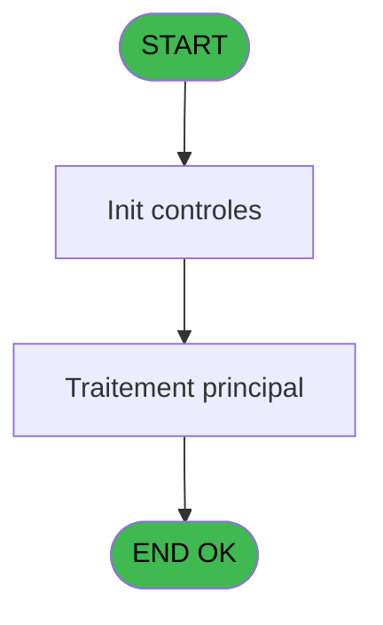
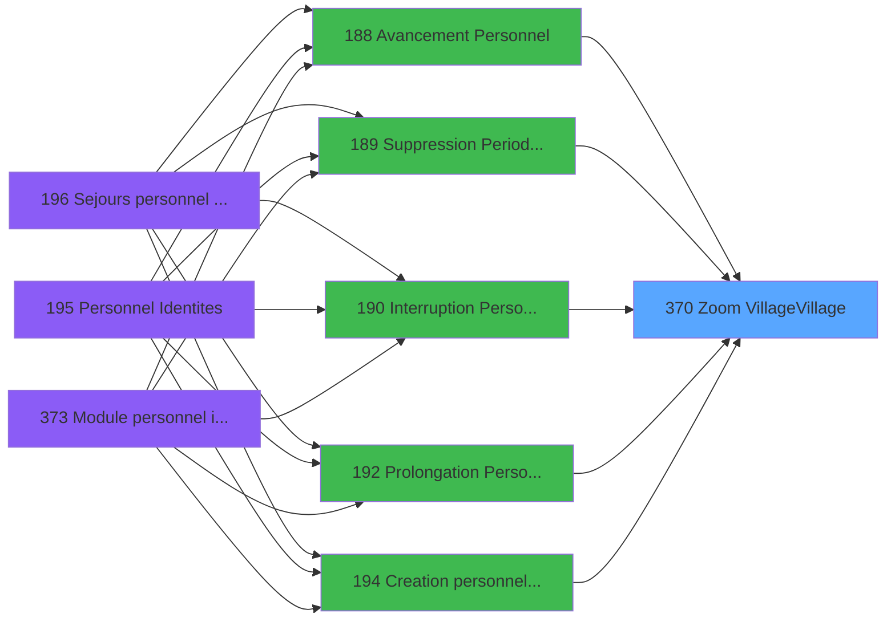

# PBG IDE 370 - Zoom Village/Village

> **Analyse**: Phases 1-4 2026-02-03 11:28 -> 11:29 (17s) | Assemblage 11:29
> **Pipeline**: V7.2 Enrichi
> **Structure**: 4 onglets (Resume | Ecrans | Donnees | Connexions)

<!-- TAB:Resume -->

## 1. FICHE D'IDENTITE

| Attribut | Valeur |
|----------|--------|
| Projet | PBG |
| IDE Position | 370 |
| Nom Programme | Zoom Village/Village |
| Fichier source | `Prg_370.xml` |
| Dossier IDE | Consultation |
| Taches | 1 (1 ecrans visibles) |
| Tables modifiees | 0 |
| Programmes appeles | 0 |

## 2. DESCRIPTION FONCTIONNELLE

**Zoom Village/Village** assure la gestion complete de ce processus, accessible depuis [  Suppression Periode Personn (IDE 189)](PBG-IDE-189.md), [  Creation personnel identites (IDE 194)](PBG-IDE-194.md), [Personnel Identites (IDE 195)](PBG-IDE-195.md), [Module personnel identites (IDE 373)](PBG-IDE-373.md), [Creation personnel identites S (IDE 380)](PBG-IDE-380.md), [  Avancement Personnel (IDE 188)](PBG-IDE-188.md), [  Interruption Personnel (IDE 190)](PBG-IDE-190.md), [  Prolongation Personnel (IDE 192)](PBG-IDE-192.md).

Le flux de traitement s'organise en **1 blocs fonctionnels** :

- **Consultation** (1 tache) : ecrans de recherche, selection et consultation

**Logique metier** : 2 regles identifiees couvrant conditions metier.

## 3. BLOCS FONCTIONNELS

### 3.1 Consultation (1 tache)

Ecrans de recherche et consultation.

---

#### 370 - Zoom Vol [[ECRAN]](#ecran-t2)

**Role** : Selection par l'operateur : Zoom Vol.
**Ecran** : 333 x 154 DLU (MDI) | [Voir mockup](#ecran-t2)

## 5. REGLES METIER

2 regles identifiees:

### Autres (2 regles)

#### [RM-001] Si [N] vaut 'A' alors 'Aller', sinon 'Retour'

| Element | Detail |
|---------|--------|
| **Condition** | `[N]='A'` |
| **Si vrai** | 'Aller' |
| **Si faux** | 'Retour') |
| **Expression source** | Expression 2 : `IF([N]='A','Aller','Retour')` |
| **Exemple** | Si [N]='A' → 'Aller'. Sinon → 'Retour') |

#### [RM-002] Si [AB] alors [Z] sinon P. Suite < [F]*3600)

| Element | Detail |
|---------|--------|
| **Condition** | `[AB]` |
| **Si vrai** | [Z] |
| **Si faux** | P. Suite < [F]*3600) |
| **Variables** | F (P. Suite <) |
| **Expression source** | Expression 20 : `IF([AB],[Z],P. Suite < [F]*3600)` |
| **Exemple** | Si [AB] → [Z]. Sinon → P. Suite < [F]*3600) |

## 6. CONTEXTE

- **Appele par**: [  Suppression Periode Personn (IDE 189)](PBG-IDE-189.md), [  Creation personnel identites (IDE 194)](PBG-IDE-194.md), [Personnel Identites (IDE 195)](PBG-IDE-195.md), [Module personnel identites (IDE 373)](PBG-IDE-373.md), [Creation personnel identites S (IDE 380)](PBG-IDE-380.md), [  Avancement Personnel (IDE 188)](PBG-IDE-188.md), [  Interruption Personnel (IDE 190)](PBG-IDE-190.md), [  Prolongation Personnel (IDE 192)](PBG-IDE-192.md)
- **Appelle**: 0 programmes | **Tables**: 2 (W:0 R:1 L:1) | **Taches**: 1 | **Expressions**: 20

<!-- TAB:Ecrans -->

## 8. ECRANS

### 8.1 Forms visibles (1 / 1)

| # | Position | Tache | Nom | Type | Largeur | Hauteur | Bloc |
|---|----------|-------|-----|------|---------|---------|------|
| 1 | 370.1 | 370 | Zoom Vol | MDI | 333 | 154 | Consultation |

### 8.2 Mockups Ecrans

---

#### 370.1 - Zoom Vol
**Tache** : [370](#t2) | **Type** : MDI | **Dimensions** : 333 x 154 DLU
**Bloc** : Consultation | **Titre IDE** : Zoom Vol

<!-- FORM-DATA:
{
    "width":  333,
    "vFactor":  8,
    "type":  "MDI",
    "hFactor":  8,
    "controls":  [
                     {
                         "x":  41,
                         "type":  "table",
                         "var":  "",
                         "name":  "Heure",
                         "titleH":  12,
                         "color":  "196",
                         "w":  249,
                         "y":  4,
                         "fmt":  "",
                         "parent":  null,
                         "text":  "",
                         "rowH":  12,
                         "h":  100,
                         "cols":  [
                                      {
                                          "title":  " ",
                                          "layer":  1,
                                          "w":  125
                                      },
                                      {
                                          "title":  "Heure",
                                          "layer":  2,
                                          "w":  90
                                      }
                                  ],
                         "rows":  2
                     },
                     {
                         "x":  0,
                         "type":  "label",
                         "var":  "",
                         "y":  130,
                         "w":  332,
                         "fmt":  "",
                         "name":  "",
                         "h":  24,
                         "color":  "",
                         "text":  "",
                         "parent":  null
                     },
                     {
                         "x":  82,
                         "type":  "edit",
                         "var":  "",
                         "y":  19,
                         "w":  69,
                         "fmt":  "",
                         "name":  "",
                         "h":  10,
                         "color":  "196",
                         "text":  "",
                         "parent":  1
                     },
                     {
                         "x":  12,
                         "type":  "button",
                         "var":  "",
                         "y":  133,
                         "w":  144,
                         "fmt":  "\u0026Selectionner",
                         "name":  "",
                         "h":  18,
                         "color":  "",
                         "text":  "",
                         "parent":  null
                     },
                     {
                         "x":  176,
                         "type":  "button",
                         "var":  "",
                         "y":  133,
                         "w":  144,
                         "fmt":  "\u0026Abandonner",
                         "name":  "",
                         "h":  18,
                         "color":  "",
                         "text":  "",
                         "parent":  null
                     },
                     {
                         "x":  147,
                         "type":  "image",
                         "var":  "",
                         "y":  108,
                         "w":  58,
                         "fmt":  "",
                         "name":  "",
                         "h":  18,
                         "color":  "",
                         "text":  "",
                         "parent":  null
                     },
                     {
                         "x":  178,
                         "type":  "edit",
                         "var":  "",
                         "y":  19,
                         "w":  71,
                         "fmt":  "HH:MM",
                         "name":  "vol_heure",
                         "h":  10,
                         "color":  "196",
                         "text":  "",
                         "parent":  1
                     },
                     {
                         "x":  48,
                         "type":  "edit",
                         "var":  "",
                         "y":  19,
                         "w":  27,
                         "fmt":  "",
                         "name":  "vot_compagnie",
                         "h":  10,
                         "color":  "196",
                         "text":  "",
                         "parent":  1
                     }
                 ],
    "taskId":  "370.1",
    "height":  154
}
-->

<strong>Champs : 3 champs</strong>

| Pos (x,y) | Nom | Variable | Type |
|-----------|-----|----------|------|
| 82,19 | (sans nom) | - | edit |
| 178,19 | vol_heure | - | edit |
| 48,19 | vot_compagnie | - | edit |

<strong>Boutons : 2 boutons</strong>

| Bouton | Pos (x,y) | Action |
|--------|-----------|--------|
| Selectionner | 12,133 | Ouvre la selection |
| Abandonner | 176,133 | Annule et retour au menu |

## 9. NAVIGATION

Ecran unique: **Zoom Vol**

### 9.3 Structure hierarchique (1 tache)

| Position | Tache | Type | Dimensions | Bloc |
|----------|-------|------|------------|------|
| **370.1** | [**Zoom Vol** (370)](#t2) [mockup](#ecran-t2) | MDI | 333x154 | Consultation |

### 9.4 Algorigramme

> **Legende**: Vert = START/END OK | Rouge = END KO | Bleu = Decisions
> *Algorigramme auto-genere. Utiliser `/algorigramme` pour une synthese metier detaillee.*

<!-- TAB:Donnees -->

## 10. TABLES

### Tables utilisees (2)

| ID | Nom | Description | Type | R | W | L | Usages |
|----|-----|-------------|------|---|---|---|--------|
| 132 | code_vol_________vot |  | DB | R |   |   | 1 |
| 134 | groupe_arr_dep___vol |  | DB |   |   | L | 1 |

### Colonnes par table (1 / 1 tables avec colonnes identifiees)

Table 132 - code_vol_________vot (R) - 1 usages

| Lettre | Variable | Acces | Type |
|--------|----------|-------|------|
| A | P. Société | R | Alpha |
| B | P. Vol_Aller_Retour | R | Alpha |
| C | P. Vol_date | R | Date |
| D | P. Code_Vol < | R | Alpha |
| E | P. Vol heure < | R | Alpha |
| F | P. Suite < | R | Alpha |
| G | v.vol? | R | Logical |

## 11. VARIABLES

### 11.1 Parametres entrants (6)

Variables recues du programme appelant ([  Suppression Periode Personn (IDE 189)](PBG-IDE-189.md)).

| Lettre | Nom | Type | Usage dans |
|--------|-----|------|-----------|
| A | P. Société | Alpha | 1x parametre entrant |
| B | P. Vol_Aller_Retour | Alpha | 1x parametre entrant |
| C | P. Vol_date | Date | 1x parametre entrant |
| D | P. Code_Vol < | Alpha | 1x parametre entrant |
| E | P. Vol heure < | Alpha | 2x parametre entrant |
| F | P. Suite < | Alpha | 4x parametre entrant |

### 11.2 Variables de session (1)

Variables persistantes pendant toute la session.

| Lettre | Nom | Type | Usage dans |
|--------|-----|------|-----------|
| G | v.vol? | Logical | - |

## 12. EXPRESSIONS

**20 / 20 expressions decodees (100%)**

### 12.1 Repartition par type

| Type | Expressions | Regles |
|------|-------------|--------|
| CONDITION | 9 | 2 |
| CONSTANTE | 4 | 0 |
| OTHER | 6 | 0 |
| REFERENCE_VG | 1 | 0 |

### 12.2 Expressions cles par type

#### CONDITION (9 expressions)

| Type | IDE | Expression | Regle |
|------|-----|------------|-------|
| CONDITION | 20 | `IF([AB],[Z],P. Suite < [F]*3600)` | [RM-002](#rm-RM-002) |
| CONDITION | 2 | `IF([N]='A','Aller','Retour')` | [RM-001](#rm-RM-001) |
| CONDITION | 18 | `Heure_vol_Min(P. Suite < [F])` | - |
| CONDITION | 19 | `Heure_vol_Max(P. Suite < [F])` | - |
| CONDITION | 12 | `Str (P. Suite < [F],'#2P0')` | - |
| ... | | *+4 autres* | |

#### CONSTANTE (4 expressions)

| Type | IDE | Expression | Regle |
|------|-----|------------|-------|
| CONSTANTE | 9 | `'N'` | - |
| CONSTANTE | 10 | `'O'` | - |
| CONSTANTE | 7 | `'M'` | - |
| CONSTANTE | 8 | `'VV2'` | - |

#### OTHER (6 expressions)

| Type | IDE | Expression | Regle |
|------|-----|------------|-------|
| OTHER | 13 | `P. Société [A]` | - |
| OTHER | 14 | `P. Vol_Aller_Retour [B]` | - |
| OTHER | 15 | `P. Vol_date [C]` | - |
| OTHER | 3 | `[M]` | - |
| OTHER | 4 | `[N]` | - |
| ... | | *+1 autres* | |

#### REFERENCE_VG (1 expressions)

| Type | IDE | Expression | Regle |
|------|-----|------------|-------|
| REFERENCE_VG | 5 | `VG11` | - |

<!-- TAB:Connexions -->

## 13. GRAPHE D'APPELS

### 13.1 Chaine depuis Main (Callers)

Main -> ... -> [  Suppression Periode Personn (IDE 189)](PBG-IDE-189.md) -> **Zoom Village/Village (IDE 370)**

Main -> ... -> [  Creation personnel identites (IDE 194)](PBG-IDE-194.md) -> **Zoom Village/Village (IDE 370)**

Main -> ... -> [Personnel Identites (IDE 195)](PBG-IDE-195.md) -> **Zoom Village/Village (IDE 370)**

Main -> ... -> [Module personnel identites (IDE 373)](PBG-IDE-373.md) -> **Zoom Village/Village (IDE 370)**

Main -> ... -> [Creation personnel identites S (IDE 380)](PBG-IDE-380.md) -> **Zoom Village/Village (IDE 370)**

Main -> ... -> [  Avancement Personnel (IDE 188)](PBG-IDE-188.md) -> **Zoom Village/Village (IDE 370)**

Main -> ... -> [  Interruption Personnel (IDE 190)](PBG-IDE-190.md) -> **Zoom Village/Village (IDE 370)**

Main -> ... -> [  Prolongation Personnel (IDE 192)](PBG-IDE-192.md) -> **Zoom Village/Village (IDE 370)**

### 13.2 Callers

| IDE | Nom Programme | Nb Appels |
|-----|---------------|-----------|
| [189](PBG-IDE-189.md) |   Suppression Periode Personn | 2 |
| [194](PBG-IDE-194.md) |   Creation personnel identites | 2 |
| [195](PBG-IDE-195.md) | Personnel Identites | 2 |
| [373](PBG-IDE-373.md) | Module personnel identites | 2 |
| [380](PBG-IDE-380.md) | Creation personnel identites S | 2 |
| [188](PBG-IDE-188.md) |   Avancement Personnel | 1 |
| [190](PBG-IDE-190.md) |   Interruption Personnel | 1 |
| [192](PBG-IDE-192.md) |   Prolongation Personnel | 1 |

### 13.3 Callees (programmes appeles)

### 13.4 Detail Callees avec contexte

| IDE | Nom Programme | Appels | Contexte |
|-----|---------------|--------|----------|
| - | (aucun) | - | - |

## 14. RECOMMANDATIONS MIGRATION

### 14.1 Profil du programme

| Metrique | Valeur | Impact migration |
|----------|--------|-----------------|
| Lignes de logique | 29 | Programme compact |
| Expressions | 20 | Peu de logique |
| Tables WRITE | 0 | Impact faible |
| Sous-programmes | 0 | Peu de dependances |
| Ecrans visibles | 1 | Ecran unique ou traitement batch |
| Code desactive | 0% (0 / 29) | Code sain |
| Regles metier | 2 | Quelques regles a preserver |

### 14.2 Plan de migration par bloc

#### Consultation (1 tache: 1 ecran, 0 traitement)

- **Strategie** : Composants de recherche/selection en modales.
- 1 ecran : Zoom Vol

### 14.3 Dependances critiques

| Dependance | Type | Appels | Impact |
|------------|------|--------|--------|

---
*Spec DETAILED generee par Pipeline V7.2 - 2026-02-03 11:29*
