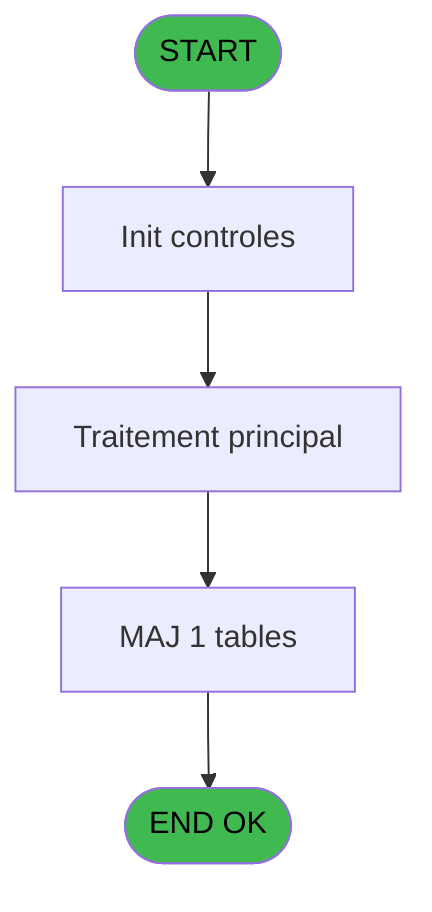

# PBG IDE 374 - Gestion des effectifs new

> **Analyse**: Phases 1-4 2026-02-03 11:30 -> 11:30 (17s) | Assemblage 11:30
> **Pipeline**: V7.2 Enrichi
> **Structure**: 4 onglets (Resume | Ecrans | Donnees | Connexions)

<!-- TAB:Resume -->

## 1. FICHE D'IDENTITE

| Attribut | Valeur |
|----------|--------|
| Projet | PBG |
| IDE Position | 374 |
| Nom Programme | Gestion des effectifs new |
| Fichier source | `Prg_374.xml` |
| Dossier IDE | General |
| Taches | 4 (0 ecrans visibles) |
| Tables modifiees | 1 |
| Programmes appeles | 0 |
| :warning: Statut | **ORPHELIN_POTENTIEL** |

## 2. DESCRIPTION FONCTIONNELLE

**Gestion des effectifs new** assure la gestion complete de ce processus.

Le flux de traitement s'organise en **1 blocs fonctionnels** :

- **Traitement** (4 taches) : traitements metier divers

**Donnees modifiees** : 1 tables en ecriture (Table_948).

Detail : phases du traitement

#### Phase 1 : Traitement (4 taches)

- **374** - Gestion des effectifs new
- **374.1** - Création/ modification,
- **374.2** - Création enregs
- **374.3** - Création enregs

#### Tables impactees

| Table | Operations | Role metier |
|-------|-----------|-------------|
| Table_948 | **W** (3 usages) |  |

## 3. BLOCS FONCTIONNELS

### 3.1 Traitement (4 taches)

Traitements internes.

---

#### 374 - Gestion des effectifs new

**Role** : Gestion du moyen de paiement : Gestion des effectifs new.

3 sous-taches directes

| Tache | Nom | Bloc |
|-------|-----|------|
| [374.1](#t2) | Création/ modification, | Traitement |
| [374.2](#t5) | Création enregs | Traitement |
| [374.3](#t8) | Création enregs | Traitement |

---

#### 374.1 - Création/ modification,

**Role** : Traitement : Création/ modification,.

---

#### 374.2 - Création enregs

**Role** : Traitement : Création enregs.

---

#### 374.3 - Création enregs

**Role** : Traitement : Création enregs.

## 5. REGLES METIER

*(Aucune regle metier identifiee)*

## 6. CONTEXTE

- **Appele par**: (aucun)
- **Appelle**: 0 programmes | **Tables**: 1 (W:1 R:0 L:0) | **Taches**: 4 | **Expressions**: 20

<!-- TAB:Ecrans -->

## 8. ECRANS

*(Programme sans ecran visible)*

## 9. NAVIGATION

### 9.3 Structure hierarchique (4 taches)

| Position | Tache | Type | Dimensions | Bloc |
|----------|-------|------|------------|------|
| **374.1** | [**Gestion des effectifs new** (374)](#t1) | - | - | Traitement |
| 374.1.1 | [Création/ modification, (374.1)](#t2) | - | - | |
| 374.1.2 | [Création enregs (374.2)](#t5) | - | - | |
| 374.1.3 | [Création enregs (374.3)](#t8) | - | - | |

### 9.4 Algorigramme

> **Legende**: Vert = START/END OK | Rouge = END KO | Bleu = Decisions
> *Algorigramme auto-genere. Utiliser `/algorigramme` pour une synthese metier detaillee.*

<!-- TAB:Donnees -->

## 10. TABLES

### Tables utilisees (1)

| ID | Nom | Description | Type | R | W | L | Usages |
|----|-----|-------------|------|---|---|---|--------|
| 948 | Table_948 |  | MEM |   | **W** |   | 3 |

### Colonnes par table (1 / 1 tables avec colonnes identifiees)

Table 948 - Table_948 (**W**) - 3 usages

| Lettre | Variable | Acces | Type |
|--------|----------|-------|------|
| A | P.date de début | W | Date |
| B | P.date de fin | W | Date |
| C | P.Qualité | W | Unicode |
| D | P.Qualité compl | W | Unicode |
| E | P.Groupe | W | Unicode |
| F | P.Compte | W | Numeric |
| G | P.Lieu_sejour | W | Unicode |
| H | P.Repas | W | Unicode |
| I | P.Nouvelledate de Fin | W | Date |
| J | P.Nouvelle heure debut | W | Time |
| K | P.Nouvelle heure de fin | W | Time |
| L | P.repas | W | Unicode |
| M | P . Code_Ope (‘V’,’D’) | W | Unicode |

## 11. VARIABLES

### 11.1 Parametres entrants (18)

Variables recues en parametre.

| Lettre | Nom | Type | Usage dans |
|--------|-----|------|-----------|
| A | P.Société | Unicode | - |
| B | P.compte | Numeric | - |
| C | P.Qualité | Unicode | - |
| D | P.Qualité_compl | Unicode | - |
| E | P.date_opération | Date | - |
| F | P.date de debut | Date | 1x parametre entrant |
| G | P.date de fin | Date | 4x parametre entrant |
| H | P.heure de début | Time | - |
| I | P.Heure de fin | Time | 2x parametre entrant |
| J | P.Nouvelle date de debut | Date | - |
| K | P. Nouvelle date de fin | Date | 5x parametre entrant |
| L | P. Nouvelle heure de début | Time | - |
| M | P. Nouvelle Heure de fin | Time | 2x parametre entrant |
| N | P.Groupe | Unicode | - |
| O | P. Quantité | Numeric | - |
| P | P.repas | Unicode | - |
| Q | P .codeOpe(‘V’,’D’,'A') | Unicode | 2x parametre entrant |
| R | P.Lieu_séjour | Unicode | - |

### 11.2 Autres (1)

Variables diverses.

| Lettre | Nom | Type | Usage dans |
|--------|-----|------|-----------|
| S | v_comptage_enregistrement | Numeric | - |

Toutes les 19 variables (liste complete)

| Cat | Lettre | Nom Variable | Type |
|-----|--------|--------------|------|
| P0 | **A** | P.Société | Unicode |
| P0 | **B** | P.compte | Numeric |
| P0 | **C** | P.Qualité | Unicode |
| P0 | **D** | P.Qualité_compl | Unicode |
| P0 | **E** | P.date_opération | Date |
| P0 | **F** | P.date de debut | Date |
| P0 | **G** | P.date de fin | Date |
| P0 | **H** | P.heure de début | Time |
| P0 | **I** | P.Heure de fin | Time |
| P0 | **J** | P.Nouvelle date de debut | Date |
| P0 | **K** | P. Nouvelle date de fin | Date |
| P0 | **L** | P. Nouvelle heure de début | Time |
| P0 | **M** | P. Nouvelle Heure de fin | Time |
| P0 | **N** | P.Groupe | Unicode |
| P0 | **O** | P. Quantité | Numeric |
| P0 | **P** | P.repas | Unicode |
| P0 | **Q** | P .codeOpe(‘V’,’D’,'A') | Unicode |
| P0 | **R** | P.Lieu_séjour | Unicode |
| Autre | **S** | v_comptage_enregistrement | Numeric |

## 12. EXPRESSIONS

**20 / 20 expressions decodees (100%)**

### 12.1 Repartition par type

| Type | Expressions | Regles |
|------|-------------|--------|
| CALCULATION | 2 | 0 |
| CONSTANTE | 5 | 0 |
| CONDITION | 6 | 0 |
| DATE | 2 | 0 |
| OTHER | 1 | 0 |
| FORMAT | 4 | 0 |

### 12.2 Expressions cles par type

#### CALCULATION (2 expressions)

| Type | IDE | Expression | Regle |
|------|-----|------------|-------|
| CALCULATION | 17 | `P. Nouvelle date de fin [K]+1` | - |
| CALCULATION | 9 | `[AT]+1` | - |

#### CONSTANTE (5 expressions)

| Type | IDE | Expression | Regle |
|------|-----|------------|-------|
| CONSTANTE | 18 | `'DEJ'` | - |
| CONSTANTE | 19 | `'DIN'` | - |
| CONSTANTE | 7 | `'DIN'` | - |
| CONSTANTE | 1 | `0` | - |
| CONSTANTE | 6 | `'DEJ'` | - |

#### CONDITION (6 expressions)

| Type | IDE | Expression | Regle |
|------|-----|------------|-------|
| CONDITION | 16 | `P. Nouvelle date de fin [K]<P.date de fin [G]` | - |
| CONDITION | 20 | `P .codeOpe(‘V’,’D’,'A') [Q]='A'` | - |
| CONDITION | 14 | `Trim(P .codeOpe(‘V’,’D’,'A') [Q])<>''` | - |
| CONDITION | 8 | `AddDate(P.date de fin [G],0,0,[AT]) <P. Nouvelle date de fin [K]` | - |
| CONDITION | 11 | `AddDate(P.date de debut [F],0,0,2) <Date()` | - |
| ... | | *+1 autres* | |

#### DATE (2 expressions)

| Type | IDE | Expression | Regle |
|------|-----|------------|-------|
| DATE | 15 | `Date()` | - |
| DATE | 10 | `AddDate(P.date de fin [G],0,0,[AT])` | - |

#### OTHER (1 expressions)

| Type | IDE | Expression | Regle |
|------|-----|------------|-------|
| OTHER | 12 | `NOT(ISNULL(P. Nouvelle date de fin [K]))` | - |

#### FORMAT (4 expressions)

| Type | IDE | Expression | Regle |
|------|-----|------------|-------|
| FORMAT | 4 | `Val(TStr(P.Heure de fin [I],'HH'),'2')<20` | - |
| FORMAT | 5 | `Val(TStr(P. Nouvelle Heure de fin [M],'HH'),'2')<20` | - |
| FORMAT | 2 | `Val(TStr(P.Heure de fin [I],'HH'),'2')<12` | - |
| FORMAT | 3 | `Val(TStr(P. Nouvelle Heure de fin [M],'HH'),'2')<12` | - |

<!-- TAB:Connexions -->

## 13. GRAPHE D'APPELS

### 13.1 Chaine depuis Main (Callers)

**Chemin**: (pas de callers directs)

### 13.2 Callers

| IDE | Nom Programme | Nb Appels |
|-----|---------------|-----------|
| - | (aucun) | - |

### 13.3 Callees (programmes appeles)

### 13.4 Detail Callees avec contexte

| IDE | Nom Programme | Appels | Contexte |
|-----|---------------|--------|----------|
| - | (aucun) | - | - |

## 14. RECOMMANDATIONS MIGRATION

### 14.1 Profil du programme

| Metrique | Valeur | Impact migration |
|----------|--------|-----------------|
| Lignes de logique | 196 | Programme compact |
| Expressions | 20 | Peu de logique |
| Tables WRITE | 1 | Impact faible |
| Sous-programmes | 0 | Peu de dependances |
| Ecrans visibles | 0 | Ecran unique ou traitement batch |
| Code desactive | 0% (0 / 196) | Code sain |
| Regles metier | 0 | Pas de regle identifiee |

### 14.2 Plan de migration par bloc

#### Traitement (4 taches: 0 ecran, 4 traitements)

- **Strategie** : 4 service(s) backend injectable(s) (Domain Services).
- Decomposer les taches en services unitaires testables.

### 14.3 Dependances critiques

| Dependance | Type | Appels | Impact |
|------------|------|--------|--------|
| Table_948 | Table WRITE (Memory) | 3x | Schema + repository |

---
*Spec DETAILED generee par Pipeline V7.2 - 2026-02-03 11:30*
