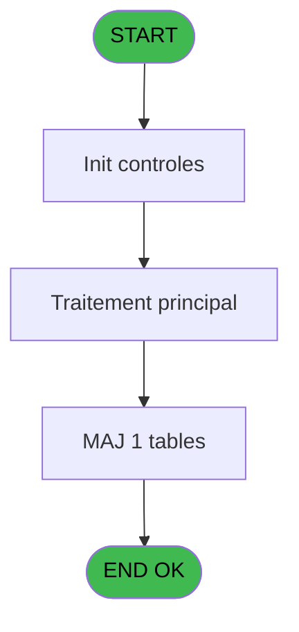

# PBG IDE 375 - Gestion des repas new

> **Analyse**: Phases 1-4 2026-02-03 11:30 -> 11:31 (17s) | Assemblage 11:31
> **Pipeline**: V7.2 Enrichi
> **Structure**: 4 onglets (Resume | Ecrans | Donnees | Connexions)

<!-- TAB:Resume -->

## 1. FICHE D'IDENTITE

| Attribut | Valeur |
|----------|--------|
| Projet | PBG |
| IDE Position | 375 |
| Nom Programme | Gestion des repas new |
| Fichier source | `Prg_375.xml` |
| Dossier IDE | General |
| Taches | 4 (0 ecrans visibles) |
| Tables modifiees | 1 |
| Programmes appeles | 0 |
| :warning: Statut | **ORPHELIN_POTENTIEL** |

## 2. DESCRIPTION FONCTIONNELLE

**Gestion des repas new** assure la gestion complete de ce processus.

Le flux de traitement s'organise en **1 blocs fonctionnels** :

- **Traitement** (4 taches) : traitements metier divers

**Donnees modifiees** : 1 tables en ecriture (Table_948).

Detail : phases du traitement

#### Phase 1 : Traitement (4 taches)

- **375** - Gestion des repas new
- **375.1** - Création/ modification,
- **375.2** - Création enregs
- **375.3** - Création enregs

#### Tables impactees

| Table | Operations | Role metier |
|-------|-----------|-------------|
| Table_948 | **W**/L (3 usages) |  |

## 3. BLOCS FONCTIONNELS

### 3.1 Traitement (4 taches)

Traitements internes.

---

#### 375 - Gestion des repas new

**Role** : Gestion du moyen de paiement : Gestion des repas new.

3 sous-taches directes

| Tache | Nom | Bloc |
|-------|-----|------|
| [375.1](#t2) | Création/ modification, | Traitement |
| [375.2](#t5) | Création enregs | Traitement |
| [375.3](#t8) | Création enregs | Traitement |

**Variables liees** : F (P.code_repas_nenc_vil), R (P.repas)

---

#### 375.1 - Création/ modification,

**Role** : Traitement : Création/ modification,.

---

#### 375.2 - Création enregs

**Role** : Traitement : Création enregs.

---

#### 375.3 - Création enregs

**Role** : Traitement : Création enregs.

## 5. REGLES METIER

*(Aucune regle metier identifiee)*

## 6. CONTEXTE

- **Appele par**: (aucun)
- **Appelle**: 0 programmes | **Tables**: 2 (W:1 R:1 L:1) | **Taches**: 4 | **Expressions**: 19

<!-- TAB:Ecrans -->

## 8. ECRANS

*(Programme sans ecran visible)*

## 9. NAVIGATION

### 9.3 Structure hierarchique (4 taches)

| Position | Tache | Type | Dimensions | Bloc |
|----------|-------|------|------------|------|
| **375.1** | [**Gestion des repas new** (375)](#t1) | - | - | Traitement |
| 375.1.1 | [Création/ modification, (375.1)](#t2) | - | - | |
| 375.1.2 | [Création enregs (375.2)](#t5) | - | - | |
| 375.1.3 | [Création enregs (375.3)](#t8) | - | - | |

### 9.4 Algorigramme

> **Legende**: Vert = START/END OK | Rouge = END KO | Bleu = Decisions
> *Algorigramme auto-genere. Utiliser `/algorigramme` pour une synthese metier detaillee.*

<!-- TAB:Donnees -->

## 10. TABLES

### Tables utilisees (2)

| ID | Nom | Description | Type | R | W | L | Usages |
|----|-----|-------------|------|---|---|---|--------|
| 826 | wording_mention_legal |  | DB | R |   |   | 1 |
| 948 | Table_948 |  | MEM |   | **W** | L | 3 |

### Colonnes par table (2 / 2 tables avec colonnes identifiees)

Table 826 - wording_mention_legal (R) - 1 usages

| Lettre | Variable | Acces | Type |
|--------|----------|-------|------|
| A | P.modif/Création | R | Unicode |
| B | P.date de début | R | Date |
| C | P.date de Fin | R | Date |
| D | P.Qualité | R | Unicode |
| E | P.Qualité compl | R | Unicode |
| F | P.heure debut | R | Time |
| G | P.heure de fin | R | Time |
| H | P.Quantité | R | Numeric |
| I | P.Nouvelle date de début | R | Date |
| J | P.Nouvelledate de Fin | R | Date |
| K | P.Nouvelle heure debut | R | Time |
| L | P.Nouvelle heure de fin | R | Time |
| M | P.repas | R | Unicode |
| N | P . Code_Ope (‘V’,’D’,'A') | R | Unicode |

Table 948 - Table_948 (**W**/L) - 3 usages

| Lettre | Variable | Acces | Type |
|--------|----------|-------|------|
| A | P.date de début | W | Date |
| B | P.date de fin | W | Date |
| C | P.Qualité | W | Unicode |
| D | P.Qualité compl | W | Unicode |
| E | P.Groupe | W | Unicode |
| F | P.Compte | W | Numeric |
| G | P.Lieu_sejour | W | Unicode |
| H | P.Repas | W | Unicode |

## 11. VARIABLES

### 11.1 Parametres entrants (19)

Variables recues en parametre.

| Lettre | Nom | Type | Usage dans |
|--------|-----|------|-----------|
| A | P.Mode (Modif/Creation/Annulat) | Unicode | - |
| B | P.Société | Unicode | - |
| C | P.compte | Numeric | - |
| D | P.Qualité | Unicode | 2x parametre entrant |
| E | P.Qualité_compl | Unicode | 2x parametre entrant |
| F | P.code_repas_nenc_vil | Unicode | 3x parametre entrant |
| G | P.date_conso_debut | Date | 2x parametre entrant |
| H | P.date de debut | Date | - |
| I | P.date de fin | Date | 2x parametre entrant |
| J | P.heure de début | Time | - |
| K | P.Heure de fin | Time | - |
| L | P.Nouvelle date de debut | Date | - |
| M | P. Nouvelle date de fin | Date | - |
| N | P. Nouvelle heure de début | Time | - |
| O | P. Nouvelle Heure de fin | Time | - |
| P | P.Groupe | Unicode | - |
| Q | P. Quantité | Numeric | - |
| R | P.repas | Unicode | - |
| S | P.Lieu_séjour | Unicode | - |

### 11.2 Variables de session (1)

Variables persistantes pendant toute la session.

| Lettre | Nom | Type | Usage dans |
|--------|-----|------|-----------|
| U | v.Confirm annulation | Numeric | - |

### 11.3 Autres (1)

Variables diverses.

| Lettre | Nom | Type | Usage dans |
|--------|-----|------|-----------|
| T | v_comptage_enregistrement | Numeric | - |

Toutes les 21 variables (liste complete)

| Cat | Lettre | Nom Variable | Type |
|-----|--------|--------------|------|
| P0 | **A** | P.Mode (Modif/Creation/Annulat) | Unicode |
| P0 | **B** | P.Société | Unicode |
| P0 | **C** | P.compte | Numeric |
| P0 | **D** | P.Qualité | Unicode |
| P0 | **E** | P.Qualité_compl | Unicode |
| P0 | **F** | P.code_repas_nenc_vil | Unicode |
| P0 | **G** | P.date_conso_debut | Date |
| P0 | **H** | P.date de debut | Date |
| P0 | **I** | P.date de fin | Date |
| P0 | **J** | P.heure de début | Time |
| P0 | **K** | P.Heure de fin | Time |
| P0 | **L** | P.Nouvelle date de debut | Date |
| P0 | **M** | P. Nouvelle date de fin | Date |
| P0 | **N** | P. Nouvelle heure de début | Time |
| P0 | **O** | P. Nouvelle Heure de fin | Time |
| P0 | **P** | P.Groupe | Unicode |
| P0 | **Q** | P. Quantité | Numeric |
| P0 | **R** | P.repas | Unicode |
| P0 | **S** | P.Lieu_séjour | Unicode |
| V. | **U** | v.Confirm annulation | Numeric |
| Autre | **T** | v_comptage_enregistrement | Numeric |

## 12. EXPRESSIONS

**19 / 19 expressions decodees (100%)**

### 12.1 Repartition par type

| Type | Expressions | Regles |
|------|-------------|--------|
| CALCULATION | 1 | 0 |
| CONSTANTE | 5 | 0 |
| CONDITION | 7 | 0 |
| DATE | 2 | 0 |
| FORMAT | 4 | 0 |

### 12.2 Expressions cles par type

#### CALCULATION (1 expressions)

| Type | IDE | Expression | Regle |
|------|-----|------------|-------|
| CALCULATION | 9 | `[AT]+1` | - |

#### CONSTANTE (5 expressions)

| Type | IDE | Expression | Regle |
|------|-----|------------|-------|
| CONSTANTE | 18 | `'M'` | - |
| CONSTANTE | 19 | `'A'` | - |
| CONSTANTE | 8 | `'DIN'` | - |
| CONSTANTE | 4 | `0` | - |
| CONSTANTE | 6 | `'DEJ'` | - |

#### CONDITION (7 expressions)

| Type | IDE | Expression | Regle |
|------|-----|------------|-------|
| CONDITION | 1 | `[AX]='C'` | - |
| CONDITION | 2 | `[AX]='M'` | - |
| CONDITION | 3 | `[AX]='A'` | - |
| CONDITION | 17 | `P.Qualité_compl [E]=Date()-1 OR P.Qualité_compl [E]=Date()+1` | - |
| CONDITION | 5 | `AddDate(P.code_repas_nenc_vil [F],0,0, [AT])<P.date_conso_debut [G]` | - |
| ... | | *+2 autres* | |

#### DATE (2 expressions)

| Type | IDE | Expression | Regle |
|------|-----|------------|-------|
| DATE | 15 | `Date()` | - |
| DATE | 7 | `AddDate(P.code_repas_nenc_vil [F],0,0, [AT])` | - |

#### FORMAT (4 expressions)

| Type | IDE | Expression | Regle |
|------|-----|------------|-------|
| FORMAT | 13 | `Val(TStr(Time(),'HH'),'2')<15` | - |
| FORMAT | 14 | `Val(TStr(Time(),'HH'),'2')<23` | - |
| FORMAT | 11 | `Val(TStr(P.date de fin [I],'HH'),'2')>12` | - |
| FORMAT | 12 | `Val(TStr(P.date de fin [I],'HH'),'2')>20` | - |

<!-- TAB:Connexions -->

## 13. GRAPHE D'APPELS

### 13.1 Chaine depuis Main (Callers)

**Chemin**: (pas de callers directs)

### 13.2 Callers

| IDE | Nom Programme | Nb Appels |
|-----|---------------|-----------|
| - | (aucun) | - |

### 13.3 Callees (programmes appeles)

### 13.4 Detail Callees avec contexte

| IDE | Nom Programme | Appels | Contexte |
|-----|---------------|--------|----------|
| - | (aucun) | - | - |

## 14. RECOMMANDATIONS MIGRATION

### 14.1 Profil du programme

| Metrique | Valeur | Impact migration |
|----------|--------|-----------------|
| Lignes de logique | 205 | Taille moyenne |
| Expressions | 19 | Peu de logique |
| Tables WRITE | 1 | Impact faible |
| Sous-programmes | 0 | Peu de dependances |
| Ecrans visibles | 0 | Ecran unique ou traitement batch |
| Code desactive | 0% (0 / 205) | Code sain |
| Regles metier | 0 | Pas de regle identifiee |

### 14.2 Plan de migration par bloc

#### Traitement (4 taches: 0 ecran, 4 traitements)

- **Strategie** : 4 service(s) backend injectable(s) (Domain Services).
- Decomposer les taches en services unitaires testables.

### 14.3 Dependances critiques

| Dependance | Type | Appels | Impact |
|------------|------|--------|--------|
| Table_948 | Table WRITE (Memory) | 2x | Schema + repository |

---
*Spec DETAILED generee par Pipeline V7.2 - 2026-02-03 11:31*
