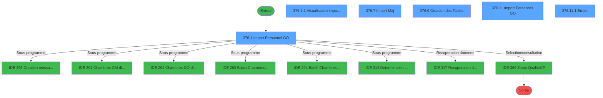
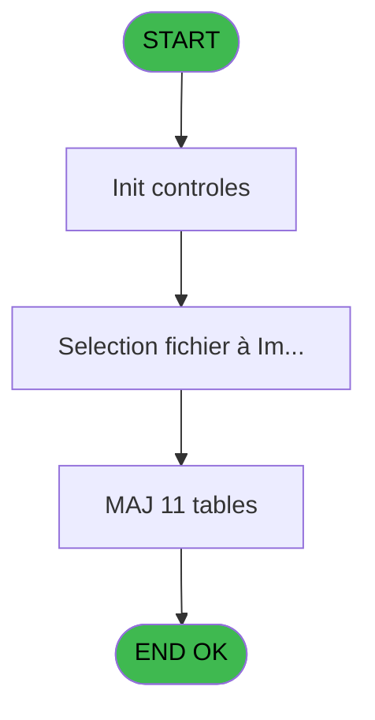
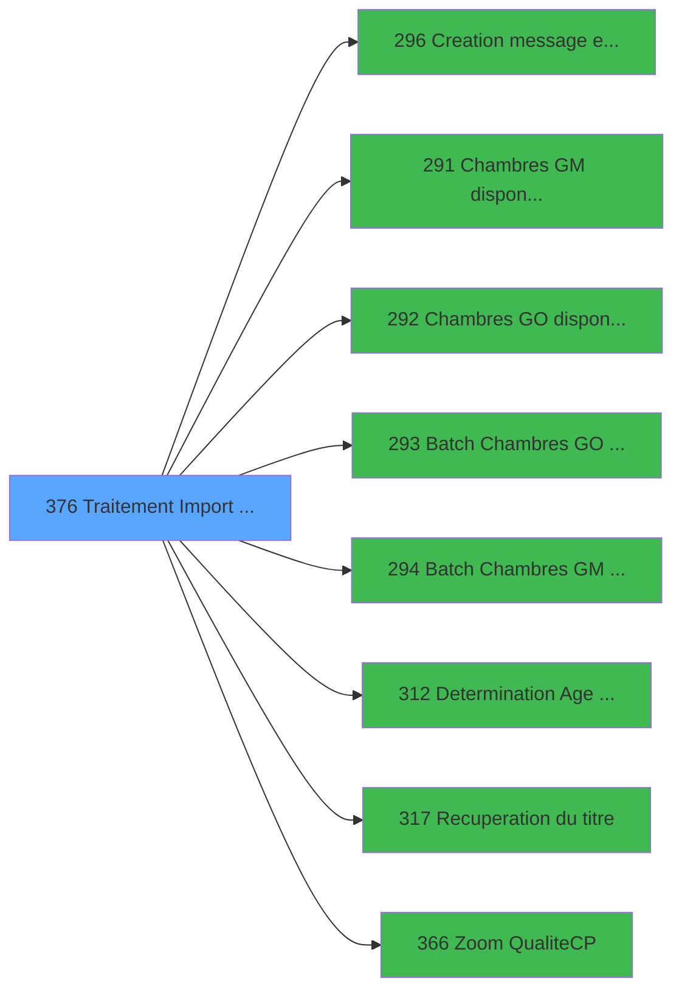

# PBG IDE 376 - Traitement Import Personnel SA

> **Analyse**: Phases 1-4 2026-02-03 11:31 -> 11:31 (18s) | Assemblage 11:31
> **Pipeline**: V7.2 Enrichi
> **Structure**: 4 onglets (Resume | Ecrans | Donnees | Connexions)

<!-- TAB:Resume -->

## 1. FICHE D'IDENTITE

| Attribut | Valeur |
|----------|--------|
| Projet | PBG |
| IDE Position | 376 |
| Nom Programme | Traitement Import Personnel SA |
| Fichier source | `Prg_376.xml` |
| Dossier IDE | General |
| Taches | 31 (6 ecrans visibles) |
| Tables modifiees | 11 |
| Programmes appeles | 8 |
| :warning: Statut | **ORPHELIN_POTENTIEL** |

## 2. DESCRIPTION FONCTIONNELLE

**Traitement Import Personnel SA** assure la gestion complete de ce processus.

Le flux de traitement s'organise en **5 blocs fonctionnels** :

- **Traitement** (16 taches) : traitements metier divers
- **Creation** (5 taches) : insertion d'enregistrements en base (mouvements, prestations)
- **Calcul** (4 taches) : calculs de montants, stocks ou compteurs
- **Validation** (3 taches) : controles et verifications de coherence
- **Consultation** (3 taches) : ecrans de recherche, selection et consultation

**Donnees modifiees** : 11 tables en ecriture (gm-recherche_____gmr, gm-complet_______gmc, hebergement______heb, personnel_go______go, compte_gm________cgm, compteurs________cpt, fichier_validation, tairejet, special_offers, entete_facture_tva, annulation_vente).

Detail : phases du traitement

#### Phase 1 : Traitement (16 taches)

- **376** - (sans nom) **[[ECRAN]](#ecran-t1)**
- **376.1** - Import Personnel GO **[[ECRAN]](#ecran-t3)**
- **376.1.1** - Visualisation import effectués **[[ECRAN]](#ecran-t35)**
- **376.2** - Importation - (Création) **[[ECRAN]](#ecran-t36)**
- **376.4** - Lecture Sequence
- **376.5** - Lecture Sequence
- **376.7** - Import (Màj) **[[ECRAN]](#ecran-t53)**
- **376.7.1** - Maj du Fichier
- **376.8** - Affectation Automatique **[[ECRAN]](#ecran-t104)**
- **376.10** - (sans nom)
- **376.11** - Import Personnel GO **[[ECRAN]](#ecran-t130)**
- **376.11.1** - Erreur **[[ECRAN]](#ecran-t131)**
- **376.12** - Maj Fonctions / Seervice **[[ECRAN]](#ecran-t147)**
- **376.12.1** - Maj Civilité / Nationalité
- **376.9.13** - gm chambre
- **376.9.14** - Determination age bebe

Delegue a : [Chambres GM disponibles (IDE 291)](PBG-IDE-291.md), [Chambres GO disponibles (IDE 292)](PBG-IDE-292.md), [Batch Chambres GO dispo (IDE 293)](PBG-IDE-293.md), [Batch Chambres GM dispo (IDE 294)](PBG-IDE-294.md), [Determination Age Debut Sejour (IDE 312)](PBG-IDE-312.md), [Recuperation du titre (IDE 317)](PBG-IDE-317.md)

#### Phase 2 : Creation (5 taches)

- **376.3** - Creation Import sequence **[[ECRAN]](#ecran-t37)**
- **376.9** - Creation des Tables **[[ECRAN]](#ecran-t108)**
- **376.9.5** - Creation Gm Complet
- **376.9.8** - Creation Hebergement **[[ECRAN]](#ecran-t116)**
- **376.9.9** - Creation Hebergement **[[ECRAN]](#ecran-t123)**

Delegue a : [Creation message erreur Import (IDE 296)](PBG-IDE-296.md)

#### Phase 3 : Consultation (3 taches)

- **376.6** - Recherche Chambre **[[ECRAN]](#ecran-t48)**
- **376.9.6** - Creation Gm Recherche
- **376.9.10** - Creation Gm Recherche

Delegue a : [Recuperation du titre (IDE 317)](PBG-IDE-317.md), [Zoom Qualite(C/P) (IDE 366)](PBG-IDE-366.md)

#### Phase 4 : Calcul (4 taches)

- **376.9.1** - Attribution Compte
- **376.9.2** - Attribution Compte
- **376.9.3** - Creation Compte
- **376.9.4** - Creaton Compte GO

#### Phase 5 : Validation (3 taches)

- **376.9.7** - Creation Validation
- **376.9.11** - Creation Validation
- **376.9.12** - Creation Validation

#### Tables impactees

| Table | Operations | Role metier |
|-------|-----------|-------------|
| special_offers | **W**/L (8 usages) |  |
| entete_facture_tva | R/**W** (4 usages) |  |
| hebergement______heb | **W** (3 usages) | Hebergement (chambres) |
| fichier_validation | **W** (2 usages) |  |
| gm-recherche_____gmr | **W** (2 usages) | Index de recherche |
| compteurs________cpt | **W** (2 usages) | Comptes GM (generaux) |
| gm-complet_______gmc | **W** (1 usages) |  |
| annulation_vente | **W** (1 usages) | Donnees de ventes |
| compte_gm________cgm | **W** (1 usages) | Comptes GM (generaux) |
| tairejet | **W** (1 usages) |  |
| personnel_go______go | **W** (1 usages) |  |

## 3. BLOCS FONCTIONNELS

### 3.1 Traitement (16 taches)

Traitements internes.

---

#### 376 - (sans nom) [[ECRAN]](#ecran-t1)

**Role** : Tache d'orchestration : point d'entree du programme (16 sous-taches). Coordonne l'enchainement des traitements.
**Ecran** : 175 x 90 DLU (MDI) | [Voir mockup](#ecran-t1)

15 sous-taches directes

| Tache | Nom | Bloc |
|-------|-----|------|
| [376.1](#t3) | Import Personnel GO **[[ECRAN]](#ecran-t3)** | Traitement |
| [376.1.1](#t35) | Visualisation import effectués **[[ECRAN]](#ecran-t35)** | Traitement |
| [376.2](#t36) | Importation - (Création) **[[ECRAN]](#ecran-t36)** | Traitement |
| [376.4](#t38) | Lecture Sequence | Traitement |
| [376.5](#t44) | Lecture Sequence | Traitement |
| [376.7](#t53) | Import (Màj) **[[ECRAN]](#ecran-t53)** | Traitement |
| [376.7.1](#t54) | Maj du Fichier | Traitement |
| [376.8](#t104) | Affectation Automatique **[[ECRAN]](#ecran-t104)** | Traitement |
| [376.10](#t127) | (sans nom) | Traitement |
| [376.11](#t130) | Import Personnel GO **[[ECRAN]](#ecran-t130)** | Traitement |
| [376.11.1](#t131) | Erreur **[[ECRAN]](#ecran-t131)** | Traitement |
| [376.12](#t147) | Maj Fonctions / Seervice **[[ECRAN]](#ecran-t147)** | Traitement |
| [376.12.1](#t150) | Maj Civilité / Nationalité | Traitement |
| [376.9.13](#t166) | gm chambre | Traitement |
| [376.9.14](#t167) | Determination age bebe | Traitement |

---

#### 376.1 - Import Personnel GO [[ECRAN]](#ecran-t3)

**Role** : Traitement : Import Personnel GO.
**Ecran** : 1182 x 293 DLU (MDI) | [Voir mockup](#ecran-t3)

---

#### 376.1.1 - Visualisation import effectués [[ECRAN]](#ecran-t35)

**Role** : Traitement : Visualisation import effectués.
**Ecran** : 579 x 142 DLU | [Voir mockup](#ecran-t35)

---

#### 376.2 - Importation - (Création) [[ECRAN]](#ecran-t36)

**Role** : Traitement : Importation - (Création).
**Ecran** : 351 x 89 DLU | [Voir mockup](#ecran-t36)

---

#### 376.4 - Lecture Sequence

**Role** : Traitement : Lecture Sequence.
**Variables liees** : H (W0-Num Sequence), R (Numero sequence)

---

#### 376.5 - Lecture Sequence

**Role** : Traitement : Lecture Sequence.
**Variables liees** : H (W0-Num Sequence), R (Numero sequence)

---

#### 376.7 - Import (Màj) [[ECRAN]](#ecran-t53)

**Role** : Traitement : Import (Màj).
**Ecran** : 351 x 89 DLU | [Voir mockup](#ecran-t53)

---

#### 376.7.1 - Maj du Fichier

**Role** : Traitement : Maj du Fichier.
**Variables liees** : N (Nom Fichier)

---

#### 376.8 - Affectation Automatique [[ECRAN]](#ecran-t104)

**Role** : Traitement : Affectation Automatique.
**Ecran** : 332 x 433 DLU | [Voir mockup](#ecran-t104)

---

#### 376.10 - (sans nom)

**Role** : Traitement interne.

---

#### 376.11 - Import Personnel GO [[ECRAN]](#ecran-t130)

**Role** : Traitement : Import Personnel GO.
**Ecran** : 841 x 460 DLU | [Voir mockup](#ecran-t130)

---

#### 376.11.1 - Erreur [[ECRAN]](#ecran-t131)

**Role** : Traitement : Erreur.
**Ecran** : 369 x 162 DLU | [Voir mockup](#ecran-t131)

---

#### 376.12 - Maj Fonctions / Seervice [[ECRAN]](#ecran-t147)

**Role** : Traitement : Maj Fonctions / Seervice.
**Ecran** : 1226 x 457 DLU | [Voir mockup](#ecran-t147)

---

#### 376.12.1 - Maj Civilité / Nationalité

**Role** : Traitement : Maj Civilité / Nationalité.

---

#### 376.9.13 - gm chambre

**Role** : Traitement : gm chambre.

---

#### 376.9.14 - Determination age bebe

**Role** : Traitement : Determination age bebe.

### 3.2 Creation (5 taches)

Insertion de nouveaux enregistrements en base.

---

#### 376.3 - Creation Import sequence [[ECRAN]](#ecran-t37)

**Role** : Creation d'enregistrement : Creation Import sequence.
**Ecran** : 554 x 259 DLU | [Voir mockup](#ecran-t37)
**Variables liees** : H (W0-Num Sequence), R (Numero sequence)
**Delegue a** : [Creation message erreur Import (IDE 296)](PBG-IDE-296.md)

---

#### 376.9 - Creation des Tables [[ECRAN]](#ecran-t108)

**Role** : Creation d'enregistrement : Creation des Tables.
**Ecran** : 331 x 89 DLU | [Voir mockup](#ecran-t108)
**Delegue a** : [Creation message erreur Import (IDE 296)](PBG-IDE-296.md)

---

#### 376.9.5 - Creation Gm Complet

**Role** : Creation d'enregistrement : Creation Gm Complet.
**Delegue a** : [Creation message erreur Import (IDE 296)](PBG-IDE-296.md)

---

#### 376.9.8 - Creation Hebergement [[ECRAN]](#ecran-t116)

**Role** : Creation d'enregistrement : Creation Hebergement.
**Ecran** : 581 x 378 DLU | [Voir mockup](#ecran-t116)
**Delegue a** : [Creation message erreur Import (IDE 296)](PBG-IDE-296.md)

---

#### 376.9.9 - Creation Hebergement [[ECRAN]](#ecran-t123)

**Role** : Creation d'enregistrement : Creation Hebergement.
**Ecran** : 581 x 378 DLU | [Voir mockup](#ecran-t123)
**Delegue a** : [Creation message erreur Import (IDE 296)](PBG-IDE-296.md)

### 3.3 Consultation (3 taches)

Ecrans de recherche et consultation.

---

#### 376.6 - Recherche Chambre [[ECRAN]](#ecran-t48)

**Role** : Traitement : Recherche Chambre.
**Ecran** : 351 x 89 DLU | [Voir mockup](#ecran-t48)
**Variables liees** : G (W0-Recherche)
**Delegue a** : [Zoom Qualite(C/P) (IDE 366)](PBG-IDE-366.md)

---

#### 376.9.6 - Creation Gm Recherche

**Role** : Creation d'enregistrement : Creation Gm Recherche.
**Variables liees** : G (W0-Recherche)
**Delegue a** : [Creation message erreur Import (IDE 296)](PBG-IDE-296.md), [Zoom Qualite(C/P) (IDE 366)](PBG-IDE-366.md)

---

#### 376.9.10 - Creation Gm Recherche

**Role** : Creation d'enregistrement : Creation Gm Recherche.
**Variables liees** : G (W0-Recherche)
**Delegue a** : [Creation message erreur Import (IDE 296)](PBG-IDE-296.md), [Zoom Qualite(C/P) (IDE 366)](PBG-IDE-366.md)

### 3.4 Calcul (4 taches)

Calculs metier : montants, stocks, compteurs.

---

#### 376.9.1 - Attribution Compte

**Role** : Traitement : Attribution Compte.
**Variables liees** : K (W0-Numero Compte)

---

#### 376.9.2 - Attribution Compte

**Role** : Traitement : Attribution Compte.
**Variables liees** : K (W0-Numero Compte)

---

#### 376.9.3 - Creation Compte

**Role** : Creation d'enregistrement : Creation Compte.
**Variables liees** : K (W0-Numero Compte)
**Delegue a** : [Creation message erreur Import (IDE 296)](PBG-IDE-296.md)

---

#### 376.9.4 - Creaton Compte GO

**Role** : Traitement : Creaton Compte GO.
**Variables liees** : K (W0-Numero Compte)

### 3.5 Validation (3 taches)

Controles de coherence : 3 taches verifient les donnees et conditions.

---

#### 376.9.7 - Creation Validation

**Role** : Verification : Creation Validation.
**Variables liees** : M (W0-validation), P (Type Validation), Q (Type de Validation)
**Delegue a** : [Creation message erreur Import (IDE 296)](PBG-IDE-296.md)

---

#### 376.9.11 - Creation Validation

**Role** : Verification : Creation Validation.
**Variables liees** : M (W0-validation), P (Type Validation), Q (Type de Validation)
**Delegue a** : [Creation message erreur Import (IDE 296)](PBG-IDE-296.md)

---

#### 376.9.12 - Creation Validation

**Role** : Verification : Creation Validation.
**Variables liees** : M (W0-validation), P (Type Validation), Q (Type de Validation)
**Delegue a** : [Creation message erreur Import (IDE 296)](PBG-IDE-296.md)

## 5. REGLES METIER

*(Aucune regle metier identifiee)*

## 6. CONTEXTE

- **Appele par**: (aucun)
- **Appelle**: 8 programmes | **Tables**: 17 (W:11 R:4 L:5) | **Taches**: 31 | **Expressions**: 13

<!-- TAB:Ecrans -->

## 8. ECRANS

### 8.1 Forms visibles (6 / 31)

| # | Position | Tache | Nom | Type | Largeur | Hauteur | Bloc |
|---|----------|-------|-----|------|---------|---------|------|
| 1 | 376.1 | 376.1 | Import Personnel GO | MDI | 1182 | 293 | Traitement |
| 2 | 376.1.1 | 376.1.1 | Visualisation import effectués | Type0 | 579 | 142 | Traitement |
| 3 | 376.3 | 376.7 | Import (Màj) | Type0 | 351 | 89 | Traitement |
| 4 | 376.11 | 376.9 | Creation des Tables | Type0 | 331 | 89 | Creation |
| 5 | 376.8 | 376.11 | Import Personnel GO | Type0 | 841 | 460 | Traitement |
| 6 | 376.8.1 | 376.11.1 | Erreur | Type0 | 369 | 162 | Traitement |

### 8.2 Mockups Ecrans

---

#### 376.1 - Import Personnel GO
**Tache** : [376.1](#t3) | **Type** : MDI | **Dimensions** : 1182 x 293 DLU
**Bloc** : Traitement | **Titre IDE** : Import Personnel GO

<!-- FORM-DATA:
{
    "width":  1182,
    "vFactor":  8,
    "type":  "MDI",
    "hFactor":  8,
    "controls":  [
                     {
                         "x":  1,
                         "type":  "label",
                         "var":  "",
                         "y":  0,
                         "w":  1158,
                         "fmt":  "",
                         "name":  "",
                         "h":  21,
                         "color":  "",
                         "text":  "",
                         "parent":  null
                     },
                     {
                         "x":  0,
                         "type":  "label",
                         "var":  "",
                         "y":  271,
                         "w":  1158,
                         "fmt":  "",
                         "name":  "",
                         "h":  21,
                         "color":  "",
                         "text":  "",
                         "parent":  null
                     },
                     {
                         "x":  178,
                         "type":  "label",
                         "var":  "",
                         "y":  72,
                         "w":  184,
                         "fmt":  "",
                         "name":  "",
                         "h":  9,
                         "color":  "42",
                         "text":  "Nom du fichier à traiter",
                         "parent":  null
                     },
                     {
                         "x":  178,
                         "type":  "label",
                         "var":  "",
                         "y":  44,
                         "w":  184,
                         "fmt":  "",
                         "name":  "",
                         "h":  9,
                         "color":  "42",
                         "text":  "Validation automatique",
                         "parent":  null
                     },
                     {
                         "x":  6,
                         "type":  "line",
                         "var":  "",
                         "y":  119,
                         "w":  1156,
                         "fmt":  "",
                         "name":  "",
                         "h":  0,
                         "color":  "",
                         "text":  "",
                         "parent":  null
                     },
                     {
                         "x":  1021,
                         "type":  "button",
                         "var":  "",
                         "y":  78,
                         "w":  154,
                         "fmt":  "Importer",
                         "name":  "B_Importer",
                         "h":  18,
                         "color":  "",
                         "text":  "",
                         "parent":  null
                     },
                     {
                         "x":  9,
                         "type":  "edit",
                         "var":  "",
                         "y":  6,
                         "w":  395,
                         "fmt":  "30",
                         "name":  "",
                         "h":  8,
                         "color":  "",
                         "text":  "",
                         "parent":  1
                     },
                     {
                         "x":  914,
                         "type":  "edit",
                         "var":  "",
                         "y":  6,
                         "w":  232,
                         "fmt":  "WWW DD MMM YYYYT",
                         "name":  "",
                         "h":  8,
                         "color":  "",
                         "text":  "",
                         "parent":  1
                     },
                     {
                         "x":  5,
                         "type":  "image",
                         "var":  "",
                         "y":  71,
                         "w":  165,
                         "fmt":  "",
                         "name":  "",
                         "h":  37,
                         "color":  "",
                         "text":  "",
                         "parent":  null
                     },
                     {
                         "x":  1,
                         "type":  "image",
                         "var":  "",
                         "y":  23,
                         "w":  163,
                         "fmt":  "",
                         "name":  "",
                         "h":  44,
                         "color":  "",
                         "text":  "",
                         "parent":  null
                     },
                     {
                         "x":  19,
                         "type":  "button",
                         "var":  "",
                         "y":  273,
                         "w":  154,
                         "fmt":  "\u0026Quitter",
                         "name":  "",
                         "h":  18,
                         "color":  "",
                         "text":  "",
                         "parent":  6
                     },
                     {
                         "x":  179,
                         "type":  "edit",
                         "var":  "",
                         "y":  82,
                         "w":  781,
                         "fmt":  "",
                         "name":  "",
                         "h":  10,
                         "color":  "",
                         "text":  "",
                         "parent":  null
                     },
                     {
                         "x":  974,
                         "type":  "button",
                         "var":  "",
                         "y":  82,
                         "w":  38,
                         "fmt":  "...",
                         "name":  "v.zoom fichier import",
                         "h":  10,
                         "color":  "",
                         "text":  "",
                         "parent":  null
                     },
                     {
                         "x":  178,
                         "type":  "combobox",
                         "var":  "",
                         "y":  55,
                         "w":  192,
                         "fmt":  "",
                         "name":  "Validation",
                         "h":  12,
                         "color":  "",
                         "text":  "O,N",
                         "parent":  null
                     },
                     {
                         "x":  6,
                         "type":  "subform",
                         "var":  "",
                         "y":  122,
                         "w":  1173,
                         "fmt":  "",
                         "name":  "Visu Import",
                         "h":  144,
                         "color":  "",
                         "text":  "",
                         "parent":  null
                     }
                 ],
    "taskId":  "376.1",
    "height":  293
}
-->

<strong>Champs : 4 champs</strong>

| Pos (x,y) | Nom | Variable | Type |
|-----------|-----|----------|------|
| 9,6 | 30 | - | edit |
| 914,6 | WWW DD MMM YYYYT | - | edit |
| 179,82 | (sans nom) | - | edit |
| 178,55 | Validation | - | combobox |

<strong>Boutons : 3 boutons</strong>

| Bouton | Pos (x,y) | Action |
|--------|-----------|--------|
| Importer | 1021,78 | Appel [Creation message erreur Import (IDE 296)](PBG-IDE-296.md) |
| Quitter | 19,273 | Quitte le programme |
| ... | 974,82 | Bouton fonctionnel |

---

#### 376.1.1 - Visualisation import effectués
**Tache** : [376.1.1](#t35) | **Type** : Type0 | **Dimensions** : 579 x 142 DLU
**Bloc** : Traitement | **Titre IDE** : Visualisation import effectués

<!-- FORM-DATA:
{
    "width":  579,
    "vFactor":  8,
    "type":  "Type0",
    "hFactor":  4,
    "controls":  [
                     {
                         "x":  216,
                         "type":  "label",
                         "var":  "",
                         "y":  2,
                         "w":  126,
                         "fmt":  "",
                         "name":  "",
                         "h":  13,
                         "color":  "42",
                         "text":  "Historique des traitements",
                         "parent":  null
                     },
                     {
                         "x":  5,
                         "type":  "table",
                         "var":  "",
                         "name":  "",
                         "titleH":  12,
                         "color":  "110",
                         "w":  569,
                         "y":  16,
                         "fmt":  "",
                         "parent":  null,
                         "text":  "",
                         "rowH":  13,
                         "h":  104,
                         "cols":  [
                                      {
                                          "title":  "Séquence",
                                          "layer":  1,
                                          "w":  56
                                      },
                                      {
                                          "title":  "Date",
                                          "layer":  2,
                                          "w":  64
                                      },
                                      {
                                          "title":  "Heure",
                                          "layer":  3,
                                          "w":  51
                                      },
                                      {
                                          "title":  "Utilisateur",
                                          "layer":  4,
                                          "w":  83
                                      },
                                      {
                                          "title":  "Nom du fichier",
                                          "layer":  5,
                                          "w":  194
                                      },
                                      {
                                          "title":  "Nbre de lignes",
                                          "layer":  6,
                                          "w":  64
                                      },
                                      {
                                          "title":  "Etat ",
                                          "layer":  7,
                                          "w":  40
                                      }
                                  ],
                         "rows":  7
                     },
                     {
                         "x":  9,
                         "type":  "edit",
                         "var":  "",
                         "y":  31,
                         "w":  48,
                         "fmt":  "N9Z",
                         "name":  "impgos_id",
                         "h":  9,
                         "color":  "110",
                         "text":  "",
                         "parent":  42
                     },
                     {
                         "x":  65,
                         "type":  "edit",
                         "var":  "",
                         "y":  31,
                         "w":  54,
                         "fmt":  "##/##/####Z",
                         "name":  "impgos_date_import",
                         "h":  9,
                         "color":  "110",
                         "text":  "",
                         "parent":  42
                     },
                     {
                         "x":  129,
                         "type":  "edit",
                         "var":  "",
                         "y":  31,
                         "w":  47,
                         "fmt":  "HH:MM:SSZ",
                         "name":  "impgos_heure_import",
                         "h":  9,
                         "color":  "110",
                         "text":  "",
                         "parent":  42
                     },
                     {
                         "x":  180,
                         "type":  "edit",
                         "var":  "",
                         "y":  31,
                         "w":  80,
                         "fmt":  "",
                         "name":  "impgos_user",
                         "h":  9,
                         "color":  "110",
                         "text":  "",
                         "parent":  42
                     },
                     {
                         "x":  263,
                         "type":  "edit",
                         "var":  "",
                         "y":  31,
                         "w":  188,
                         "fmt":  "50",
                         "name":  "impgos_nom_fichier",
                         "h":  9,
                         "color":  "110",
                         "text":  "",
                         "parent":  42
                     },
                     {
                         "x":  457,
                         "type":  "edit",
                         "var":  "",
                         "y":  31,
                         "w":  53,
                         "fmt":  "N10Z",
                         "name":  "impgos_nbre_enregistrement",
                         "h":  9,
                         "color":  "110",
                         "text":  "",
                         "parent":  42
                     },
                     {
                         "x":  521,
                         "type":  "edit",
                         "var":  "",
                         "y":  31,
                         "w":  31,
                         "fmt":  "30",
                         "name":  "impgos_etat_import",
                         "h":  9,
                         "color":  "110",
                         "text":  "",
                         "parent":  42
                     },
                     {
                         "x":  498,
                         "type":  "button",
                         "var":  "",
                         "y":  122,
                         "w":  77,
                         "fmt":  "Exécuter",
                         "name":  "B_Valider",
                         "h":  20,
                         "color":  "",
                         "text":  "",
                         "parent":  null
                     }
                 ],
    "taskId":  "376.1.1",
    "height":  142
}
-->

<strong>Champs : 7 champs</strong>

| Pos (x,y) | Nom | Variable | Type |
|-----------|-----|----------|------|
| 9,31 | impgos_id | - | edit |
| 65,31 | impgos_date_import | - | edit |
| 129,31 | impgos_heure_import | - | edit |
| 180,31 | impgos_user | - | edit |
| 263,31 | impgos_nom_fichier | - | edit |
| 457,31 | impgos_nbre_enregistrement | - | edit |
| 521,31 | impgos_etat_import | - | edit |

<strong>Boutons : 1 boutons</strong>

| Bouton | Pos (x,y) | Action |
|--------|-----------|--------|
| Exécuter | 498,122 | Bouton fonctionnel |

---

#### 376.3 - Import (Màj)
**Tache** : [376.7](#t53) | **Type** : Type0 | **Dimensions** : 351 x 89 DLU
**Bloc** : Traitement | **Titre IDE** : Import (Màj)

<!-- FORM-DATA:
{
    "width":  351,
    "vFactor":  8,
    "type":  "Type0",
    "hFactor":  4,
    "controls":  [
                     {
                         "x":  80,
                         "type":  "label",
                         "var":  "",
                         "y":  37,
                         "w":  155,
                         "fmt":  "",
                         "name":  "",
                         "h":  15,
                         "color":  "6",
                         "text":  "Importation du Fichier",
                         "parent":  null
                     },
                     {
                         "x":  235,
                         "type":  "edit",
                         "var":  "",
                         "y":  36,
                         "w":  35,
                         "fmt":  "4",
                         "name":  "",
                         "h":  16,
                         "color":  "6",
                         "text":  "",
                         "parent":  null
                     }
                 ],
    "taskId":  "376.3",
    "height":  89
}
-->

<strong>Champs : 1 champs</strong>

| Pos (x,y) | Nom | Variable | Type |
|-----------|-----|----------|------|
| 235,36 | 4 | - | edit |

---

#### 376.11 - Creation des Tables
**Tache** : [376.9](#t108) | **Type** : Type0 | **Dimensions** : 331 x 89 DLU
**Bloc** : Creation | **Titre IDE** : Creation des Tables

<!-- FORM-DATA:
{
    "width":  331,
    "vFactor":  8,
    "type":  "Type0",
    "hFactor":  4,
    "controls":  [
                     {
                         "x":  84,
                         "type":  "label",
                         "var":  "",
                         "y":  37,
                         "w":  126,
                         "fmt":  "",
                         "name":  "",
                         "h":  15,
                         "color":  "6",
                         "text":  "Création des tables",
                         "parent":  null
                     },
                     {
                         "x":  215,
                         "type":  "edit",
                         "var":  "",
                         "y":  37,
                         "w":  32,
                         "fmt":  "4",
                         "name":  "",
                         "h":  15,
                         "color":  "6",
                         "text":  "",
                         "parent":  null
                     }
                 ],
    "taskId":  "376.11",
    "height":  89
}
-->

<strong>Champs : 1 champs</strong>

| Pos (x,y) | Nom | Variable | Type |
|-----------|-----|----------|------|
| 215,37 | 4 | - | edit |

---

#### 376.8 - Import Personnel GO
**Tache** : [376.11](#t130) | **Type** : Type0 | **Dimensions** : 841 x 460 DLU
**Bloc** : Traitement | **Titre IDE** : Import Personnel GO

<!-- FORM-DATA:
{
    "width":  841,
    "vFactor":  8,
    "type":  "Type0",
    "hFactor":  4,
    "controls":  [
                     {
                         "x":  47,
                         "type":  "table",
                         "var":  "",
                         "name":  "",
                         "titleH":  24,
                         "color":  "110",
                         "w":  746,
                         "y":  26,
                         "fmt":  "",
                         "parent":  null,
                         "text":  "",
                         "rowH":  13,
                         "h":  250,
                         "cols":  [
                                      {
                                          "title":  "Nom",
                                          "layer":  1,
                                          "w":  144
                                      },
                                      {
                                          "title":  "Prénom",
                                          "layer":  2,
                                          "w":  120
                                      },
                                      {
                                          "title":  "Date naissance",
                                          "layer":  3,
                                          "w":  64
                                      },
                                      {
                                          "title":  "Nation.",
                                          "layer":  4,
                                          "w":  32
                                      },
                                      {
                                          "title":  "Date début",
                                          "layer":  5,
                                          "w":  59
                                      },
                                      {
                                          "title":  "Date Fin",
                                          "layer":  6,
                                          "w":  56
                                      },
                                      {
                                          "title":  "Résultat de l\u0027import",
                                          "layer":  7,
                                          "w":  167
                                      },
                                      {
                                          "title":  "Chambre  Attribuée?",
                                          "layer":  8,
                                          "w":  87
                                      }
                                  ],
                         "rows":  8
                     },
                     {
                         "x":  4,
                         "type":  "label",
                         "var":  "",
                         "y":  279,
                         "w":  338,
                         "fmt":  "",
                         "name":  "",
                         "h":  172,
                         "color":  "",
                         "text":  "",
                         "parent":  null
                     },
                     {
                         "x":  6,
                         "type":  "label",
                         "var":  "",
                         "y":  301,
                         "w":  126,
                         "fmt":  "",
                         "name":  "",
                         "h":  10,
                         "color":  "42",
                         "text":  "Numéro de chambre demandée",
                         "parent":  null
                     },
                     {
                         "x":  6,
                         "type":  "label",
                         "var":  "",
                         "y":  283,
                         "w":  90,
                         "fmt":  "",
                         "name":  "",
                         "h":  9,
                         "color":  "42",
                         "text":  "Numéro adhérent",
                         "parent":  null
                     },
                     {
                         "x":  6,
                         "type":  "label",
                         "var":  "",
                         "y":  341,
                         "w":  153,
                         "fmt":  "",
                         "name":  "",
                         "h":  11,
                         "color":  "42",
                         "text":  "Numéro de chambre pré-attribuée GO",
                         "parent":  null
                     },
                     {
                         "x":  4,
                         "type":  "line",
                         "var":  "",
                         "y":  376,
                         "w":  338,
                         "fmt":  "",
                         "name":  "",
                         "h":  0,
                         "color":  "",
                         "text":  "",
                         "parent":  null
                     },
                     {
                         "x":  4,
                         "type":  "line",
                         "var":  "",
                         "y":  314,
                         "w":  338,
                         "fmt":  "",
                         "name":  "",
                         "h":  0,
                         "color":  "",
                         "text":  "",
                         "parent":  null
                     },
                     {
                         "x":  6,
                         "type":  "label",
                         "var":  "",
                         "y":  360,
                         "w":  148,
                         "fmt":  "",
                         "name":  "",
                         "h":  11,
                         "color":  "42",
                         "text":  "Numéro de chambre pré-attribuée GM",
                         "parent":  null
                     },
                     {
                         "x":  606,
                         "type":  "label",
                         "var":  "",
                         "y":  9,
                         "w":  70,
                         "fmt":  "",
                         "name":  "",
                         "h":  12,
                         "color":  "42",
                         "text":  "Statut des chambres",
                         "parent":  null
                     },
                     {
                         "x":  4,
                         "type":  "line",
                         "var":  "",
                         "y":  337,
                         "w":  338,
                         "fmt":  "",
                         "name":  "",
                         "h":  0,
                         "color":  "",
                         "text":  "",
                         "parent":  null
                     },
                     {
                         "x":  8,
                         "type":  "label",
                         "var":  "",
                         "y":  321,
                         "w":  126,
                         "fmt":  "",
                         "name":  "",
                         "h":  10,
                         "color":  "42",
                         "text":  "Id. vendeur",
                         "parent":  null
                     },
                     {
                         "x":  6,
                         "type":  "label",
                         "var":  "",
                         "y":  419,
                         "w":  51,
                         "fmt":  "",
                         "name":  "",
                         "h":  9,
                         "color":  "42",
                         "text":  "Service",
                         "parent":  null
                     },
                     {
                         "x":  6,
                         "type":  "label",
                         "var":  "",
                         "y":  432,
                         "w":  54,
                         "fmt":  "",
                         "name":  "",
                         "h":  9,
                         "color":  "42",
                         "text":  "Fonction",
                         "parent":  null
                     },
                     {
                         "x":  6,
                         "type":  "label",
                         "var":  "",
                         "y":  380,
                         "w":  61,
                         "fmt":  "",
                         "name":  "",
                         "h":  9,
                         "color":  "42",
                         "text":  "Titre",
                         "parent":  null
                     },
                     {
                         "x":  6,
                         "type":  "label",
                         "var":  "",
                         "y":  393,
                         "w":  86,
                         "fmt":  "",
                         "name":  "",
                         "h":  9,
                         "color":  "42",
                         "text":  "Nationalité",
                         "parent":  null
                     },
                     {
                         "x":  6,
                         "type":  "label",
                         "var":  "",
                         "y":  406,
                         "w":  68,
                         "fmt":  "",
                         "name":  "",
                         "h":  11,
                         "color":  "42",
                         "text":  "Qualité",
                         "parent":  null
                     },
                     {
                         "x":  692,
                         "type":  "combobox",
                         "var":  "",
                         "y":  9,
                         "w":  118,
                         "fmt":  "",
                         "name":  "vCombo Chambre Attibuée",
                         "h":  12,
                         "color":  "6",
                         "text":  "1,2,3",
                         "parent":  null
                     },
                     {
                         "x":  51,
                         "type":  "edit",
                         "var":  "",
                         "y":  53,
                         "w":  140,
                         "fmt":  "30",
                         "name":  "imgo_nom_0001",
                         "h":  9,
                         "color":  "6",
                         "text":  "",
                         "parent":  1
                     },
                     {
                         "x":  195,
                         "type":  "edit",
                         "var":  "",
                         "y":  53,
                         "w":  112,
                         "fmt":  "",
                         "name":  "imgo_prenom",
                         "h":  9,
                         "color":  "6",
                         "text":  "",
                         "parent":  1
                     },
                     {
                         "x":  315,
                         "type":  "edit",
                         "var":  "",
                         "y":  53,
                         "w":  49,
                         "fmt":  "",
                         "name":  "imgo_date_naissance",
                         "h":  10,
                         "color":  "6",
                         "text":  "",
                         "parent":  1
                     },
                     {
                         "x":  379,
                         "type":  "edit",
                         "var":  "",
                         "y":  53,
                         "w":  20,
                         "fmt":  "",
                         "name":  "imgo_nationalite",
                         "h":  10,
                         "color":  "6",
                         "text":  "",
                         "parent":  1
                     },
                     {
                         "x":  411,
                         "type":  "edit",
                         "var":  "",
                         "y":  53,
                         "w":  49,
                         "fmt":  "DD/MM/YYYY",
                         "name":  "imgo_date_debut",
                         "h":  10,
                         "color":  "6",
                         "text":  "",
                         "parent":  1
                     },
                     {
                         "x":  470,
                         "type":  "edit",
                         "var":  "",
                         "y":  53,
                         "w":  49,
                         "fmt":  "DD/MM/YYYY",
                         "name":  "imgo_date_fin",
                         "h":  10,
                         "color":  "6",
                         "text":  "",
                         "parent":  1
                     },
                     {
                         "x":  526,
                         "type":  "edit",
                         "var":  "",
                         "y":  53,
                         "w":  80,
                         "fmt":  "20",
                         "name":  "",
                         "h":  7,
                         "color":  "6",
                         "text":  "",
                         "parent":  1
                     },
                     {
                         "x":  609,
                         "type":  "edit",
                         "var":  "",
                         "y":  53,
                         "w":  80,
                         "fmt":  "20",
                         "name":  "",
                         "h":  7,
                         "color":  "6",
                         "text":  "",
                         "parent":  1
                     },
                     {
                         "x":  725,
                         "type":  "checkbox",
                         "var":  "",
                         "y":  53,
                         "w":  14,
                         "fmt":  "",
                         "name":  "imgo_chambre_attribuée",
                         "h":  9,
                         "color":  "6",
                         "text":  "",
                         "parent":  1
                     },
                     {
                         "x":  429,
                         "type":  "subform",
                         "var":  "",
                         "y":  274,
                         "w":  385,
                         "fmt":  "",
                         "name":  "Erreur",
                         "h":  176,
                         "color":  "",
                         "text":  "",
                         "parent":  null
                     },
                     {
                         "x":  168,
                         "type":  "edit",
                         "var":  "",
                         "y":  284,
                         "w":  59,
                         "fmt":  "",
                         "name":  "imgo_compte_adherent",
                         "h":  10,
                         "color":  "1",
                         "text":  "",
                         "parent":  null
                     },
                     {
                         "x":  168,
                         "type":  "edit",
                         "var":  "",
                         "y":  302,
                         "w":  59,
                         "fmt":  "",
                         "name":  "imgo_numero_chambre",
                         "h":  10,
                         "color":  "6",
                         "text":  "",
                         "parent":  null
                     },
                     {
                         "x":  169,
                         "type":  "edit",
                         "var":  "",
                         "y":  321,
                         "w":  56,
                         "fmt":  "",
                         "name":  "imgo_identifiant_vendeur",
                         "h":  9,
                         "color":  "6",
                         "text":  "",
                         "parent":  null
                     },
                     {
                         "x":  235,
                         "type":  "button",
                         "var":  "",
                         "y":  340,
                         "w":  100,
                         "fmt":  "Recherche Chambre",
                         "name":  "v.Affecter Manuellement G_0001",
                         "h":  14,
                         "color":  "",
                         "text":  "",
                         "parent":  null
                     },
                     {
                         "x":  168,
                         "type":  "edit",
                         "var":  "",
                         "y":  341,
                         "w":  59,
                         "fmt":  "",
                         "name":  "imgo_numero_chambre_attri_0001",
                         "h":  10,
                         "color":  "6",
                         "text":  "",
                         "parent":  null
                     },
                     {
                         "x":  235,
                         "type":  "button",
                         "var":  "",
                         "y":  358,
                         "w":  100,
                         "fmt":  "\u0026Recherche Chambre",
                         "name":  "v.Affecter",
                         "h":  14,
                         "color":  "",
                         "text":  "",
                         "parent":  null
                     },
                     {
                         "x":  168,
                         "type":  "edit",
                         "var":  "",
                         "y":  360,
                         "w":  59,
                         "fmt":  "",
                         "name":  "imgo_numero_chbre_attribuee_Gm",
                         "h":  10,
                         "color":  "6",
                         "text":  "",
                         "parent":  null
                     },
                     {
                         "x":  346,
                         "type":  "button",
                         "var":  "",
                         "y":  366,
                         "w":  78,
                         "fmt":  "\u0026Finaliser",
                         "name":  "v.Affecter \\Automatique",
                         "h":  18,
                         "color":  "",
                         "text":  "",
                         "parent":  null
                     },
                     {
                         "x":  109,
                         "type":  "edit",
                         "var":  "",
                         "y":  380,
                         "w":  43,
                         "fmt":  "",
                         "name":  "imgo_titre_sgbd",
                         "h":  10,
                         "color":  "6",
                         "text":  "",
                         "parent":  null
                     },
                     {
                         "x":  154,
                         "type":  "edit",
                         "var":  "",
                         "y":  380,
                         "w":  26,
                         "fmt":  "30",
                         "name":  "",
                         "h":  10,
                         "color":  "",
                         "text":  "",
                         "parent":  null
                     },
                     {
                         "x":  345,
                         "type":  "button",
                         "var":  "",
                         "y":  392,
                         "w":  78,
                         "fmt":  "\u0026Quitter",
                         "name":  "v.Quitter",
                         "h":  18,
                         "color":  "",
                         "text":  "",
                         "parent":  null
                     },
                     {
                         "x":  109,
                         "type":  "edit",
                         "var":  "",
                         "y":  393,
                         "w":  14,
                         "fmt":  "",
                         "name":  "imgo_nationalite_sgbd",
                         "h":  10,
                         "color":  "6",
                         "text":  "",
                         "parent":  null
                     },
                     {
                         "x":  154,
                         "type":  "edit",
                         "var":  "",
                         "y":  393,
                         "w":  183,
                         "fmt":  "",
                         "name":  "libelle",
                         "h":  10,
                         "color":  "",
                         "text":  "",
                         "parent":  null
                     },
                     {
                         "x":  109,
                         "type":  "edit",
                         "var":  "",
                         "y":  406,
                         "w":  43,
                         "fmt":  "",
                         "name":  "imgo_qualite",
                         "h":  10,
                         "color":  "6",
                         "text":  "",
                         "parent":  null
                     },
                     {
                         "x":  109,
                         "type":  "edit",
                         "var":  "",
                         "y":  419,
                         "w":  43,
                         "fmt":  "",
                         "name":  "imgo_service_sgbg",
                         "h":  10,
                         "color":  "6",
                         "text":  "",
                         "parent":  null
                     },
                     {
                         "x":  154,
                         "type":  "edit",
                         "var":  "",
                         "y":  419,
                         "w":  183,
                         "fmt":  "",
                         "name":  "libelle_trente",
                         "h":  10,
                         "color":  "",
                         "text":  "",
                         "parent":  null
                     },
                     {
                         "x":  109,
                         "type":  "edit",
                         "var":  "",
                         "y":  432,
                         "w":  43,
                         "fmt":  "",
                         "name":  "imgo_fonction_sgbd",
                         "h":  10,
                         "color":  "6",
                         "text":  "",
                         "parent":  null
                     },
                     {
                         "x":  154,
                         "type":  "edit",
                         "var":  "",
                         "y":  432,
                         "w":  183,
                         "fmt":  "",
                         "name":  "libelle_trente_0001",
                         "h":  10,
                         "color":  "",
                         "text":  "",
                         "parent":  null
                     }
                 ],
    "taskId":  "376.8",
    "height":  460
}
-->

<strong>Champs : 24 champs</strong>

| Pos (x,y) | Nom | Variable | Type |
|-----------|-----|----------|------|
| 692,9 | vCombo Chambre Attibuée | - | combobox |
| 51,53 | imgo_nom_0001 | - | edit |
| 195,53 | imgo_prenom | - | edit |
| 315,53 | imgo_date_naissance | - | edit |
| 379,53 | imgo_nationalite | - | edit |
| 411,53 | imgo_date_debut | - | edit |
| 470,53 | imgo_date_fin | - | edit |
| 526,53 | 20 | - | edit |
| 609,53 | 20 | - | edit |
| 725,53 | imgo_chambre_attribuée | - | checkbox |
| 168,284 | imgo_compte_adherent | - | edit |
| 168,302 | imgo_numero_chambre | - | edit |
| 169,321 | imgo_identifiant_vendeur | - | edit |
| 168,341 | imgo_numero_chambre_attri_0001 | - | edit |
| 168,360 | imgo_numero_chbre_attribuee_Gm | - | edit |
| 109,380 | imgo_titre_sgbd | - | edit |
| 154,380 | 30 | - | edit |
| 109,393 | imgo_nationalite_sgbd | - | edit |
| 154,393 | libelle | - | edit |
| 109,406 | imgo_qualite | - | edit |
| 109,419 | imgo_service_sgbg | - | edit |
| 154,419 | libelle_trente | - | edit |
| 109,432 | imgo_fonction_sgbd | - | edit |
| 154,432 | libelle_trente_0001 | - | edit |

<strong>Boutons : 4 boutons</strong>

| Bouton | Pos (x,y) | Action |
|--------|-----------|--------|
| Recherche Chambre | 235,340 | Ouvre la selection |
| Recherche Chambre | 235,358 | Ouvre la selection |
| Finaliser | 346,366 | Bouton fonctionnel |
| Quitter | 345,392 | Quitte le programme |

---

#### 376.8.1 - Erreur
**Tache** : [376.11.1](#t131) | **Type** : Type0 | **Dimensions** : 369 x 162 DLU
**Bloc** : Traitement | **Titre IDE** : Erreur

<!-- FORM-DATA:
{
    "width":  369,
    "vFactor":  8,
    "type":  "Type0",
    "hFactor":  4,
    "controls":  [
                     {
                         "x":  2,
                         "type":  "table",
                         "var":  "",
                         "name":  "",
                         "titleH":  12,
                         "color":  "6",
                         "w":  365,
                         "y":  2,
                         "fmt":  "",
                         "parent":  null,
                         "text":  "",
                         "rowH":  10,
                         "h":  157,
                         "cols":  [
                                      {
                                          "title":  "Date",
                                          "layer":  1,
                                          "w":  56
                                      },
                                      {
                                          "title":  "Heure",
                                          "layer":  2,
                                          "w":  42
                                      },
                                      {
                                          "title":  "Chambre",
                                          "layer":  3,
                                          "w":  45
                                      },
                                      {
                                          "title":  "Message",
                                          "layer":  4,
                                          "w":  201
                                      }
                                  ],
                         "rows":  4
                     },
                     {
                         "x":  6,
                         "type":  "edit",
                         "var":  "",
                         "y":  17,
                         "w":  50,
                         "fmt":  "DD/MM/YYYYZ T",
                         "name":  "imgoe_date",
                         "h":  7,
                         "color":  "6",
                         "text":  "",
                         "parent":  1
                     },
                     {
                         "x":  62,
                         "type":  "edit",
                         "var":  "",
                         "y":  17,
                         "w":  37,
                         "fmt":  "HH:MM:SSZ",
                         "name":  "imgoe_heure",
                         "h":  7,
                         "color":  "6",
                         "text":  "",
                         "parent":  1
                     },
                     {
                         "x":  104,
                         "type":  "edit",
                         "var":  "",
                         "y":  17,
                         "w":  40,
                         "fmt":  "",
                         "name":  "imgoe_chambre",
                         "h":  7,
                         "color":  "6",
                         "text":  "",
                         "parent":  1
                     },
                     {
                         "x":  149,
                         "type":  "edit",
                         "var":  "",
                         "y":  17,
                         "w":  196,
                         "fmt":  "",
                         "name":  "imgoe_message",
                         "h":  7,
                         "color":  "6",
                         "text":  "",
                         "parent":  1
                     }
                 ],
    "taskId":  "376.8.1",
    "height":  162
}
-->

<strong>Champs : 4 champs</strong>

| Pos (x,y) | Nom | Variable | Type |
|-----------|-----|----------|------|
| 6,17 | imgoe_date | - | edit |
| 62,17 | imgoe_heure | - | edit |
| 104,17 | imgoe_chambre | - | edit |
| 149,17 | imgoe_message | - | edit |

## 9. NAVIGATION

### 9.1 Enchainement des ecrans

**Detail par enchainement :**

| Depuis | Action | Vers | Retour |
|--------|--------|------|--------|
| Import Personnel GO | Sous-programme | [Creation message erreur Import (IDE 296)](PBG-IDE-296.md) | Retour ecran |
| Import Personnel GO | Sous-programme | [Chambres GM disponibles (IDE 291)](PBG-IDE-291.md) | Retour ecran |
| Import Personnel GO | Sous-programme | [Chambres GO disponibles (IDE 292)](PBG-IDE-292.md) | Retour ecran |
| Import Personnel GO | Sous-programme | [Batch Chambres GO dispo (IDE 293)](PBG-IDE-293.md) | Retour ecran |
| Import Personnel GO | Sous-programme | [Batch Chambres GM dispo (IDE 294)](PBG-IDE-294.md) | Retour ecran |
| Import Personnel GO | Sous-programme | [Determination Age Debut Sejour (IDE 312)](PBG-IDE-312.md) | Retour ecran |
| Import Personnel GO | Recuperation donnees | [Recuperation du titre (IDE 317)](PBG-IDE-317.md) | Retour ecran |
| Import Personnel GO | Selection/consultation | [Zoom Qualite(C/P) (IDE 366)](PBG-IDE-366.md) | Retour ecran |

### 9.3 Structure hierarchique (31 taches)

| Position | Tache | Type | Dimensions | Bloc |
|----------|-------|------|------------|------|
| **376.1** | [**(sans nom)** (376)](#t1) [mockup](#ecran-t1) | MDI | 175x90 | Traitement |
| 376.1.1 | [Import Personnel GO (376.1)](#t3) [mockup](#ecran-t3) | MDI | 1182x293 | |
| 376.1.2 | [Visualisation import effectués (376.1.1)](#t35) [mockup](#ecran-t35) | - | 579x142 | |
| 376.1.3 | [Importation - (Création) (376.2)](#t36) [mockup](#ecran-t36) | - | 351x89 | |
| 376.1.4 | [Lecture Sequence (376.4)](#t38) | - | - | |
| 376.1.5 | [Lecture Sequence (376.5)](#t44) | - | - | |
| 376.1.6 | [Import (Màj) (376.7)](#t53) [mockup](#ecran-t53) | - | 351x89 | |
| 376.1.7 | [Maj du Fichier (376.7.1)](#t54) | - | - | |
| 376.1.8 | [Affectation Automatique (376.8)](#t104) [mockup](#ecran-t104) | - | 332x433 | |
| 376.1.9 | [(sans nom) (376.10)](#t127) | - | - | |
| 376.1.10 | [Import Personnel GO (376.11)](#t130) [mockup](#ecran-t130) | - | 841x460 | |
| 376.1.11 | [Erreur (376.11.1)](#t131) [mockup](#ecran-t131) | - | 369x162 | |
| 376.1.12 | [Maj Fonctions / Seervice (376.12)](#t147) [mockup](#ecran-t147) | - | 1226x457 | |
| 376.1.13 | [Maj Civilité / Nationalité (376.12.1)](#t150) | - | - | |
| 376.1.14 | [gm chambre (376.9.13)](#t166) | - | - | |
| 376.1.15 | [Determination age bebe (376.9.14)](#t167) | - | - | |
| **376.2** | [**Creation Import sequence** (376.3)](#t37) [mockup](#ecran-t37) | - | 554x259 | Creation |
| 376.2.1 | [Creation des Tables (376.9)](#t108) [mockup](#ecran-t108) | - | 331x89 | |
| 376.2.2 | [Creation Gm Complet (376.9.5)](#t113) | - | - | |
| 376.2.3 | [Creation Hebergement (376.9.8)](#t116) [mockup](#ecran-t116) | - | 581x378 | |
| 376.2.4 | [Creation Hebergement (376.9.9)](#t123) [mockup](#ecran-t123) | - | 581x378 | |
| **376.3** | [**Recherche Chambre** (376.6)](#t48) [mockup](#ecran-t48) | - | 351x89 | Consultation |
| 376.3.1 | [Creation Gm Recherche (376.9.6)](#t114) | - | - | |
| 376.3.2 | [Creation Gm Recherche (376.9.10)](#t158) | - | - | |
| **376.4** | [**Attribution Compte** (376.9.1)](#t109) | MDI | - | Calcul |
| 376.4.1 | [Attribution Compte (376.9.2)](#t110) | MDI | - | |
| 376.4.2 | [Creation Compte (376.9.3)](#t111) | MDI | - | |
| 376.4.3 | [Creaton Compte GO (376.9.4)](#t112) | - | - | |
| **376.5** | [**Creation Validation** (376.9.7)](#t115) | - | - | Validation |
| 376.5.1 | [Creation Validation (376.9.11)](#t162) | - | - | |
| 376.5.2 | [Creation Validation (376.9.12)](#t165) | - | - | |

### 9.4 Algorigramme

> **Legende**: Vert = START/END OK | Rouge = END KO | Bleu = Decisions
> *Algorigramme auto-genere. Utiliser `/algorigramme` pour une synthese metier detaillee.*

<!-- TAB:Donnees -->

## 10. TABLES

### Tables utilisees (17)

| ID | Nom | Description | Type | R | W | L | Usages |
|----|-----|-------------|------|---|---|---|--------|
| 30 | gm-recherche_____gmr | Index de recherche | DB |   | **W** |   | 2 |
| 31 | gm-complet_______gmc |  | DB |   | **W** |   | 1 |
| 34 | hebergement______heb | Hebergement (chambres) | DB |   | **W** |   | 3 |
| 35 | personnel_go______go |  | DB |   | **W** |   | 1 |
| 47 | compte_gm________cgm | Comptes GM (generaux) | DB |   | **W** |   | 1 |
| 68 | compteurs________cpt | Comptes GM (generaux) | DB |   | **W** |   | 2 |
| 102 | logement_go______lop |  | DB |   |   | L | 1 |
| 103 | logement_client__loc |  | DB |   |   | L | 1 |
| 113 | tables_village |  | DB | R |   |   | 1 |
| 117 | tables_services | Services / filieres | DB | R |   |   | 3 |
| 119 | tables_pays_tel_ |  | DB | R |   | L | 3 |
| 120 | tables_qualites__qua |  | DB |   |   | L | 1 |
| 131 | fichier_validation |  | DB |   | **W** |   | 2 |
| 455 | tairejet |  | DB |   | **W** |   | 1 |
| 873 | special_offers |  | DB |   | **W** | L | 8 |
| 874 | entete_facture_tva |  | DB | R | **W** |   | 4 |
| 875 | annulation_vente | Donnees de ventes | DB |   | **W** |   | 1 |

### Colonnes par table (11 / 14 tables avec colonnes identifiees)

Table 30 - gm-recherche_____gmr (**W**) - 2 usages

*Table utilisee uniquement en Link ou aucune colonne Real identifiee dans le DataView.*

Table 31 - gm-complet_______gmc (**W**) - 1 usages

*Table utilisee uniquement en Link ou aucune colonne Real identifiee dans le DataView.*

Table 34 - hebergement______heb (**W**) - 3 usages

| Lettre | Variable | Acces | Type |
|--------|----------|-------|------|
| A | P Code Package | W | Alpha |
| B | P Date | W | Date |

Table 35 - personnel_go______go (**W**) - 1 usages

*Table utilisee uniquement en Link ou aucune colonne Real identifiee dans le DataView.*

Table 47 - compte_gm________cgm (**W**) - 1 usages

| Lettre | Variable | Acces | Type |
|--------|----------|-------|------|
| K | W0-Numero Compte | W | Numeric |

Table 68 - compteurs________cpt (**W**) - 2 usages

*Table utilisee uniquement en Link ou aucune colonne Real identifiee dans le DataView.*

Table 113 - tables_village (R) - 1 usages

| Lettre | Variable | Acces | Type |
|--------|----------|-------|------|
| C | I.Village | R | Alpha |

Table 117 - tables_services (R) - 3 usages

| Lettre | Variable | Acces | Type |
|--------|----------|-------|------|
| A | v ServiceReach | R | Alpha |
| B | v FonctionReach | R | Alpha |
| C | v.Flag/Deflag | R | Logical |
| D | v Sélection chambres à affecter | R | Alpha |
| E | v. Chambre | R | Alpha |
| F | v. Emploi | R | Alpha |
| G | v. Qualité | R | Alpha |
| H | v. Contrat | R | Alpha |
| I | v.Affecter Manuellement GO | R | Alpha |
| J | v.Affecter Manuellement GM | R | Alpha |
| K | v.Affecter Automatique | R | Alpha |
| L | vCombo Chambre Attibuée | R | Alpha |
| M | v.Quitter | R | Alpha |

Table 119 - tables_pays_tel_ (R/L) - 3 usages

| Lettre | Variable | Acces | Type |
|--------|----------|-------|------|
| A | v lien code pays normalisé | R | Logical |

Table 131 - fichier_validation (**W**) - 2 usages

| Lettre | Variable | Acces | Type |
|--------|----------|-------|------|
| A | P Nom Fichier Import | W | Alpha |
| C | P.Type Validation | W | Alpha |
| K | v.zoom fichier import | W | Alpha |
| L | v.nom du Fichier import | W | Alpha |
| M | W0-validation | W | Logical |
| N | Nom Fichier | W | Alpha |
| P | Type Validation | W | Alpha |
| Q | Type de Validation | W | Alpha |
| R | Var.Fichier | W | Alpha |

Table 455 - tairejet (**W**) - 1 usages

*Table utilisee uniquement en Link ou aucune colonne Real identifiee dans le DataView.*

Table 873 - special_offers (**W**/L) - 8 usages

| Lettre | Variable | Acces | Type |
|--------|----------|-------|------|
| A | P Nom Fichier Import | W | Alpha |
| B | v Nbre enregistrement lu | W | Numeric |
| C | v.date debut | W | Alpha |
| D | v.date fin | W | Alpha |
| E | v.date de naissance | W | Alpha |
| F | v.date d'arrivée | W | Alpha |

Table 874 - entete_facture_tva (R/**W**) - 4 usages

| Lettre | Variable | Acces | Type |
|--------|----------|-------|------|
| A | B_Valider | W | Alpha |
| B | P.Type Traitement | W | Alpha |
| C | P.Type Validation | W | Alpha |
| D | P.Traitement Creat.Table | W | Logical |
| E | P.Traitement Automatique | W | Logical |

Table 875 - annulation_vente (**W**) - 1 usages

| Lettre | Variable | Acces | Type |
|--------|----------|-------|------|
| A | P.Sequence | W | Numeric |
| B | P.N° Ligne | W | Numeric |

## 11. VARIABLES

### 11.1 Autres (21)

Variables diverses.

| Lettre | Nom | Type | Usage dans |
|--------|-----|------|-----------|
| A | > code logement | Alpha | - |
| B | W0-Code Societe | Alpha | - |
| C | W0-Code Langue | Alpha | - |
| D | W0-Front/Back | Alpha | - |
| E | W0-Fin de Tache | Logical | 1x refs |
| F | W0-Code Suite | Alpha | - |
| G | W0-Recherche | Alpha | - |
| H | W0-Num Sequence | Numeric | - |
| I | W0-Nbre Enregistrement | Numeric | - |
| J | W0-Etat Traitement | Alpha | - |
| K | W0-Numero Compte | Numeric | - |
| L | W0-Numero Adhérent | Numeric | - |
| M | W0-validation | Logical | - |
| N | Nom Fichier | Alpha | - |
| O | Type Traitement | Alpha | - |
| P | Type Validation | Alpha | - |
| Q | Type de Validation | Alpha | - |
| R | Numero sequence | Numeric | [376.3](#t37), [376.4](#t38), [376.5](#t44) |
| S | Viens de ? | Alpha | 1x refs |
| T | Numero de séquence | Numeric | - |
| U | Flag (Oui,Non) | Logical | - |

Toutes les 21 variables (liste complete)

| Cat | Lettre | Nom Variable | Type |
|-----|--------|--------------|------|
| Autre | **A** | > code logement | Alpha |
| Autre | **B** | W0-Code Societe | Alpha |
| Autre | **C** | W0-Code Langue | Alpha |
| Autre | **D** | W0-Front/Back | Alpha |
| Autre | **E** | W0-Fin de Tache | Logical |
| Autre | **F** | W0-Code Suite | Alpha |
| Autre | **G** | W0-Recherche | Alpha |
| Autre | **H** | W0-Num Sequence | Numeric |
| Autre | **I** | W0-Nbre Enregistrement | Numeric |
| Autre | **J** | W0-Etat Traitement | Alpha |
| Autre | **K** | W0-Numero Compte | Numeric |
| Autre | **L** | W0-Numero Adhérent | Numeric |
| Autre | **M** | W0-validation | Logical |
| Autre | **N** | Nom Fichier | Alpha |
| Autre | **O** | Type Traitement | Alpha |
| Autre | **P** | Type Validation | Alpha |
| Autre | **Q** | Type de Validation | Alpha |
| Autre | **R** | Numero sequence | Numeric |
| Autre | **S** | Viens de ? | Alpha |
| Autre | **T** | Numero de séquence | Numeric |
| Autre | **U** | Flag (Oui,Non) | Logical |

## 12. EXPRESSIONS

**13 / 13 expressions decodees (100%)**

### 12.1 Repartition par type

| Type | Expressions | Regles |
|------|-------------|--------|
| CONSTANTE | 3 | 0 |
| OTHER | 5 | 0 |
| CONDITION | 4 | 0 |
| CAST_LOGIQUE | 1 | 0 |

### 12.2 Expressions cles par type

#### CONSTANTE (3 expressions)

| Type | IDE | Expression | Regle |
|------|-----|------------|-------|
| CONSTANTE | 13 | `'1'` | - |
| CONSTANTE | 10 | `'1'` | - |
| CONSTANTE | 8 | `'3'` | - |

#### OTHER (5 expressions)

| Type | IDE | Expression | Regle |
|------|-----|------------|-------|
| OTHER | 11 | `SetCrsr (2)` | - |
| OTHER | 12 | `SetCrsr (1)` | - |
| OTHER | 3 | `W0-Fin de Tache [E]` | - |
| OTHER | 1 | `GetParam ('SOCIETE')` | - |
| OTHER | 2 | `GetParam ('LANGUE')` | - |

#### CONDITION (4 expressions)

| Type | IDE | Expression | Regle |
|------|-----|------------|-------|
| CONDITION | 6 | `Viens de ? [S]='2'` | - |
| CONDITION | 9 | `[Z]='1'` | - |
| CONDITION | 4 | `Numero sequence [R]='1'` | - |
| CONDITION | 5 | `Numero sequence [R]='2'` | - |

#### CAST_LOGIQUE (1 expressions)

| Type | IDE | Expression | Regle |
|------|-----|------------|-------|
| CAST_LOGIQUE | 7 | `'TRUE'LOG` | - |

<!-- TAB:Connexions -->

## 13. GRAPHE D'APPELS

### 13.1 Chaine depuis Main (Callers)

**Chemin**: (pas de callers directs)

### 13.2 Callers

| IDE | Nom Programme | Nb Appels |
|-----|---------------|-----------|
| - | (aucun) | - |

### 13.3 Callees (programmes appeles)

### 13.4 Detail Callees avec contexte

| IDE | Nom Programme | Appels | Contexte |
|-----|---------------|--------|----------|
| [296](PBG-IDE-296.md) | Creation message erreur Import | 2 | Sous-programme |
| [291](PBG-IDE-291.md) | Chambres GM disponibles | 1 | Sous-programme |
| [292](PBG-IDE-292.md) | Chambres GO disponibles | 1 | Sous-programme |
| [293](PBG-IDE-293.md) | Batch Chambres GO dispo | 1 | Sous-programme |
| [294](PBG-IDE-294.md) | Batch Chambres GM dispo | 1 | Sous-programme |
| [312](PBG-IDE-312.md) | Determination Age Debut Sejour | 1 | Sous-programme |
| [317](PBG-IDE-317.md) | Recuperation du titre | 1 | Recuperation donnees |
| [366](PBG-IDE-366.md) | Zoom Qualite(C/P) | 1 | Selection/consultation |

## 14. RECOMMANDATIONS MIGRATION

### 14.1 Profil du programme

| Metrique | Valeur | Impact migration |
|----------|--------|-----------------|
| Lignes de logique | 975 | Programme volumineux |
| Expressions | 13 | Peu de logique |
| Tables WRITE | 11 | Fort impact donnees |
| Sous-programmes | 8 | Dependances moderees |
| Ecrans visibles | 6 | Interface complexe multi-ecrans |
| Code desactive | 0.9% (9 / 975) | Code sain |
| Regles metier | 0 | Pas de regle identifiee |

### 14.2 Plan de migration par bloc

#### Traitement (16 taches: 9 ecrans, 7 traitements)

- **Strategie** : Orchestrateur avec 9 ecrans (Razor/React) et 7 traitements backend (services).
- Les ecrans deviennent des composants UI, les traitements invisibles deviennent des services injectables.
- 8 sous-programme(s) a migrer ou a reutiliser depuis les services existants.
- Decomposer les taches en services unitaires testables.

#### Creation (5 taches: 4 ecrans, 1 traitement)

- **Strategie** : Repository pattern avec Entity Framework Core.
- Insertion via `IRepository<T>.CreateAsync()`

#### Consultation (3 taches: 1 ecran, 2 traitements)

- **Strategie** : Composants de recherche/selection en modales.
- 1 ecran : Recherche Chambre

#### Calcul (4 taches: 0 ecran, 4 traitements)

- **Strategie** : Services de calcul purs (Domain Services).
- Migrer la logique de calcul (stock, compteurs, montants)

#### Validation (3 taches: 0 ecran, 3 traitements)

- **Strategie** : FluentValidation avec validators specifiques.
- Chaque tache de validation -> un validator injectable

### 14.3 Dependances critiques

| Dependance | Type | Appels | Impact |
|------------|------|--------|--------|
| gm-recherche_____gmr | Table WRITE (Database) | 2x | Schema + repository |
| gm-complet_______gmc | Table WRITE (Database) | 1x | Schema + repository |
| hebergement______heb | Table WRITE (Database) | 3x | Schema + repository |
| personnel_go______go | Table WRITE (Database) | 1x | Schema + repository |
| compte_gm________cgm | Table WRITE (Database) | 1x | Schema + repository |
| compteurs________cpt | Table WRITE (Database) | 2x | Schema + repository |
| fichier_validation | Table WRITE (Database) | 2x | Schema + repository |
| tairejet | Table WRITE (Database) | 1x | Schema + repository |
| special_offers | Table WRITE (Database) | 5x | Schema + repository |
| entete_facture_tva | Table WRITE (Database) | 2x | Schema + repository |
| annulation_vente | Table WRITE (Database) | 1x | Schema + repository |
| [Creation message erreur Import (IDE 296)](PBG-IDE-296.md) | Sous-programme | 2x | Haute - Sous-programme |
| [Determination Age Debut Sejour (IDE 312)](PBG-IDE-312.md) | Sous-programme | 1x | Normale - Sous-programme |
| [Recuperation du titre (IDE 317)](PBG-IDE-317.md) | Sous-programme | 1x | Normale - Recuperation donnees |
| [Zoom Qualite(C/P) (IDE 366)](PBG-IDE-366.md) | Sous-programme | 1x | Normale - Selection/consultation |
| [Batch Chambres GM dispo (IDE 294)](PBG-IDE-294.md) | Sous-programme | 1x | Normale - Sous-programme |
| [Chambres GM disponibles (IDE 291)](PBG-IDE-291.md) | Sous-programme | 1x | Normale - Sous-programme |
| [Chambres GO disponibles (IDE 292)](PBG-IDE-292.md) | Sous-programme | 1x | Normale - Sous-programme |
| [Batch Chambres GO dispo (IDE 293)](PBG-IDE-293.md) | Sous-programme | 1x | Normale - Sous-programme |

---
*Spec DETAILED generee par Pipeline V7.2 - 2026-02-03 11:31*
