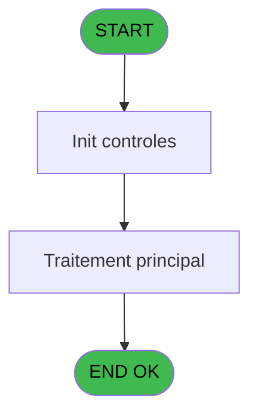

# PBG IDE 377 - effectifs Sejour  SAV from REF

> **Analyse**: Phases 1-4 2026-02-03 11:31 -> 11:32 (17s) | Assemblage 11:32
> **Pipeline**: V7.2 Enrichi
> **Structure**: 4 onglets (Resume | Ecrans | Donnees | Connexions)

<!-- TAB:Resume -->

## 1. FICHE D'IDENTITE

| Attribut | Valeur |
|----------|--------|
| Projet | PBG |
| IDE Position | 377 |
| Nom Programme | effectifs Sejour  SAV from REF |
| Fichier source | `Prg_377.xml` |
| Dossier IDE | General |
| Taches | 3 (0 ecrans visibles) |
| Tables modifiees | 0 |
| Programmes appeles | 0 |
| :warning: Statut | **ORPHELIN_POTENTIEL** |

## 2. DESCRIPTION FONCTIONNELLE

**effectifs Sejour  SAV from REF** assure la gestion complete de ce processus.

Le flux de traitement s'organise en **1 blocs fonctionnels** :

- **Traitement** (3 taches) : traitements metier divers

## 3. BLOCS FONCTIONNELS

### 3.1 Traitement (3 taches)

Traitements internes.

---

#### 377 - effectifs sav

**Role** : Traitement : effectifs sav.

---

#### 377.1 - Création enregs

**Role** : Traitement : Création enregs.

---

#### 377.2 - Création/ modification

**Role** : Traitement : Création/ modification.

## 5. REGLES METIER

*(Aucune regle metier identifiee)*

## 6. CONTEXTE

- **Appele par**: (aucun)
- **Appelle**: 0 programmes | **Tables**: 0 (W:0 R:0 L:0) | **Taches**: 3 | **Expressions**: 17

<!-- TAB:Ecrans -->

## 8. ECRANS

*(Programme sans ecran visible)*

## 9. NAVIGATION

### 9.3 Structure hierarchique (3 taches)

| Position | Tache | Type | Dimensions | Bloc |
|----------|-------|------|------------|------|
| **377.1** | [**effectifs sav** (377)](#t1) | - | - | Traitement |
| 377.1.1 | [Création enregs (377.1)](#t2) | - | - | |
| 377.1.2 | [Création/ modification (377.2)](#t3) | - | - | |

### 9.4 Algorigramme

> **Legende**: Vert = START/END OK | Rouge = END KO | Bleu = Decisions
> *Algorigramme auto-genere. Utiliser `/algorigramme` pour une synthese metier detaillee.*

<!-- TAB:Donnees -->

## 10. TABLES

### Tables utilisees (0)

| ID | Nom | Description | Type | R | W | L | Usages |
|----|-----|-------------|------|---|---|---|--------|

### Colonnes par table (0 / 0 tables avec colonnes identifiees)

## 11. VARIABLES

### 11.1 Parametres entrants (20)

Variables recues en parametre.

| Lettre | Nom | Type | Usage dans |
|--------|-----|------|-----------|
| A | P.Mode (Créatio/Modif/Suppress) | Unicode | - |
| B | P.Société | Unicode | - |
| C | P.compte | Numeric | - |
| D | P.Filiation | Numeric | - |
| E | P.Qualité | Unicode | - |
| F | P.Qualité_compl | Unicode | - |
| G | P.Code_repas_nenc_vil | Unicode | - |
| H | P.date de debut | Date | 2x parametre entrant |
| I | P.date de fin | Date | 1x parametre entrant |
| J | P.heure de début | Time | 2x parametre entrant |
| K | P.Heure de fin | Time | 2x parametre entrant |
| L | P.Nouvelle date de debut pas ut | Date | - |
| M | P. Nouvelle date de fin pas uti | Date | - |
| N | P. Nouvelle heure de début pas | Time | - |
| O | P. Nouvelle Heure de fin pas ut | Time | - |
| P | P.Groupe | Unicode | - |
| Q | P. Quantité (0,1) | Numeric | - |
| R | P.repas | Unicode | 2x parametre entrant |
| S | P .codeOpe(‘V’,’D’) | Unicode | - |
| T | P.Lieu_séjour_test | Unicode | - |

### 11.2 Autres (1)

Variables diverses.

| Lettre | Nom | Type | Usage dans |
|--------|-----|------|-----------|
| U | v_comptage_enregistrement | Numeric | 3x refs |

Toutes les 21 variables (liste complete)

| Cat | Lettre | Nom Variable | Type |
|-----|--------|--------------|------|
| P0 | **A** | P.Mode (Créatio/Modif/Suppress) | Unicode |
| P0 | **B** | P.Société | Unicode |
| P0 | **C** | P.compte | Numeric |
| P0 | **D** | P.Filiation | Numeric |
| P0 | **E** | P.Qualité | Unicode |
| P0 | **F** | P.Qualité_compl | Unicode |
| P0 | **G** | P.Code_repas_nenc_vil | Unicode |
| P0 | **H** | P.date de debut | Date |
| P0 | **I** | P.date de fin | Date |
| P0 | **J** | P.heure de début | Time |
| P0 | **K** | P.Heure de fin | Time |
| P0 | **L** | P.Nouvelle date de debut pas ut | Date |
| P0 | **M** | P. Nouvelle date de fin pas uti | Date |
| P0 | **N** | P. Nouvelle heure de début pas | Time |
| P0 | **O** | P. Nouvelle Heure de fin pas ut | Time |
| P0 | **P** | P.Groupe | Unicode |
| P0 | **Q** | P. Quantité (0,1) | Numeric |
| P0 | **R** | P.repas | Unicode |
| P0 | **S** | P .codeOpe(‘V’,’D’) | Unicode |
| P0 | **T** | P.Lieu_séjour_test | Unicode |
| Autre | **U** | v_comptage_enregistrement | Numeric |

## 12. EXPRESSIONS

**17 / 17 expressions decodees (100%)**

### 12.1 Repartition par type

| Type | Expressions | Regles |
|------|-------------|--------|
| CALCULATION | 1 | 0 |
| CONSTANTE | 5 | 0 |
| CONDITION | 6 | 0 |
| DATE | 1 | 0 |
| FORMAT | 4 | 0 |

### 12.2 Expressions cles par type

#### CALCULATION (1 expressions)

| Type | IDE | Expression | Regle |
|------|-----|------------|-------|
| CALCULATION | 15 | `v_comptage_enregistrement [U]+1` | - |

#### CONSTANTE (5 expressions)

| Type | IDE | Expression | Regle |
|------|-----|------------|-------|
| CONSTANTE | 13 | `'DEJ'` | - |
| CONSTANTE | 14 | `'DIN'` | - |
| CONSTANTE | 8 | `0` | - |
| CONSTANTE | 5 | `'DEJ'` | - |
| CONSTANTE | 6 | `'DIN'` | - |

#### CONDITION (6 expressions)

| Type | IDE | Expression | Regle |
|------|-----|------------|-------|
| CONDITION | 3 | `P.Mode (Créatio/Modif/... [A]='S'` | - |
| CONDITION | 16 | `P.repas [R]='DEJ' OR P.repas [R]='DDE' OR P.repas [R]=''` | - |
| CONDITION | 17 | `P.repas [R]='DIN' OR P.repas [R]='DDE' OR P.repas [R]=''` | - |
| CONDITION | 4 | `AddDate(P.date de debut [H],0,0,v_comptage_enregistrement [U]) <P.date de fin [I]-1` | - |
| CONDITION | 1 | `P.Mode (Créatio/Modif/... [A]='C'` | - |
| ... | | *+1 autres* | |

#### DATE (1 expressions)

| Type | IDE | Expression | Regle |
|------|-----|------------|-------|
| DATE | 7 | `AddDate(P.date de debut [H],0,0,v_comptage_enregistrement [U])` | - |

#### FORMAT (4 expressions)

| Type | IDE | Expression | Regle |
|------|-----|------------|-------|
| FORMAT | 11 | `Val(TStr(P.heure de début [J],'HH'),'2')<=15` | - |
| FORMAT | 12 | `Val(TStr(P.heure de début [J],'HH'),'2')<23` | - |
| FORMAT | 9 | `Val(TStr(P.Heure de fin [K],'HH'),'2')>=20` | - |
| FORMAT | 10 | `Val(TStr(P.Heure de fin [K],'HH'),'2')>=12` | - |

<!-- TAB:Connexions -->

## 13. GRAPHE D'APPELS

### 13.1 Chaine depuis Main (Callers)

**Chemin**: (pas de callers directs)

### 13.2 Callers

| IDE | Nom Programme | Nb Appels |
|-----|---------------|-----------|
| - | (aucun) | - |

### 13.3 Callees (programmes appeles)

### 13.4 Detail Callees avec contexte

| IDE | Nom Programme | Appels | Contexte |
|-----|---------------|--------|----------|
| - | (aucun) | - | - |

## 14. RECOMMANDATIONS MIGRATION

### 14.1 Profil du programme

| Metrique | Valeur | Impact migration |
|----------|--------|-----------------|
| Lignes de logique | 173 | Programme compact |
| Expressions | 17 | Peu de logique |
| Tables WRITE | 0 | Impact faible |
| Sous-programmes | 0 | Peu de dependances |
| Ecrans visibles | 0 | Ecran unique ou traitement batch |
| Code desactive | 0% (0 / 173) | Code sain |
| Regles metier | 0 | Pas de regle identifiee |

### 14.2 Plan de migration par bloc

#### Traitement (3 taches: 0 ecran, 3 traitements)

- **Strategie** : 3 service(s) backend injectable(s) (Domain Services).
- Decomposer les taches en services unitaires testables.

### 14.3 Dependances critiques

| Dependance | Type | Appels | Impact |
|------------|------|--------|--------|

---
*Spec DETAILED generee par Pipeline V7.2 - 2026-02-03 11:32*
