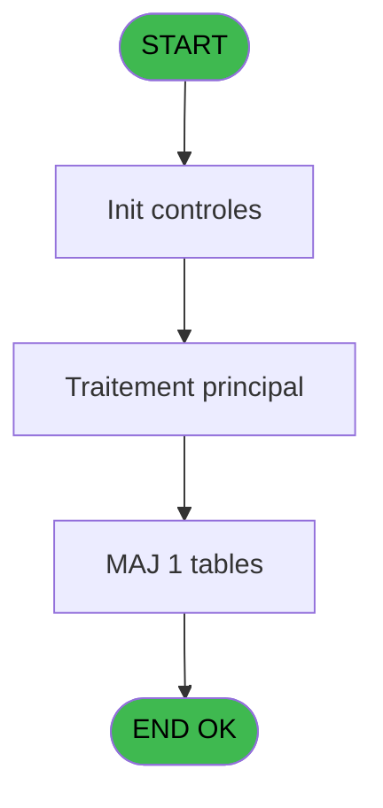
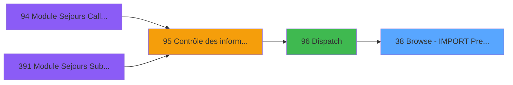
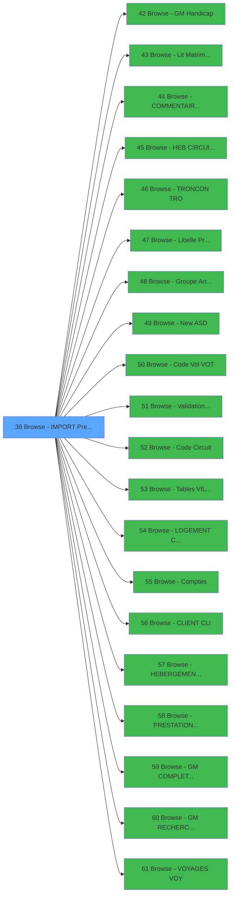

# PBG IDE 38 - Browse - IMPORT PrestationIMP

> **Analyse**: Phases 1-4 2026-02-03 01:24 -> 01:25 (38s) | Assemblage 01:25
> **Pipeline**: V7.2 Enrichi
> **Structure**: 4 onglets (Resume | Ecrans | Donnees | Connexions)

<!-- TAB:Resume -->

## 1. FICHE D'IDENTITE

| Attribut | Valeur |
|----------|--------|
| Projet | PBG |
| IDE Position | 38 |
| Nom Programme | Browse - IMPORT PrestationIMP |
| Fichier source | `Prg_38.xml` |
| Domaine metier | General |
| Taches | 1 (1 ecrans visibles) |
| Tables modifiees | 1 |
| Programmes appeles | 20 |

## 2. DESCRIPTION FONCTIONNELLE

**Browse - IMPORT PrestationIMP** assure la gestion complete de ce processus, accessible depuis [Dispatch (IDE 96)](PBG-IDE-96.md).

Le flux de traitement s'organise en **1 blocs fonctionnels** :

- **Traitement** (1 tache) : traitements metier divers

**Donnees modifiees** : 1 tables en ecriture (tempo_ecran_mecano).

## 3. BLOCS FONCTIONNELS

### 3.1 Traitement (1 tache)

Traitements internes.

---

#### 38 - Browse - IMPORT PrestationIMP [[ECRAN]](#ecran-t1)

**Role** : Traitement : Browse - IMPORT PrestationIMP.
**Ecran** : 780 x 208 DLU (MDI) | [Voir mockup](#ecran-t1)
**Delegue a** : [Browse - GM Handicap (IDE 42)](PBG-IDE-42.md), [Browse - Lit Matrimoniaux (IDE 43)](PBG-IDE-43.md), [Browse - COMMENTAIRE      COM (IDE 44)](PBG-IDE-44.md)

## 5. REGLES METIER

*(Aucune regle metier identifiee)*

## 6. CONTEXTE

- **Appele par**: [Dispatch (IDE 96)](PBG-IDE-96.md)
- **Appelle**: 20 programmes | **Tables**: 1 (W:1 R:0 L:0) | **Taches**: 1 | **Expressions**: 2

<!-- TAB:Ecrans -->

## 8. ECRANS

### 8.1 Forms visibles (1 / 1)

| # | Position | Tache | Nom | Type | Largeur | Hauteur | Bloc |
|---|----------|-------|-----|------|---------|---------|------|
| 1 | 38 | 38 | Browse - IMPORT PrestationIMP | MDI | 780 | 208 | Traitement |

### 8.2 Mockups Ecrans

---

#### 38 - Browse - IMPORT PrestationIMP
**Tache** : [38](#t1) | **Type** : MDI | **Dimensions** : 780 x 208 DLU
**Bloc** : Traitement | **Titre IDE** : Browse - IMPORT PrestationIMP

<!-- FORM-DATA:
{
    "width":  780,
    "vFactor":  8,
    "type":  "MDI",
    "hFactor":  4,
    "controls":  [
                     {
                         "x":  18,
                         "type":  "table",
                         "var":  "",
                         "name":  "",
                         "titleH":  12,
                         "color":  "110",
                         "w":  650,
                         "y":  10,
                         "fmt":  "",
                         "parent":  null,
                         "text":  "",
                         "rowH":  12,
                         "h":  164,
                         "cols":  [
                                      {
                                          "title":  "IMP Username",
                                          "layer":  1,
                                          "w":  66
                                      },
                                      {
                                          "title":  "IMP N° Ressource",
                                          "layer":  2,
                                          "w":  80
                                      },
                                      {
                                          "title":  "IMP Date Debut",
                                          "layer":  3,
                                          "w":  72
                                      },
                                      {
                                          "title":  "IMP Date Fin",
                                          "layer":  4,
                                          "w":  69
                                      },
                                      {
                                          "title":  "IMP Code Prestation",
                                          "layer":  5,
                                          "w":  87
                                      },
                                      {
                                          "title":  "IMP Code Categorie",
                                          "layer":  6,
                                          "w":  80
                                      },
                                      {
                                          "title":  "IMP Libelle Categorie",
                                          "layer":  7,
                                          "w":  178
                                      }
                                  ],
                         "rows":  7
                     },
                     {
                         "x":  22,
                         "type":  "edit",
                         "var":  "",
                         "y":  23,
                         "w":  52,
                         "fmt":  "",
                         "name":  "",
                         "h":  10,
                         "color":  "110",
                         "text":  "",
                         "parent":  1
                     },
                     {
                         "x":  87,
                         "type":  "edit",
                         "var":  "",
                         "y":  23,
                         "w":  30,
                         "fmt":  "",
                         "name":  "",
                         "h":  10,
                         "color":  "110",
                         "text":  "",
                         "parent":  1
                     },
                     {
                         "x":  167,
                         "type":  "edit",
                         "var":  "",
                         "y":  23,
                         "w":  63,
                         "fmt":  "",
                         "name":  "",
                         "h":  10,
                         "color":  "110",
                         "text":  "",
                         "parent":  1
                     },
                     {
                         "x":  239,
                         "type":  "edit",
                         "var":  "",
                         "y":  23,
                         "w":  63,
                         "fmt":  "",
                         "name":  "",
                         "h":  10,
                         "color":  "110",
                         "text":  "",
                         "parent":  1
                     },
                     {
                         "x":  309,
                         "type":  "edit",
                         "var":  "",
                         "y":  23,
                         "w":  41,
                         "fmt":  "",
                         "name":  "",
                         "h":  10,
                         "color":  "110",
                         "text":  "",
                         "parent":  1
                     },
                     {
                         "x":  680,
                         "type":  "button",
                         "var":  "",
                         "y":  7,
                         "w":  100,
                         "fmt":  "Voyage CAFIL007",
                         "name":  "",
                         "h":  14,
                         "color":  "",
                         "text":  "",
                         "parent":  null
                     },
                     {
                         "x":  680,
                         "type":  "button",
                         "var":  "",
                         "y":  24,
                         "w":  100,
                         "fmt":  "GM Rech CAFIL008",
                         "name":  "",
                         "h":  14,
                         "color":  "",
                         "text":  "",
                         "parent":  null
                     },
                     {
                         "x":  680,
                         "type":  "button",
                         "var":  "",
                         "y":  41,
                         "w":  100,
                         "fmt":  "GM Comp CAFIL009",
                         "name":  "",
                         "h":  14,
                         "color":  "",
                         "text":  "",
                         "parent":  null
                     },
                     {
                         "x":  680,
                         "type":  "button",
                         "var":  "",
                         "y":  58,
                         "w":  100,
                         "fmt":  "Prestation CAFIL011",
                         "name":  "",
                         "h":  14,
                         "color":  "",
                         "text":  "",
                         "parent":  null
                     },
                     {
                         "x":  680,
                         "type":  "button",
                         "var":  "",
                         "y":  75,
                         "w":  100,
                         "fmt":  "Heberg CAFIL012",
                         "name":  "",
                         "h":  14,
                         "color":  "",
                         "text":  "",
                         "parent":  null
                     },
                     {
                         "x":  680,
                         "type":  "button",
                         "var":  "",
                         "y":  92,
                         "w":  100,
                         "fmt":  "GM Client CAFIL014",
                         "name":  "",
                         "h":  14,
                         "color":  "",
                         "text":  "",
                         "parent":  null
                     },
                     {
                         "x":  680,
                         "type":  "button",
                         "var":  "",
                         "y":  109,
                         "w":  100,
                         "fmt":  "Compte CAFIL025",
                         "name":  "",
                         "h":  14,
                         "color":  "",
                         "text":  "",
                         "parent":  null
                     },
                     {
                         "x":  680,
                         "type":  "button",
                         "var":  "",
                         "y":  126,
                         "w":  100,
                         "fmt":  "Logem CAFIL086",
                         "name":  "",
                         "h":  14,
                         "color":  "",
                         "text":  "",
                         "parent":  null
                     },
                     {
                         "x":  680,
                         "type":  "button",
                         "var":  "",
                         "y":  143,
                         "w":  100,
                         "fmt":  "Ages CAFIL091",
                         "name":  "",
                         "h":  14,
                         "color":  "",
                         "text":  "",
                         "parent":  null
                     },
                     {
                         "x":  680,
                         "type":  "button",
                         "var":  "",
                         "y":  160,
                         "w":  100,
                         "fmt":  "Circuit CAFIL105",
                         "name":  "",
                         "h":  14,
                         "color":  "",
                         "text":  "",
                         "parent":  null
                     },
                     {
                         "x":  2,
                         "type":  "button",
                         "var":  "",
                         "y":  178,
                         "w":  100,
                         "fmt":  "Valid CAFIL109",
                         "name":  "",
                         "h":  14,
                         "color":  "",
                         "text":  "",
                         "parent":  null
                     },
                     {
                         "x":  115,
                         "type":  "button",
                         "var":  "",
                         "y":  178,
                         "w":  100,
                         "fmt":  "ASD CAFIL111",
                         "name":  "",
                         "h":  14,
                         "color":  "",
                         "text":  "",
                         "parent":  null
                     },
                     {
                         "x":  239,
                         "type":  "button",
                         "var":  "",
                         "y":  178,
                         "w":  100,
                         "fmt":  "Lib Prest CAFIL113",
                         "name":  "",
                         "h":  14,
                         "color":  "",
                         "text":  "",
                         "parent":  null
                     },
                     {
                         "x":  365,
                         "type":  "button",
                         "var":  "",
                         "y":  178,
                         "w":  100,
                         "fmt":  "Circuit CAFIL146",
                         "name":  "",
                         "h":  14,
                         "color":  "",
                         "text":  "",
                         "parent":  null
                     },
                     {
                         "x":  485,
                         "type":  "button",
                         "var":  "",
                         "y":  178,
                         "w":  100,
                         "fmt":  "Lit CAFIL231",
                         "name":  "",
                         "h":  14,
                         "color":  "",
                         "text":  "",
                         "parent":  null
                     },
                     {
                         "x":  2,
                         "type":  "button",
                         "var":  "",
                         "y":  192,
                         "w":  100,
                         "fmt":  "Vol CAFIL110",
                         "name":  "",
                         "h":  14,
                         "color":  "",
                         "text":  "",
                         "parent":  null
                     },
                     {
                         "x":  115,
                         "type":  "button",
                         "var":  "",
                         "y":  192,
                         "w":  100,
                         "fmt":  "Vol CAFIL112",
                         "name":  "",
                         "h":  14,
                         "color":  "",
                         "text":  "",
                         "parent":  null
                     },
                     {
                         "x":  239,
                         "type":  "button",
                         "var":  "",
                         "y":  192,
                         "w":  100,
                         "fmt":  "Tronçon CAFIL145",
                         "name":  "",
                         "h":  14,
                         "color":  "",
                         "text":  "",
                         "parent":  null
                     },
                     {
                         "x":  365,
                         "type":  "button",
                         "var":  "",
                         "y":  192,
                         "w":  100,
                         "fmt":  "Comment CAFIL149",
                         "name":  "",
                         "h":  14,
                         "color":  "",
                         "text":  "",
                         "parent":  null
                     },
                     {
                         "x":  485,
                         "type":  "button",
                         "var":  "",
                         "y":  192,
                         "w":  100,
                         "fmt":  "Handicap CAFIL237",
                         "name":  "",
                         "h":  14,
                         "color":  "",
                         "text":  "",
                         "parent":  null
                     },
                     {
                         "x":  397,
                         "type":  "edit",
                         "var":  "",
                         "y":  23,
                         "w":  20,
                         "fmt":  "",
                         "name":  "imp_code_categorie",
                         "h":  10,
                         "color":  "110",
                         "text":  "",
                         "parent":  1
                     },
                     {
                         "x":  477,
                         "type":  "edit",
                         "var":  "",
                         "y":  23,
                         "w":  171,
                         "fmt":  "",
                         "name":  "imp_libelle_categorie",
                         "h":  10,
                         "color":  "110",
                         "text":  "",
                         "parent":  1
                     }
                 ],
    "taskId":  "38",
    "height":  208
}
-->

<strong>Champs : 7 champs</strong>

| Pos (x,y) | Nom | Variable | Type |
|-----------|-----|----------|------|
| 22,23 | (sans nom) | - | edit |
| 87,23 | (sans nom) | - | edit |
| 167,23 | (sans nom) | - | edit |
| 239,23 | (sans nom) | - | edit |
| 309,23 | (sans nom) | - | edit |
| 397,23 | imp_code_categorie | - | edit |
| 477,23 | imp_libelle_categorie | - | edit |

<strong>Boutons : 20 boutons</strong>

| Bouton | Pos (x,y) | Action |
|--------|-----------|--------|
| Voyage CAFIL007 | 680,7 | Appel [Browse - VOYAGES          VOY (IDE 61)](PBG-IDE-61.md) |
| GM Rech CAFIL008 | 680,24 | Appel [Browse - GM RECHERCHE     GMR (IDE 60)](PBG-IDE-60.md) |
| GM Comp CAFIL009 | 680,41 | Appel [Browse - GM COMPLET       GMC (IDE 59)](PBG-IDE-59.md) |
| Prestation CAFIL011 | 680,58 | Appel [Browse - Libelle Prestation (IDE 47)](PBG-IDE-47.md) |
| Heberg CAFIL012 | 680,75 | Appel [Browse - HEBERGEMENT      HEB (IDE 57)](PBG-IDE-57.md) |
| GM Client CAFIL014 | 680,92 | Identification du client |
| Compte CAFIL025 | 680,109 | Appel [Browse - Comptes (IDE 55)](PBG-IDE-55.md) |
| Logem CAFIL086 | 680,126 | Appel [Browse - LOGEMENT Codes (IDE 54)](PBG-IDE-54.md) |
| Ages CAFIL091 | 680,143 | Appel [Browse - VOYAGES          VOY (IDE 61)](PBG-IDE-61.md) |
| Circuit CAFIL105 | 680,160 | Appel [Browse - HEB CIRCUIT      HCI (IDE 45)](PBG-IDE-45.md) |
| Valid CAFIL109 | 2,178 | Appel [Browse - Validation       VAL (IDE 51)](PBG-IDE-51.md) |
| ASD CAFIL111 | 115,178 | Bouton fonctionnel |
| Lib Prest CAFIL113 | 239,178 | Bouton fonctionnel |
| Circuit CAFIL146 | 365,178 | Appel [Browse - HEB CIRCUIT      HCI (IDE 45)](PBG-IDE-45.md) |
| Lit CAFIL231 | 485,178 | Bouton fonctionnel |
| Vol CAFIL110 | 2,192 | Bouton fonctionnel |
| Vol CAFIL112 | 115,192 | Bouton fonctionnel |
| Tronçon CAFIL145 | 239,192 | Bouton fonctionnel |
| Comment CAFIL149 | 365,192 | Appel [Browse - COMMENTAIRE      COM (IDE 44)](PBG-IDE-44.md) |
| Handicap CAFIL237 | 485,192 | Appel [Browse - GM Handicap (IDE 42)](PBG-IDE-42.md) |

## 9. NAVIGATION

Ecran unique: **Browse - IMPORT PrestationIMP**

### 9.3 Structure hierarchique (1 tache)

| Position | Tache | Type | Dimensions | Bloc |
|----------|-------|------|------------|------|
| **38.1** | [**Browse - IMPORT PrestationIMP** (38)](#t1) [mockup](#ecran-t1) | MDI | 780x208 | Traitement |

### 9.4 Algorigramme

> **Legende**: Vert = START/END OK | Rouge = END KO | Bleu = Decisions
> *Algorigramme auto-genere. Utiliser `/algorigramme` pour une synthese metier detaillee.*

<!-- TAB:Donnees -->

## 10. TABLES

### Tables utilisees (1)

| ID | Nom | Description | Type | R | W | L | Usages |
|----|-----|-------------|------|---|---|---|--------|
| 573 | tempo_ecran_mecano | Table temporaire ecran | TMP |   | **W** |   | 1 |

### Colonnes par table (1 / 1 tables avec colonnes identifiees)

Table 573 - tempo_ecran_mecano (**W**) - 1 usages

| Lettre | Variable | Acces | Type |
|--------|----------|-------|------|
| A | ParamUserName | W | Alpha |
| B | ParamRessource | W | Numeric |

## 11. VARIABLES

### 11.1 Autres (2)

Variables diverses.

| Lettre | Nom | Type | Usage dans |
|--------|-----|------|-----------|
| A | ParamUserName | Alpha | 1x refs |
| B | ParamRessource | Numeric | 1x refs |

## 12. EXPRESSIONS

**2 / 2 expressions decodees (100%)**

### 12.1 Repartition par type

| Type | Expressions | Regles |
|------|-------------|--------|
| OTHER | 2 | 0 |

### 12.2 Expressions cles par type

#### OTHER (2 expressions)

| Type | IDE | Expression | Regle |
|------|-----|------------|-------|
| OTHER | 2 | `ParamRessource [B]` | - |
| OTHER | 1 | `ParamUserName [A]` | - |

<!-- TAB:Connexions -->

## 13. GRAPHE D'APPELS

### 13.1 Chaine depuis Main (Callers)

Main -> ... -> [Dispatch (IDE 96)](PBG-IDE-96.md) -> **Browse - IMPORT PrestationIMP (IDE 38)**

### 13.2 Callers

| IDE | Nom Programme | Nb Appels |
|-----|---------------|-----------|
| [96](PBG-IDE-96.md) | Dispatch | 1 |

### 13.3 Callees (programmes appeles)

### 13.4 Detail Callees avec contexte

| IDE | Nom Programme | Appels | Contexte |
|-----|---------------|--------|----------|
| [42](PBG-IDE-42.md) | Browse - GM Handicap | 1 | Sous-programme |
| [43](PBG-IDE-43.md) | Browse - Lit Matrimoniaux | 1 | Sous-programme |
| [44](PBG-IDE-44.md) | Browse - COMMENTAIRE      COM | 1 | Sous-programme |
| [45](PBG-IDE-45.md) | Browse - HEB CIRCUIT      HCI | 1 | Sous-programme |
| [46](PBG-IDE-46.md) | Browse - TRONCON          TRO | 1 | Sous-programme |
| [47](PBG-IDE-47.md) | Browse - Libelle Prestation | 1 | Sous-programme |
| [48](PBG-IDE-48.md) | Browse - Groupe Arr/Dep.  VOL | 1 | Sous-programme |
| [49](PBG-IDE-49.md) | Browse - New ASD | 1 | Sous-programme |
| [50](PBG-IDE-50.md) | Browse - Code Vol         VOT | 1 | Sous-programme |
| [51](PBG-IDE-51.md) | Browse - Validation       VAL | 1 | Sous-programme |
| [52](PBG-IDE-52.md) | Browse - Code Circuit | 1 | Sous-programme |
| [53](PBG-IDE-53.md) | Browse - Tables VILLAGE | 1 | Sous-programme |
| [54](PBG-IDE-54.md) | Browse - LOGEMENT Codes | 1 | Sous-programme |
| [55](PBG-IDE-55.md) | Browse - Comptes | 1 | Sous-programme |
| [56](PBG-IDE-56.md) | Browse - CLIENT           CLI | 1 | Sous-programme |
| [57](PBG-IDE-57.md) | Browse - HEBERGEMENT      HEB | 1 | Sous-programme |
| [58](PBG-IDE-58.md) | Browse - PRESTATION       PRE | 1 | Sous-programme |
| [59](PBG-IDE-59.md) | Browse - GM COMPLET       GMC | 1 | Sous-programme |
| [60](PBG-IDE-60.md) | Browse - GM RECHERCHE     GMR | 1 | Sous-programme |
| [61](PBG-IDE-61.md) | Browse - VOYAGES          VOY | 1 | Sous-programme |

## 14. RECOMMANDATIONS MIGRATION

### 14.1 Profil du programme

| Metrique | Valeur | Impact migration |
|----------|--------|-----------------|
| Lignes de logique | 31 | Programme compact |
| Expressions | 2 | Peu de logique |
| Tables WRITE | 1 | Impact faible |
| Sous-programmes | 20 | Forte dependance |
| Ecrans visibles | 1 | Ecran unique ou traitement batch |
| Code desactive | 0% (0 / 31) | Code sain |
| Regles metier | 0 | Pas de regle identifiee |

### 14.2 Plan de migration par bloc

#### Traitement (1 tache: 1 ecran, 0 traitement)

- **Strategie** : 1 composant(s) UI (Razor/React) avec formulaires et validation.
- 20 sous-programme(s) a migrer ou a reutiliser depuis les services existants.
- Decomposer les taches en services unitaires testables.

### 14.3 Dependances critiques

| Dependance | Type | Appels | Impact |
|------------|------|--------|--------|
| tempo_ecran_mecano | Table WRITE (Temp) | 1x | Schema + repository |
| [Browse - Comptes (IDE 55)](PBG-IDE-55.md) | Sous-programme | 1x | Normale - Sous-programme |
| [Browse - CLIENT           CLI (IDE 56)](PBG-IDE-56.md) | Sous-programme | 1x | Normale - Sous-programme |
| [Browse - LOGEMENT Codes (IDE 54)](PBG-IDE-54.md) | Sous-programme | 1x | Normale - Sous-programme |
| [Browse - Code Circuit (IDE 52)](PBG-IDE-52.md) | Sous-programme | 1x | Normale - Sous-programme |
| [Browse - Tables VILLAGE (IDE 53)](PBG-IDE-53.md) | Sous-programme | 1x | Normale - Sous-programme |
| [Browse - GM RECHERCHE     GMR (IDE 60)](PBG-IDE-60.md) | Sous-programme | 1x | Normale - Sous-programme |
| [Browse - VOYAGES          VOY (IDE 61)](PBG-IDE-61.md) | Sous-programme | 1x | Normale - Sous-programme |
| [Browse - GM COMPLET       GMC (IDE 59)](PBG-IDE-59.md) | Sous-programme | 1x | Normale - Sous-programme |
| [Browse - HEBERGEMENT      HEB (IDE 57)](PBG-IDE-57.md) | Sous-programme | 1x | Normale - Sous-programme |
| [Browse - PRESTATION       PRE (IDE 58)](PBG-IDE-58.md) | Sous-programme | 1x | Normale - Sous-programme |

---
*Spec DETAILED generee par Pipeline V7.2 - 2026-02-03 01:25*
